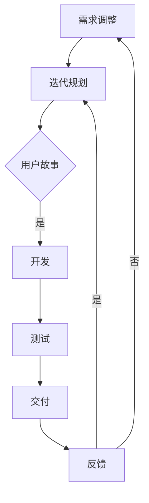

                 

在当今快速变化的技术环境下，敏捷开发已经成为软件开发领域的主流方法。敏捷开发强调快速迭代、持续交付和不断调整，以更好地适应市场需求和用户反馈。本文将深入探讨敏捷开发的原则，并通过具体实践案例展示其在实际项目中的应用。

## 文章关键词
- 敏捷开发
- 敏捷原则
- 持续迭代
- 用户反馈
- 敏捷实践

## 文章摘要
本文旨在介绍敏捷开发的核心原则，包括适应性规划、早期和持续交付、持续反思等。通过实际项目案例分析，我们将探讨敏捷开发的实践过程和工具，并提供一些建议，以帮助开发团队更有效地实施敏捷方法。

## 1. 背景介绍

### 1.1 敏捷开发的起源

敏捷开发起源于20世纪90年代末，作为一种应对快速变化的需求和复杂项目的软件开发方法。它的核心理念是“个体和互动重于流程和工具”，“可工作的软件重于详尽的文档”，“客户合作重于合同谈判”等。

### 1.2 敏捷开发与传统开发方法的区别

传统开发方法，如瀑布模型，往往强调阶段性和顺序性，而敏捷开发则强调灵活性和迭代性。敏捷开发方法更加注重快速响应变化，通过持续交付和不断调整来满足用户需求。

## 2. 核心概念与联系

为了更好地理解敏捷开发，我们首先需要了解其核心概念和架构。以下是一个简化的Mermaid流程图，展示了敏捷开发的核心概念和联系：



### 2.1 核心概念解析

- **需求收集**：敏捷开发强调与用户的紧密合作，持续收集和分析用户需求。
- **迭代规划**：在每次迭代开始前，团队会制定一个迭代计划，确定要完成的用户故事和任务。
- **用户故事**：用户故事是敏捷开发中的核心需求单元，通常以“作为用户，我想做...以便...”的形式编写。
- **开发**：在迭代周期内，开发团队将实现用户故事，并确保其符合质量标准。
- **测试**：敏捷开发强调持续测试，以确保每个迭代交付的软件都是可用的和高质量的。
- **交付**：每次迭代结束时，团队将交付一个可工作的软件版本，供用户使用。
- **反馈**：用户反馈是敏捷开发中不可或缺的一部分，它帮助团队了解用户需求的变化，并调整后续的迭代计划。

## 3. 核心算法原理 & 具体操作步骤

### 3.1 算法原理概述

敏捷开发没有固定的算法，但有一些核心原理指导其运作：

- **适应性规划**：敏捷开发不追求详细的计划，而是根据实际情况不断调整计划。
- **持续交付**：敏捷开发强调持续交付可工作的软件，确保用户可以及时使用新功能。
- **用户反馈**：用户反馈是敏捷开发的核心驱动力，它帮助团队了解用户需求，并不断改进产品。

### 3.2 算法步骤详解

- **1. 需求收集**：通过与用户的沟通，收集用户需求，并将需求分解成用户故事。
- **2. 迭代规划**：在迭代开始前，团队根据用户故事制定迭代计划，确定每个迭代的目标和任务。
- **3. 开发**：在迭代周期内，开发团队实现用户故事，并进行持续测试。
- **4. 测试**：确保每个用户故事都经过严格的测试，确保其质量。
- **5. 交付**：在迭代结束时，将可工作的软件版本交付给用户。
- **6. 反馈**：收集用户反馈，根据反馈调整后续的迭代计划。

### 3.3 算法优缺点

#### 优点

- **灵活性**：敏捷开发能够快速响应需求变化，确保产品始终符合用户需求。
- **高质量**：持续测试和用户反馈有助于提高软件质量。
- **用户参与**：用户参与开发过程，有助于提高用户满意度。

#### 缺点

- **计划难度**：由于需求不断变化，计划制定和执行难度增加。
- **资源需求**：敏捷开发需要持续的资源和投入，以确保每次迭代都能顺利进行。

### 3.4 算法应用领域

敏捷开发适用于大多数软件开发项目，尤其是那些需求变化较快、用户参与度较高的项目。以下是一些常见的应用领域：

- **互联网应用**：敏捷开发适用于互联网应用的快速迭代和更新。
- **移动应用**：敏捷开发适用于移动应用的快速开发和发布。
- **企业应用**：敏捷开发有助于企业应用快速满足市场需求。

## 4. 数学模型和公式 & 详细讲解 & 举例说明

### 4.1 数学模型构建

敏捷开发中的数学模型通常涉及迭代周期（Cycle Time）、用户满意度（User Satisfaction）和资源利用率（Resource Utilization）等关键指标。

### 4.2 公式推导过程

- **迭代周期（Cycle Time）**：迭代周期是每次迭代从开始到结束的时间。其公式为：
  
  $$Cycle\ Time = \frac{Total\ Work}{Number\ of\ Iterations}$$

- **用户满意度（User Satisfaction）**：用户满意度是用户对软件质量的评价。其公式为：

  $$User\ Satisfaction = \frac{Number\ of\ Positive\ Reviews}{Total\ Number\ of\ Reviews}$$

- **资源利用率（Resource Utilization）**：资源利用率是团队资源使用的效率。其公式为：

  $$Resource\ Utilization = \frac{Total\ Work\ Completed}{Total\ Work\ Available}$$

### 4.3 案例分析与讲解

假设一个开发团队在一个为期4周的迭代周期内完成了3个用户故事，其中2个用户故事得到了积极的评价，1个用户故事需要进一步改进。团队在该周期内使用了80%的资源。

- **迭代周期（Cycle Time）**：

  $$Cycle\ Time = \frac{4\ Weeks}{3\ Iterations} = 1.33\ Weeks$$

- **用户满意度（User Satisfaction）**：

  $$User\ Satisfaction = \frac{2\ Positive\ Reviews}{3\ Total\ Reviews} = 0.67$$

- **资源利用率（Resource Utilization）**：

  $$Resource\ Utilization = \frac{3\ User\ Stories\ Completed}{4\ Weeks \times 100\ Hours\ per\ Week} = 0.80$$

通过这个案例，我们可以看到敏捷开发在提高迭代周期、用户满意度和资源利用率方面的效果。

## 5. 项目实践：代码实例和详细解释说明

### 5.1 开发环境搭建

在这个项目中，我们将使用Java语言和Spring Boot框架进行开发。以下是搭建开发环境的基本步骤：

1. 安装Java开发工具包（JDK）。
2. 安装Eclipse IDE。
3. 配置Spring Boot开发工具插件。

### 5.2 源代码详细实现

以下是该项目的主要源代码实现：

```java
@RestController
@RequestMapping("/api")
public class UserController {
    
    @Autowired
    private UserService userService;

    @GetMapping("/users")
    public List<User> getAllUsers() {
        return userService.getAllUsers();
    }

    @GetMapping("/users/{id}")
    public User getUserById(@PathVariable Long id) {
        return userService.getUserById(id);
    }

    @PostMapping("/users")
    public User createUser(@RequestBody User user) {
        return userService.createUser(user);
    }

    @PutMapping("/users/{id}")
    public User updateUser(@PathVariable Long id, @RequestBody User user) {
        return userService.updateUser(id, user);
    }

    @DeleteMapping("/users/{id}")
    public void deleteUser(@PathVariable Long id) {
        userService.deleteUser(id);
    }
}
```

### 5.3 代码解读与分析

这段代码定义了一个用户控制器（UserController），它提供了用户管理的API接口。通过Spring Boot的注解，我们可以实现RESTful风格的接口。

- **@RestController**：表示这是一个控制器类，所有方法都是处理HTTP请求的。
- **@RequestMapping**：用于映射HTTP请求路径。
- **@Autowired**：用于自动注入userService bean。
- **@GetMapping**、**@PostMapping**、**@PutMapping**、**@DeleteMapping**：分别表示处理GET、POST、PUT、DELETE请求的方法。

### 5.4 运行结果展示

在运行该项目后，我们可以使用Postman或其他工具测试用户管理API。以下是一个示例：

- **获取所有用户**：

  ```json
  GET http://localhost:8080/api/users
  
  Response:
  [
    {
      "id": 1,
      "name": "John Doe",
      "email": "john.doe@example.com"
    },
    {
      "id": 2,
      "name": "Jane Doe",
      "email": "jane.doe@example.com"
    }
  ]
  ```

- **获取用户详情**：

  ```json
  GET http://localhost:8080/api/users/1
  
  Response:
  {
    "id": 1,
    "name": "John Doe",
    "email": "john.doe@example.com"
  }
  ```

## 6. 实际应用场景

敏捷开发在多个领域都有广泛应用。以下是一些常见的应用场景：

- **互联网公司**：互联网公司通常采用敏捷开发来快速响应市场需求，持续迭代产品。
- **金融科技**：金融科技公司采用敏捷开发来提高金融服务的效率和用户体验。
- **医疗保健**：医疗保健机构采用敏捷开发来优化医疗流程，提高患者满意度。

## 7. 工具和资源推荐

### 7.1 学习资源推荐

- 《敏捷软件开发：原理、实践与模式》（Agile Software Development: Principles, Patterns, and Practices） - Robert C. Martin
- 《敏捷开发实践指南》（Agile Project Management: Creating Innovative Products） - Jim Highsmith

### 7.2 开发工具推荐

- JIRA：用于项目管理、任务跟踪和敏捷开发实践。
- Git：用于版本控制和团队协作。
- Eclipse：用于Java开发。

### 7.3 相关论文推荐

- "Agile Software Development: The Early Years" - Alistair Cockburn
- "The Principles of Agile Software Development" - Robert C. Martin

## 8. 总结：未来发展趋势与挑战

### 8.1 研究成果总结

敏捷开发在过去几十年中取得了显著成果，已成为软件开发领域的标准方法。许多研究和实践证明了敏捷开发在提高软件质量、降低成本和增强用户满意度方面的优势。

### 8.2 未来发展趋势

未来，敏捷开发将继续向更灵活、更高效的方向发展。随着人工智能和自动化工具的普及，敏捷开发将变得更加智能化和自动化。

### 8.3 面临的挑战

敏捷开发在实施过程中仍面临一些挑战，如团队合作、沟通和计划。此外，敏捷开发对团队和企业的组织文化有较高要求。

### 8.4 研究展望

未来，敏捷开发的研究将主要集中在如何更好地结合人工智能、大数据分析和自动化工具，以实现更高效、更智能的软件开发过程。

## 9. 附录：常见问题与解答

### 9.1 敏捷开发与传统开发方法的区别是什么？

敏捷开发与传统开发方法的主要区别在于其强调灵活性和迭代性。敏捷开发采用持续交付和用户反馈，以快速响应需求变化，而传统开发方法往往采用阶段性交付和固定的需求。

### 9.2 敏捷开发需要哪些工具和技能？

敏捷开发需要使用项目管理工具（如JIRA）、版本控制工具（如Git）和开发环境（如Eclipse）。开发团队需要掌握敏捷开发的原则和实践，以及相关编程技能。

### 9.3 敏捷开发如何应对需求变化？

敏捷开发通过持续迭代和用户反馈来应对需求变化。在每次迭代结束时，团队会根据用户反馈调整需求和计划，确保产品始终符合用户需求。

## 参考文献

- Martin, R. C. (2003). Agile Software Development: Principles, Patterns, and Practices. Prentice Hall.
- Highsmith, J. (2001). Agile Project Management: Creating Innovative Products. Addison-Wesley.

# 作者署名

作者：禅与计算机程序设计艺术 / Zen and the Art of Computer Programming

