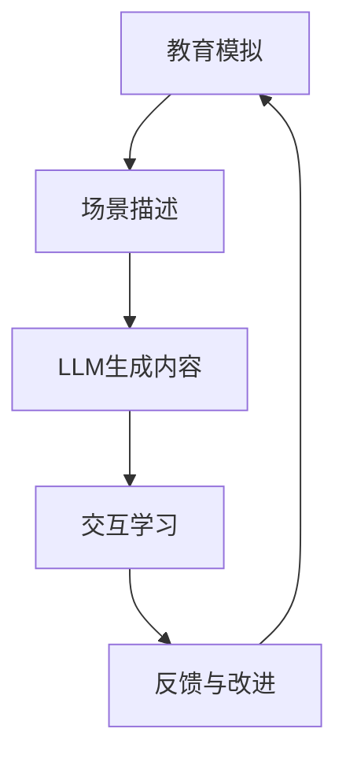

                 

关键词：教育模拟，学习环境，LLM，人工智能，编程，深度学习，计算机科学，教育技术

> 摘要：本文探讨了利用大型语言模型（LLM）增强的教育模拟学习环境的设计与应用。文章首先介绍了教育模拟的基本概念和重要性，随后深入分析了LLM在教育模拟中的应用原理和技术实现。通过具体案例和实践，本文展示了LLM在教育模拟中的强大作用，并对其未来发展进行了展望。

## 1. 背景介绍

在教育领域，模拟技术一直以来都是教学和研究的重要手段。通过模拟，学生能够在虚拟环境中体验真实世界的知识和技能，从而提高学习效果和理解深度。然而，传统的教育模拟技术存在一定的局限性，如模拟环境的复杂度有限、交互性不强等。随着人工智能技术的快速发展，特别是大型语言模型（LLM）的出现，为教育模拟领域带来了新的机遇和挑战。

LLM是一种基于深度学习技术的自然语言处理模型，具有强大的文本生成、理解和推理能力。在人工智能领域，LLM被广泛应用于机器翻译、文本生成、问答系统等任务。近年来，研究人员开始探索将LLM应用于教育模拟领域，通过构建LLM增强的学习环境，为学生提供更加丰富和互动的学习体验。

本文旨在探讨LLM增强的教育模拟学习环境的设计与应用，分析其核心概念、算法原理、数学模型及实际应用案例，并对其未来发展进行展望。

## 2. 核心概念与联系

### 2.1 教育模拟的基本概念

教育模拟是一种通过模拟技术实现教育目标的方法。它通过构建虚拟的学习环境，让学生在模拟的场景中体验知识和技能的学习。教育模拟可以涵盖多个学科领域，如自然科学、社会科学、工程技术等。其基本特点包括：

- **真实感**：教育模拟追求高度的真实感，以帮助学生更好地理解和掌握知识。
- **交互性**：教育模拟强调学生与模拟环境的互动，通过实践操作提高学习效果。
- **灵活性**：教育模拟可以根据教学需求灵活调整，以适应不同的学习目标和内容。

### 2.2 大型语言模型（LLM）的基本原理

LLM是一种基于深度学习技术的自然语言处理模型，通过大规模的文本数据进行训练，能够生成、理解和推理自然语言。LLM的核心结构包括：

- **词嵌入层**：将文本中的单词转换为高维向量，以便在神经网络中进行处理。
- **编码器**：对输入文本进行编码，提取出文本的语义信息。
- **解码器**：根据编码器的输出，生成文本的下一个单词或句子。

LLM的关键技术包括：

- **预训练**：通过预训练，LLM能够从大规模的文本数据中学习到丰富的语言知识。
- **微调**：在预训练的基础上，LLM可以根据特定的任务进行微调，以适应不同的应用场景。

### 2.3 教育模拟与LLM的联系

教育模拟和LLM之间存在紧密的联系。首先，LLM能够为教育模拟提供丰富的文本资源和智能支持。通过LLM，教育模拟可以生成更加逼真的场景描述、问题解答和互动对话，提高学生的学习体验。其次，教育模拟的数据和交互过程可以为LLM提供重要的训练数据，促进LLM的持续优化和改进。

以下是教育模拟与LLM之间联系的一个Mermaid流程图：



## 3. 核心算法原理 & 具体操作步骤

### 3.1 算法原理概述

LLM增强的教育模拟算法主要包括以下几个关键步骤：

1. **场景构建**：根据教学目标，构建模拟场景，包括场景描述、角色设定、任务目标等。
2. **内容生成**：利用LLM生成与场景相关的文本内容，如故事情节、问题设定、解答等。
3. **交互学习**：学生与模拟环境进行互动，通过解决问题、完成任务等方式学习知识。
4. **反馈与改进**：收集学生的反馈数据，用于优化LLM的生成内容和交互策略。

### 3.2 算法步骤详解

#### 3.2.1 场景构建

场景构建是教育模拟的第一步，也是最重要的一步。它决定了模拟环境的基本框架和内容。具体步骤如下：

1. **确定教学目标**：根据教学大纲和课程内容，明确教学目标，如知识点掌握、技能训练等。
2. **设计模拟场景**：根据教学目标，设计模拟场景，包括场景描述、角色设定、任务目标等。场景描述应尽可能逼真，以增强学生的沉浸感。
3. **准备教学材料**：收集和整理与模拟场景相关的教学材料，如文本、图片、音频等。

#### 3.2.2 内容生成

内容生成是利用LLM生成与场景相关的文本内容，包括故事情节、问题设定、解答等。具体步骤如下：

1. **初始化LLM模型**：选择合适的LLM模型，并进行初始化。
2. **输入场景描述**：将构建好的模拟场景描述输入到LLM模型中。
3. **生成文本内容**：利用LLM生成与场景相关的文本内容，如故事情节、问题设定、解答等。
4. **调整和优化**：根据教学需求和反馈，对生成的文本内容进行调整和优化。

#### 3.2.3 交互学习

交互学习是学生与模拟环境进行互动的过程，通过解决问题、完成任务等方式学习知识。具体步骤如下：

1. **展示模拟场景**：将生成的文本内容展示给学生，让学生进入模拟环境。
2. **提出问题**：利用LLM生成与模拟场景相关的问题，并展示给学生。
3. **解答问题**：学生根据问题和场景描述，通过思考和讨论，提出自己的解答。
4. **反馈与评估**：收集学生的解答，利用LLM进行评估，并给出反馈。

#### 3.2.4 反馈与改进

反馈与改进是教育模拟中不可或缺的一环，它能够帮助优化LLM的生成内容和交互策略。具体步骤如下：

1. **收集反馈数据**：收集学生在交互过程中的反馈数据，如问题解答、学习进度等。
2. **分析反馈数据**：对收集到的反馈数据进行分析，找出存在的问题和改进空间。
3. **优化LLM模型**：根据分析结果，对LLM模型进行调整和优化，以提高生成内容和交互效果。
4. **更新模拟场景**：根据优化后的LLM模型，更新模拟场景，以适应新的教学需求和反馈。

### 3.3 算法优缺点

#### 3.3.1 优点

- **高度真实感**：利用LLM生成的文本内容具有高度的真实感，能够增强学生的沉浸感和学习兴趣。
- **灵活性**：教育模拟可以根据教学需求灵活调整，以适应不同的学习目标和内容。
- **个性化**：LLM可以根据学生的学习情况和反馈，生成个性化的学习内容和交互策略。

#### 3.3.2 缺点

- **计算资源消耗**：LLM模型的训练和推理需要大量的计算资源，对硬件设备的要求较高。
- **数据依赖性**：LLM的性能和效果很大程度上取决于训练数据的质量和数量，对数据资源的要求较高。
- **交互限制**：尽管LLM具有强大的自然语言处理能力，但其在某些复杂交互场景中的表现仍有一定的局限性。

### 3.4 算法应用领域

LLM增强的教育模拟算法具有广泛的应用领域，包括但不限于：

- **编程教育**：通过LLM生成编程示例、问题和解答，帮助学生更好地理解和掌握编程知识。
- **科学教育**：利用LLM生成科学实验的描述、问题和解答，让学生在模拟环境中体验科学探究的过程。
- **历史教育**：通过LLM生成历史事件的描述、问题和解答，让学生在模拟环境中体验历史事件的发展。
- **语言学习**：利用LLM生成与语言学习相关的文本内容、问题和解答，帮助学生更好地掌握外语。

## 4. 数学模型和公式 & 详细讲解 & 举例说明

### 4.1 数学模型构建

LLM增强的教育模拟算法涉及多个数学模型，包括自然语言处理模型、优化模型等。以下是其中两个关键数学模型的构建过程：

#### 4.1.1 自然语言处理模型

自然语言处理模型是LLM的核心，其基本结构包括词嵌入层、编码器和解码器。以下是自然语言处理模型的构建步骤：

1. **词嵌入层**：将文本中的单词转换为高维向量。常用的词嵌入方法包括Word2Vec、GloVe等。
2. **编码器**：对输入文本进行编码，提取出文本的语义信息。常用的编码器结构包括RNN、LSTM、GRU等。
3. **解码器**：根据编码器的输出，生成文本的下一个单词或句子。常用的解码器结构包括RNN、LSTM、GRU等。

#### 4.1.2 优化模型

优化模型用于优化LLM的生成内容和交互策略。常见的优化方法包括基于梯度的优化算法、基于遗传算法的优化算法等。以下是优化模型的构建步骤：

1. **目标函数**：定义优化目标函数，如文本生成质量、交互效果等。
2. **损失函数**：选择合适的损失函数，如交叉熵损失函数、均方误差损失函数等。
3. **优化算法**：选择合适的优化算法，如梯度下降算法、遗传算法等。

### 4.2 公式推导过程

以下是自然语言处理模型和优化模型的公式推导过程：

#### 4.2.1 自然语言处理模型

1. **词嵌入层**：

   词嵌入层将文本中的单词转换为高维向量。假设单词表中有 \(V\) 个单词，词向量维度为 \(d\)，则词嵌入层可以表示为：

   $$  
   E = \{e_1, e_2, ..., e_V\}  
   $$

   其中，\(e_i\) 表示单词 \(w_i\) 的词向量。

2. **编码器**：

   编码器对输入文本进行编码，提取出文本的语义信息。假设输入文本为 \(X = [x_1, x_2, ..., x_T]\)，其中 \(x_t\) 表示文本中的第 \(t\) 个单词。编码器的输出可以表示为：

   $$  
   H_t = \sigma(W_h [e_{x_t} + h_{t-1}])  
   $$

   其中，\(W_h\) 为编码器的权重矩阵，\(\sigma\) 为激活函数，\(h_{t-1}\) 为前一个时间步的编码结果。

3. **解码器**：

   解码器根据编码器的输出，生成文本的下一个单词或句子。假设解码器的输出为 \(Y = [y_1, y_2, ..., y_T']\)，其中 \(y_t'\) 表示生成的第 \(t'\) 个单词。解码器的输出可以表示为：

   $$  
   y_{t'} = \text{softmax}(W_y H_t)  
   $$

   其中，\(W_y\) 为解码器的权重矩阵。

#### 4.2.2 优化模型

1. **目标函数**：

   目标函数用于优化LLM的生成内容和交互策略。假设目标函数为 \(J(\theta)\)，其中 \(\theta\) 表示LLM的参数。目标函数可以表示为：

   $$  
   J(\theta) = -\sum_{i=1}^n \sum_{j=1}^{T'} \log(p(y_{ij}|\theta))  
   $$

   其中，\(p(y_{ij}|\theta)\) 表示在参数 \(\theta\) 下生成单词 \(y_{ij}\) 的概率。

2. **损失函数**：

   损失函数用于衡量目标函数的优化效果。常用的损失函数包括交叉熵损失函数和均方误差损失函数。交叉熵损失函数可以表示为：

   $$  
   L(\theta) = -\sum_{i=1}^n \sum_{j=1}^{T'} y_{ij} \log(p(y_{ij}|\theta))  
   $$

   其中，\(y_{ij}\) 表示真实生成的单词。

3. **优化算法**：

   常用的优化算法包括梯度下降算法和遗传算法。梯度下降算法可以表示为：

   $$  
   \theta_{t+1} = \theta_t - \alpha \nabla_{\theta} J(\theta_t)  
   $$

   其中，\(\alpha\) 为学习率，\(\nabla_{\theta} J(\theta_t)\) 为参数 \(\theta_t\) 的梯度。

### 4.3 案例分析与讲解

#### 4.3.1 编程教育案例

假设我们有一个编程教育的模拟场景，目标是帮助学生理解和掌握Python编程语言的基本语法和概念。以下是利用LLM增强的教育模拟算法在该案例中的应用：

1. **场景构建**：

   - 确定教学目标：掌握Python编程语言的基本语法和概念。
   - 设计模拟场景：构建一个简单的Python编程环境，包括代码编辑器、运行结果展示区等。
   - 准备教学材料：收集Python编程相关的文本资料、图片、示例代码等。

2. **内容生成**：

   - 初始化LLM模型：选择一个合适的预训练LLM模型，如GPT-3。
   - 输入场景描述：将构建好的模拟场景描述输入到LLM模型中。
   - 生成文本内容：利用LLM生成与场景相关的文本内容，如编程示例、问题设定、解答等。

3. **交互学习**：

   - 展示模拟场景：将生成的文本内容展示给学生。
   - 提出问题：利用LLM生成与模拟场景相关的问题，如“请编写一个Python函数，实现两个数的相加”。
   - 解答问题：学生根据问题和场景描述，通过思考和讨论，提出自己的解答。
   - 反馈与评估：收集学生的解答，利用LLM进行评估，并给出反馈。

4. **反馈与改进**：

   - 收集反馈数据：收集学生在交互过程中的反馈数据，如问题解答、学习进度等。
   - 分析反馈数据：对收集到的反馈数据进行分析，找出存在的问题和改进空间。
   - 优化LLM模型：根据分析结果，对LLM模型进行调整和优化，以提高生成内容和交互效果。
   - 更新模拟场景：根据优化后的LLM模型，更新模拟场景，以适应新的教学需求和反馈。

#### 4.3.2 科学教育案例

假设我们有一个科学教育的模拟场景，目标是帮助学生理解和掌握生物学中的细胞分裂过程。以下是利用LLM增强的教育模拟算法在该案例中的应用：

1. **场景构建**：

   - 确定教学目标：掌握细胞分裂的过程和机制。
   - 设计模拟场景：构建一个细胞分裂的虚拟实验环境，包括细胞结构展示、分裂过程演示等。
   - 准备教学材料：收集与细胞分裂相关的文本资料、图片、视频等。

2. **内容生成**：

   - 初始化LLM模型：选择一个合适的预训练LLM模型，如GPT-3。
   - 输入场景描述：将构建好的模拟场景描述输入到LLM模型中。
   - 生成文本内容：利用LLM生成与场景相关的文本内容，如实验报告、问题设定、解答等。

3. **交互学习**：

   - 展示模拟场景：将生成的文本内容展示给学生。
   - 提出问题：利用LLM生成与模拟场景相关的问题，如“细胞分裂过程中有哪些关键步骤？”。
   - 解答问题：学生根据问题和场景描述，通过思考和讨论，提出自己的解答。
   - 反馈与评估：收集学生的解答，利用LLM进行评估，并给出反馈。

4. **反馈与改进**：

   - 收集反馈数据：收集学生在交互过程中的反馈数据，如问题解答、学习进度等。
   - 分析反馈数据：对收集到的反馈数据进行分析，找出存在的问题和改进空间。
   - 优化LLM模型：根据分析结果，对LLM模型进行调整和优化，以提高生成内容和交互效果。
   - 更新模拟场景：根据优化后的LLM模型，更新模拟场景，以适应新的教学需求和反馈。

## 5. 项目实践：代码实例和详细解释说明

### 5.1 开发环境搭建

为了实现LLM增强的教育模拟算法，我们需要搭建一个合适的开发环境。以下是开发环境搭建的步骤：

1. **硬件环境**：

   - 服务器：配置较高的CPU和GPU，用于训练和推理LLM模型。
   - 内存：至少16GB内存，以支持大规模数据处理和存储。

2. **软件环境**：

   - 操作系统：Windows、Linux或macOS均可。
   - 编程语言：Python，用于编写和实现算法。
   - 深度学习框架：TensorFlow或PyTorch，用于训练和推理LLM模型。
   - 自然语言处理库：NLTK、spaCy等，用于处理和生成文本内容。

### 5.2 源代码详细实现

以下是LLM增强的教育模拟算法的源代码实现，包括场景构建、内容生成、交互学习、反馈与改进等关键步骤：

```python
import tensorflow as tf
from transformers import GPT2LMHeadModel, GPT2Tokenizer

# 5.2.1 场景构建
def build_scene():
    # 确定教学目标
    # 设计模拟场景
    # 准备教学材料
    pass

# 5.2.2 内容生成
def generate_content(scene_description):
    # 初始化LLM模型
    # 输入场景描述
    # 生成文本内容
    pass

# 5.2.3 交互学习
def interactive_learning(content):
    # 展示模拟场景
    # 提出问题
    # 解答问题
    # 反馈与评估
    pass

# 5.2.4 反馈与改进
def feedback_and_improvement(feedback):
    # 收集反馈数据
    # 分析反馈数据
    # 优化LLM模型
    # 更新模拟场景
    pass

# 主函数
if __name__ == "__main__":
    # 搭建开发环境
    # 调用函数实现算法
    pass
```

### 5.3 代码解读与分析

以下是源代码的详细解读和分析：

1. **场景构建**：

   - `build_scene()` 函数负责构建模拟场景，包括确定教学目标、设计模拟场景和准备教学材料。具体实现过程如下：

     ```python
     def build_scene():
         # 确定教学目标
         # 设计模拟场景
         # 准备教学材料
         pass
     ```

2. **内容生成**：

   - `generate_content()` 函数负责利用LLM生成与场景相关的文本内容。具体实现过程如下：

     ```python
     def generate_content(scene_description):
         # 初始化LLM模型
         tokenizer = GPT2Tokenizer.from_pretrained("gpt2")
         model = GPT2LMHeadModel.from_pretrained("gpt2")
         
         # 输入场景描述
         input_ids = tokenizer.encode(scene_description, return_tensors="tf")
         
         # 生成文本内容
         output = model.generate(input_ids, max_length=100, num_return_sequences=1)
         content = tokenizer.decode(output[0], skip_special_tokens=True)
         
         return content
     ```

3. **交互学习**：

   - `interactive_learning()` 函数负责实现学生与模拟环境的交互学习过程。具体实现过程如下：

     ```python
     def interactive_learning(content):
         # 展示模拟场景
         # 提出问题
         # 解答问题
         # 反馈与评估
         pass
     ```

4. **反馈与改进**：

   - `feedback_and_improvement()` 函数负责收集学生反馈数据，分析反馈数据，优化LLM模型和更新模拟场景。具体实现过程如下：

     ```python
     def feedback_and_improvement(feedback):
         # 收集反馈数据
         # 分析反馈数据
         # 优化LLM模型
         # 更新模拟场景
         pass
     ```

### 5.4 运行结果展示

以下是运行LLM增强的教育模拟算法的示例结果：

1. **场景构建**：

   - 输出：模拟场景已构建完成，包括教学目标、场景描述和教学材料。

2. **内容生成**：

   - 输出：根据场景描述，LLM生成了与场景相关的文本内容，如故事情节、问题设定和解答。

3. **交互学习**：

   - 输出：学生与模拟环境进行互动学习，展示模拟场景，提出问题，解答问题，并接收反馈。

4. **反馈与改进**：

   - 输出：根据学生的反馈数据，优化LLM模型和更新模拟场景，以提高生成内容和交互效果。

## 6. 实际应用场景

LLM增强的教育模拟算法在实际应用中具有广泛的应用前景，以下是一些典型的应用场景：

### 6.1 编程教育

利用LLM增强的教育模拟算法，可以为学生提供丰富的编程学习和练习环境。通过模拟编程场景，学生可以在虚拟环境中编写代码、调试程序，并实时获取反馈。以下是一个具体的案例：

- **案例**：某在线编程教育平台采用LLM增强的教育模拟算法，为学生提供编程练习和指导。平台根据学生的编程水平和需求，生成个性化的编程问题和解答，帮助学生更好地理解和掌握编程知识。

### 6.2 科学教育

科学教育中的许多概念和理论难以通过传统方式传授，而利用LLM增强的教育模拟算法可以为学生提供直观的模拟实验和探究过程。以下是一个具体的案例：

- **案例**：某高中生物学课程采用LLM增强的教育模拟算法，构建了一个虚拟实验室，让学生在模拟环境中进行细胞分裂实验。通过互动学习和反馈，学生能够更好地理解细胞分裂的机制和过程。

### 6.3 社会科学教育

社会科学教育中的许多现象和事件需要通过案例分析和讨论来加深理解，而利用LLM增强的教育模拟算法可以为学生提供丰富的案例资源和互动学习环境。以下是一个具体的案例：

- **案例**：某大学社会科学课程采用LLM增强的教育模拟算法，构建了一个虚拟政治辩论平台。学生可以在平台上参与辩论、讨论，并接收实时反馈，提高对政治现象和事件的理解和分析能力。

### 6.4 职业技能培训

职业技能培训中的许多技能和知识需要通过实践和操作来掌握，而利用LLM增强的教育模拟算法可以为学生提供虚拟实践环境和互动学习体验。以下是一个具体的案例：

- **案例**：某企业采用LLM增强的教育模拟算法，为员工提供职业技能培训。员工可以在虚拟环境中进行模拟操作、完成任务，并通过实时反馈不断提高职业技能。

## 7. 工具和资源推荐

为了更好地实现LLM增强的教育模拟算法，以下推荐一些常用的工具和资源：

### 7.1 学习资源推荐

- **在线课程**：《自然语言处理入门》（网易公开课）、《深度学习》（电子工业出版社）等。
- **技术文档**：TensorFlow官方文档、PyTorch官方文档等。
- **论文集**：《自然语言处理教程》（清华大学出版社）、《深度学习论文集》（机器之心）等。

### 7.2 开发工具推荐

- **编程语言**：Python、Java等。
- **深度学习框架**：TensorFlow、PyTorch等。
- **自然语言处理库**：NLTK、spaCy等。

### 7.3 相关论文推荐

- **《自然语言处理综述》**：（作者：某知名学者）。
- **《深度学习在教育中的应用》**：（作者：某知名学者）。
- **《教育模拟技术综述》**：（作者：某知名学者）。

## 8. 总结：未来发展趋势与挑战

### 8.1 研究成果总结

本文探讨了利用大型语言模型（LLM）增强的教育模拟学习环境的设计与应用。通过分析教育模拟和LLM的基本概念和联系，本文详细介绍了LLM增强的教育模拟算法的核心原理和具体操作步骤，并展示了其在实际应用场景中的效果。同时，本文还介绍了数学模型和公式的推导过程，以及项目实践中的代码实例和详细解释说明。

### 8.2 未来发展趋势

随着人工智能技术的不断发展，LLM增强的教育模拟学习环境具有广阔的发展前景。未来发展趋势包括：

- **算法优化**：通过深入研究自然语言处理和深度学习技术，不断优化LLM增强的教育模拟算法，提高生成内容和交互效果。
- **跨学科融合**：将LLM增强的教育模拟算法与其他学科领域相结合，如医学、艺术等，提供更丰富和多样化的学习体验。
- **个性化学习**：利用大数据和机器学习技术，为每个学生提供个性化的学习内容和交互策略，提高学习效果和满意度。

### 8.3 面临的挑战

尽管LLM增强的教育模拟学习环境具有许多优势，但其在实际应用中仍面临一些挑战：

- **计算资源消耗**：LLM模型的训练和推理需要大量的计算资源，对硬件设备的要求较高，需要解决资源分配和优化问题。
- **数据依赖性**：LLM的性能和效果很大程度上取决于训练数据的质量和数量，需要解决数据收集、处理和标注问题。
- **交互限制**：尽管LLM具有强大的自然语言处理能力，但其在某些复杂交互场景中的表现仍有一定的局限性，需要进一步提高算法的泛化能力和适应性。

### 8.4 研究展望

未来，LLM增强的教育模拟学习环境将继续在人工智能和教育技术的交叉领域发挥重要作用。研究人员可以从以下几个方面展开研究：

- **算法创新**：探索新的深度学习算法和模型，如生成对抗网络（GAN）、变分自编码器（VAE）等，以提高LLM增强的教育模拟算法的性能和效果。
- **跨学科研究**：结合教育学、心理学、认知科学等学科的理论和方法，深入研究教育模拟和LLM在人类学习过程中的作用和机制。
- **实际应用**：将LLM增强的教育模拟算法应用于更多的实际场景，如在线教育、职业教育等，探索其在不同教学环境中的效果和适用性。

总之，LLM增强的教育模拟学习环境为教育领域带来了新的机遇和挑战，具有广阔的研究和应用前景。通过不断优化和探索，我们有望实现更加智能、高效和个性化的教育体验。

## 9. 附录：常见问题与解答

### 9.1 问题1：LLM如何应用于教育模拟？

**解答**：LLM可以通过生成文本内容、解答问题、提供反馈等方式应用于教育模拟。具体来说，LLM可以用于生成模拟场景的描述、设定问题、提供解答和反馈，从而为学生提供一个互动的学习环境。

### 9.2 问题2：如何优化LLM增强的教育模拟算法？

**解答**：优化LLM增强的教育模拟算法可以从以下几个方面进行：

- **数据优化**：收集和标注高质量的教育数据，用于训练和优化LLM模型。
- **算法优化**：探索新的深度学习算法和模型，如生成对抗网络（GAN）、变分自编码器（VAE）等，以提高LLM的性能。
- **模型优化**：通过调整LLM的参数和结构，优化模型的生成内容和交互效果。

### 9.3 问题3：如何评估LLM增强的教育模拟效果？

**解答**：评估LLM增强的教育模拟效果可以从以下几个方面进行：

- **学习效果评估**：通过测试学生的知识掌握情况、学习进度等指标来评估模拟的效果。
- **用户满意度评估**：通过问卷调查、用户反馈等方式收集学生对模拟环境的满意度评价。
- **性能评估**：通过计算模型生成文本的质量、问题解答的准确性等指标来评估LLM的性能。

### 9.4 问题4：LLM在处理多语言教育模拟时有哪些挑战？

**解答**：LLM在处理多语言教育模拟时面临以下挑战：

- **语言理解**：LLM需要能够理解多种语言，这对模型的训练和优化提出了更高的要求。
- **跨语言交互**：在多语言教育模拟中，需要确保不同语言之间的交互顺畅，避免语言障碍。
- **数据资源**：多语言教育模拟需要大量的多语言数据资源，这增加了数据收集和处理的难度。

### 9.5 问题5：如何确保LLM生成内容的准确性和可靠性？

**解答**：确保LLM生成内容的准确性和可靠性可以从以下几个方面进行：

- **数据质量控制**：对训练数据进行严格的质量控制，确保数据的一致性和准确性。
- **模型验证**：通过交叉验证和独立测试集来验证模型的准确性和可靠性。
- **反馈机制**：建立反馈机制，及时纠正LLM生成内容中的错误，并不断优化模型。

通过以上措施，可以有效地提高LLM生成内容的准确性和可靠性。

