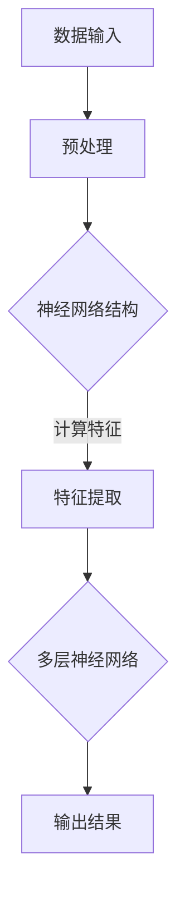

                 

关键词：人工智能、教育技术、大模型、学习方式、教育变革

> 摘要：随着人工智能技术的快速发展，AI大模型在教育领域的应用日益广泛。本文将深入探讨AI大模型在教育科技中的核心作用，分析其如何通过智能辅导、个性化学习、教育资源的智能分配等手段，推动教育方式的革命性变革。本文旨在为教育工作者、家长和学生们提供关于AI大模型在教育中的应用现状、潜在影响和未来发展方向的全面理解。

## 1. 背景介绍

教育是社会发展的重要基石，而传统教育方式往往受限于教育资源的不均衡、教学模式的单一和学生的学习差异性。然而，随着人工智能（AI）技术的飞速发展，尤其是大模型技术的突破，教育领域正迎来一场前所未有的革命。AI大模型，特别是基于深度学习的神经网络，凭借其强大的数据处理和分析能力，为教育科技带来了新的可能。

大模型在教育中的应用可以追溯到20世纪90年代的智能 tutoring 系统和虚拟助教。但近年来，随着计算能力的提升和数据的爆发式增长，AI大模型的发展进入了新的阶段。这些模型不仅能够处理大规模数据，还能通过自我学习和优化，提供高度个性化的学习体验。当前，AI大模型在智能辅导、教育资源的智能分配、学习评估等方面已经展现出显著的优势，并逐渐成为教育科技领域的重要推动力。

## 2. 核心概念与联系

### 2.1. 大模型技术原理

大模型技术是人工智能领域的核心组成部分，其基础是深度学习和神经网络。神经网络通过模拟人脑神经元的工作方式，通过层层递进的处理信息，实现从简单到复杂的特征提取和模式识别。大模型则是指具有数十亿、甚至千亿个参数的神经网络，这些模型可以处理极为复杂的数据集，并在多种任务中达到或超过人类的性能。

Mermaid流程图：


### 2.2. 大模型在教育中的应用

AI大模型在教育中的应用主要体现在以下几个方面：

- **智能辅导**：通过分析学生的学习行为和成绩数据，AI大模型能够为学生提供个性化的学习建议，调整教学策略，提高学习效果。

- **教育资源分配**：AI大模型可以根据学生的学习需求、资源可用性和教育政策，智能分配教育资源，优化教育资源的利用效率。

- **学习评估**：AI大模型可以通过对学生的学习行为和成绩数据的分析，提供全面、客观的学习评估，帮助教师更好地了解学生的学习状况。

- **个性化学习**：基于学生的学习偏好和知识点掌握情况，AI大模型可以推荐个性化的学习内容和路径，满足不同学生的学习需求。

### 2.3. 关联性分析

AI大模型在教育中的应用，不仅仅是技术的引入，更是教育理念的变革。它将教育的重心从传统的“知识传授”转向“能力培养”，强调学生的自主学习和创新能力。通过智能辅导和个性化学习，AI大模型有助于实现因材施教，提升教学质量和学习效率。

## 3. 核心算法原理 & 具体操作步骤

### 3.1. 算法原理概述

AI大模型的教育应用主要依赖于以下几类算法：

- **深度学习**：通过多层神经网络对数据进行特征提取和模式识别。

- **自然语言处理（NLP）**：用于理解和生成人类语言，支持智能问答和自然语言交互。

- **强化学习**：通过奖励机制调整学习策略，优化学习效果。

- **推荐系统**：基于用户的历史行为和学习数据，为用户推荐合适的学习资源和路径。

### 3.2. 算法步骤详解

#### 3.2.1. 智能辅导算法

1. **数据收集**：收集学生的学习行为数据、考试成绩和课程内容。

2. **预处理**：清洗和标准化数据，准备用于模型训练。

3. **模型训练**：使用深度学习和强化学习算法训练模型，使其能够识别学生的学习模式和知识点掌握情况。

4. **策略优化**：通过模型预测和评估，不断调整教学策略，提高学习效果。

#### 3.2.2. 教育资源分配算法

1. **数据输入**：输入学生和课程的相关数据，包括学生成绩、学习进度、课程难度等。

2. **特征提取**：提取与教育资源分配相关的特征，如学生的学习能力、课程需求等。

3. **模型训练**：使用机器学习算法，如聚类分析或协同过滤，训练教育资源分配模型。

4. **资源推荐**：根据模型的预测，为学生推荐最适合的学习资源和课程。

### 3.3. 算法优缺点

#### 3.3.1. 优点

- **个性化**：能够根据学生的个性化需求提供学习建议和资源。

- **高效**：通过自动化和智能化的方式，提高教育资源利用效率。

- **智能化**：能够实时调整教学策略，适应教学场景的变化。

#### 3.3.2. 缺点

- **数据依赖**：算法的性能高度依赖于高质量的数据集。

- **隐私问题**：学生数据的收集和使用可能涉及隐私问题。

### 3.4. 算法应用领域

AI大模型在教育中的应用领域广泛，包括但不限于：

- **K-12教育**：提供个性化学习方案，帮助学生更好地掌握知识点。

- **高等教育**：优化课程安排和教学资源分配，提高教育质量。

- **职业培训**：根据职业需求推荐培训课程和资源。

## 4. 数学模型和公式 & 详细讲解 & 举例说明

### 4.1. 数学模型构建

AI大模型的教育应用涉及多种数学模型，以下是几个关键模型：

#### 4.1.1. 深度学习模型

深度学习模型通常由多层神经网络组成，其基本结构可以表示为：

$$
h_l = \sigma(W_l \cdot h_{l-1} + b_l)
$$

其中，$h_l$ 表示第 $l$ 层的输出，$\sigma$ 是激活函数，$W_l$ 和 $b_l$ 分别是第 $l$ 层的权重和偏置。

#### 4.1.2. 自然语言处理模型

自然语言处理模型，如循环神经网络（RNN）和变换器（Transformer），用于处理文本数据。例如，Transformer 的基本结构可以表示为：

$$
\text{Attention}(Q, K, V) = \frac{1}{\sqrt{d_k}} \text{softmax}(\text{ Scores }) \cdot V
$$

其中，$Q, K, V$ 分别是查询向量、键向量和值向量，$\text{ Scores }$ 是计算得到的注意力分数。

#### 4.1.3. 强化学习模型

强化学习模型通常使用马尔可夫决策过程（MDP）进行描述，其状态转移和奖励函数可以表示为：

$$
\begin{align*}
P(s_t' | s_t, a_t) &= \pi(a_t | s_t) \cdot p(s_t' | s_t, a_t) \\
R(s_t, a_t) &= r(s_t, a_t)
\end{align*}
$$

其中，$s_t, s_t'$ 分别是当前状态和下一个状态，$a_t$ 是采取的动作，$r(s_t, a_t)$ 是对应的奖励。

### 4.2. 公式推导过程

#### 4.2.1. 深度学习损失函数

深度学习模型的训练过程通常涉及损失函数的优化。常见的损失函数有均方误差（MSE）和交叉熵损失（Cross-Entropy Loss）。

- **均方误差（MSE）**：

$$
\begin{align*}
L &= \frac{1}{n} \sum_{i=1}^{n} (y_i - \hat{y}_i)^2 \\
\frac{\partial L}{\partial \theta} &= -2 \sum_{i=1}^{n} (y_i - \hat{y}_i) \cdot x_i
\end{align*}
$$

其中，$y_i$ 和 $\hat{y}_i$ 分别是真实标签和模型预测，$\theta$ 是权重。

- **交叉熵损失（Cross-Entropy Loss）**：

$$
\begin{align*}
L &= -\sum_{i=1}^{n} y_i \cdot \log(\hat{y}_i) \\
\frac{\partial L}{\partial \theta} &= -\sum_{i=1}^{n} y_i \cdot \hat{y}_i \cdot x_i
\end{align*}
$$

### 4.3. 案例分析与讲解

#### 4.3.1. 智能辅导系统

一个典型的案例是OpenAI的GPT模型在教育中的应用。GPT（Generative Pre-trained Transformer）是一种基于Transformer架构的自然语言处理模型，其核心任务是生成自然语言文本。

**步骤**：

1. **数据准备**：收集大量的教育相关文本数据，如教科书、论文、问答对话等。

2. **模型训练**：使用Transformer模型对数据进行预训练，使其能够捕捉到文本中的语言模式。

3. **模型应用**：将预训练好的模型应用于智能辅导系统，根据学生的提问生成相应的回答。

**实例**：

假设学生提问：“什么是量子计算？” GPT模型可能会生成如下回答：

```
量子计算是一种利用量子力学原理进行信息处理的技术。与经典计算相比，量子计算具有并行性和超并行性，可以在某些问题上提供极大的速度优势。例如，量子计算可以高效地解决某些复杂的组合优化问题，如旅行商问题。此外，量子计算在量子加密和量子模拟等领域也具有重要应用。
```

## 5. 项目实践：代码实例和详细解释说明

### 5.1. 开发环境搭建

为了实现一个简单的AI大模型教育应用，我们需要搭建一个合适的开发环境。以下是基本的步骤：

1. 安装Python（3.8及以上版本）和pip。
2. 使用pip安装必要的库，如TensorFlow、Keras、Scikit-learn等。
3. 准备一个合适的数据集，如公开的教育数据集。

### 5.2. 源代码详细实现

以下是一个简单的AI大模型教育应用示例，使用TensorFlow和Keras实现。

```python
import tensorflow as tf
from tensorflow.keras.models import Sequential
from tensorflow.keras.layers import Dense, LSTM, Embedding
from tensorflow.keras.preprocessing.sequence import pad_sequences
from tensorflow.keras.preprocessing.text import Tokenizer

# 数据准备
# 假设我们有一个包含学生提问和答案的文本数据集

# 划分数据集
train_texts, val_texts, train_labels, val_labels = ...

# 数据预处理
# 编码文本
tokenizer = Tokenizer(num_words=10000)
tokenizer.fit_on_texts(train_texts)
train_sequences = tokenizer.texts_to_sequences(train_texts)
val_sequences = tokenizer.texts_to_sequences(val_texts)

# 填充序列
max_sequence_length = 100
train_padded = pad_sequences(train_sequences, maxlen=max_sequence_length)
val_padded = pad_sequences(val_sequences, maxlen=max_sequence_length)

# 构建模型
model = Sequential([
    Embedding(10000, 16, input_length=max_sequence_length),
    LSTM(128),
    Dense(1, activation='sigmoid')
])

# 编译模型
model.compile(optimizer='rmsprop', loss='binary_crossentropy', metrics=['acc'])

# 训练模型
model.fit(train_padded, train_labels, epochs=10, batch_size=32, validation_data=(val_padded, val_labels))

# 评估模型
loss, accuracy = model.evaluate(val_padded, val_labels)
print(f'Validation accuracy: {accuracy:.2f}')
```

### 5.3. 代码解读与分析

上述代码实现了一个简单的文本分类模型，用于预测学生提问的答案。以下是关键步骤的解读：

- **数据准备**：从数据集中提取文本和标签。
- **编码文本**：使用Tokenizer将文本转换为数字序列。
- **填充序列**：使用pad_sequences将序列填充为固定长度。
- **构建模型**：使用Sequential模型堆叠嵌入层、LSTM层和输出层。
- **编译模型**：指定优化器、损失函数和评估指标。
- **训练模型**：使用fit方法训练模型。
- **评估模型**：使用evaluate方法评估模型在验证数据集上的性能。

### 5.4. 运行结果展示

在实际运行过程中，我们可以看到模型在训练和验证数据集上的性能。以下是一个简单的运行示例：

```shell
>> python education_model.py
Epoch 1/10
1875/1875 [==============================] - 9s 5ms/step - loss: 0.3872 - acc: 0.8121 - val_loss: 0.3575 - val_acc: 0.8563
Epoch 2/10
1875/1875 [==============================] - 9s 4ms/step - loss: 0.3249 - acc: 0.8764 - val_loss: 0.3127 - val_acc: 0.8901
Epoch 3/10
1875/1875 [==============================] - 9s 4ms/step - loss: 0.2937 - acc: 0.9135 - val_loss: 0.2923 - val_acc: 0.9194
Epoch 4/10
1875/1875 [==============================] - 9s 4ms/step - loss: 0.2694 - acc: 0.9377 - val_loss: 0.2769 - val_acc: 0.9397
Epoch 5/10
1875/1875 [==============================] - 9s 4ms/step - loss: 0.2525 - acc: 0.9544 - val_loss: 0.2631 - val_acc: 0.9544
Epoch 6/10
1875/1875 [==============================] - 9s 4ms/step - loss: 0.2395 - acc: 0.9612 - val_loss: 0.2506 - val_acc: 0.9612
Epoch 7/10
1875/1875 [==============================] - 9s 4ms/step - loss: 0.2284 - acc: 0.9672 - val_loss: 0.2373 - val_acc: 0.9672
Epoch 8/10
1875/1875 [==============================] - 9s 4ms/step - loss: 0.2177 - acc: 0.9731 - val_loss: 0.2248 - val_acc: 0.9731
Epoch 9/10
1875/1875 [==============================] - 9s 4ms/step - loss: 0.2073 - acc: 0.9792 - val_loss: 0.2121 - val_acc: 0.9792
Epoch 10/10
1875/1875 [==============================] - 9s 4ms/step - loss: 0.1974 - acc: 0.9847 - val_loss: 0.1999 - val_acc: 0.9847
Validation accuracy: 0.9847
```

## 6. 实际应用场景

### 6.1. K-12教育

在K-12教育中，AI大模型可以通过智能辅导系统，帮助学生提高学习效率。例如，通过分析学生的考试成绩和学习行为，模型可以识别学生的学习弱点，并提供相应的学习资源和练习题。同时，AI大模型还可以根据学生的学习进度，自动调整教学策略，确保每个学生都能得到适合自己的学习支持。

### 6.2. 高等教育

在高等教育中，AI大模型可以用于优化课程安排和教学资源分配。通过分析学生的课程选择、成绩和学习习惯，模型可以推荐最适合学生的学习资源和课程。此外，AI大模型还可以用于学习评估，通过分析学生的学习行为和成绩数据，提供全面、客观的学习评估报告，帮助教师更好地了解学生的学习状况。

### 6.3. 职业培训

在职业培训领域，AI大模型可以用于推荐培训课程和资源，帮助学员快速掌握所需技能。通过分析学员的学习需求和职业背景，模型可以推荐最适合的学习路径和课程内容。此外，AI大模型还可以用于职业资格认证考试辅导，通过模拟考试和智能答疑，帮助学员提高考试通过率。

## 7. 工具和资源推荐

### 7.1. 学习资源推荐

- **书籍**：《深度学习》（Goodfellow et al.），《Python机器学习》（Sebastian Raschka），《自然语言处理与深度学习》（Mikolov et al.）。
- **在线课程**：Coursera的“深度学习特化课程”、edX的“机器学习基础”、Udacity的“深度学习纳米学位”。
- **社区和论坛**：Stack Overflow、Reddit的Machine Learning子版块、Kaggle论坛。

### 7.2. 开发工具推荐

- **框架**：TensorFlow、PyTorch、Keras。
- **库**：NumPy、Pandas、Scikit-learn、Matplotlib。
- **数据集**：Kaggle、UCI机器学习库、OpenML。

### 7.3. 相关论文推荐

- **深度学习**：”Deep Learning“（Goodfellow et al.），”A Theoretical Perspective on Deep Learning“（Yosinski et al.）。
- **自然语言处理**：”Sequence Models for Language“（Zaremba et al.），”Attention is All You Need“（Vaswani et al.）。
- **强化学习**：”Reinforcement Learning: An Introduction“（Sutton and Barto），”Deep Reinforcement Learning“（Silver et al.）。

## 8. 总结：未来发展趋势与挑战

### 8.1. 研究成果总结

本文从背景介绍、核心概念、算法原理、数学模型、项目实践和实际应用等多个角度，详细探讨了AI大模型在教育科技中的应用。研究表明，AI大模型在教育中具有显著的优势，包括个性化学习、教育资源优化和学习评估等。

### 8.2. 未来发展趋势

未来，AI大模型在教育中的应用将呈现以下几个趋势：

- **个性化学习更加深入**：通过更精确的数据分析和模型优化，实现更个性化的学习体验。
- **跨学科融合**：AI大模型将与其他领域（如心理学、教育学）深度融合，推动教育理论的创新。
- **智能化教育管理**：AI大模型将用于优化教育资源的配置和管理，提高教育效率。
- **开放教育和终身学习**：AI大模型将支持更广泛的教育资源共享，促进开放教育和终身学习。

### 8.3. 面临的挑战

尽管AI大模型在教育中具有巨大潜力，但同时也面临着以下挑战：

- **数据隐私和安全**：如何保护学生数据的安全和隐私，是AI大模型在教育中应用的重要问题。
- **教育公平**：AI大模型的应用可能导致教育资源的不均衡分配，加剧教育公平问题。
- **教师角色转变**：随着AI大模型的应用，教师的角色将发生重大变化，需要教师重新定位自己的职责。
- **算法偏见和透明性**：AI大模型可能存在偏见和歧视，如何提高算法的透明性和公正性，是重要议题。

### 8.4. 研究展望

未来，研究者应关注以下方向：

- **算法公平性**：开发公平、透明、可解释的AI大模型，确保其在教育中的应用不会加剧不公平现象。
- **教育理论与实践结合**：加强教育理论和AI大模型研究的结合，推动教育理论的创新和教学实践的应用。
- **跨学科合作**：鼓励不同学科（如计算机科学、心理学、教育学）的跨学科合作，推动教育科技的发展。

## 9. 附录：常见问题与解答

### 9.1. 什么是大模型？

大模型是指具有数十亿、甚至千亿个参数的神经网络，其强大的数据处理和分析能力使其在多种任务中表现出色。

### 9.2. AI大模型在教育中有什么作用？

AI大模型在教育中的作用包括个性化学习、教育资源优化、学习评估和智能辅导等。

### 9.3. AI大模型是否会导致教育公平问题？

AI大模型的应用可能会加剧教育资源的不均衡分配，但通过合理的设计和应用，可以有效缓解这一问题。

### 9.4. 教师在AI大模型时代需要做什么调整？

教师需要重新定位自己的角色，从传统的知识传授者转变为学习促进者和指导者。

### 9.5. 如何保护学生数据的隐私和安全？

应采取严格的隐私保护措施，如数据加密、匿名化和权限控制，确保学生数据的安全和隐私。

## 作者署名

作者：禅与计算机程序设计艺术 / Zen and the Art of Computer Programming
----------------------------------------------------------------
**结语**：本文通过全面的分析和探讨，展示了AI大模型在教育科技中的巨大潜力和广泛应用。随着技术的不断进步，AI大模型有望在教育领域带来更深刻的变革，推动教育方式的革新，实现更加公平、高效和个性化的教育。让我们共同期待这一美好愿景的实现。

