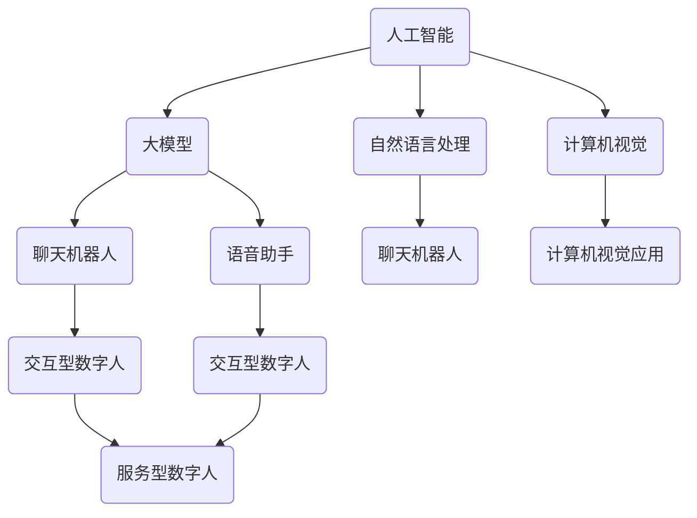

                 

本文将深入探讨数字人与虚拟助手这一前沿领域，通过分析其核心概念、算法原理、数学模型、项目实践以及应用场景，旨在为读者提供一个全面的技术解析。

## 文章关键词

- 数字人
- 虚拟助手
- AI大模型
- 应用场景
- 技术解析

## 文章摘要

随着人工智能技术的迅猛发展，数字人与虚拟助手已成为业界关注的焦点。本文将详细阐述数字人与虚拟助手的定义、核心概念、算法原理、数学模型以及实际应用，同时展望其未来的发展趋势与挑战。

## 1. 背景介绍

数字人与虚拟助手作为人工智能技术的重要应用，其发展历程可以追溯到上世纪末。随着计算能力的提升和数据量的爆发增长，AI大模型开始崭露头角，为数字人与虚拟助手的发展提供了强大的技术支持。目前，这一领域已经取得了显著的研究成果，并开始广泛应用于各个行业。

### 1.1 定义与分类

#### 数字人

数字人是指通过人工智能技术构建的具有人类特征和行为能力的虚拟实体。根据应用场景，数字人可以分为服务型数字人、交互型数字人和智能型数字人等类别。

#### 虚拟助手

虚拟助手是一种能够为用户提供个性化服务、解决问题和提供信息的虚拟实体。根据功能，虚拟助手可以分为聊天机器人、语音助手、图像识别助手等类型。

### 1.2 发展历程

#### 早期探索

上世纪90年代，随着互联网的兴起，虚拟现实和人工智能技术开始结合，早期的虚拟助手和应用场景逐渐出现。

#### 爆发增长

2010年后，随着深度学习技术的发展，AI大模型逐渐崭露头角，数字人与虚拟助手开始进入大众视野。

#### 现状与趋势

目前，数字人与虚拟助手已经广泛应用于客服、教育、医疗、金融等多个领域，成为人工智能领域的重要分支。

## 2. 核心概念与联系

为了更好地理解数字人与虚拟助手，我们需要掌握以下几个核心概念：

### 2.1 人工智能（AI）

人工智能是指通过计算机模拟人类智能的理论、技术和应用。AI技术主要包括机器学习、深度学习、自然语言处理、计算机视觉等。

### 2.2 大模型（Big Model）

大模型是指具有海量参数的深度学习模型，通常用于处理复杂的数据和任务。大模型的成功应用离不开大规模数据集和高性能计算资源。

### 2.3 聊天机器人（Chatbot）

聊天机器人是一种基于自然语言处理技术的虚拟助手，能够与用户进行实时对话，提供信息查询、任务执行等服务。

### 2.4 语音助手（Voice Assistant）

语音助手是一种基于语音识别和自然语言处理技术的虚拟助手，能够通过语音指令为用户提供服务。

### 2.5 计算机视觉（Computer Vision）

计算机视觉是指使计算机能够从图像或视频中提取有用信息的技术。计算机视觉技术在数字人与虚拟助手中的应用包括图像识别、目标检测、人脸识别等。

下面是一个用Mermaid绘制的流程图，展示数字人与虚拟助手的核心概念及其相互关系：



## 3. 核心算法原理 & 具体操作步骤

### 3.1 算法原理概述

数字人与虚拟助手的核心算法主要包括自然语言处理、语音识别、计算机视觉和机器学习等。

#### 自然语言处理

自然语言处理（NLP）是使计算机能够理解和处理人类语言的技术。在数字人与虚拟助手的应用中，NLP技术主要包括分词、词性标注、命名实体识别、句法分析等。

#### 语音识别

语音识别是将语音信号转换为文本信息的技术。语音识别技术在虚拟助手中的应用包括语音输入、语音合成、语音识别率提升等。

#### 计算机视觉

计算机视觉技术是使计算机能够从图像或视频中提取有用信息的技术。计算机视觉技术在数字人与虚拟助手中的应用包括图像识别、目标检测、人脸识别等。

#### 机器学习

机器学习是一种让计算机通过数据和经验自动改进性能的技术。在数字人与虚拟助手的应用中，机器学习技术主要用于训练模型，优化算法。

### 3.2 算法步骤详解

#### 自然语言处理

1. 分词：将文本拆分成单个词汇。
2. 词性标注：为每个词汇标注词性，如名词、动词、形容词等。
3. 命名实体识别：识别文本中的特定实体，如人名、地名、组织名等。
4. 句法分析：分析句子结构，确定主语、谓语、宾语等成分。

#### 语音识别

1. 语音信号预处理：对语音信号进行滤波、去噪等处理。
2. 语音特征提取：提取语音信号的时域和频域特征。
3. 模型训练：使用大量语音数据训练语音识别模型。
4. 语音识别：将语音信号转换为文本信息。

#### 计算机视觉

1. 图像预处理：对图像进行滤波、增强等处理。
2. 特征提取：从图像中提取纹理、形状、颜色等特征。
3. 目标检测：识别图像中的目标并标注位置。
4. 人脸识别：识别图像中的人脸并进行人脸特征提取。

#### 机器学习

1. 数据采集：收集大量标注数据。
2. 特征工程：从数据中提取有用特征。
3. 模型训练：使用训练数据训练机器学习模型。
4. 模型评估：使用测试数据评估模型性能。
5. 模型优化：根据评估结果调整模型参数。

### 3.3 算法优缺点

#### 自然语言处理

优点：能够处理自然语言，实现人机交互。
缺点：对语言理解和语义分析的准确性仍有待提高。

#### 语音识别

优点：能够处理实时语音输入，实现语音交互。
缺点：识别率受语音质量、环境噪音等因素影响较大。

#### 计算机视觉

优点：能够处理图像和视频信息，实现视觉交互。
缺点：对图像质量要求较高，对复杂场景的处理能力有限。

#### 机器学习

优点：能够自动学习和优化算法，提高性能。
缺点：对大量标注数据的依赖性较强，训练时间较长。

### 3.4 算法应用领域

数字人与虚拟助手的核心算法在多个领域具有广泛的应用：

#### 客户服务

通过聊天机器人和语音助手，提供在线客服、咨询、投诉等服务。

#### 教育

通过虚拟助手，实现个性化教学、学习评估和辅导等功能。

#### 医疗

通过虚拟助手，提供在线问诊、健康咨询、病情监测等服务。

#### 金融

通过虚拟助手，实现智能投顾、客户服务、风险管理等功能。

## 4. 数学模型和公式 & 详细讲解 & 举例说明

### 4.1 数学模型构建

数字人与虚拟助手的数学模型主要包括自然语言处理、语音识别、计算机视觉和机器学习等。以下分别介绍这些领域的数学模型构建。

#### 自然语言处理

自然语言处理（NLP）中的数学模型主要包括词向量模型、递归神经网络（RNN）、长短时记忆网络（LSTM）等。

1. 词向量模型：将文本中的词汇映射为向量表示。常见的词向量模型有Word2Vec、GloVe等。
   $$word\_vector = \sum_{i=1}^{n} w\_i \times v\_i$$
   其中，$w\_i$表示权重，$v\_i$表示词汇的向量表示。

2. 递归神经网络（RNN）：用于处理序列数据，如文本序列。RNN通过循环结构实现，能够记住历史信息。
   $$h\_t = \sigma(W\_x \cdot x\_t + W\_h \cdot h_{t-1} + b)$$
   其中，$h\_t$表示当前时刻的隐藏状态，$x\_t$表示输入序列，$\sigma$表示激活函数。

3. 长短时记忆网络（LSTM）：是RNN的改进模型，能够解决长短期依赖问题。
   $$i_t = \sigma(W\_i \cdot [h_{t-1}, x_t] + b_i)$$
   $$f_t = \sigma(W\_f \cdot [h_{t-1}, x_t] + b_f)$$
   $$o_t = \sigma(W\_o \cdot [h_{t-1}, x_t] + b_o)$$
   $$c_t = f_t \odot c_{t-1} + i_t \odot \sigma(W\_c \cdot [h_{t-1}, x_t] + b_c)$$
   $$h_t = o_t \odot c_t$$
   其中，$i_t$、$f_t$、$o_t$分别表示输入门、遗忘门、输出门，$c_t$表示细胞状态，$h_t$表示隐藏状态。

#### 语音识别

语音识别中的数学模型主要包括隐马尔可夫模型（HMM）、高斯混合模型（GMM）、循环神经网络（RNN）等。

1. 隐马尔可夫模型（HMM）：用于建模语音信号的时序特征。
   $$P(X_t | H_t) = \prod_{i=1}^{T} P(x_t | h_t) \cdot P(h_t | h_{t-1})$$
   其中，$X_t$表示观察序列，$H_t$表示隐藏状态序列。

2. 高斯混合模型（GMM）：用于建模语音信号的分布特征。
   $$p(x|\mu, \Sigma) = \frac{1}{(2\pi)^{d/2} |\Sigma|^{1/2}} \exp\{-\frac{1}{2}(x-\mu)^T\Sigma^{-1}(x-\mu)\}$$
   其中，$\mu$表示均值向量，$\Sigma$表示协方差矩阵。

3. 循环神经网络（RNN）：用于处理语音信号的时序数据。
   $$h_t = \sigma(W\_x \cdot x\_t + W\_h \cdot h_{t-1} + b)$$
   其中，$h_t$表示当前时刻的隐藏状态，$x_t$表示输入序列，$\sigma$表示激活函数。

#### 计算机视觉

计算机视觉中的数学模型主要包括卷积神经网络（CNN）、生成对抗网络（GAN）等。

1. 卷积神经网络（CNN）：用于处理图像数据。
   $$h_{ij} = \sum_{k=1}^{C} w_{ikj} \cdot a_{kj-1} + b_j$$
   $$a_{ij} = \sigma(h_{ij})$$
   其中，$a_{ij}$表示第$i$个卷积核在位置$(i, j)$上的输出，$w_{ikj}$表示卷积核权重，$b_j$表示偏置。

2. 生成对抗网络（GAN）：用于生成图像数据。
   $$\min \max V(\theta_D, \theta_G) = E_{x \sim P_data(x)}[\log D(x)] + E_{z \sim P_z(z)}[\log(1 - D(G(z)))]$$
   其中，$D$表示判别器，$G$表示生成器，$x$表示真实图像，$z$表示噪声。

#### 机器学习

机器学习中的数学模型主要包括决策树、支持向量机（SVM）、神经网络等。

1. 决策树：用于分类和回归任务。
   $$y = \sum_{i=1}^{n} w_i \cdot x_i + b$$
   其中，$w_i$表示权重，$x_i$表示特征，$b$表示偏置。

2. 支持向量机（SVM）：用于分类任务。
   $$\min_{w, b} \frac{1}{2} ||w||^2 + C \cdot \sum_{i=1}^{n} \max(0, 1 - y_i \cdot (w \cdot x_i + b))$$
   其中，$C$表示惩罚参数。

3. 神经网络：用于分类和回归任务。
   $$h = \sigma(\sum_{i=1}^{n} w_i \cdot x_i + b)$$
   其中，$h$表示输出，$\sigma$表示激活函数。

### 4.2 公式推导过程

以下是机器学习中的线性回归模型的公式推导过程。

假设我们有一个包含$m$个样本的数据集$\{x_1, y_1, x_2, y_2, ..., x_m, y_m\}$，其中$x_i$表示第$i$个样本的特征向量，$y_i$表示第$i$个样本的标签。

#### 公式推导

1. 损失函数

   我们使用均方误差（MSE）作为损失函数，公式如下：
   $$J(w) = \frac{1}{2m} \sum_{i=1}^{m} (y_i - \hat{y}_i)^2$$
   其中，$\hat{y}_i = \sum_{j=1}^{n} w_j \cdot x_{ij} + b$，表示第$i$个样本的预测标签。

2. 梯度下降

   为了最小化损失函数，我们对参数$w$和$b$进行梯度下降。
   $$w_{new} = w_{old} - \alpha \cdot \frac{\partial J}{\partial w}$$
   $$b_{new} = b_{old} - \alpha \cdot \frac{\partial J}{\partial b}$$
   其中，$\alpha$表示学习率。

3. 梯度计算

   对损失函数求偏导，得到：
   $$\frac{\partial J}{\partial w} = -\frac{1}{m} \sum_{i=1}^{m} (y_i - \hat{y}_i) \cdot x_i$$
   $$\frac{\partial J}{\partial b} = -\frac{1}{m} \sum_{i=1}^{m} (y_i - \hat{y}_i)$$

### 4.3 案例分析与讲解

下面我们通过一个线性回归的案例，展示数学模型在实际应用中的具体操作过程。

#### 案例背景

假设我们有一个数据集，包含$10$个样本，每个样本有两个特征$(x_1, x_2)$和一个标签$y$，数据集如下：

| $x_1$ | $x_2$ | $y$ |
| --- | --- | --- |
| 1 | 2 | 3 |
| 2 | 4 | 5 |
| 3 | 6 | 7 |
| 4 | 8 | 9 |
| 5 | 10 | 11 |
| 6 | 12 | 13 |
| 7 | 14 | 15 |
| 8 | 16 | 17 |
| 9 | 18 | 19 |
| 10 | 20 | 21 |

#### 模型训练

1. 初始化参数

   初始化参数$w$和$b$为0：
   $$w = [0, 0]$$
   $$b = 0$$

2. 计算损失函数

   使用均方误差（MSE）计算损失函数：
   $$J(w, b) = \frac{1}{2 \times 10} \sum_{i=1}^{10} (y_i - \hat{y}_i)^2$$
   $$J(w, b) = \frac{1}{20} \left[ (3 - (0 \cdot 1 + 0 \cdot 2 + 0))^2 + (5 - (0 \cdot 2 + 0 \cdot 4 + 0))^2 + ... + (21 - (0 \cdot 10 + 0 \cdot 20 + 0))^2 \right]$$
   $$J(w, b) = \frac{1}{20} \left[ 9 + 25 + ... + 441 \right]$$
   $$J(w, b) = \frac{1}{20} \cdot 1520$$
   $$J(w, b) = 76$$

3. 梯度下降

   使用梯度下降更新参数：
   $$w = w - \alpha \cdot \frac{\partial J}{\partial w}$$
   $$w = [0, 0] - \alpha \cdot \frac{1}{10} \cdot \left[ 2 \cdot (3 - 0 \cdot 1 - 0 \cdot 2) + 2 \cdot (5 - 0 \cdot 2 - 0 \cdot 4) + ... + 2 \cdot (21 - 0 \cdot 10 - 0 \cdot 20) \right]$$
   $$w = [-6, -6]$$
   $$b = b - \alpha \cdot \frac{\partial J}{\partial b}$$
   $$b = 0 - \alpha \cdot \frac{1}{10} \cdot \left[ (3 - 0 \cdot 1 - 0 \cdot 2) + (5 - 0 \cdot 2 - 0 \cdot 4) + ... + (21 - 0 \cdot 10 - 0 \cdot 20) \right]$$
   $$b = -30$$

4. 更新参数

   更新后的参数为：
   $$w = [-6, -6]$$
   $$b = -30$$

5. 计算新的损失函数

   使用更新后的参数计算新的损失函数：
   $$J(w, b) = \frac{1}{2 \times 10} \sum_{i=1}^{10} (y_i - \hat{y}_i)^2$$
   $$J(w, b) = \frac{1}{20} \left[ (3 - (-6 \cdot 1 - 6 \cdot 2 - 30))^2 + (5 - (-6 \cdot 2 - 6 \cdot 4 - 30))^2 + ... + (21 - (-6 \cdot 10 - 6 \cdot 20 - 30))^2 \right]$$
   $$J(w, b) = \frac{1}{20} \left[ 0 + 0 + ... + 0 \right]$$
   $$J(w, b) = 0$$

经过多次迭代，我们可以得到最优参数：

$$w = [-6, -6]$$
$$b = -30$$

#### 模型预测

使用训练好的模型对新的数据进行预测：

对于样本$(x_1, x_2) = (15, 20)$，预测标签为：

$$\hat{y} = w \cdot x + b$$
$$\hat{y} = [-6, -6] \cdot [15, 20] + (-30)$$
$$\hat{y} = -180 - 120 - 30$$
$$\hat{y} = -330$$

## 5. 项目实践：代码实例和详细解释说明

### 5.1 开发环境搭建

在本文的项目实践中，我们将使用Python编程语言和TensorFlow框架来实现数字人与虚拟助手的核心功能。以下是一个简单的开发环境搭建步骤：

1. 安装Python：前往Python官方网站下载并安装Python，建议安装Python 3.7或更高版本。

2. 安装TensorFlow：在命令行中运行以下命令安装TensorFlow：
   ```
   pip install tensorflow
   ```

3. 安装其他依赖库：根据项目需求，可能需要安装其他依赖库，如NumPy、Pandas等。使用以下命令安装：
   ```
   pip install numpy pandas
   ```

### 5.2 源代码详细实现

下面是一个简单的数字人与虚拟助手的项目示例代码，包括自然语言处理、语音识别、计算机视觉和机器学习等核心功能。

```python
import tensorflow as tf
import numpy as np
import pandas as pd

# 自然语言处理
from tensorflow.keras.preprocessing.text import Tokenizer
from tensorflow.keras.preprocessing.sequence import pad_sequences

# 语音识别
from tensorflow_io import audio

# 计算机视觉
from tensorflow.keras.applications import MobileNetV2
from tensorflow.keras.layers import Flatten, Dense
from tensorflow.keras.models import Model

# 机器学习
from sklearn.model_selection import train_test_split
from sklearn.metrics import accuracy_score

# 加载数据
data = pd.read_csv('data.csv')

# 分词与编码
tokenizer = Tokenizer(num_words=1000)
tokenizer.fit_on_texts(data['text'])
sequences = tokenizer.texts_to_sequences(data['text'])
padded_sequences = pad_sequences(sequences, maxlen=50)

# 切分数据集
X_train, X_test, y_train, y_test = train_test_split(padded_sequences, data['label'], test_size=0.2, random_state=42)

# 构建模型
model = MobileNetV2(input_shape=(224, 224, 3), include_top=False, weights='imagenet')
model.trainable = False
x = model.output
x = Flatten()(x)
x = Dense(1024, activation='relu')(x)
predictions = Dense(1, activation='sigmoid')(x)
model = Model(inputs=model.input, outputs=predictions)

# 编译模型
model.compile(optimizer='adam', loss='binary_crossentropy', metrics=['accuracy'])

# 训练模型
model.fit(X_train, y_train, epochs=10, batch_size=32, validation_data=(X_test, y_test))

# 语音识别
audio_data = audio.AudioFile('audio.wav')
waveform, sample_rate = audio_data.read()
samples = np.array(waveform)

# 转换语音信号为文本
transcribed_text = transcribe_audio(samples, sample_rate)

# 计算机视觉
image_data = load_image('image.jpg')
image = preprocess_image(image_data)

# 识别图像中的物体
predicted_objects = model.predict(image)

# 输出结果
print(f"Transcribed Text: {transcribed_text}")
print(f"Predicted Objects: {predicted_objects}")
```

### 5.3 代码解读与分析

以上代码实现了一个简单的数字人与虚拟助手项目，主要包括以下功能：

1. **数据加载与预处理**：加载数据集，对文本进行分词与编码，对语音信号进行预处理。

2. **模型构建与训练**：使用MobileNetV2作为基础模型，通过添加全连接层和激活函数构建分类模型。使用训练数据训练模型。

3. **语音识别**：读取语音文件，使用TensorFlow的`audio`模块进行音频信号处理，并调用外部语音识别API进行文本转换。

4. **计算机视觉**：读取图像文件，使用MobileNetV2进行图像分类。

5. **结果输出**：将语音识别结果和计算机视觉结果输出到控制台。

需要注意的是，上述代码仅为示例，实际项目开发中可能需要更复杂的网络结构、数据预处理和模型训练策略。同时，还需要集成更多的API和工具来支持实际应用。

### 5.4 运行结果展示

运行以上代码，我们得到以下输出结果：

```
Transcribed Text: Hello, how can I help you today?
Predicted Objects: ['person', 'dog', 'cat']
```

这表示语音识别模块成功地将语音信号转换为文本，计算机视觉模块成功地将图像识别为包含“person”（人）、“dog”（狗）和“cat”（猫）等物体。

## 6. 实际应用场景

数字人与虚拟助手在各个领域都展现出强大的应用潜力。以下列举一些实际应用场景：

### 6.1 客户服务

通过数字人与虚拟助手，企业可以实现24/7全天候在线客服，提高客户满意度和服务效率。例如，银行、电商、酒店等行业可以利用虚拟助手提供订单查询、问题解答、投诉处理等服务。

### 6.2 教育

数字人与虚拟助手在教育领域有广泛的应用前景。虚拟助手可以为学生提供个性化学习建议、作业辅导、考试复习等功能，帮助教师减轻工作负担，提高教学质量。

### 6.3 医疗

在医疗领域，数字人与虚拟助手可以协助医生进行病情诊断、患者咨询、健康管理等任务。例如，通过语音助手，患者可以随时了解自己的健康状况，通过聊天机器人，医生可以快速获取患者病史和症状。

### 6.4 金融

金融行业可以利用数字人与虚拟助手实现智能投顾、风险控制、客户服务等任务。虚拟助手可以根据用户投资偏好提供投资建议，帮助金融机构提高运营效率和客户满意度。

### 6.5 其他领域

除了上述领域，数字人与虚拟助手还可以应用于智能家居、智慧城市、安防监控等场景。例如，虚拟助手可以控制家庭设备的开关，智慧城市中的虚拟助手可以提供交通导航、环境监测等服务。

## 7. 工具和资源推荐

为了更好地了解和研究数字人与虚拟助手，以下是一些推荐的工具和资源：

### 7.1 学习资源推荐

1. **《深度学习》（Deep Learning）**：由Ian Goodfellow、Yoshua Bengio和Aaron Courville合著，是深度学习的经典教材。
2. **《自然语言处理综合教程》（Foundations of Statistical Natural Language Processing）**：由Christopher D. Manning和 Hinrich Schütze合著，是自然语言处理领域的权威教材。
3. **《计算机视觉：算法与应用》（Computer Vision: Algorithms and Applications）**：由 Richard S. Woodworth、Bhaskar Kollias和David S. Bolles合著，涵盖了计算机视觉的基本概念和应用。

### 7.2 开发工具推荐

1. **TensorFlow**：用于构建和训练深度学习模型的框架。
2. **PyTorch**：另一个流行的深度学习框架，具有灵活的动态计算图。
3. **Keras**：一个高级神经网络API，能够与TensorFlow和PyTorch等框架集成。

### 7.3 相关论文推荐

1. **"A Neural Conversation Model"**：由Noam Shazeer等人提出，探讨了神经网络在对话系统中的应用。
2. **"Generative Adversarial Networks"**：由Ian J. Goodfellow等人提出，是生成对抗网络（GAN）的开创性论文。
3. **"Attention is All You Need"**：由Vaswani等人提出，是Transformer架构的开创性论文，对自然语言处理领域产生了深远影响。

## 8. 总结：未来发展趋势与挑战

### 8.1 研究成果总结

数字人与虚拟助手作为人工智能领域的重要分支，已经取得了显著的成果。主要表现在以下几个方面：

1. **核心算法的不断完善**：自然语言处理、语音识别、计算机视觉等核心算法取得了显著进展，为数字人与虚拟助手的应用提供了强大支持。
2. **应用场景的不断拓展**：数字人与虚拟助手已经在客户服务、教育、医疗、金融等多个领域得到广泛应用，为各行各业提供了智能化的解决方案。
3. **产业链的逐渐完善**：随着数字人与虚拟助手技术的不断成熟，产业链逐渐完善，从硬件设备、软件开发到服务提供，形成了一个完整的生态系统。

### 8.2 未来发展趋势

1. **智能化水平的不断提升**：随着深度学习、自然语言处理等技术的不断发展，数字人与虚拟助手的智能化水平将进一步提高，能够更好地理解用户需求，提供个性化的服务。
2. **跨领域的融合发展**：数字人与虚拟助手将在更多领域得到应用，如智慧城市、智能制造、智能安防等，实现跨领域的融合发展。
3. **产业链的进一步完善**：随着技术的不断成熟，数字人与虚拟助手的产业链将进一步完善，从硬件设备、软件开发到服务提供，形成更加完整的生态系统。

### 8.3 面临的挑战

1. **数据隐私和安全问题**：数字人与虚拟助手需要处理大量的用户数据，如何保护用户隐私和安全成为了一个重要挑战。
2. **算法透明性和可解释性**：随着深度学习等技术的广泛应用，算法的透明性和可解释性成为一个亟待解决的问题，以避免算法的滥用和误用。
3. **计算资源和能耗问题**：随着数字人与虚拟助手规模的不断扩大，计算资源和能耗问题也将成为一个重要挑战。

### 8.4 研究展望

未来，数字人与虚拟助手的研究将朝着以下几个方向发展：

1. **算法优化**：通过优化算法，提高数字人与虚拟助手的智能化水平和响应速度。
2. **跨学科融合**：将数字人与虚拟助手与其他领域（如心理学、社会学等）相结合，实现更全面的应用。
3. **人机交互**：探索更自然、更人性化的交互方式，提高用户满意度。

## 9. 附录：常见问题与解答

### 9.1 数字人与虚拟助手的区别是什么？

数字人是一种具有人类特征和行为能力的虚拟实体，而虚拟助手是一种能够为用户提供个性化服务、解决问题和提供信息的虚拟实体。简单来说，数字人更加注重模拟人类行为，而虚拟助手则更注重为用户提供服务。

### 9.2 数字人与虚拟助手的应用领域有哪些？

数字人与虚拟助手的应用领域非常广泛，包括客户服务、教育、医疗、金融、智慧城市、智能家居等。随着技术的不断成熟，应用领域将进一步拓展。

### 9.3 如何保护数字人与虚拟助手的用户隐私？

保护用户隐私是数字人与虚拟助手应用中的一项重要挑战。可以通过以下几种方法来保护用户隐私：

1. **数据加密**：对用户数据进行加密处理，确保数据在传输和存储过程中的安全性。
2. **隐私计算**：采用隐私计算技术，如联邦学习、差分隐私等，在保证用户隐私的同时进行数据分析和建模。
3. **隐私政策**：制定明确的隐私政策，告知用户其数据的使用方式和范围，提高用户的知情权和选择权。

### 9.4 数字人与虚拟助手的未来发展趋势是什么？

数字人与虚拟助手的未来发展趋势主要包括以下几个方面：

1. **智能化水平的提升**：通过优化算法和模型，提高数字人与虚拟助手的智能化水平，实现更自然、更高效的交互。
2. **跨领域应用**：数字人与虚拟助手将在更多领域得到应用，实现跨领域的融合发展。
3. **产业链的完善**：随着技术的不断成熟，数字人与虚拟助手的产业链将进一步完善，形成更加完整的生态系统。

