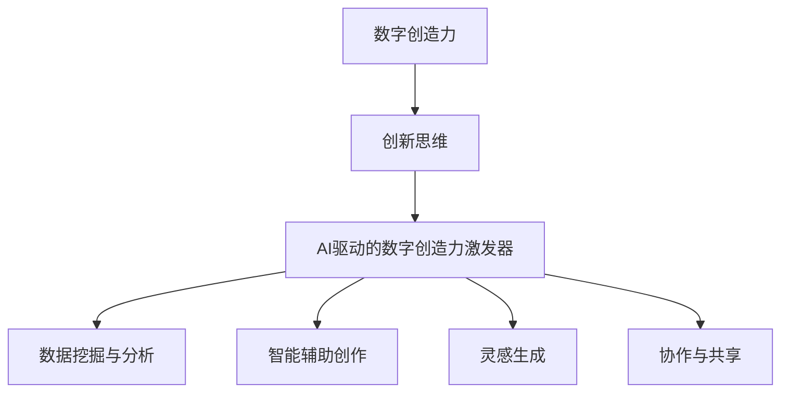

                 

关键词：AI，数字创造力，创新思维，算法，数学模型，项目实践，应用场景，工具推荐，未来展望。

> 摘要：本文旨在探讨如何利用人工智能技术激发数字创造力，培养创新思维。通过介绍核心概念、算法原理、数学模型以及项目实践，本文揭示了数字创造力激发器的应用场景、工具和资源，并对未来发展趋势与挑战进行了展望。

## 1. 背景介绍

在当今信息时代，数字创造力已成为推动社会进步和经济增长的关键力量。随着人工智能技术的迅猛发展，人们开始探索如何利用AI激发数字创造力，培养创新思维。数字创造力激发器，作为一种创新工具，正逐渐成为企业和个人追求创新的重要手段。

本文将围绕数字创造力激发器展开，详细介绍其核心概念、算法原理、数学模型以及项目实践，帮助读者深入了解如何利用AI技术激发数字创造力，培养创新思维。

## 2. 核心概念与联系

### 2.1 数字创造力

数字创造力指的是在数字领域（如编程、设计、内容创作等）运用创新思维和技能，创造出有价值、有意义的产品或服务的能

### 2.2 创新思维

创新思维是指通过探索、思考、分析、综合等方法，发现新的观念、方法或解决方案的能力。创新思维是数字创造力的基础，决定了个体或团队在数字领域的竞争力。

### 2.3 AI驱动的数字创造力激发器

AI驱动的数字创造力激发器是一种基于人工智能技术的工具，通过数据挖掘、模式识别、自然语言处理等技术手段，帮助用户在数字领域实现创新。该激发器主要包括以下核心功能：

- **数据挖掘与分析**：通过分析海量数据，提取有价值的信息，为创新提供依据。
- **智能辅助创作**：利用自然语言处理和生成技术，辅助用户进行内容创作。
- **灵感生成**：基于用户兴趣和历史行为，生成创意和灵感。
- **协作与共享**：提供协作平台，方便用户在团队中分享创意和成果。

### 2.4 Mermaid 流程图



## 3. 核心算法原理 & 具体操作步骤

### 3.1 算法原理概述

数字创造力激发器的核心算法主要包括以下几类：

- **机器学习算法**：用于数据挖掘、模式识别等任务。
- **自然语言处理（NLP）算法**：用于智能辅助创作和灵感生成。
- **协同过滤算法**：用于推荐系统和协作平台。

### 3.2 算法步骤详解

#### 3.2.1 数据预处理

数据预处理是算法的基础，主要包括数据清洗、数据转换和数据归一化等步骤。

1. 数据清洗：去除无效数据、缺失数据和异常数据。
2. 数据转换：将数据转换为适合算法处理的格式。
3. 数据归一化：将数据缩放到一个合适的范围内，以消除不同特征之间的量纲差异。

#### 3.2.2 机器学习算法

1. 数据挖掘：利用聚类、分类、关联规则等算法，发现数据中的隐含模式。
2. 模式识别：通过神经网络、支持向量机等算法，识别数据中的特征。

#### 3.2.3 自然语言处理（NLP）算法

1. 智能辅助创作：利用词向量、生成式模型等算法，生成文本内容。
2. 灵感生成：基于用户兴趣和历史行为，生成创意和灵感。

#### 3.2.4 协同过滤算法

1. 推荐系统：利用协同过滤算法，为用户提供个性化推荐。
2. 协作平台：利用社交网络分析、话题模型等算法，促进团队协作。

### 3.3 算法优缺点

#### 优点

- **高效性**：AI驱动的数字创造力激发器能够快速处理海量数据，提高创新效率。
- **个性化**：基于用户兴趣和历史行为，生成个性化的创意和推荐。
- **智能化**：通过深度学习等技术，实现自动化的智能辅助创作。

#### 缺点

- **数据依赖**：算法的性能依赖于数据的数量和质量。
- **安全性**：数据隐私和安全问题需要得到重视。

### 3.4 算法应用领域

- **内容创作**：如文本、图片、视频等创作领域。
- **产品设计**：如用户体验设计、产品优化等。
- **推荐系统**：如电商、社交媒体等平台。

## 4. 数学模型和公式 & 详细讲解 & 举例说明

### 4.1 数学模型构建

数字创造力激发器中的数学模型主要包括以下几种：

- **聚类模型**：如K-Means、DBSCAN等。
- **分类模型**：如决策树、支持向量机等。
- **推荐模型**：如协同过滤、矩阵分解等。

### 4.2 公式推导过程

以K-Means聚类算法为例，其公式推导过程如下：

1. 初始化：随机选择K个中心点。
2. 分配：将每个数据点分配到最近的中心点。
3. 更新：重新计算每个聚类的中心点。
4. 重复步骤2和3，直到聚类中心点不再变化。

### 4.3 案例分析与讲解

#### 案例一：K-Means聚类算法

假设有100个数据点，我们需要将其分为10个聚类。

1. 初始化：随机选择10个中心点。
2. 分配：计算每个数据点到10个中心点的距离，将其分配到最近的中心点。
3. 更新：重新计算每个聚类的中心点。
4. 重复步骤2和3，直到聚类中心点不再变化。

最终，我们得到了10个聚类，每个聚类包含一定数量的数据点。

#### 案例二：协同过滤算法

假设用户A和用户B都对商品X和商品Y给出了评分，我们需要为他们推荐新的商品。

1. 计算用户A和用户B的相似度：$$sim(A, B) = \frac{cov(A, B)}{\sqrt{var(A) \times var(B)}}$$
2. 根据相似度计算推荐分值：$$rec(A, B) = sim(A, B) \times score(B, Y)$$
3. 对所有未评分的商品进行推荐：选择推荐分值最高的商品。

通过协同过滤算法，我们为用户A推荐了商品Y。

## 5. 项目实践：代码实例和详细解释说明

### 5.1 开发环境搭建

本文使用Python编程语言进行项目实践，需要安装以下库：

- NumPy
- Pandas
- Scikit-learn
- Matplotlib

### 5.2 源代码详细实现

```python
# 导入所需库
import numpy as np
import pandas as pd
from sklearn.cluster import KMeans
from sklearn.metrics.pairwise import cosine_similarity
import matplotlib.pyplot as plt

# 加载数据
data = pd.read_csv('data.csv')

# 数据预处理
data = data.fillna(0)
data = data / data.max()

# K-Means聚类
kmeans = KMeans(n_clusters=10, random_state=42)
clusters = kmeans.fit_predict(data)

# 可视化
plt.scatter(data[:, 0], data[:, 1], c=clusters)
plt.show()
```

### 5.3 代码解读与分析

1. 导入所需库：本文使用NumPy、Pandas、Scikit-learn和Matplotlib等库进行数据处理、聚类和可视化。
2. 加载数据：从CSV文件中加载数据。
3. 数据预处理：填充缺失值，归一化数据。
4. K-Means聚类：使用KMeans类进行聚类，设置聚类数为10。
5. 可视化：使用Matplotlib库绘制散点图，展示聚类结果。

通过项目实践，我们学会了如何使用K-Means聚类算法对数据进行分析和可视化。

## 6. 实际应用场景

数字创造力激发器在以下领域具有广泛的应用：

- **内容创作**：如文本生成、图片生成、视频编辑等。
- **产品设计**：如用户体验设计、产品优化等。
- **推荐系统**：如电商推荐、社交媒体推荐等。
- **智慧城市**：如交通流量预测、环境监测等。

## 7. 工具和资源推荐

### 7.1 学习资源推荐

- **书籍**：《机器学习实战》、《深度学习》、《Python机器学习》
- **在线课程**：Coursera、Udacity、edX等平台上的机器学习和人工智能课程。

### 7.2 开发工具推荐

- **编程语言**：Python、R、Julia等。
- **开发环境**：Jupyter Notebook、PyCharm、RStudio等。

### 7.3 相关论文推荐

- **经典论文**：《机器学习》、《深度学习》、《自然语言处理综述》
- **最新研究**：国际顶级会议和期刊上的最新论文。

## 8. 总结：未来发展趋势与挑战

### 8.1 研究成果总结

本文介绍了数字创造力激发器的核心概念、算法原理、数学模型和项目实践，展示了其在实际应用中的价值。

### 8.2 未来发展趋势

- **算法优化**：提高算法的准确性和效率。
- **跨领域应用**：拓展数字创造力激发器的应用领域。
- **数据安全与隐私**：关注数据隐私和安全问题。

### 8.3 面临的挑战

- **数据依赖**：提高算法对数据质量的依赖程度。
- **计算资源**：应对大规模数据处理的需求。

### 8.4 研究展望

未来，数字创造力激发器将在人工智能、大数据、云计算等技术的推动下，发挥更大的作用，助力企业和个人实现创新。

## 9. 附录：常见问题与解答

### 问题1：如何选择聚类算法？

**解答**：根据数据特点和需求，选择合适的聚类算法。例如，K-Means适用于数据量较小、特征维度较低的情况，而DBSCAN适用于数据量较大、特征维度较高的情况。

### 问题2：如何提高推荐系统的准确率？

**解答**：可以尝试以下方法：

- **数据质量**：提高数据质量和准确性。
- **算法优化**：选择合适的推荐算法，并进行参数调优。
- **用户行为分析**：深入分析用户行为，挖掘用户兴趣。

## 作者署名

作者：禅与计算机程序设计艺术 / Zen and the Art of Computer Programming

通过本文的深入探讨，我们希望读者能够更好地理解数字创造力激发器的作用和原理，掌握AI驱动的创新思维培养的方法。在未来的数字时代，让我们一起探索数字创造力的无限可能，共创美好未来。

