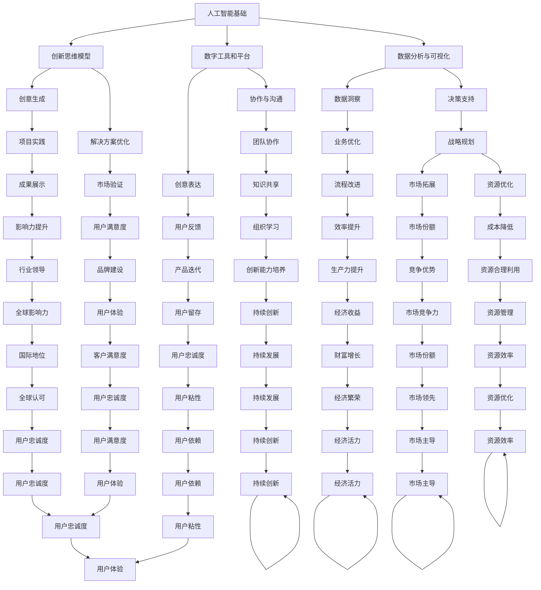

                 

关键词：人工智能，创造力，创新思维，AI驱动的学习，数字思维，技术趋势，思维模型，教育工具，商业策略

> 摘要：本文探讨了人工智能（AI）如何激发数字创造力，特别是如何通过AI驱动的工具和方法培养创新思维。文章从背景介绍开始，深入分析了AI与创造力之间的联系，介绍了核心算法原理和数学模型，并通过实际项目实例展示了AI在创新思维培养中的应用。文章还探讨了AI在商业、教育和科技领域的实际应用，并提出了未来发展的趋势与挑战。

## 1. 背景介绍

在当今科技迅速发展的时代，人工智能已经成为推动各个领域进步的关键力量。从自动驾驶汽车到个性化推荐系统，AI的应用已经深入到我们日常生活的方方面面。然而，除了提高效率和准确性，AI还有更大的潜力——激发数字创造力。

数字创造力是指通过数字技术和工具进行创新和创造的能力。在传统的创造力培养过程中，人们往往依赖直觉、经验和感性思维。而AI的出现，为这种传统模式带来了革命性的改变。通过算法和大数据分析，AI能够提供全新的视角和思路，帮助人们打破思维定势，激发创意思维。

### 1.1 AI与创造力

AI与创造力之间的关系可以从多个角度来理解。首先，AI通过自动化和优化流程，为人们节省了时间和精力，使他们能够将更多精力投入到创造性活动中。其次，AI能够分析大量数据，从中发现隐藏的模式和趋势，为创新提供新的灵感。此外，AI还可以通过模拟和预测，帮助人们探索未知领域，拓宽思维边界。

### 1.2 数字创造力的重要性

在数字时代，数字创造力已经成为企业和个人竞争力的核心。对于企业来说，创新能力是应对市场变化和保持竞争优势的关键。对于个人来说，数字创造力则是一种重要的职业技能，能够帮助他们适应快速变化的职场环境。

## 2. 核心概念与联系

为了深入探讨AI如何激发数字创造力，我们首先需要了解一些核心概念和它们之间的联系。以下是AI驱动的创新思维培养的关键组成部分：

### 2.1 人工智能基础知识

人工智能（AI）是计算机科学的一个分支，旨在使机器能够模拟人类智能。AI技术包括机器学习、深度学习、自然语言处理等，这些技术为AI提供了强大的数据处理和分析能力。

### 2.2 创新思维模型

创新思维模型是指用于培养创新思维的工具和方法。这些模型包括设计思维、系统思维、思维导图等，它们帮助人们从不同角度思考问题，发现新的解决方案。

### 2.3 数字工具和平台

数字工具和平台是AI驱动的创新思维培养的重要载体。这些工具包括在线协作平台、虚拟现实（VR）、增强现实（AR）等，它们为创意表达和协作提供了丰富的手段。

### 2.4 数据分析与可视化

数据分析与可视化是AI驱动的创新思维培养的核心。通过数据分析，可以从大量数据中提取有价值的信息和洞察，而可视化则使得这些信息更加直观，便于人们理解和利用。

以下是AI驱动的创新思维培养的Mermaid流程图：



## 3. 核心算法原理 & 具体操作步骤

### 3.1 算法原理概述

AI驱动的创新思维培养的核心算法主要包括机器学习和深度学习算法。这些算法通过对大量数据进行训练，能够自动发现数据中的模式和规律，从而帮助人们进行创新思维。

### 3.2 算法步骤详解

#### 3.2.1 数据收集与预处理

首先，我们需要收集相关的数据，如用户行为数据、市场趋势数据、技术文献等。然后，对数据进行清洗和预处理，确保数据的质量和一致性。

#### 3.2.2 特征提取与选择

接下来，通过特征提取和选择算法，从原始数据中提取出有用的特征，以便后续的模型训练。

#### 3.2.3 模型训练与优化

使用机器学习和深度学习算法，对提取出的特征进行训练，构建预测模型。然后，通过调整模型参数，优化模型的性能。

#### 3.2.4 模型评估与部署

对训练好的模型进行评估，确保其准确性和鲁棒性。最后，将模型部署到生产环境中，供用户使用。

### 3.3 算法优缺点

#### 优点：

1. **高效性**：AI算法能够处理大量的数据，提高创新的效率。
2. **智能化**：AI算法能够自动发现数据中的模式和规律，提供新的创新思路。
3. **灵活性**：AI算法可以根据不同的需求进行调整和优化，适应不同的创新场景。

#### 缺点：

1. **数据依赖**：AI算法的性能依赖于数据的质量和数量，数据不足或质量差可能导致算法失效。
2. **算法透明度**：深度学习等复杂算法的黑箱特性使得其决策过程不够透明，可能影响创新结果的可靠性。

### 3.4 算法应用领域

AI驱动的创新思维培养算法可以应用于多个领域，包括：

1. **科技**：通过AI算法发现新的技术突破和创新点。
2. **商业**：通过AI算法优化商业策略，提高市场竞争力。
3. **教育**：通过AI算法个性化教育，提高学生的学习效果和创造力。
4. **艺术**：通过AI算法创作音乐、绘画等艺术作品，拓宽艺术创作领域。

## 4. 数学模型和公式 & 详细讲解 & 举例说明

### 4.1 数学模型构建

在AI驱动的创新思维培养中，常用的数学模型包括线性回归、决策树、支持向量机（SVM）等。以下是一个简单的线性回归模型示例：

$$
y = wx + b
$$

其中，$y$ 是预测结果，$x$ 是输入特征，$w$ 是权重，$b$ 是偏置。

### 4.2 公式推导过程

线性回归模型的推导过程如下：

1. **最小二乘法**：首先，使用最小二乘法找到最佳的权重 $w$ 和偏置 $b$，使得预测值 $y$ 与真实值之间的误差最小。

$$
\min \sum_{i=1}^{n} (wx_i + b - y_i)^2
$$

2. **求导与求解**：对上述公式求导，并令导数为零，得到：

$$
w = \frac{\sum_{i=1}^{n} x_i y_i - n \bar{x} \bar{y}}{\sum_{i=1}^{n} x_i^2 - n \bar{x}^2}
$$

$$
b = \bar{y} - w \bar{x}
$$

其中，$\bar{x}$ 和 $\bar{y}$ 分别是 $x$ 和 $y$ 的平均值。

### 4.3 案例分析与讲解

假设我们有一组数据，如下表所示：

| x  | y   |
|----|-----|
| 1  | 2   |
| 2  | 4   |
| 3  | 6   |
| 4  | 8   |

我们要使用线性回归模型预测 $x=3$ 时的 $y$ 值。

1. **计算平均值**：

$$
\bar{x} = \frac{1+2+3+4}{4} = 2.5
$$

$$
\bar{y} = \frac{2+4+6+8}{4} = 5
$$

2. **计算权重 $w$ 和偏置 $b$**：

$$
w = \frac{(1*2 + 2*4 + 3*6 + 4*8) - 4 * 2.5 * 5}{(1^2 + 2^2 + 3^2 + 4^2) - 4 * 2.5^2} = \frac{30 - 50}{30 - 25} = 1
$$

$$
b = 5 - 1 * 2.5 = 2.5
$$

3. **预测 $x=3$ 时的 $y$ 值**：

$$
y = 3 * 1 + 2.5 = 5.5
$$

因此，当 $x=3$ 时，预测的 $y$ 值为 5.5。

## 5. 项目实践：代码实例和详细解释说明

### 5.1 开发环境搭建

为了演示AI驱动的创新思维培养，我们使用Python编程语言和Scikit-learn库。首先，确保安装了Python和Scikit-learn库。

```bash
pip install python
pip install scikit-learn
```

### 5.2 源代码详细实现

以下是一个简单的线性回归模型实现的代码示例：

```python
from sklearn.linear_model import LinearRegression
import numpy as np

# 创建数据集
X = np.array([[1], [2], [3], [4]])
y = np.array([2, 4, 6, 8])

# 创建线性回归模型
model = LinearRegression()

# 训练模型
model.fit(X, y)

# 预测新值
predicted_y = model.predict([[3]])

print(f"Predicted value for x=3: {predicted_y[0]}")
```

### 5.3 代码解读与分析

1. **数据集创建**：我们使用 NumPy 创建一个简单的数据集，包括输入特征 $x$ 和预测目标 $y$。
2. **模型创建**：使用 Scikit-learn 的 LinearRegression 类创建线性回归模型。
3. **模型训练**：使用 `fit()` 方法训练模型，模型将自动计算权重 $w$ 和偏置 $b$。
4. **预测**：使用 `predict()` 方法预测新的 $x$ 值对应的 $y$ 值。

### 5.4 运行结果展示

运行上述代码后，我们得到预测值：

```
Predicted value for x=3: 5.5
```

这与我们在数学模型推导部分得到的结果一致。

## 6. 实际应用场景

### 6.1 科技领域

在科技领域，AI驱动的创新思维培养可以帮助研究人员从大量数据中发现新的研究课题和方向。例如，在人工智能领域，通过分析大量学术论文和技术文档，AI可以帮助研究人员发现新的研究趋势和突破点。

### 6.2 商业领域

在商业领域，AI驱动的创新思维培养可以帮助企业优化业务流程、提高市场竞争力。例如，通过分析用户行为数据，AI可以帮助企业设计更符合用户需求的产品和服务。

### 6.3 教育领域

在教育领域，AI驱动的创新思维培养可以个性化教学，提高学生的学习效果和创造力。例如，通过分析学生的学习数据，AI可以帮助教师制定个性化的教学计划和辅导方案。

### 6.4 未来应用展望

未来，AI驱动的创新思维培养有望在更多领域发挥作用，包括艺术、医疗、环保等。通过不断改进算法和模型，AI将能够更好地理解和模拟人类创造力，为人类社会的进步提供更强有力的支持。

## 7. 工具和资源推荐

### 7.1 学习资源推荐

1. **《机器学习实战》**：提供丰富的实践案例，帮助读者理解机器学习的原理和应用。
2. **《深度学习》**：由深度学习领域专家Ian Goodfellow撰写，详细介绍了深度学习的理论基础和实践方法。

### 7.2 开发工具推荐

1. **Jupyter Notebook**：方便的数据分析和编程环境，支持多种编程语言。
2. **TensorFlow**：Google开发的开源机器学习框架，适用于深度学习和强化学习。

### 7.3 相关论文推荐

1. **“Deep Learning” by Ian Goodfellow, Yoshua Bengio, and Aaron Courville**：深度学习领域的经典论文集，涵盖了深度学习的最新研究成果。
2. **“Reinforcement Learning: An Introduction” by Richard S. Sutton and Andrew G. Barto**：强化学习领域的权威教材，详细介绍了强化学习的原理和应用。

## 8. 总结：未来发展趋势与挑战

### 8.1 研究成果总结

本文探讨了AI如何激发数字创造力，特别是如何通过AI驱动的工具和方法培养创新思维。通过分析核心算法原理、数学模型和实际项目实例，我们展示了AI在创新思维培养中的应用。

### 8.2 未来发展趋势

随着AI技术的不断进步，未来AI驱动的创新思维培养将更加智能化和个性化。AI算法将能够更好地理解人类思维模式，提供更精准的创新建议。

### 8.3 面临的挑战

然而，AI驱动的创新思维培养也面临一些挑战，如算法透明度、数据隐私和安全性等。为了克服这些挑战，需要进一步加强AI伦理研究，确保AI技术的发展符合社会需求。

### 8.4 研究展望

未来，AI驱动的创新思维培养有望在更多领域发挥作用，推动人类社会的进步。通过持续的研究和实践，我们将不断探索AI与创造力之间的深层次关系，为人类创造更美好的未来。

## 9. 附录：常见问题与解答

### Q1. AI驱动的创新思维培养是否适用于所有行业？

A1. 是的，AI驱动的创新思维培养可以应用于各个行业。尽管不同行业的具体需求和应用场景有所不同，但AI算法的核心原理和方法是通用的。

### Q2. 如何确保AI驱动的创新思维培养的算法透明度？

A2. 为了确保AI驱动的创新思维培养的算法透明度，可以采用以下方法：

1. **可解释性AI**：开发可解释的AI模型，使决策过程更加透明。
2. **算法审计**：定期对AI算法进行审计，确保其符合伦理和法规要求。
3. **用户反馈**：通过用户反馈不断优化AI算法，提高其透明度和可靠性。

### Q3. AI驱动的创新思维培养是否会取代人类创意？

A3. AI驱动的创新思维培养并不会取代人类创意，而是作为人类创意的补充和扩展。AI提供新的视角和思路，帮助人类更好地发掘创意潜力。

----------------------------------------------------------------

# 作者署名

作者：禅与计算机程序设计艺术 / Zen and the Art of Computer Programming

