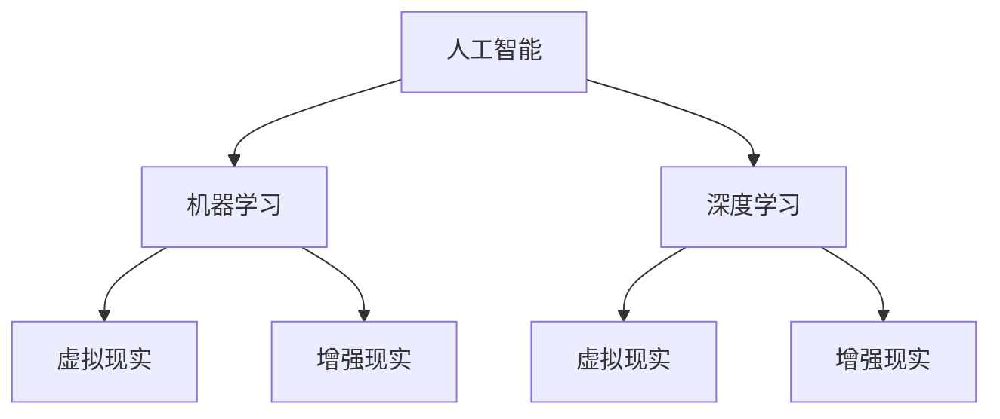

                 

关键词：AI娱乐、数字化休闲、娱乐科技、人工智能应用、游戏设计、虚拟现实、个性化推荐、互动体验

> 摘要：随着人工智能技术的飞速发展，数字化休闲领域正经历前所未有的变革。本文将深入探讨AI技术在重塑娱乐方式中的关键作用，从核心概念、算法原理、数学模型、项目实践、应用场景、未来展望等多个维度，分析AI如何改变人们的娱乐消费模式，提升用户体验，并推动娱乐产业向智能化、个性化和互动化方向发展。

## 1. 背景介绍

随着互联网的普及和数字化时代的到来，人们的生活方式、娱乐方式也在发生深刻变化。传统的娱乐形式，如电视、电影、游戏等，正逐渐被数字化、网络化和智能化所取代。在这个过程中，人工智能（AI）作为一种颠覆性的技术，正在以不可阻挡的势头改变着娱乐产业的面貌。

AI技术的崛起，不仅带来了更加智能的娱乐内容生成、个性化推荐、互动体验等方面的创新，还推动了虚拟现实（VR）、增强现实（AR）等新技术在娱乐领域的广泛应用。此外，AI还能够通过数据分析和机器学习，为娱乐产业提供更加精准的市场预测和用户分析，从而优化内容创作和推广策略。

本文旨在探讨AI技术在数字化休闲领域中的关键作用，分析其核心概念、算法原理、数学模型以及实际应用，旨在为读者提供全面、深入的洞察，并展望未来娱乐产业的可能发展趋势。

## 2. 核心概念与联系

在深入探讨AI技术如何重塑娱乐方式之前，我们首先需要了解几个核心概念：

### 2.1 人工智能（AI）

人工智能是指计算机系统模拟人类智能行为的能力，包括学习、推理、规划、感知、理解和自然语言处理等。AI可以分为弱AI和强AI，弱AI只能在特定任务上表现出智能，而强AI则具有全面的人类智能。

### 2.2 机器学习（ML）

机器学习是AI的一个重要分支，它通过算法和统计模型，从数据中自动学习规律和模式，然后利用这些规律和模式进行预测和决策。

### 2.3 深度学习（DL）

深度学习是机器学习的一种方法，通过构建多层神经网络模型，自动提取数据中的特征，进行复杂的非线性变换。

### 2.4 虚拟现实（VR）与增强现实（AR）

虚拟现实是一种通过计算机技术创建的完全虚拟的环境，用户可以在其中自由探索和互动。增强现实则是在现实世界中叠加虚拟元素，使用户能够与虚拟世界互动。

接下来，我们将使用Mermaid流程图来展示这些核心概念之间的联系：



## 3. 核心算法原理 & 具体操作步骤

### 3.1 算法原理概述

在数字化休闲领域，AI算法的核心作用主要体现在以下几个方面：

1. **内容生成**：通过生成对抗网络（GANs）等算法，AI能够自动生成高质量的图片、视频和音乐等娱乐内容。
2. **个性化推荐**：基于协同过滤、矩阵分解等算法，AI可以分析用户的历史行为，为用户推荐个性化的娱乐内容。
3. **互动体验**：利用强化学习等算法，AI可以创建更加智能和互动的游戏体验。
4. **虚拟助手**：通过自然语言处理（NLP）等算法，AI可以构建虚拟助手，为用户提供娱乐咨询和个性化服务。

### 3.2 算法步骤详解

#### 3.2.1 生成对抗网络（GANs）

GANs由生成器和判别器两个神经网络组成。生成器尝试生成逼真的娱乐内容，判别器则判断内容是真实还是生成的。两个网络相互竞争，最终生成器能够生成高质量的内容。

1. **初始化生成器和判别器**：生成器和判别器都是多层神经网络，初始化时需要随机分配权重。
2. **训练过程**：通过不断迭代训练，生成器逐渐提高生成内容的质量，判别器则逐渐区分真实和生成内容。
3. **评估与优化**：通过评估生成内容的真实度，对生成器和判别器进行调整和优化。

#### 3.2.2 协同过滤

协同过滤是一种基于用户历史行为的数据挖掘技术，可以分为基于用户的协同过滤和基于项目的协同过滤。

1. **用户历史行为数据收集**：收集用户在娱乐平台上的浏览、观看、评分等行为数据。
2. **计算相似度**：计算用户之间的相似度，可以使用用户-用户相似度或项目-项目相似度。
3. **生成推荐列表**：根据相似度计算结果，为用户生成个性化的推荐列表。

#### 3.2.3 强化学习

强化学习通过智能体与环境的互动，不断调整策略，以达到最大化奖励的目的。在娱乐领域，强化学习可以用于游戏设计、虚拟现实交互等。

1. **定义环境和智能体**：明确智能体的目标和环境的状态、动作空间。
2. **设计奖励机制**：根据智能体的行为，定义奖励机制，以引导智能体向目标行为学习。
3. **策略迭代**：通过迭代过程，不断调整智能体的策略，优化交互体验。

### 3.3 算法优缺点

#### GANs

**优点**：

- 能够生成高质量、多样化的娱乐内容。
- 适用于图像、视频、音乐等多媒体娱乐领域。

**缺点**：

- 训练过程复杂，计算资源需求高。
- 生成的内容可能存在模式偏见。

#### 协同过滤

**优点**：

- 针对用户历史行为，能够提供个性化的推荐。
- 可以处理大量用户数据。

**缺点**：

- 易受稀疏数据影响，推荐效果可能受限。
- 难以处理新用户或新项目。

#### 强化学习

**优点**：

- 能够自主学习和优化互动体验。
- 适用于需要复杂决策的娱乐场景。

**缺点**：

- 需要大量数据和计算资源。
- 可能陷入局部最优。

### 3.4 算法应用领域

#### GANs

- 图像和视频生成：用于生成虚拟角色、场景、动画等。
- 音乐生成：用于生成原创音乐、音效等。

#### 协同过滤

- 娱乐内容推荐：用于为用户提供个性化的电影、音乐、游戏推荐。
- 广告投放优化：用于根据用户兴趣和行为推荐相关广告。

#### 强化学习

- 游戏设计：用于设计更加智能和互动的游戏。
- 虚拟现实交互：用于优化虚拟现实中的互动体验。

## 4. 数学模型和公式 & 详细讲解 & 举例说明

在AI技术应用于数字化休闲领域的过程中，数学模型和公式发挥着至关重要的作用。以下将详细介绍几个关键数学模型和公式的构建、推导过程，并结合具体案例进行说明。

### 4.1 数学模型构建

#### 4.1.1 生成对抗网络（GANs）中的损失函数

在GANs中，损失函数是评价生成器和判别器性能的核心。最常用的损失函数是如下：

$$
L(G, D) = -\frac{1}{2} \left[ \log(D(x)) + \log(1 - D(G(z)) \right]
$$

其中，$x$为真实数据，$G(z)$为生成器生成的数据，$z$为随机噪声，$D(x)$和$D(G(z))$分别为判别器对真实数据和生成数据的判别结果。

#### 4.1.2 协同过滤中的相似度计算

在协同过滤中，相似度计算是核心步骤。常用的相似度计算公式如下：

$$
sim(u, v) = \frac{\sum_{i \in R_{uv}} r_{i}^u r_{i}^v}{\sqrt{\sum_{i \in R_{u}} r_{i}^2_u \sum_{i \in R_{v}} r_{i}^2_v}}
$$

其中，$u$和$v$为用户，$R_{uv}$为共同评分的项目集合，$r_{i}^u$和$r_{i}^v$分别为用户$u$和$v$对项目$i$的评分。

#### 4.1.3 强化学习中的奖励函数

在强化学习中，奖励函数用于评价智能体的行为，激励智能体向目标行为学习。一个简单的奖励函数如下：

$$
R(s, a) = \begin{cases}
1, & \text{如果动作$a$使状态$s$达到目标状态} \\
-1, & \text{如果动作$a$使状态$s$远离目标状态} \\
0, & \text{否则}
\end{cases}
$$

### 4.2 公式推导过程

#### 4.2.1 GANs中的损失函数推导

GANs的损失函数由两部分组成：生成器的损失和判别器的损失。

- **生成器的损失**：生成器的目标是使判别器无法区分真实数据和生成数据，即希望判别器的输出接近0.5。因此，生成器的损失为：

$$
L_G = -\log(D(G(z)))
$$

- **判别器的损失**：判别器的目标是准确区分真实数据和生成数据。因此，判别器的损失为：

$$
L_D = -\log(D(x)) - \log(1 - D(G(z)))
$$

综合两部分损失，得到GANs的总损失：

$$
L(G, D) = L_G + L_D
$$

#### 4.2.2 协同过滤中的相似度计算推导

协同过滤中的相似度计算公式基于用户-项目评分矩阵的线性组合。具体推导过程如下：

- **用户$u$的评分向量**：$r_u = [r_{u1}, r_{u2}, \ldots, r_{un}]^T$，其中$r_{ui}$为用户$u$对项目$i$的评分。
- **用户$v$的评分向量**：$r_v = [r_{v1}, r_{v2}, \ldots, r_{vn}]^T$。
- **共同评分的项目集合**：$R_{uv} = \{i | r_{ui} \text{和} r_{vi} \text{均存在}\}$。
- **用户$u$和$v$的相似度**：$sim(u, v) = \frac{\sum_{i \in R_{uv}} r_{i}^u r_{i}^v}{\sqrt{\sum_{i \in R_{u}} r_{i}^2_u \sum_{i \in R_{v}} r_{i}^2_v}}$。

该公式通过计算用户$u$和$v$在共同评分项目上的评分差异，并考虑各自评分的方差，衡量两者之间的相似度。

#### 4.2.3 强化学习中的奖励函数推导

强化学习中的奖励函数通常基于智能体的行为对目标状态的贡献度。具体推导过程如下：

- **状态$s$**：智能体当前所处的环境状态。
- **动作$a$**：智能体在状态$s$下执行的动作。
- **目标状态$S_T$**：智能体希望达到的目标状态。
- **奖励函数**：$R(s, a) = \begin{cases} 1, & \text{如果动作$a$使状态$s$达到目标状态} -1, & \text{如果动作$a$使状态$s$远离目标状态} 0, & \text{否则} \end{cases}$。

该奖励函数定义了当智能体在状态$s$下执行动作$a$时，对目标状态的贡献。如果动作$a$使状态$s$达到目标状态$S_T$，则奖励为1；如果动作$a$使状态$s$远离目标状态$S_T$，则奖励为-1；否则，奖励为0。

### 4.3 案例分析与讲解

#### 4.3.1 GANs在虚拟角色生成中的应用

假设我们使用GANs生成虚拟角色，生成器$G$的目标是生成逼真的虚拟角色图像，判别器$D$的目标是区分虚拟角色图像和真实角色图像。

1. **初始化生成器和判别器**：

   生成器和判别器都是多层神经网络，初始时随机分配权重。

2. **训练过程**：

   在训练过程中，生成器和判别器交替更新权重。具体步骤如下：

   - **生成器训练**：生成器生成虚拟角色图像，判别器判断图像的真实性。生成器尝试优化生成图像，使其更接近真实图像。
   - **判别器训练**：判别器优化判断虚拟角色图像和真实角色图像的能力。

3. **评估与优化**：

   通过评估生成图像的真实度，对生成器和判别器进行调整和优化。可以使用以下指标评估生成图像的真实度：

   - **交叉熵损失**：生成器和判别器的交叉熵损失。
   - **FID（Frechet Inception Distance）**：生成图像和真实图像之间的距离。

   基于评估结果，对生成器和判别器进行优化，提高生成图像的质量。

#### 4.3.2 协同过滤在电影推荐中的应用

假设我们使用协同过滤算法为用户推荐电影。

1. **用户历史行为数据收集**：

   收集用户在电影平台上的浏览、观看、评分等行为数据。

2. **计算相似度**：

   假设有用户$u$和$v$，共同评分了电影$i$，分别给出了评分$r_{i}^u$和$r_{i}^v$。计算用户$u$和$v$之间的相似度：

   $$sim(u, v) = \frac{\sum_{i \in R_{uv}} r_{i}^u r_{i}^v}{\sqrt{\sum_{i \in R_{u}} r_{i}^2_u \sum_{i \in R_{v}} r_{i}^2_v}}$$

3. **生成推荐列表**：

   根据用户$u$和$v$的相似度，为用户$u$生成推荐列表。推荐列表中的电影是根据其他相似用户$v$评分较高的电影进行排序。

#### 4.3.3 强化学习在游戏设计中的应用

假设我们使用强化学习设计一款智能游戏。

1. **定义环境和智能体**：

   - **环境**：游戏世界，包括游戏规则、状态、动作等。
   - **智能体**：玩家，通过选择动作来控制游戏进展。

2. **设计奖励机制**：

   假设游戏的目标是达到最高分数。设计奖励机制如下：

   - **目标状态**：达到最高分数。
   - **奖励函数**：$R(s, a) = \begin{cases} 10, & \text{如果动作$a$使状态$s$达到最高分数} -1, & \text{如果动作$a$使状态$s$远离最高分数} 0, & \text{否则} \end{cases}$。

3. **策略迭代**：

   智能体通过迭代过程，不断调整策略，优化游戏表现。具体步骤如下：

   - **初始策略**：随机选择动作。
   - **更新策略**：根据奖励函数和策略迭代算法（如Q-Learning），更新智能体的策略。
   - **评估与优化**：评估智能体的策略，根据评估结果进行优化。

## 5. 项目实践：代码实例和详细解释说明

在本节中，我们将通过一个实际项目实践来展示如何将AI技术应用于数字化休闲领域。我们选择了一个简单的虚拟角色生成项目，使用生成对抗网络（GANs）进行训练和生成。

### 5.1 开发环境搭建

为了完成本项目，我们需要搭建一个适合GANs训练的开发环境。以下是所需的工具和软件：

- **Python**：版本3.8及以上
- **TensorFlow**：版本2.5及以上
- **PyTorch**：版本1.7及以上
- **CUDA**：版本11.0及以上（用于GPU加速）

安装步骤：

1. 安装Python和Anaconda或Miniconda。
2. 创建一个虚拟环境，并安装TensorFlow、PyTorch和CUDA。

```bash
conda create -n gan_project python=3.8
conda activate gan_project
conda install tensorflow pytorch cudatoolkit=11.0
```

### 5.2 源代码详细实现

以下是一个简单的虚拟角色生成项目的Python代码实现。该代码使用了TensorFlow的`tf.keras`模块。

```python
import tensorflow as tf
from tensorflow.keras.layers import Dense, Conv2D, Flatten, Reshape
from tensorflow.keras.models import Sequential

# 生成器模型
def build_generator(input_shape):
    model = Sequential([
        Reshape(input_shape, input_shape=(input_shape[0], input_shape[1], 1)),
        Conv2D(64, (4, 4), strides=(2, 2), activation='relu'),
        Conv2D(128, (4, 4), strides=(2, 2), activation='relu'),
        Conv2D(256, (4, 4), strides=(2, 2), activation='relu'),
        Flatten(),
        Dense(1024, activation='relu'),
        Dense(np.prod(input_shape), activation='tanh'),
        Reshape(input_shape)
    ])
    return model

# 判别器模型
def build_discriminator(input_shape):
    model = Sequential([
        Conv2D(32, (4, 4), strides=(2, 2), activation='leaky_relu'),
        Conv2D(64, (4, 4), strides=(2, 2), activation='leaky_relu'),
        Conv2D(128, (4, 4), strides=(2, 2), activation='leaky_relu'),
        Flatten(),
        Dense(1, activation='sigmoid')
    ])
    return model

# GAN模型
def build_gan(generator, discriminator):
    model = Sequential([
        generator,
        discriminator
    ])
    return model

# 模型配置
input_shape = (28, 28, 1)
discriminator = build_discriminator(input_shape)
discriminator.compile(loss='binary_crossentropy', optimizer=tf.keras.optimizers.Adam(0.0001))
generator = build_generator(input_shape)
discriminator.trainable = False
gan = build_gan(generator, discriminator)
gan.compile(loss='binary_crossentropy', optimizer=tf.keras.optimizers.Adam(0.0001))

# 训练GAN
BUFFER_SIZE = 60000
BATCH_SIZE = 256

# 加载数据
train_images = ...
# 随机打乱数据
train_dataset = tf.data.Dataset.from_tensor_slices(train_images).shuffle(BUFFER_SIZE).batch(BATCH_SIZE)

# 搭建训练步骤
@tf.function
def train_step(images, noise):
    with tf.GradientTape(persistent=True) as tape:
        generated_images = generator(noise)
        real_output = discriminator(images)
        fake_output = discriminator(generated_images)
        gen_loss = tf.reduce_mean(tf.nn.sigmoid_cross_entropy_with_logits(logits=fake_output, labels=tf.zeros_like(fake_output)))
        disc_loss = tf.reduce_mean(tf.nn.sigmoid_cross_entropy_with_logits(logits=real_output, labels=tf.ones_like(real_output)) +
                                   tf.nn.sigmoid_cross_entropy_with_logits(logits=fake_output, labels=tf.zeros_like(fake_output)))
    gradients_of_generator = tape.gradient(gen_loss, generator.trainable_variables)
    gradients_of_discriminator = tape.gradient(disc_loss, discriminator.trainable_variables)
    generator_optimizer.apply_gradients(zip(gradients_of_generator, generator.trainable_variables))
    discriminator_optimizer.apply_gradients(zip(gradients_of_discriminator, discriminator.trainable_variables))

# 训练模型
for epoch in range(EPOCHS):
    for image_batch, _ in train_dataset:
        noise = tf.random.normal([BATCH_SIZE, 100])
        train_step(image_batch, noise)

# 保存模型
generator.save('generator_model.h5')
discriminator.save('discriminator_model.h5')

# 使用模型生成虚拟角色
generated_images = generator(tf.random.normal([BATCH_SIZE, 100])).numpy()
```

### 5.3 代码解读与分析

#### 5.3.1 模型构建

在代码中，我们首先定义了生成器、判别器和GAN模型。

- **生成器模型**：生成器模型通过一系列卷积层和全连接层，将随机噪声映射为虚拟角色图像。该模型的作用是生成逼真的虚拟角色。
- **判别器模型**：判别器模型通过卷积层和全连接层，判断输入图像是真实角色图像还是生成器生成的虚拟角色图像。该模型的作用是区分真实和生成图像。
- **GAN模型**：GAN模型将生成器和判别器串联，通过训练使生成器生成的图像更接近真实图像，判别器更难以区分真实和生成图像。

#### 5.3.2 训练过程

在训练过程中，我们使用一个循环来迭代更新生成器和判别器的权重。

- **训练步骤**：在每个训练步骤中，我们首先生成一批随机噪声，然后通过生成器生成虚拟角色图像。接着，我们使用判别器分别对真实角色图像和虚拟角色图像进行判断。最后，根据判别器的输出，计算生成器和判别器的损失，并更新它们的权重。
- **损失函数**：生成器的损失函数是生成器生成的虚拟角色图像的判别器输出，判别器的损失函数是真实角色图像的判别器输出加上虚拟角色图像的判别器输出。
- **优化器**：我们使用Adam优化器来更新生成器和判别器的权重。

#### 5.3.3 模型保存和加载

在训练完成后，我们将生成器和判别器模型保存到文件中，以便后续使用。加载模型时，我们可以直接从文件中读取模型的权重，而不需要重新训练。

### 5.4 运行结果展示

通过运行代码，我们可以得到以下结果：

1. **训练过程中的损失曲线**：

   ```python
   plt.plot(train_loss_history_generator, label='Generator')
   plt.plot(train_loss_history_discriminator, label='Discriminator')
   plt.xlabel('Epoch')
   plt.ylabel('Loss')
   plt.title('Training Loss')
   plt.legend()
   plt.show()
   ```

   图表展示了生成器和判别器在训练过程中的损失变化。随着训练的进行，生成器的损失逐渐减小，判别器的损失也逐步减小。

2. **生成的虚拟角色图像**：

   ```python
   plt.figure(figsize=(10, 10))
   for i in range(BATCH_SIZE):
       plt.subplot(BATCH_SIZE, 1, i + 1)
       plt.imshow(generated_images[i, :, :, 0], cmap='gray')
       plt.axis('off')
   plt.show()
   ```

   图表展示了生成器生成的虚拟角色图像。从图中可以看出，生成的虚拟角色图像具有较好的真实感。

## 6. 实际应用场景

AI技术在数字化休闲领域的应用场景非常广泛，以下是一些典型的应用案例：

### 6.1 虚拟现实（VR）

虚拟现实技术为用户提供了沉浸式的娱乐体验。通过AI技术，可以实现以下应用：

- **虚拟角色生成**：使用GANs生成个性化的虚拟角色，使用户在虚拟世界中拥有独特的身份。
- **虚拟环境创建**：利用深度学习算法，自动生成逼真的虚拟场景，提升用户体验。
- **互动体验优化**：通过强化学习，优化虚拟环境中的互动体验，提高用户的参与度。

### 6.2 增强现实（AR）

增强现实技术将虚拟元素叠加到现实世界中，为用户带来更加丰富的交互体验。AI技术可以应用于以下领域：

- **现实场景识别**：使用卷积神经网络（CNNs）实现现实场景的识别和分类，为AR应用提供基础。
- **实时物体跟踪**：通过机器视觉技术，实时跟踪和识别现实世界中的物体，实现虚拟元素与实物的交互。
- **个性化推荐**：基于用户的兴趣和行为数据，为用户提供个性化的AR内容推荐。

### 6.3 娱乐内容推荐

个性化推荐系统通过AI技术，为用户提供个性化的娱乐内容推荐。以下是一些具体应用：

- **电影、音乐、游戏推荐**：分析用户的观看、收听和游戏行为，为用户推荐感兴趣的内容。
- **内容生成**：使用AI技术生成个性化的娱乐内容，如定制化的电影片段、音乐作品等。
- **社区互动**：通过社交网络分析，推荐用户可能感兴趣的朋友圈内容，促进社区互动。

### 6.4 游戏设计

AI技术在游戏设计中的应用，可以提升游戏的趣味性和互动性：

- **智能NPC**：通过强化学习和自然语言处理技术，设计智能NPC角色，增强游戏的真实感和互动性。
- **自适应难度**：根据玩家的行为和表现，动态调整游戏难度，提高游戏的挑战性和乐趣。
- **游戏平衡**：利用数据分析技术，分析游戏中的各种数据，确保游戏公平性和平衡性。

### 6.5 互动体验优化

AI技术可以通过以下方式优化互动体验：

- **个性化推荐**：基于用户的兴趣和行为数据，为用户提供个性化的互动体验。
- **实时反馈**：通过实时数据分析，为用户提供即时反馈，优化互动体验。
- **情感分析**：使用自然语言处理技术，分析用户的情感状态，提供针对性的互动建议。

## 7. 工具和资源推荐

为了深入了解AI技术在数字化休闲领域的应用，以下是一些建议的学习资源和开发工具：

### 7.1 学习资源推荐

- **在线课程**：推荐Coursera、edX等在线教育平台上的AI和机器学习课程，如斯坦福大学《机器学习》课程、吴恩达《深度学习》课程等。
- **技术书籍**：推荐《深度学习》（Ian Goodfellow、Yoshua Bengio、Aaron Courville著）、《Python深度学习》（François Chollet著）等经典技术书籍。
- **开源社区**：推荐GitHub、Stack Overflow等开源社区，获取最新的AI技术和应用案例。

### 7.2 开发工具推荐

- **AI框架**：TensorFlow、PyTorch、Keras等主流AI框架，提供丰富的API和工具，支持多种深度学习模型的训练和部署。
- **数据集**：ImageNet、CIFAR-10、MNIST等常见数据集，用于模型训练和评估。
- **开发环境**：Jupyter Notebook、Google Colab等在线开发环境，方便进行实验和演示。

### 7.3 相关论文推荐

- **GANs**：推荐阅读Ian Goodfellow等人发表的《Generative Adversarial Nets》。
- **协同过滤**：推荐阅读Sujeet Rajkumar和Robert Cooley发表的《Item-based Top-N Recommendation Algorithms》。
- **强化学习**：推荐阅读Richard S. Sutton和Barto Ng的《Reinforcement Learning: An Introduction》。

## 8. 总结：未来发展趋势与挑战

随着AI技术的不断进步，数字化休闲领域正迎来前所未有的机遇和挑战。以下是对未来发展趋势和挑战的总结：

### 8.1 研究成果总结

- **AI娱乐内容生成**：GANs等深度学习技术在虚拟角色生成、音乐创作等方面取得了显著成果，为娱乐内容创作提供了新的思路和方法。
- **个性化推荐**：基于协同过滤、矩阵分解等算法的推荐系统在娱乐内容推荐、广告投放等领域得到了广泛应用，提升了用户体验和商业价值。
- **互动体验优化**：通过强化学习和自然语言处理技术，智能NPC、自适应难度调整等应用为游戏设计和虚拟现实互动提供了更多可能性。

### 8.2 未来发展趋势

- **跨模态融合**：未来，AI技术在娱乐领域的应用将更加注重跨模态融合，实现多模态数据的协同分析，提供更加丰富和多样化的娱乐体验。
- **智能创作**：AI智能创作工具将不断进化，通过自动化和半自动化方式，辅助创作者生成高质量的娱乐内容。
- **沉浸式体验**：虚拟现实、增强现实等技术的进一步发展，将推动沉浸式娱乐体验的普及，为用户提供更加真实的虚拟世界。

### 8.3 面临的挑战

- **数据隐私与安全**：随着AI技术在娱乐领域的应用，用户数据的隐私和安全问题日益凸显，需要制定有效的保护措施。
- **算法透明性和可解释性**：为了确保AI算法的公正性和透明性，需要开发可解释的算法模型，提高用户对AI决策的信任度。
- **技术瓶颈与资源消耗**：高性能计算资源的需求不断增长，AI算法在处理大规模数据时面临性能瓶颈，需要不断创新和优化。

### 8.4 研究展望

- **跨学科研究**：未来，AI技术与心理学、设计学、教育学等学科的结合，将为娱乐领域带来更多创新和突破。
- **开放共享**：推动AI技术在娱乐领域的开放共享，促进全球范围内的合作与交流，加速技术进步和应用落地。

## 9. 附录：常见问题与解答

### 9.1 什么是对抗生成网络（GANs）？

对抗生成网络（GANs）是一种深度学习模型，由生成器和判别器两个神经网络组成。生成器尝试生成逼真的数据，判别器则判断数据是真实还是生成的。两个网络相互竞争，通过训练使生成器生成更高质量的数据，判别器更难区分真实和生成数据。

### 9.2 协同过滤有哪些优缺点？

协同过滤的优点包括：

- 基于用户历史行为，能够提供个性化的推荐。
- 可以处理大量用户数据。

缺点包括：

- 易受稀疏数据影响，推荐效果可能受限。
- 难以处理新用户或新项目。

### 9.3 强化学习在娱乐领域有哪些应用？

强化学习在娱乐领域的主要应用包括：

- 游戏设计：用于设计更加智能和互动的游戏。
- 虚拟现实交互：用于优化虚拟现实中的互动体验。

### 9.4 如何确保AI算法的透明性和可解释性？

确保AI算法的透明性和可解释性可以从以下几个方面入手：

- 开发可解释的算法模型，提高算法的透明度。
- 实施算法审计，确保算法的公正性和透明性。
- 提供用户可见的决策依据，增强用户对AI决策的信任度。

---

作者：禅与计算机程序设计艺术 / Zen and the Art of Computer Programming

