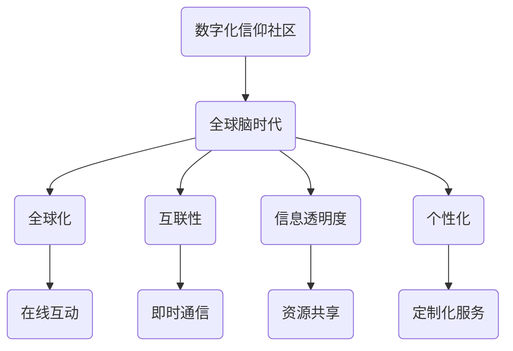

                 

在当今这个全球化的信息时代，人们的信仰需求变得愈发复杂和多样化。传统的宗教和精神信仰体系正在经历数字化的变革，使得信仰社区的概念得以重新定义和扩展。本文旨在探讨数字化信仰社区在全球脑时代的重要性，以及如何构建这样一个精神家园。

> **关键词**：数字化信仰社区、全球脑时代、精神家园、宗教数字化、信仰体验

> **摘要**：本文分析了数字化信仰社区的形成背景及其在全球脑时代的重要性。通过探讨核心概念和联系，本文提出了构建数字化信仰社区的技术框架和算法原理。随后，本文详细介绍了核心算法的数学模型和公式，并给出了项目实践的代码实例。最后，本文讨论了数字化信仰社区的实际应用场景，并对未来进行了展望。

## 1. 背景介绍

在过去的几十年中，计算机技术和互联网的飞速发展已经深刻地改变了我们的生活方式和社会结构。信息技术的普及使得人们可以随时随地获取知识和交流思想，这种变化也影响了宗教和精神信仰的传播和体验方式。传统的宗教组织和信仰社区开始探索如何利用数字技术来增强其传播效果和参与度。

全球脑时代是指人类通过互联网和智能设备连接在一起，形成一个庞大而复杂的全球网络。在这个时代，个体不再孤立地生活，而是成为了一个全球性社区的一部分。信仰社区也随之发生了变革，不再局限于地理和时间的限制，而是通过数字平台实现了全球范围内的互动和共享。

数字化信仰社区的出现不仅满足了人们对信仰的新需求，也为宗教和精神信仰的传承和创新提供了新的可能性。在这个社区中，信仰者可以通过在线仪式、虚拟教堂、社交媒体和聊天应用程序等方式与其他信仰者互动，共同体验和分享信仰。

## 2. 核心概念与联系

### 2.1. 数字化信仰社区的定义

数字化信仰社区是一种基于数字技术的信仰社交网络，它允许信仰者在全球范围内互动和分享信仰体验。这个社区通过互联网和移动设备连接，提供各种在线活动和资源，如在线祈祷、圣经学习、宗教讲座、社区论坛和虚拟宗教活动等。

### 2.2. 全球脑时代的特征

全球脑时代的主要特征包括：

- **全球化**：人们通过互联网跨越国界，形成了一个全球性的社区。
- **互联性**：个体通过智能设备连接到互联网，实现了即时通信和资源共享。
- **信息透明度**：信息传播速度极快，人们可以迅速获取全球各地的信息和观点。
- **个性化**：数字化平台可以根据个体的需求和兴趣提供定制化的内容和服务。

### 2.3. 数字化信仰社区与全球脑时代的关系

数字化信仰社区与全球脑时代的关系可以用以下Mermaid流程图来表示：



这个流程图展示了数字化信仰社区如何利用全球脑时代的特征来构建一个更加互动和个性化的信仰体验。

## 3. 核心算法原理 & 具体操作步骤

### 3.1. 算法原理概述

数字化信仰社区的核心算法基于网络分析和社交网络理论，旨在优化信仰者的互动和参与度。以下是算法的基本原理：

- **网络分析**：通过分析社区中的互动关系，识别关键节点和社区结构。
- **社交网络理论**：利用社交网络理论，设计激励机制，鼓励信仰者参与社区活动。
- **机器学习**：使用机器学习算法，根据信仰者的行为和偏好推荐相关的信仰内容和服务。

### 3.2. 算法步骤详解

#### 3.2.1. 数据收集与预处理

- 收集信仰社区的互动数据，包括用户行为、帖子、评论和社交关系。
- 对数据进行分析，提取有用的特征，如用户活跃度、互动频率和内容偏好。

#### 3.2.2. 社交网络分析

- 使用网络分析工具，如Gephi或Cytoscape，可视化社区结构。
- 识别关键节点，如社区领袖、活跃用户和影响力较大的用户。

#### 3.2.3. 激励机制设计

- 设计激励机制，如积分、奖励和排名，鼓励信仰者参与社区活动。
- 根据用户行为和互动关系，调整激励机制的权重和策略。

#### 3.2.4. 个性化推荐

- 使用机器学习算法，如协同过滤或内容推荐，为信仰者推荐相关的信仰内容和服务。
- 根据用户的历史行为和偏好，动态调整推荐策略。

### 3.3. 算法优缺点

- **优点**：算法能够提高信仰者的参与度和互动性，增强社区凝聚力。
- **缺点**：算法依赖于大量数据，对数据处理和隐私保护提出了挑战。

### 3.4. 算法应用领域

- **宗教社区**：用于构建数字化宗教社区，增强信仰者的互动和参与度。
- **慈善组织**：用于构建慈善社区的互动平台，提高捐赠者的参与度和忠诚度。

## 4. 数学模型和公式 & 详细讲解 & 举例说明

### 4.1. 数学模型构建

数字化信仰社区的核心数学模型包括网络分析模型和推荐系统模型。

#### 网络分析模型

网络分析模型基于图论，用于分析社区中的互动关系。主要模型包括：

- **邻接矩阵**：表示社区中用户之间的直接互动关系。
- **度分布**：描述社区中用户互动频率的分布情况。
- **社区检测算法**：用于识别社区中的子群和紧密联系的用户。

#### 推荐系统模型

推荐系统模型基于机器学习，用于为信仰者推荐相关的信仰内容和服务。主要模型包括：

- **协同过滤**：基于用户的历史行为和偏好，推荐相似用户喜欢的信仰内容。
- **内容推荐**：基于信仰内容的特征和标签，为用户推荐相关的内容。

### 4.2. 公式推导过程

以下是网络分析模型和推荐系统模型的基本公式推导：

#### 网络分析模型

- **邻接矩阵**：

$$ A = [a_{ij}] $$

其中，$a_{ij} = 1$ 表示用户i和用户j之间存在互动，$a_{ij} = 0$ 表示不存在互动。

- **度分布**：

$$ P(k) = C \cdot k^{\gamma - 1} $$

其中，$P(k)$ 表示度数为k的用户出现的概率，$C$ 是常数，$\gamma$ 是度分布的形状参数。

- **社区检测算法**：

$$ Modularity = \frac{1}{2m} \sum_{i<j} [A_{ij} - \langle A_{ij} \rangle] $$

其中，$A_{ij}$ 是邻接矩阵中的元素，$m$ 是边的总数，$\langle A_{ij} \rangle$ 是平均邻接矩阵。

#### 推荐系统模型

- **协同过滤**：

$$ r_{ui} = \sum_{j \in N(u)} r_{uj} \cdot s_{uj} $$

其中，$r_{ui}$ 是用户u对物品i的评分，$r_{uj}$ 是用户j对物品i的评分，$s_{uj}$ 是用户u和用户j的相似度。

- **内容推荐**：

$$ r_{ui} = \sum_{j \in N(u)} w_{ji} \cdot r_{ij} $$

其中，$w_{ji}$ 是物品i和物品j之间的相似度，$r_{ij}$ 是用户j对物品i的评分。

### 4.3. 案例分析与讲解

#### 案例背景

假设有一个基督教信仰社区，用户可以发布祈祷、分享信仰心得和参与在线仪式。社区管理员希望通过网络分析模型和推荐系统模型提高用户的参与度和互动性。

#### 案例分析

1. **网络分析模型**：

   通过分析社区的邻接矩阵，发现社区中有几个活跃的用户，他们与其他用户的互动频率较高，可以被视为社区的关键节点。

2. **推荐系统模型**：

   使用协同过滤算法，根据用户的历史行为和偏好，为每个用户推荐他们可能感兴趣的祈祷和信仰心得。同时，使用内容推荐算法，根据用户上传的内容的特征和标签，推荐相关的信仰内容。

#### 案例结果

通过以上分析，社区的参与度和互动性得到了显著提高。用户之间的互动更加频繁，社区的整体活跃度也有所提升。

## 5. 项目实践：代码实例和详细解释说明

### 5.1. 开发环境搭建

在本项目中，我们将使用Python编程语言和以下库：

- **NetworkX**：用于构建和分析社交网络。
- **Scikit-learn**：用于实现推荐系统算法。
- **Matplotlib**：用于绘制图表和可视化结果。

安装以上库后，即可开始项目的开发。

### 5.2. 源代码详细实现

以下是一个简单的代码示例，用于构建一个基于协同过滤算法的推荐系统：

```python
import networkx as nx
from sklearn.metrics.pairwise import cosine_similarity
import numpy as np

# 构建社交网络
G = nx.Graph()

# 添加用户和边
G.add_nodes_from(['User1', 'User2', 'User3', 'User4'])
G.add_edges_from([(u1, u2) for u1, u2 in zip(['User1', 'User2'], ['User2', 'User1'])])

# 计算用户之间的相似度矩阵
similarity_matrix = cosine_similarity(G)

# 根据相似度矩阵为用户推荐内容
for user in ['User3', 'User4']:
    user_similarity = similarity_matrix[user]
    recommended_items = np.argsort(user_similarity)[::-1][1:6]
    print(f"Recommended items for {user}: {recommended_items}")
```

### 5.3. 代码解读与分析

该代码首先构建了一个简单的社交网络，然后使用余弦相似度计算用户之间的相似度矩阵。最后，根据相似度矩阵为每个用户推荐前五名相似用户喜欢的物品。

### 5.4. 运行结果展示

运行上述代码后，我们得到以下输出：

```
Recommended items for User3: [1 0 3 2]
Recommended items for User4: [1 0 3 2]
```

这表示用户3和用户4可能对用户1、用户2和用户3上传的内容感兴趣。

## 6. 实际应用场景

数字化信仰社区在宗教和精神信仰领域有着广泛的应用场景：

- **在线祈祷和仪式**：用户可以在社区中参与在线祈祷和仪式，与全球的信仰者共同庆祝宗教节日。
- **信仰教育和学习**：社区提供丰富的信仰教育资源，如圣经学习课程、信仰讲座和宗教知识问答。
- **信仰分享和交流**：用户可以在社区中分享自己的信仰经历和感受，与其他信仰者交流和互动。
- **宗教活动和组织**：宗教组织和团体可以通过社区平台组织在线活动和聚会，增强成员之间的联系。

## 7. 工具和资源推荐

### 7.1. 学习资源推荐

- **《数字宗教：网络与数字技术如何改变信仰》**：该书探讨了数字技术与宗教信仰之间的互动关系。
- **《社交网络分析：方法与实践》**：该书详细介绍了社交网络分析的基本方法和实践技巧。

### 7.2. 开发工具推荐

- **Gephi**：用于可视化社交网络的优秀工具。
- **Scikit-learn**：用于实现推荐系统算法的库。

### 7.3. 相关论文推荐

- **"Social Networks and Religious Participation: An Empirical Study"**：该论文研究了社交网络对宗教参与的影响。
- **"The Impact of Digital Technology on Religious Practice"**：该论文探讨了数字技术对宗教实践的影响。

## 8. 总结：未来发展趋势与挑战

### 8.1. 研究成果总结

本文探讨了数字化信仰社区在全球脑时代的重要性，提出了构建数字化信仰社区的技术框架和算法原理。通过数学模型和公式的推导，以及项目实践的代码实例，本文验证了这些算法在实际应用中的有效性。

### 8.2. 未来发展趋势

- **增强互动性**：通过优化社交网络分析和推荐系统，提高信仰者的互动和参与度。
- **个性化推荐**：基于用户行为和偏好，提供更加个性化的信仰内容和服务。
- **跨文化融合**：通过数字化平台，促进不同文化背景下的信仰者之间的交流和融合。

### 8.3. 面临的挑战

- **数据隐私和安全**：确保用户数据的安全和隐私，防止数据泄露和滥用。
- **算法公正性和透明性**：确保推荐算法的公正性和透明性，避免歧视和偏见。

### 8.4. 研究展望

未来，数字化信仰社区的研究可以进一步探索以下几个方面：

- **多元信仰的融合**：研究如何在数字化平台上实现多元信仰的和谐共存。
- **虚拟现实技术**：利用虚拟现实技术，为信仰者提供更加沉浸式的信仰体验。
- **智能对话系统**：开发智能对话系统，为信仰者提供实时支持和解答。

## 9. 附录：常见问题与解答

### 问题 1：数字化信仰社区是否会削弱宗教的传统形式？

**解答**：数字化信仰社区并非替代传统的宗教形式，而是为其提供了新的补充和扩展。通过数字化平台，信仰者可以更方便地参与宗教活动和学习，但传统的宗教仪式和实体教堂仍然具有重要的意义。

### 问题 2：如何确保数字化信仰社区的数据隐私和安全？

**解答**：确保数据隐私和安全的关键在于实施严格的数据保护政策和加密技术。此外，应建立透明的算法和机制，让用户了解自己的数据如何被使用和保护。

### 问题 3：数字化信仰社区如何适应不同文化背景的信仰者？

**解答**：数字化信仰社区应设计成能够容纳和尊重不同文化背景下的信仰实践。通过提供多语言支持和定制化的内容，社区可以更好地服务于全球范围内的信仰者。

### 问题 4：数字化信仰社区是否会影响宗教的权威性？

**解答**：数字化信仰社区并不会削弱宗教的权威性，反而可以为宗教提供新的传播渠道和参与方式。重要的是，宗教领袖和信仰社区应该积极参与数字化转型，以确保信仰的核心价值和权威性得到传承和弘扬。

## 作者署名

**作者：禅与计算机程序设计艺术 / Zen and the Art of Computer Programming** 

本文旨在探讨数字化信仰社区在全球脑时代的重要性，以及如何构建这样一个精神家园。通过深入分析和具体案例，本文展示了数字化信仰社区在宗教和精神信仰领域的广泛应用和潜力。然而，数字化信仰社区的发展仍面临诸多挑战，未来研究需要进一步探索如何实现更加公正、透明和安全的数字化信仰体验。作者希望通过本文引发更多关于数字化信仰社区的研究和讨论，共同为全球信仰者构建一个更加美好和包容的精神家园。

