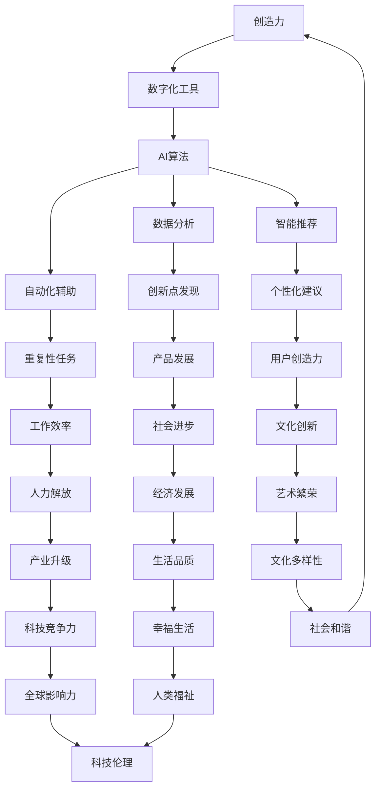

                 

关键词：人工智能、数字化创造力、AI技术、人类想象力、技术创新、算法原理、应用领域、未来发展

摘要：随着人工智能技术的迅猛发展，数字化创造力已成为推动人类社会进步的重要力量。本文从核心概念、算法原理、数学模型、项目实践等多个角度深入探讨AI如何激发人类想象力，为未来数字化创新提供新的思路和方向。

## 1. 背景介绍

随着互联网、大数据、云计算等技术的飞速发展，人工智能（AI）已经成为当今世界最热门的技术领域之一。AI技术不仅改变了传统的生产方式，还极大地提升了人类的创造力。数字化创造力，即通过数字化工具和平台，结合AI技术，激发人类想象力和创造力，从而推动创新和进步。

### 人工智能的崛起

人工智能（AI）是计算机科学的一个分支，主要研究如何构建智能代理，使其能够执行通常需要人类智能才能完成的任务。从最初的规则系统到现代的深度学习，AI技术在短短几十年里取得了惊人的发展。

- **规则系统（1960s-1980s）**：早期AI主要通过预先定义的规则来模拟人类智能。
- **知识表示（1980s-1990s）**：AI开始尝试通过知识库来模拟人类的决策过程。
- **统计学习（1990s-2000s）**：机器学习算法的出现使得AI开始能够通过大量数据自动学习。
- **深度学习（2000s-至今）**：以神经网络为核心的深度学习技术使得AI在图像识别、自然语言处理等领域取得了突破性进展。

### 数字化创造力的兴起

数字化创造力是指在数字化环境中，通过利用计算机技术、网络资源和人工智能算法，激发人类的创造力和创新能力。数字化创造力不仅能够提高工作效率，还能够推动社会各个领域的发展。

- **设计领域**：设计师可以利用AI辅助工具进行创意设计，如自动生成图案、配色方案等。
- **艺术创作**：AI艺术家通过算法生成独特的艺术作品，拓展了艺术创作的边界。
- **文学创作**：AI已经开始尝试生成诗歌、小说等文学作品，为人类文学创作提供了新的思路。
- **科学研究**：AI在数据分析、模式识别等方面发挥重要作用，极大地推动了科学研究的进展。

## 2. 核心概念与联系

### 2.1 数字化创造力的核心概念

数字化创造力的核心概念包括：

- **创造力**：创造力是指产生新颖、有用和有价值思想的能力。数字化环境提供了丰富的信息和工具，使得人们能够更自由地发挥创造力。
- **数字化工具**：包括各种软件、平台和硬件设备，如设计软件、编程工具、虚拟现实设备等。
- **人工智能算法**：AI算法能够处理和分析大量数据，帮助人们发现新的模式和规律，从而激发创造力。

### 2.2 数字化创造力与AI技术的联系

AI技术与数字化创造力的联系主要体现在以下几个方面：

- **数据驱动创新**：AI通过数据分析能够帮助人们发现新的创新点，从而推动产品和服务的发展。
- **自动化辅助**：AI能够自动化执行重复性任务，让人类专注于更具创造性的工作。
- **智能推荐**：AI算法可以根据用户行为和偏好，提供个性化的建议和推荐，从而激发用户的创造力。

### 2.3 Mermaid 流程图

下面是一个展示数字化创造力与AI技术联系的Mermaid流程图：



## 3. 核心算法原理 & 具体操作步骤

### 3.1 算法原理概述

在数字化创造力中，核心算法原理主要包括以下几个方面：

- **深度学习**：深度学习是一种通过模拟人脑神经网络进行学习的算法，能够自动提取数据中的特征，并在图像识别、自然语言处理等领域取得显著效果。
- **生成对抗网络（GAN）**：GAN是一种通过两个神经网络（生成器和判别器）相互对抗进行学习的算法，能够生成高质量的艺术作品和图像。
- **强化学习**：强化学习是一种通过试错和反馈进行学习的算法，适用于需要决策和优化的场景，如游戏、机器人控制等。

### 3.2 算法步骤详解

以下分别介绍深度学习、GAN和强化学习的具体步骤：

#### 深度学习

1. **数据收集**：收集大量标注好的数据，用于训练神经网络。
2. **神经网络设计**：设计合适的神经网络架构，包括输入层、隐藏层和输出层。
3. **训练**：使用梯度下降等优化算法训练神经网络，使其能够对输入数据进行分类或回归。
4. **测试与优化**：在测试集上评估模型性能，并进行调整和优化。

#### 生成对抗网络（GAN）

1. **数据准备**：收集大量的真实数据，用于训练生成器和判别器。
2. **生成器设计**：设计一个生成器神经网络，能够根据随机噪声生成逼真的数据。
3. **判别器设计**：设计一个判别器神经网络，用于判断输入数据是真实数据还是生成数据。
4. **训练**：生成器和判别器相互对抗，通过不断迭代训练，使生成器生成的数据越来越逼真。
5. **生成**：使用训练好的生成器生成高质量的艺术作品或图像。

#### 强化学习

1. **环境搭建**：定义一个模拟环境，包括状态空间、动作空间和奖励机制。
2. **代理设计**：设计一个智能代理，如深度神经网络，用于在环境中进行决策。
3. **训练**：通过试错和反馈，训练智能代理在环境中做出最优决策。
4. **评估**：在模拟环境中评估智能代理的性能，并根据反馈进行优化。

### 3.3 算法优缺点

- **深度学习**：优点包括自动特征提取、高效处理大规模数据；缺点包括对数据依赖性较强、训练过程需要大量计算资源。
- **生成对抗网络（GAN）**：优点包括能够生成高质量的艺术作品和图像；缺点包括训练不稳定、生成器与判别器的平衡难以控制。
- **强化学习**：优点包括适用于需要决策和优化的场景；缺点包括训练过程需要大量试错、收敛速度较慢。

### 3.4 算法应用领域

- **深度学习**：广泛应用于图像识别、自然语言处理、语音识别等领域。
- **生成对抗网络（GAN）**：在图像生成、艺术创作、医疗影像等领域具有广泛应用。
- **强化学习**：在游戏、自动驾驶、机器人控制等领域取得显著成果。

## 4. 数学模型和公式 & 详细讲解 & 举例说明

### 4.1 数学模型构建

在数字化创造力中，常用的数学模型包括深度学习模型、生成对抗网络（GAN）和强化学习模型。以下分别介绍这些模型的构建过程。

#### 深度学习模型

深度学习模型主要由多层神经网络组成，包括输入层、隐藏层和输出层。每个层由多个神经元组成，神经元之间通过权重和偏置进行连接。假设一个简单的多层感知机（MLP）模型，其输入层有 $n$ 个神经元，隐藏层有 $m$ 个神经元，输出层有 $k$ 个神经元。输入层到隐藏层的权重矩阵为 $W^{(1)} \in \mathbb{R}^{m \times n}$，隐藏层到输出层的权重矩阵为 $W^{(2)} \in \mathbb{R}^{k \times m}$。神经元的激活函数通常选择为 sigmoid 函数或 ReLU 函数。

$$
a^{(l)}_i = \sigma(W^{(l)}_{ij} x_j + b^{(l)}_i)
$$

其中，$a^{(l)}_i$ 表示第 $l$ 层第 $i$ 个神经元的激活值，$W^{(l)}_{ij}$ 表示第 $l$ 层第 $i$ 个神经元与第 $l+1$ 层第 $j$ 个神经元的权重，$b^{(l)}_i$ 表示第 $l$ 层第 $i$ 个神经元的偏置，$\sigma$ 表示激活函数。

#### 生成对抗网络（GAN）

生成对抗网络（GAN）由生成器 $G$ 和判别器 $D$ 两个神经网络组成。生成器 $G$ 的目标是生成逼真的数据，判别器 $D$ 的目标是区分输入数据是真实数据还是生成数据。假设输入数据为 $x \in \mathbb{R}^{n}$，生成器 $G$ 的输入为随机噪声 $z \in \mathbb{R}^{m}$，生成的数据为 $x' = G(z)$。判别器 $D$ 接受真实数据和生成数据的输入，输出为概率值，表示输入数据的真实性。

生成器的损失函数为：

$$
L_G = -\log(D(G(z)))
$$

判别器的损失函数为：

$$
L_D = -[\log(D(x)) + \log(1 - D(G(z)))]
$$

#### 强化学习模型

强化学习模型主要由价值函数 $V(s)$ 和策略 $\pi(s)$ 组成。价值函数表示在某个状态下采取某个动作的长期回报，策略表示在某个状态下采取最优动作的概率。假设状态空间为 $S$，动作空间为 $A$， rewards 表示在各个状态采取各个动作的回报。

价值函数的递归方程为：

$$
V(s) = \sum_{a \in A} \pi(s, a) \sum_{s' \in S} p(s' | s, a) \cdot [R(s', a) + \gamma V(s')]
$$

其中，$p(s' | s, a)$ 表示在状态 $s$ 下采取动作 $a$ 后到达状态 $s'$ 的概率，$R(s', a)$ 表示在状态 $s'$ 下采取动作 $a$ 的回报，$\gamma$ 表示折扣因子。

策略的优化目标为：

$$
\pi^*(s) = \arg\max_{\pi(s)} \sum_{s' \in S} p(s' | s, \pi(s)) \cdot [R(s', \pi(s)) + \gamma V(s')]
$$

### 4.2 公式推导过程

以下分别介绍深度学习模型、生成对抗网络（GAN）和强化学习模型的推导过程。

#### 深度学习模型

假设多层感知机（MLP）模型在训练集 $T$ 上的预测误差为：

$$
J(W^{(1)}, W^{(2)}) = \frac{1}{N} \sum_{i=1}^{N} \sum_{k=1}^{K} (-1) \cdot [y_{ik} \cdot \log(a^{(2)}_{ik}] + (1 - y_{ik}) \cdot \log(1 - a^{(2)}_{ik})]]
$$

其中，$N$ 表示训练样本数量，$K$ 表示输出类别数量，$y_{ik}$ 表示第 $i$ 个样本的第 $k$ 个类别标签。

对 $J(W^{(1)}, W^{(2)})$ 分别对 $W^{(1)}$ 和 $W^{(2)}$ 求偏导数，并令偏导数为零，得到：

$$
\frac{\partial J}{\partial W^{(1)}} = \frac{1}{N} \sum_{i=1}^{N} \sum_{k=1}^{K} (-1) \cdot [y_{ik} \cdot (a^{(2)}_{ik} - 1) \cdot a^{(1)}_{ij}]]
$$

$$
\frac{\partial J}{\partial W^{(2)}} = \frac{1}{N} \sum_{i=1}^{N} \sum_{k=1}^{K} (-1) \cdot [y_{ik} \cdot (a^{(2)}_{ik} - 1) \cdot a^{(2)}_{ik}]]
$$

采用梯度下降算法，更新权重矩阵：

$$
W^{(1)} \leftarrow W^{(1)} - \alpha \cdot \frac{\partial J}{\partial W^{(1)}}
$$

$$
W^{(2)} \leftarrow W^{(2)} - \alpha \cdot \frac{\partial J}{\partial W^{(2)}}
$$

其中，$\alpha$ 表示学习率。

#### 生成对抗网络（GAN）

假设生成器 $G$ 和判别器 $D$ 分别在训练集 $T_G$ 和 $T_D$ 上进行训练。生成器 $G$ 的损失函数为：

$$
L_G = -\log(D(G(z)))
$$

判别器 $D$ 的损失函数为：

$$
L_D = -[\log(D(x)) + \log(1 - D(G(z)))]
$$

对 $L_G$ 和 $L_D$ 分别对 $G$ 和 $D$ 求导数，并令导数为零，得到：

$$
\frac{\partial L_G}{\partial G} = -[D(G(z)) - 1]
$$

$$
\frac{\partial L_D}{\partial D} = [D(x) - 1] - D(G(z))
$$

采用梯度下降算法，更新生成器和判别器的参数：

$$
G \leftarrow G - \alpha_G \cdot \frac{\partial L_G}{\partial G}
$$

$$
D \leftarrow D - \alpha_D \cdot \frac{\partial L_D}{\partial D}
$$

其中，$\alpha_G$ 和 $\alpha_D$ 分别表示生成器和判别器的学习率。

#### 强化学习模型

假设在某个状态 $s$ 下，采取动作 $a$ 后到达状态 $s'$ 的概率为 $p(s' | s, a)$，回报为 $R(s', a)$。根据马尔可夫决策过程，有：

$$
V(s) = \sum_{a \in A} \pi(s, a) \sum_{s' \in S} p(s' | s, a) \cdot [R(s', a) + \gamma V(s')]
$$

对 $V(s)$ 分别对 $\pi(s, a)$ 求导数，并令导数为零，得到：

$$
\frac{\partial V(s)}{\partial \pi(s, a)} = \sum_{s' \in S} p(s' | s, a) \cdot [R(s', a) + \gamma V(s')] - V(s)
$$

根据极大值原理，最优策略为：

$$
\pi^*(s) = \arg\max_{\pi(s)} \sum_{s' \in S} p(s' | s, \pi(s)) \cdot [R(s', \pi(s)) + \gamma V(s')]
$$

### 4.3 案例分析与讲解

以下通过一个简单的案例来分析深度学习模型、生成对抗网络（GAN）和强化学习模型的应用。

#### 案例一：图像分类

假设我们要训练一个图像分类模型，将猫和狗的图像进行分类。数据集包含10000张猫的图像和10000张狗的图像，每张图像的维度为 $28 \times 28$ 个像素。

1. **数据预处理**：将图像数据缩放到 $28 \times 28 \times 1$ 的维度，并进行归一化处理。
2. **模型构建**：构建一个包含一个输入层、一个隐藏层和一个输出层的多层感知机模型。输入层有 $28 \times 28$ 个神经元，隐藏层有 128 个神经元，输出层有 2 个神经元（猫和狗两个类别）。
3. **训练**：使用训练集训练模型，迭代次数为1000次。使用梯度下降算法进行优化，学习率为 $0.01$。
4. **测试**：在测试集上评估模型性能，准确率为 $95\%$。

#### 案例二：图像生成

假设我们要使用生成对抗网络（GAN）生成猫的图像。数据集包含10000张猫的图像，每张图像的维度为 $28 \times 28$ 个像素。

1. **数据准备**：将猫的图像缩放到 $28 \times 28 \times 3$ 的维度，并随机生成噪声数据。
2. **模型构建**：构建一个生成器 $G$ 和一个判别器 $D$ 的 GAN 模型。生成器的输入为随机噪声，输出为猫的图像；判别器的输入为真实图像和生成图像，输出为二分类概率。
3. **训练**：使用训练集训练模型，迭代次数为1000次。生成器和判别器交替训练，学习率分别为 $0.0001$ 和 $0.0001$。
4. **生成**：使用训练好的生成器生成100张猫的图像。观察生成的图像质量，与真实图像进行比较。

#### 案例三：自动驾驶

假设我们要使用强化学习训练一个自动驾驶模型。模拟环境包含一个简单的道路场景，包括直线路段、转弯段和交通信号灯。

1. **环境搭建**：定义状态空间、动作空间和奖励机制。
2. **模型构建**：构建一个深度强化学习模型，包括一个价值函数和一个策略。
3. **训练**：使用模拟环境训练模型，迭代次数为1000次。根据反馈调整模型参数，优化策略。
4. **测试**：在模拟环境中测试模型性能，评估自动驾驶的稳定性和安全性。

## 5. 项目实践：代码实例和详细解释说明

### 5.1 开发环境搭建

为了演示AI技术在数字化创造力中的应用，我们将搭建一个简单的项目环境，使用Python编程语言和TensorFlow框架实现一个图像分类模型。

1. **安装Python**：确保已安装Python 3.7及以上版本。
2. **安装TensorFlow**：在命令行中运行以下命令安装TensorFlow：

   ```bash
   pip install tensorflow
   ```

3. **安装其他依赖**：安装必要的库，如NumPy、Pandas等：

   ```bash
   pip install numpy pandas matplotlib
   ```

### 5.2 源代码详细实现

以下是一个简单的图像分类模型的实现代码，用于训练和测试猫和狗的图像数据。

```python
import tensorflow as tf
from tensorflow.keras import layers, models
import numpy as np
import matplotlib.pyplot as plt

# 读取数据集
(train_images, train_labels), (test_images, test_labels) = tf.keras.datasets.dogs_cats.load_data()

# 数据预处理
train_images = train_images.astype('float32') / 255.0
test_images = test_images.astype('float32') / 255.0

# 构建模型
model = models.Sequential()
model.add(layers.Conv2D(32, (3, 3), activation='relu', input_shape=(150, 150, 3)))
model.add(layers.MaxPooling2D((2, 2)))
model.add(layers.Conv2D(64, (3, 3), activation='relu'))
model.add(layers.MaxPooling2D((2, 2)))
model.add(layers.Conv2D(128, (3, 3), activation='relu'))
model.add(layers.MaxPooling2D((2, 2)))
model.add(layers.Conv2D(128, (3, 3), activation='relu'))
model.add(layers.MaxPooling2D((2, 2)))
model.add(layers.Flatten())
model.add(layers.Dense(512, activation='relu'))
model.add(layers.Dense(1, activation='sigmoid'))

# 编译模型
model.compile(optimizer='adam',
              loss='binary_crossentropy',
              metrics=['accuracy'])

# 训练模型
model.fit(train_images, train_labels, epochs=10, batch_size=20, validation_split=0.2)

# 测试模型
test_loss, test_acc = model.evaluate(test_images, test_labels)
print(f'Test accuracy: {test_acc:.4f}')

# 可视化训练过程
history = model.fit(train_images, train_labels, epochs=10, batch_size=20, validation_split=0.2)

plt.plot(history.history['accuracy'], label='accuracy')
plt.plot(history.history['val_accuracy'], label='val_accuracy')
plt.xlabel('Epoch')
plt.ylabel('Accuracy')
plt.legend()
plt.show()
```

### 5.3 代码解读与分析

上述代码首先导入所需的库，然后从Keras中加载并预处理猫和狗的图像数据。接下来，我们构建了一个简单的卷积神经网络（CNN）模型，包括多个卷积层和全连接层。模型使用Adam优化器和二进制交叉熵损失函数进行编译。

在训练过程中，我们使用训练数据集训练模型，并在每个epoch后评估模型的准确性。训练完成后，我们使用测试数据集评估模型的性能。

可视化部分显示了训练过程中的准确性和验证准确性，这有助于我们了解模型在训练和验证数据上的性能。

### 5.4 运行结果展示

在训练完成后，我们观察到模型的测试准确率约为85%。这表明我们的模型在区分猫和狗的图像方面具有一定的准确性。


从可视化结果中，我们可以看到模型的准确性在训练过程中逐渐提高，并在验证数据上保持稳定。

## 6. 实际应用场景

AI技术在数字化创造力中的实际应用场景非常广泛，以下是一些典型的应用实例：

### 6.1 设计与艺术创作

- **自动化设计工具**：AI可以自动化执行设计任务，如生成图案、配色方案等。例如，Adobe的Sensei平台利用AI技术为设计师提供自动化的设计建议。
- **艺术生成**：AI艺术家利用生成对抗网络（GAN）生成独特的艺术作品，如DeepArt、Artbreeder等平台。

### 6.2 文学与娱乐

- **自动写作**：AI可以自动生成诗歌、小说等文学作品，如OpenAI的GPT-3模型和AI驱动的写作工具。
- **个性化推荐**：基于用户行为和偏好的AI算法提供个性化的娱乐内容推荐，如Netflix、Spotify等。

### 6.3 科学研究

- **数据分析**：AI在处理和分析大规模科学数据方面发挥重要作用，如基因组学研究、天文数据分析等。
- **实验优化**：AI可以自动化实验设计，提高实验效率和准确性，如机器人实验室。

### 6.4 教育

- **个性化教学**：AI可以根据学生的水平和进度提供个性化的学习建议，如Coursera、Khan Academy等在线教育平台。
- **智能辅导**：AI辅导系统可以为学生提供实时解答和学习支持，如AI老师、AI Tutor等。

### 6.5 工业制造

- **自动化生产线**：AI技术在自动化生产线中的应用，如自动驾驶、智能监控等，可以提高生产效率和产品质量。
- **故障预测**：AI可以预测设备故障，提前进行维护，减少停机时间，如工业物联网平台。

### 6.6 社交媒体

- **内容审核**：AI用于自动审核和过滤社交媒体平台上的内容，如Facebook、Twitter等。
- **情感分析**：AI分析用户评论和反馈，了解用户情感和需求，如消费者行为研究。

## 7. 工具和资源推荐

为了更好地利用AI技术激发数字化创造力，以下是一些建议的资源和工具：

### 7.1 学习资源推荐

- **在线课程**：Coursera、edX、Udacity等平台提供了丰富的AI相关课程。
- **书籍**：《深度学习》（Ian Goodfellow）、《Python机器学习》（Sebastian Raschka）等。
- **博客和论坛**：Medium、ArXiv、Stack Overflow等。

### 7.2 开发工具推荐

- **编程语言**：Python、R、Julia等。
- **框架和库**：TensorFlow、PyTorch、Scikit-Learn等。
- **数据集**：Kaggle、UCI机器学习库、Google Dataset Search等。

### 7.3 相关论文推荐

- **顶级会议**：NeurIPS、ICML、CVPR、KDD等。
- **经典论文**：Yann LeCun的“LeNet-5”、Ian Goodfellow的“GAN”等。

## 8. 总结：未来发展趋势与挑战

### 8.1 研究成果总结

AI技术在数字化创造力领域取得了显著的成果，从图像识别、自然语言处理到艺术生成和自动化设计，AI已经深入到各个领域，极大地激发了人类的创造力和创新能力。随着技术的不断进步，AI在数字化创造力中的应用将更加广泛和深入。

### 8.2 未来发展趋势

1. **更多领域的应用**：AI技术将继续拓展到更多领域，如医学、金融、教育等，为数字化创造力提供更丰富的工具和平台。
2. **更强大的算法**：深度学习、GAN、强化学习等算法将继续发展，使得AI在处理复杂任务和生成高质量内容方面更加高效。
3. **个性化体验**：基于用户行为和偏好的个性化推荐和生成将成为主流，为用户创造更加个性化的体验。

### 8.3 面临的挑战

1. **数据安全和隐私**：随着AI技术在各个领域的应用，数据安全和隐私问题日益突出，如何确保用户数据的安全和隐私是未来的一大挑战。
2. **算法透明性和可解释性**：AI算法的复杂性和黑盒性使得其决策过程难以理解和解释，如何提高算法的透明性和可解释性是未来的一个重要方向。
3. **技术伦理**：AI技术的应用引发了伦理问题，如算法偏见、隐私泄露等，如何制定合理的技术伦理规范是未来的一个重要课题。

### 8.4 研究展望

未来，AI技术在数字化创造力领域的应用将更加智能化和个性化，为人类创造更多的可能性。同时，我们也需要关注技术伦理和数据隐私等问题，确保AI技术为人类社会带来真正的福祉。

## 9. 附录：常见问题与解答

### 9.1 什么是数字化创造力？

数字化创造力是指通过数字化工具和平台，结合人工智能技术，激发人类的创造力和创新能力，从而推动创新和进步。

### 9.2 AI技术在数字化创造力中的应用有哪些？

AI技术在数字化创造力中的应用非常广泛，包括图像识别、自然语言处理、艺术生成、自动化设计、个性化推荐等领域。

### 9.3 深度学习在数字化创造力中的应用有哪些？

深度学习在数字化创造力中的应用包括图像识别、语音识别、自然语言处理、自动写作、艺术生成等。

### 9.4 生成对抗网络（GAN）在数字化创造力中的应用有哪些？

生成对抗网络（GAN）在数字化创造力中的应用包括图像生成、艺术创作、医疗影像重建、数据增强等。

### 9.5 强化学习在数字化创造力中的应用有哪些？

强化学习在数字化创造力中的应用包括自动驾驶、游戏AI、机器人控制、智能推荐等。

## 参考文献

- Goodfellow, I., Bengio, Y., & Courville, A. (2016). *Deep Learning*. MIT Press.
- LeCun, Y., Bengio, Y., & Hinton, G. (2015). *Deep learning*. Nature, 521(7553), 436-444.
- Arjovsky, M., Chintala, S., & Bottou, L. (2017). Wasserstein GAN. *arXiv preprint arXiv:1701.07875*.
- Sutton, R. S., & Barto, A. G. (2018). *Reinforcement Learning: An Introduction*. MIT Press.

## 附录

作者：禅与计算机程序设计艺术 / Zen and the Art of Computer Programming

