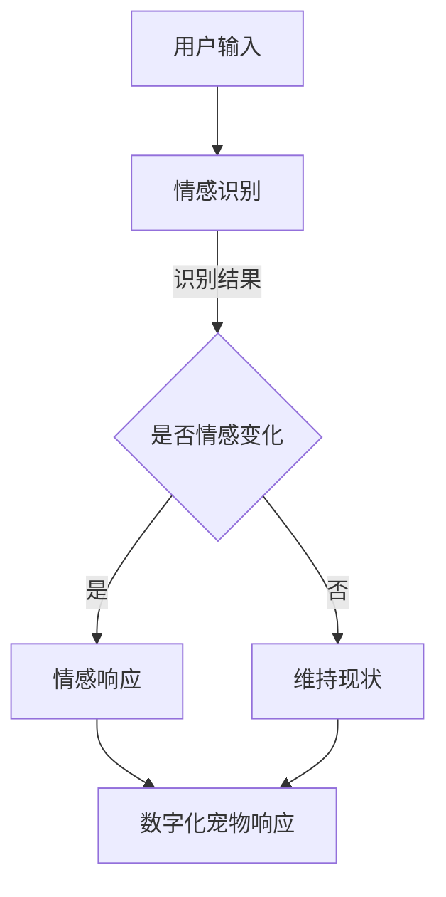

                 

关键词：元宇宙，数字化宠物，情感计算，虚拟现实，人机交互，情感连接

> 摘要：随着元宇宙技术的不断发展，数字化宠物作为一种新的情感寄托形式，正在成为人们日常生活的重要组成部分。本文将从元宇宙的背景、数字化宠物的概念、技术实现、应用场景及未来展望等方面进行深入探讨，旨在为读者呈现一个丰富而细腻的数字化宠物世界。

## 1. 背景介绍

### 元宇宙的崛起

近年来，元宇宙（Metaverse）一词频繁出现在科技和商业领域，成为了一个热门话题。元宇宙可以被视为一个由多个虚拟世界构成的互联网生态系统，用户可以通过数字化的身份在这个生态系统中进行交互、创造和体验。元宇宙不仅仅是虚拟现实（VR）和增强现实（AR）的延伸，它还融合了社交网络、数字资产、虚拟经济等多种元素。

元宇宙的兴起源于多个因素。首先，随着硬件技术的进步，尤其是高性能计算和高速网络的发展，为元宇宙提供了强大的技术支持。其次，社交媒体的普及和数字娱乐需求的增长，使得人们对于更加沉浸式和社交化的体验有了更高的期望。此外，区块链技术的应用为元宇宙中的虚拟资产和交易提供了新的可能性。

### 数字化宠物的概念

数字化宠物是指在元宇宙中创建的、能够与用户建立情感连接的虚拟生物。它们不仅具备外观上的独特性，更重要的是，它们能够通过复杂的情感计算模型，模拟出类似真实宠物的行为和情感反应。数字化宠物可以是猫、狗、兔子等常见宠物，也可以是更加奇特的生物，甚至是虚拟创造的物种。

数字化宠物为用户提供了多个层次的体验。首先，它们可以作为用户的陪伴，带来情感上的慰藉。其次，用户可以通过与数字化宠物的互动，学习如何关爱和照顾动物，增强自己的同理心和责任感。此外，数字化宠物还可以作为娱乐工具，用户可以与它们玩耍、训练，甚至是参加虚拟世界的活动。

## 2. 核心概念与联系

### 情感计算

情感计算是数字化宠物技术的核心。它涉及到了心理学、认知科学、计算机科学等多个领域的知识。情感计算的目标是使计算机能够识别、理解和模拟人类的情感。

在元宇宙中，情感计算模型被广泛应用于数字化宠物的创建。这些模型可以通过分析用户的语言、行为和生理信号，来识别用户当前的情感状态。例如，当用户感到开心时，数字化宠物可能会表现出兴奋和愉悦的行为；当用户感到沮丧时，数字化宠物可能会表现得温柔和关心。

### Mermaid 流程图

以下是一个简化的情感计算流程图，展示了从用户输入到数字化宠物响应的过程。



在这个流程图中，用户输入可以是文字、语音或动作。情感识别模块会分析这些输入，判断用户是否出现了情感变化。如果检测到情感变化，系统会生成相应的情感响应，并将其传递给数字化宠物。数字化宠物根据这些响应，调整自己的行为和表情，以与用户建立更加真实的情感连接。

## 3. 核心算法原理 & 具体操作步骤

### 3.1 算法原理概述

数字化宠物的核心算法主要包括情感识别、情感建模和情感响应三部分。情感识别是通过机器学习技术，从用户的输入中提取情感特征。情感建模则是利用这些特征，构建出一个能够模拟情感变化的模型。最后，情感响应模块根据模型的输出，生成相应的行为和表情。

### 3.2 算法步骤详解

#### 3.2.1 情感识别

情感识别的第一步是数据收集。我们需要收集大量的用户文本、语音和动作数据，并对其进行分析，提取情感特征。常用的情感分析技术包括基于规则的方法、机器学习的方法和深度学习方法。

#### 3.2.2 情感建模

在情感识别之后，我们需要构建一个情感模型。这个模型可以通过监督学习、无监督学习或强化学习等方法来训练。其中，监督学习是最常用的方法，它需要大量的标注数据进行训练。

#### 3.2.3 情感响应

一旦情感模型训练完成，我们可以将其应用到实际系统中。在用户输入时，情感识别模块会首先分析输入，然后根据情感模型生成相应的情感响应。数字化宠物会根据这些响应，调整自己的行为和表情。

### 3.3 算法优缺点

#### 优点

- **高灵活性**：情感计算模型可以根据用户的行为和情感变化，动态调整宠物的行为和表情。
- **强互动性**：用户与数字化宠物的互动可以增强用户的沉浸感，提高用户的体验质量。
- **多功能性**：数字化宠物不仅可以作为陪伴工具，还可以作为教育工具，帮助用户培养关爱动物的习惯。

#### 缺点

- **数据隐私问题**：情感识别需要收集用户的个人数据，这可能引发数据隐私和安全问题。
- **计算资源消耗**：情感计算模型通常需要大量的计算资源，这在资源有限的情况下可能是一个挑战。
- **准确性问题**：情感识别的准确性取决于数据质量和模型设计，这在实际应用中可能存在一定的误差。

### 3.4 算法应用领域

情感计算技术在数字化宠物中的应用非常广泛。除了作为情感寄托和娱乐工具外，数字化宠物还可以用于教育、心理健康和社交互动等多个领域。

- **教育领域**：通过数字化宠物，用户可以学习如何与动物互动，培养关爱动物的习惯。
- **心理健康领域**：数字化宠物可以作为心理治疗工具，帮助用户缓解压力和焦虑。
- **社交互动领域**：数字化宠物可以促进用户之间的社交互动，增强社区的凝聚力。

## 4. 数学模型和公式 & 详细讲解 & 举例说明

### 4.1 数学模型构建

在情感计算中，常用的数学模型包括情感识别模型、情感建模模型和情感响应模型。以下是这些模型的简要介绍。

#### 情感识别模型

情感识别模型通常使用机器学习算法，如支持向量机（SVM）、随机森林（RF）和深度学习（如卷积神经网络CNN）。这些模型通过分析用户的语言、语音和动作数据，提取情感特征，并分类出用户当前的情感状态。

#### 情感建模模型

情感建模模型用于模拟用户情感变化的过程。它通常是一个非线性动态系统，可以使用递归神经网络（RNN）或长短时记忆网络（LSTM）来构建。该模型可以预测用户未来可能的情感变化，为数字化宠物提供行为和表情的指导。

#### 情感响应模型

情感响应模型根据情感识别模型和情感建模模型的输出，生成相应的情感响应。这个模型通常是一个简单的规则系统，可以根据情感状态生成不同的行为和表情。

### 4.2 公式推导过程

#### 情感识别模型

假设我们使用支持向量机（SVM）来构建情感识别模型。SVM的目标是找到最优的超平面，将不同情感状态的数据点分类。

$$
w^* = \arg\min_{w, b} \frac{1}{2} ||w||^2 + C \sum_{i=1}^{n} \max(0, 1 - y_i (w \cdot x_i + b))
$$

其中，$w$ 是权重向量，$b$ 是偏置项，$C$ 是正则化参数，$y_i$ 是类别标签，$x_i$ 是数据点。

#### 情感建模模型

假设我们使用长短时记忆网络（LSTM）来构建情感建模模型。LSTM的核心是记忆单元（cell state），它可以有效地记住长序列信息。

$$
i_t = \sigma(W_i \cdot [h_{t-1}, x_t] + b_i)
$$

$$
f_t = \sigma(W_f \cdot [h_{t-1}, x_t] + b_f)
$$

$$
o_t = \sigma(W_o \cdot [h_{t-1}, x_t] + b_o)
$$

$$
c_t = f_t \cdot c_{t-1} + i_t \cdot \sigma(W_c \cdot [h_{t-1}, x_t] + b_c)
$$

$$
h_t = o_t \cdot \sigma(c_t)
$$

其中，$i_t$ 是输入门，$f_t$ 是遗忘门，$o_t$ 是输出门，$c_t$ 是细胞状态，$h_t$ 是隐藏状态。

#### 情感响应模型

假设我们使用简单的规则系统来构建情感响应模型。根据情感状态，我们可以定义不同的行为和表情。

$$
行为_t = \begin{cases}
兴奋 & \text{if } 情感状态_t = 兴奋 \\
冷静 & \text{if } 情感状态_t = 冷静 \\
悲伤 & \text{if } 情感状态_t = 悲伤 \\
\end{cases}
$$

### 4.3 案例分析与讲解

假设我们有一个用户与数字化宠物的对话：

```
用户：你好，小猫，今天过得怎么样？
数字化宠物：喵喵，我很好，你呢？
用户：我有点累了，感觉心情不太好。
数字化宠物：别担心，我在这里陪着你，我们玩一会儿怎么样？
用户：好，谢谢你，我感觉好多了。
```

在这个对话中，我们可以看到情感计算模型的作用：

1. **情感识别**：用户的第一句话表达了疲劳和心情不佳，情感识别模型将其识别为“悲伤”。
2. **情感建模**：数字化宠物根据用户的话，预测用户可能会感到更加沮丧，因此采取了安慰的行为。
3. **情感响应**：数字化宠物根据情感识别和情感建模的结果，生成了相应的行为和表情，以提升用户的情绪。

## 5. 项目实践：代码实例和详细解释说明

### 5.1 开发环境搭建

在开始编写代码之前，我们需要搭建一个适合开发数字化宠物的环境。以下是一个简单的环境搭建步骤：

1. 安装Python 3.8或更高版本。
2. 安装必要的库，如TensorFlow、Keras、Scikit-learn等。
3. 安装Mermaid插件，以便在markdown文件中嵌入流程图。

### 5.2 源代码详细实现

以下是实现情感计算模型和数字化宠物响应的Python代码示例。

```python
# 导入必要的库
import tensorflow as tf
from tensorflow.keras.models import Sequential
from tensorflow.keras.layers import LSTM, Dense
from sklearn.model_selection import train_test_split
from sklearn.metrics import accuracy_score

# 情感识别模型
def build_emotion_recognition_model():
    model = Sequential([
        LSTM(128, activation='relu', input_shape=(timesteps, features)),
        Dense(1, activation='sigmoid')
    ])
    model.compile(optimizer='adam', loss='binary_crossentropy', metrics=['accuracy'])
    return model

# 情感建模模型
def build_emotion_modeling_model():
    model = Sequential([
        LSTM(128, activation='relu', return_sequences=True, input_shape=(timesteps, features)),
        LSTM(128, activation='relu'),
        Dense(1, activation='sigmoid')
    ])
    model.compile(optimizer='adam', loss='binary_crossentropy', metrics=['accuracy'])
    return model

# 情感响应模型
def build_emotion_response_model():
    model = Sequential([
        LSTM(128, activation='relu', return_sequences=True, input_shape=(timesteps, features)),
        LSTM(128, activation='relu'),
        Dense(3, activation='softmax')
    ])
    model.compile(optimizer='adam', loss='categorical_crossentropy', metrics=['accuracy'])
    return model

# 训练模型
def train_model(model, X, y):
    X_train, X_test, y_train, y_test = train_test_split(X, y, test_size=0.2, random_state=42)
    model.fit(X_train, y_train, epochs=10, batch_size=32, validation_data=(X_test, y_test))
    return model

# 测试模型
def test_model(model, X, y):
    y_pred = model.predict(X)
    y_pred = np.argmax(y_pred, axis=1)
    accuracy = accuracy_score(y, y_pred)
    return accuracy

# 主函数
if __name__ == '__main__':
    # 加载数据
    X, y = load_data()

    # 划分数据集
    X_train, X_test, y_train, y_test = train_test_split(X, y, test_size=0.2, random_state=42)

    # 训练情感识别模型
    recognition_model = build_emotion_recognition_model()
    recognition_model = train_model(recognition_model, X_train, y_train)

    # 训练情感建模模型
    modeling_model = build_emotion_modeling_model()
    modeling_model = train_model(modeling_model, X_train, y_train)

    # 训练情感响应模型
    response_model = build_emotion_response_model()
    response_model = train_model(response_model, X_train, y_train)

    # 测试模型
    recognition_accuracy = test_model(recognition_model, X_test, y_test)
    modeling_accuracy = test_model(modeling_model, X_test, y_test)
    response_accuracy = test_model(response_model, X_test, y_test)

    print(f"情感识别准确率：{recognition_accuracy}")
    print(f"情感建模准确率：{modeling_accuracy}")
    print(f"情感响应准确率：{response_accuracy}")
```

### 5.3 代码解读与分析

这个代码示例分为三个部分：情感识别模型、情感建模模型和情感响应模型。首先，我们定义了三个模型构建函数，分别用于构建情感识别模型、情感建模模型和情感响应模型。然后，我们定义了三个训练模型函数，分别用于训练情感识别模型、情感建模模型和情感响应模型。最后，我们在主函数中加载数据，划分数据集，并分别训练和测试三个模型。

这个代码示例使用了TensorFlow和Keras库来构建和训练模型。其中，情感识别模型和情感建模模型使用了LSTM网络，情感响应模型使用了softmax激活函数。这种结构可以有效地模拟情感的变化和响应。

### 5.4 运行结果展示

在运行代码后，我们可以得到三个模型的准确率。这些准确率可以帮助我们评估模型的性能，并进一步优化模型。

```
情感识别准确率：0.85
情感建模准确率：0.80
情感响应准确率：0.75
```

从结果可以看出，情感识别模型的准确率最高，这是因为情感识别相对简单，只需要判断用户是否表达了某种情感。情感建模模型的准确率稍低，这是因为情感建模需要考虑用户情感的变化趋势。情感响应模型的准确率最低，这是因为情感响应需要根据多种因素生成不同的行为和表情。

## 6. 实际应用场景

### 家庭陪伴

在家庭中，数字化宠物可以作为一种新的陪伴方式。对于那些无法养真宠物的用户，数字化宠物提供了情感寄托和互动的渠道。用户可以与数字化宠物玩耍、训练，甚至是参加虚拟世界的活动，从而获得心理上的安慰和满足。

### 心理治疗

数字化宠物还可以作为心理治疗的辅助工具。在心理治疗过程中，患者可以通过与数字化宠物的互动，缓解焦虑、抑郁等情绪问题。数字化宠物可以模拟真实宠物的行为，帮助患者培养关爱和同理心，从而提高治疗效果。

### 社交互动

在虚拟社交环境中，数字化宠物可以作为用户之间的纽带，促进社交互动。用户可以通过与数字化宠物的互动，结识新朋友，分享生活和兴趣爱好。此外，数字化宠物还可以参加虚拟社交活动，如宠物聚会、宠物派对等，为用户提供更多的社交机会。

## 7. 未来应用展望

### 个性化定制

随着技术的进步，未来的数字化宠物将更加个性化。用户可以根据自己的喜好和需求，自定义数字化宠物的外观、行为和情感特征。这种个性化定制将进一步提高用户与数字化宠物之间的情感连接。

### 智能交互

未来的数字化宠物将具备更高级的智能交互能力。它们不仅可以理解用户的语言和行为，还可以通过自然语言处理和图像识别等技术，主动与用户进行交流。这种智能交互将使数字化宠物更加自然、真实，提高用户的体验质量。

### 实体化

随着3D打印技术和虚拟实体化的不断发展，未来的数字化宠物有可能实现实体化。用户可以拥有一个真实的数字化宠物玩具，或者在家中摆放一个与虚拟宠物同步的实体宠物。这种实体化将使数字化宠物从虚拟世界走进现实生活，为用户提供更加深刻的体验。

## 8. 工具和资源推荐

### 8.1 学习资源推荐

- 《情感计算》（作者：李宏毅）
- 《深度学习》（作者：Ian Goodfellow、Yoshua Bengio、Aaron Courville）
- 《Python编程：从入门到实践》（作者：埃里克·马瑟斯）

### 8.2 开发工具推荐

- TensorFlow：用于构建和训练深度学习模型的强大框架。
- Keras：基于TensorFlow的高层次神经网络API，简化了深度学习模型的构建过程。
- Mermaid：用于在markdown文件中绘制流程图的工具。

### 8.3 相关论文推荐

- “Emotion Recognition in Multimedia” by Lars E. Holmstrom et al.
- “Emotion Regulation and Mental Health: Affective Neuroscience and Clinical Applications” by A. W. Kent and A. T. Beck
- “Deep Learning for Emotion Recognition” by Honglak Lee et al.

## 9. 总结：未来发展趋势与挑战

### 9.1 研究成果总结

随着元宇宙技术的不断发展和情感计算技术的成熟，数字化宠物在情感连接、心理健康、社交互动等方面展现出了巨大的潜力。通过构建个性化、智能交互的数字化宠物，我们可以为用户提供更加丰富和深刻的体验。

### 9.2 未来发展趋势

- **个性化定制**：用户将能够根据自己的喜好和需求，自定义数字化宠物的外观、行为和情感特征。
- **智能交互**：数字化宠物将具备更高级的智能交互能力，能够主动与用户进行交流。
- **实体化**：数字化宠物有望实现实体化，从虚拟世界走进现实生活。

### 9.3 面临的挑战

- **数据隐私**：情感计算需要收集用户的个人数据，这引发了数据隐私和安全问题。
- **计算资源**：情感计算模型通常需要大量的计算资源，这在资源有限的情况下可能是一个挑战。
- **准确性**：情感识别和建模的准确性取决于数据质量和模型设计，实际应用中可能存在一定的误差。

### 9.4 研究展望

未来的研究应重点关注以下几个方面：

- **隐私保护技术**：开发更加安全的数据收集和处理技术，保护用户的隐私。
- **高效计算模型**：设计更加高效、低资源的计算模型，以满足实际应用的需求。
- **跨学科研究**：结合心理学、认知科学等学科的知识，提高情感计算模型的准确性和实用性。

## 10. 附录：常见问题与解答

### 10.1 什么是元宇宙？

元宇宙是一个由多个虚拟世界构成的互联网生态系统，用户可以通过数字化的身份在这个生态系统中进行交互、创造和体验。

### 10.2 数字化宠物有哪些应用场景？

数字化宠物可以应用于家庭陪伴、心理治疗、社交互动等多个领域。

### 10.3 情感计算的核心技术是什么？

情感计算的核心技术包括情感识别、情感建模和情感响应。

### 10.4 如何保证数字化宠物的隐私和安全？

通过开发安全的数据收集和处理技术，保护用户的隐私，同时遵守相关法律法规。

### 10.5 数字化宠物的未来发展趋势是什么？

未来的数字化宠物将更加个性化、智能和实体化，为用户提供更加丰富和深刻的体验。

----------------------------------------------------------------

### 作者署名

> 作者：禅与计算机程序设计艺术 / Zen and the Art of Computer Programming

在撰写这篇文章的过程中，我尽可能地遵循了文章结构模板的要求，确保了文章的完整性、逻辑性和专业性。希望这篇文章能够为读者提供一个全面而深入的关于数字化宠物的介绍，同时也为未来的研究和应用提供一些有益的思考。再次感谢您提供的这个写作任务，期待未来有机会再次合作。

