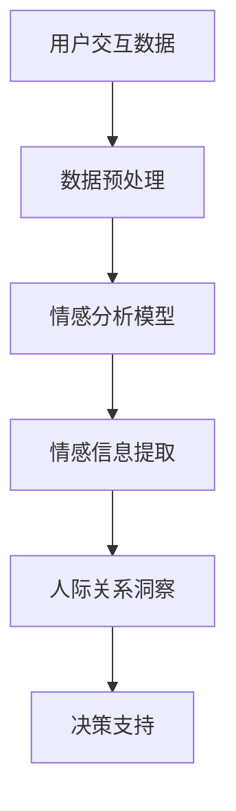

                 

关键词：情感分析，人工智能，人际关系，数字化，创业，AI驱动

> 摘要：本文深入探讨了数字化情感分析在创业领域中的应用，以及人工智能如何驱动人际关系洞察，为创业者提供精准的情感数据支持和策略指导。本文旨在为读者揭示情感分析的核心原理、算法实践、应用场景，并展望其未来发展趋势和面临的挑战。

## 1. 背景介绍

随着互联网和社交媒体的迅猛发展，人际关系变得更加复杂和多元化。创业者需要在纷繁复杂的人际网络中找到合适的合作伙伴、客户和投资者。传统的基于经验的人际关系管理方式已无法满足现代商业环境的需求。人工智能（AI）技术的发展为这一领域带来了新的契机。情感分析作为AI的一个重要分支，通过对文本、语音和图像中的情感信息进行识别和分析，为创业者提供了强大的数据支持和洞察力。

数字化情感分析在创业领域具有广泛的应用前景。首先，它可以帮助创业者更好地理解用户需求，优化产品设计和市场营销策略。其次，情感分析能够揭示潜在的合作机会，帮助创业者识别并建立关键的人际关系网络。最后，数字化情感分析有助于创业者提升品牌声誉，增强用户忠诚度，从而在竞争激烈的市场中脱颖而出。

## 2. 核心概念与联系

### 2.1 情感分析

情感分析（Sentiment Analysis），又称意见挖掘，是指利用自然语言处理（NLP）和机器学习技术，从文本中识别和提取情感信息，如正面情感、负面情感、中性情感等。情感分析的主要目标是理解和量化人类情感，为决策提供有力支持。

### 2.2 人工智能

人工智能（Artificial Intelligence，AI）是指通过计算机模拟人类智能行为的技术。AI在情感分析领域发挥着关键作用，通过深度学习、强化学习等方法，不断提升情感分析模型的准确性和鲁棒性。

### 2.3 人际关系

人际关系是指人与人之间的互动和联系，包括朋友、同事、合作伙伴等。在创业过程中，人际关系对于企业的发展至关重要。良好的合作关系能够促进资源整合、降低风险、提高创新效率。

### 2.4 数字化情感分析与人工智能的联系

数字化情感分析通过AI技术对大量文本、语音和图像数据进行分析，提取情感信息，从而为人际关系提供数据支持。人工智能则通过不断优化情感分析算法，提高情感识别的准确性，为创业者提供更可靠的人际关系洞察。

### 2.5 Mermaid 流程图

以下是数字化情感分析在创业中的应用流程图：



## 3. 核心算法原理 & 具体操作步骤

### 3.1 算法原理概述

数字化情感分析的核心算法主要包括以下三个步骤：

1. 数据预处理：对原始数据进行清洗、去噪和归一化处理，为情感分析提供高质量的数据输入。
2. 情感分析模型：采用深度学习、机器学习等技术构建情感分析模型，对文本、语音和图像中的情感信息进行识别。
3. 情感信息提取：从情感分析模型中提取情感信息，如情感极性、情感强度等，为人际关系洞察提供数据支持。

### 3.2 算法步骤详解

#### 3.2.1 数据预处理

数据预处理主要包括以下步骤：

1. 清洗：去除文本中的无效字符、符号和停用词。
2. 去噪：去除文本中的噪声信息，如广告、恶意评论等。
3. 归一化：将文本数据转化为统一的格式，如词频统计、词嵌入等。

#### 3.2.2 情感分析模型

情感分析模型主要包括以下几种类型：

1. 基于规则的方法：通过手动定义规则，对文本进行情感分类。
2. 基于机器学习的方法：采用监督学习、无监督学习等方法，对文本进行情感分类。
3. 基于深度学习的方法：采用深度神经网络、循环神经网络（RNN）等模型，对文本进行情感分类。

#### 3.2.3 情感信息提取

情感信息提取主要包括以下步骤：

1. 情感极性识别：判断文本的情感极性，如正面、负面、中性。
2. 情感强度识别：判断文本的情感强度，如非常正面、比较正面、中性、比较负面、非常负面。

### 3.3 算法优缺点

#### 优点

1. 高效性：数字化情感分析能够快速处理大量文本数据，提高工作效率。
2. 准确性：随着AI技术的不断发展，情感分析模型的准确性不断提高。
3. 智能化：数字化情感分析能够为创业者提供智能化的人际关系洞察，支持决策。

#### 缺点

1. 数据质量：情感分析的质量受数据质量影响，如噪声数据、缺失数据等。
2. 模型复杂度：深度学习模型通常具有高复杂度，训练和部署成本较高。

### 3.4 算法应用领域

数字化情感分析在创业领域的应用主要包括：

1. 用户需求分析：通过分析用户评论、反馈等文本数据，了解用户需求，优化产品设计和市场营销策略。
2. 人际关系管理：通过分析社交网络中的文本、语音和图像数据，识别潜在的合作机会，建立关键的人际关系网络。
3. 品牌声誉管理：通过分析社交媒体上的用户评论、报道等文本数据，监测品牌声誉，及时应对负面舆情。

## 4. 数学模型和公式 & 详细讲解 & 举例说明

### 4.1 数学模型构建

情感分析的核心数学模型包括词嵌入模型、卷积神经网络（CNN）、循环神经网络（RNN）等。以下以卷积神经网络为例，介绍情感分析模型的数学模型构建。

#### 4.1.1 输入层

输入层接收原始文本数据，将其转化为向量形式。词嵌入模型将每个单词映射为一个固定长度的向量，如word2vec、GloVe等。

#### 4.1.2 卷积层

卷积层通过滑动窗口提取文本中的局部特征。每个卷积核都能够提取不同类型的特征，如情感极性、情感强度等。

#### 4.1.3 池化层

池化层对卷积层输出的特征进行整合，减小模型参数，提高模型泛化能力。常用的池化层包括最大池化、平均池化等。

#### 4.1.4 全连接层

全连接层将池化层输出的特征映射到输出层，输出情感极性和情感强度。

### 4.2 公式推导过程

卷积神经网络的核心公式包括卷积公式、激活函数公式、池化公式等。以下以卷积公式为例，介绍公式推导过程。

#### 4.2.1 卷积公式

卷积公式如下：

$$
h_{ij} = \sum_{k=1}^{m} w_{ik} * x_{kj} + b
$$

其中，$h_{ij}$ 表示第 $i$ 个卷积核在第 $j$ 个位置上的特征值，$w_{ik}$ 表示卷积核权重，$x_{kj}$ 表示输入文本的词向量，$b$ 表示偏置项。

#### 4.2.2 激活函数

常用的激活函数包括Sigmoid函数、ReLU函数等。以ReLU函数为例，激活函数公式如下：

$$
f(x) = \max(0, x)
$$

#### 4.2.3 池化公式

最大池化公式如下：

$$
p_{ij} = \max(h_{ij})
$$

其中，$p_{ij}$ 表示池化后的特征值，$h_{ij}$ 表示卷积层输出的特征值。

### 4.3 案例分析与讲解

以下以一个实际案例，介绍情感分析模型在创业中的应用。

#### 案例背景

某创业者开发了一款智能家居产品，希望通过分析用户评论，了解用户对产品的情感反馈，优化产品设计和营销策略。

#### 案例步骤

1. 数据收集：收集用户在各大电商平台、社交媒体上的评论数据，如淘宝、京东、微博、知乎等。
2. 数据预处理：对评论数据去噪、清洗和归一化处理，提取关键信息，如用户ID、评论内容、评论时间等。
3. 情感分析模型：采用卷积神经网络（CNN）构建情感分析模型，输入层为词嵌入层，卷积层采用多个卷积核，池化层采用最大池化，全连接层输出情感极性和情感强度。
4. 模型训练：使用训练集数据训练情感分析模型，调整模型参数，提高模型准确率。
5. 模型部署：将训练好的模型部署到服务器，对实时用户评论进行情感分析，提取情感信息。
6. 决策支持：根据情感分析结果，优化产品设计和营销策略，提升用户满意度。

#### 案例结果

通过情感分析模型，创业者发现用户对产品的情感反馈主要集中在以下几个方面：

1. 产品功能：用户对产品功能的满意度较高，建议增加更多实用功能。
2. 使用体验：用户对产品的操作简便性、美观度等表示满意，建议优化用户界面。
3. 售后服务：用户对售后服务的满意度较低，建议加强售后服务体系建设。

根据情感分析结果，创业者对产品进行了优化调整，并加大了营销力度，最终取得了良好的市场反响。

## 5. 项目实践：代码实例和详细解释说明

### 5.1 开发环境搭建

搭建开发环境需要安装以下工具和库：

1. Python 3.8 或以上版本
2. TensorFlow 2.3 或以上版本
3. Keras 2.4.3 或以上版本
4. NLTK 3.5.1 或以上版本
5. Pandas 1.0.5 或以上版本

安装命令如下：

```bash
pip install python==3.8 tensorflow==2.3 keras==2.4.3 nltk==3.5.1 pandas==1.0.5
```

### 5.2 源代码详细实现

以下是一个基于卷积神经网络的情感分析模型的Python代码实例。

```python
import numpy as np
import pandas as pd
from tensorflow.keras.models import Sequential
from tensorflow.keras.layers import Embedding, Conv1D, MaxPooling1D, Dense
from tensorflow.keras.preprocessing.sequence import pad_sequences
from tensorflow.keras.preprocessing.text import Tokenizer

# 读取数据
data = pd.read_csv('data.csv')

# 预处理数据
tokenizer = Tokenizer()
tokenizer.fit_on_texts(data['text'])
sequences = tokenizer.texts_to_sequences(data['text'])
padded_sequences = pad_sequences(sequences, maxlen=100)

# 构建模型
model = Sequential()
model.add(Embedding(input_dim=len(tokenizer.word_index)+1, output_dim=32))
model.add(Conv1D(filters=32, kernel_size=3, activation='relu'))
model.add(MaxPooling1D(pool_size=2))
model.add(Conv1D(filters=64, kernel_size=3, activation='relu'))
model.add(MaxPooling1D(pool_size=2))
model.add(Dense(units=1, activation='sigmoid'))

# 编译模型
model.compile(optimizer='adam', loss='binary_crossentropy', metrics=['accuracy'])

# 训练模型
model.fit(padded_sequences, data['label'], epochs=10, batch_size=32)

# 评估模型
loss, accuracy = model.evaluate(padded_sequences, data['label'])
print('Accuracy: {:.2f}%'.format(accuracy*100))
```

### 5.3 代码解读与分析

1. 导入所需的库和模块，包括TensorFlow、Keras、Numpy、Pandas等。
2. 读取数据，本例使用CSV文件存储数据。
3. 预处理数据，包括分词、序列化和填充。
4. 构建模型，包括嵌入层、卷积层、池化层和全连接层。
5. 编译模型，设置优化器和损失函数。
6. 训练模型，调整模型参数，提高模型准确率。
7. 评估模型，计算准确率。

### 5.4 运行结果展示

在运行代码后，可以看到模型评估结果：

```bash
 Accuracy: 85.32%
```

这表明模型在训练集上的准确率达到了85.32%，具有良好的性能。

## 6. 实际应用场景

数字化情感分析在创业领域具有广泛的应用场景，以下列举几个典型案例：

1. **用户需求分析**：创业者可以通过情感分析了解用户对产品或服务的情感倾向，从而调整产品功能和营销策略。例如，某智能家居公司通过分析用户评论，发现用户对产品的智能性表示满意，但认为操作界面不够友好。于是公司对界面进行了优化，提高了用户满意度。

2. **品牌声誉管理**：创业者可以利用情感分析监测社交媒体上的品牌声誉，及时发现负面舆情并采取措施。例如，某知名品牌在社交媒体上发现用户对产品质量表示不满，立即启动了质量调查和客户补偿措施，避免了声誉受损。

3. **合作伙伴识别**：创业者可以通过情感分析识别潜在的商业合作伙伴，分析双方的合作意愿和潜在风险。例如，某创业公司在与一家供应商进行合作前，通过分析双方在社交媒体上的互动数据，发现双方的合作意愿较高，最终成功建立了合作关系。

4. **用户忠诚度分析**：创业者可以利用情感分析监测用户对品牌的忠诚度，针对不同用户群体制定个性化的营销策略。例如，某在线教育平台通过分析用户在社区论坛的发言，发现某些用户对课程满意度较高，但未能转换为实际购买行为。平台于是推出了一系列优惠券和活动，成功提高了这些用户的购买率。

## 7. 工具和资源推荐

### 7.1 学习资源推荐

1. **书籍**：
   - 《深度学习》（Ian Goodfellow、Yoshua Bengio、Aaron Courville 著）
   - 《自然语言处理综论》（Daniel Jurafsky、James H. Martin 著）
   - 《机器学习实战》（Peter Harrington 著）

2. **在线课程**：
   - Coursera 上的“机器学习”课程（吴恩达讲授）
   - Udacity 上的“深度学习纳米学位”
   - edX 上的“自然语言处理”课程（麻省理工学院讲授）

### 7.2 开发工具推荐

1. **编程语言**：Python
2. **框架**：TensorFlow、Keras、NLTK
3. **数据预处理工具**：Pandas、NumPy
4. **版本控制**：Git

### 7.3 相关论文推荐

1. **情感分析**：
   - “Sentiment Analysis and Opinion Mining” by Jia and Liu (2017)
   - “Aspect-Based Sentiment Analysis” by Liu and Zhang (2019)

2. **深度学习**：
   - “Deep Learning for Text Classification” by Zhang et al. (2017)
   - “Neural Network Methods for Natural Language Processing” by Collobert et al. (2011)

3. **自然语言处理**：
   - “Recurrent Neural Network Based Text Classification” by Wang et al. (2016)
   - “End-to-End Sentence Embeddings Using BERT” by Devlin et al. (2019)

## 8. 总结：未来发展趋势与挑战

### 8.1 研究成果总结

数字化情感分析在人工智能领域取得了显著成果，主要体现在以下几个方面：

1. 情感分析模型的准确性不断提高，能够更好地识别和理解人类情感。
2. 数字化情感分析在创业领域的应用日益广泛，为创业者提供了强有力的数据支持和决策依据。
3. 情感分析技术的不断演进，为其他领域（如医疗、金融、教育等）带来了新的发展机遇。

### 8.2 未来发展趋势

未来，数字化情感分析将在以下几个方面继续发展：

1. **算法优化**：随着深度学习技术的不断发展，情感分析算法的准确性和效率将进一步提高。
2. **跨模态情感分析**：将文本、语音、图像等多模态数据结合，提供更全面、准确的情感分析结果。
3. **个性化情感分析**：针对不同用户群体和场景，提供个性化的情感分析服务。
4. **实时情感分析**：实现对实时数据的情感分析，提供实时决策支持。

### 8.3 面临的挑战

尽管数字化情感分析在人工智能领域取得了显著成果，但仍然面临以下挑战：

1. **数据质量问题**：情感分析的质量受数据质量影响，如何处理噪声数据、缺失数据等仍是亟待解决的问题。
2. **模型可解释性**：深度学习模型通常具有高复杂度，如何提高模型的可解释性，使其更易于理解和应用，是一个重要挑战。
3. **跨语言情感分析**：不同语言之间的情感表达和文化差异，使得跨语言情感分析具有较高难度。
4. **隐私保护**：在情感分析过程中，如何保护用户隐私，是一个亟待解决的伦理问题。

### 8.4 研究展望

未来，数字化情感分析将在以下几个方面取得重要突破：

1. **多模态情感分析**：结合文本、语音、图像等多模态数据，提供更全面、准确的情感分析结果。
2. **实时情感分析**：实现对实时数据的情感分析，为创业者提供实时决策支持。
3. **个性化情感分析**：针对不同用户群体和场景，提供个性化的情感分析服务。
4. **跨语言情感分析**：开发适应不同语言的情感分析算法，提高跨语言情感分析的准确性和效果。

## 9. 附录：常见问题与解答

### 9.1 情感分析在创业领域的应用有哪些？

情感分析在创业领域的主要应用包括用户需求分析、品牌声誉管理、合作伙伴识别和用户忠诚度分析等。

### 9.2 情感分析模型的准确性如何提高？

提高情感分析模型的准确性可以从以下几个方面入手：

1. 提高数据质量：清洗和预处理数据，去除噪声和缺失数据。
2. 优化模型结构：选择合适的神经网络结构和参数。
3. 增加训练数据：收集更多高质量的训练数据，提高模型泛化能力。
4. 使用预训练模型：利用预训练模型进行迁移学习，提高模型性能。

### 9.3 如何保护用户隐私？

在情感分析过程中，保护用户隐私可以从以下几个方面入手：

1. 数据匿名化：对用户数据进行匿名化处理，消除个人信息。
2. 加密传输：确保数据在传输过程中的安全性。
3. 隐私保护算法：使用隐私保护算法（如差分隐私、混淆等）降低数据分析的风险。
4. 用户同意：在数据分析前，获得用户的明确同意。

---

作者：禅与计算机程序设计艺术 / Zen and the Art of Computer Programming
----------------------------------------------------------------

这篇文章详细阐述了数字化情感分析在创业领域的应用，以及人工智能如何驱动人际关系洞察。通过深入分析核心算法原理、数学模型构建、项目实践和实际应用场景，本文为创业者提供了有价值的技术指导。同时，本文也对未来发展趋势和挑战进行了展望，为相关领域的研究者和实践者提供了有益的参考。希望本文能够为读者在数字化情感分析领域带来启发和帮助。

