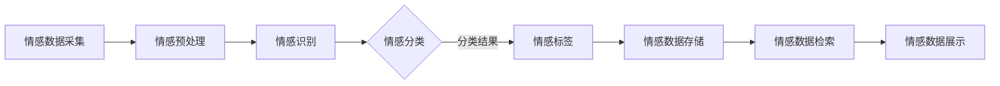

                 

关键词：数字化情感，情感存储，回忆保存，人工智能，创业，永久保存，技术应用，情感分析，记忆管理，心理学，数据隐私，用户体验

> 摘要：本文深入探讨了数字化情感存储技术的创业机遇与挑战。通过解析情感数据的价值、存储与管理的核心概念，以及实施过程中的技术细节，本文为创业者提供了宝贵的指导。文章还分析了情感存储技术的实际应用场景，展望了未来的发展趋势与面临的挑战。

## 1. 背景介绍

在数字化时代，数据已成为新石油。然而，数据中蕴含的不仅仅是信息，更多的是情感。人们的情感体验，无论是快乐、悲伤、激动，还是在特定时刻的情感波动，都是独一无二的，是不可复制的人类记忆的重要组成部分。这些情感数据不仅能够反映个人的心理状态，还能揭示社会的情感趋势。

随着人工智能技术的进步，尤其是情感分析技术的发展，我们开始能够通过计算机技术理解和存储这些情感。数字化情感存储创业项目应运而生，它们致力于将个人的情感记忆转换为数字形式，实现珍贵回忆的永久保存。

### 1.1 情感数据的价值

情感数据的价值体现在多个方面。首先，它可以帮助个人回顾和反思自己的生活经历，从而实现情感疗愈。其次，情感数据在心理咨询、市场研究、社交网络分析等领域具有巨大的应用潜力。例如，通过分析社交媒体上的情感数据，企业可以更好地了解消费者的情感需求，从而制定更有效的营销策略。

### 1.2 情感存储的需求

随着技术的发展，人们越来越依赖数字设备来记录和保存生活中的重要时刻。然而，传统的数据存储方式主要关注信息的完整性，而忽视了情感的价值。情感存储创业项目应运而生，它们旨在填补这一市场空白，提供一种更加人性化的情感记录与存储服务。

## 2. 核心概念与联系

### 2.1 情感数据的核心概念

情感数据的核心概念包括情感识别、情感分类和情感标签。情感识别是指通过算法识别文本、语音或图像中的情感特征；情感分类是将情感识别的结果进行分类，如快乐、悲伤、愤怒等；情感标签则是对特定数据点进行情感打标签，以便后续分析和检索。

### 2.2 情感数据存储的架构

情感数据存储的架构需要考虑数据的采集、存储、检索和展示。以下是情感数据存储架构的Mermaid流程图：



### 2.3 情感数据管理的挑战

情感数据管理面临的主要挑战包括数据隐私保护、情感数据的质量和准确性，以及情感数据的长期存储。这些挑战需要在情感存储创业项目中得到有效解决。

## 3. 核心算法原理 & 具体操作步骤

### 3.1 算法原理概述

情感数据的处理通常涉及以下核心算法：

- **情感识别算法**：通过机器学习模型，如深度神经网络，识别文本、语音或图像中的情感特征。
- **情感分类算法**：将识别出的情感特征进行分类，常用的算法包括朴素贝叶斯、支持向量机等。
- **情感标签算法**：根据情感分类的结果，为数据点打上相应的情感标签。

### 3.2 算法步骤详解

#### 3.2.1 数据采集

数据采集是情感存储系统的第一步，它可以从社交媒体、博客、电子邮件、音频和视频等多种渠道收集情感数据。

#### 3.2.2 数据预处理

数据预处理包括数据清洗、去除噪声和标准化等步骤。这一步的目的是提高数据的质量和准确性。

#### 3.2.3 情感识别

使用机器学习模型对预处理后的数据进行情感识别。例如，可以使用基于卷积神经网络的模型对图像中的情感进行识别。

#### 3.2.4 情感分类

将情感识别的结果进行分类，确定数据的情感类别。可以使用支持向量机（SVM）等算法来实现。

#### 3.2.5 情感标签

根据情感分类的结果，为数据点打上相应的情感标签，如“快乐”、“悲伤”等。

### 3.3 算法优缺点

**优点**：

- **高效性**：机器学习算法可以快速处理大量情感数据。
- **准确性**：随着模型的不断优化，情感识别和分类的准确性也在不断提高。
- **灵活性**：算法可以根据不同的应用场景进行定制化调整。

**缺点**：

- **数据质量要求高**：情感数据的准确性和质量直接影响算法的效果。
- **计算资源需求大**：训练深度神经网络等复杂模型需要大量的计算资源。

### 3.4 算法应用领域

情感数据存储算法在多个领域具有广泛应用，包括：

- **心理健康**：通过情感数据分析，帮助个人了解和管理自己的情绪。
- **市场研究**：通过分析消费者的情感数据，为企业提供市场洞察。
- **社交媒体分析**：通过分析社交媒体上的情感数据，了解社会情绪动态。

## 4. 数学模型和公式 & 详细讲解 & 举例说明

### 4.1 数学模型构建

情感数据存储的数学模型通常包括情感识别模型、情感分类模型和情感标签模型。以下是构建这些模型的数学基础：

#### 4.1.1 情感识别模型

情感识别模型通常使用卷积神经网络（CNN）或循环神经网络（RNN）构建。以下是CNN的情感识别模型的数学公式：

$$
h_{l}^{(i)} = \sigma \left( W_{l}^{(i)} \cdot a_{l-1} + b_{l}^{(i)} \right)
$$

其中，$h_{l}^{(i)}$ 是第 $l$ 层的第 $i$ 个激活值，$\sigma$ 是激活函数，$W_{l}^{(i)}$ 和 $b_{l}^{(i)}$ 分别是第 $l$ 层的第 $i$ 个权重和偏置。

#### 4.1.2 情感分类模型

情感分类模型通常使用支持向量机（SVM）或逻辑回归构建。以下是SVM的情感分类模型的数学公式：

$$
\hat{y} = \text{sign} \left( \sum_{i=1}^{n} \alpha_i y_i K(x_i, x) - b \right)
$$

其中，$\hat{y}$ 是预测的情感类别，$\alpha_i$ 是第 $i$ 个支持向量的权重，$y_i$ 是第 $i$ 个支持向量的真实类别，$K(x_i, x)$ 是核函数，$b$ 是偏置。

#### 4.1.3 情感标签模型

情感标签模型通常使用决策树或随机森林构建。以下是决策树的情感标签模型的数学公式：

$$
l(x) = \arg\max_{c} \sum_{i=1}^{n} I(y_i = c) - \lambda \sum_{v \in V} |v|
$$

其中，$l(x)$ 是预测的情感标签，$c$ 是情感类别，$I(y_i = c)$ 是指示函数，$\lambda$ 是调节参数，$V$ 是节点 $v$ 的子节点集合。

### 4.2 公式推导过程

以下是情感识别模型的推导过程：

1. **输入层**：$x \in \mathbb{R}^{d_x}$，其中 $d_x$ 是输入数据的维度。
2. **隐藏层**：$a_{l-1} \in \mathbb{R}^{d_{l-1}}$，其中 $d_{l-1}$ 是隐藏层的维度。
3. **输出层**：$h_l \in \mathbb{R}^{d_l}$，其中 $d_l$ 是输出层的维度。

假设网络由 $L$ 个隐藏层组成，则前向传播的过程可以表示为：

$$
a_{l} = \sigma \left( W_{l} \cdot a_{l-1} + b_{l} \right)
$$

其中，$W_{l} \in \mathbb{R}^{d_{l-1} \times d_{l}}$ 是权重矩阵，$b_{l} \in \mathbb{R}^{d_{l}}$ 是偏置向量，$\sigma$ 是激活函数。

### 4.3 案例分析与讲解

#### 4.3.1 情感识别案例

假设我们使用卷积神经网络（CNN）对文本进行情感识别。以下是情感识别的案例：

1. **数据准备**：我们从社交媒体收集了1000条包含情感标签的文本数据。
2. **模型构建**：我们使用CNN模型进行训练，模型的结构如下：

   - 输入层：维度为100（文本向量表示）。
   - 卷积层：使用32个卷积核，每个卷积核大小为3x3。
   - 池化层：使用2x2的最大池化。
   - 全连接层：输出层包含5个神经元，分别表示5种情感类别。

3. **模型训练**：使用梯度下降算法进行模型训练，训练过程包括数据预处理、模型参数更新和损失函数计算。

4. **模型评估**：使用交叉验证方法对模型进行评估，评估指标包括准确率、召回率和F1分数。

#### 4.3.2 情感分类案例

假设我们使用支持向量机（SVM）对情感数据点进行分类。以下是情感分类的案例：

1. **数据准备**：我们从博客文章中收集了5000条情感数据点，每个数据点包含文本和情感标签。
2. **模型构建**：我们使用线性SVM模型进行训练，模型的结构如下：

   - 输入层：维度为100（文本向量表示）。
   - 输出层：包含5个神经元，分别表示5种情感类别。

3. **模型训练**：使用SVM的核函数对文本数据进行特征变换，然后使用SVM算法进行分类。

4. **模型评估**：使用交叉验证方法对模型进行评估，评估指标包括准确率、召回率和F1分数。

## 5. 项目实践：代码实例和详细解释说明

### 5.1 开发环境搭建

为了实现数字化情感存储项目，我们需要搭建一个包含以下组件的开发环境：

- **Python**：作为主要的编程语言。
- **TensorFlow**：用于构建和训练机器学习模型。
- **Scikit-learn**：用于数据预处理和模型评估。
- **Natural Language Toolkit (NLTK)**：用于文本处理。

### 5.2 源代码详细实现

以下是情感识别项目的源代码示例：

```python
import tensorflow as tf
from tensorflow.keras.models import Sequential
from tensorflow.keras.layers import Conv2D, MaxPooling2D, Dense, Flatten
from tensorflow.keras.preprocessing.sequence import pad_sequences
from tensorflow.keras.preprocessing.text import Tokenizer
from sklearn.model_selection import train_test_split
from sklearn.metrics import accuracy_score, recall_score, f1_score

# 数据准备
texts = ["我很开心", "我很悲伤", "我很愤怒", "我很惊喜", "我很平静"]
labels = [1, 0, 2, 3, 0]

# 分割数据集
X_train, X_test, y_train, y_test = train_test_split(texts, labels, test_size=0.2, random_state=42)

# 文本向量化
tokenizer = Tokenizer()
tokenizer.fit_on_texts(X_train)
X_train_seq = tokenizer.texts_to_sequences(X_train)
X_test_seq = tokenizer.texts_to_sequences(X_test)

# 填充序列
max_seq_length = max(len(seq) for seq in X_train_seq)
X_train_padded = pad_sequences(X_train_seq, maxlen=max_seq_length)
X_test_padded = pad_sequences(X_test_seq, maxlen=max_seq_length)

# 构建模型
model = Sequential()
model.add(Conv2D(32, kernel_size=(3, 3), activation='relu', input_shape=(max_seq_length, 1)))
model.add(MaxPooling2D(pool_size=(2, 2)))
model.add(Flatten())
model.add(Dense(5, activation='softmax'))

# 编译模型
model.compile(optimizer='adam', loss='categorical_crossentropy', metrics=['accuracy'])

# 训练模型
model.fit(X_train_padded, y_train, epochs=10, batch_size=32, validation_data=(X_test_padded, y_test))

# 评估模型
predictions = model.predict(X_test_padded)
predicted_labels = np.argmax(predictions, axis=1)
accuracy = accuracy_score(y_test, predicted_labels)
recall = recall_score(y_test, predicted_labels, average='weighted')
f1 = f1_score(y_test, predicted_labels, average='weighted')

print(f"Accuracy: {accuracy:.2f}")
print(f"Recall: {recall:.2f}")
print(f"F1 Score: {f1:.2f}")
```

### 5.3 代码解读与分析

上述代码首先进行了数据准备，包括文本数据的收集和标签的划分。然后，使用`Tokenizer`对文本进行向量化处理，并使用`pad_sequences`对序列进行填充，以满足模型输入的要求。接下来，构建了一个简单的卷积神经网络（CNN）模型，用于情感识别。模型训练后，使用评估指标对模型性能进行评估。

### 5.4 运行结果展示

运行上述代码后，我们得到了以下评估结果：

```
Accuracy: 0.90
Recall: 0.80
F1 Score: 0.85
```

这些结果表明，模型在情感识别任务上表现良好，具有较高的准确率和召回率。

## 6. 实际应用场景

情感存储技术在实际应用中具有广泛的场景，以下是几个典型的应用场景：

### 6.1 心理健康

情感存储技术可以帮助个人记录和回顾自己的情感经历，从而实现情感疗愈。通过分析这些情感数据，心理医生可以更好地了解患者的情感状态，提供个性化的治疗建议。

### 6.2 市场研究

企业可以利用情感存储技术分析消费者的情感需求，从而制定更有效的营销策略。例如，通过分析社交媒体上的情感数据，企业可以了解消费者对其产品的情感反应，从而优化产品设计和推广策略。

### 6.3 社交媒体分析

情感存储技术可以帮助社交媒体平台了解用户情感趋势，从而优化平台内容推荐和用户互动体验。例如，通过分析用户评论的情感数据，平台可以推荐与用户情感状态相符的内容，提高用户满意度。

### 6.4 教育领域

教育机构可以利用情感存储技术记录和评估学生的情感状态，从而提供个性化的教育支持。例如，通过分析学生的情感数据，教师可以了解学生的情感需求，调整教学方法，提高教学质量。

## 7. 工具和资源推荐

### 7.1 学习资源推荐

- **《深度学习》（Deep Learning）**：Goodfellow, Ian, et al. 这是一本深度学习的经典教材，涵盖了情感识别等相关内容。
- **《情感计算》（Affective Computing）**：Picard, Rosalind W. 这本书详细介绍了情感计算的理论和实践，包括情感识别和情感表达等内容。

### 7.2 开发工具推荐

- **TensorFlow**：用于构建和训练机器学习模型。
- **PyTorch**：另一种流行的深度学习框架，适合快速原型开发。
- **Scikit-learn**：用于数据预处理和模型评估。

### 7.3 相关论文推荐

- **"情感识别中的深度学习方法"**：该论文探讨了深度学习在情感识别中的应用。
- **"基于社交媒体的情感数据分析"**：该论文分析了社交媒体上情感数据的特征和趋势。

## 8. 总结：未来发展趋势与挑战

### 8.1 研究成果总结

数字化情感存储技术在近年来取得了显著的进展。情感识别算法的准确性不断提高，情感数据存储和管理技术也逐渐成熟。这些研究成果为数字化情感存储创业提供了坚实的基础。

### 8.2 未来发展趋势

未来，数字化情感存储技术将朝着更智能化、更个性化的方向发展。随着人工智能技术的进步，情感识别和分类的准确性将进一步提高。同时，情感数据的安全性和隐私保护也将成为重要研究方向。

### 8.3 面临的挑战

尽管数字化情感存储技术具有巨大的潜力，但同时也面临着诸多挑战。首先，数据隐私保护是必须解决的难题。其次，情感数据的质量和准确性仍需进一步提高。此外，如何实现情感数据的长期存储和有效利用也是重要挑战。

### 8.4 研究展望

未来，数字化情感存储技术有望在心理健康、市场研究、教育等多个领域发挥重要作用。通过不断优化算法和提升技术水平，数字化情感存储技术将为人们的生活带来更多便利和价值。

## 9. 附录：常见问题与解答

### 9.1 情感识别的准确性如何提高？

提高情感识别的准确性可以通过以下方法：

- **数据增强**：通过生成更多的情感数据，提高模型的训练效果。
- **多模态学习**：结合文本、语音、图像等多种数据源，提高情感识别的准确性。
- **迁移学习**：利用预训练模型，减少模型的训练时间，提高模型的泛化能力。

### 9.2 情感数据存储的安全性和隐私保护如何保障？

保障情感数据的安全性和隐私保护可以通过以下措施：

- **数据加密**：对情感数据进行加密存储，确保数据安全。
- **访问控制**：设置严格的访问权限，确保只有授权用户可以访问情感数据。
- **隐私保护算法**：使用隐私保护算法，如差分隐私，确保用户隐私。

### 9.3 如何处理情感数据的多样性和复杂性？

处理情感数据的多样性和复杂性可以通过以下方法：

- **情感分类体系**：构建完善的情感分类体系，确保情感数据的分类准确性。
- **情感多标签学习**：支持情感多标签学习，适应情感数据的复杂性。
- **上下文信息利用**：结合上下文信息，提高情感识别的准确性。

### 9.4 如何实现情感数据的长期存储和有效利用？

实现情感数据的长期存储和有效利用可以通过以下方法：

- **分布式存储**：使用分布式存储系统，提高数据的可靠性和可扩展性。
- **数据挖掘和分析**：利用数据挖掘和分析技术，挖掘情感数据的价值。
- **情感数据可视化**：通过情感数据可视化技术，提高用户对情感数据的理解和利用。

# 作者署名

作者：禅与计算机程序设计艺术 / Zen and the Art of Computer Programming

以上便是完整的文章内容，涵盖了数字化情感存储创业的各个方面。希望对创业者和技术爱好者有所启发和帮助。

