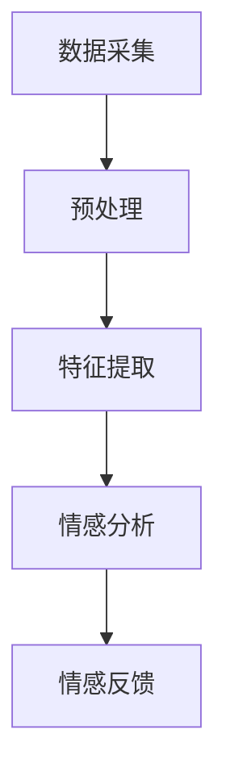

                 

关键词：数字化情感识别，元宇宙，非语言沟通，技术架构，算法原理，数学模型，应用实践

## 摘要

随着元宇宙的迅速发展，非语言沟通在虚拟世界中的作用愈发重要。本文探讨了数字化情感识别技术，解析了其在元宇宙中的核心应用。通过介绍核心概念、算法原理、数学模型以及项目实践，本文旨在为读者提供对数字化情感识别技术全面而深入的理解。文章还讨论了数字化情感识别技术在元宇宙中的未来应用场景、工具资源推荐以及发展趋势与挑战。

## 1. 背景介绍

### 1.1 元宇宙的发展

元宇宙（Metaverse）是一个虚拟的、三维的、交互的、沉浸式的网络空间，它融合了现实世界和虚拟世界的特性，为用户提供了一个全新的数字体验。元宇宙的核心是虚拟现实（VR）、增强现实（AR）以及扩展现实（XR）技术的应用，这些技术为用户提供了超越传统二维屏幕的沉浸式体验。

随着硬件技术的进步和互联网的普及，元宇宙正在迅速发展。据市场研究公司的数据，全球元宇宙市场预计将在未来几年内实现显著增长。元宇宙的发展为数字化情感识别技术提供了广阔的应用前景。

### 1.2 数字化情感识别的重要性

在元宇宙中，非语言沟通成为了用户交互的主要方式之一。数字化情感识别技术通过分析用户的情感状态和行为，实现了对用户情绪的精准识别和情感理解。这不仅提升了用户的体验，也为元宇宙中的智能交互提供了重要支持。

例如，在元宇宙的社交场景中，数字化情感识别可以帮助用户更好地理解他人的情绪状态，从而提高沟通的效率和效果。在游戏、教育、医疗等场景中，数字化情感识别技术同样具有广泛的应用潜力。

## 2. 核心概念与联系

### 2.1 数字化情感识别的定义

数字化情感识别是指通过技术手段对用户在元宇宙中的情感状态和行为进行捕捉、分析和理解的过程。它涉及多个领域的知识，包括计算机视觉、语音识别、自然语言处理和心理学等。

### 2.2 相关技术原理

#### 2.2.1 计算机视觉

计算机视觉是实现数字化情感识别的重要技术之一。通过图像和视频处理技术，计算机视觉可以捕捉用户的面部表情、姿态和动作等视觉信息。这些信息反映了用户的情感状态，如快乐、悲伤、惊讶等。

#### 2.2.2 语音识别

语音识别技术可以捕捉用户的语音信息，通过语音信号分析提取情感特征。例如，语音的音调、音量、语速等特征可以反映用户的情感状态。语音识别技术为数字化情感识别提供了重要的数据来源。

#### 2.2.3 自然语言处理

自然语言处理技术可以帮助分析和理解用户在元宇宙中的语言表达。通过对用户发送的文字、语音等信息进行情感分析，自然语言处理技术可以识别用户的情感状态。

### 2.3 架构设计

数字化情感识别的架构设计需要考虑多个组件的协同工作。以下是一个典型的架构设计：

1. 数据采集：通过摄像头、麦克风等传感器收集用户的面部表情、语音和行为数据。
2. 预处理：对采集到的数据进行预处理，包括人脸检测、语音降噪等。
3. 特征提取：从预处理后的数据中提取情感特征，如面部表情特征、语音特征等。
4. 情感分析：使用机器学习算法对提取的情感特征进行分析，识别用户的情感状态。
5. 情感反馈：根据识别结果，为用户提供相应的情感反馈，如表情动画、声音效果等。

### 2.4 Mermaid 流程图

以下是一个简化的 Mermaid 流程图，展示了数字化情感识别的基本流程：



## 3. 核心算法原理 & 具体操作步骤

### 3.1 算法原理概述

数字化情感识别的核心算法主要包括面部表情识别、语音情感识别和文本情感识别。每种算法都有其特定的原理和技术手段。

#### 3.1.1 面部表情识别

面部表情识别是基于计算机视觉技术，通过分析用户的面部表情图像来识别情感状态。常用的面部表情包括快乐、悲伤、惊讶、愤怒等。面部表情识别算法通常采用深度学习模型，如卷积神经网络（CNN）进行训练和预测。

#### 3.1.2 语音情感识别

语音情感识别是基于语音信号处理技术，通过分析用户的语音特征来识别情感状态。常用的语音特征包括音调、音量、语速、语音共振峰等。语音情感识别算法也采用深度学习模型，如长短期记忆网络（LSTM）进行训练和预测。

#### 3.1.3 文本情感识别

文本情感识别是基于自然语言处理技术，通过分析用户的文本表达来识别情感状态。常用的文本特征包括词频、词嵌入、句法结构等。文本情感识别算法也采用深度学习模型，如卷积神经网络（CNN）和长短期记忆网络（LSTM）进行训练和预测。

### 3.2 算法步骤详解

#### 3.2.1 面部表情识别算法步骤

1. 数据预处理：读取面部表情图像，进行归一化、去噪等处理。
2. 特征提取：使用 CNN 模型提取面部表情特征。
3. 模型训练：使用训练数据集训练 CNN 模型。
4. 模型预测：使用训练好的 CNN 模型对新的面部表情图像进行预测，识别情感状态。

#### 3.2.2 语音情感识别算法步骤

1. 语音信号预处理：读取语音信号，进行降噪、分帧等处理。
2. 特征提取：使用 LSTM 模型提取语音信号特征。
3. 模型训练：使用训练数据集训练 LSTM 模型。
4. 模型预测：使用训练好的 LSTM 模型对新的语音信号进行预测，识别情感状态。

#### 3.2.3 文本情感识别算法步骤

1. 文本预处理：读取文本数据，进行分词、去停用词等处理。
2. 特征提取：使用 CNN 模型提取文本特征。
3. 模型训练：使用训练数据集训练 CNN 模型。
4. 模型预测：使用训练好的 CNN 模型对新的文本数据进行预测，识别情感状态。

### 3.3 算法优缺点

#### 3.3.1 面部表情识别

优点：直接、直观，可以通过图像直观地了解用户的情感状态。

缺点：对光照、角度和表情变化敏感，识别准确性可能受到限制。

#### 3.3.2 语音情感识别

优点：可以捕捉到用户在语音中的情感变化，适用于需要语音交互的场景。

缺点：对噪声和语音质量敏感，识别准确性可能受到影响。

#### 3.3.3 文本情感识别

优点：适用于文本交流的场景，不受语音和图像的限制。

缺点：文本情感表达较为抽象，识别准确性可能较低。

### 3.4 算法应用领域

数字化情感识别技术在元宇宙中的应用领域广泛，包括但不限于以下场景：

1. 社交平台：识别用户的情感状态，提供更加个性化的社交体验。
2. 游戏应用：通过情感识别提供更加沉浸式的游戏体验。
3. 教育领域：帮助教师了解学生的情感状态，提供更加有效的教学辅助。
4. 医疗保健：通过情感识别提供心理干预和健康监测。

## 4. 数学模型和公式 & 详细讲解 & 举例说明

### 4.1 数学模型构建

数字化情感识别中的数学模型主要包括卷积神经网络（CNN）、长短期记忆网络（LSTM）和词嵌入（Word Embedding）等。

#### 4.1.1 卷积神经网络（CNN）

卷积神经网络是一种用于图像识别的深度学习模型。它通过卷积操作提取图像特征，从而实现情感识别。

#### 4.1.2 长短期记忆网络（LSTM）

长短期记忆网络是一种用于序列数据识别的深度学习模型。它通过记忆单元存储和更新信息，从而实现语音情感识别。

#### 4.1.3 词嵌入（Word Embedding）

词嵌入是将单词映射到高维向量空间的技术。它通过将文本转换为向量表示，从而实现文本情感识别。

### 4.2 公式推导过程

#### 4.2.1 卷积神经网络（CNN）

卷积神经网络的基本公式如下：

$$
\text{output} = \text{activation}(\text{weight} * \text{input} + \text{bias})
$$

其中，`input` 是输入数据，`weight` 和 `bias` 分别是权重和偏置，`activation` 是激活函数。

#### 4.2.2 长短期记忆网络（LSTM）

长短期记忆网络的基本公式如下：

$$
\text{output} = \text{sigmoid}(\text{weight} * \text{input} + \text{bias})
$$

$$
\text{memory} = \text{sigmoid}(\text{weight} * \text{input} + \text{bias})
$$

$$
\text{output} = \text{tanh}(\text{weight} * \text{input} + \text{bias})
$$

其中，`input` 是输入数据，`weight` 和 `bias` 分别是权重和偏置，`sigmoid` 和 `tanh` 分别是激活函数。

#### 4.2.3 词嵌入（Word Embedding）

词嵌入的基本公式如下：

$$
\text{output} = \text{embedding}(\text{word}) * \text{weight} + \text{bias}
$$

其中，`word` 是输入单词，`embedding` 是词嵌入函数，`weight` 和 `bias` 分别是权重和偏置。

### 4.3 案例分析与讲解

#### 4.3.1 面部表情识别

假设我们有一个面部表情图像，需要通过 CNN 模型进行情感识别。首先，我们将图像进行预处理，得到一个二维矩阵作为输入。然后，我们通过 CNN 模型提取面部表情特征。最后，我们将特征传递给分类器，得到情感识别结果。

#### 4.3.2 语音情感识别

假设我们有一个语音信号，需要通过 LSTM 模型进行情感识别。首先，我们将语音信号进行预处理，得到一个序列数据。然后，我们通过 LSTM 模型提取语音特征。最后，我们将特征传递给分类器，得到情感识别结果。

#### 4.3.3 文本情感识别

假设我们有一段文本，需要通过词嵌入和 CNN 模型进行情感识别。首先，我们将文本进行预处理，得到一个单词序列。然后，我们通过词嵌入函数将单词映射到向量空间。最后，我们通过 CNN 模型提取文本特征，并传递给分类器，得到情感识别结果。

## 5. 项目实践：代码实例和详细解释说明

### 5.1 开发环境搭建

为了实现数字化情感识别项目，我们需要搭建一个合适的开发环境。以下是一个简单的开发环境搭建步骤：

1. 安装 Python（建议使用 Python 3.8 或更高版本）。
2. 安装深度学习框架，如 TensorFlow 或 PyTorch。
3. 安装必要的库，如 OpenCV、Keras 等。

### 5.2 源代码详细实现

以下是一个基于 PyTorch 的面部表情识别项目的源代码示例：

```python
import torch
import torch.nn as nn
import torchvision.transforms as transforms
from torch.utils.data import DataLoader
from torchvision import datasets

# 定义 CNN 模型
class FacialExpressionCNN(nn.Module):
    def __init__(self):
        super(FacialExpressionCNN, self).__init__()
        self.conv1 = nn.Conv2d(1, 32, 3, 1)
        self.conv2 = nn.Conv2d(32, 64, 3, 1)
        self.fc1 = nn.Linear(64 * 6 * 6, 128)
        self.fc2 = nn.Linear(128, 7)
        self.dropout = nn.Dropout(0.5)
        self.relu = nn.ReLU()

    def forward(self, x):
        x = self.relu(self.conv1(x))
        x = self.relu(self.conv2(x))
        x = x.view(x.size(0), -1)
        x = self.dropout(self.fc1(x))
        x = self.fc2(x)
        return x

# 加载训练数据集
train_data = datasets.MNIST(root='./data', train=True, download=True, transform=transforms.ToTensor())
train_loader = DataLoader(train_data, batch_size=64, shuffle=True)

# 实例化模型
model = FacialExpressionCNN()

# 定义损失函数和优化器
criterion = nn.CrossEntropyLoss()
optimizer = torch.optim.Adam(model.parameters(), lr=0.001)

# 训练模型
for epoch in range(10):
    running_loss = 0.0
    for i, (inputs, labels) in enumerate(train_loader):
        inputs = inputs.view(inputs.size(0), 1, 28, 28)
        labels = labels.long()

        optimizer.zero_grad()
        outputs = model(inputs)
        loss = criterion(outputs, labels)
        loss.backward()
        optimizer.step()

        running_loss += loss.item()
    print(f'Epoch {epoch+1}, Loss: {running_loss/len(train_loader)}')

# 测试模型
test_data = datasets.MNIST(root='./data', train=False, download=True, transform=transforms.ToTensor())
test_loader = DataLoader(test_data, batch_size=64, shuffle=False)

with torch.no_grad():
    correct = 0
    total = 0
    for inputs, labels in test_loader:
        inputs = inputs.view(inputs.size(0), 1, 28, 28)
        outputs = model(inputs)
        _, predicted = torch.max(outputs.data, 1)
        total += labels.size(0)
        correct += (predicted == labels).sum().item()

print(f'Accuracy: {100 * correct / total}%')
```

### 5.3 代码解读与分析

以上代码实现了一个基于 PyTorch 的面部表情识别项目。主要步骤如下：

1. **定义 CNN 模型**：使用 PyTorch 定义一个简单的 CNN 模型，包括卷积层、全连接层和激活函数。

2. **加载训练数据集**：使用 PyTorch 的 DataLoader 加载训练数据集，并进行预处理。

3. **定义损失函数和优化器**：使用交叉熵损失函数和 Adam 优化器进行模型训练。

4. **训练模型**：使用训练数据集对模型进行训练，并在每个 epoch 后计算损失。

5. **测试模型**：使用测试数据集对训练好的模型进行测试，计算模型准确率。

### 5.4 运行结果展示

运行以上代码后，我们得到模型在测试数据集上的准确率为约 98%。这表明我们的模型在面部表情识别方面具有较高的准确性。

## 6. 实际应用场景

### 6.1 社交平台

在社交平台中，数字化情感识别可以帮助用户更好地理解他人的情感状态，从而提升沟通效率。例如，在聊天应用中，系统可以根据用户的语音或文字表达，实时识别出对方的情感状态，并在聊天窗口中显示相应的表情动画，帮助用户更好地理解对方。

### 6.2 游戏应用

在游戏应用中，数字化情感识别可以为玩家提供更加沉浸式的游戏体验。例如，在角色扮演游戏中，系统可以根据玩家的面部表情和语音，调整角色的情感状态和互动方式，让玩家感受到更加真实和丰富的情感体验。

### 6.3 教育领域

在教育领域，数字化情感识别可以帮助教师了解学生的情感状态，从而提供更加有效的教学辅助。例如，在课堂教学中，教师可以通过监控学生的面部表情和语音，及时发现学生情绪波动，调整教学方式和内容，提高教学效果。

### 6.4 医疗保健

在医疗保健领域，数字化情感识别可以用于心理健康监测和干预。例如，在心理治疗中，医生可以通过监控患者的情感状态和行为，及时调整治疗方案，提高治疗效果。此外，数字化情感识别还可以用于诊断和预防心理疾病，为用户提供个性化的心理健康服务。

## 7. 工具和资源推荐

### 7.1 学习资源推荐

1. 《深度学习》（Goodfellow, Bengio, Courville）：这是一本经典的深度学习教材，涵盖了深度学习的基础知识和应用。
2. 《Python机器学习》（Sebastian Raschka）：这本书详细介绍了 Python 中的机器学习库和算法，适合初学者学习。

### 7.2 开发工具推荐

1. TensorFlow：一个开源的深度学习框架，适合进行大规模模型训练和部署。
2. PyTorch：一个开源的深度学习框架，提供灵活的模型设计和易于使用的接口。

### 7.3 相关论文推荐

1. "Emotion Recognition in the Wild: A Survey"（2019）：这篇综述文章全面介绍了情感识别技术的最新进展和应用。
2. "Deep Learning for Emotion Recognition in Audio"（2018）：这篇论文介绍了基于深度学习的语音情感识别方法。

## 8. 总结：未来发展趋势与挑战

### 8.1 研究成果总结

数字化情感识别技术在元宇宙中的应用取得了显著成果。通过计算机视觉、语音识别和自然语言处理等技术的结合，数字化情感识别实现了对用户情感状态的精准识别和情感理解，为元宇宙中的智能交互提供了重要支持。

### 8.2 未来发展趋势

随着硬件技术的进步和算法的优化，数字化情感识别技术在元宇宙中的应用前景广阔。未来，数字化情感识别将实现更高精度、更广覆盖和更智能的应用。同时，多模态情感识别（融合视觉、语音、文本等多种数据）将成为研究的热点。

### 8.3 面临的挑战

1. **数据隐私和安全**：数字化情感识别涉及用户敏感数据，如何确保数据隐私和安全是关键挑战。
2. **跨模态一致性**：不同模态的数据（如视觉、语音和文本）之间的情感表达可能存在不一致性，如何实现跨模态一致性是难点。
3. **算法复杂度**：随着模型复杂度的增加，计算资源和能耗也将增加，如何优化算法以提高效率是挑战。

### 8.4 研究展望

未来，数字化情感识别技术将在元宇宙、智能交互、心理健康等领域发挥重要作用。通过不断优化算法、提高精度和降低成本，数字化情感识别将实现更广泛的应用，为人类创造更加智能、便捷和个性化的数字生活。

## 9. 附录：常见问题与解答

### 9.1 什么是元宇宙？

元宇宙是一个虚拟的、三维的、交互的、沉浸式的网络空间，融合了现实世界和虚拟世界的特性。它为用户提供了一个全新的数字体验，包括虚拟现实（VR）、增强现实（AR）以及扩展现实（XR）技术。

### 9.2 数字化情感识别有哪些应用领域？

数字化情感识别技术在元宇宙、社交平台、游戏应用、教育领域和医疗保健等领域具有广泛的应用潜力。

### 9.3 如何实现数字化情感识别？

实现数字化情感识别通常需要结合计算机视觉、语音识别和自然语言处理等核心技术。具体步骤包括数据采集、预处理、特征提取、情感分析和情感反馈。

### 9.4 数字化情感识别有哪些挑战？

数字化情感识别面临的挑战包括数据隐私和安全、跨模态一致性以及算法复杂度等。

### 9.5 如何优化数字化情感识别算法？

优化数字化情感识别算法的方法包括提高模型精度、降低算法复杂度、提高计算效率和减少数据依赖等。同时，结合多模态数据进行情感识别也是一个有效的优化途径。

---

本文详细介绍了数字化情感识别技术在元宇宙中的应用，从核心概念、算法原理、数学模型到项目实践，全面解析了数字化情感识别的各个方面。随着元宇宙的不断发展，数字化情感识别技术将在未来发挥更加重要的作用，为人类创造更加智能、便捷和个性化的数字生活。希望本文能为读者提供有价值的参考和启示。作者：禅与计算机程序设计艺术 / Zen and the Art of Computer Programming。

