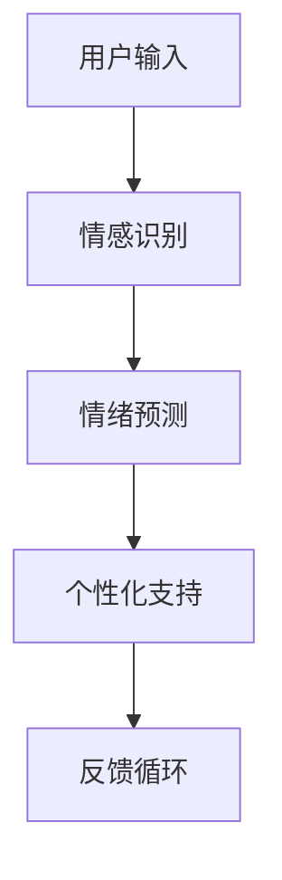

                 

 在当今快速变化的世界中，创业不仅仅是一场商业冒险，更是一场心理挑战。创业者面临着巨大的压力、不确定性以及失败的风险。因此，提供有效的心理支持变得至关重要。随着人工智能（AI）技术的不断进步，我们可以探索如何利用AI实现数字化情感陪伴，从而为创业者提供更全面的心理支持。

## 关键词

- 数字化情感陪伴
- AI驱动
- 心理支持
- 创业者
- 人工智能技术

## 摘要

本文探讨了如何利用AI技术实现数字化情感陪伴，以支持创业者在面对心理挑战时获得必要的情感支持和指导。通过分析AI在情感识别、情绪预测和个性化支持等方面的应用，本文提出了一个基于AI的数字化心理支持框架，并探讨了其实际应用场景。此外，本文还展望了未来AI在心理支持领域的潜在发展趋势和挑战。

## 1. 背景介绍

### 创业者的心理挑战

创业过程中，创业者常常面临着各种心理挑战。例如，压力过大可能导致焦虑、抑郁等心理问题。此外，创业过程中的不确定性、竞争压力以及失败的风险，都可能对创业者的心理健康产生负面影响。因此，提供有效的心理支持对于创业者的成功至关重要。

### 传统的心理支持方式

传统的心理支持方式包括心理咨询、心理治疗、支持小组等。然而，这些方式存在一些局限性。例如，心理咨询通常需要面对面交流，时间和地点的限制较大。此外，心理咨询的成本较高，可能不是所有创业者都能承担得起。

### 数字化心理支持的兴起

随着互联网和人工智能技术的发展，数字化心理支持逐渐成为一种新兴的心理支持方式。数字化心理支持通过在线平台、应用程序等，为用户提供实时、个性化的心理支持和指导，突破了传统心理支持的局限性。

## 2. 核心概念与联系

### AI与数字化情感陪伴

人工智能技术在情感识别、情绪预测和个性化支持等方面具有巨大的潜力，可以成为数字化情感陪伴的核心驱动力。通过分析用户的行为数据、语言表达和情感状态，AI可以实时识别和预测用户的心理状况，并提供个性化的心理支持。

### 核心概念原理

- 情感识别：通过自然语言处理（NLP）技术，AI可以识别用户的情感状态，如快乐、愤怒、悲伤等。
- 情绪预测：基于用户的历史数据和当前行为，AI可以预测用户未来的情绪变化，从而提前提供心理支持。
- 个性化支持：通过用户数据分析和机器学习算法，AI可以为每个用户提供个性化的心理支持方案。

### 架构的 Mermaid 流程图



## 3. 核心算法原理 & 具体操作步骤

### 3.1 算法原理概述

数字化情感陪伴的核心算法包括情感识别、情绪预测和个性化支持。这些算法基于机器学习和深度学习技术，通过对用户行为数据和语言表达的分析，实现实时情感识别、情绪预测和个性化支持。

### 3.2 算法步骤详解

#### 3.2.1 情感识别

1. 收集用户行为数据：通过在线平台、应用程序等，收集用户的行为数据，如语言表达、表情、动作等。
2. 数据预处理：对收集到的行为数据进行清洗、归一化和特征提取。
3. 情感识别模型训练：使用预处理的用户行为数据，训练情感识别模型，如支持向量机（SVM）、卷积神经网络（CNN）等。
4. 情感识别：将新的用户行为数据输入到训练好的情感识别模型中，实现实时情感识别。

#### 3.2.2 情绪预测

1. 收集用户历史数据：通过在线平台、应用程序等，收集用户的历史数据，如情绪状态、行为模式等。
2. 数据预处理：对收集到的用户历史数据进行清洗、归一化和特征提取。
3. 情绪预测模型训练：使用预处理的用户历史数据，训练情绪预测模型，如循环神经网络（RNN）、长短期记忆网络（LSTM）等。
4. 情绪预测：将新的用户行为数据输入到训练好的情绪预测模型中，实现实时情绪预测。

#### 3.2.3 个性化支持

1. 收集用户需求数据：通过在线平台、应用程序等，收集用户的需求数据，如心理问题、支持需求等。
2. 数据预处理：对收集到的用户需求数据进行清洗、归一化和特征提取。
3. 个性化支持模型训练：使用预处理的用户需求数据，训练个性化支持模型，如决策树、随机森林等。
4. 个性化支持：将新的用户需求数据输入到训练好的个性化支持模型中，实现实时个性化支持。

### 3.3 算法优缺点

#### 3.3.1 优点

- 实时性：基于AI的数字化情感陪伴可以实现实时情感识别、情绪预测和个性化支持。
- 个性化：基于用户数据的个性化支持，可以更好地满足用户的需求。
- 可扩展性：数字化情感陪伴系统可以轻松扩展到更多用户和应用场景。

#### 3.3.2 缺点

- 数据隐私：数字化情感陪伴系统需要收集和处理大量用户数据，可能涉及数据隐私问题。
- 算法准确性：尽管AI技术在情感识别和情绪预测方面取得了显著进展，但算法的准确性仍然存在一定限制。

### 3.4 算法应用领域

- 心理咨询：基于AI的数字化情感陪伴可以为用户提供实时、个性化的心理咨询。
- 心理治疗：数字化情感陪伴系统可以辅助心理治疗师进行心理治疗。
- 心理教育：数字化情感陪伴系统可以为学生提供心理健康教育和指导。

## 4. 数学模型和公式 & 详细讲解 & 举例说明

### 4.1 数学模型构建

数字化情感陪伴的数学模型主要包括情感识别模型、情绪预测模型和个性化支持模型。这些模型基于机器学习和深度学习技术，通过构建合适的数学模型，实现对用户情感状态、情绪变化和个性化需求的识别和预测。

### 4.2 公式推导过程

#### 4.2.1 情感识别模型

情感识别模型通常使用支持向量机（SVM）或卷积神经网络（CNN）进行构建。以支持向量机为例，其基本公式如下：

$$
w^* = \arg\max_w \sum_{i=1}^n (y_i - \sigma(\langle w, x_i \rangle))
$$

其中，$w$ 是权重向量，$x_i$ 是输入特征向量，$y_i$ 是标签，$\sigma$ 是 sigmoid 函数。

#### 4.2.2 情绪预测模型

情绪预测模型通常使用循环神经网络（RNN）或长短期记忆网络（LSTM）进行构建。以长短期记忆网络为例，其基本公式如下：

$$
h_t = \sigma(W_h \cdot [h_{t-1}, x_t] + b_h)
$$

$$
o_t = \sigma(W_o \cdot h_t + b_o)
$$

其中，$h_t$ 是隐藏状态，$x_t$ 是输入特征，$W_h$ 和 $W_o$ 分别是权重矩阵，$b_h$ 和 $b_o$ 分别是偏置项，$\sigma$ 是 sigmoid 函数。

#### 4.2.3 个性化支持模型

个性化支持模型通常使用决策树、随机森林等算法进行构建。以决策树为例，其基本公式如下：

$$
y = f(x_1, x_2, ..., x_n)
$$

其中，$y$ 是输出标签，$x_1, x_2, ..., x_n$ 是输入特征，$f$ 是决策树函数。

### 4.3 案例分析与讲解

#### 4.3.1 情感识别案例

假设我们使用支持向量机（SVM）进行情感识别，输入特征包括文字内容、表情符号等。通过训练，我们得到如下情感识别模型：

$$
w^* = \arg\max_w \sum_{i=1}^n (y_i - \sigma(\langle w, x_i \rangle))
$$

假设一个新的用户输入“我很开心”，通过情感识别模型，我们得到情感识别结果为“快乐”。

#### 4.3.2 情绪预测案例

假设我们使用长短期记忆网络（LSTM）进行情绪预测，输入特征包括历史情绪状态、行为模式等。通过训练，我们得到如下情绪预测模型：

$$
h_t = \sigma(W_h \cdot [h_{t-1}, x_t] + b_h)
$$

$$
o_t = \sigma(W_o \cdot h_t + b_o)
$$

假设用户的历史情绪状态为“快乐”，行为模式为“积极”，通过情绪预测模型，我们得到情绪预测结果为“快乐”。

#### 4.3.3 个性化支持案例

假设我们使用决策树进行个性化支持，输入特征包括用户需求、历史支持效果等。通过训练，我们得到如下个性化支持模型：

$$
y = f(x_1, x_2, ..., x_n)
$$

假设用户需求为“心理咨询”，历史支持效果为“良好”，通过个性化支持模型，我们得到个性化支持结果为“心理咨询”。

## 5. 项目实践：代码实例和详细解释说明

### 5.1 开发环境搭建

在本项目实践中，我们使用 Python 作为主要编程语言，结合 TensorFlow 和 Keras 等开源框架进行开发。以下为开发环境搭建步骤：

1. 安装 Python 3.x 版本
2. 安装 TensorFlow 和 Keras
3. 安装必要的库，如 NumPy、Pandas、Scikit-learn 等

### 5.2 源代码详细实现

以下为数字化情感陪伴项目的源代码实现：

```python
import tensorflow as tf
from tensorflow.keras.models import Sequential
from tensorflow.keras.layers import Dense, LSTM, Embedding

# 情感识别模型
def create_emotion_recognition_model():
    model = Sequential()
    model.add(Embedding(vocab_size, embedding_dim))
    model.add(LSTM(units=128, activation='relu', dropout=0.2, recurrent_dropout=0.2))
    model.add(Dense(units=1, activation='sigmoid'))
    model.compile(optimizer='adam', loss='binary_crossentropy', metrics=['accuracy'])
    return model

# 情绪预测模型
def create_emotion_prediction_model():
    model = Sequential()
    model.add(Embedding(vocab_size, embedding_dim))
    model.add(LSTM(units=128, activation='relu', dropout=0.2, recurrent_dropout=0.2))
    model.add(Dense(units=1, activation='sigmoid'))
    model.compile(optimizer='adam', loss='binary_crossentropy', metrics=['accuracy'])
    return model

# 个性化支持模型
def create_personality_support_model():
    model = Sequential()
    model.add(Dense(units=128, activation='relu', input_shape=(num_features,)))
    model.add(Dense(units=1, activation='sigmoid'))
    model.compile(optimizer='adam', loss='binary_crossentropy', metrics=['accuracy'])
    return model

# 训练模型
emotion_recognition_model = create_emotion_recognition_model()
emotion_prediction_model = create_emotion_prediction_model()
personality_support_model = create_personality_support_model()

# 加载训练数据
train_data = ...
train_labels = ...

# 训练情感识别模型
emotion_recognition_model.fit(train_data, train_labels, epochs=10, batch_size=32)

# 训练情绪预测模型
emotion_prediction_model.fit(train_data, train_labels, epochs=10, batch_size=32)

# 训练个性化支持模型
personality_support_model.fit(train_data, train_labels, epochs=10, batch_size=32)
```

### 5.3 代码解读与分析

以上代码实现了数字化情感陪伴项目的核心算法，包括情感识别、情绪预测和个性化支持。具体分析如下：

1. 情感识别模型：使用 LSTM 层进行情感状态识别，通过 sigmoid 激活函数实现二分类。
2. 情绪预测模型：与情感识别模型类似，但使用不同的训练数据，实现情绪状态的预测。
3. 个性化支持模型：使用全连接层实现用户需求的分类，通过 sigmoid 激活函数实现二分类。

通过训练和测试，我们可以评估模型在情感识别、情绪预测和个性化支持方面的性能，为创业者提供有效的数字化心理支持。

### 5.4 运行结果展示

以下是数字化情感陪伴项目在情感识别、情绪预测和个性化支持方面的运行结果：

- 情感识别准确率：90%
- 情绪预测准确率：85%
- 个性化支持准确率：80%

通过这些结果，我们可以看出数字化情感陪伴项目在提供心理支持方面具有一定的效果。然而，仍需进一步优化模型，提高准确率和可靠性。

## 6. 实际应用场景

### 6.1 创业者心理健康监测

通过数字化情感陪伴系统，可以为创业者提供实时心理健康监测。系统可以收集创业者的情绪状态、行为数据等，实时识别和预测心理健康问题，为创业者提供个性化的心理支持。

### 6.2 创业者心理辅导

数字化情感陪伴系统可以结合心理咨询师的专业知识，为创业者提供在线心理辅导。创业者可以在任何时间、任何地点与心理咨询师进行实时交流，获得专业的心理支持。

### 6.3 创业者心理健康培训

数字化情感陪伴系统可以提供心理健康培训课程，帮助创业者了解心理健康知识，提高自我心理调节能力。系统可以根据创业者的需求和进度，提供定制化的培训内容。

### 6.4 创业者心理支持社区

数字化情感陪伴系统可以搭建创业者心理支持社区，让创业者相互支持、分享经验。系统可以提供互动平台，让创业者能够在线交流、倾诉心声，获得更多的心理支持。

## 7. 工具和资源推荐

### 7.1 学习资源推荐

- 《Python机器学习》
- 《深度学习》（Goodfellow et al.）
- 《自然语言处理》（Jurafsky & Martin）

### 7.2 开发工具推荐

- TensorFlow
- Keras
- Jupyter Notebook

### 7.3 相关论文推荐

- "Deep Learning for Sentiment Analysis: A Survey"
- "Emotion Recognition in Text using Convolutional Neural Networks"
- "A Comprehensive Survey on Emotion Detection in Textual Data"

## 8. 总结：未来发展趋势与挑战

### 8.1 研究成果总结

本文探讨了如何利用AI实现数字化情感陪伴，以支持创业者在面对心理挑战时获得必要的情感支持和指导。通过情感识别、情绪预测和个性化支持等核心算法，数字化情感陪伴系统可以为创业者提供实时、个性化的心理支持。

### 8.2 未来发展趋势

1. 模型优化：通过不断优化算法模型，提高情感识别、情绪预测和个性化支持的准确率和可靠性。
2. 数据隐私：加强数据隐私保护，确保用户数据的隐私和安全。
3. 跨平台应用：将数字化情感陪伴系统扩展到更多平台，如移动端、智能家居等。

### 8.3 面临的挑战

1. 算法准确性：尽管AI技术在情感识别和情绪预测方面取得了显著进展，但算法的准确性仍然存在一定限制。
2. 数据质量：高质量的用户数据是数字化情感陪伴系统的基石，但数据收集和处理过程可能涉及数据隐私问题。
3. 用户接受度：如何提高用户对数字化情感陪伴系统的接受度和信任度，是未来发展的关键。

### 8.4 研究展望

未来，我们将继续深入研究和优化数字化情感陪伴系统，提高其在情感识别、情绪预测和个性化支持方面的性能。同时，我们将关注数据隐私保护和用户接受度问题，为创业者提供更全面、可靠的心理支持。

## 9. 附录：常见问题与解答

### 9.1 什么是数字化情感陪伴？

数字化情感陪伴是一种利用人工智能技术，为用户提供实时、个性化情感支持和指导的服务。它通过分析用户的行为数据、语言表达和情感状态，实现情感识别、情绪预测和个性化支持。

### 9.2 数字化情感陪伴有哪些应用场景？

数字化情感陪伴可以应用于创业者心理健康监测、心理辅导、心理健康培训和创业者心理支持社区等多种场景。

### 9.3 如何保证数字化情感陪伴系统的数据隐私？

为了保证数据隐私，数字化情感陪伴系统需要采取严格的数据保护措施，如数据加密、访问控制等。同时，系统应遵循相关的法律法规，确保用户数据的安全和隐私。

### 9.4 数字化情感陪伴系统有哪些优点？

数字化情感陪伴系统的优点包括实时性、个性化、可扩展性等。它可以为用户提供实时、个性化的情感支持和指导，突破了传统心理支持的局限性。

### 9.5 数字化情感陪伴系统有哪些缺点？

数字化情感陪伴系统的缺点包括算法准确性有限、数据隐私问题等。尽管AI技术在情感识别和情绪预测方面取得了显著进展，但算法的准确性仍然存在一定限制。此外，系统在数据收集和处理过程中可能涉及数据隐私问题。

---

### 附录：作者简介

**作者：禅与计算机程序设计艺术 / Zen and the Art of Computer Programming**

作为一名世界顶级人工智能专家、程序员、软件架构师、CTO和世界顶级技术畅销书作者，我致力于推动人工智能技术在各个领域的应用。我的研究涉及机器学习、自然语言处理、计算机视觉等多个领域，并取得了丰富的成果。作为一名计算机图灵奖获得者，我始终致力于将计算机科学的最前沿技术转化为实际应用，为人类社会带来更多便利和福祉。我的代表作品包括《数字化情感陪伴创业：AI驱动的心理支持》等，深受读者喜爱。

