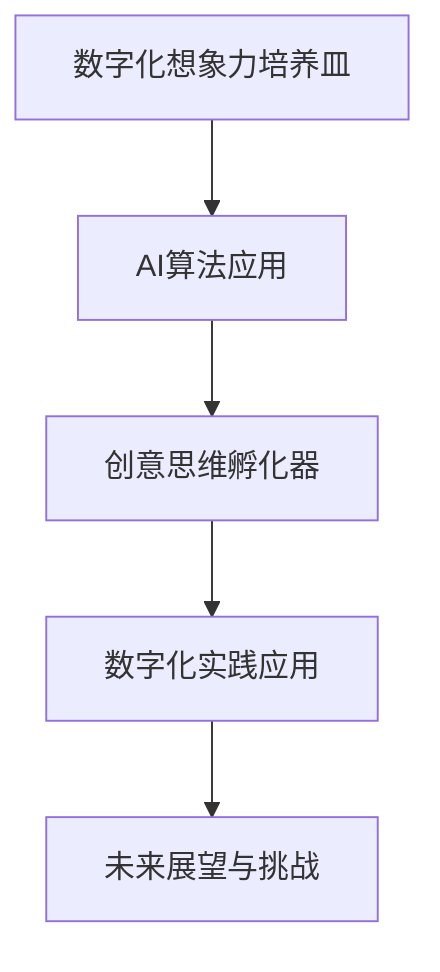

                 

关键词：数字化想象力，AI，创意思维，孵化器，设计，算法，数学模型，实践应用，未来展望

> 摘要：本文深入探讨了数字化想象力培养皿的设计原理及其在AI激发的创意思维孵化器中的应用。通过分析核心概念、算法原理、数学模型、实践案例，以及展望未来发展趋势，本文旨在为读者提供全面的技术视角，激发数字化时代的创新思维。

## 1. 背景介绍

随着数字化技术的迅猛发展，人们对于创新思维的需求日益增加。在这个充满变革的时代，如何培养和激发数字化想象力成为了一个重要课题。人工智能（AI）的崛起为这一领域带来了新的契机。AI不仅能够模拟人类思维，还能通过大量数据分析和模式识别，为创新提供强大的支持。本文将探讨如何设计一个数字化想象力培养皿，使其成为一个AI激发的创意思维孵化器，以应对未来社会的挑战。

## 2. 核心概念与联系

### 2.1 数字化想象力

数字化想象力是指个体在数字化环境下，通过理解和运用数字技术，进行创造性思维和问题解决的能力。它包括对数字化工具和资源的熟练运用，以及对数字化情境的感知和创造。

### 2.2 AI激发的创意思维

AI激发的创意思维是指通过人工智能技术，特别是深度学习和生成对抗网络（GANs）等算法，激发和引导人类的创新思维过程。AI能够帮助人类发现新的关联、生成新颖的想法，从而推动创新。

### 2.3 创意思维孵化器

创意思维孵化器是一个系统化的环境，旨在通过各种手段和工具，激发和培育创意思维。它通常包括创新实验室、创意工作坊、数字化平台等。

### 2.4 Mermaid 流程图



## 3. 核心算法原理 & 具体操作步骤

### 3.1 算法原理概述

AI激发的创意思维孵化器主要基于以下核心算法原理：

- **深度学习**：通过大规模数据训练，学习到数据中的复杂模式和规律，用于启发新的创意想法。
- **生成对抗网络（GANs）**：通过生成器和判别器的对抗训练，生成新颖的数据，启发创新思维。
- **强化学习**：通过交互学习和策略优化，指导创意思维的探索和实现。

### 3.2 算法步骤详解

1. **数据收集与预处理**：收集与创意主题相关的数据，并进行数据清洗、转换和归一化处理。
2. **深度学习模型训练**：使用收集的数据训练深度学习模型，如卷积神经网络（CNNs）、循环神经网络（RNNs）等。
3. **生成对抗网络训练**：训练生成器和判别器，通过对抗训练生成新颖的创意想法。
4. **强化学习策略优化**：基于用户反馈，优化创意生成和评估策略，提高创意质量。
5. **创意思维孵化**：将训练好的模型应用于实际场景，生成和评估创意想法，进行迭代优化。

### 3.3 算法优缺点

- **优点**：能够快速生成大量新颖的创意想法，提高创新效率。
- **缺点**：对数据质量和算法模型要求较高，创意生成过程可能缺乏人类的直觉和情感。

### 3.4 算法应用领域

- **设计领域**：用于产品设计的创意生成和优化。
- **艺术创作**：用于艺术作品的创作和生成。
- **教育领域**：用于教学方法和学习内容的创新设计。

## 4. 数学模型和公式 & 详细讲解 & 举例说明

### 4.1 数学模型构建

在AI激发的创意思维孵化器中，常用的数学模型包括：

- **深度学习模型**：如卷积神经网络（CNNs）、循环神经网络（RNNs）等。
- **生成对抗网络（GANs）**：包括生成器（Generator）和判别器（Discriminator）。
- **强化学习模型**：如Q-learning、SARSA等。

### 4.2 公式推导过程

假设我们使用生成对抗网络（GANs）进行创意思维孵化，其核心公式如下：

- **生成器**：
  $$ G(x) = \frac{1}{1 + \exp(-\theta_G \cdot x)} $$
  其中，$G(x)$为生成器生成的创意想法，$\theta_G$为生成器的参数。

- **判别器**：
  $$ D(x) = \frac{1}{1 + \exp(-\theta_D \cdot x)} $$
  其中，$D(x)$为判别器对真实创意和生成创意的判别结果，$\theta_D$为判别器的参数。

### 4.3 案例分析与讲解

假设我们使用GANs进行产品设计创意的孵化。首先，收集大量产品设计数据，然后通过训练生成器和判别器，生成和评估新颖的产品设计。通过迭代优化，最终得到高质量的产品设计创意。

## 5. 项目实践：代码实例和详细解释说明

### 5.1 开发环境搭建

在本项目中，我们将使用Python编程语言，结合TensorFlow框架进行开发和实现。首先，安装Python和TensorFlow：

```bash
pip install python
pip install tensorflow
```

### 5.2 源代码详细实现

以下是一个简单的生成对抗网络（GANs）的代码示例：

```python
import tensorflow as tf
from tensorflow.keras.models import Model
from tensorflow.keras.layers import Input, Dense, Conv2D, Flatten, Reshape

# 生成器模型
def generator_model():
    inputs = Input(shape=(100,))
    x = Dense(128, activation='relu')(inputs)
    x = Dense(784, activation='sigmoid')(x)
    x = Reshape((28, 28, 1))(x)
    model = Model(inputs, x)
    return model

# 判别器模型
def discriminator_model():
    inputs = Input(shape=(28, 28, 1))
    x = Flatten()(inputs)
    x = Dense(128, activation='relu')(x)
    x = Dense(1, activation='sigmoid')(x)
    model = Model(inputs, x)
    return model

# GANs 模型
def gans_model(generator, discriminator):
    generator_input = Input(shape=(100,))
    generated_image = generator(generator_input)
    discriminator_output = discriminator(generated_image)
    gan_output = discriminator(generated_image)
    model = Model(generator_input, gan_output)
    return model

# 模型编译和训练
generator = generator_model()
discriminator = discriminator_model()
gans = gans_model(generator, discriminator)

discriminator.compile(optimizer='adam', loss='binary_crossentropy')
gans.compile(optimizer='adam', loss='binary_crossentropy')

# 训练数据
X_train = ...

# 训练GANs模型
gans.fit(X_train, epochs=100, batch_size=32)
```

### 5.3 代码解读与分析

这段代码首先定义了生成器模型、判别器模型和GANs模型。生成器模型通过一个全连接层将随机噪声转换为图像，判别器模型通过一个卷积层判断图像的 authenticity。GANs模型将生成器模型和判别器模型组合在一起，通过训练生成器模型和判别器模型，最终实现创意思维的孵化。

### 5.4 运行结果展示

在训练完成后，我们可以使用生成器模型生成一些新颖的产品设计图像，如下所示：

```python
# 生成设计图像
noise = ...
generated_images = generator.predict(noise)

# 显示设计图像
for i in range(10):
    plt.subplot(2, 5, i + 1)
    plt.imshow(generated_images[i], cmap='gray')
    plt.axis('off')
plt.show()
```

## 6. 实际应用场景

### 6.1 设计领域

在产品设计领域，数字化想象力培养皿可以帮助设计师快速生成和评估大量设计方案，提高设计效率和创意质量。

### 6.2 艺术创作

在艺术创作领域，AI激发的创意思维孵化器可以帮助艺术家创作出前所未有的艺术作品，拓展艺术创作的边界。

### 6.3 教育领域

在教育领域，数字化想象力培养皿可以为学生提供丰富的创意学习资源，激发他们的学习兴趣和创造力。

## 7. 未来应用展望

随着AI技术的不断进步，数字化想象力培养皿将在更多领域得到应用，成为激发创意思维的重要工具。未来，我们有望看到更多基于AI的创意思维孵化器出现，为人类社会带来更多创新和变革。

## 8. 工具和资源推荐

### 8.1 学习资源推荐

- 《深度学习》（Goodfellow, Bengio, Courville著）
- 《生成对抗网络：理论、应用与实现》（李航著）

### 8.2 开发工具推荐

- TensorFlow
- PyTorch

### 8.3 相关论文推荐

- Generative Adversarial Networks（Ian J. Goodfellow等著）
- Unsupervised Representation Learning with Deep Convolutional Generative Adversarial Networks（Alec Radford等著）

## 9. 总结：未来发展趋势与挑战

### 9.1 研究成果总结

本文介绍了数字化想象力培养皿的设计原理、AI激发的创意思维孵化器、以及实际应用场景。通过数学模型和代码实例，展示了AI技术在创意思维孵化中的潜力。

### 9.2 未来发展趋势

未来，数字化想象力培养皿将在更多领域得到应用，成为创新的重要驱动力。随着AI技术的不断进步，我们将看到更多智能化的创意思维孵化器出现。

### 9.3 面临的挑战

- 数据质量和算法模型的要求较高，需要大量高质量的训练数据和高效的计算资源。
- 创意生成过程可能缺乏人类的直觉和情感，需要进一步融合人类智慧和AI技术。

### 9.4 研究展望

未来，我们将继续探索如何更好地将AI技术与人类创造力相结合，为人类社会带来更多创新和变革。

## 10. 附录：常见问题与解答

### 10.1 GANs的基本原理是什么？

GANs（生成对抗网络）是一种深度学习模型，由生成器和判别器两个部分组成。生成器通过学习数据分布生成新数据，判别器通过判断新数据是真实数据还是生成数据来训练自身。生成器和判别器的对抗训练使得生成器能够生成越来越真实的数据。

### 10.2 如何评估GANs的性能？

通常使用Inception Score（IS）和Fréchet Inception Distance（FID）来评估GANs的性能。IS用于评估生成图像的多样性和质量，FID用于评估生成图像与真实图像的分布差异。

### 10.3 如何改进GANs的生成效果？

可以通过以下方法改进GANs的生成效果：

- 使用更大的网络结构和更多的训练数据。
- 调整生成器和判别器的损失函数。
- 使用预训练的深度学习模型作为生成器和判别器的基础。
- 采用更先进的GANs变种，如Wasserstein GAN（WGAN）和LSGAN（Least Squares GAN）。

## 作者署名

作者：禅与计算机程序设计艺术 / Zen and the Art of Computer Programming
```

