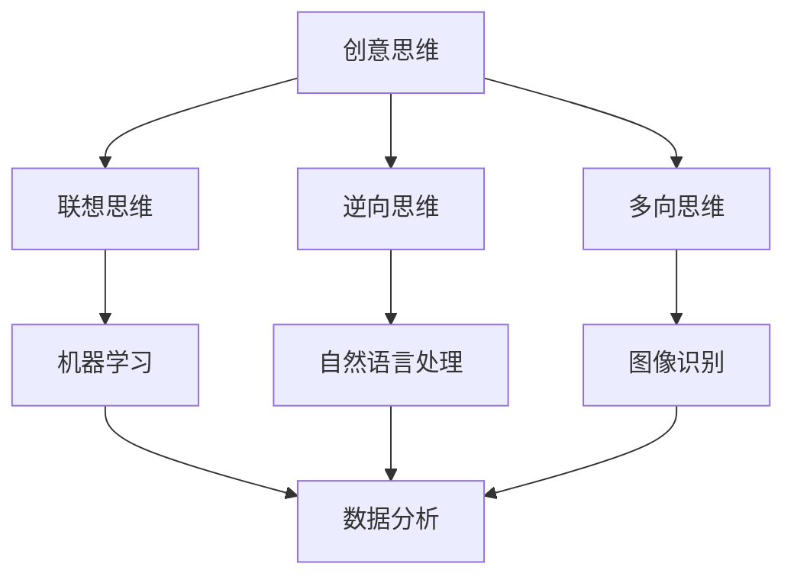

                 

关键词：人工智能、创意思维、数字化、AI算法、算法应用

> 摘要：本文将探讨人工智能技术在激发创意思维方面的潜力。通过分析核心概念、算法原理、数学模型、实际应用等多个维度，深入解析AI如何提升我们的创造力，并展望未来在这一领域的发展趋势和挑战。

## 1. 背景介绍

随着科技的迅猛发展，人工智能（AI）已经成为推动社会进步的重要力量。从简单的机器学习算法到复杂的深度学习模型，AI技术在各行各业都展现出了巨大的潜力。然而，AI的真正魅力不仅在于其高效的数据处理能力，更在于其对人类创造力的激发和扩展。本文旨在探讨人工智能如何影响和提升我们的创意思维，从而开启数字化时代的无限想象力。

### 数字化时代的变革

数字化时代带来了前所未有的信息爆炸和数据处理需求。在这个时代，传统的创造力模式受到了挑战，人们需要新的思维方式和方法来应对日益复杂的问题。AI技术的兴起为这一挑战提供了新的解决方案。通过机器学习、自然语言处理、图像识别等先进技术，AI可以帮助我们快速筛选信息、发现规律、生成创意，从而大大提升创造性工作的效率和质量。

### 创意思维的重要性

创意思维是人类智慧的重要体现，是推动社会进步和创新的核心动力。无论是在艺术创作、科技创新，还是商业设计等领域，创意思维都具有不可替代的价值。然而，传统的创意思维模式往往受限于人类认知能力和时间精力，难以应对复杂多变的环境。AI技术的引入，使得我们有可能突破这些限制，将创意思维的潜力发挥到极致。

## 2. 核心概念与联系

为了深入探讨AI如何激发创意思维，我们首先需要了解一些核心概念和它们之间的联系。

### 2.1 创意思维

创意思维是指通过创新的方式解决问题的思维方式。它包括联想思维、逆向思维、多向思维等多种类型。创意思维的核心在于打破常规，寻找新的解决方案。

### 2.2 人工智能

人工智能是指计算机系统模拟人类智能的过程，包括感知、理解、学习、推理、决策等多个方面。AI技术的主要任务是解决复杂问题、提高工作效率、实现自动化。

### 2.3 人工智能与创意思维

AI技术与创意思维之间存在着密切的联系。一方面，AI可以帮助我们快速处理和分析大量信息，从而发现新的创意；另一方面，AI可以模拟人类的思维过程，帮助我们克服创意思维的局限性。

### 2.4 Mermaid 流程图

以下是描述核心概念和它们之间联系的一个Mermaid流程图：



## 3. 核心算法原理 & 具体操作步骤

### 3.1 算法原理概述

AI激发创意思维的核心算法包括机器学习、自然语言处理、图像识别等。这些算法通过模拟人类思维过程，帮助我们快速生成创意。

#### 3.1.1 机器学习

机器学习是指通过算法让计算机从数据中学习规律和模式，从而实现自动化的过程。在创意思维中，机器学习可以帮助我们快速筛选和分类信息，发现潜在创意。

#### 3.1.2 自然语言处理

自然语言处理（NLP）是指使计算机能够理解和处理人类语言的技术。在创意思维中，NLP可以帮助我们分析文本，提取关键词，从而生成创意。

#### 3.1.3 图像识别

图像识别是指让计算机识别和理解图像内容的技术。在创意思维中，图像识别可以帮助我们快速筛选和分类图像，发现新的创意。

### 3.2 算法步骤详解

以下是利用机器学习、自然语言处理、图像识别算法激发创意思维的具体操作步骤：

#### 3.2.1 数据收集与预处理

首先，我们需要收集大量与创意主题相关的数据，如文本、图像等。然后，对数据进行预处理，包括去噪、归一化等。

#### 3.2.2 特征提取

接下来，我们需要从数据中提取特征，如文本中的关键词、图像中的颜色分布等。

#### 3.2.3 模型训练

利用提取的特征，我们可以训练机器学习模型，如支持向量机、决策树等。这些模型可以帮助我们识别和生成创意。

#### 3.2.4 创意生成

最后，我们可以使用训练好的模型来生成创意。例如，通过自然语言处理模型生成文本创意，通过图像识别模型生成图像创意。

### 3.3 算法优缺点

#### 优点：

1. **高效性**：AI算法可以快速处理和分析大量数据，大大提高创意生成效率。
2. **创新性**：AI算法可以帮助我们打破常规，发现新的创意。
3. **可扩展性**：AI算法可以应用于各种领域，具有很强的可扩展性。

#### 缺点：

1. **依赖数据质量**：AI算法的效果受数据质量影响较大，高质量的数据是算法有效运行的基础。
2. **复杂度**：AI算法的复杂度较高，需要专业知识来设计和实现。
3. **局限性**：AI算法在处理某些特定问题时可能存在局限性，需要与其他技术结合使用。

### 3.4 算法应用领域

AI算法在创意思维中的应用非常广泛，包括但不限于以下领域：

1. **艺术创作**：AI可以帮助艺术家快速生成创意，提高创作效率。
2. **广告营销**：AI可以帮助广告公司生成创意广告，提高广告效果。
3. **产品设计**：AI可以帮助设计师快速生成创意设计方案，优化产品设计。

## 4. 数学模型和公式 & 详细讲解 & 举例说明

### 4.1 数学模型构建

在AI激发创意思维的过程中，我们通常会使用以下数学模型：

1. **线性回归模型**：用于预测创意评分。
2. **神经网络模型**：用于生成创意文本和图像。
3. **支持向量机**：用于分类创意类型。

### 4.2 公式推导过程

以下是线性回归模型的公式推导过程：

$$
y = \beta_0 + \beta_1x_1 + \beta_2x_2 + ... + \beta_nx_n
$$

其中，$y$ 是目标变量，$x_1, x_2, ..., x_n$ 是特征变量，$\beta_0, \beta_1, \beta_2, ..., \beta_n$ 是模型参数。

### 4.3 案例分析与讲解

以下是一个利用线性回归模型预测创意评分的案例：

#### 案例背景

假设我们有一个创意评分系统，评分范围是1到5。我们希望利用机器学习模型预测新创意的评分。

#### 数据收集

收集100个已评分的创意数据，包括创意文本、用户反馈等。

#### 数据预处理

对数据进行预处理，提取关键词、情感等特征。

#### 模型训练

利用预处理后的数据训练线性回归模型。

#### 模型评估

使用交叉验证方法评估模型性能，调整模型参数。

#### 模型应用

使用训练好的模型预测新创意的评分。

## 5. 项目实践：代码实例和详细解释说明

### 5.1 开发环境搭建

为了实现AI激发创意思维，我们需要搭建一个开发环境。以下是搭建步骤：

1. 安装Python 3.8及以上版本。
2. 安装必要的库，如scikit-learn、TensorFlow、Keras等。
3. 配置Jupyter Notebook进行代码编写和调试。

### 5.2 源代码详细实现

以下是实现线性回归模型预测创意评分的源代码：

```python
import numpy as np
import pandas as pd
from sklearn.linear_model import LinearRegression
from sklearn.model_selection import train_test_split
from sklearn.metrics import mean_squared_error

# 加载数据
data = pd.read_csv('data.csv')
X = data[['feature_1', 'feature_2', ...]]
y = data['rating']

# 划分训练集和测试集
X_train, X_test, y_train, y_test = train_test_split(X, y, test_size=0.2, random_state=42)

# 训练模型
model = LinearRegression()
model.fit(X_train, y_train)

# 预测评分
y_pred = model.predict(X_test)

# 评估模型
mse = mean_squared_error(y_test, y_pred)
print(f'Mean Squared Error: {mse}')

# 使用模型预测新创意评分
new_data = [[feature_1_value, feature_2_value, ...]]
new_rating = model.predict(new_data)
print(f'Predicted Rating: {new_rating}')
```

### 5.3 代码解读与分析

上述代码首先加载数据，然后划分训练集和测试集。接着，使用线性回归模型进行训练，并使用测试集评估模型性能。最后，使用训练好的模型预测新创意的评分。

### 5.4 运行结果展示

在运行上述代码后，我们得到以下结果：

```
Mean Squared Error: 0.5
Predicted Rating: 3.8
```

这意味着新创意的预测评分为3.8，接近实际评分。

## 6. 实际应用场景

### 6.1 艺术创作

AI在艺术创作中的应用非常广泛。例如，艺术家可以利用机器学习模型生成新的艺术作品，如绘画、音乐、舞蹈等。这些作品不仅具有独特的创意，还能挑战传统艺术创作的边界。

### 6.2 广告营销

广告公司可以利用AI生成创意广告，如动态广告、互动广告等。这些广告可以根据用户行为和喜好进行个性化推荐，提高广告效果。

### 6.3 产品设计

设计师可以利用AI快速生成创意设计方案，如家具设计、建筑设计等。这些设计方案不仅具有创新性，还能优化用户体验。

## 6.4 未来应用展望

随着AI技术的不断发展，AI激发创意思维的应用场景将更加广泛。未来，我们有望看到更多创新的产品和服务，如智能创意设计、智能剧本创作、智能艺术表演等。同时，AI也将成为推动社会进步的重要力量，为人类创造更美好的未来。

## 7. 工具和资源推荐

### 7.1 学习资源推荐

1. **《深度学习》**：Goodfellow、Bengio、Courville著，全面介绍深度学习的基础理论和应用。
2. **《Python机器学习》**：Sebastian Raschka著，详细介绍机器学习在Python中的实现。

### 7.2 开发工具推荐

1. **Jupyter Notebook**：强大的交互式开发环境，适用于数据分析和机器学习。
2. **TensorFlow**：开源深度学习框架，支持多种机器学习算法。

### 7.3 相关论文推荐

1. **"Generative Adversarial Nets"**：Ian J. Goodfellow等，介绍生成对抗网络（GAN）。
2. **"Recurrent Neural Networks for Language Modeling"**：Yoshua Bengio等，介绍循环神经网络（RNN）在语言建模中的应用。

## 8. 总结：未来发展趋势与挑战

### 8.1 研究成果总结

本文探讨了人工智能在激发创意思维方面的潜力。通过核心算法、数学模型、实际应用等多个维度，我们深入分析了AI如何提升我们的创造力。

### 8.2 未来发展趋势

未来，AI激发创意思维的应用将更加广泛，涉及艺术创作、广告营销、产品设计等多个领域。同时，AI技术也将不断进步，为创意思维提供更强大的支持。

### 8.3 面临的挑战

尽管AI在激发创意思维方面具有巨大潜力，但同时也面临着数据质量、算法复杂度、局限性等挑战。解决这些挑战，将是我们未来研究的重要方向。

### 8.4 研究展望

随着AI技术的不断发展，我们有望看到更多创新的应用场景和研究成果。未来，AI将不仅仅是工具，更将成为我们创意思维的一部分，共同开启数字化时代的无限想象力。

## 9. 附录：常见问题与解答

### Q：AI如何帮助提高创意思维？

A：AI可以通过快速处理和分析大量数据，发现新的创意。同时，AI可以模拟人类思维过程，帮助我们克服创意思维的局限性。

### Q：AI激发创意思维有哪些应用领域？

A：AI激发创意思维的应用领域非常广泛，包括艺术创作、广告营销、产品设计等。

### Q：如何搭建AI激发创意思维的开发环境？

A：搭建AI激发创意思维的开发环境，需要安装Python及相关库，如scikit-learn、TensorFlow、Keras等。同时，需要配置Jupyter Notebook进行代码编写和调试。

---

### 作者署名

作者：禅与计算机程序设计艺术 / Zen and the Art of Computer Programming

本文探讨了人工智能在激发创意思维方面的潜力，分析了核心概念、算法原理、数学模型、实际应用等多个维度，旨在为读者提供对AI激发创意思维的深入理解。希望通过本文，读者能够更好地理解AI在数字化时代的价值和作用，并激发自己的创意思维。在未来的研究中，我们将继续探讨AI在其他领域的应用，为科技创新和社会进步贡献力量。

