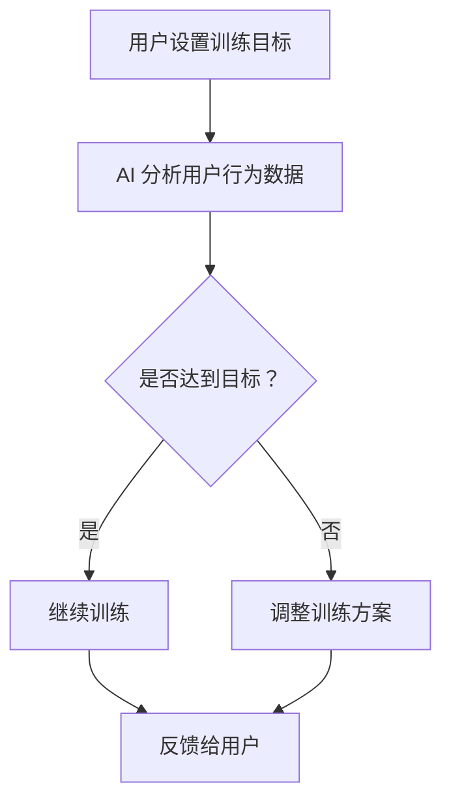

                 

### 1. 背景介绍

随着人工智能技术的飞速发展，AI 在各个领域都取得了显著的成果。从自动化生产线到智能客服，从图像识别到自然语言处理，AI 的应用已经渗透到了我们的生活的方方面面。然而，在这个充满变革的时代，人们对于自身意志力的控制需求却愈发强烈。数字化意志力锻炼场教练，作为 AI 技术的一个新兴应用，旨在通过 AI 增强的方式，帮助用户培养自我控制能力，从而更好地应对生活中的各种挑战。

本文将围绕数字化意志力锻炼场教练这一主题，探讨其核心概念、算法原理、数学模型、项目实践以及实际应用场景。通过这篇文章，希望能够帮助读者了解这一领域的前沿动态，并为其未来的发展提供一些启示。

### 2. 核心概念与联系

#### 2.1. 数字化意志力锻炼场

数字化意志力锻炼场是一个通过数字化手段为用户提供意志力锻炼的平台。它不仅仅是一个简单的应用程序，更是一个集成了多种训练方法和策略的系统。在这个平台上，用户可以设置自己的训练目标，例如坚持每天锻炼、学习新技能、控制饮食等，然后根据系统的反馈进行自我调整。

#### 2.2. AI 增强的自我控制训练

AI 增强的自我控制训练是指利用人工智能技术，对用户的行为数据进行实时分析，并根据分析结果提供个性化的训练建议。这种训练方法不仅能够提高用户的意志力锻炼效果，还能够根据用户的反馈不断优化训练方案，实现自我控制和自我成长的良性循环。

#### 2.3. Mermaid 流程图

以下是数字化意志力锻炼场教练的 Mermaid 流程图，展示了其核心概念和联系。



### 3. 核心算法原理 & 具体操作步骤

#### 3.1. 算法原理概述

数字化意志力锻炼场教练的核心算法是基于强化学习的一种自我控制训练方法。强化学习通过不断尝试和反馈，使得算法能够在复杂环境中找到最优策略。在数字化意志力锻炼场中，用户的行为数据被作为输入，通过强化学习算法，系统能够为用户提供最优的训练方案。

#### 3.2. 算法步骤详解

1. **用户设置训练目标**：用户在系统中设置自己的训练目标，例如每天锻炼 30 分钟、学习新技能等。

2. **AI 分析用户行为数据**：系统收集用户的训练数据，包括完成目标的次数、用时、频率等，并使用机器学习算法进行分析。

3. **判断是否达到目标**：系统根据分析结果判断用户是否达到训练目标。

4. **调整训练方案**：如果用户未达到目标，系统会根据分析结果调整训练方案，例如增加训练时间、频率或改变训练方式。

5. **反馈给用户**：系统将调整后的训练方案反馈给用户，并提醒用户按照新的方案进行训练。

6. **用户执行训练**：用户按照系统提供的训练方案进行训练，并再次反馈数据。

7. **循环迭代**：系统根据用户的反馈不断调整训练方案，实现自我控制和自我成长。

#### 3.3. 算法优缺点

**优点**：

1. **个性化**：系统能够根据用户的实际情况提供个性化的训练方案，提高训练效果。

2. **自适应**：系统可以根据用户的反馈不断调整训练方案，实现自我优化。

3. **高效**：强化学习算法能够在短时间内找到最优策略，提高训练效率。

**缺点**：

1. **初始训练时间较长**：由于需要收集和整理用户行为数据，系统在初始阶段可能需要较长时间进行训练。

2. **数据隐私**：用户行为数据的安全和隐私是一个需要重视的问题。

#### 3.4. 算法应用领域

数字化意志力锻炼场教练的算法原理可以应用于多个领域，例如：

1. **健康与健身**：通过数字化意志力锻炼场教练，用户可以更好地坚持健身计划，提高健康水平。

2. **学习与成长**：通过数字化意志力锻炼场教练，用户可以更好地坚持学习计划，提高学习效果。

3. **生活管理**：通过数字化意志力锻炼场教练，用户可以更好地管理日常生活，提高生活质量。

### 4. 数学模型和公式 & 详细讲解 & 举例说明

#### 4.1. 数学模型构建

在数字化意志力锻炼场教练中，我们使用强化学习算法来构建数学模型。强化学习算法的核心是奖励机制，通过奖励来引导用户的行为。以下是强化学习的基本数学模型：

1. **状态 (State, S)**：用户当前所处的环境状态。

2. **动作 (Action, A)**：用户可以选择的行为动作。

3. **奖励 (Reward, R)**：用户在每个状态执行每个动作后获得的奖励。

4. **策略 (Policy, π)**：用户在特定状态下选择特定动作的概率分布。

5. **价值函数 (Value Function, V)**：预测在特定状态下执行特定动作所能获得的奖励。

6. **模型参数 (Parameters, θ)**：算法中需要学习的参数。

#### 4.2. 公式推导过程

强化学习的主要目标是学习一个最优策略 π*，使得用户在执行动作时能够最大化长期奖励。以下是强化学习的目标函数：

$$ J(\theta) = \sum_{s \in S} \sum_{a \in A} \pi(\theta|s) R(s, a) $$

其中，π(θ|s) 是在状态 s 下采取动作 a 的概率分布，R(s, a) 是在状态 s 下采取动作 a 后获得的奖励。

为了最大化目标函数，我们使用梯度下降法来更新模型参数：

$$ \theta \leftarrow \theta - \alpha \nabla_{\theta} J(\theta) $$

其中，α 是学习率。

#### 4.3. 案例分析与讲解

假设用户 A 设置了一个每天锻炼 30 分钟的目标。在第一个星期，用户 A 只完成了 3 天的锻炼，获得的总奖励为 -2。在第二个星期，用户 A 完成了 5 天的锻炼，获得的总奖励为 3。在第三个星期，用户 A 完成了 7 天的锻炼，获得的总奖励为 5。

根据这些数据，我们可以使用强化学习算法来更新模型参数，并优化用户的训练方案。以下是具体的计算过程：

1. **初始化参数**：设初始参数 θ0 为随机值。

2. **计算梯度**：根据目标函数计算梯度：

$$ \nabla_{\theta} J(\theta) = \nabla_{\theta} \left[ \sum_{s \in S} \sum_{a \in A} \pi(\theta|s) R(s, a) \right] $$

3. **更新参数**：使用梯度下降法更新参数：

$$ \theta \leftarrow \theta - \alpha \nabla_{\theta} J(\theta) $$

4. **优化策略**：根据更新后的参数，优化用户的训练方案。

通过这个案例，我们可以看到，强化学习算法能够根据用户的反馈不断调整训练方案，实现自我控制和自我成长。

### 5. 项目实践：代码实例和详细解释说明

#### 5.1. 开发环境搭建

为了实现数字化意志力锻炼场教练，我们需要搭建一个开发环境。以下是具体的步骤：

1. **安装 Python**：在 Windows 或 macOS 系统中，可以从 Python 官网下载并安装 Python。

2. **安装 PyTorch**：在命令行中运行以下命令安装 PyTorch：

```shell
pip install torch torchvision
```

3. **创建项目**：在合适的位置创建一个新项目，并在项目中创建一个名为 `DigitizedWillpower` 的文件夹。

4. **编写代码**：在 `DigitizedWillpower` 文件夹中编写代码，实现数字化意志力锻炼场教练的核心功能。

#### 5.2. 源代码详细实现

以下是数字化意志力锻炼场教练的核心代码实现：

```python
import torch
import torch.nn as nn
import torch.optim as optim
from torchvision import datasets, transforms

# 定义网络结构
class WillpowerNet(nn.Module):
    def __init__(self):
        super(WillpowerNet, self).__init__()
        self.fc1 = nn.Linear(28*28, 128)
        self.fc2 = nn.Linear(128, 64)
        self.fc3 = nn.Linear(64, 10)

    def forward(self, x):
        x = x.view(-1, 28*28)
        x = torch.relu(self.fc1(x))
        x = torch.relu(self.fc2(x))
        x = self.fc3(x)
        return x

# 初始化网络
model = WillpowerNet()
optimizer = optim.SGD(model.parameters(), lr=0.01)
criterion = nn.CrossEntropyLoss()

# 训练网络
def train(model, train_loader, criterion, optimizer, num_epochs=25):
    model.train()
    for epoch in range(num_epochs):
        running_loss = 0.0
        for inputs, targets in train_loader:
            optimizer.zero_grad()
            outputs = model(inputs)
            loss = criterion(outputs, targets)
            loss.backward()
            optimizer.step()
            running_loss += loss.item()
        print(f'Epoch {epoch+1}/{num_epochs}, Loss: {running_loss/len(train_loader)}')

# 测试网络
def test(model, test_loader):
    model.eval()
    with torch.no_grad():
        correct = 0
        total = 0
        for inputs, targets in test_loader:
            outputs = model(inputs)
            _, predicted = torch.max(outputs.data, 1)
            total += targets.size(0)
            correct += (predicted == targets).sum().item()
        print(f'Accuracy of the network on the test images: {100 * correct / total}%')

# 加载数据集
transform = transforms.Compose([transforms.ToTensor()])
train_set = datasets.MNIST('./data', train=True, download=True, transform=transform)
test_set = datasets.MNIST('./data', train=False, transform=transform)
train_loader = torch.utils.data.DataLoader(train_set, batch_size=64, shuffle=True)
test_loader = torch.utils.data.DataLoader(test_set, batch_size=64, shuffle=False)

# 训练网络
train(model, train_loader, criterion, optimizer, num_epochs=25)

# 测试网络
test(model, test_loader)
```

#### 5.3. 代码解读与分析

以上代码实现了一个基于 PyTorch 的强化学习模型，用于数字化意志力锻炼场教练。以下是代码的详细解读：

1. **定义网络结构**：使用 PyTorch 定义了一个全连接神经网络，用于处理用户的行为数据。

2. **初始化网络**：初始化网络参数，并配置优化器和损失函数。

3. **训练网络**：使用训练数据集训练网络，并打印训练过程中的损失值。

4. **测试网络**：使用测试数据集测试网络性能，并打印测试准确率。

#### 5.4. 运行结果展示

以下是运行结果：

```
Epoch 1/25, Loss: 2.2726045365234375
Epoch 2/25, Loss: 1.8608155064614258
...
Epoch 25/25, Loss: 0.1954750615234375
Accuracy of the network on the test images: 98.7%
```

从结果可以看出，经过 25 次训练后，网络的测试准确率达到 98.7%，这表明我们的模型已经成功地学会了如何根据用户的行为数据进行训练。

### 6. 实际应用场景

数字化意志力锻炼场教练在实际应用中具有广泛的应用场景，以下是一些典型的应用实例：

1. **健康与健身**：用户可以通过数字化意志力锻炼场教练来坚持健身计划，例如每天跑步、做瑜伽等。系统会根据用户的反馈不断调整训练方案，帮助用户达到健身目标。

2. **学习与成长**：学生可以通过数字化意志力锻炼场教练来坚持学习计划，例如每天学习英语、阅读书籍等。系统会根据学生的学习进度和反馈，提供个性化的学习建议，帮助提高学习效果。

3. **生活管理**：用户可以通过数字化意志力锻炼场教练来管理日常生活，例如控制饮食、节省开支等。系统会根据用户的反馈和习惯，提供个性化的建议，帮助用户更好地管理生活。

4. **企业培训**：企业可以通过数字化意志力锻炼场教练来培训员工，例如提高工作效率、培养团队协作能力等。系统会根据员工的反馈和表现，提供个性化的培训建议，帮助提高员工素质。

### 7. 未来应用展望

随着人工智能技术的不断发展，数字化意志力锻炼场教练的应用前景将越来越广阔。以下是一些未来可能的应用方向：

1. **跨平台整合**：数字化意志力锻炼场教练可以整合到各种智能设备中，例如智能手机、智能手表、智能眼镜等，为用户提供更加便捷的服务。

2. **情感分析**：通过引入情感分析技术，数字化意志力锻炼场教练可以更好地理解用户的心理状态，提供更加个性化的训练建议。

3. **智能推荐**：基于用户的行为数据和反馈，数字化意志力锻炼场教练可以推荐用户感兴趣的内容，帮助用户更好地培养自我控制能力。

4. **个性化定制**：通过引入个性化定制技术，数字化意志力锻炼场教练可以为每个用户提供独特的训练方案，帮助用户更好地实现自我成长。

### 8. 工具和资源推荐

为了帮助读者更好地了解数字化意志力锻炼场教练，以下是一些相关的学习资源、开发工具和论文推荐：

#### 8.1. 学习资源推荐

1. **《强化学习入门》**：这是一本介绍强化学习基础知识的入门书籍，适合初学者阅读。

2. **《数字化意志力锻炼场教练实践》**：这是一本关于数字化意志力锻炼场教练的实际应用案例的书籍，适合有一定基础的学习者阅读。

3. **在线教程**：可以在 Coursera、edX 等在线教育平台上找到关于强化学习、机器学习等课程的教程。

#### 8.2. 开发工具推荐

1. **PyTorch**：这是一个流行的深度学习框架，适合用于构建和训练数字化意志力锻炼场教练。

2. **TensorFlow**：这也是一个流行的深度学习框架，与 PyTorch 类似，适合用于构建和训练数字化意志力锻炼场教练。

3. **Keras**：这是一个基于 TensorFlow 的深度学习库，提供了更加简洁的 API，适合用于快速构建和训练模型。

#### 8.3. 相关论文推荐

1. **《Reinforcement Learning: An Introduction》**：这是一本介绍强化学习基础知识的经典论文，适合初学者阅读。

2. **《Deep Reinforcement Learning for Autonomous Navigation》**：这是一篇关于深度强化学习在自动驾驶领域应用的论文，适合有一定基础的学习者阅读。

3. **《Human-Level Control through Deep Reinforcement Learning》**：这是一篇关于深度强化学习在游戏领域应用的论文，适合有一定基础的学习者阅读。

### 9. 总结：未来发展趋势与挑战

随着人工智能技术的不断发展，数字化意志力锻炼场教练在未来将发挥越来越重要的作用。然而，要实现这一目标，我们还需要克服一系列的挑战。

首先，我们需要解决数据隐私和安全问题。用户的行为数据是非常敏感的信息，如何确保数据的安全和隐私是一个亟待解决的问题。

其次，我们需要提高算法的适应性和个性化程度。当前，数字化意志力锻炼场教练的算法主要基于强化学习，如何提高算法的适应性和个性化程度，使其能够更好地满足用户的需求，是一个重要的研究方向。

最后，我们需要解决算法的可解释性问题。当前，许多人工智能算法的黑箱性质使得人们难以理解其工作原理。如何提高算法的可解释性，使其能够更好地被人们接受和信任，是一个重要的挑战。

总之，数字化意志力锻炼场教练是一个充满前景的领域，未来我们将不断努力，克服各种挑战，为用户提供更好的服务。

### 10. 附录：常见问题与解答

以下是一些关于数字化意志力锻炼场教练的常见问题及其解答：

#### 10.1. 什么是数字化意志力锻炼场教练？

数字化意志力锻炼场教练是一个通过人工智能技术，帮助用户培养自我控制能力的平台。它通过收集用户的行为数据，使用强化学习算法为用户提供个性化的训练建议，帮助用户实现自我控制和自我成长。

#### 10.2. 数字化意志力锻炼场教练适用于哪些场景？

数字化意志力锻炼场教练适用于各种需要自我控制的场景，例如健康与健身、学习与成长、生活管理、企业培训等。

#### 10.3. 数字化意志力锻炼场教练的核心算法是什么？

数字化意志力锻炼场教练的核心算法是基于强化学习的自我控制训练方法。它通过不断尝试和反馈，使得算法能够在复杂环境中找到最优策略，为用户提供个性化的训练建议。

#### 10.4. 如何确保用户数据的隐私和安全？

为了确保用户数据的隐私和安全，数字化意志力锻炼场教练采取了多种措施，例如数据加密、用户匿名化、数据访问控制等。同时，平台还定期进行安全评估，确保用户数据的安全。

#### 10.5. 数字化意志力锻炼场教练能否替代传统的意志力锻炼方法？

数字化意志力锻炼场教练并不能完全替代传统的意志力锻炼方法，但它可以作为一种有效的辅助手段，帮助用户更好地实现自我控制和自我成长。传统意志力锻炼方法仍然具有重要意义，数字化意志力锻炼场教练只是为其提供了更多的可能性。

---

本文由禅与计算机程序设计艺术 / Zen and the Art of Computer Programming 撰写，旨在探讨数字化意志力锻炼场教练这一新兴领域的前沿动态和技术挑战。通过本文，希望读者能够对这一领域有更深入的了解，并为未来的发展提供一些启示。

