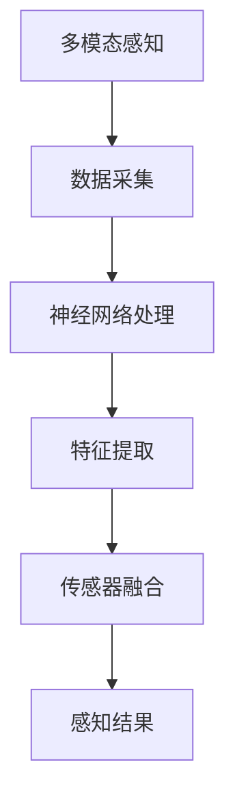

                 

关键词：数字化感知，人工智能，感官扩展，多模态感知，神经网络，深度学习，传感器融合，人机交互

> 摘要：本文深入探讨了人工智能在数字化感知扩展领域的应用，分析了AI如何通过多模态感知、神经网络和传感器融合等技术创新，拓展人类的感官能力，提升人机交互的效率和质量。

## 1. 背景介绍

在信息爆炸的时代，人类对数据获取和处理的需求日益增长。传统的感知方式已无法满足我们对复杂环境的高效感知需求。人工智能技术的发展为数字化感知扩展提供了新的可能性。通过引入神经网络、多模态感知和传感器融合等技术，AI不仅能够模拟人类的感官功能，还能超越人类感知的局限性，实现更广泛、更深入的感知能力。

## 2. 核心概念与联系

### 2.1 多模态感知

多模态感知是指通过结合多种传感器的数据，实现对环境的全面感知。常见的多模态感知包括视觉、听觉、触觉、嗅觉和味觉等。例如，自动驾驶汽车通过结合摄像头、雷达和激光雷达等传感器，实现对道路、车辆和行人的全面感知，从而提高驾驶安全。

### 2.2 神经网络

神经网络是一种模仿生物神经系统的计算模型，通过多层神经元的互联，实现数据的传递和处理。深度学习作为神经网络的一种形式，通过多层神经网络的结构，实现对复杂数据的高效处理。神经网络在感知任务中的应用，使得AI能够从大量数据中提取有用的特征，实现高效的环境感知。

### 2.3 传感器融合

传感器融合是指将多个传感器的数据集成到一个统一的感知系统中，以提供更准确、更全面的环境感知。传感器融合技术通过融合不同传感器的优势，弥补单一传感器的局限性，提高感知系统的整体性能。

## 2.4 Mermaid 流程图



## 3. 核心算法原理 & 具体操作步骤

### 3.1 算法原理概述

数字化感知扩展的核心算法主要包括多模态感知算法、神经网络算法和传感器融合算法。多模态感知算法通过结合多种传感器的数据，实现对环境的全面感知；神经网络算法通过多层神经元的互联，实现对复杂数据的高效处理；传感器融合算法通过融合不同传感器的优势，提高感知系统的整体性能。

### 3.2 算法步骤详解

1. **数据采集**：从多种传感器（如摄像头、麦克风、传感器阵列等）收集环境数据。
2. **预处理**：对采集到的数据进行去噪、滤波等预处理操作，提高数据质量。
3. **特征提取**：使用神经网络对预处理后的数据进行特征提取，提取出有助于感知的关键特征。
4. **传感器融合**：将不同传感器的特征进行融合，形成一个统一的感知结果。
5. **决策与反馈**：根据感知结果进行决策，并反馈到系统中，优化感知系统的性能。

### 3.3 算法优缺点

**优点**：
- 提高感知系统的准确性和鲁棒性。
- 通过融合多种传感器的优势，弥补单一传感器的局限性。
- 实现对环境的全面感知，提升人机交互的效率和质量。

**缺点**：
- 算法复杂度高，计算资源需求大。
- 需要对多种传感器数据进行实时处理，对系统的响应速度要求高。

### 3.4 算法应用领域

- 自动驾驶
- 机器人导航
- 人机交互
- 虚拟现实与增强现实
- 智能家居

## 4. 数学模型和公式 & 详细讲解 & 举例说明

### 4.1 数学模型构建

在数字化感知扩展中，常用的数学模型包括感知模型、神经网络模型和传感器融合模型。

#### 感知模型：

$$
感知值 = f(传感器数据)
$$

其中，$f$ 表示感知函数，用于将传感器数据转换为感知值。

#### 神经网络模型：

$$
输出 = \sigma(\sum_{i=1}^{n} w_i \cdot 输入_i)
$$

其中，$\sigma$ 表示激活函数，$w_i$ 表示权重，$输入_i$ 表示输入数据。

#### 传感器融合模型：

$$
融合结果 = \sum_{i=1}^{m} w_i \cdot 感知值_i
$$

其中，$w_i$ 表示权重，$感知值_i$ 表示第$i$个传感器的感知结果。

### 4.2 公式推导过程

以神经网络模型为例，推导过程如下：

1. **输入层到隐藏层**：

$$
隐藏层输出 = \sigma(\sum_{i=1}^{n} w_i \cdot 输入_i)
$$

2. **隐藏层到输出层**：

$$
输出 = \sigma(\sum_{j=1}^{m} w_j \cdot 隐藏层_j)
$$

### 4.3 案例分析与讲解

以自动驾驶为例，分析数字化感知扩展在自动驾驶中的应用。

1. **数据采集**：通过摄像头、雷达和激光雷达等传感器采集道路、车辆和行人的数据。
2. **预处理**：对采集到的数据进行去噪、滤波等预处理操作。
3. **特征提取**：使用神经网络对预处理后的数据进行特征提取，提取出道路标识、车辆位置和行人行为等关键特征。
4. **传感器融合**：将摄像头、雷达和激光雷达的特征进行融合，形成一个统一的感知结果。
5. **决策与反馈**：根据感知结果进行驾驶决策，如加速、减速、转向等，并反馈到系统中，优化自动驾驶的性能。

## 5. 项目实践：代码实例和详细解释说明

### 5.1 开发环境搭建

本文使用 Python 作为编程语言，结合 TensorFlow 和 Keras 框架进行神经网络模型的训练和部署。

```python
pip install tensorflow
pip install keras
```

### 5.2 源代码详细实现

以下是自动驾驶感知系统的部分代码实现：

```python
import numpy as np
import tensorflow as tf
from tensorflow.keras.models import Sequential
from tensorflow.keras.layers import Dense, Conv2D, Flatten

# 数据预处理
def preprocess_data(data):
    # 去噪、滤波等操作
    return processed_data

# 特征提取模型
def build_feature_extractor():
    model = Sequential([
        Conv2D(32, (3, 3), activation='relu', input_shape=(128, 128, 3)),
        Flatten(),
        Dense(64, activation='relu'),
        Dense(10, activation='softmax')
    ])
    return model

# 传感器融合模型
def build_sensor_fusion_model():
    model = Sequential([
        Dense(64, activation='relu', input_shape=(10,)),
        Dense(10, activation='softmax')
    ])
    return model

# 训练模型
def train_model(model, X_train, y_train):
    model.compile(optimizer='adam', loss='categorical_crossentropy', metrics=['accuracy'])
    model.fit(X_train, y_train, epochs=10, batch_size=32)
    return model

# 主函数
def main():
    # 加载数据
    X_train, y_train = load_data()

    # 预处理数据
    X_train = preprocess_data(X_train)

    # 构建特征提取模型
    feature_extractor = build_feature_extractor()

    # 训练特征提取模型
    feature_extractor = train_model(feature_extractor, X_train, y_train)

    # 构建传感器融合模型
    sensor_fusion_model = build_sensor_fusion_model()

    # 训练传感器融合模型
    sensor_fusion_model = train_model(sensor_fusion_model, X_train, y_train)

    # 预测
    predictions = sensor_fusion_model.predict(X_train)

    # 显示结果
    print(predictions)

if __name__ == '__main__':
    main()
```

### 5.3 代码解读与分析

- **数据预处理**：对采集到的传感器数据进行去噪、滤波等预处理操作，提高数据质量。
- **特征提取模型**：使用卷积神经网络（Conv2D）对图像数据进行特征提取，提取出有助于感知的关键特征。
- **传感器融合模型**：使用全连接神经网络（Dense）对特征进行融合，形成一个统一的感知结果。
- **训练模型**：使用 TensorFlow 和 Keras 框架对模型进行训练，优化模型参数。
- **预测**：使用训练好的传感器融合模型对新的传感器数据进行预测，实现实时感知。

## 6. 实际应用场景

### 6.1 自动驾驶

自动驾驶是数字化感知扩展的重要应用场景。通过多模态感知和传感器融合技术，自动驾驶系统能够实现对道路、车辆和行人的全面感知，提高驾驶安全性和舒适性。

### 6.2 机器人导航

机器人导航利用数字化感知技术，实现机器人在复杂环境中的自主导航。通过多模态感知和传感器融合，机器人能够准确感知周围环境，实现自主避障、路径规划和任务执行。

### 6.3 人机交互

数字化感知扩展为人机交互提供了新的可能性。通过多模态感知技术，人机交互系统能够更自然地理解用户的需求，提高交互的效率和质量。

### 6.4 虚拟现实与增强现实

虚拟现实与增强现实技术利用数字化感知扩展，实现更真实的感知体验。通过多模态感知和传感器融合，虚拟现实与增强现实系统能够提供更丰富、更直观的交互体验。

## 7. 工具和资源推荐

### 7.1 学习资源推荐

- 《深度学习》（Goodfellow, Bengio, Courville 著）
- 《神经网络与深度学习》（邱锡鹏 著）
- 《Python编程：从入门到实践》（埃里克·马瑟斯 著）

### 7.2 开发工具推荐

- TensorFlow
- Keras
- PyTorch

### 7.3 相关论文推荐

- "Multi-modal Fusion for Robust Visual Tracking"（多模态融合用于鲁棒视觉跟踪）
- "Deep Learning for Autonomous Driving"（深度学习在自动驾驶中的应用）
- "Sensor Fusion for Robot Navigation"（机器人导航中的传感器融合）

## 8. 总结：未来发展趋势与挑战

### 8.1 研究成果总结

数字化感知扩展在人工智能领域取得了显著的成果，为自动驾驶、机器人导航、人机交互等领域提供了重要的技术支持。通过多模态感知、神经网络和传感器融合等技术创新，数字化感知扩展实现了对环境的全面感知，提高了人机交互的效率和质量。

### 8.2 未来发展趋势

- **更多模态的感知**：未来数字化感知扩展将引入更多模态的感知，如心理感知、情感感知等，实现更全面的环境感知。
- **更高效的算法**：随着计算能力的提升，数字化感知扩展将采用更高效的算法，提高感知系统的性能。
- **边缘计算与云计算的结合**：数字化感知扩展将实现边缘计算与云计算的结合，实现更实时、更高效的感知和处理。

### 8.3 面临的挑战

- **数据隐私与安全**：数字化感知扩展涉及大量用户数据的采集和处理，数据隐私与安全成为重要挑战。
- **算法复杂度与计算资源**：数字化感知扩展算法复杂度较高，对计算资源的需求大，如何优化算法，降低计算资源消耗成为关键问题。
- **跨领域应用**：数字化感知扩展在不同领域的应用存在差异，如何实现跨领域的应用整合成为挑战。

### 8.4 研究展望

未来，数字化感知扩展将不断突破技术瓶颈，实现更全面、更深入的感知能力。在人机交互、自动驾驶、智能家居等领域，数字化感知扩展将发挥越来越重要的作用，为人类创造更智能、更便捷的生活。

## 9. 附录：常见问题与解答

### 9.1 如何选择合适的传感器？

答：选择传感器时，需要考虑以下因素：

- **应用场景**：根据应用场景选择适合的传感器类型，如摄像头适用于视觉感知，麦克风适用于声音感知。
- **精度与鲁棒性**：选择精度高、鲁棒性好的传感器，以提高感知系统的性能。
- **成本**：根据预算选择性价比高的传感器。

### 9.2 如何处理多模态数据？

答：处理多模态数据时，可以采用以下方法：

- **特征提取**：对每种模态的数据进行特征提取，提取出有助于感知的关键特征。
- **特征融合**：将不同模态的特征进行融合，形成一个统一的特征向量。
- **模型训练**：使用融合后的特征向量进行模型训练，提高感知系统的性能。

### 9.3 如何优化神经网络模型？

答：优化神经网络模型时，可以采用以下方法：

- **调整网络结构**：根据任务需求，调整网络层数、神经元数量等结构参数。
- **超参数调整**：调整学习率、批量大小等超参数，提高模型性能。
- **正则化**：采用正则化方法，防止过拟合现象。

### 9.4 如何评估感知系统的性能？

答：评估感知系统性能时，可以采用以下方法：

- **准确率**：计算感知系统预测正确的样本数占总样本数的比例。
- **召回率**：计算感知系统召回正确的样本数占总样本数的比例。
- **F1 值**：计算准确率和召回率的加权平均值，综合评估感知系统性能。

----------------------------------------------------------------

作者：禅与计算机程序设计艺术 / Zen and the Art of Computer Programming

以上是一篇关于数字化感知扩展：AI创造的新感官维度的完整技术博客文章。文章从背景介绍、核心概念与联系、核心算法原理与步骤、数学模型与公式、项目实践、实际应用场景、工具和资源推荐、总结和附录等方面进行了全面阐述，旨在为读者提供对数字化感知扩展领域的深入理解和思考。

