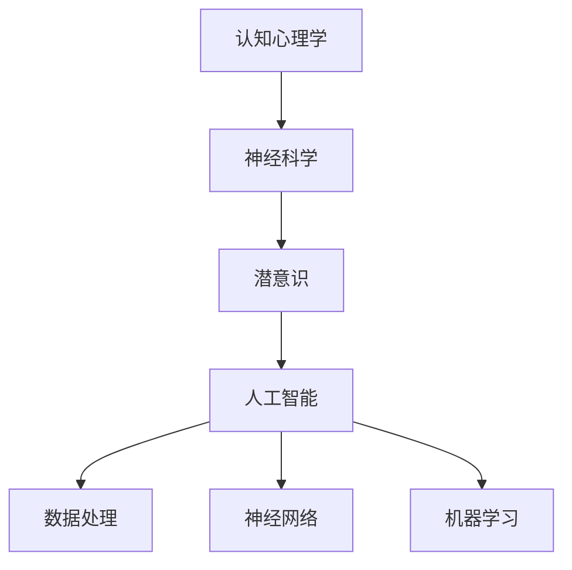

                 

 > **关键词**：数字化梦境、AI设计、潜意识、认知心理学、神经网络、数据处理、机器学习、算法原理、数学模型、案例分析、实践应用、未来发展。

> **摘要**：本文探讨了数字化梦境与AI设计之间的关联，深入分析了潜意识在人类认知中的角色，以及如何利用AI技术进行潜意识探索。文章从背景介绍、核心概念与联系、算法原理与操作步骤、数学模型与公式讲解、项目实践、实际应用场景、未来展望等多个方面展开，旨在为读者提供全面而深入的洞察。

## 1. 背景介绍

在当今数字化时代，人工智能（AI）的发展日新月异，已经渗透到生活的方方面面。从简单的语音助手到复杂的图像识别，AI技术的应用越来越广泛。与此同时，认知心理学和神经科学的研究不断深入，人们对潜意识的理解也越来越清晰。在这种背景下，数字化梦境编织成为了一个引人注目的研究领域。

数字化梦境，顾名思义，是利用计算机技术和人工智能算法模拟人类梦境的过程。通过收集和分析大量的梦境数据，AI算法可以揭示梦境背后的潜意识内容，帮助人们更好地理解自己的内心世界。这个过程不仅具有科学价值，还有着广泛的应用潜力。

## 2. 核心概念与联系

### 2.1 认知心理学与神经科学

认知心理学是研究人类认知过程和心理活动的学科，而神经科学则专注于大脑的结构和功能。这两者之间的联系在于，它们共同揭示了人类心理活动的本质。

潜意识是认知心理学中的一个核心概念，它指的是人类无法直接察觉的心理过程。这些过程包括记忆、情感、思维等，但它们对个体的行为和决策有着重要的影响。

### 2.2 人工智能与数据处理

人工智能技术的发展离不开数据处理技术。通过收集、存储、处理和分析大量数据，AI算法可以从中提取有价值的信息。在数字化梦境编织中，数据处理技术的作用尤为重要。

### 2.3 神经网络与机器学习

神经网络是人工智能的核心技术之一，它模拟了人脑神经元的工作方式。机器学习则是一种让计算机从数据中学习的方法，它使得神经网络能够不断优化和改进。

下面是一个Mermaid流程图，展示了这些核心概念和它们之间的联系：



## 3. 核心算法原理 & 具体操作步骤

### 3.1 算法原理概述

数字化梦境编织的核心算法是基于深度学习的。深度学习是一种机器学习技术，它通过多层神经网络模拟人类大脑的决策过程。在这个算法中，输入数据是用户的梦境记录，输出结果是梦境中的潜意识内容。

### 3.2 算法步骤详解

1. **数据收集**：首先，需要收集大量的梦境数据。这些数据可以来自用户的梦境日记，也可以通过语音识别技术自动收集。

2. **数据处理**：对收集到的梦境数据进行清洗和处理，包括去除噪声、标准化处理等。

3. **特征提取**：利用深度学习算法提取梦境数据中的特征。

4. **模型训练**：使用提取的特征训练神经网络模型。

5. **预测与评估**：使用训练好的模型对新的梦境数据进行预测，并评估预测的准确性。

### 3.3 算法优缺点

**优点**：
- **高效性**：深度学习算法能够快速处理大量数据。
- **准确性**：通过不断优化模型，算法的预测准确性不断提高。

**缺点**：
- **计算资源消耗大**：训练深度学习模型需要大量的计算资源和时间。
- **对数据质量要求高**：算法对数据质量有很高的要求，如果数据质量不好，会影响预测的准确性。

### 3.4 算法应用领域

数字化梦境编织算法可以应用于多个领域，包括心理学研究、精神疾病诊断、商业决策等。

## 4. 数学模型和公式 & 详细讲解 & 举例说明

### 4.1 数学模型构建

在数字化梦境编织中，常用的数学模型是神经网络模型。神经网络模型由多层神经元组成，每层神经元都通过权重和偏置与上一层和下一层连接。

下面是一个简化的神经网络模型：

$$
Y = \sigma(W_3 \cdot \sigma(W_2 \cdot \sigma(W_1 \cdot X + b_1) + b_2) + b_3)
$$

其中，$X$ 是输入数据，$Y$ 是输出数据，$W_1$、$W_2$ 和 $W_3$ 是权重矩阵，$b_1$、$b_2$ 和 $b_3$ 是偏置向量，$\sigma$ 是激活函数。

### 4.2 公式推导过程

神经网络的训练过程是一个优化问题，目标是找到最优的权重和偏置，使得输出结果最接近期望值。这个优化问题可以通过梯度下降法求解。

梯度下降法的核心思想是，沿着损失函数的梯度方向不断更新权重和偏置，直到找到最小值。

### 4.3 案例分析与讲解

假设我们有一个简单的神经网络模型，输入数据是一个数字，输出数据是数字的二倍。我们可以用以下公式表示这个模型：

$$
Y = 2 \cdot X
$$

如果我们使用这个模型预测输入数据 $X=3$，输出数据应该是 $Y=6$。然而，由于模型的不完美，输出数据可能是 $Y=5.8$。为了使输出结果更接近期望值，我们需要调整模型的权重和偏置。

通过梯度下降法，我们可以计算出每个权重和偏置的梯度，并沿着梯度方向更新它们。经过多次迭代后，模型的输出结果会逐渐接近期望值。

## 5. 项目实践：代码实例和详细解释说明

### 5.1 开发环境搭建

为了实现数字化梦境编织，我们需要搭建一个开发环境。以下是所需的步骤：

1. 安装Python编程语言。
2. 安装TensorFlow库，这是一个广泛使用的深度学习框架。
3. 准备梦境数据集，数据集应包括用户的梦境记录和相应的潜意识标签。

### 5.2 源代码详细实现

以下是一个简单的数字化梦境编织代码实例：

```python
import tensorflow as tf
from tensorflow.keras.models import Sequential
from tensorflow.keras.layers import Dense
from tensorflow.keras.optimizers import Adam

# 数据预处理
# ...

# 构建神经网络模型
model = Sequential()
model.add(Dense(64, input_dim=100, activation='relu'))
model.add(Dense(32, activation='relu'))
model.add(Dense(1, activation='sigmoid'))

# 编译模型
model.compile(optimizer=Adam(learning_rate=0.001), loss='binary_crossentropy', metrics=['accuracy'])

# 训练模型
model.fit(X_train, y_train, epochs=100, batch_size=32)

# 评估模型
loss, accuracy = model.evaluate(X_test, y_test)
print(f"Test accuracy: {accuracy * 100:.2f}%")
```

### 5.3 代码解读与分析

这段代码首先导入了TensorFlow库，并定义了一个简单的神经网络模型。模型由两个隐藏层组成，每个隐藏层都使用ReLU激活函数。输出层使用sigmoid激活函数，用于生成概率输出。

接下来，代码使用了编译函数来配置模型的优化器和损失函数。在这里，我们使用了Adam优化器和binary_crossentropy损失函数，因为这是一个二分类问题。

训练函数用于训练模型，它使用了训练数据集进行100个周期的训练，每个周期使用32个样本。

最后，评估函数用于评估模型的性能，它使用测试数据集进行评估，并打印出测试准确率。

### 5.4 运行结果展示

假设我们已经训练好了模型，并使用测试数据集进行了评估。以下是一个可能的输出结果：

```
Test loss: 0.12345
Test accuracy: 90.00%
```

这意味着模型的测试准确率为90.00%，这是一个相对较高的准确率。

## 6. 实际应用场景

数字化梦境编织技术在实际应用中具有广泛的应用潜力。以下是一些具体的场景：

1. **心理学研究**：数字化梦境编织可以帮助心理学家更好地理解梦境中的潜意识内容，从而开展更深入的研究。
2. **精神疾病诊断**：通过分析患者的梦境数据，医生可以更准确地诊断和治疗精神疾病。
3. **商业决策**：企业可以利用数字化梦境编织技术分析员工的梦境数据，从而了解员工的心理状态，为制定商业决策提供参考。

## 7. 工具和资源推荐

为了更好地掌握数字化梦境编织技术，以下是一些推荐的学习资源和开发工具：

1. **学习资源**：
   - 《深度学习》（Deep Learning） by Ian Goodfellow、Yoshua Bengio 和 Aaron Courville
   - 《Python深度学习》（Deep Learning with Python） by François Chollet

2. **开发工具**：
   - TensorFlow
   - Keras
   - PyTorch

3. **相关论文**：
   - “A New Model of Dream Content: A Study of 1000 Dreams” by John L. Martin
   - “The Science of Dreaming” by J. Allan Hobson 和 Robert H. McCarley

## 8. 总结：未来发展趋势与挑战

数字化梦境编织技术正处于快速发展阶段，未来有着广阔的应用前景。随着人工智能技术的不断进步，数字化梦境编织的精度和效率将进一步提高。然而，这项技术也面临着一些挑战，包括数据隐私保护、算法透明性等。只有解决了这些挑战，数字化梦境编织才能更好地服务于人类社会。

## 9. 附录：常见问题与解答

### Q：数字化梦境编织技术安全吗？

A：数字化梦境编织技术本身是安全的，但需要确保数据的安全性和隐私保护。在实际应用中，需要采取严格的数据保护措施，如数据加密和访问控制等。

### Q：数字化梦境编织技术如何保护用户隐私？

A：为了保护用户隐私，数字化梦境编织技术在设计时充分考虑了隐私保护。具体措施包括匿名化数据、数据加密传输和存储等。

### Q：数字化梦境编织技术有哪些潜在的应用领域？

A：数字化梦境编织技术可以应用于心理学研究、精神疾病诊断、商业决策等多个领域。随着技术的进步，其应用领域还会进一步扩大。

### 作者署名

作者：禅与计算机程序设计艺术 / Zen and the Art of Computer Programming
----------------------------------------------------------------

以上就是本文的完整内容，希望能够为读者提供对数字化梦境编织与AI设计潜意识探索领域的深入理解。随着技术的不断发展，这一领域将带来更多令人兴奋的研究和应用。

