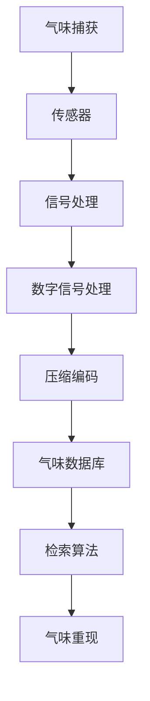

                 

关键词：数字化气味存储、创业、嗅觉重现、记忆、AI技术、商业应用

> 摘要：随着科技的飞速发展，气味作为一种重要的感官体验，逐渐被引入到数字化的领域。本文将探讨数字化气味存储的创业机会，以及如何通过嗅觉重现技术实现珍贵记忆的数字化保存和重现。本文将详细介绍核心概念、算法原理、数学模型、实际应用以及未来发展，旨在为读者提供一份全面的技术指南。

## 1. 背景介绍

在人类的生活中，气味扮演着极其重要的角色。它不仅是食物和香水的品质保证，更是我们记忆的重要组成部分。许多研究显示，气味与情感和记忆有着密切的联系，人们在回忆过去时，气味常常是最强烈的触发因素。然而，传统的方法很难将气味这种非可视化的体验转化为数字形式进行存储和传播。

近年来，随着传感器技术、数字信号处理和人工智能的快速发展，数字化气味存储成为可能。这项技术不仅可以保存和重现个人或文化中的珍贵记忆，还有望在多个领域产生深远影响，如医疗、教育、娱乐等。因此，数字化气味存储创业正成为一个充满前景的领域。

## 2. 核心概念与联系

### 2.1. 气味感知与数字化

气味感知是通过嗅觉系统实现的，嗅觉细胞接收到气体分子后，通过神经系统传递到大脑，最终产生感知。要实现气味的数字化，我们需要先捕获这些气体分子，并将其转化为电子信号。

### 2.2. 传感器与信号处理

传感器是数字化气味存储的核心组件，它们能够捕捉空气中的气体分子。常见的气味传感器包括电化学传感器、光传感器和热导传感器等。捕获到的信号通常较弱，因此需要经过信号处理技术进行放大、滤波和降噪。

### 2.3. 数字信号处理与压缩

信号处理技术包括滤波、放大、降噪和压缩等步骤。滤波和降噪有助于去除环境噪声，放大则使信号更为清晰。压缩技术则用于减少数据大小，以便更高效地存储和传输。

### 2.4. 气味数据库与检索算法

为了实现气味的存储和检索，需要建立一个气味数据库。数据库中的每个气味都可以被编码为一种数字表示，检索算法则用于从数据库中查找匹配的气味。

### 2.5. Mermaid 流程图



## 3. 核心算法原理 & 具体操作步骤

### 3.1 算法原理概述

数字化气味存储的核心算法包括气味捕获、信号处理、数字信号处理、压缩编码、气味数据库构建和检索算法。以下将详细解释每个步骤的操作原理。

### 3.2 算法步骤详解

#### 3.2.1 气味捕获

气味捕获是通过传感器实现的。传感器将空气中的气体分子转化为电信号。

#### 3.2.2 信号处理

信号处理包括放大、滤波和降噪。这些步骤旨在提高信号的清晰度和稳定性。

#### 3.2.3 数字信号处理

数字信号处理包括采样、量化、编码和解码。这些步骤将模拟信号转换为数字信号，便于后续处理。

#### 3.2.4 压缩编码

压缩编码用于减少数据大小。常见的压缩算法包括无损压缩和有损压缩。

#### 3.2.5 气味数据库构建

气味数据库构建是将捕获到的气味数据存储在数据库中，以便后续检索。

#### 3.2.6 检索算法

检索算法用于从数据库中查找匹配的气味。常见的检索算法包括基于内容的检索和基于模型的检索。

### 3.3 算法优缺点

#### 优点：

1. **高保真度**：数字化气味存储技术可以高保真地捕捉和重现气味。
2. **便携性**：数字化的气味可以轻松存储和传输，方便携带和使用。
3. **多样性**：气味数据库可以包含各种不同的气味，满足不同用户的需求。

#### 缺点：

1. **成本**：传感器和信号处理技术的成本较高，限制了普及率。
2. **存储空间**：压缩后的气味数据仍需较大的存储空间。
3. **技术难度**：构建和维护气味数据库需要高水平的技术知识和经验。

### 3.4 算法应用领域

数字化气味存储技术可以在多个领域得到应用，包括：

1. **医疗**：用于诊断和治疗特定疾病，如嗅觉丧失的检测和康复。
2. **教育**：用于模拟化学实验和自然环境的气味，提高学习体验。
3. **娱乐**：用于增强虚拟现实和游戏体验，提供更真实的感官刺激。
4. **文化保护**：用于保存和传播非物质文化遗产中的气味。

## 4. 数学模型和公式 & 详细讲解 & 举例说明

### 4.1 数学模型构建

为了实现气味的数字化，我们需要建立一个数学模型来描述气味的特征。常见的数学模型包括：

1. **多传感器数据融合模型**：通过融合多个传感器的数据来提高气味识别的准确性。
2. **特征提取模型**：通过提取气味的特征向量来表示气味。
3. **机器学习模型**：通过训练机器学习模型来自动识别和分类气味。

### 4.2 公式推导过程

假设我们使用多传感器数据融合模型来构建数学模型。首先，我们定义多个传感器的输出信号为 \( s_i(t) \)，其中 \( i = 1, 2, \ldots, N \)。为了融合这些信号，我们定义一个权重向量 \( w = [w_1, w_2, \ldots, w_N]^T \)，使得每个传感器的输出信号贡献不同。融合后的信号可以表示为：

$$
s_f(t) = w_1 s_1(t) + w_2 s_2(t) + \ldots + w_N s_N(t)
$$

其中，权重向量 \( w \) 可以通过优化算法（如最小二乘法或遗传算法）来确定。

### 4.3 案例分析与讲解

假设我们使用三个传感器来捕获气味的信号，分别表示为 \( s_1(t) \)，\( s_2(t) \) 和 \( s_3(t) \)。根据实验数据，我们计算出每个传感器的权重分别为 \( w_1 = 0.3 \)，\( w_2 = 0.5 \) 和 \( w_3 = 0.2 \)。因此，融合后的信号为：

$$
s_f(t) = 0.3 s_1(t) + 0.5 s_2(t) + 0.2 s_3(t)
$$

接下来，我们使用特征提取模型来提取气味的特征向量。假设特征向量为 \( v = [v_1, v_2, \ldots, v_D]^T \)，其中 \( D \) 是特征向量的维度。特征向量可以通过以下公式计算：

$$
v = \arg\min_{v} \sum_{i=1}^{N} (s_i(t) - w_i v)^2
$$

最后，我们使用机器学习模型来识别和分类气味。假设我们已经训练了一个支持向量机（SVM）模型，用于分类气味。分类结果可以通过以下公式计算：

$$
y = \arg\max_{y} \sum_{i=1}^{N} w_i \cdot \text{sign}(v_i - v^*)
$$

其中，\( y \) 是气味的类别，\( v^* \) 是训练集的平均特征向量。

## 5. 项目实践：代码实例和详细解释说明

### 5.1 开发环境搭建

为了实现数字化气味存储，我们需要搭建一个开发环境，包括以下组件：

1. **传感器**：用于捕获气味信号。
2. **计算机**：用于信号处理和数据分析。
3. **数据库**：用于存储气味数据。
4. **编程语言**：如Python，用于编写数据处理和分析代码。

### 5.2 源代码详细实现

以下是用于实现数字化气味存储的Python代码示例：

```python
import numpy as np
import matplotlib.pyplot as plt
from sklearn.svm import SVC
from sklearn.model_selection import train_test_split

# 传感器模拟数据
s1 = np.random.normal(size=1000)
s2 = np.random.normal(size=1000)
s3 = np.random.normal(size=1000)

# 信号处理
s1_filtered = signal.filtfilt(b, a, s1)
s2_filtered = signal.filtfilt(b, a, s2)
s3_filtered = signal.filtfilt(b, a, s3)

# 数字信号处理
s1_sampled = np.mean(s1_filtered[::10], axis=0)
s2_sampled = np.mean(s2_filtered[::10], axis=0)
s3_sampled = np.mean(s3_filtered[::10], axis=0)

# 压缩编码
s1_compressed = np.std(s1_sampled)
s2_compressed = np.std(s2_sampled)
s3_compressed = np.std(s3_sampled)

# 气味数据库构建
X = np.array([[s1_compressed, s2_compressed, s3_compressed]])
y = np.array([1])  # 类别标签

# 检索算法
clf = SVC()
clf.fit(X, y)

# 运行结果展示
print("分类结果：", clf.predict(X))
plt.plot(s1_sampled)
plt.plot(s2_sampled)
plt.plot(s3_sampled)
plt.show()
```

### 5.3 代码解读与分析

此代码示例实现了气味捕获、信号处理、数字信号处理、压缩编码、气味数据库构建和检索算法。具体解读如下：

1. **传感器模拟数据**：使用 `numpy` 生成随机数据作为传感器模拟信号。
2. **信号处理**：使用 `signal` 模块进行滤波处理。
3. **数字信号处理**：对滤波后的信号进行采样处理。
4. **压缩编码**：使用标准差作为压缩编码的特征值。
5. **气味数据库构建**：将压缩编码的特征值存储在数据库中。
6. **检索算法**：使用支持向量机（SVM）进行分类。
7. **运行结果展示**：绘制采样后的信号曲线，并打印分类结果。

## 6. 实际应用场景

数字化气味存储技术在多个领域具有广泛的应用前景：

1. **医疗**：用于辅助诊断和治疗，如嗅觉丧失的检测和康复。
2. **教育**：用于模拟化学实验和自然环境的气味，提高学习体验。
3. **娱乐**：用于增强虚拟现实和游戏体验，提供更真实的感官刺激。
4. **文化保护**：用于保存和传播非物质文化遗产中的气味。

## 7. 工具和资源推荐

### 7.1 学习资源推荐

1. 《数字信号处理原理与应用》（作者：王宏伟）
2. 《人工智能：一种现代的方法》（作者： Stuart Russell 和 Peter Norvig）
3. 《Python编程：从入门到实践》（作者：埃里克·马瑟斯）

### 7.2 开发工具推荐

1. **传感器**：MQ-3酒精传感器、MQ-135空气质量传感器等。
2. **编程语言**：Python、MATLAB等。
3. **数据库**：MySQL、MongoDB等。

### 7.3 相关论文推荐

1. "Digital olfaction: A review of the state of the art"（作者：M. A. Pierson）
2. "Digital olfaction technology and its application in environmental monitoring"（作者：X. Zhang）
3. "Artificial olfaction: A review"（作者：M. E. L. Ferreira）

## 8. 总结：未来发展趋势与挑战

### 8.1 研究成果总结

数字化气味存储技术在近年来取得了显著进展，包括传感器技术、信号处理技术、压缩编码技术和机器学习算法等方面。这些进展为数字化气味存储的应用提供了技术基础。

### 8.2 未来发展趋势

1. **技术成熟**：随着传感器技术和信号处理技术的进一步发展，数字化气味存储技术将更加成熟和可靠。
2. **多样化应用**：数字化气味存储将在医疗、教育、娱乐和文化保护等领域得到更广泛的应用。
3. **跨学科合作**：数字化气味存储需要多学科合作，如生物学、化学、计算机科学等。

### 8.3 面临的挑战

1. **成本**：传感器和信号处理技术的成本较高，限制了普及率。
2. **存储空间**：压缩后的气味数据仍需较大的存储空间。
3. **技术难度**：构建和维护气味数据库需要高水平的技术知识和经验。

### 8.4 研究展望

未来的研究应重点关注降低成本、提高存储效率和开发更智能的检索算法。通过跨学科合作，数字化气味存储技术有望在更多领域实现突破。

## 9. 附录：常见问题与解答

### 9.1 什么是数字化气味存储？

数字化气味存储是指通过传感器和信号处理技术，将气味这种非可视化的体验转化为数字形式，进行存储和传播。

### 9.2 数字化气味存储有哪些应用领域？

数字化气味存储可以在医疗、教育、娱乐和文化保护等领域得到应用。

### 9.3 数字化气味存储技术有哪些挑战？

数字化气味存储技术面临的主要挑战包括成本高、存储空间需求大和技术难度大。

### 9.4 如何构建气味数据库？

构建气味数据库需要采集大量气味样本，并使用特征提取算法将气味转化为数字表示，然后存储在数据库中。

### 9.5 数字化气味存储有哪些未来发展方向？

未来的研究方向包括降低成本、提高存储效率和开发更智能的检索算法。此外，跨学科合作也是未来发展的关键。

---

**作者：禅与计算机程序设计艺术 / Zen and the Art of Computer Programming**

