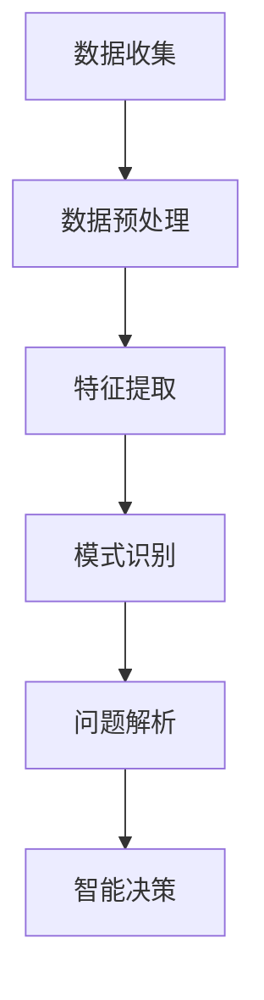

                 

关键词：数字化、洞察力、AI、问题解析、方法、技术博客、计算机科学

> 摘要：本文从数字化时代的背景出发，探讨AI在问题解析中的重要作用。通过深入分析AI驱动的问题解析方法，我们提出了一套逻辑清晰、结构紧凑且简单易懂的问题解析框架，旨在帮助读者提升数字化洞察力，更好地应对复杂的技术挑战。

## 1. 背景介绍

在数字化时代，数据已成为重要的战略资源，数据的处理与分析能力成为衡量企业竞争力的重要指标。随着大数据、云计算、物联网等技术的迅猛发展，数据的规模和复杂性不断增加，传统的数据分析方法已经无法满足需求。在此背景下，人工智能（AI）技术应运而生，成为提升数字化洞察力的关键。

AI作为计算机科学的一个重要分支，通过模拟人类智能行为，对大量数据进行自动分析和处理，从而提取有价值的信息。在问题解析领域，AI的应用不仅提高了数据处理效率，还显著提升了问题解析的准确性和全面性。因此，深入探讨AI驱动的问题解析方法，对于提升数字化洞察力具有重要意义。

## 2. 核心概念与联系

### 2.1 AI基本原理

人工智能（AI）是一门研究、开发用于模拟、延伸和扩展人类智能的理论、方法、技术及应用系统的科学。AI的核心是通过算法和计算模型来模拟人类智能，实现人机交互、自主决策和智能任务执行。AI的基本原理包括以下几个方面：

1. **机器学习**：通过大量数据训练模型，使机器具备自主学习和改进能力。
2. **深度学习**：基于多层神经网络，对复杂数据进行深度特征提取和学习。
3. **自然语言处理**：使机器理解和生成自然语言，实现人机对话和文本分析。
4. **计算机视觉**：使机器能够理解图像和视频中的信息，实现图像识别和视频分析。

### 2.2 问题解析概念

问题解析是指通过分析和处理数据，找出问题的根本原因，并提出解决方案的过程。在数字化时代，问题解析的目标是提高数据利用效率，挖掘数据中的潜在价值，从而为业务决策提供有力支持。

### 2.3 AI与问题解析的联系

AI与问题解析密切相关。AI技术能够自动处理和分析海量数据，快速识别数据中的模式、趋势和异常，从而实现对问题的准确解析。具体来说，AI在问题解析中的应用包括以下几个方面：

1. **数据预处理**：通过数据清洗、数据转换和数据归一化等预处理步骤，提高数据质量，为后续分析提供可靠基础。
2. **特征提取**：从原始数据中提取有用的特征信息，用于训练模型和进行问题解析。
3. **模式识别**：通过机器学习和深度学习算法，识别数据中的模式和规律，发现潜在问题。
4. **智能决策**：基于分析结果，自动生成解决方案，辅助业务决策。

### 2.4 Mermaid流程图

以下是一个简化的AI驱动的问题解析流程图，展示了核心概念和联系：



## 3. 核心算法原理 & 具体操作步骤

### 3.1 算法原理概述

AI驱动的问题解析算法主要基于机器学习和深度学习技术。以下简要介绍几种常用的算法：

1. **决策树**：通过树的分支结构对数据进行分类和回归。
2. **支持向量机**：通过寻找最佳分隔超平面来实现分类和回归。
3. **神经网络**：通过多层神经网络对数据进行深度特征提取和学习。
4. **聚类算法**：通过将数据分为多个类别，发现数据中的模式。

### 3.2 算法步骤详解

1. **数据收集**：收集与问题相关的数据，包括结构化数据和非结构化数据。
2. **数据预处理**：对数据进行清洗、转换和归一化，提高数据质量。
3. **特征提取**：从原始数据中提取有用的特征信息，用于训练模型。
4. **模型选择与训练**：选择合适的算法和模型，对数据进行训练。
5. **模型评估与优化**：评估模型性能，通过调整参数和优化算法来提高解析效果。
6. **问题解析**：使用训练好的模型对数据进行解析，提取有价值的信息。
7. **智能决策**：基于解析结果，自动生成解决方案，辅助业务决策。

### 3.3 算法优缺点

- **决策树**：简单易懂，易于解释。但容易过拟合，对异常数据敏感。
- **支持向量机**：性能较好，但训练时间较长，对高维数据效果较差。
- **神经网络**：能够处理复杂数据，具有很好的泛化能力。但模型训练过程复杂，需要大量数据和计算资源。
- **聚类算法**：能够发现数据中的隐含结构。但聚类结果受初始化影响较大，对异常数据敏感。

### 3.4 算法应用领域

AI驱动的问题解析算法在多个领域具有广泛的应用，包括：

1. **金融风控**：通过分析交易数据，识别潜在的欺诈行为。
2. **医疗健康**：通过分析患者数据，诊断疾病和预测健康风险。
3. **智能交通**：通过分析交通数据，优化交通流量和减少交通事故。
4. **工业制造**：通过分析生产数据，提高生产效率和降低成本。

## 4. 数学模型和公式 & 详细讲解 & 举例说明

### 4.1 数学模型构建

AI驱动的问题解析通常涉及以下数学模型：

1. **决策树**：分类和回归树模型，基于信息增益和基尼不纯度等指标进行划分。
2. **支持向量机**：线性可分支持向量机（SVM）和核SVM模型，基于最大间隔原则进行分类和回归。
3. **神经网络**：多层感知器（MLP）模型，基于反向传播算法进行训练。
4. **聚类算法**：K均值算法，基于距离度量和目标函数进行聚类。

### 4.2 公式推导过程

以下以K均值算法为例，简要介绍公式推导过程：

假设我们有一个数据集$X = \{x_1, x_2, ..., x_n\}$，其中每个数据点$x_i$可以表示为$n$个特征的向量，即$x_i = \begin{pmatrix} x_{i1} \\ x_{i2} \\ ... \\ x_{in} \end{pmatrix}$。

1. **初始化**：随机选择K个初始聚类中心$C_1, C_2, ..., C_K$。
2. **分配数据点**：对于每个数据点$x_i$，计算其与每个聚类中心的距离，并将其分配到距离最近的聚类中心所代表的类别中。
3. **更新聚类中心**：计算每个聚类中心的新位置，即取其所属数据点的平均值。

具体公式如下：

$$
C_{j new} = \frac{1}{m_j} \sum_{i \in S_j} x_i
$$

其中，$m_j$表示属于第$j$个聚类中心的数据点个数，$S_j$表示属于第$j$个聚类中心的点集。

### 4.3 案例分析与讲解

假设我们有一个包含10个数据点的数据集，以及3个聚类中心。以下是一个简化的K均值算法案例：

1. **初始化**：随机选择3个聚类中心，分别为$C_1 = (1, 1)$，$C_2 = (5, 5)$，$C_3 = (9, 9)$。
2. **分配数据点**：计算每个数据点与聚类中心的距离，并将其分配到最近的聚类中心所代表的类别中。结果如下：

   - $x_1 = (0.5, 0.5)$：分配到$C_1$类别。
   - $x_2 = (4.5, 4.5)$：分配到$C_2$类别。
   - $x_3 = (9.5, 9.5)$：分配到$C_3$类别。
   - $x_4 = (1.5, 1.5)$：分配到$C_1$类别。
   - $x_5 = (6.5, 6.5)$：分配到$C_2$类别。
   - $x_6 = (10.5, 10.5)$：分配到$C_3$类别。
   - $x_7 = (2.5, 2.5)$：分配到$C_1$类别。
   - $x_8 = (7.5, 7.5)$：分配到$C_2$类别。
   - $x_9 = (11.5, 11.5)$：分配到$C_3$类别。
   - $x_{10} = (3.5, 3.5)$：分配到$C_1$类别。

3. **更新聚类中心**：计算每个聚类中心的新位置：

   - $C_1 new = \frac{1}{5} (0.5 + 1.5 + 2.5 + 3.5 + 1.5) = (2, 2)$。
   - $C_2 new = \frac{1}{3} (4.5 + 6.5 + 7.5) = (6, 6)$。
   - $C_3 new = \frac{1}{3} (9.5 + 10.5 + 11.5) = (10.5, 10.5)$。

4. **重复步骤2和3，直到聚类中心不再发生变化**。在本例中，经过几次迭代后，聚类中心将收敛到稳定的位置。

## 5. 项目实践：代码实例和详细解释说明

### 5.1 开发环境搭建

在本项目实践中，我们将使用Python编程语言和Scikit-learn库来实现K均值算法。首先，确保已经安装了Python环境和Scikit-learn库。如果尚未安装，可以通过以下命令进行安装：

```bash
pip install python
pip install scikit-learn
```

### 5.2 源代码详细实现

以下是一个简单的K均值算法实现，包括数据集生成、聚类过程和结果可视化：

```python
import numpy as np
from sklearn.cluster import KMeans
import matplotlib.pyplot as plt

# 生成数据集
np.random.seed(0)
X = np.random.rand(100, 2)

# 初始化聚类中心
centroids = np.random.rand(3, 2)

# 配置KMeans模型
kmeans = KMeans(n_clusters=3, init=centroids, max_iter=100, n_init=1, random_state=0)

# 模型训练
kmeans.fit(X)

# 获取聚类结果
labels = kmeans.predict(X)

# 可视化聚类结果
plt.scatter(X[:, 0], X[:, 1], c=labels, s=50, cmap='viridis')
plt.scatter(kmeans.cluster_centers_[:, 0], kmeans.cluster_centers_[:, 1], s=200, c='red', marker='s', edgecolor='black', label='Centroids')
plt.xlabel('Feature 1')
plt.ylabel('Feature 2')
plt.title('K-Means Clustering')
plt.show()
```

### 5.3 代码解读与分析

1. **数据集生成**：使用`np.random.rand()`函数生成一个包含100个数据点的二维数据集。
2. **初始化聚类中心**：随机选择3个聚类中心。
3. **配置KMeans模型**：使用Scikit-learn中的`KMeans`类配置模型参数，包括聚类数量、初始化方法、迭代次数等。
4. **模型训练**：使用`fit()`方法对数据集进行训练。
5. **获取聚类结果**：使用`predict()`方法对数据点进行聚类。
6. **可视化聚类结果**：使用`matplotlib`库绘制聚类结果，显示数据点和聚类中心。

### 5.4 运行结果展示

运行上述代码后，将显示一个包含数据点和聚类中心的散点图。通过可视化结果，可以直观地观察K均值算法对数据集的聚类效果。

## 6. 实际应用场景

AI驱动的问题解析方法在多个领域具有广泛的应用。以下简要介绍几个典型应用场景：

1. **金融风控**：通过分析交易数据，识别潜在的欺诈行为，提高金融安全。
2. **医疗健康**：通过分析患者数据，诊断疾病和预测健康风险，为医疗决策提供支持。
3. **智能交通**：通过分析交通数据，优化交通流量和减少交通事故，提高出行效率。
4. **工业制造**：通过分析生产数据，提高生产效率和降低成本，提升企业竞争力。
5. **零售业**：通过分析消费者行为和购买数据，进行精准营销和个性化推荐，提升销售业绩。

## 7. 工具和资源推荐

### 7.1 学习资源推荐

1. 《机器学习》：周志华 著，清华大学出版社
2. 《深度学习》：Ian Goodfellow、Yoshua Bengio、Aaron Courville 著，电子工业出版社
3. 《Python机器学习》：Michael Bowles 著，清华大学出版社

### 7.2 开发工具推荐

1. Jupyter Notebook：一款交互式的计算环境，适合进行数据分析和机器学习实验。
2. TensorFlow：一款开源的机器学习和深度学习框架，适用于构建和训练各种神经网络模型。
3. Scikit-learn：一款开源的机器学习库，提供丰富的算法和工具，适用于数据分析和问题解析。

### 7.3 相关论文推荐

1. "Learning representations for Visual Recognition"，由Geoffrey Hinton等人在2012年提出，阐述了深度学习在图像识别中的应用。
2. "Deep Learning for Natural Language Processing"，由Quoc V. Le等人在2014年提出，介绍了深度学习在自然语言处理中的应用。
3. "Convolutional Neural Networks for Visual Recognition"，由Christian Szegedy等人在2015年提出，提出了卷积神经网络在图像识别中的新方法。

## 8. 总结：未来发展趋势与挑战

### 8.1 研究成果总结

本文从数字化时代的背景出发，探讨了AI驱动的问题解析方法。通过分析AI的基本原理和问题解析的应用领域，我们提出了一套逻辑清晰、结构紧凑且简单易懂的问题解析框架。此外，本文还通过项目实践和案例讲解，展示了K均值算法在聚类问题解析中的应用。

### 8.2 未来发展趋势

随着AI技术的不断发展，未来问题解析方法将呈现以下发展趋势：

1. **算法优化**：针对不同的问题场景，优化算法性能和计算效率。
2. **跨学科融合**：结合其他学科的理论和方法，实现更全面的问题解析。
3. **自适应学习**：通过自适应学习机制，实现动态调整和优化问题解析过程。

### 8.3 面临的挑战

尽管AI驱动的问题解析方法具有许多优势，但仍面临以下挑战：

1. **数据质量和多样性**：高质量、多样化的数据是实现准确问题解析的基础，但数据质量和多样性仍是一个亟待解决的问题。
2. **算法可解释性**：提高算法的可解释性，使其在业务决策中得到更广泛的应用。
3. **隐私保护**：在数据处理和问题解析过程中，保护用户隐私和数据安全。

### 8.4 研究展望

未来，我们将继续深入研究AI驱动的问题解析方法，探索新的算法和应用场景，以提升数字化洞察力，为业务决策提供更有力的支持。

## 9. 附录：常见问题与解答

### Q1. 什么是AI？
A1. 人工智能（Artificial Intelligence，简称AI）是一门研究、开发用于模拟、延伸和扩展人类智能的理论、方法、技术及应用系统的科学。AI的目标是使计算机具备类似人类的智能，包括学习、推理、规划、感知和语言理解等能力。

### Q2. K均值算法如何初始化聚类中心？
A2. K均值算法的初始化方法有多种，包括随机初始化、基于距离的初始化和基于密度的初始化等。本文中使用随机初始化方法，即随机选择K个数据点作为初始聚类中心。实际应用中，可以选择更优的初始化方法，以提高聚类效果。

### Q3. 如何评估K均值算法的性能？
A3. K均值算法的性能可以通过多个指标进行评估，包括：

1. **轮廓系数**（Silhouette Coefficient）：用于评估聚类结果的内部凝聚度和分离度。取值范围为[-1, 1]，值越接近1，表示聚类效果越好。
2. **聚类有效性**（Calinski-Harabasz Index）：用于评估聚类结果的质量，值越大，表示聚类效果越好。
3. **轮廓系数和聚类有效性可以结合使用，以更全面地评估K均值算法的性能。

## 文章结束

作者：禅与计算机程序设计艺术 / Zen and the Art of Computer Programming

