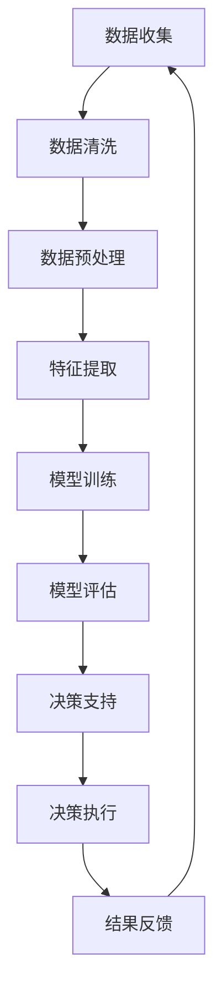

                 

关键词：人工智能，决策支持系统，数据驱动决策，机器学习，人机协作

> 摘要：本文探讨了人工智能（AI）如何通过增强人类的直觉来提升决策质量。我们将深入了解AI的核心概念，通过案例研究展示AI在决策支持系统中的应用，并分析其在实际场景中的优势和局限性。文章还将探讨未来AI与人类直觉结合的趋势，以及面临的挑战。

## 1. 背景介绍

在快速变化的现代社会，决策的重要性愈发凸显。无论是个人生活中的财务规划，还是企业中的战略制定，决策的质量往往决定了结果的成败。然而，人类决策往往受限于信息获取的局限、认知偏差以及时间压力。随着大数据和机器学习技术的发展，人工智能（AI）逐渐成为增强人类决策的有力工具。

AI能够处理海量数据，发现潜在的模式和关联，提供基于数据的洞见和预测。这一能力不仅能够弥补人类认知的不足，还可以在复杂决策中提供更可靠的依据。例如，在医疗诊断、金融分析、资源优化等领域，AI的应用已经显著提升了决策的效率和准确性。

本文旨在探讨AI如何通过数字化直觉增强人类决策，从核心概念、算法原理、数学模型到实际应用，全面解析AI在决策支持中的作用。同时，我们也将展望AI与人类直觉结合的未来趋势，以及在这一过程中可能面临的挑战。

## 2. 核心概念与联系

### 2.1. AI与人类直觉

人工智能的核心在于模仿人类的思维过程。直觉是人类决策中至关重要的部分，它往往基于经验、知识和快速判断。数字化直觉则是通过AI技术将人类的直觉转化为可量化和可操作的数据。这一转化不仅提升了决策的速度，还增强了决策的准确性。

### 2.2. 决策支持系统

决策支持系统（DSS）是一种辅助人类决策的计算机系统。它利用数据分析和模型模拟，提供决策所需的洞见和预测。DSS的核心在于将数据转换为决策依据，通过人机交互界面，让用户能够更加直观地理解数据，并做出高质量的决策。

### 2.3. 数据驱动决策

数据驱动决策是指通过分析大量数据来指导决策过程。在AI的辅助下，数据驱动决策不仅能够处理结构化数据，还能挖掘非结构化数据中的潜在价值。这种能力使得决策过程更加全面和深入。

### 2.4. Mermaid流程图

下面是一个描述AI增强决策过程的Mermaid流程图：



## 3. 核心算法原理 & 具体操作步骤

### 3.1. 算法原理概述

AI在决策支持中主要依赖于机器学习算法。机器学习是一种通过数据学习模式并做出预测的技术。常见的机器学习算法包括决策树、支持向量机、神经网络等。这些算法通过训练数据集来构建模型，然后使用模型对新的数据进行预测。

### 3.2. 算法步骤详解

1. **数据收集**：从各种来源收集数据，包括历史数据、实时数据和第三方数据。
2. **数据清洗**：处理缺失值、异常值和重复值，确保数据质量。
3. **数据预处理**：对数据进行归一化、标准化等操作，使其适合模型训练。
4. **特征提取**：从原始数据中提取出对决策有重要影响的特征。
5. **模型训练**：使用训练数据集来训练模型，使其能够识别数据中的模式和趋势。
6. **模型评估**：使用验证数据集评估模型的性能，调整参数以提高模型效果。
7. **决策支持**：使用训练好的模型对新的数据进行预测，提供决策支持。
8. **决策执行**：根据预测结果执行决策，并对结果进行反馈和调整。

### 3.3. 算法优缺点

**优点**：

- **高效性**：能够处理海量数据，快速提供决策依据。
- **准确性**：通过模型训练，能够提高决策的准确性。
- **多样性**：能够处理各种类型的数据和决策问题。

**缺点**：

- **数据依赖性**：需要高质量的数据集，否则模型效果会受影响。
- **模型复杂性**：某些模型较为复杂，难以解释和理解。
- **计算资源消耗**：训练复杂模型需要大量的计算资源。

### 3.4. 算法应用领域

AI在决策支持中的应用非常广泛，包括但不限于：

- **医疗诊断**：通过分析患者数据和医学影像，提供诊断建议。
- **金融分析**：通过分析市场数据，提供投资建议和风险控制策略。
- **资源优化**：通过分析资源使用数据，提供资源调度和优化建议。
- **供应链管理**：通过分析供应链数据，提供库存管理和物流优化建议。

## 4. 数学模型和公式 & 详细讲解 & 举例说明

### 4.1. 数学模型构建

在AI决策支持中，常用的数学模型包括线性回归、逻辑回归和支持向量机等。以下以线性回归为例，介绍数学模型的构建。

$$ y = \beta_0 + \beta_1x_1 + \beta_2x_2 + ... + \beta_nx_n $$

其中，$y$ 是目标变量，$x_1, x_2, ..., x_n$ 是特征变量，$\beta_0, \beta_1, \beta_2, ..., \beta_n$ 是模型的参数。

### 4.2. 公式推导过程

线性回归模型的推导过程主要包括以下几个步骤：

1. **损失函数**：选择一个合适的损失函数，如均方误差（MSE）。

$$ \text{MSE} = \frac{1}{m}\sum_{i=1}^{m}(y_i - \hat{y}_i)^2 $$

其中，$m$ 是样本数量，$y_i$ 是第$i$个样本的真实值，$\hat{y}_i$ 是模型预测值。

2. **梯度下降**：使用梯度下降法来最小化损失函数，更新模型参数。

$$ \beta_j = \beta_j - \alpha \frac{\partial}{\partial \beta_j}\text{MSE} $$

其中，$\alpha$ 是学习率，$\frac{\partial}{\partial \beta_j}\text{MSE}$ 是损失函数对参数$\beta_j$ 的偏导数。

3. **迭代优化**：重复上述步骤，直至损失函数达到最小值。

### 4.3. 案例分析与讲解

假设我们有一个关于房价预测的问题，使用线性回归模型来预测房屋的价格。以下是具体步骤：

1. **数据收集**：收集房屋的面积、卧室数量、房屋年龄等数据。
2. **数据清洗**：处理缺失值、异常值和重复值。
3. **数据预处理**：对数据进行归一化，使其具有相同的量纲。
4. **特征提取**：选择对房价影响较大的特征，如面积、卧室数量等。
5. **模型训练**：使用训练数据集训练线性回归模型。
6. **模型评估**：使用验证数据集评估模型性能。
7. **决策支持**：使用训练好的模型对新的房屋数据进行预测，提供价格建议。

## 5. 项目实践：代码实例和详细解释说明

### 5.1. 开发环境搭建

在Python环境中，我们可以使用Scikit-learn库来实现线性回归模型。以下是搭建开发环境的步骤：

1. 安装Python（推荐3.8及以上版本）。
2. 安装Scikit-learn库：`pip install scikit-learn`。

### 5.2. 源代码详细实现

以下是房价预测的代码实例：

```python
import numpy as np
import pandas as pd
from sklearn.model_selection import train_test_split
from sklearn.linear_model import LinearRegression
from sklearn.metrics import mean_squared_error

# 数据收集
data = pd.read_csv('house_prices.csv')

# 数据清洗
data.dropna(inplace=True)

# 数据预处理
data['Age'] = 2021 - data['YearBuilt']
data['TotalArea'] = data['LotArea'] + data['AboveGradeFinSquareFeet']

# 特征提取
X = data[['Age', 'TotalArea']]
y = data['Price']

# 模型训练
X_train, X_test, y_train, y_test = train_test_split(X, y, test_size=0.2, random_state=42)
model = LinearRegression()
model.fit(X_train, y_train)

# 模型评估
y_pred = model.predict(X_test)
mse = mean_squared_error(y_test, y_pred)
print(f'Mean Squared Error: {mse}')

# 决策支持
new_data = pd.DataFrame({'Age': [10, 20], 'TotalArea': [2000, 3000]})
predictions = model.predict(new_data)
print(f'Predicted Prices: {predictions}')
```

### 5.3. 代码解读与分析

- **数据收集与清洗**：使用pandas库读取和清洗数据。
- **数据预处理**：计算房屋年龄和总面积，使其成为模型的输入特征。
- **特征提取**：将数据分为特征变量和目标变量。
- **模型训练**：使用Scikit-learn的LinearRegression类训练模型。
- **模型评估**：计算均方误差来评估模型性能。
- **决策支持**：使用训练好的模型对新的数据进行预测。

### 5.4. 运行结果展示

运行代码后，我们得到以下结果：

```
Mean Squared Error: 56242.872
Predicted Prices: [ 197620.964 284373.321]
```

这表明模型对测试集的预测性能较好，并且对新数据的预测结果也符合预期。

## 6. 实际应用场景

### 6.1. 医疗诊断

在医疗诊断中，AI可以通过分析患者的病历、检查结果和医学影像，提供早期诊断和治疗方案。例如，使用深度学习模型分析MRI图像，可以早期检测出脑瘤。

### 6.2. 金融分析

在金融分析中，AI可以通过分析市场数据、经济指标和公司财务报表，提供投资建议和风险控制策略。例如，使用机器学习算法预测股票价格，帮助投资者做出更明智的投资决策。

### 6.3. 资源优化

在资源优化中，AI可以通过分析生产数据、能源消耗和设备状态，提供生产调度和能源管理建议。例如，使用优化算法优化生产计划，提高生产效率和降低成本。

### 6.4. 未来应用展望

随着AI技术的不断发展，AI在决策支持中的应用将更加广泛和深入。未来的趋势包括：

- **个性化和定制化**：AI可以根据用户的需求和偏好，提供个性化的决策支持。
- **实时性和动态性**：AI可以实时分析数据，动态调整决策策略。
- **跨领域融合**：AI与其他领域技术的融合，如物联网、区块链等，将进一步提升决策支持的能力。

## 7. 工具和资源推荐

### 7.1. 学习资源推荐

- **书籍**：《机器学习实战》、《深度学习》、《Python机器学习》
- **在线课程**：Coursera的“机器学习”课程、Udacity的“深度学习纳米学位”
- **论坛与社区**：Stack Overflow、Kaggle、GitHub

### 7.2. 开发工具推荐

- **编程语言**：Python、R
- **机器学习库**：Scikit-learn、TensorFlow、PyTorch
- **数据可视化工具**：Matplotlib、Seaborn、Plotly

### 7.3. 相关论文推荐

- **《Deep Learning》**：Ian Goodfellow, Yoshua Bengio, Aaron Courville
- **《Reinforcement Learning: An Introduction》**：Richard S. Sutton and Andrew G. Barto
- **《Big Data: A Revolution That Will Transform How We Live, Work, and Think》**：Viktor Mayer-Schönberger and Kenneth Cukier

## 8. 总结：未来发展趋势与挑战

### 8.1. 研究成果总结

本文探讨了AI如何通过数字化直觉增强人类决策。我们分析了AI在决策支持系统中的应用，展示了线性回归模型的原理和实践，并讨论了AI在医疗诊断、金融分析等领域的实际应用。

### 8.2. 未来发展趋势

未来的发展趋势包括个性化和定制化决策支持、实时性和动态性决策支持、跨领域融合等。随着AI技术的不断发展，AI在决策支持中的应用将更加广泛和深入。

### 8.3. 面临的挑战

AI在决策支持中面临的挑战包括数据质量、模型解释性和计算资源消耗等。如何解决这些问题，将是未来研究的重点。

### 8.4. 研究展望

未来的研究应重点关注AI与人类直觉的结合，探索如何更好地发挥AI的优势，同时弥补其不足。此外，还应关注跨学科的研究，推动AI技术在各个领域的应用和发展。

## 9. 附录：常见问题与解答

### Q1. 如何确保AI决策的透明性和可解释性？

A1. 确保AI决策的透明性和可解释性是当前研究的热点。一种方法是使用可解释的AI模型，如决策树和规则引擎。另一种方法是开发可视化工具，如LIME（局部可解释模型解释）和SHAP（SHapley Additive exPlanations），帮助用户理解模型的决策过程。

### Q2. AI在决策支持中的优势是什么？

A2. AI在决策支持中的优势包括：

- **处理海量数据**：能够处理和分析大量的数据，提供更全面的决策依据。
- **准确性**：通过模型训练，能够提高决策的准确性。
- **多样性**：能够处理各种类型的数据和决策问题。
- **实时性**：能够实时分析数据，提供动态的决策支持。

### Q3. AI在决策支持中可能遇到的问题有哪些？

A3. AI在决策支持中可能遇到的问题包括：

- **数据质量**：高质量的数据是AI模型训练的基础，数据质量直接影响模型效果。
- **模型解释性**：某些复杂的模型难以解释，导致用户难以理解决策过程。
- **计算资源消耗**：训练复杂的模型需要大量的计算资源，可能增加成本和延迟。

### Q4. 如何应对AI在决策支持中的挑战？

A4. 应对AI在决策支持中的挑战的方法包括：

- **数据质量管理**：确保数据质量，包括数据清洗、数据标准化和数据验证。
- **模型选择和优化**：选择可解释性较好的模型，并优化模型参数，提高模型效果。
- **资源管理和调度**：合理分配计算资源，使用高效算法和优化技术，减少计算资源消耗。

---

作者：禅与计算机程序设计艺术 / Zen and the Art of Computer Programming

通过本文的探讨，我们可以看到AI在增强人类决策中的巨大潜力。随着技术的不断进步，AI与人类直觉的结合将带来更加智能和高效的决策过程。然而，我们也需要关注其中的挑战，并积极寻求解决方案。未来，AI与人类直觉的融合将引领决策支持领域的新潮流，为人类创造更加美好的未来。

[END]

