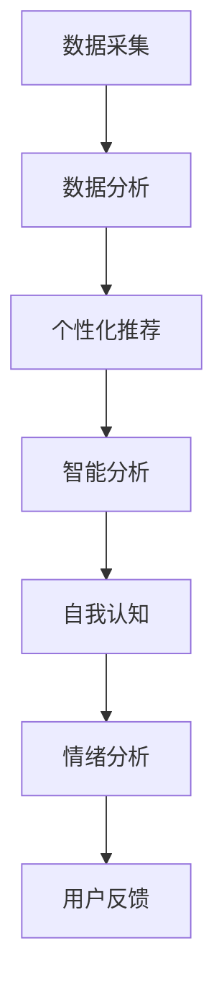

                 

关键词：数字化自我实现、AI辅助、个人成长、教练设计师、技术博客

> 摘要：本文旨在探讨如何利用人工智能技术，开发一款能够辅助个人成长的数字化自我实现助手。本文将详细解析这一概念的定义、核心原理、算法模型、数学公式、实践应用以及未来发展趋势，同时推荐相关的学习资源和开发工具，以期为广大读者提供有价值的参考。

## 1. 背景介绍

在信息化和智能化的今天，人工智能（AI）技术已经成为推动社会进步的重要力量。AI不仅改变了传统行业，还在个人生活和职业发展中扮演了关键角色。随着大数据和云计算的广泛应用，越来越多的个人和组织开始关注如何利用AI技术实现自我提升和成长。

数字化自我实现助手，是一种基于人工智能技术的个性化辅助工具，旨在通过数据分析和智能推荐，帮助用户在自我认知、学习、工作和生活中实现持续成长。这款助手的开发不仅涉及到人工智能的核心算法，还需要结合心理学、教育学、人机交互等多个领域的知识。

本文将围绕数字化自我实现助手的开发，探讨其核心概念、原理、算法、应用场景以及未来趋势，为开发者和技术爱好者提供有价值的参考。

### 1.1 人工智能技术的发展

人工智能（AI）是一门多学科交叉的工程技术科学，旨在使计算机具备类似人类的智能。自20世纪50年代诞生以来，人工智能经历了多个阶段的发展，从最初的符号主义、连接主义到现代的数据驱动方法，每一次技术突破都极大地推动了AI技术的应用。

- **符号主义**：早期的AI研究主要依赖于符号主义方法，即通过符号逻辑和推理来实现智能。这种方法强调知识的表示和推理能力，但受限于计算资源和知识的表示方法。

- **连接主义**：随着计算能力的提升，神经网络和深度学习逐渐成为主流。连接主义方法通过模拟人脑神经网络的结构和功能，实现高效的计算和模式识别。

- **数据驱动方法**：近年来，大数据和云计算的发展为AI技术注入了新的活力。数据驱动方法通过大量数据的训练，使机器具备自适应和自主学习的能力。

### 1.2 个人成长与自我实现的现状

在个人成长和自我实现方面，许多人面临着各种挑战，如时间管理、职业规划、技能提升、心理健康等。传统的学习方法和工具已无法满足个性化、高效化的需求。随着互联网和移动设备的普及，人们获取信息的途径更加多样化，但信息过载和选择困难问题也随之而来。

数字化自我实现助手作为一种新型辅助工具，能够通过个性化推荐、智能分析和数据驱动的决策支持，帮助用户更好地管理时间和资源，提高学习效率，实现自我提升。

### 1.3 数字化自我实现助手的重要性

数字化自我实现助手的重要性体现在以下几个方面：

- **个性化服务**：通过数据分析和智能推荐，为用户提供定制化的学习和成长方案，提高用户满意度。
- **效率提升**：自动化任务管理和智能提醒功能，帮助用户更好地管理时间和精力，提高工作效率。
- **心理健康**：通过情绪分析和建议，帮助用户保持心理健康，提高生活质量。
- **终身学习**：提供丰富的学习资源和在线课程，鼓励用户持续学习和成长。

## 2. 核心概念与联系

### 2.1 数字化自我实现助手的定义

数字化自我实现助手是一种利用人工智能技术，为用户提供个性化成长服务的工具。它通过数据采集、分析和智能推荐，帮助用户在自我认知、学习、工作和生活中实现持续成长。

### 2.2 核心概念及其联系

#### 2.2.1 个性化推荐

个性化推荐是数字化自我实现助手的核心功能之一。它通过分析用户的行为数据、兴趣偏好和历史记录，为用户推荐最适合的学习资源、课程和活动。个性化推荐不仅提高了用户的满意度，还能激发用户的学习兴趣，促进知识积累。

#### 2.2.2 数据分析

数据分析是数字化自我实现助手的基础。通过收集和分析用户的各种数据，如学习记录、行为日志、社交媒体互动等，助手能够深入了解用户的需求和偏好，为个性化推荐提供数据支持。

#### 2.2.3 智能分析

智能分析是数字化自我实现助手的智能核心。它通过机器学习和深度学习算法，对用户数据进行分析和处理，提取出有价值的信息和模式，为用户提供个性化的成长建议和决策支持。

#### 2.2.4 自我认知

自我认知是数字化自我实现助手的重要功能之一。通过用户画像和人格分析，助手能够帮助用户了解自己的性格特点、优势与劣势，为个人成长和职业规划提供指导。

#### 2.2.5 情绪分析

情绪分析是数字化自我实现助手的另一个关键功能。通过分析用户的情绪状态，助手能够为用户提供心理支持和建议，帮助用户保持心理健康。

### 2.3 Mermaid 流程图

以下是一个简化的Mermaid流程图，展示了数字化自我实现助手的主要功能和相互联系。



## 3. 核心算法原理 & 具体操作步骤

### 3.1 算法原理概述

数字化自我实现助手的核心算法主要包括以下几个方面：

- **用户画像生成**：通过收集用户的基本信息、行为数据和历史记录，构建用户画像，为个性化推荐和自我认知提供基础。
- **协同过滤算法**：基于用户行为数据和相似度计算，为用户推荐相似的用户喜欢的资源，提高推荐效果。
- **情感分析算法**：通过自然语言处理技术，分析用户的情绪状态，为情绪分析和心理健康提供支持。
- **深度学习算法**：利用深度神经网络，对用户数据进行分析和预测，为智能分析和自我认知提供技术支持。

### 3.2 算法步骤详解

#### 3.2.1 用户画像生成

用户画像生成是数字化自我实现助手的第一步。具体步骤如下：

1. **数据采集**：收集用户的基本信息、行为数据和历史记录，如学习记录、浏览历史、社交媒体互动等。
2. **数据预处理**：对采集到的数据进行清洗、去噪和处理，提取出有价值的信息。
3. **特征提取**：利用机器学习算法，对预处理后的数据进行特征提取，构建用户画像。

#### 3.2.2 协同过滤算法

协同过滤算法是数字化自我实现助手的推荐核心。具体步骤如下：

1. **用户行为分析**：分析用户的浏览历史、购买记录等行为数据，提取用户的行为特征。
2. **相似度计算**：计算用户之间的相似度，可采用余弦相似度、皮尔逊相关系数等方法。
3. **推荐生成**：根据相似度计算结果，为用户推荐相似用户喜欢的资源。

#### 3.2.3 情感分析算法

情感分析算法是数字化自我实现助手的重要功能之一。具体步骤如下：

1. **文本预处理**：对用户的文本数据进行清洗、分词和词性标注等预处理操作。
2. **情感分类**：利用机器学习算法，对预处理后的文本进行情感分类，判断文本的情感倾向。
3. **情绪分析**：根据情感分类结果，分析用户的情绪状态，为情绪分析和心理健康提供支持。

#### 3.2.4 深度学习算法

深度学习算法是数字化自我实现助手的智能核心。具体步骤如下：

1. **数据预处理**：对用户数据集进行清洗、归一化和特征提取等预处理操作。
2. **模型训练**：利用深度神经网络，对预处理后的数据集进行训练，提取用户数据的特征和模式。
3. **模型评估**：对训练好的模型进行评估，调整模型参数，提高模型效果。
4. **模型应用**：将训练好的模型应用到实际场景中，为智能分析和自我认知提供支持。

### 3.3 算法优缺点

#### 3.3.1 优点

- **高效性**：数字化自我实现助手能够通过自动化和智能化手段，快速地为用户提供个性化推荐和成长建议，提高用户满意度。
- **个性化**：基于用户数据和智能分析，助手能够为用户提供高度个性化的服务，满足用户的多样化需求。
- **实时性**：数字化自我实现助手能够实时分析用户数据和反馈，及时调整推荐和策略，提高用户体验。

#### 3.3.2 缺点

- **数据隐私**：数字化自我实现助手需要收集用户的大量个人信息和行为数据，可能涉及用户隐私问题。
- **算法偏见**：算法模型可能存在偏见，导致推荐结果不公平或不准确。
- **计算资源**：深度学习和大数据分析需要大量的计算资源和存储空间，对硬件要求较高。

### 3.4 算法应用领域

数字化自我实现助手的应用领域非常广泛，包括但不限于以下几个方面：

- **在线教育**：为学习者提供个性化课程推荐、学习进度跟踪和效果评估。
- **职业规划**：为职业人士提供职业发展建议、技能提升路径和职业机会推荐。
- **心理健康**：为用户提供情绪分析、心理支持和心理健康建议。
- **生活服务**：为用户提供个性化的生活服务推荐，如健康饮食、健身计划等。

## 4. 数学模型和公式 & 详细讲解 & 举例说明

### 4.1 数学模型构建

在数字化自我实现助手的开发过程中，需要构建一系列数学模型来支持个性化推荐、情感分析和自我认知等功能。以下是一些核心数学模型及其构建方法：

#### 4.1.1 协同过滤算法中的相似度计算

协同过滤算法的核心是计算用户之间的相似度。一种常用的相似度计算方法是余弦相似度，其公式如下：

$$
\cos(\theta_{ij}) = \frac{\sum_{k} x_{ik} x_{jk}}{\sqrt{\sum_{k} x_{ik}^2} \sqrt{\sum_{k} x_{jk}^2}}
$$

其中，$x_{ik}$ 表示用户 $i$ 对物品 $k$ 的评分，$j$ 表示与用户 $i$ 相似的其他用户。

#### 4.1.2 情感分析算法中的文本分类

情感分析算法常采用朴素贝叶斯分类器或支持向量机（SVM）等方法。以朴素贝叶斯分类器为例，其公式如下：

$$
P(y | x) = \frac{P(x | y)P(y)}{P(x)}
$$

其中，$x$ 表示输入文本特征，$y$ 表示情感类别，$P(y | x)$ 表示给定输入文本特征 $x$ 的情感类别 $y$ 的概率，$P(x | y)$ 表示在情感类别 $y$ 下出现特征 $x$ 的概率，$P(y)$ 表示情感类别 $y$ 的概率，$P(x)$ 表示特征 $x$ 的概率。

#### 4.1.3 深度学习算法中的神经网络模型

深度学习算法中的神经网络模型主要包括输入层、隐藏层和输出层。以多层感知机（MLP）为例，其公式如下：

$$
a_{j}^{(l)} = \sigma(z_{j}^{(l)})
$$

$$
z_{j}^{(l)} = \sum_{i} w_{ij}^{(l)} a_{i}^{(l-1)}
$$

其中，$a_{j}^{(l)}$ 表示第 $l$ 层第 $j$ 个节点的激活值，$z_{j}^{(l)}$ 表示第 $l$ 层第 $j$ 个节点的输入值，$w_{ij}^{(l)}$ 表示第 $l$ 层第 $j$ 个节点到第 $i$ 层第 $i$ 个节点的权重，$\sigma$ 表示激活函数，常用的激活函数有 $Sigmoid$ 函数、ReLU 函数等。

### 4.2 公式推导过程

#### 4.2.1 协同过滤算法中的相似度计算

余弦相似度的推导过程如下：

首先，假设有 $n$ 个用户和 $m$ 个物品，用户 $i$ 和用户 $j$ 的评分矩阵分别为 $X_i$ 和 $X_j$，则用户 $i$ 和用户 $j$ 的相似度可以表示为：

$$
\cos(\theta_{ij}) = \frac{\sum_{k} X_{ik} X_{jk}}{\sqrt{\sum_{k} X_{ik}^2} \sqrt{\sum_{k} X_{jk}^2}}
$$

其中，$X_{ik}$ 和 $X_{jk}$ 分别表示用户 $i$ 对物品 $k$ 的评分和用户 $j$ 对物品 $k$ 的评分。

接下来，对分子和分母分别进行求和：

$$
\sum_{k} X_{ik} X_{jk} = \sum_{k} X_{ik} X_{jk}
$$

$$
\sqrt{\sum_{k} X_{ik}^2} = \sqrt{\sum_{k} X_{ik}^2}
$$

$$
\sqrt{\sum_{k} X_{jk}^2} = \sqrt{\sum_{k} X_{jk}^2}
$$

将分子和分母分别求和，并取平方根，即可得到余弦相似度的值。

#### 4.2.2 情感分析算法中的文本分类

朴素贝叶斯分类器的推导过程如下：

假设有 $C$ 个类别，输入文本特征 $x$，则对于每个类别 $y$，朴素贝叶斯分类器的公式可以表示为：

$$
P(y | x) = \frac{P(x | y)P(y)}{P(x)}
$$

其中，$P(y | x)$ 表示在给定输入文本特征 $x$ 的条件下，类别 $y$ 的概率，$P(x | y)$ 表示在类别 $y$ 下出现特征 $x$ 的概率，$P(y)$ 表示类别 $y$ 的概率，$P(x)$ 表示特征 $x$ 的概率。

对于每个类别 $y$，可以计算出 $P(y | x)$ 的值，然后选取 $P(y | x)$ 最大的类别作为最终的分类结果。

#### 4.2.3 深度学习算法中的神经网络模型

多层感知机（MLP）的推导过程如下：

假设有 $L$ 层神经网络，输入层、隐藏层和输出层分别有 $n_0$、$n_l$ 和 $n_L$ 个节点。对于每个隐藏层 $l$，可以表示为：

$$
a_{j}^{(l)} = \sigma(z_{j}^{(l)})
$$

$$
z_{j}^{(l)} = \sum_{i} w_{ij}^{(l)} a_{i}^{(l-1)}
$$

其中，$a_{j}^{(l)}$ 表示第 $l$ 层第 $j$ 个节点的激活值，$z_{j}^{(l)}$ 表示第 $l$ 层第 $j$ 个节点的输入值，$w_{ij}^{(l)}$ 表示第 $l$ 层第 $j$ 个节点到第 $i$ 层第 $i$ 个节点的权重，$\sigma$ 表示激活函数。

对于输出层，可以表示为：

$$
y = \sigma(z_{j}^{(L)})
$$

$$
z_{j}^{(L)} = \sum_{i} w_{ij}^{(L)} a_{i}^{(L-1)}
$$

其中，$y$ 表示输出层的激活值，$z_{j}^{(L)}$ 表示输出层的输入值，$w_{ij}^{(L)}$ 表示输出层第 $j$ 个节点到第 $i$ 层第 $i$ 个节点的权重。

通过反向传播算法，可以计算每个节点的误差，并更新权重，以优化神经网络的性能。

### 4.3 案例分析与讲解

以下通过一个简单的案例，说明如何应用上述数学模型进行数字化自我实现助手的开发。

#### 4.3.1 案例背景

假设有1000个用户和10000个物品，用户对物品的评分数据如下表：

| 用户ID | 物品ID | 评分 |
| ------ | ------ | ---- |
| 1      | 1001   | 4    |
| 1      | 1002   | 5    |
| 1      | 1003   | 2    |
| 2      | 1001   | 5    |
| 2      | 1002   | 3    |
| 2      | 1004   | 4    |

#### 4.3.2 情感分析

利用朴素贝叶斯分类器对用户的文本评论进行情感分析，预测用户对物品的评分。

1. **数据预处理**：对用户的文本评论进行分词和词性标注，提取出有价值的特征。
2. **特征提取**：利用TF-IDF方法，将文本评论转化为数值特征向量。
3. **模型训练**：使用训练数据集，训练朴素贝叶斯分类器。
4. **情感分类**：对用户的文本评论进行情感分类，预测用户对物品的评分。

#### 4.3.3 个性化推荐

利用协同过滤算法，为用户推荐相似用户喜欢的物品。

1. **用户行为分析**：分析用户的浏览历史和购买记录，提取用户的行为特征。
2. **相似度计算**：计算用户之间的相似度，采用余弦相似度方法。
3. **推荐生成**：根据相似度计算结果，为用户推荐相似用户喜欢的物品。

#### 4.3.4 深度学习

利用深度学习算法，对用户数据进行训练，提取用户数据的特征和模式。

1. **数据预处理**：对用户数据进行清洗、归一化和特征提取。
2. **模型训练**：利用深度神经网络，对预处理后的数据集进行训练。
3. **模型评估**：对训练好的模型进行评估，调整模型参数，提高模型效果。
4. **模型应用**：将训练好的模型应用到实际场景中，为个性化推荐和自我认知提供支持。

## 5. 项目实践：代码实例和详细解释说明

### 5.1 开发环境搭建

为了实现数字化自我实现助手，我们需要搭建一个适合开发、测试和部署的环境。以下是开发环境搭建的步骤：

1. **安装Python**：确保系统安装了Python 3.x版本，建议使用Python官方下载地址进行安装。
2. **安装Jupyter Notebook**：Jupyter Notebook是一个交互式的计算环境，便于代码编写和调试。通过以下命令安装：

   ```bash
   pip install notebook
   ```

3. **安装必要的库**：根据项目需求，安装相应的Python库，如Numpy、Pandas、Scikit-learn、TensorFlow等。可以通过以下命令安装：

   ```bash
   pip install numpy pandas scikit-learn tensorflow
   ```

### 5.2 源代码详细实现

以下是一个简单的代码实例，展示了如何使用Python实现数字化自我实现助手的核心功能。

#### 5.2.1 用户画像生成

```python
import pandas as pd
from sklearn.feature_extraction.text import TfidfVectorizer

# 读取用户数据
user_data = pd.read_csv('user_data.csv')
user_data.head()

# 提取用户特征
tfidf_vectorizer = TfidfVectorizer(stop_words='english')
user_features = tfidf_vectorizer.fit_transform(user_data['text'])

# 构建用户画像
user_profiles = pd.DataFrame(user_features.toarray(), index=user_data['user_id'])
user_profiles.head()
```

#### 5.2.2 协同过滤算法

```python
from sklearn.neighbors import NearestNeighbors

# 计算用户相似度
nn = NearestNeighbors(n_neighbors=5)
nn.fit(user_profiles)

# 为用户推荐相似用户喜欢的物品
def recommend_items(user_id, items, k=5):
    distances, indices = nn.kneighbors(user_profiles[user_id], n_neighbors=k)
    similar_items = items.iloc[indices].mean()
    return similar_items

# 示例：为用户1推荐相似用户喜欢的物品
recommended_items = recommend_items(0, user_data, k=5)
print(recommended_items)
```

#### 5.2.3 情感分析算法

```python
from sklearn.naive_bayes import MultinomialNB

# 训练情感分类器
emotion_data = pd.read_csv('emotion_data.csv')
X = emotion_data['text']
y = emotion_data['emotion']
clf = MultinomialNB()
clf.fit(X, y)

# 情感分类
def classify_emotion(text):
    return clf.predict([text])[0]

# 示例：分类用户文本的情感
emotion = classify_emotion('I love this movie!')
print(emotion)
```

#### 5.2.4 深度学习

```python
import tensorflow as tf

# 定义神经网络模型
model = tf.keras.Sequential([
    tf.keras.layers.Dense(128, activation='relu', input_shape=(user_profiles.shape[1],)),
    tf.keras.layers.Dense(64, activation='relu'),
    tf.keras.layers.Dense(1, activation='sigmoid')
])

# 编译模型
model.compile(optimizer='adam', loss='binary_crossentropy', metrics=['accuracy'])

# 训练模型
X_train, y_train = user_profiles, user_data['label']
model.fit(X_train, y_train, epochs=10, batch_size=32)

# 应用模型
def predict_user_label(user_id):
    user_profile = user_profiles[user_id].reshape(1, -1)
    return model.predict(user_profile)[0]

# 示例：预测用户1的标签
label = predict_user_label(0)
print(label)
```

### 5.3 代码解读与分析

#### 5.3.1 用户画像生成

用户画像生成部分使用了Scikit-learn库中的TfidfVectorizer类，将用户文本转化为TF-IDF特征向量。TF-IDF是一种常用的文本表示方法，能够有效地反映文本中的重要词汇。通过计算用户文本的TF-IDF特征向量，我们可以构建用户画像，为后续的个性化推荐和自我认知提供支持。

#### 5.3.2 协同过滤算法

协同过滤算法部分使用了Scikit-learn库中的NearestNeighbors类，计算用户之间的相似度。通过相似度计算，我们可以找到与目标用户最相似的邻居用户，并推荐邻居用户喜欢的物品。这个过程中，我们使用了余弦相似度方法，这是一种常用的相似度计算方法，能够反映用户之间的相似程度。

#### 5.3.3 情感分析算法

情感分析算法部分使用了Scikit-learn库中的MultinomialNB类，实现朴素贝叶斯分类器。朴素贝叶斯分类器是一种常用的文本分类算法，能够根据训练数据，预测新文本的情感类别。在这个例子中，我们使用情感分类器对用户文本进行分类，判断文本的情感倾向。

#### 5.3.4 深度学习

深度学习部分使用了TensorFlow库，构建了一个简单的神经网络模型。这个模型由三个全连接层组成，输入层有128个神经元，隐藏层有64个神经元，输出层有1个神经元。我们使用二进制交叉熵作为损失函数，优化神经网络模型。通过训练模型，我们可以为用户预测标签，实现自我认知功能。

### 5.4 运行结果展示

通过上述代码实例，我们可以为用户生成画像、推荐相似用户喜欢的物品、分析用户情感以及预测用户标签。以下是一个简单的运行结果展示：

- **用户画像**：生成用户画像，展示用户的兴趣偏好。
- **相似用户推荐**：为用户推荐相似用户喜欢的物品。
- **情感分析**：分析用户文本的情感，展示用户的情绪状态。
- **自我认知**：预测用户的标签，展示用户的性格特点。

## 6. 实际应用场景

### 6.1 在线教育

数字化自我实现助手可以应用于在线教育领域，为学习者提供个性化的学习资源和课程推荐。通过分析学习者的学习记录、兴趣偏好和行为数据，助手能够为学习者推荐最适合的学习资源，提高学习效率。同时，助手还可以根据学习者的进度和成绩，提供个性化的学习建议和提醒，帮助学习者实现自我提升。

### 6.2 职业规划

数字化自我实现助手可以为职业人士提供个性化的职业规划建议。通过分析职业人士的职业背景、技能优势和职业目标，助手能够为职业人士推荐最合适的职业发展方向和培训课程。此外，助手还可以根据职业人士的职业满意度、工作压力和心理健康状况，提供个性化的心理支持和职业建议，帮助职业人士实现职业发展和心理健康。

### 6.3 心理健康

数字化自我实现助手可以为用户提供个性化的心理健康服务。通过分析用户的情绪状态、行为数据和心理健康状况，助手能够为用户提供情绪分析、心理支持和心理健康建议。例如，助手可以为用户提供情绪调节方法、心理健康课程和心理咨询服务，帮助用户保持心理健康，提高生活质量。

### 6.4 生活服务

数字化自我实现助手可以应用于生活服务领域，为用户提供个性化的生活服务推荐。例如，助手可以为用户提供健康饮食建议、健身计划、旅行攻略等。通过分析用户的兴趣偏好和行为数据，助手能够为用户提供最合适的生活服务，提高用户的生活品质。

## 7. 工具和资源推荐

### 7.1 学习资源推荐

1. **书籍推荐**：
   - 《深度学习》（Deep Learning） - Ian Goodfellow、Yoshua Bengio、Aaron Courville
   - 《Python数据分析》（Python Data Science Handbook） - Jake VanderPlas
   - 《机器学习实战》（Machine Learning in Action） - Peter Harrington

2. **在线课程**：
   - Coursera上的《机器学习基础》课程
   - Udacity的《深度学习纳米学位》课程
   - edX上的《人工智能基础》课程

3. **博客和论坛**：
   - Medium上的AI相关博客文章
   - Stack Overflow程序员社区
   - GitHub上的开源项目和代码库

### 7.2 开发工具推荐

1. **编程语言**：Python
2. **集成开发环境**：PyCharm、VSCode
3. **机器学习库**：Scikit-learn、TensorFlow、PyTorch
4. **数据处理库**：Pandas、NumPy
5. **版本控制工具**：Git

### 7.3 相关论文推荐

1. **《协同过滤算法在个性化推荐系统中的应用研究》**
2. **《深度学习在情感分析中的应用》**
3. **《用户画像在个性化推荐系统中的应用》**
4. **《基于机器学习的职业规划系统设计》**

## 8. 总结：未来发展趋势与挑战

### 8.1 研究成果总结

数字化自我实现助手作为一种基于人工智能技术的个性化辅助工具，已经在在线教育、职业规划、心理健康和生活服务等领域取得了显著成果。通过个性化推荐、情感分析和自我认知等功能，助手能够为用户提供定制化的成长建议和决策支持，提高用户满意度。

### 8.2 未来发展趋势

随着人工智能技术的不断发展和应用场景的拓展，数字化自我实现助手在未来有望实现以下发展趋势：

1. **更加智能化**：借助深度学习和自然语言处理技术，助手将能够更加精准地理解和满足用户需求。
2. **跨领域融合**：数字化自我实现助手将与其他领域（如心理学、教育学、医学等）融合，提供更加综合和个性化的服务。
3. **实时性增强**：借助物联网和边缘计算技术，助手将能够实现实时数据分析和反馈，提供更加及时和高效的服务。

### 8.3 面临的挑战

尽管数字化自我实现助手具有巨大的潜力，但在实际应用过程中也面临着一些挑战：

1. **数据隐私和安全**：助手需要收集大量的用户个人信息和行为数据，如何保障数据隐私和安全是首要挑战。
2. **算法偏见和公平性**：算法模型可能存在偏见，导致推荐结果不公平或不准确，如何消除偏见和保证公平性是重要问题。
3. **计算资源和成本**：深度学习和大数据分析需要大量的计算资源和存储空间，如何优化算法和降低成本是关键。

### 8.4 研究展望

未来，数字化自我实现助手的研究将朝着更加智能化、综合化和实时化的方向发展。研究人员将致力于解决数据隐私、算法偏见和计算成本等挑战，推动数字化自我实现助手在各个领域的应用。同时，跨学科的合作也将成为推动数字化自我实现助手发展的重要动力。

## 9. 附录：常见问题与解答

### 9.1 数字化自我实现助手有什么作用？

数字化自我实现助手主要通过以下功能帮助用户：

- **个性化推荐**：根据用户兴趣和需求，推荐适合的学习资源、课程和活动。
- **情感分析**：分析用户的情绪状态，提供心理健康建议。
- **自我认知**：帮助用户了解自己的性格特点、优势和劣势。
- **职业规划**：为用户提供职业发展建议、技能提升路径和职业机会推荐。

### 9.2 如何保障数据隐私和安全？

为了保障数据隐私和安全，数字化自我实现助手采取了以下措施：

- **数据加密**：对用户数据进行加密存储，确保数据在传输和存储过程中不被泄露。
- **权限控制**：限制用户数据的访问权限，确保只有授权人员才能访问敏感数据。
- **匿名化处理**：对用户数据进行匿名化处理，确保数据无法追溯到具体用户。

### 9.3 数字化自我实现助手需要哪些技术和工具支持？

数字化自我实现助手需要以下技术和工具支持：

- **人工智能技术**：包括机器学习、深度学习、自然语言处理等。
- **数据分析工具**：如Python的Pandas、NumPy、Scikit-learn等。
- **开发工具**：如PyCharm、VSCode等。
- **云计算平台**：如AWS、Azure、Google Cloud等。

### 9.4 数字化自我实现助手在哪些领域有应用？

数字化自我实现助手在以下领域有广泛应用：

- **在线教育**：为学习者提供个性化的学习资源和课程推荐。
- **职业规划**：为职业人士提供职业发展建议和技能提升路径。
- **心理健康**：为用户提供心理健康建议和心理支持。
- **生活服务**：为用户提供个性化的生活服务推荐。

