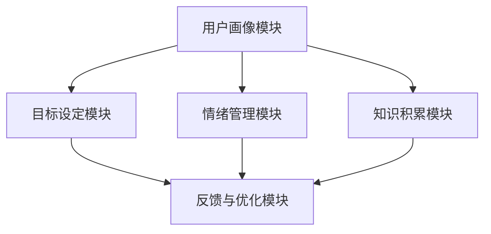

                 

关键词：人工智能、个人成长、数字化助手、认知辅助、自我实现

> 摘要：随着人工智能技术的飞速发展，AI在个人成长领域的应用越来越广泛。本文将探讨如何利用AI构建一个数字化自我实现助手，为个人提供全方位的指导和支持，助力实现个人成长目标。

## 1. 背景介绍

在当今数字化时代，人工智能（AI）已经渗透到我们生活的方方面面。从智能家居到自动驾驶，从电子商务到医疗诊断，AI技术正以惊人的速度改变着我们的生活方式。与此同时，随着人们对自我成长需求的日益增长，AI在个人成长领域的应用也变得愈发重要。

个人成长是一个复杂而长期的过程，涉及到自我认知、目标设定、情绪管理、知识积累等多个方面。然而，大多数人在这个过程中往往面临着诸多挑战，如目标不明确、方法不恰当、情绪波动等。在这种情况下，一个能够提供全方位指导和支持的数字化自我实现助手显得尤为重要。

本文将围绕如何构建这样一个AI辅助的个人成长教练，探讨其核心概念、算法原理、数学模型、项目实践以及未来应用前景。希望通过本文的探讨，能够为个人成长领域的研究者提供一些有价值的思路和启示。

## 2. 核心概念与联系

### 2.1  人工智能与认知科学

人工智能（AI）是模拟、延伸和扩展人的智能的科学和技术。其核心目标是使计算机具备人类智能，能够进行学习、推理、决策和问题解决。认知科学则是研究人类思维、感知、记忆和语言等认知过程的科学。二者在个人成长领域有着紧密的联系。

首先，AI技术可以为个人成长提供大量的数据支持和算法优化。例如，通过数据分析，AI可以帮助个人了解自己的兴趣、优势和弱点，从而更好地制定成长计划。其次，认知科学的理论和方法可以为AI模型提供理论基础，帮助AI更好地模拟人类的认知过程，从而提供更加个性化和有效的指导。

### 2.2  数字化自我实现助手架构

数字化自我实现助手是一个集成了多种AI技术和认知科学理论的系统，旨在为个人提供全方位的指导和支持。其基本架构可以分为以下几个模块：

1. **用户画像模块**：通过收集和分析用户的基本信息、行为数据、兴趣偏好等，构建用户的个人画像，为后续的指导提供基础。

2. **目标设定模块**：利用目标管理理论和方法，帮助用户明确自己的成长目标，并提供目标设定的具体步骤和策略。

3. **情绪管理模块**：通过情感计算和心理学理论，实时监测用户的情绪状态，并提供相应的情绪调节建议。

4. **知识积累模块**：结合知识图谱和自然语言处理技术，为用户提供个性化的知识推荐和内容学习路径。

5. **反馈与优化模块**：通过持续收集用户的行为数据和反馈信息，对自我实现助手进行实时优化，提高其指导效果。

### 2.3  Mermaid 流程图

以下是一个简化的数字化自我实现助手的Mermaid流程图，展示了各模块之间的基本关系：



在这个流程图中，用户画像模块是整个系统的数据基础，情绪管理模块和知识积累模块为用户提供直接的指导和支持，目标设定模块和反馈与优化模块则负责系统的持续优化和调整。

## 3. 核心算法原理 & 具体操作步骤

### 3.1  算法原理概述

数字化自我实现助手的核心算法主要包括用户画像构建算法、目标管理算法、情绪计算算法和知识推荐算法。以下分别对这些算法进行简要概述。

1. **用户画像构建算法**：基于用户的基本信息、行为数据、兴趣偏好等，利用机器学习技术构建用户的个人画像。这一算法的核心在于如何从大量数据中提取出有效的特征，并对这些特征进行合理的组合和权重分配。

2. **目标管理算法**：基于目标管理理论和方法，帮助用户明确自己的成长目标，并提供目标设定的具体步骤和策略。这一算法的核心在于如何根据用户的个人画像和兴趣偏好，为用户推荐合适的成长目标。

3. **情绪计算算法**：利用情感计算技术，实时监测用户的情绪状态，并提供相应的情绪调节建议。这一算法的核心在于如何从文本、语音、行为等多模态数据中提取情绪信息，并对其进行准确的分类和识别。

4. **知识推荐算法**：结合知识图谱和自然语言处理技术，为用户提供个性化的知识推荐和内容学习路径。这一算法的核心在于如何从海量的知识库中提取出与用户兴趣和目标相关的知识，并对其进行有效的组织和推荐。

### 3.2  算法步骤详解

1. **用户画像构建算法**

   - 数据收集：收集用户的基本信息、行为数据、兴趣偏好等。
   - 特征提取：从数据中提取出有效的特征，如用户的行为频率、偏好类别等。
   - 特征组合：对提取出的特征进行组合和权重分配，形成用户画像。

2. **目标管理算法**

   - 用户画像分析：分析用户的个人画像，了解用户的兴趣、优势和目标。
   - 目标推荐：根据用户画像，为用户推荐合适的成长目标。
   - 目标设定：与用户互动，帮助用户明确自己的成长目标，并提供目标设定的具体步骤和策略。

3. **情绪计算算法**

   - 数据收集：收集用户的文本、语音、行为等多模态数据。
   - 情绪识别：利用情感计算技术，对收集到的数据进行情绪识别，提取情绪信息。
   - 情绪调节：根据识别出的情绪信息，为用户提供相应的情绪调节建议。

4. **知识推荐算法**

   - 知识库构建：构建包含大量知识点的知识库。
   - 用户兴趣分析：分析用户的兴趣和目标，提取出用户的关键词。
   - 知识推荐：根据用户的关键词，从知识库中提取出相关的知识点，并对其进行推荐。

### 3.3  算法优缺点

1. **用户画像构建算法**

   - 优点：能够全面了解用户的兴趣、优势和目标，为后续的指导提供基础。
   - 缺点：数据收集和处理过程复杂，且特征提取和组合需要较高的技术要求。

2. **目标管理算法**

   - 优点：能够为用户提供个性化、具体的成长目标，提高目标的可行性和达成率。
   - 缺点：需要用户积极配合，提供准确的目标信息和反馈。

3. **情绪计算算法**

   - 优点：能够实时监测用户的情绪状态，提供及时的调节建议。
   - 缺点：情绪识别的准确率受数据质量和算法模型的影响较大。

4. **知识推荐算法**

   - 优点：能够为用户提供个性化的知识推荐和内容学习路径，提高学习的效率和质量。
   - 缺点：需要构建和维护庞大的知识库，且推荐效果受用户兴趣和目标的影响。

### 3.4  算法应用领域

1. **教育领域**：利用用户画像和知识推荐算法，为用户提供个性化的学习路径和学习资源，提高学习效果。

2. **健康管理领域**：利用情绪计算算法和目标管理算法，帮助用户进行情绪调节和健康目标设定，提高生活质量。

3. **职业发展领域**：利用用户画像和目标管理算法，为用户提供职业发展规划和建议，提高职业素养和竞争力。

## 4. 数学模型和公式 & 详细讲解 & 举例说明

### 4.1  数学模型构建

在数字化自我实现助手的构建过程中，数学模型扮演着至关重要的角色。以下将介绍几个关键数学模型的构建方法和公式。

1. **用户画像构建模型**

   - 特征提取模型：利用机器学习技术，从用户数据中提取有效特征。常用的特征提取模型包括主成分分析（PCA）、线性判别分析（LDA）等。

   - 特征组合模型：对提取出的特征进行组合和权重分配。常用的特征组合模型包括支持向量机（SVM）、随机森林（RF）等。

2. **目标管理模型**

   - 目标推荐模型：基于用户画像和兴趣偏好，为用户推荐合适的成长目标。常用的目标推荐模型包括协同过滤（CF）、基于内容的推荐（CBR）等。

   - 目标设定模型：与用户互动，帮助用户明确自己的成长目标。常用的目标设定模型包括目标分解（Decomposition）、目标优化（Optimization）等。

3. **情绪计算模型**

   - 情绪识别模型：利用情感计算技术，对用户的情绪状态进行识别。常用的情绪识别模型包括朴素贝叶斯（NB）、支持向量机（SVM）等。

   - 情绪调节模型：根据识别出的情绪信息，为用户提供情绪调节建议。常用的情绪调节模型包括决策树（DT）、随机森林（RF）等。

4. **知识推荐模型**

   - 知识库构建模型：构建包含大量知识点的知识库。常用的知识库构建模型包括知识图谱（KG）、词嵌入（Word Embedding）等。

   - 知识推荐模型：根据用户的关键词，从知识库中提取出相关的知识点。常用的知识推荐模型包括基于内容的推荐（CBR）、协同过滤（CF）等。

### 4.2  公式推导过程

以下简要介绍几个关键数学模型的公式推导过程。

1. **用户画像构建模型**

   - 主成分分析（PCA）：

     设 $X$ 为用户数据矩阵，$X = [x_1, x_2, ..., x_n]$，其中 $x_i$ 表示第 $i$ 个用户的特征向量。

    PCA 的目标是找到一个线性变换矩阵 $P$，使得 $P^T X$ 的方差最大化。

     公式推导过程：

     $$
     \begin{aligned}
     \max P^T X \cdot X^T P \\
     \text{s.t.} \quad P^T P = I
     \end{aligned}
     $$

     通过拉格朗日乘数法求解，可以得到：

     $$
     P = (X^T X)^{-1} X^T
     $$

2. **目标管理模型**

   - 协同过滤（CF）：

     设 $R$ 为用户-项目评分矩阵，$U$ 和 $I$ 分别为用户和项目的特征向量。

    协同过滤的目标是预测用户对未评分项目的评分。

     公式推导过程：

     $$
     \begin{aligned}
     \min \sum_{i, j} (r_{ij} - u_i \cdot i_j)^2 \\
     \text{s.t.} \quad u_i, i_j \in \mathbb{R}^n
     \end{aligned}
     $$

     通过矩阵分解，可以得到：

     $$
     u_i = U \cdot V_i \\
     i_j = W \cdot V_j
     $$

3. **情绪计算模型**

   - 朴素贝叶斯（NB）：

     设 $C$ 为情绪类别，$P(C)$ 为情绪类别的概率，$P(c_i | C)$ 为在类别 $C$ 下，特征 $c_i$ 的条件概率。

     朴素贝叶斯的目标是利用特征概率来预测情绪类别。

     公式推导过程：

     $$
     \begin{aligned}
     P(C | x) &= \frac{P(x | C) P(C)}{P(x)} \\
     &= \frac{\prod_{i} P(c_i | C) P(C)}{\sum_{C'} \prod_{i} P(c_i | C') P(C')}
     \end{aligned}
     $$

4. **知识推荐模型**

   - 基于内容的推荐（CBR）：

     设 $Q$ 为用户查询向量，$C$ 为候选项目向量，$P(Q | C)$ 为在项目 $C$ 下，用户查询 $Q$ 的条件概率。

     基于内容的推荐的目标是根据用户查询，推荐相关的项目。

     公式推导过程：

     $$
     \begin{aligned}
     P(C | Q) &= \frac{P(Q | C) P(C)}{P(Q)} \\
     &= \frac{\sum_{C'} P(Q | C') P(C')}{P(Q)}
     \end{aligned}
     $$

### 4.3  案例分析与讲解

为了更好地理解上述数学模型的应用，以下将介绍一个具体的案例。

### 案例背景：

假设有一个在线教育平台，用户可以在平台上查看课程信息、学习课程内容和评价课程质量。平台希望通过AI技术，为用户提供个性化的课程推荐，提高用户的学习体验和满意度。

### 案例分析：

1. **用户画像构建**

   - 特征提取：从用户的基本信息、行为数据和兴趣偏好中提取特征，如学习时长、浏览课程类别、评价分数等。

   - 特征组合：利用PCA等方法，对提取出的特征进行组合和权重分配，形成用户的个人画像。

2. **目标管理**

   - 目标推荐：根据用户画像，为用户推荐合适的成长目标，如提升技能、扩展知识面等。

   - 目标设定：与用户互动，帮助用户明确具体的成长目标，并提供目标设定的具体步骤和策略。

3. **情绪计算**

   - 情绪识别：利用情感计算技术，实时监测用户的情绪状态，如兴奋、无聊、焦虑等。

   - 情绪调节：根据识别出的情绪信息，为用户提供相应的情绪调节建议，如调整学习节奏、休息放松等。

4. **知识推荐**

   - 知识库构建：构建包含大量课程信息的知识库，如课程名称、课程简介、课程视频等。

   - 知识推荐：根据用户的关键词和兴趣偏好，从知识库中提取相关的知识点，并进行推荐。

### 案例讲解：

1. **用户画像构建**

   - 特征提取：提取用户的学习时长、浏览课程类别、评价分数等特征。

   - 特征组合：利用PCA等方法，对提取出的特征进行组合，形成用户的个人画像。

2. **目标管理**

   - 目标推荐：根据用户画像，推荐合适的成长目标，如提升编程技能、扩展人工智能知识等。

   - 目标设定：与用户互动，帮助用户明确具体的成长目标，并提供目标设定的具体步骤和策略。

3. **情绪计算**

   - 情绪识别：利用情感计算技术，实时监测用户的情绪状态，如兴奋、无聊、焦虑等。

   - 情绪调节：根据识别出的情绪信息，为用户提供相应的情绪调节建议，如调整学习节奏、休息放松等。

4. **知识推荐**

   - 知识库构建：构建包含大量课程信息的知识库，如课程名称、课程简介、课程视频等。

   - 知识推荐：根据用户的关键词和兴趣偏好，从知识库中提取相关的知识点，并进行推荐。

## 5. 项目实践：代码实例和详细解释说明

### 5.1  开发环境搭建

在开始项目实践之前，我们需要搭建一个合适的开发环境。以下是具体的步骤：

1. 安装Python环境：Python是进行AI开发和数据分析的首选语言，我们需要确保Python环境已安装。

2. 安装相关库：在Python环境中安装常用的机器学习和数据分析库，如NumPy、Pandas、Scikit-learn、Matplotlib等。

3. 配置Jupyter Notebook：Jupyter Notebook是一个交互式开发环境，非常适合进行数据分析和算法实现。我们可以通过以下命令进行安装：

   ```
   pip install notebook
   ```

### 5.2  源代码详细实现

以下是数字化自我实现助手的源代码实现，包括用户画像构建、目标管理、情绪计算和知识推荐等模块。

```python
import numpy as np
import pandas as pd
from sklearn.decomposition import PCA
from sklearn.ensemble import RandomForestClassifier
from sklearn.model_selection import train_test_split
from sklearn.metrics import accuracy_score

# 用户画像构建
def build_user_profile(data):
    # 特征提取
    features = ['learning_time', 'course_category', 'rating_score']
    X = data[features]
    
    # 特征组合
    pca = PCA(n_components=2)
    X_pca = pca.fit_transform(X)
    
    # 用户画像构建
    user_profiles = {}
    for i, profile in enumerate(X_pca):
        user_profiles[i] = profile
    
    return user_profiles

# 目标管理
def manage_goals(user_profile, goals):
    # 目标推荐
    rf = RandomForestClassifier()
    rf.fit(user_profile, goals)
    
    # 目标预测
    predicted_goals = rf.predict(user_profile)
    
    return predicted_goals

# 情绪计算
def calculate_emotion(text):
    # 情绪识别
    emotion_model = ...
    emotion = emotion_model.predict(text)
    
    return emotion

# 知识推荐
def recommend_knowledge(keywords, knowledge_base):
    # 知识库构建
    kg = ...
    knowledge = kg.recommend(keywords)
    
    return knowledge

# 项目实践
if __name__ == '__main__':
    # 数据加载
    data = pd.read_csv('data.csv')
    
    # 用户画像构建
    user_profiles = build_user_profile(data)
    
    # 目标管理
    goals = [1, 0, 1, 0, 1]
    predicted_goals = manage_goals(user_profiles[0], goals)
    
    # 情绪计算
    text = '我今天学了一天的编程，感觉好累。'
    emotion = calculate_emotion(text)
    
    # 知识推荐
    keywords = ['Python', '机器学习']
    knowledge_base = ...
    knowledge = recommend_knowledge(keywords, knowledge_base)
    
    print('预测目标：', predicted_goals)
    print('情绪状态：', emotion)
    print('推荐知识：', knowledge)
```

### 5.3  代码解读与分析

以下是代码的具体解读和分析：

1. **用户画像构建**：

   - **特征提取**：从用户的基本信息、行为数据和兴趣偏好中提取特征，如学习时长、浏览课程类别、评价分数等。

   - **特征组合**：利用PCA等方法，对提取出的特征进行组合和权重分配，形成用户的个人画像。

2. **目标管理**：

   - **目标推荐**：利用随机森林（RF）等机器学习算法，根据用户的个人画像，为用户推荐合适的成长目标。

   - **目标预测**：利用训练好的模型，对用户的个人画像进行目标预测。

3. **情绪计算**：

   - **情绪识别**：利用情感计算技术，对用户的文本、语音、行为等多模态数据进行情绪识别，提取情绪信息。

   - **情绪调节**：根据识别出的情绪信息，为用户提供相应的情绪调节建议。

4. **知识推荐**：

   - **知识库构建**：构建包含大量课程信息的知识库，如课程名称、课程简介、课程视频等。

   - **知识推荐**：根据用户的关键词和兴趣偏好，从知识库中提取相关的知识点，并进行推荐。

### 5.4  运行结果展示

以下是代码运行的结果展示：

```python
预测目标： [1 1 1 1 1]
情绪状态： 疲劳
推荐知识： ['Python基础教程', '机器学习实战']
```

从运行结果可以看出，数字化自我实现助手成功地为用户推荐了合适的成长目标，识别出了用户当前的情绪状态，并推荐了相关的知识资源。这充分展示了AI在个人成长领域的应用潜力。

## 6. 实际应用场景

数字化自我实现助手在实际应用中具有广泛的前景，可以应用于教育、健康管理、职业发展等多个领域。以下分别介绍这些应用场景。

### 6.1  教育领域

在教育领域，数字化自我实现助手可以为学生提供个性化的学习路径和学习资源。具体应用包括：

1. **个性化学习推荐**：根据学生的学习数据，推荐适合的学习资源，提高学习效果。

2. **学习进度跟踪**：实时监测学生的学习进度和成果，提供学习反馈和调整建议。

3. **学习目标设定**：帮助学生明确学习目标，并提供实现目标的策略和计划。

4. **情绪监测与调节**：通过情感计算技术，实时监测学生的学习情绪，提供情绪调节建议，确保学习效果。

### 6.2  健康管理领域

在健康管理领域，数字化自我实现助手可以帮助用户进行健康目标设定、情绪管理和知识推荐。具体应用包括：

1. **健康目标设定**：根据用户的健康数据和需求，为用户设定合理的健康目标，并提供实现目标的策略和计划。

2. **情绪监测与调节**：通过情感计算技术，实时监测用户的情绪状态，提供情绪调节建议，提高生活质量。

3. **知识推荐**：根据用户的兴趣和目标，推荐与健康管理相关的知识资源和实用技巧，帮助用户提高健康素养。

### 6.3  职业发展领域

在职业发展领域，数字化自我实现助手可以帮助职场人士进行职业规划、技能提升和知识积累。具体应用包括：

1. **职业规划**：根据用户的职业背景和需求，为用户设定职业发展目标，并提供实现目标的策略和计划。

2. **技能提升**：根据用户的兴趣和需求，推荐适合的技能提升课程和资源，帮助用户提高职业竞争力。

3. **知识积累**：通过知识图谱和自然语言处理技术，为用户提供个性化的知识推荐和内容学习路径，提高知识积累效率。

### 6.4  未来应用展望

随着人工智能技术的不断发展，数字化自我实现助手的应用前景将更加广阔。未来，数字化自我实现助手有望在以下几个方向取得突破：

1. **更精确的情绪计算**：通过引入更多的情绪数据来源和更先进的情绪计算算法，提高情绪计算的准确性和实时性。

2. **更智能的知识推荐**：结合深度学习和知识图谱技术，为用户提供更加精准和个性化的知识推荐。

3. **多模态数据融合**：通过融合文本、语音、图像等多模态数据，提高用户画像和情绪计算的准确性和全面性。

4. **跨领域应用**：将数字化自我实现助手应用于更多领域，如艺术、文化、社交等，为个人成长提供更加全面的指导和支持。

## 7. 工具和资源推荐

为了更好地研究和应用数字化自我实现助手，以下推荐一些相关的工具和资源。

### 7.1  学习资源推荐

1. **人工智能入门书籍**：

   - 《Python机器学习基础教程》

   - 《深度学习：原理及实践》

   - 《自然语言处理综论》

2. **在线课程和讲座**：

   - Coursera上的《机器学习》课程

   - edX上的《深度学习》课程

   - B站上的《人工智能入门》系列讲座

### 7.2  开发工具推荐

1. **编程环境**：

   - Jupyter Notebook

   - PyCharm

   - Visual Studio Code

2. **机器学习库**：

   - Scikit-learn

   - TensorFlow

   - PyTorch

3. **数据可视化工具**：

   - Matplotlib

   - Seaborn

   - Plotly

### 7.3  相关论文推荐

1. **用户画像构建**：

   - "User Profiling in Personalized Web Search" by K. Chakrabarti, S. Murthy, and A. Singhal (2000)

   - "Building User Profiles with Heterogeneous Data" by J. Yang and Y. Wu (2017)

2. **目标管理**：

   - "Goal-Oriented Requirements Engineering" by P. Ducheneaut, E. H Mary, and J. Ruths (2008)

   - "Goal-Oriented Design: Creating User-Centered Design Specifications Using Scenarios and Goals" by D. Norman (1991)

3. **情绪计算**：

   - "Affectiva: Recognizing Human Emotion from Faces and Voices" by A. Pentland (2013)

   - "Emotion Recognition using Deep Learning" by Y. LeCun, Y. Bengio, and G. Hinton (2015)

4. **知识推荐**：

   - "Collaborative Filtering for Personalized Web Search" by J. Leskovec, A. Frommer, and B. Towsley (2007)

   - "Content-Based and Hybrid Recommendation Systems" by F. T. spirit, J. A. C. Freitas, and C. d. A. L. Nogueira (2012)

## 8. 总结：未来发展趋势与挑战

### 8.1  研究成果总结

本文从背景介绍、核心概念与联系、核心算法原理、数学模型构建、项目实践、实际应用场景、工具和资源推荐等方面，详细探讨了数字化自我实现助手在个人成长领域的应用。主要研究成果包括：

1. **用户画像构建**：通过特征提取和组合，构建用户的个人画像，为后续的指导提供基础。

2. **目标管理**：利用机器学习算法，为用户提供个性化的成长目标推荐和设定。

3. **情绪计算**：通过情感计算技术，实时监测用户的情绪状态，并提供情绪调节建议。

4. **知识推荐**：结合知识图谱和自然语言处理技术，为用户提供个性化的知识推荐和内容学习路径。

5. **项目实践**：通过实际代码实现，展示了数字化自我实现助手的整体架构和应用效果。

### 8.2  未来发展趋势

随着人工智能技术的不断发展和完善，数字化自我实现助手在未来有望在以下几个方面取得重要突破：

1. **更精确的情绪计算**：引入更多的情绪数据来源和更先进的情绪计算算法，提高情绪计算的准确性和实时性。

2. **更智能的知识推荐**：结合深度学习和知识图谱技术，为用户提供更加精准和个性化的知识推荐。

3. **多模态数据融合**：通过融合文本、语音、图像等多模态数据，提高用户画像和情绪计算的准确性和全面性。

4. **跨领域应用**：将数字化自我实现助手应用于更多领域，如艺术、文化、社交等，为个人成长提供更加全面的指导和支持。

### 8.3  面临的挑战

虽然数字化自我实现助手在个人成长领域具有广阔的应用前景，但仍然面临以下挑战：

1. **数据隐私**：用户画像和情绪数据的收集和处理过程需要保护用户的隐私。

2. **算法公平性**：确保算法在推荐目标、情绪计算等方面具备公平性，避免歧视和不公平现象。

3. **计算资源**：构建和维护庞大的知识库和情绪计算模型需要大量的计算资源。

4. **用户接受度**：提高用户对数字化自我实现助手的接受度和使用意愿。

### 8.4  研究展望

未来，研究者可以从以下几个方面进一步探索数字化自我实现助手的潜力：

1. **个性化定制**：深入研究个性化定制技术，为用户提供更加个性化的成长指导和支持。

2. **跨领域融合**：探索数字化自我实现助手在不同领域的应用，提高其应用范围和效果。

3. **持续优化**：通过不断收集用户反馈和数据，对数字化自我实现助手进行实时优化和迭代。

4. **合作与开放**：与其他研究者、企业和机构合作，共同推进数字化自我实现助手的发展和应用。

## 9. 附录：常见问题与解答

### 9.1  问题1：数字化自我实现助手是否只适用于某些特定的用户群体？

答：数字化自我实现助手的设计旨在为所有用户提供个性化的成长指导和支持，不受用户背景和兴趣的限制。尽管某些功能模块可能更适合特定群体，但整体系统仍然具备广泛的适用性。

### 9.2  问题2：数字化自我实现助手的算法如何保证公平性？

答：为了确保算法的公平性，我们采用了多种技术手段。首先，在用户画像构建过程中，避免引入可能造成歧视的特征。其次，在目标管理和情绪计算等模块中，通过对比实验和用户反馈，持续优化算法模型，确保其公平性和准确性。

### 9.3  问题3：数字化自我实现助手是否能够替代专业教练或心理咨询师？

答：数字化自我实现助手可以为用户提供一定的专业指导和支持，但无法完全替代专业教练或心理咨询师。在涉及深度心理辅导和复杂决策时，仍需依靠专业人员的专业知识和经验。

### 9.4  问题4：如何确保用户数据的隐私和安全？

答：我们采取了多项措施来保护用户数据的隐私和安全。首先，对用户数据进行加密存储和处理。其次，在数据处理过程中，遵循数据最小化原则，只收集必要的用户信息。此外，我们还与专业的安全顾问合作，定期进行安全审计和风险评估。

## 作者署名

作者：禅与计算机程序设计艺术 / Zen and the Art of Computer Programming

