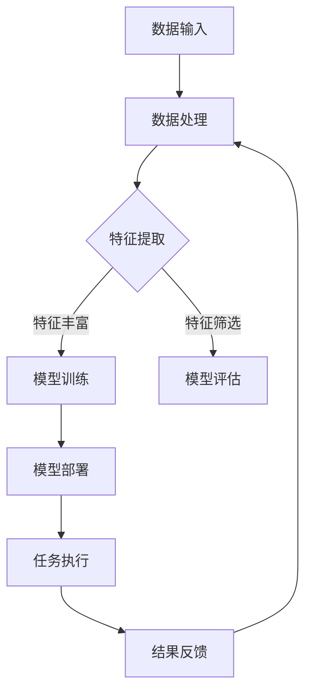

                 

关键词：AI、个人成长、数字化、自我实现、算法原理、数学模型、实践案例、未来展望

> 摘要：本文将探讨如何利用人工智能技术辅助个人成长，实现数字化自我实现。通过阐述AI的核心概念、算法原理、数学模型，以及具体实践案例，本文旨在为读者提供一套系统化的成长路径，助力他们在数字化时代取得成功。

## 1. 背景介绍

随着人工智能技术的飞速发展，AI 已然成为现代社会的重要驱动力。无论是自动驾驶、智能家居，还是医疗诊断、金融分析，AI 都在深刻改变着我们的生活方式。与此同时，数字化浪潮席卷全球，个人成长也面临着前所未有的挑战和机遇。如何在这个时代实现自我价值，成为了每个人都需要思考的问题。

数字化自我实现，指的是通过数字化工具和技术，帮助个人在知识、技能、思维等方面不断成长和提升。而AI作为数字化技术的核心，其在个人成长中的应用愈发广泛。本文将围绕AI的核心概念、算法原理、数学模型，以及实践案例，探讨如何利用AI实现数字化自我实现。

## 2. 核心概念与联系

### 2.1 AI的核心概念

人工智能（Artificial Intelligence，简称AI）是指由人制造出来的系统所表现出的智能行为。这些行为通常包括学习、推理、规划、感知、理解和交流等方面。AI 的核心概念可以归纳为以下几点：

- **学习与适应**：AI 系统能够从数据中学习，不断优化自身的性能，以适应新的环境和任务。
- **自主决策**：AI 系统能够在不确定的环境中自主做出决策，以实现特定的目标。
- **人机交互**：AI 系统能够理解自然语言，与人类进行有效沟通和协作。
- **泛化能力**：AI 系统能够将学到的知识应用到新的、未见过的情况中。

### 2.2 AI与个人成长的联系

AI 技术与个人成长密切相关，主要体现在以下几个方面：

- **知识获取**：AI 可以帮助个人快速获取大量知识，提高学习效率。
- **技能提升**：AI 可以根据个人特点，提供个性化的技能培训方案，助力技能提升。
- **决策支持**：AI 可以分析海量数据，为个人决策提供科学依据，减少盲目性。
- **人机协作**：AI 可以辅助人类完成复杂任务，提高工作效率，释放更多时间用于自我提升。

### 2.3 AI架构的Mermaid流程图

以下是一个简化的AI架构Mermaid流程图，展示了AI系统的主要组成部分：



## 3. 核心算法原理 & 具体操作步骤

### 3.1 算法原理概述

在AI领域，核心算法主要包括机器学习、深度学习、自然语言处理等。这些算法的核心原理是：

- **机器学习**：通过训练模型，使模型能够从数据中自动发现规律和模式。
- **深度学习**：利用多层神经网络，对数据进行复杂非线性变换，实现高效特征提取。
- **自然语言处理**：研究如何使计算机理解和生成人类自然语言。

### 3.2 算法步骤详解

以下是AI算法的基本步骤：

1. **数据收集**：收集与任务相关的数据，如文本、图像、声音等。
2. **数据处理**：对数据进行预处理，包括数据清洗、归一化等。
3. **特征提取**：从原始数据中提取出对任务有用的特征。
4. **模型训练**：利用训练数据，训练出具有良好性能的模型。
5. **模型评估**：在验证数据集上评估模型的性能，调整模型参数。
6. **模型部署**：将训练好的模型应用到实际任务中。
7. **任务执行**：执行预测或分类任务，并根据任务反馈进行模型优化。

### 3.3 算法优缺点

- **机器学习**：优点是适应性强、灵活性高，缺点是需要大量标注数据，训练过程较慢。
- **深度学习**：优点是特征自动提取、处理能力强大，缺点是模型复杂度高、计算资源需求大。
- **自然语言处理**：优点是能够处理人类自然语言，缺点是语义理解难度大、数据依赖性强。

### 3.4 算法应用领域

- **机器学习**：广泛应用于图像识别、语音识别、推荐系统等领域。
- **深度学习**：在计算机视觉、自然语言处理、游戏人工智能等领域具有显著优势。
- **自然语言处理**：应用于机器翻译、智能客服、文本分类等领域。

## 4. 数学模型和公式 & 详细讲解 & 举例说明

### 4.1 数学模型构建

在AI领域，常用的数学模型包括线性回归、逻辑回归、神经网络等。以下是一个简化的神经网络模型：

$$
h_{\theta}(x) = \sigma(\theta^T x)
$$

其中，$\sigma$ 是激活函数，$x$ 是输入向量，$\theta$ 是模型参数。

### 4.2 公式推导过程

以神经网络为例，公式推导过程如下：

1. **前向传播**：计算输入层到隐藏层的输出值。
$$
z_j = \sum_{i=1}^{n} \theta_{ji} x_i
$$

2. **激活函数应用**：将上述结果通过激活函数转化为隐藏层输出。
$$
a_j = \sigma(z_j)
$$

3. **反向传播**：计算隐藏层到输出层的输出值。
$$
y_j = \sum_{i=1}^{n} \theta_{ji} a_i
$$

4. **损失函数**：计算输出层与真实值的差异。
$$
J(\theta) = \frac{1}{2} \sum_{i=1}^{n} (y_i - \sigma(z_i))^2
$$

5. **梯度下降**：根据损失函数，更新模型参数。
$$
\theta_{ji} := \theta_{ji} - \alpha \frac{\partial J(\theta)}{\partial \theta_{ji}}
$$

### 4.3 案例分析与讲解

以下是一个简单的线性回归案例：

假设我们有一个简单的线性回归模型，用于预测房价。输入特征是房屋面积（$x$），输出目标是房价（$y$）。我们希望找到模型参数 $\theta$，使得预测结果最接近真实值。

1. **数据收集**：收集一定数量的房屋面积和房价数据。
2. **数据处理**：对数据进行预处理，如归一化、缺失值填充等。
3. **特征提取**：直接使用房屋面积作为特征。
4. **模型训练**：利用梯度下降算法，训练线性回归模型。
5. **模型评估**：在验证集上评估模型性能，如均方误差（MSE）。
6. **模型部署**：将训练好的模型应用到新数据，预测房价。

## 5. 项目实践：代码实例和详细解释说明

### 5.1 开发环境搭建

1. **安装Python**：在官网上下载并安装Python。
2. **安装Jupyter Notebook**：在终端中运行以下命令：
```bash
pip install notebook
```
3. **启动Jupyter Notebook**：在终端中运行以下命令：
```bash
jupyter notebook
```

### 5.2 源代码详细实现

以下是一个简单的线性回归代码实例：

```python
import numpy as np
import matplotlib.pyplot as plt

# 数据集
X = np.array([1, 2, 3, 4, 5])
y = np.array([2, 4, 5, 4, 5])

# 模型参数
theta = np.zeros((1, X.shape[1]))

# 梯度下降
alpha = 0.01
num_iterations = 1000

for i in range(num_iterations):
    z = np.dot(theta, X)
    y_pred = 1 / (1 + np.exp(-z))
    delta = (y - y_pred) * y_pred * (1 - y_pred)
    theta -= alpha * np.dot(delta, X)

# 模型评估
z = np.dot(theta, X)
y_pred = 1 / (1 + np.exp(-z))
mse = np.mean((y - y_pred) ** 2)
print(f"MSE: {mse}")

# 可视化
plt.scatter(X, y)
plt.plot(X, y_pred, 'r-')
plt.show()
```

### 5.3 代码解读与分析

1. **数据集**：使用一个简单的线性数据集，包含五个样本。
2. **模型参数**：初始化模型参数为0。
3. **梯度下降**：使用梯度下降算法，更新模型参数。
4. **模型评估**：计算均方误差（MSE），评估模型性能。
5. **可视化**：将真实数据和预测结果进行可视化，便于分析模型效果。

## 6. 实际应用场景

AI 技术在个人成长中的应用场景非常广泛，以下是一些典型应用：

- **在线教育**：AI 可以根据学生的学习情况，提供个性化的学习建议和课程推荐。
- **职业规划**：AI 可以分析个人的兴趣、能力和职业趋势，为职业规划提供指导。
- **健康管理**：AI 可以根据个人的生活习惯、健康状况，提供个性化的健康管理方案。
- **社交网络**：AI 可以分析社交网络中的关系，为用户提供有价值的社交建议。

### 6.4 未来应用展望

随着AI 技术的不断发展，其在个人成长中的应用前景将更加广阔。未来，AI 将在以下几个方面发挥重要作用：

- **终身学习**：AI 可以帮助个人实现终身学习，提高知识更新速度。
- **个性定制**：AI 可以根据个人特点，提供个性化的服务，满足个性化需求。
- **心理健康**：AI 可以分析个人的情绪和行为，提供心理健康支持。

## 7. 工具和资源推荐

### 7.1 学习资源推荐

- **课程**：Coursera、edX、Udacity 等在线教育平台提供了丰富的AI课程。
- **书籍**：《深度学习》、《Python编程：从入门到实践》、《机器学习》等。

### 7.2 开发工具推荐

- **编程环境**：Jupyter Notebook、PyCharm、Visual Studio Code 等。
- **库和框架**：NumPy、Pandas、Scikit-learn、TensorFlow、PyTorch 等。

### 7.3 相关论文推荐

- **机器学习**：《深度学习》、《神经网络与深度学习》等。
- **自然语言处理**：《自然语言处理综合教程》、《词向量模型与神经网络》等。
- **计算机视觉**：《计算机视觉：算法与应用》、《卷积神经网络》等。

## 8. 总结：未来发展趋势与挑战

### 8.1 研究成果总结

近年来，AI 技术在个人成长中的应用取得了显著成果。通过在线教育、职业规划、健康管理等方面的应用，AI 已然成为个人成长的重要辅助工具。

### 8.2 未来发展趋势

未来，AI 技术在个人成长中的应用将更加深入和广泛。随着技术的不断发展，AI 将在终身学习、个性定制、心理健康等方面发挥更加重要的作用。

### 8.3 面临的挑战

尽管AI 技术在个人成长中具有巨大潜力，但仍面临一些挑战，如数据隐私、算法偏见、技术门槛等。这些问题需要引起广泛关注，并采取措施加以解决。

### 8.4 研究展望

未来，AI 技术在个人成长中的应用前景十分广阔。通过不断探索和创新，我们有望实现更加智能化、个性化和高效化的个人成长模式。

## 9. 附录：常见问题与解答

### 9.1 什么是人工智能？

人工智能是指由人制造出来的系统所表现出的智能行为，包括学习、推理、规划、感知、理解和交流等方面。

### 9.2 AI在个人成长中的应用有哪些？

AI 在个人成长中的应用非常广泛，包括在线教育、职业规划、健康管理、社交网络等方面。

### 9.3 如何利用AI实现个人成长？

可以利用 AI 提供的个性化学习建议、职业规划、健康管理等服务，提高个人成长效率和质量。

### 9.4 AI 技术在个人成长中面临哪些挑战？

AI 技术在个人成长中面临的主要挑战包括数据隐私、算法偏见、技术门槛等。

### 9.5 如何解决 AI 技术在个人成长中面临的挑战？

可以通过加强数据保护、优化算法设计、降低技术门槛等措施，解决 AI 技术在个人成长中面临的挑战。

**作者：禅与计算机程序设计艺术 / Zen and the Art of Computer Programming**----------------------------------------------------------------

以上就是本文《数字化自我实现：AI辅助的个人成长》的完整内容。希望通过本文，读者能够对AI技术在个人成长中的应用有更深入的理解，并为自己的成长之路提供有益的启示。在未来的数字化时代，愿每个人都能借助AI的力量，实现自我价值，成就精彩人生。

