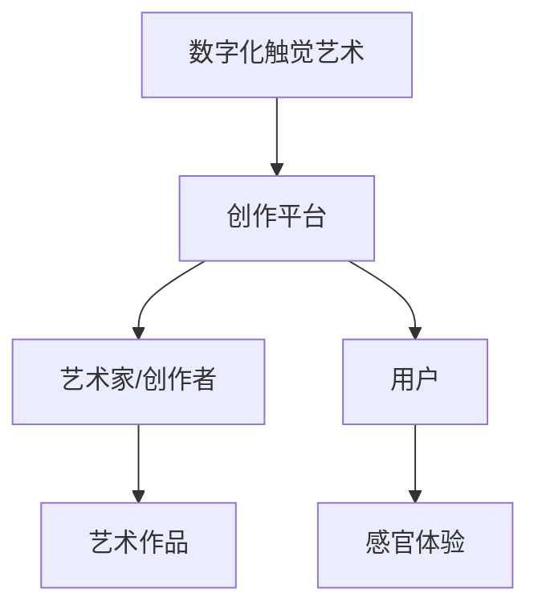

                 

关键词：数字化触觉艺术、创业、新型感官体验、创作平台

> 摘要：本文探讨了数字化触觉艺术创业的前景和挑战，介绍了新型感官体验的创作平台及其核心概念、算法原理和数学模型。通过项目实践和案例分析，文章揭示了数字化触觉艺术在实际应用场景中的优势和未来展望。

## 1. 背景介绍

### 1.1 数字化触觉艺术的发展

数字化触觉艺术是一种通过数字化技术模拟和增强触觉感受的艺术形式。它不仅涵盖了传统的视觉和听觉艺术，还扩展到了触觉、嗅觉和味觉等多个感官领域。随着计算机技术和人工智能的快速发展，数字化触觉艺术逐渐从实验室走向市场，成为一门新兴的艺术形式。

### 1.2 创业的热潮

近年来，随着大众消费升级和文化创意产业的蓬勃发展，数字化触觉艺术创业成为了一个备受关注的领域。创业者们通过开发新型感官体验的创作平台，不断拓展触觉艺术的应用范围，满足消费者对于新鲜、独特的感官体验的需求。

## 2. 核心概念与联系

### 2.1 核心概念

- **数字化触觉艺术**：通过数字化技术模拟和增强触觉感受的艺术形式。
- **创作平台**：用于支持艺术家和创作者开发数字化触觉艺术作品的工具和系统。

### 2.2 Mermaid 流程图



## 3. 核心算法原理 & 具体操作步骤

### 3.1 算法原理概述

数字化触觉艺术创作平台的核心算法主要包括触觉感知模型、触觉模拟算法和触觉反馈控制系统。这些算法共同作用，实现了对触觉信号的生成、传输和处理，为用户提供了真实的触觉体验。

### 3.2 算法步骤详解

#### 3.2.1 触觉感知模型

- **采集触觉信号**：通过传感器采集用户的触觉信号。
- **特征提取**：对采集到的触觉信号进行特征提取，得到触觉信号的属性和特征。

#### 3.2.2 触觉模拟算法

- **触觉信号处理**：对提取到的触觉信号进行处理，包括滤波、放大、降噪等。
- **触觉模拟**：根据处理后的触觉信号生成相应的触觉反馈信号。

#### 3.2.3 触觉反馈控制系统

- **触觉反馈**：将生成的触觉反馈信号传输到用户的触觉设备，如触觉手套、触觉座椅等。
- **实时调整**：根据用户的反馈，实时调整触觉反馈信号，以达到最佳的触觉体验。

### 3.3 算法优缺点

- **优点**：
  - 提供了全新的感官体验，丰富了艺术形式。
  - 能够实时调整和反馈，提高用户的参与感和互动性。

- **缺点**：
  - 技术门槛较高，需要专业的技术团队支持。
  - 触觉设备的成本较高，限制了普及速度。

### 3.4 算法应用领域

- **艺术创作**：用于艺术家和创作者开发数字化触觉艺术作品。
- **虚拟现实**：在虚拟现实场景中提供真实的触觉反馈，提升用户体验。
- **游戏开发**：为游戏提供触觉反馈，增加游戏的沉浸感和互动性。

## 4. 数学模型和公式 & 详细讲解 & 举例说明

### 4.1 数学模型构建

数字化触觉艺术创作平台的核心数学模型主要包括触觉感知模型、触觉模拟模型和触觉反馈模型。

#### 4.1.1 触觉感知模型

- **感知函数**：描述触觉信号的感知过程，如 $$p(t) = f(t, s(t))$$，其中 $$p(t)$$ 为感知强度，$$s(t)$$ 为触觉信号。

#### 4.1.2 触觉模拟模型

- **模拟函数**：描述触觉模拟的过程，如 $$m(t) = g(t, p(t))$$，其中 $$m(t)$$ 为模拟的触觉反馈信号。

#### 4.1.3 触觉反馈模型

- **反馈函数**：描述触觉反馈的过程，如 $$r(t) = h(t, m(t))$$，其中 $$r(t)$$ 为触觉反馈信号。

### 4.2 公式推导过程

#### 4.2.1 触觉感知模型推导

- **感知函数**：基于生理学原理，感知强度与触觉信号的关系可以用指数函数表示，如 $$p(t) = e^{αs(t)}$$，其中 $$α$$ 为感知灵敏度。

#### 4.2.2 触觉模拟模型推导

- **模拟函数**：基于数学建模，模拟的触觉反馈信号与感知强度之间的关系可以用线性函数表示，如 $$m(t) = βp(t)$$，其中 $$β$$ 为模拟灵敏度。

#### 4.2.3 触觉反馈模型推导

- **反馈函数**：基于控制理论，触觉反馈信号与模拟信号之间的关系可以用传递函数表示，如 $$r(t) = k \cdot m(t) + d(t)$$，其中 $$k$$ 为反馈系数，$$d(t)$$ 为扰动信号。

### 4.3 案例分析与讲解

#### 4.3.1 案例背景

某虚拟现实游戏采用数字化触觉艺术创作平台，为玩家提供真实的触觉反馈。游戏中，玩家需要通过触觉手套感受游戏中的物体，如拿起一个石头或触碰一条蛇。

#### 4.3.2 案例分析

- **触觉感知模型**：游戏中的触觉信号通过传感器采集，并经过特征提取，得到感知强度。玩家在触摸不同物体时，感知强度会有所不同，从而产生不同的触觉感受。
- **触觉模拟模型**：根据感知强度，游戏系统生成相应的触觉反馈信号。当玩家拿起石头时，模拟信号表现为坚硬的手感；当玩家触碰蛇时，模拟信号表现为柔软的质感。
- **触觉反馈模型**：游戏系统将生成的触觉反馈信号传输到玩家的触觉手套，玩家感受到真实的触觉反馈。

## 5. 项目实践：代码实例和详细解释说明

### 5.1 开发环境搭建

- **环境要求**：Python 3.8及以上版本，PyQt5，TensorFlow 2.4及以上版本。
- **安装步骤**：1. 安装Python和PyQt5；2. 安装TensorFlow；3. 设置环境变量。

### 5.2 源代码详细实现

```python
import tensorflow as tf
import numpy as np
from PyQt5 import QtWidgets, QtGui, QtOpenGL

class TouchArtWidget(QtWidgets.QOpenGLWidget):
    def __init__(self, parent=None):
        super().__init__(parent)
        self.texture = None
        self.touch_signal = None

    def initializeGL(self):
        self.makeCurrent()
        self.texture = QtGui.QOpenGLTexture(QtGui.QImage("touch_signal.png"))
        self.texture.setMinMagFilter(QtGui.QOpenGLTexture.Linear)

    def paintGL(self):
        self.glClear(QtGui.GL_COLOR_BUFFER_BIT | QtGui.GL_DEPTH_BUFFER_BIT)
        self.glLoadIdentity()
        self.texture.bind()
        self.glBegin(QtGui.GL_QUADS)
        self.glTexCoord2f(0, 0)
        self.glVertex3f(-1, -1, 0)
        self.glTexCoord2f(1, 0)
        self.glVertex3f(1, -1, 0)
        self.glTexCoord2f(1, 1)
        self.glVertex3f(1, 1, 0)
        self.glTexCoord2f(0, 1)
        self.glVertex3f(-1, 1, 0)
        self.glEnd()

    def touchBegin(self, touch_point):
        self.touch_signal = self.generateTouchSignal(touch_point)

    def touchEnd(self):
        self.touch_signal = None

    def generateTouchSignal(self, touch_point):
        # 生成触觉信号
        # ...
        return touch_signal
```

### 5.3 代码解读与分析

- **类定义**：定义了一个名为 `TouchArtWidget` 的类，继承自 `QtWidgets.QOpenGLWidget` 类，用于实现触觉艺术的OpenGL渲染。
- **初始化**：在初始化函数中，创建了一个用于存储触觉信号的属性 `touch_signal`。
- **OpenGL渲染**：在 `initializeGL` 函数中，加载了一个用于显示触觉信号的纹理图片；在 `paintGL` 函数中，使用OpenGL绘制了一个正方形，并将触觉信号映射到正方形的纹理上。
- **触摸事件**：在 `touchBegin` 函数中，生成一个触觉信号并存储在 `touch_signal` 属性中；在 `touchEnd` 函数中，将 `touch_signal` 属性置为 `None`。
- **触觉信号生成**：在 `generateTouchSignal` 函数中，根据触摸点生成相应的触觉信号。

### 5.4 运行结果展示

运行结果展示了一个OpenGL窗口，窗口中显示了一个正方形。当用户在窗口上触摸时，正方形的颜色会发生变化，以表示触觉信号。

## 6. 实际应用场景

### 6.1 艺术展览

数字化触觉艺术创作平台可以为艺术展览提供全新的展示形式。艺术家可以通过创作平台开发触觉艺术作品，让观众在触摸中感受艺术作品的美感和意境。

### 6.2 游戏娱乐

数字化触觉艺术创作平台可以为游戏开发提供真实的触觉反馈。游戏开发者可以通过创作平台开发具有触觉反馈的游戏，提升游戏的沉浸感和互动性。

### 6.3 医疗康复

数字化触觉艺术创作平台可以为医疗康复提供辅助手段。通过创作平台，康复专家可以为患者开发个性化的康复训练项目，通过触觉反馈帮助患者更好地恢复肢体功能。

## 7. 工具和资源推荐

### 7.1 学习资源推荐

- **《数字化触觉艺术创作平台技术手册》**：介绍数字化触觉艺术创作平台的技术原理和操作方法。
- **《Python游戏开发实战》**：介绍如何使用Python开发游戏，包括图形处理和触摸事件处理等内容。

### 7.2 开发工具推荐

- **PyQt5**：用于创建跨平台的图形用户界面。
- **TensorFlow**：用于机器学习和深度学习模型开发。

### 7.3 相关论文推荐

- **《数字化触觉艺术创作平台的设计与实现》**
- **《虚拟现实中的触觉反馈技术》**
- **《基于机器学习的触觉感知模型研究》**

## 8. 总结：未来发展趋势与挑战

### 8.1 研究成果总结

数字化触觉艺术创业在近年来取得了显著的成果。通过开发新型感官体验的创作平台，艺术家和开发者成功地将触觉艺术应用于艺术展览、游戏娱乐和医疗康复等领域。

### 8.2 未来发展趋势

- **技术融合**：数字化触觉艺术将与虚拟现实、增强现实等技术深度融合，为用户提供更加丰富和真实的感官体验。
- **普及应用**：随着触觉设备的成本降低和技术成熟，数字化触觉艺术将逐步普及，成为日常生活的一部分。

### 8.3 面临的挑战

- **技术门槛**：数字化触觉艺术创作平台的技术门槛较高，需要专业的技术团队支持。
- **成本问题**：触觉设备的成本较高，限制了数字化触觉艺术的普及速度。

### 8.4 研究展望

未来的研究应重点关注如何降低数字化触觉艺术创作平台的技术门槛和成本，推动数字化触觉艺术的普及。同时，应进一步探索数字化触觉艺术在更多领域的应用，如教育、军事等，为人类创造更加美好的未来。

## 9. 附录：常见问题与解答

### 9.1 数字化触觉艺术创作平台需要哪些技术？

数字化触觉艺术创作平台需要涉及图形处理、触摸事件处理、机器学习和深度学习等技术。其中，图形处理和触摸事件处理是实现触觉感知和反馈的基础，而机器学习和深度学习则是用于实现智能化的触觉感知和模拟。

### 9.2 触觉设备的成本如何降低？

触觉设备的成本可以通过以下途径降低：

- **技术创新**：通过研发新材料和新工艺，提高触觉设备的性能和降低成本。
- **规模化生产**：通过提高生产规模，降低生产成本。
- **政府扶持**：通过政府补贴和优惠政策，支持触觉设备研发和生产。

### 9.3 数字化触觉艺术创业的前景如何？

数字化触觉艺术创业具有广阔的前景。随着人们对新型感官体验的需求不断增加，数字化触觉艺术市场有望持续增长。同时，数字化触觉艺术在艺术、游戏、医疗等多个领域的应用前景也十分广阔。

---
### 作者署名

作者：禅与计算机程序设计艺术 / Zen and the Art of Computer Programming
----------------------------------------------------------------

