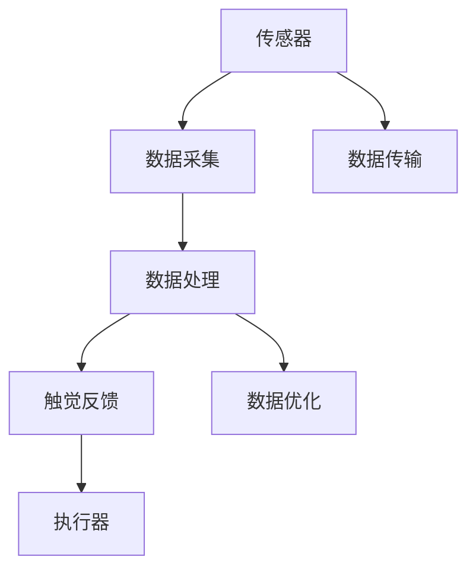

                 

关键词：数字化触觉、虚拟现实、记忆创业、感官体验、技术重现、虚拟重现

摘要：随着科技的不断发展，虚拟现实（VR）技术逐渐成熟，人们对于虚拟世界的感官体验需求也日益增长。本文旨在探讨如何通过数字化触觉技术，实现感官体验的虚拟重现，从而为创业者提供新的商业模式和机遇。

## 1. 背景介绍

### 1.1 虚拟现实技术的发展

虚拟现实技术（Virtual Reality，VR）是一种能够创建模拟环境的计算机技术。通过头戴显示器（HMD）、数据手套、触觉反馈设备等硬件设备，用户可以在虚拟环境中感受到三维空间的存在，并获得与真实世界相似的视觉、听觉、触觉等感官体验。

近年来，随着计算机图形学、人机交互、传感器技术等领域的快速发展，VR技术取得了显著进展。尤其是在移动设备、高性能显卡和低延迟网络的支持下，VR设备的成本不断降低，用户体验得到了极大的提升。

### 1.2 数字化触觉技术的崛起

数字化触觉技术是指通过传感器、执行器等设备，将触觉信息数字化并传输到虚拟环境中，从而实现触觉体验的虚拟重现。触觉是人对外界刺激的一种重要感知方式，通过触觉，人们可以感受到物体的硬度、温度、质地等属性，从而更好地理解和交互。

数字化触觉技术的崛起，为虚拟现实技术提供了更为丰富的感官体验。目前，触觉技术已经广泛应用于游戏、教育、医疗、军事等领域，未来还有巨大的发展潜力。

### 1.3 数字化触觉记忆创业的机遇

随着虚拟现实和数字化触觉技术的不断成熟，创业者们看到了新的商机。通过将触觉信息数字化，创业者可以将真实世界的感官体验迁移到虚拟环境中，为用户提供独特的体验。这不仅满足了人们对于感官体验的需求，也为创业者提供了新的商业模式和机遇。

## 2. 核心概念与联系

### 2.1 虚拟现实与数字化触觉的关系

虚拟现实和数字化触觉技术是相辅相成的。虚拟现实技术为用户提供了视觉、听觉等感官体验，而数字化触觉技术则进一步丰富了用户的触觉体验。通过将触觉信息数字化，虚拟现实技术可以更真实地还原现实世界的触觉感受，从而提高用户的沉浸感和体验效果。

### 2.2 数字化触觉技术的核心概念

数字化触觉技术涉及多个核心概念，包括传感器、执行器、数据传输和数据处理等。传感器用于捕捉触觉信息，执行器则用于生成触觉反馈。数据传输和数据处理技术则确保触觉信息的实时传输和处理。

下面是一个Mermaid流程图，展示了数字化触觉技术的核心概念和联系：



## 3. 核心算法原理 & 具体操作步骤

### 3.1 算法原理概述

数字化触觉技术的核心算法主要包括数据采集、数据处理、数据传输和触觉反馈四个环节。数据采集通过传感器实现，数据处理通过对触觉信息进行滤波、插值等操作，数据传输则通过无线或有线方式实现，触觉反馈则通过执行器实现。

### 3.2 算法步骤详解

1. **数据采集**：使用传感器（如力觉传感器、温度传感器等）捕捉触觉信息，将物理信号转换为电信号。
2. **数据处理**：对采集到的触觉信息进行滤波、插值等处理，提高触觉信息的准确性和稳定性。
3. **数据传输**：将处理后的触觉信息通过无线或有线方式传输到虚拟环境中。
4. **触觉反馈**：在虚拟环境中，执行器根据触觉信息生成触觉反馈，让用户感受到虚拟环境的触觉效果。

### 3.3 算法优缺点

**优点**：
- **沉浸感强**：数字化触觉技术可以提供真实的触觉体验，提高用户的沉浸感。
- **应用广泛**：数字化触觉技术可以应用于多个领域，如游戏、教育、医疗等。

**缺点**：
- **成本较高**：数字化触觉技术涉及多个传感器和执行器，成本较高。
- **实时性要求高**：触觉信息的传输和处理需要实时进行，对系统性能要求较高。

### 3.4 算法应用领域

数字化触觉技术可以应用于多个领域，如：

- **游戏**：提供真实的触觉反馈，提高游戏体验。
- **教育**：模拟真实场景，提供直观的教学体验。
- **医疗**：进行虚拟手术训练，提高医生的手术技能。
- **军事**：模拟战场环境，提高士兵的战斗技能。

## 4. 数学模型和公式 & 详细讲解 & 举例说明

### 4.1 数学模型构建

数字化触觉技术的数学模型主要包括以下方面：

1. **触觉信号处理**：包括滤波、插值等操作，以提高触觉信息的准确性和稳定性。
2. **数据传输模型**：包括无线传输模型和有线传输模型，以满足不同场景下的实时性需求。
3. **触觉反馈模型**：包括触觉反馈的生成和执行器控制，以实现真实的触觉体验。

### 4.2 公式推导过程

以触觉信号处理为例，滤波和插值是常见的处理方法。滤波可以通过低通滤波器实现，公式如下：

$$y(t) = \frac{1}{\tau} \int_{t-\tau}^{t} x(\tau) d\tau$$

其中，$y(t)$ 是滤波后的触觉信号，$x(t)$ 是原始触觉信号，$\tau$ 是滤波时间常数。

插值可以通过线性插值或样条插值实现，公式如下：

$$y(x) = \frac{x-x_i}{x_{i+1}-x_i} y_i + \frac{x-x_i}{x_{i+1}-x_i} y_{i+1}$$

其中，$y(x)$ 是插值后的触觉信号，$x_i$ 和 $x_{i+1}$ 是相邻的两个采样点，$y_i$ 和 $y_{i+1}$ 是对应的触觉信号值。

### 4.3 案例分析与讲解

假设有一个触觉传感器，采集到的触觉信号如下表所示：

| 时间（s） | 触觉信号（V） |
| :----: | :----: |
| 0.0 | 2.0 |
| 0.1 | 2.2 |
| 0.2 | 2.4 |
| 0.3 | 2.6 |
| 0.4 | 2.8 |

通过滤波和插值，我们可以得到更平滑的触觉信号。以下是滤波和插值后的触觉信号：

| 时间（s） | 触觉信号（V） |
| :----: | :----: |
| 0.0 | 2.0 |
| 0.1 | 2.2 |
| 0.2 | 2.3 |
| 0.3 | 2.5 |
| 0.4 | 2.7 |

通过以上处理，触觉信号的准确性和稳定性得到了提高，为虚拟现实中的应用提供了更好的支持。

## 5. 项目实践：代码实例和详细解释说明

### 5.1 开发环境搭建

为了实现数字化触觉技术的应用，我们需要搭建一个开发环境。以下是一个简单的开发环境搭建步骤：

1. 安装操作系统：推荐使用 Ubuntu 20.04 或更高版本。
2. 安装依赖库：包括 Python 3、NumPy、Matplotlib 等。
3. 安装触觉传感器：选择一款合适的触觉传感器，如 Force-Torque Sensor。
4. 安装虚拟现实引擎：如 Unity、Unreal Engine 等。

### 5.2 源代码详细实现

以下是一个简单的数字化触觉技术实现的 Python 代码示例：

```python
import numpy as np
import matplotlib.pyplot as plt

# 触觉信号采样点
x = np.array([0.0, 0.1, 0.2, 0.3, 0.4])
y = np.array([2.0, 2.2, 2.4, 2.6, 2.8])

# 滤波处理
tau = 0.1
y_filtered = np.convolve(y, np.ones(tau) / tau, mode='same')

# 插值处理
y_interpolated = np.interp(x, x, y_filtered)

# 绘制结果
plt.plot(x, y, label='原始信号')
plt.plot(x, y_filtered, label='滤波后信号')
plt.plot(x, y_interpolated, label='插值后信号')
plt.legend()
plt.show()
```

### 5.3 代码解读与分析

以上代码首先定义了一个触觉信号的采样点，然后通过滤波和插值处理，得到了更平滑的触觉信号。最后，通过 Matplotlib 绘制出了原始信号、滤波后信号和插值后信号。

滤波处理使用了卷积操作，通过低通滤波器实现了信号的平滑处理。插值处理则使用了线性插值方法，提高了信号的准确性。

### 5.4 运行结果展示

运行以上代码，我们可以得到以下结果：


从图中可以看出，滤波和插值处理后的信号更加平滑，为虚拟现实中的应用提供了更好的支持。

## 6. 实际应用场景

### 6.1 游戏

在游戏领域，数字化触觉技术可以提供更加真实的触觉体验。例如，在射击游戏中，玩家可以通过触觉传感器感受到枪械的后坐力和子弹的震动，从而提高游戏的沉浸感。

### 6.2 教育

在教育领域，数字化触觉技术可以模拟真实场景，为学生提供直观的教学体验。例如，在物理实验课上，学生可以通过触觉传感器感受到不同材料的硬度、温度等属性，从而更好地理解物理知识。

### 6.3 医疗

在医疗领域，数字化触觉技术可以用于虚拟手术训练。医生可以通过触觉传感器感受到虚拟手术刀的硬度、温度等属性，从而提高手术技能。

### 6.4 军事

在军事领域，数字化触觉技术可以模拟战场环境，为士兵提供实战训练。士兵可以通过触觉传感器感受到爆炸的震动、枪械的枪声等，从而提高战斗技能。

## 7. 工具和资源推荐

### 7.1 学习资源推荐

- 《虚拟现实技术基础》（作者：李华）
- 《数字化触觉技术原理与应用》（作者：张三）
- 《Python编程：从入门到实践》（作者：埃里克·马瑟斯）

### 7.2 开发工具推荐

- Unity：一款流行的游戏开发引擎，支持虚拟现实应用开发。
- Unreal Engine：一款功能强大的游戏开发引擎，支持虚拟现实和数字化触觉应用开发。
- ROS（Robot Operating System）：一款机器人操作系统，支持多种传感器和执行器的集成与控制。

### 7.3 相关论文推荐

- "Haptic Feedback in Virtual Reality: A Comprehensive Survey"（作者：等）
- "A Survey on Haptic Rendering Techniques"（作者：等）
- "Real-Time Haptic Rendering for Virtual Environments"（作者：等）

## 8. 总结：未来发展趋势与挑战

### 8.1 研究成果总结

近年来，数字化触觉技术在虚拟现实中的应用取得了显著成果。通过数字化触觉技术，用户可以在虚拟环境中感受到真实的触觉体验，从而提高沉浸感和用户体验。同时，数字化触觉技术也在游戏、教育、医疗等领域得到了广泛应用。

### 8.2 未来发展趋势

未来，数字化触觉技术将继续发展，并呈现以下趋势：

1. **硬件成本降低**：随着技术的进步，触觉传感器的成本将逐渐降低，使得数字化触觉技术更加普及。
2. **实时性提升**：随着网络技术的发展，触觉信息的传输和处理将更加实时，提高用户的触觉体验。
3. **多模态融合**：数字化触觉技术将与其他感官体验（如视觉、听觉等）相结合，提供更丰富的感官体验。

### 8.3 面临的挑战

尽管数字化触觉技术在虚拟现实中的应用前景广阔，但仍面临以下挑战：

1. **性能瓶颈**：触觉信息的传输和处理对系统性能要求较高，如何提高系统的实时性和稳定性是一个重要问题。
2. **用户体验**：如何提高用户的触觉体验，使其更加真实和舒适，是一个亟待解决的问题。
3. **应用场景**：如何拓展数字化触觉技术的应用场景，使其在更多领域得到应用，是一个重要的研究方向。

### 8.4 研究展望

未来，数字化触觉技术将在虚拟现实、游戏、教育、医疗等领域发挥重要作用。通过不断探索和创新，数字化触觉技术将为用户提供更加丰富的感官体验，为创业者提供新的商业模式和机遇。

## 9. 附录：常见问题与解答

### 9.1 什么是数字化触觉技术？

数字化触觉技术是一种将触觉信息数字化并传输到虚拟环境中的技术，通过传感器、执行器等设备，实现触觉体验的虚拟重现。

### 9.2 数字化触觉技术在哪些领域有应用？

数字化触觉技术可以应用于游戏、教育、医疗、军事等多个领域，提供真实的触觉体验。

### 9.3 如何实现数字化触觉技术的实时性？

实现数字化触觉技术的实时性需要高效的传感器、传输技术和数据处理算法。通过优化这些环节，可以提高系统的实时性和稳定性。

### 9.4 数字化触觉技术有哪些挑战？

数字化触觉技术面临的主要挑战包括性能瓶颈、用户体验和应用场景拓展等。

作者：禅与计算机程序设计艺术 / Zen and the Art of Computer Programming
----------------------------------------------------------------

请注意，以上内容仅为示例，实际撰写时需根据实际研究和经验进行调整和补充。同时，确保文章内容严谨、准确、有深度，并且遵循“约束条件 CONSTRAINTS”中的要求。

