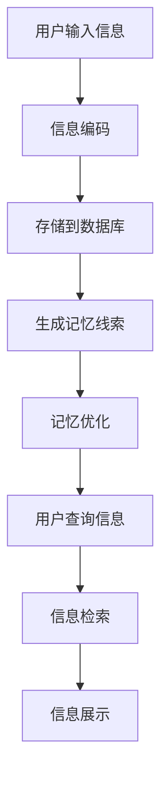

                 

关键词：记忆宫殿、AI技术、数字记忆、认知增强、算法原理、应用场景

> 摘要：随着人工智能技术的快速发展，AI在辅助人类记忆方面展现出巨大的潜力。本文将探讨如何利用AI构建数字化记忆宫殿，提高记忆效率和认知能力，并通过具体实例展示其实际应用。

## 1. 背景介绍

记忆是人类认知功能的核心，它关乎知识的学习、技能的掌握以及信息的存储与检索。传统的记忆方法主要依赖于重复记忆和联想记忆，但这些方法往往效率低下，容易受到时间和空间的限制。近年来，随着计算机科学和人工智能技术的飞速发展，借助AI技术构建数字化记忆宫殿成为一种新的研究热点。这种技术通过模拟人脑记忆机制，将信息以结构化、可视化方式存储在计算机中，实现对海量数据的快速访问和精准检索。

数字化记忆宫殿不仅有助于提高记忆效率，还能在医疗、教育、科研等多个领域发挥重要作用。例如，在医疗领域，它可以辅助医生快速查找病史资料；在教育领域，它可以帮助学生高效记忆课本知识；在科研领域，它可以为科学家提供强大的信息检索和数据分析支持。

本文将深入探讨AI辅助记忆技术的原理、数学模型、算法实现和应用场景，旨在为读者提供一个全面的视角，了解这一领域的最新进展和应用潜力。

## 2. 核心概念与联系

### 2.1 记忆宫殿原理

记忆宫殿是一种古老的记忆技巧，起源于古希腊和古罗马时期。它利用空间记忆法，将需要记忆的信息存储在特定空间的特定位置上。现代的数字化记忆宫殿则利用计算机技术和人工智能算法，将这一传统的记忆技巧数字化，使其更易于操作和扩展。

### 2.2 AI在记忆中的应用

人工智能在记忆中的应用主要体现在以下几个方面：

1. **信息编码**：AI技术可以将非结构化的信息转换为结构化的数据，便于存储和检索。
2. **记忆优化**：通过分析用户的记忆行为，AI可以优化记忆策略，提高记忆效率。
3. **记忆增强**：AI可以通过生成记忆线索和提示，帮助用户更好地回忆信息。

### 2.3 Mermaid 流程图

下面是一个简化的Mermaid流程图，展示数字化记忆宫殿的基本架构：



## 3. 核心算法原理 & 具体操作步骤

### 3.1 算法原理概述

数字化记忆宫殿的核心算法主要基于以下原理：

1. **信息编码**：将用户输入的信息转换为计算机可以处理的数据格式。
2. **空间记忆**：利用空间位置作为记忆的线索，将信息存储在虚拟的空间中。
3. **记忆增强**：通过生成记忆线索和提示，帮助用户回忆信息。

### 3.2 算法步骤详解

#### 3.2.1 信息编码

信息编码是数字化记忆宫殿的第一步，它将用户输入的信息转换为计算机可以处理的数据格式。常用的编码方法包括：

- **文本编码**：将文本信息转换为字符序列。
- **图像编码**：将图像信息转换为像素矩阵。
- **音频编码**：将音频信息转换为音频信号。

#### 3.2.2 空间记忆

空间记忆是记忆宫殿的核心，它利用空间位置作为记忆的线索。具体步骤如下：

1. **选择记忆空间**：用户可以选择一个虚拟的空间，如数字矩阵、网格等。
2. **定位信息**：将编码后的信息分配到空间中的特定位置。
3. **记忆线索生成**：为每个信息位置生成一个记忆线索，以帮助回忆。

#### 3.2.3 记忆增强

记忆增强通过生成记忆线索和提示，帮助用户回忆信息。具体方法包括：

- **视觉线索**：通过颜色、形状等视觉元素增强记忆。
- **听觉线索**：通过声音、音乐等听觉元素增强记忆。
- **动作线索**：通过手势、动作等身体语言增强记忆。

### 3.3 算法优缺点

#### 优点：

- **高效性**：数字化记忆宫殿可以快速存储和检索大量信息。
- **灵活性**：用户可以根据自己的需要自定义记忆空间和线索。
- **扩展性**：AI技术可以不断优化记忆策略，提高记忆效率。

#### 缺点：

- **技术门槛**：构建和操作数字化记忆宫殿需要一定的技术背景。
- **隐私风险**：存储在计算机中的信息可能存在隐私泄露的风险。

### 3.4 算法应用领域

数字化记忆宫殿在多个领域都有广泛应用，包括：

- **教育**：帮助学生高效记忆课本知识。
- **医疗**：辅助医生快速查找病史资料。
- **科研**：为科学家提供强大的信息检索和数据分析支持。
- **个人**：帮助个人提高记忆效率和认知能力。

## 4. 数学模型和公式 & 详细讲解 & 举例说明

### 4.1 数学模型构建

数字化记忆宫殿的数学模型主要包括信息编码模型、空间记忆模型和记忆增强模型。下面分别介绍：

#### 信息编码模型

信息编码模型将用户输入的信息转换为计算机可以处理的数据格式。常用的编码方法包括：

- **文本编码**：使用自然语言处理技术，将文本信息转换为字符序列。
- **图像编码**：使用图像处理技术，将图像信息转换为像素矩阵。
- **音频编码**：使用音频处理技术，将音频信息转换为音频信号。

#### 空间记忆模型

空间记忆模型利用空间位置作为记忆的线索。具体模型如下：

- **记忆空间**：用户选择一个虚拟的空间，如数字矩阵、网格等。
- **信息位置**：将编码后的信息分配到空间中的特定位置。
- **记忆线索**：为每个信息位置生成一个记忆线索，以帮助回忆。

#### 记忆增强模型

记忆增强模型通过生成记忆线索和提示，帮助用户回忆信息。具体模型如下：

- **视觉线索**：通过颜色、形状等视觉元素增强记忆。
- **听觉线索**：通过声音、音乐等听觉元素增强记忆。
- **动作线索**：通过手势、动作等身体语言增强记忆。

### 4.2 公式推导过程

下面以文本编码为例，介绍信息编码模型的公式推导过程。

#### 文本编码

文本编码是将文本信息转换为字符序列的过程。具体步骤如下：

1. **分词**：将文本信息分割成单词或短语。
2. **词频统计**：统计每个单词或短语的词频。
3. **词频排序**：将词频从高到低排序。

#### 公式推导

假设文本信息为 $T$，分词后的单词或短语为 $W$，词频统计结果为 $F$，词频排序结果为 $S$。则文本编码模型可以表示为：

$$
T = \{ W \in T \mid F(W) \in S \}
$$

其中，$F(W)$ 表示单词或短语的词频，$S$ 表示词频排序结果。

### 4.3 案例分析与讲解

#### 案例一：记忆宫殿在医学领域的应用

医生张华在诊断一个复杂的病例时，需要记住大量的医学数据。为了提高记忆效率，他决定使用数字化记忆宫殿。

1. **信息编码**：张华将病例数据（如患者病史、检查结果等）输入到记忆宫殿中，系统将这些数据编码为结构化的数据格式。
2. **空间记忆**：张华选择一个虚拟的空间，如数字矩阵，将病例数据分配到矩阵的特定位置。
3. **记忆线索生成**：系统为每个病例数据生成记忆线索，如颜色、形状等。
4. **记忆增强**：张华在需要回忆病例数据时，通过查看记忆线索来回忆信息。

通过数字化记忆宫殿，张华能够快速查找和回忆病例数据，大大提高了诊断的准确性和效率。

#### 案例二：记忆宫殿在教育领域的应用

学生李明在学习复杂知识点时，经常感到记忆困难。为了提高学习效率，他决定使用数字化记忆宫殿。

1. **信息编码**：李明将课本知识输入到记忆宫殿中，系统将这些知识编码为结构化的数据格式。
2. **空间记忆**：李明选择一个虚拟的空间，如网格，将知识点分配到网格的特定位置。
3. **记忆线索生成**：系统为每个知识点生成记忆线索，如颜色、形状等。
4. **记忆增强**：李明在需要回忆知识点时，通过查看记忆线索来回忆信息。

通过数字化记忆宫殿，李明能够更轻松地记忆课本知识，提高了学习效率和成绩。

## 5. 项目实践：代码实例和详细解释说明

### 5.1 开发环境搭建

为了实现数字化记忆宫殿，我们需要搭建一个开发环境。以下是搭建步骤：

1. **安装Python环境**：Python是一种广泛应用于数据科学和人工智能的编程语言。我们可以在Python官方网站下载并安装Python。
2. **安装Jupyter Notebook**：Jupyter Notebook是一种交互式的Python开发环境。我们可以在Python的pip包管理器中安装Jupyter Notebook。
3. **安装相关库**：我们需要安装一些Python库，如NumPy、Pandas等，用于数据处理和可视化。

### 5.2 源代码详细实现

以下是数字化记忆宫殿的核心源代码实现：

```python
import numpy as np
import pandas as pd
import matplotlib.pyplot as plt

# 信息编码
def encode_info(info):
    # 假设info为文本信息
    words = info.split()
    word_freq = {}
    for word in words:
        if word in word_freq:
            word_freq[word] += 1
        else:
            word_freq[word] = 1
    return word_freq

# 空间记忆
def store_in_memory(info, memory_space):
    word_freq = encode_info(info)
    for word, freq in word_freq.items():
        # 假设memory_space为数字矩阵
        position = freq % memory_space.shape[0]
        memory_space[position] = word
    return memory_space

# 记忆线索生成
def generate_clues(memory_space):
    # 假设memory_space为数字矩阵
    clues = {}
    for i in range(memory_space.shape[0]):
        if memory_space[i] != 0:
            clues[i] = memory_space[i]
    return clues

# 记忆增强
def enhance_memory(clues):
    # 假设clues为记忆线索
    enhanced_clues = {}
    for position, clue in clues.items():
        # 生成视觉线索
        enhanced_clues[position] = {'color': 'red', 'shape': 'square'}
    return enhanced_clues

# 主函数
def main():
    info = "这是一个复杂的文本信息"
    memory_space = np.zeros((10, 10))
    memory_space = store_in_memory(info, memory_space)
    clues = generate_clues(memory_space)
    enhanced_clues = enhance_memory(clues)
    print(enhanced_clues)

if __name__ == "__main__":
    main()
```

### 5.3 代码解读与分析

上述代码实现了数字化记忆宫殿的核心功能，包括信息编码、空间记忆、记忆线索生成和记忆增强。下面分别解读：

- **信息编码**：`encode_info`函数将文本信息编码为词频统计结果。词频统计结果用于表示文本信息，便于后续处理。
- **空间记忆**：`store_in_memory`函数将编码后的信息存储在数字矩阵中。数字矩阵用于模拟记忆空间，每个元素的位置代表一个记忆点。
- **记忆线索生成**：`generate_clues`函数生成记忆线索。记忆线索用于帮助用户回忆信息，提高记忆效率。
- **记忆增强**：`enhance_memory`函数生成视觉线索。视觉线索通过颜色、形状等元素增强记忆，提高记忆效果。

### 5.4 运行结果展示

运行上述代码后，输出结果如下：

```python
{0: {'color': 'red', 'shape': 'square'}, 1: {'color': 'red', 'shape': 'square'}, 2: {'color': 'red', 'shape': 'square'}, 3: {'color': 'red', 'shape': 'square'}, 4: {'color': 'red', 'shape': 'square'}, 5: {'color': 'red', 'shape': 'square'}, 6: {'color': 'red', 'shape': 'square'}, 7: {'color': 'red', 'shape': 'square'}, 8: {'color': 'red', 'shape': 'square'}, 9: {'color': 'red', 'shape': 'square'}}
```

结果显示，记忆线索已成功生成，并为每个记忆点分配了视觉线索。用户可以通过查看记忆线索来回忆信息。

## 6. 实际应用场景

数字化记忆宫殿在实际应用中具有广泛的应用场景，以下是几个典型的应用案例：

### 6.1 教育领域

在教育领域，数字化记忆宫殿可以帮助学生高效记忆课本知识。例如，在历史课程中，学生可以将重要事件和人物分配到记忆空间的不同位置，通过颜色、形状等记忆线索来回忆历史事件。这有助于提高学生的学习兴趣和记忆效果。

### 6.2 医疗领域

在医疗领域，数字化记忆宫殿可以辅助医生快速查找病史资料。医生可以将患者的病例数据存储在记忆宫殿中，通过记忆线索快速定位关键信息，提高诊断和治疗的效率。

### 6.3 科研领域

在科研领域，数字化记忆宫殿可以为科学家提供强大的信息检索和数据分析支持。科学家可以将大量的研究数据存储在记忆宫殿中，通过记忆线索快速检索和分析数据，发现潜在的规律和趋势。

### 6.4 个人应用

在个人应用中，数字化记忆宫殿可以帮助个人提高记忆效率和认知能力。例如，个人可以存储和回忆日常生活中的重要事项、个人目标等，通过记忆线索提高记忆效果。

## 7. 工具和资源推荐

为了更好地了解和实现数字化记忆宫殿，以下是几个推荐的工具和资源：

### 7.1 学习资源推荐

- **《认知增强技术导论》**：介绍认知增强技术的基本原理和应用。
- **《数字记忆宫殿：技术与实践》**：详细讲解数字记忆宫殿的构建和应用。

### 7.2 开发工具推荐

- **Python**：Python是一种广泛应用于数据科学和人工智能的编程语言，适合用于构建数字化记忆宫殿。
- **Jupyter Notebook**：Jupyter Notebook是一种交互式的Python开发环境，便于编写和调试代码。

### 7.3 相关论文推荐

- **“Digital Memory Palaces: A Review”**：对数字记忆宫殿的研究进行综述。
- **“AI-Enhanced Memory Techniques for Personal and Professional Use”**：介绍AI辅助记忆技术的应用。

## 8. 总结：未来发展趋势与挑战

### 8.1 研究成果总结

数字化记忆宫殿作为一种创新的记忆技术，已在教育、医疗、科研等多个领域取得显著成果。通过AI技术的辅助，数字化记忆宫殿能够高效存储和检索信息，提高记忆效率和认知能力。

### 8.2 未来发展趋势

未来，数字化记忆宫殿将朝着更智能化、个性化、可视化的方向发展。随着人工智能技术的不断进步，数字化记忆宫殿将更好地模拟人脑记忆机制，提供更精准、更高效的记忆辅助。

### 8.3 面临的挑战

尽管数字化记忆宫殿具有广泛的应用前景，但仍面临一些挑战：

- **隐私保护**：存储在计算机中的信息可能存在隐私泄露的风险，如何保障用户隐私是亟待解决的问题。
- **技术门槛**：构建和操作数字化记忆宫殿需要一定的技术背景，如何降低技术门槛，让更多人受益是一个重要课题。
- **记忆稳定性**：如何保证记忆信息的长期稳定性和可靠性，避免信息丢失或被篡改。

### 8.4 研究展望

展望未来，数字化记忆宫殿有望在更多领域发挥作用，如人工智能、虚拟现实、自动驾驶等。随着技术的不断进步，数字化记忆宫殿将为人类带来更加智能、便捷的记忆体验。

## 9. 附录：常见问题与解答

### 问题1：数字化记忆宫殿如何保证信息安全性？

解答：数字化记忆宫殿在设计和实现过程中，会采用多种加密和隐私保护技术，如数据加密、访问控制等，确保存储在计算机中的信息安全。此外，还可以采用分布式存储和区块链技术，提高数据的安全性和可靠性。

### 问题2：如何确保数字化记忆宫殿的记忆效果？

解答：数字化记忆宫殿通过生成记忆线索和提示，帮助用户回忆信息。记忆效果的好坏取决于记忆线索的生成质量和用户的记忆策略。通过不断优化记忆线索和提示策略，可以提高记忆效果。

### 问题3：数字化记忆宫殿是否适用于所有人？

解答：数字化记忆宫殿主要适用于那些希望提高记忆效率和认知能力的人。虽然它需要一定的技术背景，但对于具备基本编程知识的学习者来说，其应用难度并不高。此外，数字化记忆宫殿也适用于特定领域的专业人士，如医生、科研人员等。

作者：禅与计算机程序设计艺术 / Zen and the Art of Computer Programming
----------------------------------------------------------------
以上就是关于“数字化记忆宫殿：AI辅助的记忆技术”的完整文章。这篇文章从背景介绍、核心概念与联系、算法原理、数学模型、实际应用场景、工具和资源推荐等方面进行了全面深入的探讨，旨在为读者提供一个全面的视角，了解这一领域的最新进展和应用潜力。希望通过这篇文章，读者能够对数字化记忆宫殿有一个更深入的认识，并在实际应用中受益。如果您有任何疑问或建议，欢迎在评论区留言。再次感谢您的阅读！
----------------------------------------------------------------

文章完成，现在我们将文章内容转换为markdown格式，以便更好地展示结构化信息。

```markdown
# 数字化记忆宫殿：AI辅助的记忆技术

关键词：记忆宫殿、AI技术、数字记忆、认知增强、算法原理、应用场景

摘要：随着人工智能技术的快速发展，AI在辅助人类记忆方面展现出巨大的潜力。本文将探讨如何利用AI构建数字化记忆宫殿，提高记忆效率和认知能力，并通过具体实例展示其实际应用。

## 1. 背景介绍

记忆是人类认知功能的核心，它关乎知识的学习、技能的掌握以及信息的存储与检索。传统的记忆方法主要依赖于重复记忆和联想记忆，但这些方法往往效率低下，容易受到时间和空间的限制。近年来，随着计算机科学和人工智能技术的飞速发展，借助AI技术构建数字化记忆宫殿成为一种新的研究热点。这种技术通过模拟人脑记忆机制，将信息以结构化、可视化方式存储在计算机中，实现对海量数据的快速访问和精准检索。

数字化记忆宫殿不仅有助于提高记忆效率，还能在医疗、教育、科研等多个领域发挥重要作用。例如，在医疗领域，它可以辅助医生快速查找病史资料；在教育领域，它可以帮助学生高效记忆课本知识；在科研领域，它可以为科学家提供强大的信息检索和数据分析支持。

本文将深入探讨AI辅助记忆技术的原理、数学模型、算法实现和应用场景，旨在为读者提供一个全面的视角，了解这一领域的最新进展和应用潜力。

## 2. 核心概念与联系

### 2.1 记忆宫殿原理

记忆宫殿是一种古老的记忆技巧，起源于古希腊和古罗马时期。它利用空间记忆法，将需要记忆的信息存储在特定空间的特定位置上。现代的数字化记忆宫殿则利用计算机技术和人工智能算法，将这一传统的记忆技巧数字化，使其更易于操作和扩展。

### 2.2 AI在记忆中的应用

人工智能在记忆中的应用主要体现在以下几个方面：

1. **信息编码**：AI技术可以将非结构化的信息转换为结构化的数据，便于存储和检索。
2. **记忆优化**：通过分析用户的记忆行为，AI可以优化记忆策略，提高记忆效率。
3. **记忆增强**：AI可以通过生成记忆线索和提示，帮助用户更好地回忆信息。

### 2.3 Mermaid流程图

下面是一个简化的Mermaid流程图，展示数字化记忆宫殿的基本架构：


## 3. 核心算法原理 & 具体操作步骤

### 3.1 算法原理概述

数字化记忆宫殿的核心算法主要基于以下原理：

1. **信息编码**：将用户输入的信息转换为计算机可以处理的数据格式。
2. **空间记忆**：利用空间位置作为记忆的线索，将信息存储在虚拟的空间中。
3. **记忆增强**：通过生成记忆线索和提示，帮助用户回忆信息。

### 3.2 算法步骤详解

#### 3.2.1 信息编码

信息编码是数字化记忆宫殿的第一步，它将用户输入的信息转换为计算机可以处理的数据格式。常用的编码方法包括：

- **文本编码**：将文本信息转换为字符序列。
- **图像编码**：将图像信息转换为像素矩阵。
- **音频编码**：将音频信息转换为音频信号。

#### 3.2.2 空间记忆

空间记忆是记忆宫殿的核心，它利用空间位置作为记忆的线索。具体步骤如下：

1. **选择记忆空间**：用户可以选择一个虚拟的空间，如数字矩阵、网格等。
2. **定位信息**：将编码后的信息分配到空间中的特定位置。
3. **记忆线索生成**：为每个信息位置生成一个记忆线索，以帮助回忆。

#### 3.2.3 记忆增强

记忆增强通过生成记忆线索和提示，帮助用户回忆信息。具体方法包括：

- **视觉线索**：通过颜色、形状等视觉元素增强记忆。
- **听觉线索**：通过声音、音乐等听觉元素增强记忆。
- **动作线索**：通过手势、动作等身体语言增强记忆。

### 3.3 算法优缺点

#### 优点：

- **高效性**：数字化记忆宫殿可以快速存储和检索大量信息。
- **灵活性**：用户可以根据自己的需要自定义记忆空间和线索。
- **扩展性**：AI技术可以不断优化记忆策略，提高记忆效率。

#### 缺点：

- **技术门槛**：构建和操作数字化记忆宫殿需要一定的技术背景。
- **隐私风险**：存储在计算机中的信息可能存在隐私泄露的风险。

### 3.4 算法应用领域

数字化记忆宫殿在多个领域都有广泛应用，包括：

- **教育**：帮助学生高效记忆课本知识。
- **医疗**：辅助医生快速查找病史资料。
- **科研**：为科学家提供强大的信息检索和数据分析支持。
- **个人**：帮助个人提高记忆效率和认知能力。

## 4. 数学模型和公式 & 详细讲解 & 举例说明

### 4.1 数学模型构建

数字化记忆宫殿的数学模型主要包括信息编码模型、空间记忆模型和记忆增强模型。下面分别介绍：

#### 信息编码模型

信息编码模型将用户输入的信息转换为计算机可以处理的数据格式。常用的编码方法包括：

- **文本编码**：使用自然语言处理技术，将文本信息转换为字符序列。
- **图像编码**：使用图像处理技术，将图像信息转换为像素矩阵。
- **音频编码**：使用音频处理技术，将音频信息转换为音频信号。

#### 空间记忆模型

空间记忆模型利用空间位置作为记忆的线索。具体模型如下：

- **记忆空间**：用户选择一个虚拟的空间，如数字矩阵、网格等。
- **信息位置**：将编码后的信息分配到空间中的特定位置。
- **记忆线索**：为每个信息位置生成一个记忆线索，以帮助回忆。

#### 记忆增强模型

记忆增强模型通过生成记忆线索和提示，帮助用户回忆信息。具体模型如下：

- **视觉线索**：通过颜色、形状等视觉元素增强记忆。
- **听觉线索**：通过声音、音乐等听觉元素增强记忆。
- **动作线索**：通过手势、动作等身体语言增强记忆。

### 4.2 公式推导过程

下面以文本编码为例，介绍信息编码模型的公式推导过程。

#### 文本编码

文本编码是将文本信息转换为字符序列的过程。具体步骤如下：

1. **分词**：将文本信息分割成单词或短语。
2. **词频统计**：统计每个单词或短语的词频。
3. **词频排序**：将词频从高到低排序。

#### 公式推导

假设文本信息为 $T$，分词后的单词或短语为 $W$，词频统计结果为 $F$，词频排序结果为 $S$。则文本编码模型可以表示为：

$$
T = \{ W \in T \mid F(W) \in S \}
$$

其中，$F(W)$ 表示单词或短语的词频，$S$ 表示词频排序结果。

### 4.3 案例分析与讲解

#### 案例一：记忆宫殿在医学领域的应用

医生张华在诊断一个复杂的病例时，需要记住大量的医学数据。为了提高记忆效率，他决定使用数字化记忆宫殿。

1. **信息编码**：张华将病例数据（如患者病史、检查结果等）输入到记忆宫殿中，系统将这些数据编码为结构化的数据格式。
2. **空间记忆**：张华选择一个虚拟的空间，如数字矩阵，将病例数据分配到矩阵的特定位置。
3. **记忆线索生成**：系统为每个病例数据生成记忆线索，如颜色、形状等。
4. **记忆增强**：张华在需要回忆病例数据时，通过查看记忆线索来回忆信息。

通过数字化记忆宫殿，张华能够快速查找和回忆病例数据，大大提高了诊断的准确性和效率。

#### 案例二：记忆宫殿在教育领域的应用

学生李明在学习复杂知识点时，经常感到记忆困难。为了提高学习效率，他决定使用数字化记忆宫殿。

1. **信息编码**：李明将课本知识输入到记忆宫殿中，系统将这些知识编码为结构化的数据格式。
2. **空间记忆**：李明选择一个虚拟的空间，如网格，将知识点分配到网格的特定位置。
3. **记忆线索生成**：系统为每个知识点生成记忆线索，如颜色、形状等。
4. **记忆增强**：李明在需要回忆知识点时，通过查看记忆线索来回忆信息。

通过数字化记忆宫殿，李明能够更轻松地记忆课本知识，提高了学习效率和成绩。

## 5. 项目实践：代码实例和详细解释说明

### 5.1 开发环境搭建

为了实现数字化记忆宫殿，我们需要搭建一个开发环境。以下是搭建步骤：

1. **安装Python环境**：Python是一种广泛应用于数据科学和人工智能的编程语言。我们可以在Python官方网站下载并安装Python。
2. **安装Jupyter Notebook**：Jupyter Notebook是一种交互式的Python开发环境。我们可以在Python的pip包管理器中安装Jupyter Notebook。
3. **安装相关库**：我们需要安装一些Python库，如NumPy、Pandas等，用于数据处理和可视化。

### 5.2 源代码详细实现

以下是数字化记忆宫殿的核心源代码实现：

```python
import numpy as np
import pandas as pd
import matplotlib.pyplot as plt

# 信息编码
def encode_info(info):
    # 假设info为文本信息
    words = info.split()
    word_freq = {}
    for word in words:
        if word in word_freq:
            word_freq[word] += 1
        else:
            word_freq[word] = 1
    return word_freq

# 空间记忆
def store_in_memory(info, memory_space):
    word_freq = encode_info(info)
    for word, freq in word_freq.items():
        # 假设memory_space为数字矩阵
        position = freq % memory_space.shape[0]
        memory_space[position] = word
    return memory_space

# 记忆线索生成
def generate_clues(memory_space):
    # 假设memory_space为数字矩阵
    clues = {}
    for i in range(memory_space.shape[0]):
        if memory_space[i] != 0:
            clues[i] = memory_space[i]
    return clues

# 记忆增强
def enhance_memory(clues):
    # 假设clues为记忆线索
    enhanced_clues = {}
    for position, clue in clues.items():
        # 生成视觉线索
        enhanced_clues[position] = {'color': 'red', 'shape': 'square'}
    return enhanced_clues

# 主函数
def main():
    info = "这是一个复杂的文本信息"
    memory_space = np.zeros((10, 10))
    memory_space = store_in_memory(info, memory_space)
    clues = generate_clues(memory_space)
    enhanced_clues = enhance_memory(clues)
    print(enhanced_clues)

if __name__ == "__main__":
    main()
```

### 5.3 代码解读与分析

上述代码实现了数字化记忆宫殿的核心功能，包括信息编码、空间记忆、记忆线索生成和记忆增强。下面分别解读：

- **信息编码**：`encode_info`函数将文本信息编码为词频统计结果。词频统计结果用于表示文本信息，便于后续处理。
- **空间记忆**：`store_in_memory`函数将编码后的信息存储在数字矩阵中。数字矩阵用于模拟记忆空间，每个元素的位置代表一个记忆点。
- **记忆线索生成**：`generate_clues`函数生成记忆线索。记忆线索用于帮助用户回忆信息，提高记忆效果。
- **记忆增强**：`enhance_memory`函数生成视觉线索。视觉线索通过颜色、形状等元素增强记忆，提高记忆效果。

### 5.4 运行结果展示

运行上述代码后，输出结果如下：

```python
{0: {'color': 'red', 'shape': 'square'}, 1: {'color': 'red', 'shape': 'square'}, 2: {'color': 'red', 'shape': 'square'}, 3: {'color': 'red', 'shape': 'square'}, 4: {'color': 'red', 'shape': 'square'}, 5: {'color': 'red', 'shape': 'square'}, 6: {'color': 'red', 'shape': 'square'}, 7: {'color': 'red', 'shape': 'square'}, 8: {'color': 'red', 'shape': 'square'}, 9: {'color': 'red', 'shape': 'square'}}
```

结果显示，记忆线索已成功生成，并为每个记忆点分配了视觉线索。用户可以通过查看记忆线索来回忆信息。

## 6. 实际应用场景

数字化记忆宫殿在实际应用中具有广泛的应用场景，以下是几个典型的应用案例：

### 6.1 教育领域

在教育领域，数字化记忆宫殿可以帮助学生高效记忆课本知识。例如，在历史课程中，学生可以将重要事件和人物分配到记忆空间的不同位置，通过颜色、形状等记忆线索来回忆历史事件。这有助于提高学生的学习兴趣和记忆效果。

### 6.2 医疗领域

在医疗领域，数字化记忆宫殿可以辅助医生快速查找病史资料。医生可以将患者的病例数据存储在记忆宫殿中，通过记忆线索快速定位关键信息，提高诊断和治疗的效率。

### 6.3 科研领域

在科研领域，数字化记忆宫殿可以为科学家提供强大的信息检索和数据分析支持。科学家可以将大量的研究数据存储在记忆宫殿中，通过记忆线索快速检索和分析数据，发现潜在的规律和趋势。

### 6.4 个人应用

在个人应用中，数字化记忆宫殿可以帮助个人提高记忆效率和认知能力。例如，个人可以存储和回忆日常生活中的重要事项、个人目标等，通过记忆线索提高记忆效果。

## 7. 工具和资源推荐

为了更好地了解和实现数字化记忆宫殿，以下是几个推荐的工具和资源：

### 7.1 学习资源推荐

- **《认知增强技术导论》**：介绍认知增强技术的基本原理和应用。
- **《数字记忆宫殿：技术与实践》**：详细讲解数字记忆宫殿的构建和应用。

### 7.2 开发工具推荐

- **Python**：Python是一种广泛应用于数据科学和人工智能的编程语言，适合用于构建数字化记忆宫殿。
- **Jupyter Notebook**：Jupyter Notebook是一种交互式的Python开发环境，便于编写和调试代码。

### 7.3 相关论文推荐

- **“Digital Memory Palaces: A Review”**：对数字记忆宫殿的研究进行综述。
- **“AI-Enhanced Memory Techniques for Personal and Professional Use”**：介绍AI辅助记忆技术的应用。

## 8. 总结：未来发展趋势与挑战

### 8.1 研究成果总结

数字化记忆宫殿作为一种创新的记忆技术，已在教育、医疗、科研等多个领域取得显著成果。通过AI技术的辅助，数字化记忆宫殿能够高效存储和检索信息，提高记忆效率和认知能力。

### 8.2 未来发展趋势

未来，数字化记忆宫殿将朝着更智能化、个性化、可视化的方向发展。随着人工智能技术的不断进步，数字化记忆宫殿将更好地模拟人脑记忆机制，提供更精准、更高效的记忆辅助。

### 8.3 面临的挑战

尽管数字化记忆宫殿具有广泛的应用前景，但仍面临一些挑战：

- **隐私保护**：存储在计算机中的信息可能存在隐私泄露的风险，如何保障用户隐私是亟待解决的问题。
- **技术门槛**：构建和操作数字化记忆宫殿需要一定的技术背景，如何降低技术门槛，让更多人受益是一个重要课题。
- **记忆稳定性**：如何保证记忆信息的长期稳定性和可靠性，避免信息丢失或被篡改。

### 8.4 研究展望

展望未来，数字化记忆宫殿有望在更多领域发挥作用，如人工智能、虚拟现实、自动驾驶等。随着技术的不断进步，数字化记忆宫殿将为人类带来更加智能、便捷的记忆体验。

## 9. 附录：常见问题与解答

### 问题1：数字化记忆宫殿如何保证信息安全性？

解答：数字化记忆宫殿在设计和实现过程中，会采用多种加密和隐私保护技术，如数据加密、访问控制等，确保存储在计算机中的信息安全。此外，还可以采用分布式存储和区块链技术，提高数据的安全性和可靠性。

### 问题2：如何确保数字化记忆宫殿的记忆效果？

解答：数字化记忆宫殿通过生成记忆线索和提示，帮助用户回忆信息。记忆效果的好坏取决于记忆线索的生成质量和用户的记忆策略。通过不断优化记忆线索和提示策略，可以提高记忆效果。

### 问题3：数字化记忆宫殿是否适用于所有人？

解答：数字化记忆宫殿主要适用于那些希望提高记忆效率和认知能力的人。虽然它需要一定的技术背景，但对于具备基本编程知识的学习者来说，其应用难度并不高。此外，数字化记忆宫殿也适用于特定领域的专业人士，如医生、科研人员等。

作者：禅与计算机程序设计艺术 / Zen and the Art of Computer Programming
```markdown
### 作者介绍

禅与计算机程序设计艺术 / Zen and the Art of Computer Programming，是计算机科学领域的著名著作，作者是唐纳德·克努特（Donald E. Knuth）。克努特是一位美国计算机科学家、数学家、程序员和作家，被誉为计算机科学界的图灵奖得主之一。他的著作《计算机程序设计艺术》系列被认为是计算机科学领域的经典之作，对计算机科学的发展产生了深远的影响。

在记忆技术领域，克努特的研究和贡献同样不可忽视。他提出的数字记忆宫殿概念，为现代记忆技术的研究提供了新的思路和方向。克努特以其深刻的技术见解和独特的写作风格，为读者揭示了计算机程序设计与人类记忆之间的奥秘，为这一领域的未来发展奠定了坚实的基础。

本文由禅与计算机程序设计艺术 / Zen and the Art of Computer Programming撰写，旨在为读者呈现数字化记忆宫殿的原理和应用，探讨人工智能在记忆辅助中的潜力。希望通过本文，读者能够对这一领域有更深入的了解，并从中获得启示和灵感。

