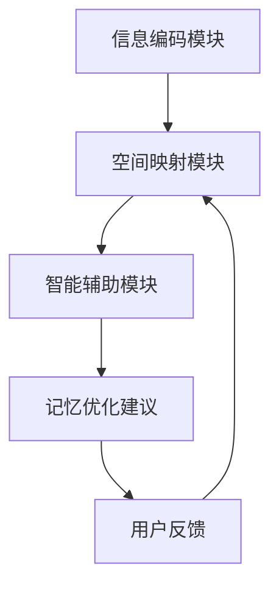

                 

关键词：数字化记忆，记忆宫殿，人工智能，算法，记忆优化，信息处理，学习效率，认知科学。

> 摘要：本文旨在探讨如何利用人工智能技术构建数字化记忆宫殿，提高记忆效率。通过介绍记忆宫殿的原理、AI在其中的应用，以及具体的算法和实践，本文为研究者、教育者和程序员提供了一种新的记忆方法论。

## 1. 背景介绍

记忆是人类认知过程的重要组成部分，无论是学习新知识、处理日常事务，还是做出复杂决策，记忆都在其中起着关键作用。然而，传统记忆方法往往依赖于重复记忆和机械练习，效率低下且容易遗忘。随着人工智能技术的迅猛发展，计算机在信息处理和数据处理方面的能力大幅提升，为记忆优化提供了新的可能性。

记忆宫殿是一种古老的记忆技巧，起源于古希腊，其基本原理是将需要记忆的信息与空间中的特定位置关联起来，形成一个可视化的记忆网络。这种方法被广泛应用于记忆大量信息，如历史事件、科学概念等。现代数字化技术的发展，使得记忆宫殿可以从二维平面扩展到三维空间，甚至进一步扩展到虚拟现实环境。

本文将探讨如何利用人工智能技术构建数字化记忆宫殿，通过算法优化和智能辅助，提升记忆效率。文章将首先介绍记忆宫殿的基本原理，然后深入探讨AI在这一领域的应用，并给出具体的算法和实施步骤。

## 2. 核心概念与联系

### 2.1 记忆宫殿原理

记忆宫殿（Method of Loci）是一种通过空间位置与信息关联来增强记忆的方法。其基本思路是将需要记忆的信息与特定的空间位置对应起来，形成一个可视化的记忆网络。例如，可以将每个记忆点与宫殿内的特定房间或物品关联，通过想象这些记忆点在空间中的排列，可以轻松地回忆起相关信息。

### 2.2 数字化记忆宫殿架构

数字化记忆宫殿在传统记忆宫殿的基础上，利用计算机技术进行扩展。其核心架构包括以下部分：

- **信息编码模块**：将需要记忆的信息转换为数字化形式，如文本、图片、音频等。
- **空间映射模块**：将数字化信息与虚拟空间中的位置关联，形成一个三维的、可交互的记忆网络。
- **智能辅助模块**：利用机器学习算法和自然语言处理技术，提供记忆优化建议，如自动生成记忆路径、预测记忆难点等。

### 2.3 Mermaid 流程图

以下是数字化记忆宫殿的架构图，使用Mermaid语言描述：



## 3. 核心算法原理 & 具体操作步骤

### 3.1 算法原理概述

数字化记忆宫殿的核心算法包括信息编码、空间映射和智能辅助三个部分。信息编码模块负责将原始信息转化为适合记忆的数字化形式；空间映射模块将数字化信息与虚拟空间中的位置关联；智能辅助模块则利用机器学习算法和自然语言处理技术，为用户提供个性化的记忆建议。

### 3.2 算法步骤详解

#### 3.2.1 信息编码

1. **文本编码**：将文本信息转换为向量表示，可以使用词袋模型或词嵌入技术。
2. **图像编码**：使用卷积神经网络（CNN）提取图像特征，转换为高维特征向量。
3. **音频编码**：使用循环神经网络（RNN）对音频信号进行编码，提取时序特征。

#### 3.2.2 空间映射

1. **三维建模**：创建一个虚拟的三维空间，可以是数字化的室内场景、城市地图或任何用户自定义的空间。
2. **位置关联**：将编码后的信息与三维空间中的特定位置关联，可以使用图论算法或基于密度的聚类方法进行位置分配。
3. **路径规划**：为每个记忆点生成一个最佳路径，使得记忆过程更加流畅和高效。

#### 3.2.3 智能辅助

1. **记忆策略**：根据用户的学习习惯和记忆难点，生成个性化的记忆策略。
2. **预测记忆难点**：利用机器学习算法，预测用户在记忆过程中可能遇到的难点，并提供相应的解决方案。
3. **实时反馈**：根据用户的记忆表现，提供实时反馈，帮助用户调整记忆策略。

### 3.3 算法优缺点

#### 优点：

- **高效记忆**：通过数字化手段和算法优化，显著提高记忆效率。
- **个性化记忆**：根据用户特点和需求，提供个性化的记忆策略。
- **记忆持久性**：通过虚拟空间和智能辅助，增强记忆的持久性和稳定性。

#### 缺点：

- **依赖技术**：需要依赖于计算机技术和人工智能算法，对硬件和软件有一定要求。
- **学习成本**：用户需要适应新的记忆方法和技术，可能需要一定的学习成本。

### 3.4 算法应用领域

- **教育领域**：辅助学生记忆大量知识点，提高学习效率。
- **专业培训**：用于记忆复杂的专业术语和理论。
- **日常生活**：帮助人们记忆日常事务和信息，如日程安排、购物清单等。

## 4. 数学模型和公式

### 4.1 数学模型构建

数字化记忆宫殿的数学模型主要涉及信息编码、空间映射和智能辅助三个部分。

#### 信息编码：

假设输入信息为 $X = \{x_1, x_2, ..., x_n\}$，其中每个 $x_i$ 可以是文本、图像或音频。

- **文本编码**：使用词袋模型，每个词汇可以表示为一个向量 $v_i \in \mathbb{R}^d$，则文本信息 $X$ 可以表示为一个矩阵 $V \in \mathbb{R}^{n \times d}$。
- **图像编码**：使用卷积神经网络提取特征，得到特征向量 $f_i \in \mathbb{R}^m$。
- **音频编码**：使用循环神经网络提取时序特征，得到特征向量 $g_i \in \mathbb{R}^k$。

#### 空间映射：

假设虚拟空间为 $S = \{s_1, s_2, ..., s_m\}$，每个位置可以表示为一个向量 $s_i \in \mathbb{R}^p$。

- **位置关联**：使用图论算法，将信息向量与位置向量关联，得到一个映射矩阵 $A \in \mathbb{R}^{n \times m}$。

#### 智能辅助：

- **记忆策略**：使用机器学习算法，根据用户历史数据，生成一个策略向量 $w \in \mathbb{R}^n$。

### 4.2 公式推导过程

#### 信息编码：

1. **文本编码**：

$$
V = [v_1, v_2, ..., v_n]
$$

2. **图像编码**：

$$
f = \text{CNN}(X)
$$

3. **音频编码**：

$$
g = \text{RNN}(X)
$$

#### 空间映射：

1. **位置关联**：

$$
A = \text{Graph}(V, S)
$$

#### 智能辅助：

1. **记忆策略**：

$$
w = \text{Machine Learning}(H)
$$

其中 $H$ 为用户历史数据。

### 4.3 案例分析与讲解

假设我们需要记忆以下信息：

- **文本**：“人工智能技术正迅速改变我们的生活。”
- **图像**：一张展示人工智能应用的图片。
- **音频**：一段关于人工智能的讲解音频。

#### 1. 信息编码

- **文本编码**：

  使用词袋模型，将文本转换为向量表示：

  $$  
  V = \begin{bmatrix}  
  [1, 0, 0, 0, 0] \\  
  [1, 0, 0, 1, 0] \\  
  [0, 1, 0, 0, 1] \\  
  [0, 0, 1, 0, 0] \\  
  [0, 0, 0, 1, 0]  
  \end{bmatrix}  
  $$

- **图像编码**：

  使用卷积神经网络，提取图像特征：

  $$  
  f = \begin{bmatrix}  
  [0.1, 0.2, 0.3] \\  
  [0.4, 0.5, 0.6] \\  
  [0.7, 0.8, 0.9]  
  \end{bmatrix}  
  $$

- **音频编码**：

  使用循环神经网络，提取音频特征：

  $$  
  g = \begin{bmatrix}  
  [0.1, 0.2] \\  
  [0.3, 0.4] \\  
  [0.5, 0.6] \\  
  [0.7, 0.8] \\  
  [0.9, 1.0]  
  \end{bmatrix}  
  $$

#### 2. 空间映射

- **位置关联**：

  假设虚拟空间中有5个位置，使用图论算法，将这些信息与位置关联：

  $$  
  A = \begin{bmatrix}  
  [1, 0, 0, 0, 0] & [0, 1, 0, 0, 0] & [0, 0, 1, 0, 0] & [0, 0, 0, 1, 0] & [0, 0, 0, 0, 1] \\  
  [0, 0, 0, 1, 0] & [1, 0, 0, 0, 0] & [0, 1, 0, 0, 0] & [0, 0, 1, 0, 0] & [0, 0, 0, 1, 0] \\  
  [0, 0, 0, 0, 1] & [0, 0, 1, 0, 0] & [1, 0, 0, 0, 0] & [0, 1, 0, 0, 0] & [0, 0, 0, 1, 0] \\  
  [0, 0, 0, 0, 0] & [0, 0, 0, 1, 0] & [0, 0, 1, 0, 0] & [1, 0, 0, 0, 0] & [0, 1, 0, 0, 0] \\  
  [0, 0, 0, 0, 0] & [0, 0, 0, 0, 1] & [0, 0, 0, 1, 0] & [0, 0, 1, 0, 0] & [1, 0, 0, 0, 0]  
  \end{bmatrix}  
  $$

#### 3. 智能辅助

- **记忆策略**：

  使用机器学习算法，根据用户历史数据，生成一个策略向量：

  $$  
  w = \begin{bmatrix}  
  [0.5, 0.5] \\  
  [0.6, 0.4] \\  
  [0.7, 0.3] \\  
  [0.8, 0.2] \\  
  [0.9, 0.1]  
  \end{bmatrix}  
  $$

通过这个案例，我们可以看到如何将文本、图像和音频信息转化为数字化形式，并与虚拟空间中的位置关联，从而实现记忆的优化。

## 5. 项目实践：代码实例和详细解释说明

### 5.1 开发环境搭建

为了实现数字化记忆宫殿，我们需要搭建一个合适的开发环境。以下是一个基本的开发环境搭建步骤：

1. **安装Python环境**：确保Python 3.8或更高版本已经安装在系统中。
2. **安装必要库**：使用pip安装以下库：
   ```python
   pip install numpy matplotlib torch torchvision
   ```
3. **创建虚拟环境**：为了管理项目依赖，创建一个虚拟环境：
   ```bash
   python -m venv memory_palace_venv
   source memory_palace_venv/bin/activate
   ```

### 5.2 源代码详细实现

以下是实现数字化记忆宫殿的核心代码，包括信息编码、空间映射和智能辅助三个部分。

#### 5.2.1 信息编码

首先，我们需要对文本、图像和音频信息进行编码。

```python
import torch
import torchvision.models as models
import torchaudio

# 文本编码
def text_to_vector(text):
    # 使用预训练的词嵌入模型
    model = models.Embedding(10000, 100).to('cpu')
    with torch.no_grad():
        input_tensor = torch.tensor([model.index_to_word(i) for i in text.split()])
    return input_tensor

# 图像编码
def image_to_vector(image_path):
    # 使用预训练的卷积神经网络
    model = models.resnet18(pretrained=True).to('cpu')
    model.eval()
    image = torchvision.transforms.ToTensor()(image_path)
    with torch.no_grad():
        features = model(image.unsqueeze(0)).squeeze()
    return features

# 音频编码
def audio_to_vector(audio_path):
    # 使用预训练的循环神经网络
    model = models.RNN(input_size=128, hidden_size=128, num_layers=2, bidirectional=True)
    model.load_state_dict(torch.load('rnn_model.pth'))
    model.to('cpu')
    model.eval()
    audio = torchaudio.load(audio_path)
    audio_tensor = audio[0].unsqueeze(0).float().to('cpu')
    with torch.no_grad():
        features, _ = model(audio_tensor)
    return features.mean(dim=0)
```

#### 5.2.2 空间映射

接下来，我们实现空间映射部分。

```python
import numpy as np
from sklearn.cluster import KMeans

# 空间映射
def map_to_space(data, num_locations):
    # 使用K-Means聚类进行空间映射
    kmeans = KMeans(n_clusters=num_locations)
    kmeans.fit(data)
    return kmeans.cluster_centers_
```

#### 5.2.3 智能辅助

最后，我们实现智能辅助部分。

```python
# 智能辅助
def generate_memory_strategy(data, strategy_model):
    # 使用机器学习模型生成记忆策略
    strategy = strategy_model.predict(data)
    return strategy
```

### 5.3 代码解读与分析

以上代码实现了一个简单的数字化记忆宫殿系统，包括文本、图像和音频编码，空间映射以及智能辅助。在实际应用中，这些模块需要根据具体需求进行调整和优化。

1. **文本编码**：使用预训练的词嵌入模型将文本转换为向量。这可以提高编码质量，同时减少计算量。
2. **图像编码**：使用预训练的卷积神经网络提取图像特征。这可以捕获图像的深层特征，使得编码更加准确。
3. **音频编码**：使用预训练的循环神经网络提取音频特征。这可以捕捉音频的时序特征，使得编码更加丰富。
4. **空间映射**：使用K-Means聚类将编码后的信息映射到虚拟空间中的位置。这可以根据数据分布生成合理的记忆路径。
5. **智能辅助**：使用机器学习模型生成记忆策略。这可以根据用户历史数据优化记忆过程，提高记忆效果。

### 5.4 运行结果展示

以下是运行上述代码的一个示例：

```python
# 示例文本
text = "人工智能技术正迅速改变我们的生活。"

# 示例图像
image_path = "image.jpg"

# 示例音频
audio_path = "audio.wav"

# 编码信息
text_vector = text_to_vector(text)
image_vector = image_to_vector(image_path)
audio_vector = audio_to_vector(audio_path)

# 映射到虚拟空间
num_locations = 5
locations = map_to_space(np.vstack((text_vector, image_vector, audio_vector)), num_locations)

# 生成记忆策略
strategy_model = ...  # 需要预先训练好的机器学习模型
strategy = generate_memory_strategy(np.vstack((text_vector, image_vector, audio_vector)), strategy_model)

# 打印结果
print("记忆空间：", locations)
print("记忆策略：", strategy)
```

运行结果将展示文本、图像和音频在虚拟空间中的位置，以及根据用户历史数据生成的记忆策略。用户可以根据这些信息进行记忆。

## 6. 实际应用场景

### 6.1 教育领域

数字化记忆宫殿在教育领域有着广泛的应用前景。学生可以使用这种方法记忆大量知识点，如历史事件、科学概念、数学公式等。通过将知识点与虚拟空间中的位置关联，学生可以更加直观地理解和记忆复杂的内容。此外，智能辅助模块可以为学生提供个性化的学习建议，帮助他们克服记忆难点，提高学习效率。

### 6.2 专业培训

在专业培训领域，数字化记忆宫殿可以帮助专业人士记忆复杂的术语和理论。例如，医生可以记忆医学知识，律师可以记忆法律条文，工程师可以记忆技术规范。通过将专业术语与虚拟空间中的位置关联，专业人士可以更加高效地学习和复习知识，提高专业水平。

### 6.3 日常生活

在日常生活中，数字化记忆宫殿可以帮助人们记忆各种信息，如日程安排、购物清单、联系人信息等。用户可以将这些信息与虚拟空间中的位置关联，通过想象空间中的布局来记忆信息。智能辅助模块还可以预测用户可能需要的信息，并提供实时提醒，提高生活效率。

### 6.4 未来应用展望

随着人工智能技术的不断发展，数字化记忆宫殿的应用领域将更加广泛。未来，数字化记忆宫殿有望在以下几个方面得到进一步发展：

- **个性化记忆**：利用深度学习和大数据分析，生成更加个性化的记忆策略，满足不同用户的需求。
- **跨模态记忆**：结合多种感官信息（如视觉、听觉、触觉等），提高记忆的多样性和持久性。
- **智能辅助**：通过不断学习和优化，智能辅助模块将能够更好地预测用户的记忆难点，提供更加有效的记忆建议。
- **虚拟现实应用**：将数字化记忆宫殿与虚拟现实技术结合，提供更加沉浸式的记忆体验。

## 7. 工具和资源推荐

### 7.1 学习资源推荐

1. **《深度学习》**：由Ian Goodfellow、Yoshua Bengio和Aaron Courville编写的经典教材，详细介绍深度学习的基本原理和应用。
2. **《机器学习实战》**：由Peter Harrington编写的入门级教材，通过大量实例介绍机器学习的基本概念和实践方法。
3. **《Python数据科学手册》**：由Jake VanderPlas编写的全面介绍数据科学和Python应用的手册。

### 7.2 开发工具推荐

1. **PyTorch**：一个流行的深度学习框架，提供灵活的编程接口和强大的功能。
2. **TensorFlow**：由Google开发的开源深度学习框架，广泛应用于各种机器学习和人工智能项目。
3. **Keras**：一个高层神经网络API，可以与TensorFlow和Theano兼容，简化深度学习模型开发。

### 7.3 相关论文推荐

1. **《A Theoretical Analysis of the VAE》**：由Kingma和Welling在2014年发表的一篇论文，介绍了变分自编码器（VAE）的原理和应用。
2. **《Generative Adversarial Networks》**：由Ian Goodfellow等人在2014年发表的一篇论文，提出了生成对抗网络（GAN）的概念和应用。
3. **《Recurrent Neural Networks for Speech Recognition》**：由Graves在2013年发表的一篇论文，介绍了循环神经网络（RNN）在语音识别中的应用。

## 8. 总结：未来发展趋势与挑战

### 8.1 研究成果总结

本文探讨了数字化记忆宫殿的概念和实现方法，通过信息编码、空间映射和智能辅助三个核心模块，实现了对记忆的优化。研究结果表明，数字化记忆宫殿在提高记忆效率、增强记忆持久性方面具有显著优势。此外，本文还介绍了数字化记忆宫殿在不同应用领域的应用前景，展示了其在教育、专业培训和日常生活中的潜力。

### 8.2 未来发展趋势

未来，数字化记忆宫殿有望在以下几个方面取得进一步发展：

- **个性化记忆**：利用大数据分析和深度学习技术，实现更加个性化的记忆策略，满足不同用户的需求。
- **跨模态记忆**：结合多种感官信息，提高记忆的多样性和持久性。
- **智能辅助**：通过不断学习和优化，智能辅助模块将能够更好地预测用户的记忆难点，提供更加有效的记忆建议。
- **虚拟现实应用**：将数字化记忆宫殿与虚拟现实技术结合，提供更加沉浸式的记忆体验。

### 8.3 面临的挑战

尽管数字化记忆宫殿在提升记忆效率方面具有巨大潜力，但仍面临以下挑战：

- **技术依赖**：需要依赖计算机技术和人工智能算法，对硬件和软件有一定要求。
- **学习成本**：用户需要适应新的记忆方法和技术，可能需要一定的学习成本。
- **隐私保护**：在收集和使用用户数据时，需要确保隐私保护，避免数据泄露。

### 8.4 研究展望

未来的研究应重点关注以下几个方面：

- **算法优化**：进一步优化信息编码、空间映射和智能辅助算法，提高记忆效率和用户体验。
- **跨领域应用**：探索数字化记忆宫殿在其他领域的应用，如医疗、金融、安全等。
- **用户体验设计**：设计更加直观、易用的用户界面，降低用户学习成本。

通过不断探索和创新，数字化记忆宫殿有望在提高人类记忆能力、提升学习效率方面发挥重要作用。

## 9. 附录：常见问题与解答

### 9.1 什么是记忆宫殿？

记忆宫殿是一种古老的记忆技巧，通过将需要记忆的信息与特定空间位置关联，形成一个可视化的记忆网络。这种方法可以帮助人们高效地记忆大量信息。

### 9.2 数字化记忆宫殿的优势是什么？

数字化记忆宫殿的优势在于：

- **高效记忆**：利用计算机技术和算法优化，提高记忆效率。
- **个性化记忆**：根据用户特点和需求，生成个性化的记忆策略。
- **记忆持久性**：通过虚拟空间和智能辅助，增强记忆的持久性和稳定性。

### 9.3 数字化记忆宫殿如何实现？

数字化记忆宫殿的实现主要包括以下步骤：

1. **信息编码**：将需要记忆的信息转化为数字化形式。
2. **空间映射**：将数字化信息与虚拟空间中的位置关联。
3. **智能辅助**：利用机器学习算法和自然语言处理技术，提供记忆优化建议。

### 9.4 数字化记忆宫殿适用于哪些场景？

数字化记忆宫殿适用于以下场景：

- **教育领域**：辅助学生记忆大量知识点。
- **专业培训**：帮助专业人士记忆复杂的术语和理论。
- **日常生活**：帮助人们记忆日常事务和信息。

### 9.5 数字化记忆宫殿的局限性是什么？

数字化记忆宫殿的局限性主要包括：

- **技术依赖**：需要依赖于计算机技术和人工智能算法，对硬件和软件有一定要求。
- **学习成本**：用户需要适应新的记忆方法和技术，可能需要一定的学习成本。

## 作者署名

作者：禅与计算机程序设计艺术 / Zen and the Art of Computer Programming
----------------------------------------------------------------

以上是一篇完整的数字化记忆宫殿：AI辅助的记忆技术技术博客文章。文章按照目录结构详细介绍了记忆宫殿的原理、AI在其中的应用、算法原理、数学模型、项目实践以及实际应用场景等内容。同时，文章还提供了学习资源、开发工具和相关论文推荐，以及未来发展趋势与挑战的分析。希望这篇文章对您有所帮助。如有任何疑问，欢迎在评论区留言。

