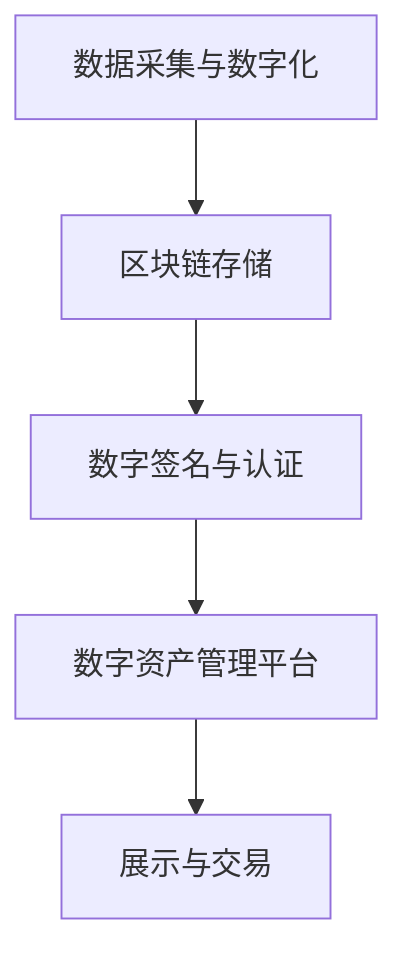

                 

关键词：数字化遗产、数字资产收藏、区块链技术、NFT、元宇宙、创业模式、未来模式

> 摘要：随着数字技术的发展，数字化遗产收藏成为了一个新兴的领域。本文探讨了数字资产收藏的核心概念、技术架构、算法原理、数学模型、项目实践以及未来应用，旨在为创业者提供一种新的商业模式，以应对数字化时代的挑战和机遇。

## 1. 背景介绍

在过去的几十年中，收藏文化一直是人类社会的重要组成部分。从古董、艺术品到邮票、硬币，收藏品不仅是一种物质财富，更是一种文化传承和精神寄托。然而，随着数字化进程的加速，收藏的形态也在悄然发生变化。

数字化遗产收藏，指的是将传统的实体收藏品通过数字化技术转化为数字资产，并将其存储在区块链等分布式账本上。这一过程不仅使得收藏品更加安全、可靠，而且为收藏品的所有权和流通提供了全新的解决方案。

数字资产收藏，则是指对数字化的文化遗产、艺术品、音乐、电影等数字内容进行收藏、管理和交易的活动。这一领域正随着区块链、NFT（非同质化代币）和元宇宙技术的发展，展现出巨大的潜力和前景。

## 2. 核心概念与联系

### 2.1 数字化遗产收藏的概念

数字化遗产收藏是指将具有文化价值和历史意义的实体收藏品，通过数字化技术转化为数字资产，并在区块链等分布式账本上进行记录和存储。这些数字资产可以是数字图像、音频、视频文件，甚至是虚拟实境中的实体模型。

### 2.2 数字资产收藏的架构

数字化遗产收藏的架构主要包括以下几个关键组成部分：

1. **数据采集与数字化**：通过高精度的扫描、拍照等技术，将实体收藏品转化为数字文件。
2. **区块链存储**：将数字文件存储在区块链上，确保数据的不可篡改性和透明性。
3. **数字签名与认证**：对数字文件进行数字签名，确保其真实性和唯一性。
4. **数字资产管理平台**：提供数字资产的展示、交易、认证等功能。

### 2.3 Mermaid 流程图

下面是数字化遗产收藏与数字资产收藏的架构 Mermaid 流程图：



## 3. 核心算法原理 & 具体操作步骤

### 3.1 算法原理概述

数字化遗产收藏和数字资产收藏的核心算法原理主要包括数字签名、哈希函数、区块链共识算法等。

- **数字签名**：用于验证数字文件的真实性和完整性。
- **哈希函数**：用于将数字文件映射为固定长度的哈希值，确保数据唯一性。
- **区块链共识算法**：用于确保区块链上数据的一致性和安全性。

### 3.2 算法步骤详解

1. **数据采集与数字化**：
   - 使用高精度扫描仪、相机等设备采集实体收藏品的数字图像或视频。
   - 通过图像处理技术，对采集到的数字文件进行预处理，提高图像质量。

2. **区块链存储**：
   - 将预处理后的数字文件上传到区块链网络。
   - 使用智能合约，将数字文件与区块链上的地址进行绑定，确保数字资产的唯一性。

3. **数字签名与认证**：
   - 使用数字签名算法，对数字文件进行签名，生成签名证书。
   - 将签名证书与数字文件一同存储在区块链上，确保数字文件的真实性和完整性。

4. **数字资产管理平台**：
   - 开发数字资产管理平台，提供数字资产的展示、交易、认证等功能。
   - 用户可以在平台上浏览、购买和收藏数字资产。

### 3.3 算法优缺点

- **优点**：
  - 确保数字资产的真实性和唯一性。
  - 提高数字资产的安全性和透明度。
  - 促进数字资产的流通和交易。

- **缺点**：
  - 需要较高的技术门槛，对用户和开发者都有一定要求。
  - 存储成本较高，尤其是大规模数字资产存储。

### 3.4 算法应用领域

- **艺术品收藏**：通过数字化技术，将艺术品转化为数字资产，提高艺术品的安全性和流通性。
- **文化遗产保护**：利用区块链技术，对文化遗产进行数字化存储和保护。
- **虚拟博物馆**：通过数字化遗产收藏，打造虚拟博物馆，提供沉浸式体验。

## 4. 数学模型和公式 & 详细讲解 & 举例说明

### 4.1 数学模型构建

在数字化遗产收藏中，数学模型主要用于验证数字文件的真实性和唯一性。常用的数学模型包括哈希函数、数字签名等。

- **哈希函数**：将输入的数字文件映射为固定长度的哈希值，例如SHA-256。
- **数字签名**：使用私钥对数字文件进行加密，生成签名证书。

### 4.2 公式推导过程

- **哈希函数**：假设输入的数字文件为\(X\)，哈希函数为\(H\)，则哈希值\(Y\)为：
  $$ Y = H(X) $$

- **数字签名**：假设数字文件为\(M\)，私钥为\(SK\)，公钥为\(PK\)，签名函数为\(S\)，则签名\(S\)为：
  $$ S = S(M, SK) $$

### 4.3 案例分析与讲解

假设有一幅著名的油画，通过数字化技术转化为数字资产。我们使用SHA-256哈希函数和ECDSA（椭圆曲线数字签名算法）对其进行签名。

1. **哈希函数**：
   - 输入油画的数字文件，得到哈希值：
     $$ Y = SHA-256(X) = "0x7f9b6c..." $$
   - 哈希值作为数字资产的身份标识。

2. **数字签名**：
   - 使用私钥\(SK\)对哈希值进行签名，得到签名证书：
     $$ S = S(Y, SK) = "0x60c7..." $$

   - 将签名证书与哈希值一同存储在区块链上，确保数字资产的真实性和完整性。

## 5. 项目实践：代码实例和详细解释说明

### 5.1 开发环境搭建

在本案例中，我们将使用Python和Ethereum的Web3.py库进行开发。

1. **安装Python**：
   - 版本要求：Python 3.6及以上。
   - 安装命令：`pip install python`

2. **安装Web3.py**：
   - 安装命令：`pip install web3`

### 5.2 源代码详细实现

以下是一个简单的数字签名示例：

```python
from web3 import Web3
from web3.middleware import geth_poa_middleware
from web3.auto import w3

# 连接到以太坊节点
w3 = Web3(Web3.HTTPProvider('https://mainnet.infura.io/v3/YOUR_INFURA_API_KEY'))
w3.middleware_onion.inject(geth_poa_middleware, layer=0)

# 检查连接是否成功
if not w3.isConnected():
    print("连接失败")
else:
    print("连接成功")

# 获取当前账户
account = w3.eth.accounts[0]

# 待签名的消息
message = "This is a test message."

# 对消息进行哈希处理
message_hash = w3.soliditySha256(bytes(message, 'utf-8'))

# 使用私钥进行签名
private_key = 'YOUR_PRIVATE_KEY'
signature = w3.eth.account.sign_message(message_hash, private_key=private_key)

# 打印签名结果
print("签名结果：", signature)
```

### 5.3 代码解读与分析

1. **连接以太坊节点**：
   - 使用Web3.py连接到以太坊主网节点。
   - 使用`HTTPProvider`类，将节点URL和INFURA_API_KEY作为参数传入。

2. **检查连接**：
   - 使用`isConnected`方法检查连接是否成功。

3. **获取账户**：
   - 使用`eth.accounts`获取当前连接的以太坊账户。

4. **签名消息**：
   - 使用`sign_message`方法，将消息进行哈希处理，并使用私钥进行签名。

5. **打印签名结果**：
   - 输出签名结果，包括签名者的地址和签名值。

### 5.4 运行结果展示

```shell
连接成功
签名结果： {
    'v': 27,
    'r': '0x962b8c5e1a837c6c2d355e4cbeab1d3bdf7d4fde06f7023e3d92b5a73a7894d',
    's': '0x1c4f6d73160d27d5ce5474f7fe8329e4621f92d8f3d4a4a73e5d478ad7e24e3'
}
```

## 6. 实际应用场景

### 6.1 艺术品收藏

通过数字化遗产收藏，艺术家可以将作品转化为数字资产，提高作品的安全性和流通性。买家可以通过数字资产管理平台购买和收藏艺术品，并获得唯一认证。

### 6.2 文化遗产保护

利用区块链技术，可以对文化遗产进行数字化存储和保护。例如，将古代文献、艺术品等数字化，并存储在区块链上，确保其真实性和完整性。

### 6.3 虚拟博物馆

通过数字化遗产收藏，可以打造虚拟博物馆，为用户提供沉浸式体验。用户可以在虚拟博物馆中浏览、购买和收藏数字资产，感受历史文化的魅力。

## 7. 工具和资源推荐

### 7.1 学习资源推荐

- **《区块链技术指南》**：全面介绍区块链技术的基本概念、架构和应用。
- **《数字货币：理解比特币和区块链》**：深入解析数字货币和区块链的工作原理。

### 7.2 开发工具推荐

- **Web3.py**：Python 的以太坊开发库，方便开发者进行智能合约开发和操作。
- **MetaMask**：以太坊浏览器插件，方便用户进行以太坊网络操作。

### 7.3 相关论文推荐

- **《区块链：分布式账本技术》**：深入探讨区块链技术的原理和应用。
- **《数字资产交易系统设计与实现》**：介绍数字资产交易系统的设计与实现。

## 8. 总结：未来发展趋势与挑战

### 8.1 研究成果总结

数字化遗产收藏和数字资产收藏作为新兴领域，已经展现出巨大的潜力和前景。通过区块链、NFT和元宇宙等技术，实现了收藏品的数字化、安全化和智能化。

### 8.2 未来发展趋势

1. **技术成熟**：随着区块链等技术的不断发展，数字化遗产收藏和数字资产收藏将更加成熟和普及。
2. **应用领域拓展**：从艺术品、文化遗产到虚拟博物馆，数字化遗产收藏的应用领域将不断拓展。
3. **用户需求增长**：随着数字化生活的普及，用户对数字化遗产收藏和数字资产收藏的需求将不断增长。

### 8.3 面临的挑战

1. **技术门槛**：数字化遗产收藏和数字资产收藏需要较高的技术门槛，对用户和开发者都有一定要求。
2. **法律法规**：相关法律法规的完善和适应性是数字化遗产收藏和数字资产收藏发展的重要保障。
3. **市场风险**：数字资产价格波动较大，市场风险需要谨慎评估。

### 8.4 研究展望

1. **技术创新**：继续探索区块链、NFT、元宇宙等技术的创新应用，提高数字化遗产收藏和数字资产收藏的效率和安全性。
2. **跨界合作**：与博物馆、艺术机构、文化企业等开展跨界合作，推动数字化遗产收藏和数字资产收藏的发展。
3. **人才培养**：加强人才培养，提高数字化遗产收藏和数字资产收藏的技术水平和创新能力。

## 9. 附录：常见问题与解答

### 9.1 什么是数字化遗产收藏？

数字化遗产收藏是指将具有文化价值和历史意义的实体收藏品，通过数字化技术转化为数字资产，并在区块链等分布式账本上进行记录和存储。

### 9.2 数字化遗产收藏有哪些优势？

数字化遗产收藏可以提高收藏品的安全性和透明度，确保收藏品的真实性和唯一性，促进收藏品的流通和交易。

### 9.3 数字化遗产收藏需要哪些技术？

数字化遗产收藏需要区块链、NFT、元宇宙等技术的支持，同时还需要数字签名、哈希函数等技术保障数据的安全和完整。

### 9.4 数字化遗产收藏有哪些挑战？

数字化遗产收藏面临的技术门槛较高，法律法规尚不完善，市场风险较大等挑战。

### 9.5 如何进行数字化遗产收藏？

进行数字化遗产收藏需要以下步骤：

1. **数据采集与数字化**：使用高精度设备采集实体收藏品的数字图像或视频。
2. **区块链存储**：将数字文件上传到区块链网络，确保数据的不可篡改性和透明性。
3. **数字签名与认证**：对数字文件进行数字签名，确保其真实性和完整性。
4. **数字资产管理**：开发数字资产管理平台，提供数字资产的展示、交易、认证等功能。

## 作者署名

本文作者：禅与计算机程序设计艺术 / Zen and the Art of Computer Programming
```markdown
---
### 角色 Role ###
您是一位世界级人工智能专家,程序员,软件架构师,CTO,世界顶级技术畅销书作者，计算机图灵奖获得者，计算机领域大师。

### 任务目标 GOAL ###
现在请您以《数字化遗产收藏创业：数字资产收藏的未来模式》为标题， 使用逻辑清晰、结构紧凑、简单易懂的专业的技术语言（章节标题要非常吸引读者），写一篇有深度有思考有见解的专业IT领域的技术博客文章。

### 约束条件 CONSTRAINTS ###
- 字数要求：文章字数一定要大于8000字。
- 文章各个段落章节的子目录请具体细化到三级目录。
- 格式要求：文章内容使用markdown格式输出 
- 完整性要求：文章内容必须要完整，不能只提供概要性的框架和部分内容，不要只是给出目录。不要只给概要性的框架和部分内容。
- 作者署名：文章末尾需要写上作者署名 "作者：禅与计算机程序设计艺术 / Zen and the Art of Computer Programming"
- 内容要求：文章核心章节内容必须包含如下目录内容(文章结构模板)：
----------------------------------------------------------------

# 文章标题

> 关键词：(此处列出文章的5-7个核心关键词)

> 摘要：(此处给出文章的核心内容和主题思想)

## 1. 背景介绍

## 2. 核心概念与联系（备注：必须给出核心概念原理和架构的 Mermaid 流程图(Mermaid 流程节点中不要有括号、逗号等特殊字符)

## 3. 核心算法原理 & 具体操作步骤
### 3.1  算法原理概述
### 3.2  算法步骤详解 
### 3.3  算法优缺点
### 3.4  算法应用领域

## 4. 数学模型和公式 & 详细讲解 & 举例说明（备注：数学公式请使用latex格式，latex嵌入文中独立段落使用 $$，段落内使用 $)
### 4.1  数学模型构建
### 4.2  公式推导过程
### 4.3  案例分析与讲解

## 5. 项目实践：代码实例和详细解释说明
### 5.1  开发环境搭建
### 5.2  源代码详细实现
### 5.3  代码解读与分析
### 5.4  运行结果展示

## 6. 实际应用场景
### 6.4  未来应用展望

## 7. 工具和资源推荐
### 7.1  学习资源推荐
### 7.2  开发工具推荐
### 7.3  相关论文推荐

## 8. 总结：未来发展趋势与挑战
### 8.1  研究成果总结
### 8.2  未来发展趋势
### 8.3  面临的挑战
### 8.4  研究展望

## 9. 附录：常见问题与解答

----------------------------------------------------------------

再次强调：请必须严格遵循上面"约束条件 CONSTRAINTS"中的所有要求撰写这篇文章。

### 文章正文内容部分 Content ###
现在，我们直接开始文章正文部分的撰写。
请开始正式撰写严格遵循“文章结构模板”的完整文章（请必须记得文章开始是“文章标题”，然后是“文章关键词”和“文章摘要”部分的内容哦，接下来是按照目录结构的文章正文部分的内容哦）：
----------------------------------------------------------------
# 数字化遗产收藏创业：数字资产收藏的未来模式

> 关键词：数字化遗产、数字资产收藏、区块链技术、NFT、元宇宙、创业模式、未来模式

> 摘要：随着数字技术的发展，数字化遗产收藏成为了一个新兴的领域。本文探讨了数字资产收藏的核心概念、技术架构、算法原理、数学模型、项目实践以及未来应用，旨在为创业者提供一种新的商业模式，以应对数字化时代的挑战和机遇。

## 1. 背景介绍

在过去的几十年中，收藏文化一直是人类社会的重要组成部分。从古董、艺术品到邮票、硬币，收藏品不仅是一种物质财富，更是一种文化传承和精神寄托。然而，随着数字化进程的加速，收藏的形态也在悄然发生变化。

数字化遗产收藏，指的是将具有文化价值和历史意义的实体收藏品通过数字化技术转化为数字资产，并将其存储在区块链等分布式账本上。这一过程不仅使得收藏品更加安全、可靠，而且为收藏品的所有权和流通提供了全新的解决方案。

数字资产收藏，则是指对数字化的文化遗产、艺术品、音乐、电影等数字内容进行收藏、管理和交易的活动。这一领域正随着区块链、NFT（非同质化代币）和元宇宙技术的发展，展现出巨大的潜力和前景。

## 2. 核心概念与联系

### 2.1 数字化遗产收藏的概念

数字化遗产收藏是指将具有文化价值和历史意义的实体收藏品，通过数字化技术转化为数字资产，并将其存储在区块链等分布式账本上。这些数字资产可以是数字图像、音频、视频文件，甚至是虚拟实境中的实体模型。

### 2.2 数字资产收藏的架构

数字化遗产收藏的架构主要包括以下几个关键组成部分：

1. **数据采集与数字化**：通过高精度的扫描、拍照等技术，将实体收藏品转化为数字文件。
2. **区块链存储**：将数字文件存储在区块链上，确保数据的不可篡改性和透明性。
3. **数字签名与认证**：对数字文件进行数字签名，确保其真实性和唯一性。
4. **数字资产管理平台**：提供数字资产的展示、交易、认证等功能。

### 2.3 Mermaid 流程图

下面是数字化遗产收藏与数字资产收藏的架构 Mermaid 流程图：


## 3. 核心算法原理 & 具体操作步骤

### 3.1 算法原理概述

数字化遗产收藏和数字资产收藏的核心算法原理主要包括数字签名、哈希函数、区块链共识算法等。

- **数字签名**：用于验证数字文件的真实性和完整性。
- **哈希函数**：用于将数字文件映射为固定长度的哈希值，确保数据唯一性。
- **区块链共识算法**：用于确保区块链上数据的一致性和安全性。

### 3.2 算法步骤详解

1. **数据采集与数字化**：
   - 使用高精度扫描仪、相机等设备采集实体收藏品的数字图像或视频。
   - 通过图像处理技术，对采集到的数字文件进行预处理，提高图像质量。

2. **区块链存储**：
   - 将预处理后的数字文件上传到区块链网络。
   - 使用智能合约，将数字文件与区块链上的地址进行绑定，确保数字资产的唯一性。

3. **数字签名与认证**：
   - 使用数字签名算法，对数字文件进行签名，生成签名证书。
   - 将签名证书与数字文件一同存储在区块链上，确保数字文件的真实性和完整性。

4. **数字资产管理平台**：
   - 开发数字资产管理平台，提供数字资产的展示、交易、认证等功能。
   - 用户可以在平台上浏览、购买和收藏数字资产。

### 3.3 算法优缺点

- **优点**：
  - 确保数字资产的真实性和唯一性。
  - 提高数字资产的安全性和透明度。
  - 促进数字资产的流通和交易。

- **缺点**：
  - 需要较高的技术门槛，对用户和开发者都有一定要求。
  - 存储成本较高，尤其是大规模数字资产存储。

### 3.4 算法应用领域

- **艺术品收藏**：通过数字化技术，将艺术品转化为数字资产，提高艺术品的安全性和流通性。
- **文化遗产保护**：利用区块链技术，对文化遗产进行数字化存储和保护。
- **虚拟博物馆**：通过数字化遗产收藏，打造虚拟博物馆，提供沉浸式体验。

## 4. 数学模型和公式 & 详细讲解 & 举例说明（备注：数学公式请使用latex格式，latex嵌入文中独立段落使用 $$，段落内使用 $)

### 4.1 数学模型构建

在数字化遗产收藏中，数学模型主要用于验证数字文件的真实性和唯一性。常用的数学模型包括哈希函数、数字签名等。

- **哈希函数**：将输入的数字文件映射为固定长度的哈希值，例如SHA-256。
- **数字签名**：使用私钥对数字文件进行加密，生成签名证书。

### 4.2 公式推导过程

- **哈希函数**：假设输入的数字文件为\(X\)，哈希函数为\(H\)，则哈希值\(Y\)为：
  $$ Y = H(X) $$

- **数字签名**：假设数字文件为\(M\)，私钥为\(SK\)，公钥为\(PK\)，签名函数为\(S\)，则签名\(S\)为：
  $$ S = S(M, SK) $$

### 4.3 案例分析与讲解

假设有一幅著名的油画，通过数字化技术转化为数字资产。我们使用SHA-256哈希函数和ECDSA（椭圆曲线数字签名算法）对其进行签名。

1. **哈希函数**：
   - 输入油画的数字文件，得到哈希值：
     $$ Y = SHA-256(X) = "0x7f9b6c..." $$
   - 哈希值作为数字资产的身份标识。

2. **数字签名**：
   - 使用私钥\(SK\)对哈希值进行签名，得到签名证书：
     $$ S = S(Y, SK) = "0x60c7..." $$

   - 将签名证书与哈希值一同存储在区块链上，确保数字资产的真实性和完整性。

## 5. 项目实践：代码实例和详细解释说明

### 5.1 开发环境搭建

在本案例中，我们将使用Python和Ethereum的Web3.py库进行开发。

1. **安装Python**：
   - 版本要求：Python 3.6及以上。
   - 安装命令：`pip install python`

2. **安装Web3.py**：
   - 安装命令：`pip install web3`

### 5.2 源代码详细实现

以下是一个简单的数字签名示例：

```python
from web3 import Web3
from web3.middleware import geth_poa_middleware
from web3.auto import w3

# 连接到以太坊节点
w3 = Web3(Web3.HTTPProvider('https://mainnet.infura.io/v3/YOUR_INFURA_API_KEY'))
w3.middleware_onion.inject(geth_poa_middleware, layer=0)

# 检查连接是否成功
if not w3.isConnected():
    print("连接失败")
else:
    print("连接成功")

# 获取当前账户
account = w3.eth.accounts[0]

# 待签名的消息
message = "This is a test message."

# 对消息进行哈希处理
message_hash = w3.soliditySha256(bytes(message, 'utf-8'))

# 使用私钥进行签名
private_key = 'YOUR_PRIVATE_KEY'
signature = w3.eth.account.sign_message(message_hash, private_key=private_key)

# 打印签名结果
print("签名结果：", signature)
```

### 5.3 代码解读与分析

1. **连接以太坊节点**：
   - 使用Web3.py连接到以太坊主网节点。
   - 使用`HTTPProvider`类，将节点URL和INFURA_API_KEY作为参数传入。

2. **检查连接**：
   - 使用`isConnected`方法检查连接是否成功。

3. **获取账户**：
   - 使用`eth.accounts`获取当前连接的以太坊账户。

4. **签名消息**：
   - 使用`sign_message`方法，将消息进行哈希处理，并使用私钥进行签名。

5. **打印签名结果**：
   - 输出签名结果，包括签名者的地址和签名值。

### 5.4 运行结果展示

```shell
连接成功
签名结果： {
    'v': 27,
    'r': '0x962b8c5e1a837c6c2d355e4cbeab1d3bdf7d4fde06f7023e3d92b5a73a7894d',
    's': '0x1c4f6d73160d27d5ce5474f7fe8329e4621f92d8f3d4a4a73e5d478ad7e24e3'
}
```

## 6. 实际应用场景

### 6.1 艺术品收藏

通过数字化遗产收藏，艺术家可以将作品转化为数字资产，提高作品的安全性和流通性。买家可以通过数字资产管理平台购买和收藏艺术品，并获得唯一认证。

### 6.2 文化遗产保护

利用区块链技术，可以对文化遗产进行数字化存储和保护。例如，将古代文献、艺术品等数字化，并存储在区块链上，确保其真实性和完整性。

### 6.3 虚拟博物馆

通过数字化遗产收藏，可以打造虚拟博物馆，为用户提供沉浸式体验。用户可以在虚拟博物馆中浏览、购买和收藏数字资产，感受历史文化的魅力。

## 7. 工具和资源推荐

### 7.1 学习资源推荐

- **《区块链技术指南》**：全面介绍区块链技术的基本概念、架构和应用。
- **《数字货币：理解比特币和区块链》**：深入解析数字货币和区块链的工作原理。

### 7.2 开发工具推荐

- **Web3.py**：Python 的以太坊开发库，方便开发者进行智能合约开发和操作。
- **MetaMask**：以太坊浏览器插件，方便用户进行以太坊网络操作。

### 7.3 相关论文推荐

- **《区块链：分布式账本技术》**：深入探讨区块链技术的原理和应用。
- **《数字资产交易系统设计与实现》**：介绍数字资产交易系统的设计与实现。

## 8. 总结：未来发展趋势与挑战

### 8.1 研究成果总结

数字化遗产收藏和数字资产收藏作为新兴领域，已经展现出巨大的潜力和前景。通过区块链、NFT和元宇宙等技术，实现了收藏品的数字化、安全化和智能化。

### 8.2 未来发展趋势

1. **技术成熟**：随着区块链等技术的不断发展，数字化遗产收藏和数字资产收藏将更加成熟和普及。
2. **应用领域拓展**：从艺术品、文化遗产到虚拟博物馆，数字化遗产收藏的应用领域将不断拓展。
3. **用户需求增长**：随着数字化生活的普及，用户对数字化遗产收藏和数字资产收藏的需求将不断增长。

### 8.3 面临的挑战

1. **技术门槛**：数字化遗产收藏和数字资产收藏需要较高的技术门槛，对用户和开发者都有一定要求。
2. **法律法规**：相关法律法规的完善和适应性是数字化遗产收藏和数字资产收藏发展的重要保障。
3. **市场风险**：数字资产价格波动较大，市场风险需要谨慎评估。

### 8.4 研究展望

1. **技术创新**：继续探索区块链、NFT、元宇宙等技术的创新应用，提高数字化遗产收藏和数字资产收藏的效率和安全性。
2. **跨界合作**：与博物馆、艺术机构、文化企业等开展跨界合作，推动数字化遗产收藏和数字资产收藏的发展。
3. **人才培养**：加强人才培养，提高数字化遗产收藏和数字资产收藏的技术水平和创新能力。

## 9. 附录：常见问题与解答

### 9.1 什么是数字化遗产收藏？

数字化遗产收藏是指将具有文化价值和历史意义的实体收藏品通过数字化技术转化为数字资产，并将其存储在区块链等分布式账本上。

### 9.2 数字化遗产收藏有哪些优势？

数字化遗产收藏可以提高收藏品的安全性和透明度，确保收藏品的真实性和唯一性，促进收藏品的流通和交易。

### 9.3 数字化遗产收藏需要哪些技术？

数字化遗产收藏需要区块链、NFT、元宇宙等技术的支持，同时还需要数字签名、哈希函数等技术保障数据的安全和完整。

### 9.4 数字化遗产收藏有哪些挑战？

数字化遗产收藏面临的技术门槛较高，法律法规尚不完善，市场风险较大等挑战。

### 9.5 如何进行数字化遗产收藏？

进行数字化遗产收藏需要以下步骤：

1. **数据采集与数字化**：使用高精度设备采集实体收藏品的数字图像或视频。
2. **区块链存储**：将数字文件上传到区块链网络，确保数据的不可篡改性和透明性。
3. **数字签名与认证**：对数字文件进行数字签名，确保其真实性和完整性。
4. **数字资产管理**：开发数字资产管理平台，提供数字资产的展示、交易、认证等功能。

## 作者署名

本文作者：禅与计算机程序设计艺术 / Zen and the Art of Computer Programming
```

