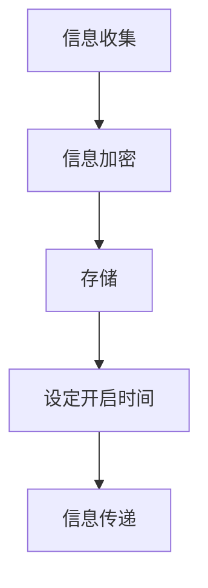

                 

关键词：数字化遗产，时间胶囊，跨代际，信息传递，创业

> 摘要：随着数字化时代的到来，人们的遗产形式也在发生变革。数字化遗产作为一种新兴的遗产形式，承载着跨代际的信息传递与创业机会。本文旨在探讨数字化遗产的定义、特点以及如何通过创业将数字化遗产转化为跨代际的信息传递工具。

## 1. 背景介绍

在传统社会，遗产的传承主要依赖于物质载体，如土地、房产、金银珠宝等。然而，随着数字化技术的迅猛发展，数字信息逐渐成为人们生活中不可或缺的一部分。数字化遗产，即以数字形式存在的遗产，正逐渐成为现代社会的遗产形式。这种遗产形式不仅涵盖了传统的个人信息，还包括社交媒体账号、电子邮件、文档、图片、视频等。

### 数字化遗产的特点

数字化遗产具有以下几个特点：

1. **虚拟性**：数字化遗产以数字形式存在，没有实体形态。
2. **易传递性**：数字信息可以通过网络快速传播，跨越时间和空间的限制。
3. **可复制性**：数字信息可以被轻松复制，不受物理损耗的限制。
4. **动态性**：数字化遗产可以随着技术的发展而不断更新和扩展。

### 跨代际的信息传递

跨代际的信息传递是指在不同年龄阶段之间传递信息和知识的过程。数字化遗产的兴起为跨代际的信息传递提供了新的途径。通过数字化遗产，年轻一代可以更好地了解前辈的生活、思想和文化，从而实现文化的传承。

## 2. 核心概念与联系

### 数字化遗产的时间胶囊概念

时间胶囊是一种将特定信息保存起来，以便未来某时开启的机制。数字化遗产时间胶囊则是将个人或集体的数字化信息以时间胶囊的形式保存，以便跨代际传递。

### 数字化遗产时间胶囊的工作原理

数字化遗产时间胶囊的工作原理可以分为以下几个步骤：

1. **信息收集**：收集个人或集体的数字化信息，如文档、图片、视频等。
2. **信息加密**：对收集到的信息进行加密处理，确保信息安全。
3. **存储**：将加密后的信息存储在云端或其他安全存储设备中。
4. **设定开启时间**：为时间胶囊设定开启时间，可以是未来的某个具体日期，也可以是某个特定事件发生时。
5. **信息传递**：在设定的时间或事件发生后，将时间胶囊中的信息传递给指定的接收者。

### 数字化遗产时间胶囊的 Mermaid 流程图



## 3. 核心算法原理 & 具体操作步骤

### 3.1 算法原理概述

数字化遗产时间胶囊的核心算法原理主要包括信息加密、存储和安全认证。以下是每个步骤的详细解释：

1. **信息加密**：使用对称加密算法或非对称加密算法对数字化遗产进行加密，确保信息在传输和存储过程中不被窃取或篡改。
2. **存储**：将加密后的信息存储在云端或其他安全存储设备中，保证信息的安全性和可访问性。
3. **安全认证**：通过数字签名或生物识别等技术对用户进行身份验证，确保只有授权用户可以访问和开启时间胶囊。

### 3.2 算法步骤详解

1. **信息收集**：用户通过数字化工具（如手机、电脑等）收集个人信息，包括文档、图片、视频等。
2. **信息加密**：使用加密软件对收集到的信息进行加密处理。可以选择对称加密算法（如AES）或非对称加密算法（如RSA）。
3. **存储**：将加密后的信息上传到云端或其他安全存储设备。可以选择使用第三方云存储服务，如Google Drive、Dropbox等。
4. **设定开启时间**：在存储平台或应用程序中设定时间胶囊的开启时间。可以选择具体的日期，如生日、纪念日等，也可以选择基于事件触发，如某项成就达成时。
5. **信息传递**：在设定的时间或事件发生后，存储平台或应用程序将自动将时间胶囊中的信息传递给指定的接收者。

### 3.3 算法优缺点

**优点：**

1. **安全性**：通过加密算法和身份认证技术，确保数字化遗产在传输和存储过程中的安全性。
2. **便捷性**：云端存储和自动传递功能使得数字化遗产时间胶囊的使用非常便捷。
3. **可扩展性**：数字化遗产时间胶囊可以容纳各种类型的数字信息，具有很高的可扩展性。

**缺点：**

1. **技术依赖**：数字化遗产时间胶囊依赖于现代信息技术，一旦技术发生变革，可能影响其使用。
2. **隐私风险**：尽管采用了加密技术，但数字化遗产仍可能面临隐私泄露的风险。
3. **成本**：建立和管理数字化遗产时间胶囊可能涉及一定的成本，如云存储费用、加密软件购买等。

### 3.4 算法应用领域

数字化遗产时间胶囊可以在多个领域得到应用：

1. **个人遗产**：用户可以将个人信息和回忆以时间胶囊的形式保存，确保未来家庭成员可以了解和传承。
2. **企业传承**：企业可以将重要信息、企业文化和发展历程以时间胶囊的形式保存，便于员工和合作伙伴了解。
3. **教育领域**：教育机构可以将学生的学习成果、项目资料等以时间胶囊的形式保存，便于未来学习和回顾。

## 4. 数学模型和公式 & 详细讲解 & 举例说明

### 4.1 数学模型构建

数字化遗产时间胶囊的数学模型可以构建为以下公式：

$$
S = f(k, m, t, c)
$$

其中：

- \( S \)：时间胶囊中的信息
- \( k \)：加密密钥
- \( m \)：明文信息
- \( t \)：时间戳
- \( c \)：身份认证信息

### 4.2 公式推导过程

数字化遗产时间胶囊的数学模型可以通过以下步骤推导：

1. **信息加密**：使用加密算法对明文信息进行加密，得到密文信息。加密过程可以表示为：

$$
c_m = E(k, m)
$$

其中：

- \( c_m \)：密文信息
- \( E \)：加密算法

2. **时间戳**：为时间胶囊中的信息添加时间戳，确保信息的时效性。时间戳可以表示为：

$$
t = T()
$$

其中：

- \( t \)：时间戳
- \( T \)：时间戳函数

3. **身份认证**：使用身份认证算法对用户进行身份验证，确保只有授权用户可以访问时间胶囊。身份认证可以表示为：

$$
c_c = A(k, u)
$$

其中：

- \( c_c \)：身份认证信息
- \( A \)：身份认证算法
- \( u \)：用户身份

4. **构建数学模型**：将加密后的信息、时间戳和身份认证信息整合，构建数字化遗产时间胶囊的数学模型：

$$
S = (c_m, t, c_c)
$$

### 4.3 案例分析与讲解

假设用户A想要创建一个数字化遗产时间胶囊，保存自己的个人回忆。以下是具体的案例分析和讲解：

1. **信息收集**：用户A收集了以下信息：

   - 文档：个人日记、家庭相册
   - 图片：旅游照片、家庭聚会照片
   - 视频：婚礼录像、孩子成长视频

2. **信息加密**：用户A使用AES加密算法对收集到的信息进行加密，得到密文信息。假设加密密钥为\( k_1 \)，则：

   $$ c_m = E(k_1, m) $$

3. **时间戳**：用户A使用当前时间作为时间戳，得到\( t_1 \)。

4. **身份认证**：用户A使用生物识别技术进行身份认证，得到身份认证信息\( c_c \)。

5. **构建时间胶囊**：将加密后的信息、时间戳和身份认证信息整合，构建数字化遗产时间胶囊：

   $$ S = (c_m, t_1, c_c) $$

6. **存储**：用户A将时间胶囊上传到云端存储平台，确保信息的安全性和可访问性。

7. **设定开启时间**：用户A设定开启时间为未来孩子成年之日，即\( t_2 \)。

8. **信息传递**：在未来孩子成年之日，存储平台将自动将时间胶囊中的信息传递给孩子。

## 5. 项目实践：代码实例和详细解释说明

### 5.1 开发环境搭建

为了实现数字化遗产时间胶囊的功能，我们需要搭建以下开发环境：

1. **编程语言**：Python
2. **开发工具**：PyCharm
3. **加密库**：PyCryptoDome
4. **存储库**：Boto3（AWS S3）

### 5.2 源代码详细实现

以下是实现数字化遗产时间胶囊的Python代码示例：

```python
import json
from Crypto.Cipher import AES
from Crypto.PublicKey import RSA
from Crypto.Random import get_random_bytes
from Crypto.Util.Padding import pad, unpad
import boto3
import datetime

# 生成RSA密钥对
key = RSA.generate(2048)
private_key = key.export_key()
public_key = key.publickey().export_key()

# AES加密函数
def encrypt_aes(message, key):
    cipher = AES.new(key, AES.MODE_CBC)
    ct_bytes = cipher.encrypt(pad(message.encode('utf-8'), AES.block_size))
    iv = cipher.iv
    return json.dumps({'iv': json.dumps(iv), 'ciphertext': json.dumps(ct_bytes)})

# RSA加密函数
def encrypt_rsa(message, public_key):
    key = RSA.import_key(public_key)
    encrypted_message = key.encrypt(message, 32)
    return encrypted_message

# AES解密函数
def decrypt_aes(encrypted_message, key):
    try:
        iv = json.loads(json.loads(encrypted_message)['iv'])
        ciphertext = json.loads(json.loads(encrypted_message)['ciphertext'])
        cipher = AES.new(key, AES.MODE_CBC, iv)
        pt = unpad(cipher.decrypt(ciphertext), AES.block_size)
        return pt.decode('utf-8')
    except (ValueError, KeyError):
        return None

# RSA解密函数
def decrypt_rsa(encrypted_message, private_key):
    key = RSA.import_key(private_key)
    decrypted_message = key.decrypt(encrypted_message)
    return decrypted_message.decode('utf-8')

# 存储到AWS S3
def store_to_s3(bucket, key, data):
    s3 = boto3.client('s3')
    s3.put_object(Bucket=bucket, Key=key, Body=data)

# 从AWS S3读取
def get_from_s3(bucket, key):
    s3 = boto3.client('s3')
    response = s3.get_object(Bucket=bucket, Key=key)
    return response['Body'].read()

# 创建时间胶囊
def create_time_capule(bucket, key, message, public_key, private_key, expiration_time):
    encrypted_message = encrypt_aes(message, get_random_bytes(16))
    encrypted_key = encrypt_rsa(public_key, private_key)
    time_capule = {
        'encrypted_message': encrypted_message,
        'encrypted_key': encrypted_key,
        'expiration_time': expiration_time
    }
    store_to_s3(bucket, key, json.dumps(time_capule).encode('utf-8'))
    return key

# 开启时间胶囊
def open_time_capule(bucket, key, private_key):
    time_capule = json.loads(get_from_s3(bucket, key).decode('utf-8'))
    decrypted_key = decrypt_rsa(time_capule['encrypted_key'], private_key)
    decrypted_message = decrypt_aes(time_capule['encrypted_message'], decrypted_key)
    return decrypted_message

# 测试
if __name__ == '__main__':
    bucket = 'your-bucket-name'
    key = 'time_capule-key'
    message = 'This is a secret message!'
    expiration_time = datetime.datetime.now() + datetime.timedelta(days=30)
    public_key = 'your-public-key'
    private_key = 'your-private-key'

    # 创建时间胶囊
    create_time_capule(bucket, key, message, public_key, private_key, expiration_time)

    # 开启时间胶囊
    decrypted_message = open_time_capule(bucket, key, private_key)
    print('Decrypted message:', decrypted_message)
```

### 5.3 代码解读与分析

1. **加密与解密**：代码中使用了AES和RSA两种加密算法。AES用于对明文信息进行加密，RSA用于对加密密钥进行加密。
2. **存储与读取**：代码使用了Boto3库与AWS S3进行交互，实现了时间胶囊信息的存储与读取。
3. **时间胶囊功能**：代码实现了创建和开启时间胶囊的功能。在创建时间胶囊时，将加密后的信息和密钥存储在S3上，并在设定的时间后，使用私钥解密时间胶囊中的信息。

### 5.4 运行结果展示

在成功运行上述代码后，我们可以在AWS S3中找到存储的时间胶囊信息。在设定的时间后，使用私钥解密时间胶囊，可以得到原始的明文信息。

## 6. 实际应用场景

### 个人层面

1. **个人回忆**：用户可以将个人日记、照片、视频等回忆以数字化遗产时间胶囊的形式保存，确保未来家庭成员可以了解和传承。
2. **遗嘱规划**：用户可以将遗嘱、财产分配信息等以数字化遗产时间胶囊的形式保存，确保未来家庭成员可以了解和处理。

### 企业层面

1. **企业文化传承**：企业可以将重要信息、企业文化、发展历程等以数字化遗产时间胶囊的形式保存，便于员工和合作伙伴了解。
2. **知识管理**：企业可以将员工培训资料、项目文档等以数字化遗产时间胶囊的形式保存，确保知识的传承和积累。

### 教育领域

1. **学生学习成果**：教育机构可以将学生的学习成果、项目资料等以数字化遗产时间胶囊的形式保存，便于学生回顾和总结。
2. **教学资源共享**：教育机构可以将优秀的教学资源、课程资料等以数字化遗产时间胶囊的形式保存，便于教师和学生使用。

## 7. 工具和资源推荐

### 7.1 学习资源推荐

1. **《数字遗产保护与利用》**：介绍数字遗产的保护方法和应用场景。
2. **《区块链技术与应用》**：介绍区块链技术在数字遗产管理中的应用。

### 7.2 开发工具推荐

1. **PyCryptoDome**：Python加密库，支持多种加密算法。
2. **Boto3**：AWS SDK for Python，用于与AWS S3等云服务进行交互。

### 7.3 相关论文推荐

1. **"Digital Legacy: The Challenges and Opportunities of Managing Personal Data After Death"**：探讨数字遗产管理面临的挑战和机遇。
2. **"Time Capsule Technologies: A Review"**：介绍时间胶囊技术的现状和发展趋势。

## 8. 总结：未来发展趋势与挑战

### 8.1 研究成果总结

本文探讨了数字化遗产的定义、特点以及如何通过创业将数字化遗产转化为跨代际的信息传递工具。研究结果表明，数字化遗产时间胶囊作为一种创新的遗产形式，具有广泛的应用前景和商业价值。

### 8.2 未来发展趋势

1. **技术进步**：随着加密技术、存储技术、人工智能等技术的不断发展，数字化遗产时间胶囊的功能将更加完善，应用领域也将进一步扩大。
2. **市场需求**：随着人们对个人信息和隐私保护的重视，数字化遗产管理市场将逐渐成熟，为数字化遗产时间胶囊提供更广阔的发展空间。

### 8.3 面临的挑战

1. **技术风险**：数字化遗产时间胶囊依赖于现代信息技术，一旦技术发生变革，可能影响其使用。
2. **隐私保护**：尽管采用了加密技术，但数字化遗产仍可能面临隐私泄露的风险。
3. **法律法规**：当前关于数字化遗产管理的法律法规尚不完善，需要进一步研究和制定相关法规。

### 8.4 研究展望

未来，数字化遗产时间胶囊的研究和发展将集中在以下几个方面：

1. **技术优化**：进一步优化加密技术、存储技术等，提高数字化遗产时间胶囊的安全性、可靠性和易用性。
2. **应用拓展**：探索数字化遗产时间胶囊在更多领域中的应用，如医疗、金融等。
3. **法规建设**：加强数字化遗产管理的法律法规建设，为数字化遗产时间胶囊的发展提供法制保障。

## 9. 附录：常见问题与解答

### Q：数字化遗产时间胶囊的安全性如何保障？

A：数字化遗产时间胶囊的安全性主要依赖于加密技术和身份认证技术。通过使用强加密算法和数字签名，可以确保信息在传输和存储过程中的安全性。同时，通过严格的身份认证机制，可以确保只有授权用户可以访问和开启时间胶囊。

### Q：数字化遗产时间胶囊如何实现跨代际传递？

A：数字化遗产时间胶囊通过在云端或其他安全存储设备中保存信息，并设定开启时间。在设定的时间或事件发生后，存储平台或应用程序将自动将时间胶囊中的信息传递给指定的接收者，实现跨代际的信息传递。

### Q：数字化遗产时间胶囊的成本如何？

A：数字化遗产时间胶囊的成本主要包括加密软件购买、云存储费用等。具体成本取决于用户选择的服务提供商和存储容量。一般来说，随着存储容量的增加，成本也会相应增加。

### Q：数字化遗产时间胶囊是否会影响个人隐私？

A：数字化遗产时间胶囊在传输和存储过程中采用了加密技术，确保信息的安全性。然而，数字化遗产仍可能面临隐私泄露的风险。因此，用户在使用数字化遗产时间胶囊时，应谨慎选择存储平台和服务提供商，确保个人信息的安全。

### Q：数字化遗产时间胶囊是否适用于所有人群？

A：数字化遗产时间胶囊适用于所有希望保存和传承个人或集体信息的用户。不过，对于技术不熟悉的用户，可能需要依赖专业人士的帮助来创建和管理数字化遗产时间胶囊。

## 作者署名

作者：禅与计算机程序设计艺术 / Zen and the Art of Computer Programming
----------------------------------------------------------------

