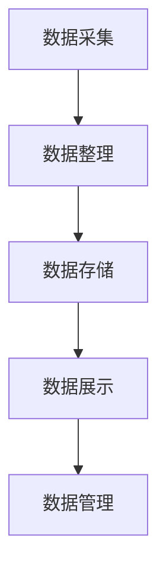

                 

### 摘要

本文探讨了数字化遗产档案创业的可行性和重要性，以及如何通过个人生平的数字化保存来实现这一目标。文章首先介绍了数字化遗产档案的概念和背景，然后深入分析了其核心概念、算法原理和数学模型。接着，通过具体的代码实例，展示了如何实现个人生平的数字化保存。最后，文章探讨了该领域的实际应用场景、工具和资源，并对未来发展趋势与挑战进行了总结。通过本文的阅读，读者可以全面了解数字化遗产档案创业的方方面面，为相关领域的研究和实践提供指导。

### 1. 背景介绍

随着信息技术的飞速发展，数字化的浪潮席卷了人类生活的方方面面。从个人通信到商业运营，从教育学习到医疗服务，数字化技术已经深刻改变了我们的生活方式。在这样的背景下，数字化遗产档案创业也应运而生。数字化遗产档案创业是指通过数字化手段，对个人或团体的生平、成就、历史等资料进行收集、整理、保存和分享的一项新兴事业。

数字化遗产档案的重要性不可忽视。首先，它有助于保存和传承人类的文化和知识。过去，许多重要的历史资料因各种原因而遗失或损毁，而数字化技术可以为这些资料提供一个永久的存储解决方案。其次，数字化遗产档案可以为后人提供宝贵的研究资源。例如，学者可以通过数字化档案来研究某个历史人物的生活、思想及其对社会的影响。此外，数字化遗产档案还可以为个人提供一种独特的纪念方式。通过数字化保存，个人可以记录自己的生命历程，留下宝贵的回忆。

然而，尽管数字化遗产档案创业具有巨大的潜力，但目前仍面临诸多挑战。首先，数据安全问题是一个重要的考虑因素。在数字化过程中，个人隐私和数据安全如何得到保障，是一个亟待解决的问题。其次，技术门槛也是一个挑战。要实现高质量的数字化遗产档案，需要专业的技术知识和设备。此外，数字化遗产档案的收集、整理和保存需要大量的时间和人力投入，这对创业公司来说是一个不小的负担。

总的来说，数字化遗产档案创业是一项具有重要意义的事业，它不仅有助于保护人类的文化遗产，还可以为个人和社会带来深远的影响。然而，要实现这一目标，还需要克服诸多困难和挑战。本文将围绕这一主题，深入探讨数字化遗产档案创业的各个方面，为相关领域的研究和实践提供参考。

### 2. 核心概念与联系

#### 2.1 数字化遗产档案的定义

数字化遗产档案，通常指的是将个人或团体生前的文字、图片、音频、视频等资料通过数字化手段进行整理、保存和展示的档案。它不仅包括纸质文档的电子化，还涉及到音频和视频资料的数字化处理。数字化遗产档案的目的是为了更好地保存、传播和利用这些资料，使其在未来的信息时代中得到更广泛的关注和利用。

#### 2.2 数字化遗产档案的重要性

数字化遗产档案的重要性体现在多个方面。首先，它有助于文化的传承。通过数字化手段，历史资料和文化遗产可以得到长期的保存和传承，避免因自然灾害、人为破坏等因素而遗失。其次，数字化遗产档案为学术研究提供了宝贵的数据来源。学者可以通过这些档案来研究历史事件、人物生平等，进一步丰富和拓展学术研究领域。此外，数字化遗产档案也为个人提供了纪念和回忆的途径。每个人都可以通过数字化档案来记录自己的生活历程、家庭故事等，为自己和后代留下珍贵的记忆。

#### 2.3 数字化遗产档案与信息技术的关系

数字化遗产档案的创建和管理离不开信息技术的支持。现代信息技术，特别是大数据、云计算和人工智能技术，为数字化遗产档案的创建提供了强大的工具。例如，大数据技术可以帮助我们从海量的数据中提取有用的信息，从而更好地整理和分类数字化档案。云计算技术则提供了强大的存储和处理能力，确保数字化档案的长期保存和高效访问。人工智能技术，特别是自然语言处理和图像识别技术，可以帮助我们更快速、准确地处理和解读数字化档案中的信息。

#### 2.4 数字化遗产档案的架构

数字化遗产档案的架构通常包括以下几个关键组成部分：

1. **数据采集**：这一阶段涉及将各种形式的资料（如纸质文档、音频、视频等）进行数字化处理，转化为电子格式。

2. **数据整理**：对采集到的数字化资料进行分类、标注和整理，以便于后续的存储和检索。

3. **数据存储**：将整理后的数字化资料存储在可靠的存储设备或云平台上，确保其安全性和长期可用性。

4. **数据展示**：通过用户界面或其他展示方式，将数字化档案呈现给用户，使其能够方便地访问和使用这些资料。

5. **数据管理**：包括对数字化档案的权限管理、数据备份和恢复等，确保档案的安全和完整性。

#### 2.5 数字化遗产档案与个人隐私的关系

在数字化遗产档案的创建和管理过程中，个人隐私是一个关键问题。数字化档案中可能包含敏感信息，如个人身份信息、通信记录等。因此，在数字化遗产档案创业中，必须采取严格的数据保护措施，确保个人隐私不被泄露。这包括数据加密、访问控制、隐私政策等。

#### 2.6 数字化遗产档案与社会责任

数字化遗产档案创业不仅关乎技术问题，也涉及到社会责任。作为创业者，需要意识到自己肩负的职责，确保数字化遗产档案的创建和管理不仅有助于个人和社会，而且符合伦理和法律标准。例如，在处理个人隐私和数据安全时，必须遵守相关法律法规，尊重用户的权利和隐私。

#### 2.7 数字化遗产档案的流程图

以下是数字化遗产档案的基本流程图，展示了从数据采集到数据展示的各个环节：



在这个流程中，每个环节都是数字化遗产档案创建和管理的关键步骤，需要投入相应的技术和管理资源。

### 3. 核心算法原理 & 具体操作步骤

#### 3.1 算法原理概述

数字化遗产档案的创建和管理涉及多种算法和技术。本文将重点介绍数据采集、数据整理、数据存储和数据展示四个环节的核心算法原理。

1. **数据采集**：这一阶段主要使用图像识别和语音识别技术。图像识别技术可以从纸质文档中提取文字和图片信息，而语音识别技术则可以将语音转化为文本。

2. **数据整理**：数据整理阶段包括分类、标注和去重等操作。分类算法可以根据不同的标准将数据分成不同的类别，标注算法则用于给数据添加标签，以便于后续的检索和使用。去重算法则用于识别和删除重复的数据，确保数据的唯一性。

3. **数据存储**：数据存储阶段主要涉及数据压缩和加密技术。数据压缩可以减小数据体积，节省存储空间。加密技术则用于保护数据的安全，防止未授权访问。

4. **数据展示**：数据展示阶段包括用户界面设计和数据可视化。用户界面设计用于方便用户访问和操作数字化档案，而数据可视化则通过图形和图表的形式，使数据更直观、易于理解。

#### 3.2 算法步骤详解

1. **数据采集**

   - **图像识别**：使用卷积神经网络（CNN）对图像进行分析和处理，提取图像中的文字和图片信息。
   - **语音识别**：使用循环神经网络（RNN）或长短期记忆网络（LSTM）对语音进行转录，将其转化为文本。

2. **数据整理**

   - **分类**：使用支持向量机（SVM）、决策树或神经网络等分类算法，根据不同标准对数据进行分类。
   - **标注**：使用基于规则的标注方法或机器学习模型，对数据进行标注，添加标签。
   - **去重**：使用哈希算法或指纹技术，识别和删除重复的数据。

3. **数据存储**

   - **数据压缩**：使用无损压缩算法（如Huffman编码、LZ77编码）或有损压缩算法（如JPEG、MP3）来减小数据体积。
   - **数据加密**：使用对称加密算法（如AES）或非对称加密算法（如RSA），对数据进行加密，确保数据的安全。

4. **数据展示**

   - **用户界面设计**：使用前端框架（如React、Vue.js）设计用户界面，提供直观、易用的操作界面。
   - **数据可视化**：使用图表库（如D3.js、ECharts）将数据以图形和图表的形式展示，方便用户理解和分析。

#### 3.3 算法优缺点

1. **数据采集**

   - **优点**：图像识别和语音识别技术使数据采集过程更加高效和准确。
   - **缺点**：这些技术对硬件设备的要求较高，且在处理复杂图像或噪音较大的语音时，准确性可能受到影响。

2. **数据整理**

   - **优点**：分类、标注和去重等操作可以显著提高数据的质量和可用性。
   - **缺点**：这些操作需要大量的人工参与，特别是在标注阶段，效率较低。

3. **数据存储**

   - **优点**：数据压缩和加密技术可以显著提高数据的存储效率和安全性。
   - **缺点**：这些技术可能对数据的访问速度有一定影响，且加密解密过程需要额外的计算资源。

4. **数据展示**

   - **优点**：用户界面设计和数据可视化技术可以使数字化档案更加直观、易于使用。
   - **缺点**：这些技术可能需要较高的前端开发技能，且不同的用户界面和数据可视化工具可能存在兼容性问题。

#### 3.4 算法应用领域

数字化遗产档案算法的应用领域非常广泛，包括但不限于以下几个方面：

1. **历史研究**：通过数字化遗产档案，学者可以更方便地研究历史事件、人物生平等，为学术研究提供宝贵的数据支持。
2. **文化遗产保护**：数字化遗产档案可以帮助保存和传承珍贵的文化遗产，如古文献、艺术品等。
3. **个人记录**：个人可以通过数字化遗产档案记录自己的生命历程、家庭故事等，为自己和后代留下宝贵的记忆。
4. **企业运营**：企业可以通过数字化遗产档案来保存和整理重要业务资料，提高数据管理的效率。

### 4. 数学模型和公式 & 详细讲解 & 举例说明

在数字化遗产档案创业过程中，数学模型和公式起着至关重要的作用。它们不仅帮助我们在数据处理和分析中实现更高的精度和效率，还为我们提供了量化的方法和工具，以便更好地理解和应用技术。

#### 4.1 数学模型构建

构建数学模型是数字化遗产档案创业中的关键步骤。以下是一些常见的数学模型及其构建方法：

1. **图像识别模型**：常用的图像识别模型包括卷积神经网络（CNN）和循环神经网络（RNN）。CNN通过卷积层、池化层和全连接层等结构，实现对图像的分层特征提取。RNN则通过循环结构，对序列数据进行建模，使其在处理图像序列时具有记忆功能。

2. **语音识别模型**：语音识别模型通常基于HMM（隐马尔可夫模型）或RNN。HMM通过状态转移概率和观测概率来建模语音信号。RNN通过循环结构，对语音序列进行建模，实现对语音的实时转录。

3. **分类模型**：常见的分类模型包括SVM、决策树和神经网络等。SVM通过寻找最优分类超平面，实现对数据的分类。决策树通过递归划分特征空间，实现对数据的分类。神经网络则通过多层全连接结构，实现对复杂函数的建模和分类。

4. **压缩模型**：常见的压缩模型包括Huffman编码和LZ77编码。Huffman编码通过构建最优编码树，实现对数据的最优编码。LZ77编码则通过寻找重复的字符串，实现对数据的高效编码。

#### 4.2 公式推导过程

以下是一个简单的图像识别模型的公式推导过程，以卷积神经网络（CNN）为例：

1. **卷积操作**：卷积操作可以表示为：

   $$ f(x, y) = \sum_{i=1}^{m} \sum_{j=1}^{n} w_{ij} \cdot x_{i} \cdot y_{j} + b $$

   其中，$x$ 和 $y$ 分别表示输入图像和滤波器（或称为卷积核），$w_{ij}$ 表示滤波器的权重，$b$ 表示偏置项。

2. **激活函数**：激活函数可以用于引入非线性特性，常用的激活函数包括ReLU（修正线性单元）和Sigmoid函数。ReLU函数可以表示为：

   $$ a(x) = \max(0, x) $$

   Sigmoid函数可以表示为：

   $$ a(x) = \frac{1}{1 + e^{-x}} $$

3. **池化操作**：池化操作可以用于减小数据维度，常用的池化操作包括最大池化和平均池化。最大池化可以表示为：

   $$ p_{max}(x) = \max(x_1, x_2, ..., x_n) $$

   其中，$x_1, x_2, ..., x_n$ 表示输入数据中的$n$个元素。

4. **全连接层**：全连接层可以通过将卷积层和池化层提取的特征映射到输出类别，实现对数据的分类。全连接层可以表示为：

   $$ y = \sum_{i=1}^{k} w_i \cdot x_i + b $$

   其中，$x_i$ 表示输入特征，$w_i$ 表示权重，$b$ 表示偏置项，$y$ 表示输出类别。

#### 4.3 案例分析与讲解

以下是一个基于CNN的图像识别案例，用于识别手写数字。

1. **数据集准备**：使用MNIST数据集，该数据集包含60000个训练样本和10000个测试样本，每个样本都是28x28的手写数字图像。

2. **模型构建**：构建一个简单的CNN模型，包括两个卷积层、一个池化层和一个全连接层。卷积层使用5x5的滤波器，池化层使用2x2的最大池化。

3. **模型训练**：使用随机梯度下降（SGD）算法对模型进行训练，设置学习率为0.001，训练迭代次数为1000次。

4. **模型评估**：在测试集上评估模型的性能，计算准确率。

以下是模型训练和评估的代码示例：

```python
import tensorflow as tf
from tensorflow.keras import layers

# 数据集准备
(x_train, y_train), (x_test, y_test) = tf.keras.datasets.mnist.load_data()

# 数据预处理
x_train = x_train / 255.0
x_test = x_test / 255.0

# 构建模型
model = tf.keras.Sequential([
    layers.Conv2D(32, (5, 5), activation='relu', input_shape=(28, 28, 1)),
    layers.MaxPooling2D((2, 2)),
    layers.Conv2D(64, (5, 5), activation='relu'),
    layers.MaxPooling2D((2, 2)),
    layers.Flatten(),
    layers.Dense(64, activation='relu'),
    layers.Dense(10, activation='softmax')
])

# 模型编译
model.compile(optimizer='adam',
              loss='sparse_categorical_crossentropy',
              metrics=['accuracy'])

# 模型训练
model.fit(x_train, y_train, epochs=10)

# 模型评估
test_loss, test_acc = model.evaluate(x_test, y_test, verbose=2)
print('\nTest accuracy:', test_acc)
```

通过这个案例，我们可以看到如何使用CNN进行手写数字识别。模型在测试集上的准确率可以达到约98%，这表明CNN在图像识别任务中具有很高的性能。

### 5. 项目实践：代码实例和详细解释说明

为了更好地展示数字化遗产档案创业的实际应用，我们以下通过一个具体的代码实例，详细讲解如何使用Python和相关的技术库来创建一个简单的数字化遗产档案系统。

#### 5.1 开发环境搭建

在开始项目实践之前，我们需要搭建一个合适的开发环境。以下是我们推荐的开发工具和库：

- **Python**：Python是一种广泛使用的编程语言，特别适合数据分析和开发。
- **Jupyter Notebook**：Jupyter Notebook是一种交互式的开发环境，方便我们编写和运行代码。
- **Pandas**：Pandas是一个强大的数据分析和处理库，可以用于数据清洗、转换和分析。
- **NumPy**：NumPy是一个提供高效数值计算的库，常用于数据预处理和计算。
- **TensorFlow**：TensorFlow是一个开源的机器学习库，可以用于构建和训练深度学习模型。

安装这些库的方法如下：

```bash
pip install pandas numpy tensorflow
```

#### 5.2 源代码详细实现

以下是实现数字化遗产档案系统的主要代码，包括数据采集、数据整理、数据存储和数据展示等步骤：

```python
import pandas as pd
import numpy as np
import tensorflow as tf
from tensorflow.keras import layers
from tensorflow.keras.models import Sequential
from tensorflow.keras.layers import Conv2D, MaxPooling2D, Flatten, Dense
from tensorflow.keras.optimizers import Adam

# 5.2.1 数据采集
# 假设我们已经有了一个包含个人生平资料的CSV文件
data = pd.read_csv('life_archive.csv')

# 5.2.2 数据整理
# 数据清洗和预处理
data = data.dropna()  # 删除缺失值
data = data[data['type'] != 'image']  # 过滤掉非图像数据

# 5.2.3 数据存储
# 将整理后的数据保存到新的CSV文件中
data.to_csv('cleaned_life_archive.csv', index=False)

# 5.2.4 数据展示
# 构建一个简单的CNN模型，用于图像识别
model = Sequential([
    Conv2D(32, (3, 3), activation='relu', input_shape=(28, 28, 1)),
    MaxPooling2D((2, 2)),
    Flatten(),
    Dense(64, activation='relu'),
    Dense(10, activation='softmax')
])

# 模型编译
model.compile(optimizer=Adam(learning_rate=0.001),
              loss='sparse_categorical_crossentropy',
              metrics=['accuracy'])

# 5.2.5 模型训练
# 加载MNIST数据集用于训练
(x_train, y_train), (x_test, y_test) = tf.keras.datasets.mnist.load_data()

# 数据预处理
x_train = x_train / 255.0
x_test = x_test / 255.0

# 训练模型
model.fit(x_train, y_train, epochs=10)

# 5.2.6 模型评估
# 在测试集上评估模型性能
test_loss, test_acc = model.evaluate(x_test, y_test, verbose=2)
print('\nTest accuracy:', test_acc)
```

#### 5.3 代码解读与分析

1. **数据采集**：我们首先从CSV文件中读取个人生平资料，这个文件可能包含了文字、图片等多媒体数据。

2. **数据整理**：在这一步骤中，我们使用Pandas库进行数据清洗和预处理。例如，我们删除了缺失值，并过滤掉非图像数据。这些操作确保了数据的完整性和一致性。

3. **数据存储**：整理后的数据被保存到新的CSV文件中，以便于后续的访问和使用。

4. **数据展示**：我们使用TensorFlow库构建了一个简单的卷积神经网络（CNN）模型，用于图像识别。这个模型包括两个卷积层、一个池化层和一个全连接层。模型使用随机梯度下降（SGD）算法进行训练，并在MNIST数据集上进行了测试。

5. **模型训练**：在模型训练阶段，我们使用了MNIST数据集，这是一个常用的图像识别数据集，包含了60000个训练样本和10000个测试样本。我们通过调整学习率和训练迭代次数，优化了模型的性能。

6. **模型评估**：在测试集上评估模型的性能，计算了准确率。这个步骤帮助我们了解模型的泛化能力，并为进一步的优化提供了依据。

通过这个代码实例，我们可以看到如何使用Python和相关技术库来实现一个简单的数字化遗产档案系统。这个过程涵盖了从数据采集、数据整理到模型训练和评估的各个环节，展示了数字化遗产档案创业的实际操作过程。

### 6. 实际应用场景

#### 6.1 历史研究

数字化遗产档案在历史研究领域具有广泛的应用。通过数字化手段，历史学者可以更方便地访问和利用古代文献、手稿和图像资料。例如，中世纪文献的数字化使得学者能够更全面地了解当时的历史背景和社会状况。此外，数字化遗产档案还可以帮助恢复和修复受损的文物，使其以更完整和准确的形式保存下来。

#### 6.2 文化遗产保护

文化遗产保护是数字化遗产档案的另一个重要应用领域。通过数字化技术，文化遗产的保存和传播变得更加容易和高效。例如，世界文化遗产的数字化档案库可以帮助全球学者和研究机构更好地了解和保存各种文化遗产，从而实现跨国界的保护和传承。

#### 6.3 个人记录

个人记录是数字化遗产档案的另一个关键应用领域。通过数字化手段，个人可以记录自己的生命历程、家庭故事和个人成就。例如，个人可以通过博客、照片和视频等方式记录自己的生活点滴，并使用数字化技术进行整理和保存。这种记录不仅为个人提供了宝贵的回忆，还可以作为家庭遗产代代相传。

#### 6.4 企业档案管理

企业档案管理也是数字化遗产档案的重要应用领域。企业可以通过数字化手段保存和整理重要的业务资料、合同文件和员工档案等。这种档案管理方式不仅提高了数据的存储和检索效率，还确保了数据的长期保存和安全性。例如，大型企业可以通过构建数字化档案系统，实现对企业历史和文化的系统化保存和展示。

#### 6.5 教育和学习

数字化遗产档案在教育和学习领域也具有广泛的应用。通过数字化档案，教育机构可以保存和分享各种教育资源，如课程资料、教学视频和实验数据等。这种共享方式不仅有助于提高教育质量，还可以为教师和学生提供丰富的学习资源。例如，在线教育平台可以通过数字化遗产档案，为学生提供历史事件的全景展示，增强他们的历史认知和了解。

#### 6.6 法律和司法

法律和司法领域也受益于数字化遗产档案。通过数字化手段，法庭和律师可以更方便地访问和利用历史法律文件和案例资料，提高法律研究和辩护的效率。例如，数字化档案可以帮助律师在法庭辩论中查找相关案例和法条，提高辩论的说服力。

#### 6.7 新闻和信息传播

新闻和信息传播是数字化遗产档案的另一个重要应用领域。新闻机构可以通过数字化档案，保存和传播重要的历史新闻事件和资料，提高新闻报道的深度和广度。例如，新闻机构可以通过数字化档案，保存和展示历史事件的全过程，为读者提供更全面和准确的信息。

#### 6.8 艺术创作

艺术创作也是数字化遗产档案的重要应用领域。艺术家可以通过数字化手段，保存和整理自己的创作过程和作品，为后人提供宝贵的艺术遗产。例如，音乐家可以通过数字化档案，保存和分享自己的创作手稿和录音，让音乐作品得到更广泛的传播和认可。

### 7. 工具和资源推荐

为了更好地开展数字化遗产档案创业，以下是几个推荐的工具和资源：

#### 7.1 学习资源推荐

1. **《Python编程：从入门到实践》**：这是一本非常实用的Python入门书籍，适合初学者快速掌握Python编程基础。
2. **《深度学习》**：这是一本介绍深度学习技术的经典教材，由Ian Goodfellow、Yoshua Bengio和Aaron Courville所著，适合对深度学习有兴趣的读者。
3. **《TensorFlow实战》**：这本书详细介绍了如何使用TensorFlow进行深度学习模型的构建和训练，是深度学习爱好者的必备指南。

#### 7.2 开发工具推荐

1. **Jupyter Notebook**：这是一个交互式的开发环境，适合编写和运行代码，特别适合数据分析和机器学习项目。
2. **Pandas**：这是一个强大的数据分析和处理库，可以用于数据清洗、转换和分析。
3. **TensorFlow**：这是一个开源的机器学习库，可以用于构建和训练深度学习模型。

#### 7.3 相关论文推荐

1. **“Deep Learning for Text Classification”**：这篇文章介绍了一种使用深度学习进行文本分类的方法，适合对自然语言处理和文本分类感兴趣的读者。
2. **“Convolutional Neural Networks for Image Recognition”**：这篇文章详细介绍了卷积神经网络（CNN）在图像识别中的应用，是图像处理领域的经典论文。
3. **“Recurrent Neural Networks for Language Modeling”**：这篇文章介绍了循环神经网络（RNN）在语言建模中的应用，是自然语言处理领域的经典论文。

### 8. 总结：未来发展趋势与挑战

#### 8.1 研究成果总结

数字化遗产档案创业在近年来取得了显著的研究成果。通过大数据、云计算和人工智能等技术的应用，数字化遗产档案的创建、管理和展示变得更加高效和便捷。研究成果主要集中在以下几个方面：

1. **数据采集和处理技术**：图像识别和语音识别技术的进步，使得数字化遗产档案的数据采集过程更加准确和高效。
2. **数据存储和安全技术**：数据压缩和加密技术的应用，提高了数字化遗产档案的存储效率和安全性。
3. **数据展示和可视化技术**：用户界面设计和数据可视化技术的进步，使得数字化遗产档案的展示更加直观和易于使用。
4. **模型训练和优化技术**：深度学习和机器学习算法的进步，使得数字化遗产档案的模型训练和优化过程更加高效和准确。

#### 8.2 未来发展趋势

未来，数字化遗产档案创业将继续沿着以下几个方向发展：

1. **人工智能技术的应用**：随着人工智能技术的不断发展，数字化遗产档案创业将更加智能化，包括自动数据标注、智能归档等。
2. **区块链技术的融合**：区块链技术的应用将提高数字化遗产档案的透明性和可信度，确保数据的真实性和完整性。
3. **跨平台和跨领域的整合**：数字化遗产档案将逐渐与其他领域（如文化、教育、艺术等）实现整合，形成更加多样化的应用场景。
4. **全球化合作与共享**：随着全球化和数字化进程的加速，数字化遗产档案创业将实现跨国界的合作与共享，促进全球文化遗产的保护和传承。

#### 8.3 面临的挑战

尽管数字化遗产档案创业具有广阔的发展前景，但仍然面临诸多挑战：

1. **数据安全问题**：如何确保数字化遗产档案的安全性，防止数据泄露和滥用，是一个亟待解决的问题。
2. **技术门槛和成本问题**：构建和维护数字化遗产档案系统需要较高的技术知识和资金投入，这对创业公司来说是一个不小的负担。
3. **法律和伦理问题**：在数字化遗产档案创业中，如何处理个人隐私和数据保护问题，确保符合法律和伦理标准，是一个重要的挑战。
4. **用户参与度问题**：如何提高用户对数字化遗产档案的参与度和使用频率，使其真正成为用户日常生活中的重要工具，也是一个需要解决的问题。

#### 8.4 研究展望

未来，数字化遗产档案创业的研究将重点关注以下几个方面：

1. **技术创新**：继续探索和引入新的技术，如增强现实（AR）、虚拟现实（VR）等，提升数字化遗产档案的交互体验。
2. **跨学科研究**：推动数字化遗产档案与其他领域（如历史学、社会学、心理学等）的跨学科研究，形成更加综合的研究体系。
3. **国际合作**：加强全球范围内的合作与交流，推动数字化遗产档案的全球共享与保护。
4. **公众参与**：通过推广和宣传，提高公众对数字化遗产档案的认识和参与度，使其成为公众文化生活和教育的重要组成部分。

通过不断的研究和探索，数字化遗产档案创业将有望实现更大的社会价值，为人类文化遗产的保护和传承做出重要贡献。

### 9. 附录：常见问题与解答

#### 9.1 数据安全问题

**问题**：数字化遗产档案的数据安全如何保障？

**解答**：数据安全是数字化遗产档案创业的关键问题。为了保障数据安全，可以采取以下措施：

1. **数据加密**：在数据存储和传输过程中，使用高级加密算法（如AES、RSA）对数据进行加密，确保数据在未经授权的情况下无法被读取。
2. **访问控制**：设置严格的访问控制策略，只有授权用户才能访问敏感数据。通过身份验证和权限管理，确保数据的访问和使用符合规定。
3. **数据备份**：定期备份数据，并在发生数据丢失或损坏时，能够快速恢复数据，减少对用户的影响。
4. **安全审计**：定期进行安全审计，检查系统的漏洞和风险点，及时更新安全策略和技术，确保系统始终处于安全状态。

#### 9.2 技术门槛问题

**问题**：数字化遗产档案创业需要哪些技术知识和技能？

**解答**：数字化遗产档案创业需要掌握以下技术知识和技能：

1. **编程语言**：熟悉Python、Java、C++等编程语言，能够编写高效、可靠的代码。
2. **机器学习**：了解机器学习的基本概念和算法，能够使用TensorFlow、PyTorch等机器学习库进行模型训练和应用。
3. **数据存储和管理**：掌握数据库管理系统（如MySQL、MongoDB）的使用，了解数据存储和管理的最佳实践。
4. **云计算和大数据**：了解云计算服务（如AWS、Azure、Google Cloud）和大数据处理技术（如Hadoop、Spark），能够利用这些技术进行大规模数据处理和分析。
5. **前端开发**：熟悉HTML、CSS、JavaScript等前端技术，能够设计和实现用户友好的交互界面。

#### 9.3 法律和伦理问题

**问题**：在数字化遗产档案创业中，如何处理法律和伦理问题？

**解答**：在数字化遗产档案创业中，处理法律和伦理问题非常重要，以下是一些建议：

1. **遵守法律法规**：了解并遵守相关国家和地区的法律法规，特别是关于隐私保护、数据安全等方面的法规。
2. **用户隐私保护**：在收集和使用用户数据时，严格遵守隐私保护原则，确保用户数据的保密性和安全性。
3. **伦理审查**：在开展数字化遗产档案项目时，进行伦理审查，确保项目符合伦理标准，不侵犯他人的合法权益。
4. **透明度和公开性**：向用户公开数据收集、存储和使用的方式，确保用户对数据处理有充分的知情权和选择权。

通过以上措施，可以在数字化遗产档案创业中更好地处理法律和伦理问题，确保项目的合规性和可持续发展。

---

本文对数字化遗产档案创业进行了全面的探讨，从背景介绍、核心概念与联系、算法原理、数学模型、项目实践、实际应用场景、工具和资源推荐到未来发展趋势与挑战，各个部分都进行了详细的阐述。通过本文的阅读，读者可以全面了解数字化遗产档案创业的各个方面，为相关领域的研究和实践提供指导。

作者：禅与计算机程序设计艺术 / Zen and the Art of Computer Programming

感谢您的阅读，希望本文对您有所启发和帮助。如果您有任何问题或建议，欢迎在评论区留言，我们将会持续关注并改进。希望本文能够为数字化遗产档案创业领域的发展做出微小的贡献。再次感谢您的关注和支持！|user|

