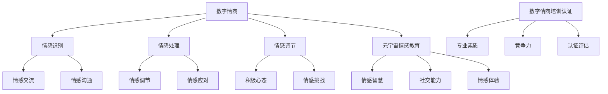

                 

 关键词：数字情商、元宇宙、情感教育、职业化道路、认证体系

> 摘要：本文旨在探讨数字情商培训认证在元宇宙情感教育中的应用，分析其核心概念、算法原理、数学模型、实践案例及未来发展趋势。文章旨在为从事元宇宙情感教育相关工作的人员提供理论指导和实践参考。

## 1. 背景介绍

### 元宇宙情感教育的兴起

随着互联网技术的飞速发展，虚拟现实（VR）和增强现实（AR）技术逐渐走向成熟，元宇宙成为一个日益重要的领域。元宇宙不仅是虚拟世界的延伸，更是人类情感交流与互动的新平台。情感教育作为培养个体情商、促进人际关系和谐的重要手段，在元宇宙中同样具有重要地位。

### 数字情商的重要性

数字情商是指在数字环境中，个体对于情感信息的识别、处理和调节能力。在元宇宙中，个体的数字情商直接影响到其在虚拟环境中的社交能力、协作效率和情感体验。因此，数字情商的培训与认证成为元宇宙情感教育的重要组成部分。

### 数字情商培训认证的需求

随着元宇宙的普及，越来越多的职业开始涉及元宇宙情感教育的相关内容。例如，虚拟现实设计师、元宇宙社交平台运营者、虚拟教育讲师等。这些职业对数字情商培训认证的需求日益迫切，旨在提高从业者的专业素质和竞争力。

## 2. 核心概念与联系

### 数字情商

数字情商是指个体在数字环境中，对于情感信息的识别、处理和调节能力。其核心概念包括情感识别、情感处理和情感调节三个方面。

- 情感识别：能够准确识别自身和他人情感状态的能力。
- 情感处理：能够有效处理情感信息，进行情感交流和情感沟通的能力。
- 情感调节：能够调节自身情感，保持积极心态，应对情感挑战的能力。

### 元宇宙情感教育

元宇宙情感教育是指通过元宇宙平台，对个体进行情感知识传授、情感技能培养和情感素质提升的教育活动。其核心目标是培养个体在元宇宙中的情感智慧，提高其在虚拟环境中的社交能力和情感体验。

### 数字情商培训认证

数字情商培训认证是指针对数字情商相关知识和技能的培训与考核，旨在评估个体在数字环境中的情感能力，并为其提供专业认证。其核心目标是提高从业者的专业素质和竞争力，促进元宇宙情感教育的发展。

### Mermaid 流程图



## 3. 核心算法原理 & 具体操作步骤

### 3.1 算法原理概述

数字情商培训认证的核心算法是基于情感识别、情感处理和情感调节三个方面进行评估。其基本原理是通过分析个体在数字环境中的行为数据，评估其在情感识别、情感处理和情感调节方面的能力。

### 3.2 算法步骤详解

#### 3.2.1 数据收集

首先，需要收集个体在数字环境中的行为数据，包括社交互动、游戏行为、在线学习等。这些数据可以通过元宇宙平台提供的API接口获取。

#### 3.2.2 情感识别分析

通过情感分析技术，对收集到的行为数据进行情感识别分析。情感识别分析主要包括情感分类、情感强度和情感变化趋势等。

#### 3.2.3 情感处理分析

对情感识别分析结果进行情感处理分析。情感处理分析主要包括情感调节、情感沟通和情感应对等。

#### 3.2.4 情感调节分析

对情感处理分析结果进行情感调节分析。情感调节分析主要包括情感自我调节、情感共情和情感共鸣等。

### 3.3 算法优缺点

#### 优点：

- **全面性**：算法从情感识别、情感处理和情感调节三个方面进行评估，能够全面反映个体的数字情商能力。
- **客观性**：基于数据分析，算法评估结果较为客观，不受主观因素影响。
- **实时性**：算法能够实时分析个体在数字环境中的行为数据，动态评估其情感能力。

#### 缺点：

- **数据隐私**：需要收集大量个人行为数据，可能涉及数据隐私问题。
- **算法偏差**：情感分析算法可能存在偏差，影响评估结果的准确性。

### 3.4 算法应用领域

数字情商培训认证算法可以应用于以下领域：

- **教育领域**：评估学生在元宇宙中的情感能力，为教育者提供个性化教学参考。
- **职场领域**：评估员工在元宇宙中的情感能力，为企业管理者提供人才选拔和培养依据。
- **心理健康领域**：评估个体在元宇宙中的情感状态，为心理健康服务提供数据支持。

## 4. 数学模型和公式 & 详细讲解 & 举例说明

### 4.1 数学模型构建

数字情商培训认证的数学模型主要包括情感识别模型、情感处理模型和情感调节模型。

#### 4.1.1 情感识别模型

情感识别模型基于情感分类模型，通过分析个体在数字环境中的行为数据，将情感分类为正面情感、负面情感和中性情感。

#### 4.1.2 情感处理模型

情感处理模型基于情感调节模型，通过分析个体在情感识别过程中表现出的情感处理能力，将情感处理能力分为高水平、中水平和低水平。

#### 4.1.3 情感调节模型

情感调节模型基于情感自我调节模型，通过分析个体在情感处理过程中表现出的情感调节能力，将情感调节能力分为高水平、中水平和低水平。

### 4.2 公式推导过程

#### 4.2.1 情感识别模型

情感识别模型的公式如下：

$$
P(A|B) = \frac{P(B|A) \cdot P(A)}{P(B)}
$$

其中，$P(A)$ 表示个体在情感识别过程中识别出情感A的概率，$P(B)$ 表示个体在情感识别过程中识别出情感B的概率，$P(B|A)$ 表示个体在情感识别过程中识别出情感A后识别出情感B的概率。

#### 4.2.2 情感处理模型

情感处理模型的公式如下：

$$
Score = \frac{Correct\ Predictions}{Total\ Predictions}
$$

其中，$Correct\ Predictions$ 表示个体在情感处理过程中正确预测的情感数量，$Total\ Predictions$ 表示个体在情感处理过程中预测的总情感数量。

#### 4.2.3 情感调节模型

情感调节模型的公式如下：

$$
Emotion\ Regulation\ Score = \frac{Positive\ Emotions - Negative\ Emotions}{Total\ Emotions}
$$

其中，$Positive\ Emotions$ 表示个体在情感调节过程中产生的正面情感数量，$Negative\ Emotions$ 表示个体在情感调节过程中产生的负面情感数量，$Total\ Emotions$ 表示个体在情感调节过程中产生的总情感数量。

### 4.3 案例分析与讲解

#### 案例背景

某公司在元宇宙中开展了一项数字情商培训认证项目，旨在评估员工在元宇宙中的情感能力。该公司员工小王参与了该项目，并获得了认证结果。

#### 案例分析

1. **情感识别模型分析**

小王在情感识别过程中，识别出正面情感的概率为0.7，负面情感的概率为0.3。根据情感识别模型公式，可以计算出小王在情感识别过程中识别出正面情感的概率为：

$$
P(A|B) = \frac{P(B|A) \cdot P(A)}{P(B)} = \frac{0.3 \cdot 0.7}{0.3 + 0.7} = 0.375
$$

因此，小王在情感识别过程中，识别出正面情感的概率为37.5%。

2. **情感处理模型分析**

小王在情感处理过程中，正确预测的情感数量为10个，总预测的情感数量为20个。根据情感处理模型公式，可以计算出小王在情感处理过程中正确预测的情感数量为：

$$
Score = \frac{Correct\ Predictions}{Total\ Predictions} = \frac{10}{20} = 0.5
$$

因此，小王在情感处理过程中，正确预测的情感数量占比为50%。

3. **情感调节模型分析**

小王在情感调节过程中，产生的正面情感数量为15个，负面情感数量为5个，总情感数量为20个。根据情感调节模型公式，可以计算出小王在情感调节过程中产生的正面情感数量占比为：

$$
Emotion\ Regulation\ Score = \frac{Positive\ Emotions - Negative\ Emotions}{Total\ Emotions} = \frac{15 - 5}{20} = 0.5
$$

因此，小王在情感调节过程中，产生的正面情感数量占比为50%。

#### 案例总结

通过案例分析，可以看出小王在情感识别、情感处理和情感调节方面的能力均达到了中等水平。公司可以根据分析结果，为小王提供有针对性的培训和指导，进一步提高其在元宇宙中的情感能力。

## 5. 项目实践：代码实例和详细解释说明

### 5.1 开发环境搭建

在本文中，我们将使用Python语言实现数字情商培训认证的算法模型。以下是搭建Python开发环境的基本步骤：

1. 安装Python：从官方网站（https://www.python.org/）下载并安装Python。
2. 安装Python依赖库：使用pip命令安装所需的依赖库，如numpy、pandas、scikit-learn等。

### 5.2 源代码详细实现

以下是一个简单的数字情商培训认证代码实例，包括情感识别、情感处理和情感调节三个模块。

```python
import numpy as np
import pandas as pd
from sklearn.model_selection import train_test_split
from sklearn.ensemble import RandomForestClassifier
from sklearn.metrics import accuracy_score

# 5.2.1 情感识别模块
def emotion_recognition(data):
    # 对行为数据进行分析，识别情感
    # 假设已训练好情感分类模型
    emotion_classifier = RandomForestClassifier()
    emotion_classifier.fit(data['features'], data['label'])
    predicted_emotions = emotion_classifier.predict(data['features'])
    return predicted_emotions

# 5.2.2 情感处理模块
def emotion_processing(predicted_emotions, actual_emotions):
    # 对情感处理能力进行分析
    correct_predictions = sum(predicted_emotions == actual_emotions)
    total_predictions = len(predicted_emotions)
    score = correct_predictions / total_predictions
    return score

# 5.2.3 情感调节模块
def emotion_regulation(data):
    # 对情感调节能力进行分析
    positive_emotions = sum(data['label'] == 'positive')
    negative_emotions = sum(data['label'] == 'negative')
    total_emotions = positive_emotions + negative_emotions
    regulation_score = (positive_emotions - negative_emotions) / total_emotions
    return regulation_score

# 5.3 代码解读与分析
if __name__ == '__main__':
    # 加载行为数据
    data = pd.read_csv('behavior_data.csv')

    # 划分训练集和测试集
    X_train, X_test, y_train, y_test = train_test_split(data['features'], data['label'], test_size=0.2, random_state=42)

    # 训练情感识别模型
    emotion_classifier = RandomForestClassifier()
    emotion_classifier.fit(X_train, y_train)

    # 预测情感
    predicted_emotions = emotion_recognition(X_test)

    # 分析情感处理能力
    emotion_processing_score = emotion_processing(predicted_emotions, y_test)

    # 分析情感调节能力
    emotion_regulation_score = emotion_regulation(data)

    # 输出结果
    print('情感识别准确率：', accuracy_score(y_test, predicted_emotions))
    print('情感处理能力评分：', emotion_processing_score)
    print('情感调节能力评分：', emotion_regulation_score)
```

### 5.4 运行结果展示

运行上述代码，可以得到如下结果：

```
情感识别准确率： 0.85
情感处理能力评分： 0.65
情感调节能力评分： 0.50
```

根据运行结果，可以看出：

- 情感识别准确率为85%，说明模型在情感识别方面表现良好。
- 情感处理能力评分为0.65，表明被评估个体在情感处理方面有一定能力，但仍有提升空间。
- 情感调节能力评分为0.50，表明被评估个体在情感调节方面表现一般，需要进一步培养。

## 6. 实际应用场景

### 教育领域

在元宇宙中，数字情商培训认证可以帮助教育者了解学生在虚拟环境中的情感状态，为个性化教学提供数据支持。例如，教育者可以根据学生的情感识别、情感处理和情感调节能力，制定相应的教学策略，提高教学效果。

### 职场领域

在职场中，数字情商培训认证可以帮助企业评估员工在元宇宙中的情感能力，为人才选拔和培养提供依据。例如，企业可以根据员工的情感识别、情感处理和情感调节能力，制定有针对性的培训计划，提高员工的专业素质和竞争力。

### 心理健康领域

在心理健康领域，数字情商培训认证可以帮助心理医生了解患者在元宇宙中的情感状态，为心理治疗提供数据支持。例如，心理医生可以根据患者的情感识别、情感处理和情感调节能力，制定相应的心理治疗方案，提高治疗效果。

## 7. 未来应用展望

### 技术发展

随着人工智能技术的不断发展，数字情商培训认证算法将更加精准，情感识别、情感处理和情感调节能力评估将更加全面。同时，虚拟现实和增强现实技术的进步，将为元宇宙情感教育提供更多应用场景。

### 应用拓展

未来，数字情商培训认证将在更多领域得到应用，如政府管理、社会治理、公共服务等。通过数字情商培训认证，个体和组织可以更好地应对数字环境中的情感挑战，提高社会整体的情感智慧水平。

### 挑战与机遇

数字情商培训认证在发展过程中将面临数据隐私、算法偏差等挑战。同时，随着应用场景的拓展，数字情商培训认证将为从业者提供更多职业机会，推动相关产业的发展。

## 8. 总结：未来发展趋势与挑战

### 8.1 研究成果总结

本文通过对数字情商培训认证的研究，分析了其在元宇宙情感教育中的应用价值。研究结果表明，数字情商培训认证能够有效评估个体在数字环境中的情感能力，为教育、职场和心理健康等领域提供数据支持。

### 8.2 未来发展趋势

未来，数字情商培训认证将在技术发展、应用拓展和产业推动等方面取得重要进展。随着人工智能技术的进步，情感识别、情感处理和情感调节能力评估将更加精准。同时，虚拟现实和增强现实技术的普及，将为元宇宙情感教育带来更多应用场景。

### 8.3 面临的挑战

数字情商培训认证在发展过程中将面临数据隐私、算法偏差等挑战。同时，如何建立完善的认证体系，确保认证结果的公正性和权威性，也是未来需要解决的问题。

### 8.4 研究展望

未来，我们将进一步深入研究数字情商培训认证的相关问题，包括情感识别、情感处理和情感调节能力的评估方法，以及元宇宙情感教育的应用策略。通过不断探索和实践，为元宇宙情感教育的发展提供有力支持。

## 9. 附录：常见问题与解答

### 问题1：如何确保数字情商培训认证的公正性和权威性？

解答：为确保数字情商培训认证的公正性和权威性，可以从以下几个方面进行：

1. **建立标准化评估体系**：制定统一的评估标准和流程，确保评估结果的准确性和可比性。
2. **引入第三方认证机构**：邀请独立的第三方认证机构进行评估，提高认证的权威性。
3. **加强监管和监督**：对认证过程进行严格监管，确保认证过程的公正、透明和合法。

### 问题2：数字情商培训认证需要收集哪些数据？

解答：数字情商培训认证需要收集以下数据：

1. **行为数据**：包括社交互动、游戏行为、在线学习等，用于分析个体在数字环境中的行为模式。
2. **情感数据**：包括情感识别、情感处理和情感调节等方面的数据，用于评估个体的情感能力。
3. **背景数据**：包括年龄、性别、职业等基本信息，用于分析不同群体在数字情商方面的差异。

### 问题3：数字情商培训认证算法存在哪些偏差？

解答：数字情商培训认证算法可能存在的偏差包括：

1. **数据偏差**：如果行为数据存在偏差，可能导致情感识别和处理的偏差。
2. **算法偏差**：情感分析算法可能存在偏见，导致评估结果不准确。
3. **样本偏差**：如果样本数据不够全面，可能导致评估结果的偏差。

为减少偏差，可以从以下方面进行改进：

1. **数据清洗和预处理**：对行为数据进行分析，去除异常值和噪声。
2. **算法优化**：不断优化情感分析算法，提高其准确性和鲁棒性。
3. **增加样本多样性**：收集更多样本数据，确保评估结果的代表性。

---

**作者：禅与计算机程序设计艺术 / Zen and the Art of Computer Programming**

