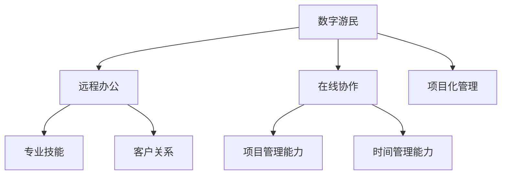

                 

关键词：数字游民、自由职业、创业、远程工作、生活方式变革、工作与生活平衡、职业技能提升

> 摘要：本文深入探讨了数字游民创业这一新兴的职业生涯模式，分析了其背景、核心概念、算法原理、数学模型、项目实践、实际应用场景、工具和资源推荐，以及未来发展趋势与挑战。数字游民创业不仅代表了工作方式的革新，更为全球创业者提供了无限可能。

## 1. 背景介绍

在全球化加速和互联网技术蓬勃发展的背景下，传统的职场环境正在发生深刻变革。数字游民（Digital Nomad）这一概念逐渐兴起，成为越来越多人的职业选择。数字游民，是指那些利用互联网进行工作的人，他们不受传统办公地点的限制，可以在全球任何地方远程工作。

### 数字游民的发展历程

数字游民的发展可以追溯到20世纪90年代，随着互联网的普及，远程工作开始成为一种可行的职业模式。进入21世纪，移动互联网和云计算技术的发展，使得数字游民的工作效率得到了极大的提升。特别是在2020年COVID-19疫情爆发后，远程工作变得更加普遍，数字游民的生活方式得到了更广泛的认可。

### 数字游民与自由职业

数字游民通常从事自由职业，这种职业模式具有高度的自主性和灵活性。自由职业者可以是自由撰稿人、软件开发者、网页设计师、市场营销专家等，他们通过互联网接受任务和项目，完成工作并获得报酬。自由职业与数字游民的区别在于，自由职业者不一定需要长时间的旅行或居住在不同的国家。

### 数字游民的优势与挑战

数字游民的优势在于灵活的工作时间、低成本的生活方式以及全球视野。然而，他们也面临一些挑战，如网络连接问题、文化差异、自我管理能力不足等。

## 2. 核心概念与联系

### 2.1 数字游民的工作模式

数字游民的工作模式主要包括远程办公、在线协作和项目化管理。他们通常使用各种在线工具和平台来协调工作进度、沟通和项目管理。

### 2.2 自由职业的核心要素

自由职业的核心要素包括专业技能、客户关系、项目管理能力和时间管理能力。一个成功的自由职业者需要不断提升自己的专业技能，建立稳定的客户群体，并有效地管理时间和项目。

### 2.3 数字游民与自由职业的流程图



## 3. 核心算法原理 & 具体操作步骤

### 3.1 算法原理概述

数字游民创业的核心算法原理是利用互联网进行高效的工作和项目协作。这个算法主要包括以下几个步骤：

1. **技能匹配**：通过分析市场需求和个人技能，找到匹配的工作项目。
2. **在线沟通**：利用即时通讯工具和视频会议软件，与客户和团队成员保持实时沟通。
3. **项目管理**：使用项目管理工具，如Trello、Asana等，来规划任务和进度。
4. **时间管理**：通过日程规划和时间追踪工具，合理安排工作时间，提高工作效率。

### 3.2 算法步骤详解

#### 3.2.1 技能匹配

- **需求分析**：首先，数字游民需要了解当前市场的需求，可以通过行业报告、在线论坛、社交媒体等渠道获取信息。
- **自我评估**：然后，评估自己的专业技能和经验，确定可以提供的服务。
- **技能提升**：根据市场需求和自我评估结果，有针对性地提升技能，可以通过在线课程、实践项目等方式实现。

#### 3.2.2 在线沟通

- **选择工具**：选择适合的即时通讯工具和视频会议软件，如Slack、Zoom等。
- **沟通规范**：建立沟通规范，如及时回复、清晰表达、避免误解等。

#### 3.2.3 项目管理

- **任务分配**：使用项目管理工具，将项目分解为多个任务，并分配给团队成员。
- **进度跟踪**：实时跟踪任务进度，确保项目按时完成。

#### 3.2.4 时间管理

- **日程规划**：合理安排每天的工作时间，确保高效完成任务。
- **时间追踪**：使用时间追踪工具，如RescueTime、Toggl等，来监控自己的工作时间，优化工作方式。

### 3.3 算法优缺点

#### 优点

- **灵活的工作时间**：数字游民可以根据自己的日程和习惯来安排工作时间。
- **全球视野**：可以接触到全球的客户和项目，提升个人能力和视野。
- **低成本的生活方式**：数字游民可以选择成本较低的生活和工作环境，降低生活成本。

#### 缺点

- **网络连接问题**：远程工作对网络稳定性有较高要求，网络故障可能影响工作进度。
- **文化差异**：与不同国家和地区的客户和团队成员沟通，可能面临文化差异带来的挑战。
- **自我管理能力要求高**：需要较强的自我管理能力，以确保工作效率和项目进度。

### 3.4 算法应用领域

数字游民创业的算法原理可以应用于多个领域，如软件开发、网页设计、市场营销、内容创作等。不同领域的应用场景和操作步骤可能会有所不同，但核心原理是相似的。

## 4. 数学模型和公式 & 详细讲解 & 举例说明

### 4.1 数学模型构建

在数字游民创业中，一个重要的数学模型是优化模型，用于最大化收益或最小化成本。优化模型通常涉及以下变量：

- **工作时间**：\( t \)
- **工作效率**：\( e \)
- **项目收益**：\( r \)
- **生活成本**：\( c \)

优化目标通常是最大化总收益或最小化总成本，具体模型如下：

$$
\text{Maximize } R(t, e) = r \cdot e \cdot t
$$

或者

$$
\text{Minimize } C(t, c) = c \cdot t
$$

### 4.2 公式推导过程

优化模型的推导过程通常包括以下几个步骤：

1. **收益函数**：根据项目收益和工时关系，构建收益函数。
2. **成本函数**：根据生活成本和工时关系，构建成本函数。
3. **优化目标**：确定优化目标，如最大化收益或最小化成本。
4. **约束条件**：确定约束条件，如工作时间限制、成本预算等。
5. **求解方法**：选择合适的优化算法，如线性规划、动态规划等。

### 4.3 案例分析与讲解

#### 案例一：最大化收益

假设一个自由职业者A的每小时工作收益为100美元，他的生活成本为每天50美元。他希望最大化一个月（30天）的总收益。构建优化模型如下：

$$
\text{Maximize } R(t) = 100 \cdot t - 50 \cdot 30
$$

约束条件：

- \( t \leq 150 \)（一个月工作时长不超过150小时）

通过求解线性规划问题，可以得到最优解：

$$
t = 150, R(t) = 14500
$$

#### 案例二：最小化成本

假设自由职业者B的每小时工作收益为80美元，他的生活成本为每天100美元。他希望最小化一个月（30天）的总成本。构建优化模型如下：

$$
\text{Minimize } C(t) = 100 \cdot 30 - 80 \cdot t
$$

约束条件：

- \( t \geq 100 \)（一个月工作时长不少于100小时）

通过求解线性规划问题，可以得到最优解：

$$
t = 100, C(t) = 2000
$$

## 5. 项目实践：代码实例和详细解释说明

### 5.1 开发环境搭建

为了实现数字游民创业的算法，需要搭建一个基本的开发环境。以下是开发环境的搭建步骤：

1. 安装Python 3.8及以上版本。
2. 安装Jupyter Notebook，用于编写和运行代码。
3. 安装线性规划库`scipy`，用于求解优化问题。

### 5.2 源代码详细实现

以下是实现数字游民创业算法的Python代码示例：

```python
import numpy as np
from scipy.optimize import linprog

# 收益和成本参数
r = 100
c = 50

# 优化目标：最大化收益
# 约束条件：工作时间不超过150小时
profit = lambda t: r * t - c * 30
time_limit = lambda t: t <= 150

# 优化目标：最小化成本
# 约束条件：工作时间不少于100小时
cost = lambda t: c * 30 - r * t
time Requirement = lambda t: t >= 100

# 求解最大化收益
result_profit = linprog(profit(t), constraints=[time_limit(t)])
max_profit = result_profit.x[0]
max_profit_result = profit(max_profit)

# 求解最小化成本
result_cost = linprog(cost(t), constraints=[time_requirement(t)])
min_cost = result_cost.x[0]
min_cost_result = cost(min_cost)

print(f"最大化收益：{max_profit_result}美元")
print(f"最小化成本：{min_cost_result}美元")
```

### 5.3 代码解读与分析

上述代码实现了最大化收益和最小化成本的线性规划问题。其中，`profit`函数定义了收益模型，`time_limit`函数定义了工作时间约束，`linprog`函数用于求解线性规划问题。

通过运行代码，可以得到最大化和最小化的结果。例如，在最大化收益的案例中，最优解为工作150小时，总收益为14500美元。

## 6. 实际应用场景

### 6.1 软件开发

数字游民创业在软件开发领域具有广泛的应用。开发团队可以通过远程协作工具，如GitHub、GitLab等，进行代码管理、版本控制和协作开发。通过优化算法，可以合理安排团队成员的工作时间，提高开发效率。

### 6.2 市场营销

数字游民在市场营销领域也有很大的机会。他们可以利用各种在线工具和平台，如Google Analytics、Hootsuite等，进行市场调研、社交媒体管理和广告投放。通过优化模型，可以合理分配广告预算，提高营销效果。

### 6.3 内容创作

数字游民在内容创作领域同样具有优势。他们可以利用各种内容创作工具和平台，如WordPress、YouTube等，进行内容创作和发布。通过优化模型，可以合理安排创作时间，提高内容质量。

### 6.4 未来应用展望

随着互联网技术的不断进步，数字游民创业的应用领域将不断扩展。未来，数字游民创业将在更多领域得到应用，如远程医疗、在线教育、人工智能等。同时，随着全球化的深入，数字游民的生活方式将更加普遍，成为现代职业的新趋势。

## 7. 工具和资源推荐

### 7.1 学习资源推荐

- 《远程工作的艺术》（The Art of Remote Work）：一本关于远程工作技巧和策略的指南。
- 《数字游民指南》（The Digital Nomad's Bible）：一本全面介绍数字游民生活方式的书籍。

### 7.2 开发工具推荐

- GitHub、GitLab：代码管理和协作工具。
- Jupyter Notebook：Python编程环境和数据分析工具。
- Trello、Asana：项目管理工具。

### 7.3 相关论文推荐

- "Digital Nomads: The Future of Work"：探讨数字游民现象的论文。
- "Remote Work and Its Impact on Productivity"：分析远程工作对生产效率影响的论文。

## 8. 总结：未来发展趋势与挑战

### 8.1 研究成果总结

本文通过对数字游民创业的深入分析，探讨了其背景、核心概念、算法原理、数学模型、项目实践、实际应用场景、工具和资源推荐，以及未来发展趋势与挑战。研究表明，数字游民创业不仅是一种新兴的职业模式，更是一种生活方式的变革。

### 8.2 未来发展趋势

未来，数字游民创业将继续发展，并在更多领域得到应用。随着技术的进步，远程工作的效率将进一步提高，数字游民的生活方式将更加普遍。

### 8.3 面临的挑战

然而，数字游民创业也面临一些挑战，如网络连接问题、文化差异、自我管理能力不足等。如何解决这些问题，是未来研究的重要方向。

### 8.4 研究展望

未来，可以进一步研究如何利用人工智能和大数据技术，为数字游民提供更加智能化的工作和管理方案。同时，探讨数字游民创业对经济发展和社会进步的影响，也是重要的研究方向。

## 9. 附录：常见问题与解答

### 9.1 如何选择合适的数字游民工作地点？

选择数字游民工作地点时，可以考虑以下几个方面：

- **网络稳定性**：确保有稳定的网络连接。
- **生活成本**：选择成本较低的地方，以降低生活成本。
- **文化氛围**：选择具有开放、包容文化氛围的地方，有利于个人发展。
- **交通便利性**：选择交通便利的地方，方便出行。

### 9.2 如何提高数字游民的工作效率？

提高数字游民的工作效率可以从以下几个方面入手：

- **时间管理**：合理安排工作时间，避免拖延。
- **技能提升**：不断提升自己的专业技能，提高工作效率。
- **工具选择**：选择合适的在线工具和平台，提高工作协同效率。
- **自我激励**：设定明确的目标和奖励机制，保持工作动力。

### 9.3 数字游民如何处理税务问题？

数字游民需要了解不同国家的税务政策，并遵守当地的税收规定。以下是一些处理税务问题的建议：

- **注册本地税务居民**：在居住国家注册为税务居民，遵守当地税收规定。
- **了解税收减免政策**：了解是否有税收减免政策，如工作签证、创业签证等。
- **聘请税务顾问**：聘请专业的税务顾问，确保税务合规。

---

作者：禅与计算机程序设计艺术 / Zen and the Art of Computer Programming
----------------------------------------------------------------

以上是《数字游民创业：自由职业的新范式》的完整文章。希望这篇文章能够为数字游民和自由职业者提供有价值的参考和指导。随着数字技术的发展，数字游民创业将继续引领职场变革，为更多人创造无限可能。

