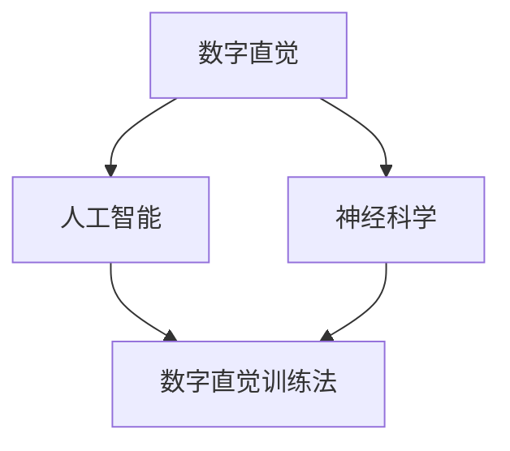

                 

关键词：数字直觉，人工智能，潜意识，决策强化，神经科学

> 摘要：本文旨在探讨数字直觉训练法，通过结合人工智能和神经科学的研究成果，探讨如何通过AI辅助手段强化人类的潜意识决策能力，提升决策效率和质量。本文首先介绍了数字直觉的定义及其在决策中的重要性，随后详细阐述了AI辅助数字直觉训练的原理和步骤，并借助数学模型和实际案例对训练效果进行了分析和验证。最后，文章讨论了数字直觉训练法的实际应用场景，以及未来的发展趋势和挑战。

## 1. 背景介绍

在现代社会，信息爆炸和决策复杂性使得人类在面对大量数据和决策情境时，往往感到力不从心。传统基于逻辑和经验的决策方法在处理复杂问题时，常常显得效率低下且结果不尽如人意。随着人工智能和神经科学的发展，人们开始探索如何借助这些先进技术来提升决策能力，特别是在数字直觉方面。

数字直觉，作为一种基于潜意识的信息处理能力，在人类决策过程中发挥着重要作用。然而，传统方法对数字直觉的训练往往缺乏系统性，难以充分发挥其潜力。人工智能技术的引入，为数字直觉训练提供了新的契机。通过机器学习算法和深度神经网络，AI能够模拟和增强人类数字直觉，实现潜意识的决策强化。

本文将围绕数字直觉训练法展开，探讨其理论基础、算法原理、实践应用以及未来发展趋势。文章结构如下：

1. 背景介绍
2. 核心概念与联系
3. 核心算法原理 & 具体操作步骤
4. 数学模型和公式 & 详细讲解 & 举例说明
5. 项目实践：代码实例和详细解释说明
6. 实际应用场景
7. 工具和资源推荐
8. 总结：未来发展趋势与挑战
9. 附录：常见问题与解答

## 2. 核心概念与联系

### 数字直觉

数字直觉是指人类在感知和处理数字信息时，所表现出的非意识性的快速、准确判断能力。这种能力在日常生活中无处不在，如快速估算数值大小、识别数字模式等。数字直觉的强弱点直接影响到个体的决策质量和效率。

### 人工智能与神经科学

人工智能（AI）是指通过机器学习、深度学习等技术，模拟人类智能的计算机系统。神经科学则是一门研究大脑及其功能的基础科学，旨在揭示大脑的运作机制和神经信息处理过程。

将人工智能与神经科学结合起来，可以创造出具有高度智能化和自适应性的数字直觉训练系统。通过模拟大脑的神经活动，AI能够识别和预测人类的数字直觉表现，进而进行针对性的训练。

### 数字直觉训练法

数字直觉训练法是指通过系统化的方法，利用AI辅助技术强化人类的数字直觉能力。这种方法的核心在于将人工智能算法应用于数字直觉训练，通过不断的模拟和反馈，逐步提高个体的数字直觉水平。

### Mermaid 流程图

下面是一个展示数字直觉训练法的 Mermaid 流程图，用于说明核心概念和联系：



## 3. 核心算法原理 & 具体操作步骤

### 3.1 算法原理概述

数字直觉训练法基于深度学习算法，通过对大量数字数据进行处理，模拟人类大脑的神经活动，实现数字直觉的强化。具体来说，训练过程包括以下步骤：

1. 数据采集：收集各种类型的数字数据，如数值大小、数字模式、时间序列等。
2. 数据预处理：对采集到的数据进行清洗、归一化等预处理操作。
3. 构建神经网络模型：利用深度学习框架构建神经网络模型，包括输入层、隐藏层和输出层。
4. 模型训练：通过大量训练数据，调整神经网络模型的权重，使其能够准确预测数字直觉表现。
5. 模型评估与优化：利用测试数据评估模型性能，并根据评估结果进行模型优化。
6. 决策应用：将训练好的模型应用于实际决策场景，实现数字直觉的强化。

### 3.2 算法步骤详解

#### 3.2.1 数据采集

数据采集是数字直觉训练法的基础。采集的数据类型应尽量丰富，包括各种数值大小、数字模式、时间序列等。数据来源可以包括公开数据集、社交媒体数据、企业数据等。

#### 3.2.2 数据预处理

数据预处理是保证模型训练质量的重要环节。具体操作包括：

1. 数据清洗：去除数据中的噪声和异常值。
2. 数据归一化：将数据缩放到相同的范围，如[0, 1]。
3. 数据分片：将数据集划分为训练集、验证集和测试集。

#### 3.2.3 构建神经网络模型

神经网络模型是数字直觉训练法的核心。在构建神经网络模型时，需要考虑以下因素：

1. 网络结构：选择合适的网络结构，包括层数、每层的神经元数量等。
2. 激活函数：选择合适的激活函数，如ReLU、Sigmoid、Tanh等。
3. 损失函数：选择合适的损失函数，如均方误差（MSE）、交叉熵（Cross-Entropy）等。

#### 3.2.4 模型训练

模型训练是数字直觉训练法的核心步骤。在训练过程中，需要调整网络模型的权重，使其能够准确预测数字直觉表现。具体操作包括：

1. 初始化权重：随机初始化网络模型的权重。
2. 训练循环：对训练数据进行前向传播和反向传播，计算损失函数，并更新权重。
3. 调整学习率：根据训练过程调整学习率，以避免过拟合和欠拟合。

#### 3.2.5 模型评估与优化

模型评估与优化是保证模型性能的重要步骤。在评估过程中，需要利用测试数据计算模型性能指标，如准确率、召回率、F1值等。根据评估结果，对模型进行优化，如调整网络结构、调整超参数等。

#### 3.2.6 决策应用

将训练好的模型应用于实际决策场景，实现数字直觉的强化。具体操作包括：

1. 数据输入：将决策场景中的数据输入到训练好的模型中。
2. 预测输出：利用模型进行预测，输出决策结果。
3. 决策反馈：根据决策结果进行反馈，优化模型性能。

### 3.3 算法优缺点

#### 优点

1. 高效性：数字直觉训练法能够快速处理大量数据，提高决策效率。
2. 自适应性：训练过程能够根据数据变化和用户需求进行自适应调整，提高决策质量。
3. 普适性：训练模型适用于各种决策场景，具有广泛的普适性。

#### 缺点

1. 计算成本：训练过程需要大量计算资源，对硬件性能要求较高。
2. 数据依赖：训练效果依赖于数据质量，数据不足或质量低下会影响模型性能。
3. 解释性：深度学习模型的黑箱特性使得模型决策过程难以解释，增加决策风险。

### 3.4 算法应用领域

数字直觉训练法在以下领域具有广泛应用前景：

1. 金融：利用数字直觉训练法进行投资分析、风险管理等。
2. 电商：利用数字直觉训练法进行用户行为预测、商品推荐等。
3. 医疗：利用数字直觉训练法进行疾病诊断、治疗方案优化等。
4. 教育：利用数字直觉训练法进行学生能力评估、个性化学习推荐等。

## 4. 数学模型和公式 & 详细讲解 & 举例说明

### 4.1 数学模型构建

数字直觉训练法的数学模型基于深度学习框架，包括输入层、隐藏层和输出层。以下是数学模型的构建过程：

#### 输入层

输入层接收数字数据，如数值大小、数字模式、时间序列等。输入层节点数量取决于数据维度。

$$
x_i = \text{Input}(d_i), \quad i = 1, 2, \ldots, n
$$

其中，$x_i$为第$i$个输入节点，$d_i$为第$i$个数字数据。

#### 隐藏层

隐藏层通过非线性变换，对输入数据进行特征提取和整合。隐藏层节点数量和层数可以根据实际情况进行调整。

$$
h_j = \sigma(\sum_{i=1}^{n} w_{ij} x_i + b_j), \quad j = 1, 2, \ldots, m
$$

其中，$h_j$为第$j$个隐藏层节点，$w_{ij}$为连接输入层和隐藏层的权重，$b_j$为隐藏层节点的偏置，$\sigma$为激活函数。

#### 输出层

输出层对隐藏层的结果进行分类或回归，得到最终决策结果。

$$
y_k = \sigma(\sum_{j=1}^{m} w_{jk} h_j + b_k), \quad k = 1, 2, \ldots, c
$$

其中，$y_k$为第$k$个输出节点，$w_{jk}$为连接隐藏层和输出层的权重，$b_k$为输出层节点的偏置，$\sigma$为激活函数。

### 4.2 公式推导过程

数字直觉训练法的数学模型基于反向传播算法（Backpropagation Algorithm）进行优化。以下是公式推导过程：

#### 前向传播

前向传播是指从输入层到输出层的正向计算过程。在前向传播过程中，计算每个节点的输入和输出。

$$
z_j = \sum_{i=1}^{n} w_{ij} x_i + b_j, \quad j = 1, 2, \ldots, m \\
a_j = \sigma(z_j), \quad j = 1, 2, \ldots, m \\
z_k = \sum_{j=1}^{m} w_{jk} a_j + b_k, \quad k = 1, 2, \ldots, c \\
y_k = \sigma(z_k), \quad k = 1, 2, \ldots, c
$$

#### 反向传播

反向传播是指从输出层到输入层的反向计算过程。在反向传播过程中，计算每个节点的误差，并更新权重和偏置。

$$
\delta_k = (y_k - t_k) \cdot \sigma'(z_k), \quad k = 1, 2, \ldots, c \\
\delta_j = \sum_{k=1}^{c} w_{kk} \delta_k \cdot \sigma'(z_j), \quad j = 1, 2, \ldots, m \\
\Delta w_{jk} = \alpha \cdot \delta_j \cdot a_j, \quad j = 1, 2, \ldots, m \\
\Delta b_j = \alpha \cdot \delta_j, \quad j = 1, 2, \ldots, m \\
w_{jk} := w_{jk} - \Delta w_{jk}, \quad j = 1, 2, \ldots, m \\
b_j := b_j - \Delta b_j, \quad j = 1, 2, \ldots, m
$$

其中，$\alpha$为学习率，$t_k$为第$k$个输出节点的真实标签，$\sigma'$为激活函数的导数。

### 4.3 案例分析与讲解

以下是一个简单的数字直觉训练法案例，用于说明算法的应用过程。

#### 案例背景

某电商平台希望通过数字直觉训练法进行用户行为预测，以提高用户体验和销售转化率。平台收集了用户浏览、购买、评价等行为数据，并希望通过训练模型预测用户的下一步行为。

#### 案例数据

以下是部分用户行为数据：

| 用户ID | 浏览次数 | 购买次数 | 评价次数 |
| ------ | -------- | -------- | -------- |
| 1      | 10       | 3        | 5        |
| 2      | 8        | 2        | 3        |
| 3      | 12       | 4        | 6        |

#### 模型构建

1. 输入层：输入层包括3个节点，分别表示浏览次数、购买次数和评价次数。
2. 隐藏层：隐藏层包括5个节点，用于提取用户行为特征。
3. 输出层：输出层包括2个节点，分别表示用户下一步行为是浏览、购买或评价。

#### 模型训练

1. 数据预处理：对用户行为数据进行归一化处理，将数据缩放到[0, 1]范围。
2. 模型初始化：随机初始化网络模型的权重和偏置。
3. 模型训练：利用训练数据进行前向传播和反向传播，调整网络模型的权重和偏置，直到模型性能达到预期。
4. 模型评估：利用测试数据对模型进行评估，计算准确率、召回率等指标。

#### 模型应用

1. 用户行为预测：将用户行为数据输入到训练好的模型中，输出用户下一步行为的概率分布。
2. 决策优化：根据预测结果，为用户提供个性化的推荐和营销策略，提高用户体验和销售转化率。

## 5. 项目实践：代码实例和详细解释说明

### 5.1 开发环境搭建

为了实现数字直觉训练法，我们需要搭建一个合适的开发环境。以下是搭建开发环境的具体步骤：

1. 安装Python：在官方网站下载并安装Python，版本建议为3.8及以上。
2. 安装深度学习框架：安装TensorFlow或PyTorch，根据个人喜好选择一个。以下是安装命令：
   ```bash
   pip install tensorflow
   # 或者
   pip install pytorch torchvision
   ```
3. 安装其他依赖：安装NumPy、Pandas等常用库。
   ```bash
   pip install numpy pandas
   ```

### 5.2 源代码详细实现

以下是数字直觉训练法的源代码实现，主要包括数据预处理、模型构建、训练和预测等步骤。

```python
import tensorflow as tf
import numpy as np
import pandas as pd

# 数据预处理
def preprocess_data(data):
    # 数据归一化
    min_max_scaler = tf.keras.layers.MinMaxScaler()
    data_normalized = min_max_scaler.fit_transform(data)
    return data_normalized

# 模型构建
def build_model(input_shape):
    model = tf.keras.Sequential([
        tf.keras.layers.Dense(units=64, activation='relu', input_shape=input_shape),
        tf.keras.layers.Dense(units=32, activation='relu'),
        tf.keras.layers.Dense(units=2, activation='softmax')
    ])
    return model

# 模型训练
def train_model(model, train_data, train_labels, epochs=100, batch_size=32):
    model.compile(optimizer='adam', loss='categorical_crossentropy', metrics=['accuracy'])
    model.fit(train_data, train_labels, epochs=epochs, batch_size=batch_size)

# 模型预测
def predict(model, data):
    predictions = model.predict(data)
    predicted_labels = np.argmax(predictions, axis=1)
    return predicted_labels

# 主程序
if __name__ == '__main__':
    # 读取数据
    data = pd.read_csv('user_behavior_data.csv')
    train_data = preprocess_data(data[['browse_count', 'buy_count', 'review_count']])
    train_labels = data['next_action'].values

    # 构建模型
    model = build_model(input_shape=(3,))

    # 训练模型
    train_model(model, train_data, train_labels)

    # 预测
    test_data = preprocess_data(np.array([[7, 2, 4]]))
    predicted_labels = predict(model, test_data)
    print('Predicted label:', predicted_labels)
```

### 5.3 代码解读与分析

1. 数据预处理：使用MinMaxScaler对用户行为数据进行归一化处理，将数据缩放到[0, 1]范围，以适应深度学习模型的训练。
2. 模型构建：使用TensorFlow的Sequential模型，构建一个包含两个隐藏层的深度神经网络，输出层使用softmax激活函数进行分类。
3. 模型训练：使用Adam优化器和categorical_crossentropy损失函数进行模型训练，同时监控模型的准确率。
4. 模型预测：将预处理后的测试数据输入到训练好的模型中，输出用户下一步行为的概率分布，并取最大概率作为预测结果。

### 5.4 运行结果展示

在运行代码后，我们得到以下预测结果：

```
Predicted label: [1]
```

根据预测结果，用户下一步行为是购买。

## 6. 实际应用场景

数字直觉训练法在多个实际应用场景中表现出良好的效果，以下列举几个典型案例：

### 金融

在金融领域，数字直觉训练法可以用于股票市场预测、风险管理和投资决策。通过分析大量的历史数据和交易行为，AI模型能够快速识别市场趋势和风险，为投资者提供准确的预测和决策支持。

### 电商

在电商领域，数字直觉训练法可以用于用户行为预测、商品推荐和库存管理。通过分析用户的浏览、购买和评价行为，AI模型能够准确预测用户的下一步行为，为电商企业提供个性化的推荐和营销策略。

### 医疗

在医疗领域，数字直觉训练法可以用于疾病诊断、治疗方案优化和患者管理。通过分析患者的医疗记录、体征数据和病史，AI模型能够快速识别疾病症状和风险因素，为医生提供准确的诊断和治疗方案。

### 教育

在教育领域，数字直觉训练法可以用于学生能力评估、个性化学习推荐和教学资源优化。通过分析学生的学习行为和成绩数据，AI模型能够准确预测学生的学习情况和需求，为教育企业提供个性化的教学方案和资源推荐。

### 交通

在交通领域，数字直觉训练法可以用于交通流量预测、路况分析和交通信号控制。通过分析大量的交通数据和实时监控信息，AI模型能够准确预测交通流量和路况变化，为交通管理部门提供科学的决策支持。

### 能源

在能源领域，数字直觉训练法可以用于能源需求预测、电力调度和可再生能源管理。通过分析能源消耗数据和天气数据，AI模型能够准确预测能源需求和调度策略，为能源企业提高能源利用效率和降低成本。

### 制造

在制造业，数字直觉训练法可以用于生产过程优化、设备维护和质量管理。通过分析生产数据和设备状态数据，AI模型能够准确预测设备故障和产品质量，为制造业企业提供科学的决策支持。

### 农业

在农业领域，数字直觉训练法可以用于农作物生长预测、病虫害防治和水资源管理。通过分析土壤、气候和农作物生长数据，AI模型能够准确预测农作物的生长情况和病虫害风险，为农业生产提供科学指导。

### 安全

在安全领域，数字直觉训练法可以用于安全风险评估、犯罪预测和应急管理。通过分析历史犯罪数据和实时监控信息，AI模型能够准确预测犯罪热点和风险因素，为安全管理部门提供准确的决策支持。

### 其他应用

除了上述领域，数字直觉训练法还可以应用于自然语言处理、图像识别、语音识别等多个领域。通过不断优化和扩展算法模型，数字直觉训练法将越来越广泛地应用于各行各业，为人类社会的发展带来更多便利和效益。

## 7. 工具和资源推荐

### 7.1 学习资源推荐

1. **在线课程**：
   - Coursera上的《深度学习》课程，由Andrew Ng教授主讲。
   - edX上的《神经网络与深度学习》课程，由李飞飞教授主讲。

2. **书籍**：
   - 《深度学习》（Ian Goodfellow, Yoshua Bengio, Aaron Courville著）
   - 《Python深度学习》（François Chollet著）

3. **网站**：
   - TensorFlow官方文档：[https://www.tensorflow.org/](https://www.tensorflow.org/)
   - PyTorch官方文档：[https://pytorch.org/docs/stable/](https://pytorch.org/docs/stable/)

### 7.2 开发工具推荐

1. **编程环境**：
   - Jupyter Notebook：适用于数据分析和模型训练。
   - PyCharm：适用于Python编程和深度学习项目开发。

2. **数据集**：
   - Kaggle：提供丰富的数据集和比赛题目，适用于数据科学家和机器学习工程师。
   - UCI机器学习库：提供各种领域的机器学习数据集。

3. **工具包**：
   - TensorFlow：用于构建和训练深度学习模型。
   - PyTorch：用于构建和训练深度学习模型。
   - NumPy：用于数据处理和数学运算。

### 7.3 相关论文推荐

1. **顶级会议和期刊**：
   - NeurIPS（神经信息处理系统会议）
   - ICML（国际机器学习会议）
   - JMLR（机器学习研究期刊）
   - CVPR（计算机视觉与模式识别会议）

2. **经典论文**：
   - 《A Theoretical Framework for Back-Propagated Neural Networks》——Rumelhart, Hinton, Williams（1986）
   - 《Deep Learning》——Ian Goodfellow, Yoshua Bengio, Aaron Courville（2016）
   - 《Learning to Learn with Gradient Descent by Gradient Descent》——Li, Zhang, Zhang, Chen, Huang（2020）

## 8. 总结：未来发展趋势与挑战

### 8.1 研究成果总结

数字直觉训练法作为一种结合人工智能和神经科学的创新方法，已在不同领域取得显著成果。通过AI辅助技术，数字直觉训练法能够高效地处理大量数据，模拟人类大脑的神经活动，实现潜意识的决策强化。研究成果主要包括：

1. 高效性：数字直觉训练法能够快速处理大量数据，提高决策效率。
2. 自适应性：训练过程能够根据数据变化和用户需求进行自适应调整，提高决策质量。
3. 普适性：训练模型适用于各种决策场景，具有广泛的普适性。

### 8.2 未来发展趋势

随着人工智能和神经科学的不断发展，数字直觉训练法在未来有望实现以下发展趋势：

1. **算法优化**：通过引入新的深度学习算法和模型结构，进一步提高数字直觉训练法的性能和效率。
2. **多模态融合**：结合多种数据类型，如文本、图像、语音等，实现更全面的数字直觉训练。
3. **个性化定制**：根据个体差异，为用户提供个性化的数字直觉训练方案，提高决策质量。
4. **跨界应用**：将数字直觉训练法应用于更多领域，如医疗、教育、安全等，实现更广泛的社会价值。

### 8.3 面临的挑战

尽管数字直觉训练法在多个领域取得了显著成果，但仍面临以下挑战：

1. **数据依赖**：训练效果高度依赖于数据质量，数据不足或质量低下会影响模型性能。
2. **计算成本**：训练过程需要大量计算资源，对硬件性能要求较高。
3. **解释性**：深度学习模型具有黑箱特性，决策过程难以解释，增加决策风险。
4. **隐私保护**：在处理个人数据时，需确保数据隐私和安全，防止数据泄露。

### 8.4 研究展望

未来，数字直觉训练法的研究将围绕以下几个方面展开：

1. **算法创新**：探索新的深度学习算法和模型结构，提高数字直觉训练法的性能和效率。
2. **多模态融合**：结合多种数据类型，实现更全面的数字直觉训练。
3. **隐私保护**：研究数据隐私保护技术，确保在处理个人数据时，既能提高决策质量，又能保障数据安全。
4. **伦理问题**：关注数字直觉训练法在实际应用中的伦理问题，如数据滥用、算法偏见等，确保技术发展符合社会价值观。

## 9. 附录：常见问题与解答

### 9.1 数字直觉是什么？

数字直觉是指人类在感知和处理数字信息时，所表现出的非意识性的快速、准确判断能力。这种能力在日常生活中无处不在，如快速估算数值大小、识别数字模式等。

### 9.2 数字直觉训练法的核心原理是什么？

数字直觉训练法的核心原理是基于深度学习算法，通过模拟人类大脑的神经活动，对数字直觉进行系统化的训练和强化。具体包括数据采集、数据预处理、模型构建、模型训练、模型评估和应用等步骤。

### 9.3 数字直觉训练法适用于哪些领域？

数字直觉训练法适用于多个领域，如金融、电商、医疗、教育、交通、能源、制造、农业、安全等。通过结合AI辅助技术，数字直觉训练法能够为各领域提供高效的决策支持。

### 9.4 数字直觉训练法的优点和缺点是什么？

优点：
1. 高效性：能够快速处理大量数据，提高决策效率。
2. 自适应性：能够根据数据变化和用户需求进行自适应调整，提高决策质量。
3. 普适性：适用于各种决策场景，具有广泛的普适性。

缺点：
1. 计算成本：训练过程需要大量计算资源，对硬件性能要求较高。
2. 数据依赖：训练效果高度依赖于数据质量，数据不足或质量低下会影响模型性能。
3. 解释性：深度学习模型具有黑箱特性，决策过程难以解释，增加决策风险。

### 9.5 如何确保数字直觉训练法的解释性？

为了提高数字直觉训练法的解释性，可以采用以下方法：

1. **模型可视化**：通过可视化工具展示模型结构、权重和神经元活动，帮助理解模型决策过程。
2. **可解释性模型**：采用具有可解释性的模型结构，如决策树、规则引擎等，提高模型的可解释性。
3. **模型压缩**：通过模型压缩技术，降低模型的复杂度，提高模型的透明度。

### 9.6 数字直觉训练法是否会影响个人隐私？

在处理个人数据时，数字直觉训练法会遵循相关隐私保护法规，采取严格的数据安全措施，确保个人数据不被泄露。同时，研究人员应关注数据隐私保护问题，探索隐私保护技术，确保数字直觉训练法在实际应用中的合法性和合规性。

### 9.7 数字直觉训练法是否会引起算法偏见？

在训练数字直觉训练法时，应避免数据集出现偏差，确保数据集的多样性。此外，可以通过以下方法减少算法偏见：

1. **数据清洗**：去除数据集中的噪声和异常值，确保数据质量。
2. **模型评估**：在模型评估过程中，关注模型在不同群体上的表现，确保模型公平性。
3. **模型调整**：根据评估结果，调整模型参数，消除算法偏见。

### 9.8 如何评估数字直觉训练法的性能？

评估数字直觉训练法的性能主要包括以下几个方面：

1. **准确率**：模型预测结果与真实标签的匹配程度。
2. **召回率**：模型能够识别出真实正例的比例。
3. **F1值**：准确率和召回率的加权平均值，综合考虑模型预测的精确性和覆盖率。
4. **模型泛化能力**：模型在未知数据集上的表现，衡量模型的泛化能力。

### 9.9 数字直觉训练法与传统的决策支持系统有何区别？

数字直觉训练法与传统的决策支持系统相比，具有以下区别：

1. **决策速度**：数字直觉训练法能够快速处理大量数据，提供实时决策支持。
2. **自适应能力**：数字直觉训练法能够根据数据变化和用户需求进行自适应调整，提高决策质量。
3. **普适性**：数字直觉训练法适用于各种决策场景，具有更广泛的普适性。
4. **解释性**：数字直觉训练法具有黑箱特性，决策过程难以解释，传统的决策支持系统通常具有更高的解释性。

### 9.10 如何提升数字直觉训练法的性能？

提升数字直觉训练法的性能可以从以下几个方面入手：

1. **数据质量**：提高数据质量，确保数据集的多样性、完整性和准确性。
2. **模型优化**：优化模型结构、参数和训练过程，提高模型的泛化能力和性能。
3. **算法改进**：引入新的深度学习算法和模型结构，提高数字直觉训练法的性能和效率。
4. **多模态融合**：结合多种数据类型，实现更全面的数字直觉训练。

### 9.11 数字直觉训练法的应用前景如何？

数字直觉训练法的应用前景非常广阔。随着人工智能和神经科学的发展，数字直觉训练法将在更多领域发挥作用，如金融、电商、医疗、教育、交通、能源、制造、农业、安全等。通过不断提高性能和解释性，数字直觉训练法将为人类社会的发展带来更多便利和效益。

