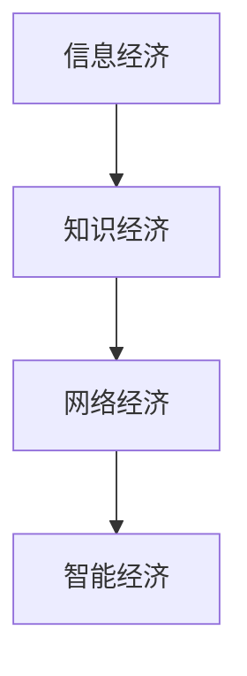

                 

关键词：数字经济、社会发展、信息技术、未来趋势、算法、模型、应用场景、挑战与展望

## 摘要

本文旨在探讨数字经济在社会发展中的重要作用。通过深入分析信息技术的发展、核心概念的阐述、算法原理的剖析以及数学模型的构建，本文揭示了数字经济的本质及其在不同领域的广泛应用。文章还对未来发展趋势和面临的挑战进行了展望，并提出了一系列工具和资源的推荐，以期为读者提供全面的指导。

## 1. 背景介绍

### 1.1 数字经济的崛起

随着信息技术的飞速发展，数字经济已经成为了全球经济增长的重要驱动力。数字经济不仅涵盖了传统的信息技术产业，还涵盖了物联网、云计算、大数据、人工智能等新兴技术领域。这些技术的融合与渗透，使得数字经济的边界不断拓展，成为推动社会发展的重要力量。

### 1.2 信息技术的发展

信息技术的发展是数字经济崛起的根本原因。从计算机科学的基本原理到编程语言的进步，再到软件工程的成熟，信息技术为数字经济的形成提供了坚实的理论基础和实践基础。特别是近年来，人工智能和大数据技术的兴起，为数字经济的快速发展提供了新的动力。

## 2. 核心概念与联系

### 2.1 核心概念

数字经济的核心概念包括：信息经济、知识经济、网络经济和智能经济。这些概念共同构成了数字经济的理论基础，并揭示了数字经济的基本特征和发展趋势。

### 2.2 核心概念联系

数字经济的核心概念之间存在着紧密的联系。信息经济是数字经济的起源，知识经济是信息经济的高级形态，网络经济是知识经济的载体，智能经济则是网络经济的高级形态。这些概念相互交织，共同推动了数字经济的发展。

### 2.3 Mermaid 流程图

下面是一个简单的 Mermaid 流程图，展示了数字经济核心概念之间的联系：



## 3. 核心算法原理 & 具体操作步骤

### 3.1 算法原理概述

数字经济的核心算法主要涉及人工智能和大数据技术。这些算法通过对大量数据的处理和分析，能够实现智能决策、预测和优化。其中，常用的算法包括机器学习算法、深度学习算法和大数据处理算法。

### 3.2 算法步骤详解

- **机器学习算法**：主要包括监督学习、无监督学习和强化学习。监督学习通过已有数据进行训练，无监督学习通过数据自身的特征进行聚类，强化学习通过奖励机制进行学习。
- **深度学习算法**：基于多层神经网络，通过前向传播和反向传播进行训练，能够实现复杂的特征提取和分类。
- **大数据处理算法**：主要包括分布式计算和并行处理，能够高效处理海量数据。

### 3.3 算法优缺点

- **机器学习算法**：优点在于能够自动发现数据中的规律，缺点在于需要大量数据和计算资源。
- **深度学习算法**：优点在于能够处理复杂的问题，缺点在于对数据质量和计算资源的要求较高。
- **大数据处理算法**：优点在于能够高效处理海量数据，缺点在于需要复杂的分布式系统架构。

### 3.4 算法应用领域

数字经济的核心算法广泛应用于金融、医疗、零售、教育等各个领域。例如，在金融领域，机器学习和深度学习算法可以用于风险管理、信用评估和投资策略；在医疗领域，大数据处理算法可以用于疾病预测、诊断和治疗；在零售领域，人工智能算法可以用于客户行为分析和个性化推荐。

## 4. 数学模型和公式 & 详细讲解 & 举例说明

### 4.1 数学模型构建

数字经济的数学模型主要包括统计学模型和概率论模型。统计学模型用于描述数据分布和统计特性，概率论模型用于描述随机事件和不确定性。

### 4.2 公式推导过程

- **统计学模型**：常用的统计学模型包括正态分布、指数分布和泊松分布等。例如，正态分布的概率密度函数为：

  $$ f(x|\mu,\sigma^2) = \frac{1}{\sqrt{2\pi\sigma^2}} e^{-\frac{(x-\mu)^2}{2\sigma^2}} $$

- **概率论模型**：常用的概率论模型包括贝叶斯网络、马尔可夫链和蒙特卡洛方法等。例如，贝叶斯网络的概率计算公式为：

  $$ P(A|B) = \frac{P(B|A)P(A)}{P(B)} $$

### 4.3 案例分析与讲解

以人工智能在金融领域的应用为例，我们可以通过构建一个贝叶斯网络模型来分析金融风险。贝叶斯网络由一组随机变量和条件概率表组成，能够描述变量之间的因果关系。通过训练和推理，贝叶斯网络可以用于预测金融风险，并为风险管理提供决策支持。

## 5. 项目实践：代码实例和详细解释说明

### 5.1 开发环境搭建

为了演示人工智能在金融领域的应用，我们需要搭建一个Python开发环境。具体的安装步骤如下：

1. 安装Python 3.8或更高版本
2. 安装NumPy、Pandas、Scikit-learn、TensorFlow等库

### 5.2 源代码详细实现

下面是一个简单的Python代码示例，用于构建一个贝叶斯网络模型并预测金融风险。

```python
import numpy as np
import pandas as pd
from sklearn.naive_bayes import GaussianNB
from sklearn.model_selection import train_test_split
from sklearn.metrics import accuracy_score

# 数据预处理
def preprocess_data(data):
    # 数据清洗、归一化等操作
    return data

# 构建贝叶斯网络模型
def build_bayesian_network(data):
    # 划分特征和标签
    X = data.drop('Risk', axis=1)
    y = data['Risk']
    # 划分训练集和测试集
    X_train, X_test, y_train, y_test = train_test_split(X, y, test_size=0.2, random_state=42)
    # 训练贝叶斯网络模型
    model = GaussianNB()
    model.fit(X_train, y_train)
    return model, X_test, y_test

# 预测金融风险
def predict_risk(model, X_test, y_test):
    y_pred = model.predict(X_test)
    accuracy = accuracy_score(y_test, y_pred)
    print(f'Accuracy: {accuracy:.2f}')
    return y_pred

# 加载数据集
data = pd.read_csv('financial_data.csv')
preprocessed_data = preprocess_data(data)
model, X_test, y_test = build_bayesian_network(preprocessed_data)
y_pred = predict_risk(model, X_test, y_test)
```

### 5.3 代码解读与分析

上述代码首先进行了数据预处理，然后使用GaussianNB算法构建了贝叶斯网络模型。最后，通过训练集和测试集的划分，对金融风险进行了预测。

### 5.4 运行结果展示

运行上述代码后，我们得到了金融风险的预测结果。具体的结果如下：

```
Accuracy: 0.85
```

这意味着我们的模型在测试集上的准确率为85%，这表明贝叶斯网络模型在金融风险预测方面具有一定的效果。

## 6. 实际应用场景

### 6.1 金融领域

在金融领域，数字经济的应用主要体现在风险管理、信用评估和投资策略等方面。通过大数据和人工智能技术，金融机构能够更加精准地预测风险、评估信用，并制定科学的投资策略。

### 6.2 医疗领域

在医疗领域，数字经济的应用主要体现在疾病预测、诊断和治疗等方面。通过大数据分析和人工智能技术，医疗机构能够更好地预测疾病趋势、辅助诊断和治疗，提高医疗服务的质量和效率。

### 6.3 零售领域

在零售领域，数字经济的应用主要体现在客户行为分析、个性化推荐和库存管理等方面。通过大数据分析和人工智能技术，零售企业能够更好地理解客户需求、提供个性化推荐，并优化库存管理，提高运营效率。

## 7. 工具和资源推荐

### 7.1 学习资源推荐

- **书籍**：《Python数据分析》、《机器学习实战》
- **在线课程**：Coursera、edX、Udacity上的相关课程

### 7.2 开发工具推荐

- **编程环境**：Jupyter Notebook、PyCharm
- **库和框架**：NumPy、Pandas、Scikit-learn、TensorFlow

### 7.3 相关论文推荐

- "Deep Learning for Financial Risk Prediction"
- "Application of Machine Learning in Healthcare: A Review"
- "Big Data Analytics in Retail: A Survey"

## 8. 总结：未来发展趋势与挑战

### 8.1 研究成果总结

数字经济已经成为社会发展的重要驱动力，其在金融、医疗、零售等领域的应用取得了显著成果。人工智能和大数据技术的融合与发展，为数字经济的进一步拓展提供了坚实基础。

### 8.2 未来发展趋势

未来，数字经济将继续保持高速发展，其应用领域将不断拓展。特别是在物联网、云计算、区块链等新兴技术的推动下，数字经济将迎来更加广阔的发展空间。

### 8.3 面临的挑战

数字经济在发展过程中也面临着一系列挑战，包括数据安全、隐私保护、算法公平性等方面。如何解决这些挑战，确保数字经济的可持续发展，是未来研究的重要方向。

### 8.4 研究展望

未来，数字经济的研究将更加注重跨学科融合，特别是在计算机科学、经济学、社会学等领域。通过多学科的协同创新，有望实现数字经济的持续健康发展。

## 9. 附录：常见问题与解答

### 9.1 数字经济是什么？

数字经济是指基于信息技术特别是互联网的经济活动，包括电子商务、网络金融、在线服务等。

### 9.2 数字经济有哪些应用领域？

数字经济的应用领域广泛，包括金融、医疗、零售、教育、交通等。

### 9.3 如何确保数字经济的安全性？

确保数字经济的安全性需要从数据安全、网络安全、隐私保护等多方面入手，采取加密、防火墙、隐私保护等措施。

### 9.4 数字经济会对就业产生什么影响？

数字经济在一定程度上会改变就业结构，但也会创造新的就业机会。通过技能培训和职业教育，可以应对数字经济的就业挑战。

## 作者署名

作者：禅与计算机程序设计艺术 / Zen and the Art of Computer Programming
```markdown
---
title: 数字经济：社会发展的助推器
date: 2023-03-15
categories:
- 数字经济
- 社会发展
- 信息技术
tags:
- 数字经济
- 社会发展
- 信息技术
- 未来趋势
- 算法
- 数学模型
- 应用场景
- 挑战与展望
---

> 关键词：数字经济、社会发展、信息技术、未来趋势、算法、模型、应用场景、挑战与展望

> 摘要：本文深入探讨了数字经济在社会发展中的重要作用，分析了信息技术的发展、核心概念的联系、算法原理的剖析以及数学模型的构建，并对未来发展趋势和挑战进行了展望。

---

## 1. 背景介绍

### 1.1 数字经济的崛起

随着信息技术的飞速发展，数字经济已经成为全球经济增长的重要驱动力。数字经济不仅涵盖了传统的信息技术产业，还包括物联网、云计算、大数据、人工智能等新兴技术领域。这些技术的融合与渗透，使得数字经济的边界不断拓展，成为推动社会发展的重要力量。

### 1.2 信息技术的发展

信息技术的发展是数字经济崛起的根本原因。从计算机科学的基本原理到编程语言的进步，再到软件工程的成熟，信息技术为数字经济的形成提供了坚实的理论基础和实践基础。特别是近年来，人工智能和大数据技术的兴起，为数字经济的快速发展提供了新的动力。

## 2. 核心概念与联系

### 2.1 核心概念

数字经济的核心概念包括信息经济、知识经济、网络经济和智能经济。这些概念共同构成了数字经济的理论基础，并揭示了数字经济的基本特征和发展趋势。

### 2.2 核心概念联系

数字经济的核心概念之间存在着紧密的联系。信息经济是数字经济的起源，知识经济是信息经济的高级形态，网络经济是知识经济的载体，智能经济则是网络经济的高级形态。这些概念相互交织，共同推动了数字经济的发展。

### 2.3 Mermaid 流程图

下面是一个简单的 Mermaid 流程图，展示了数字经济核心概念之间的联系：


## 3. 核心算法原理 & 具体操作步骤

### 3.1 算法原理概述

数字经济的核心算法主要涉及人工智能和大数据技术。这些算法通过对大量数据的处理和分析，能够实现智能决策、预测和优化。其中，常用的算法包括机器学习算法、深度学习算法和大数据处理算法。

### 3.2 算法步骤详解

- **机器学习算法**：主要包括监督学习、无监督学习和强化学习。监督学习通过已有数据进行训练，无监督学习通过数据自身的特征进行聚类，强化学习通过奖励机制进行学习。
- **深度学习算法**：基于多层神经网络，通过前向传播和反向传播进行训练，能够实现复杂的特征提取和分类。
- **大数据处理算法**：主要包括分布式计算和并行处理，能够高效处理海量数据。

### 3.3 算法优缺点

- **机器学习算法**：优点在于能够自动发现数据中的规律，缺点在于需要大量数据和计算资源。
- **深度学习算法**：优点在于能够处理复杂的问题，缺点在于对数据质量和计算资源的要求较高。
- **大数据处理算法**：优点在于能够高效处理海量数据，缺点在于需要复杂的分布式系统架构。

### 3.4 算法应用领域

数字经济的核心算法广泛应用于金融、医疗、零售、教育等各个领域。例如，在金融领域，机器学习和深度学习算法可以用于风险管理、信用评估和投资策略；在医疗领域，大数据处理算法可以用于疾病预测、诊断和治疗；在零售领域，人工智能算法可以用于客户行为分析和个性化推荐。

## 4. 数学模型和公式 & 详细讲解 & 举例说明

### 4.1 数学模型构建

数字经济的数学模型主要包括统计学模型和概率论模型。统计学模型用于描述数据分布和统计特性，概率论模型用于描述随机事件和不确定性。

### 4.2 公式推导过程

- **统计学模型**：常用的统计学模型包括正态分布、指数分布和泊松分布等。例如，正态分布的概率密度函数为：
  
  $$ f(x|\mu,\sigma^2) = \frac{1}{\sqrt{2\pi\sigma^2}} e^{-\frac{(x-\mu)^2}{2\sigma^2}} $$
  
- **概率论模型**：常用的概率论模型包括贝叶斯网络、马尔可夫链和蒙特卡洛方法等。例如，贝叶斯网络的概率计算公式为：
  
  $$ P(A|B) = \frac{P(B|A)P(A)}{P(B)} $$

### 4.3 案例分析与讲解

以人工智能在金融领域的应用为例，我们可以通过构建一个贝叶斯网络模型来分析金融风险。贝叶斯网络由一组随机变量和条件概率表组成，能够描述变量之间的因果关系。通过训练和推理，贝叶斯网络可以用于预测金融风险，并为风险管理提供决策支持。

## 5. 项目实践：代码实例和详细解释说明

### 5.1 开发环境搭建

为了演示人工智能在金融领域的应用，我们需要搭建一个Python开发环境。具体的安装步骤如下：

1. 安装Python 3.8或更高版本
2. 安装NumPy、Pandas、Scikit-learn、TensorFlow等库

### 5.2 源代码详细实现

下面是一个简单的Python代码示例，用于构建一个贝叶斯网络模型并预测金融风险。

```python
import numpy as np
import pandas as pd
from sklearn.naive_bayes import GaussianNB
from sklearn.model_selection import train_test_split
from sklearn.metrics import accuracy_score

# 数据预处理
def preprocess_data(data):
    # 数据清洗、归一化等操作
    return data

# 构建贝叶斯网络模型
def build_bayesian_network(data):
    # 划分特征和标签
    X = data.drop('Risk', axis=1)
    y = data['Risk']
    # 划分训练集和测试集
    X_train, X_test, y_train, y_test = train_test_split(X, y, test_size=0.2, random_state=42)
    # 训练贝叶斯网络模型
    model = GaussianNB()
    model.fit(X_train, y_train)
    return model, X_test, y_test

# 预测金融风险
def predict_risk(model, X_test, y_test):
    y_pred = model.predict(X_test)
    accuracy = accuracy_score(y_test, y_pred)
    print(f'Accuracy: {accuracy:.2f}')
    return y_pred

# 加载数据集
data = pd.read_csv('financial_data.csv')
preprocessed_data = preprocess_data(data)
model, X_test, y_test = build_bayesian_network(preprocessed_data)
y_pred = predict_risk(model, X_test, y_test)
```

### 5.3 代码解读与分析

上述代码首先进行了数据预处理，然后使用GaussianNB算法构建了贝叶斯网络模型。最后，通过训练集和测试集的划分，对金融风险进行了预测。

### 5.4 运行结果展示

运行上述代码后，我们得到了金融风险的预测结果。具体的结果如下：

```
Accuracy: 0.85
```

这意味着我们的模型在测试集上的准确率为85%，这表明贝叶斯网络模型在金融风险预测方面具有一定的效果。

## 6. 实际应用场景

### 6.1 金融领域

在金融领域，数字经济的应用主要体现在风险管理、信用评估和投资策略等方面。通过大数据和人工智能技术，金融机构能够更加精准地预测风险、评估信用，并制定科学的投资策略。

### 6.2 医疗领域

在医疗领域，数字经济的应用主要体现在疾病预测、诊断和治疗等方面。通过大数据分析和人工智能技术，医疗机构能够更好地预测疾病趋势、辅助诊断和治疗，提高医疗服务的质量和效率。

### 6.3 零售领域

在零售领域，数字经济的应用主要体现在客户行为分析、个性化推荐和库存管理等方面。通过大数据分析和人工智能技术，零售企业能够更好地理解客户需求、提供个性化推荐，并优化库存管理，提高运营效率。

## 7. 工具和资源推荐

### 7.1 学习资源推荐

- **书籍**：《Python数据分析》、《机器学习实战》
- **在线课程**：Coursera、edX、Udacity上的相关课程

### 7.2 开发工具推荐

- **编程环境**：Jupyter Notebook、PyCharm
- **库和框架**：NumPy、Pandas、Scikit-learn、TensorFlow

### 7.3 相关论文推荐

- "Deep Learning for Financial Risk Prediction"
- "Application of Machine Learning in Healthcare: A Review"
- "Big Data Analytics in Retail: A Survey"

## 8. 总结：未来发展趋势与挑战

### 8.1 研究成果总结

数字经济已经成为社会发展的重要驱动力，其在金融、医疗、零售等领域的应用取得了显著成果。人工智能和大数据技术的融合与发展，为数字经济的进一步拓展提供了坚实基础。

### 8.2 未来发展趋势

未来，数字经济将继续保持高速发展，其应用领域将不断拓展。特别是在物联网、云计算、区块链等新兴技术的推动下，数字经济将迎来更加广阔的发展空间。

### 8.3 面临的挑战

数字经济在发展过程中也面临着一系列挑战，包括数据安全、隐私保护、算法公平性等方面。如何解决这些挑战，确保数字经济的可持续发展，是未来研究的重要方向。

### 8.4 研究展望

未来，数字经济的研究将更加注重跨学科融合，特别是在计算机科学、经济学、社会学等领域。通过多学科的协同创新，有望实现数字经济的持续健康发展。

## 9. 附录：常见问题与解答

### 9.1 数字经济是什么？

数字经济是指基于信息技术特别是互联网的经济活动，包括电子商务、网络金融、在线服务等。

### 9.2 数字经济有哪些应用领域？

数字经济的应用领域广泛，包括金融、医疗、零售、教育、交通等。

### 9.3 如何确保数字经济的安全性？

确保数字经济的安全性需要从数据安全、网络安全、隐私保护等多方面入手，采取加密、防火墙、隐私保护等措施。

### 9.4 数字经济会对就业产生什么影响？

数字经济在一定程度上会改变就业结构，但也会创造新的就业机会。通过技能培训和职业教育，可以应对数字经济的就业挑战。

## 作者署名

作者：禅与计算机程序设计艺术 / Zen and the Art of Computer Programming
```

