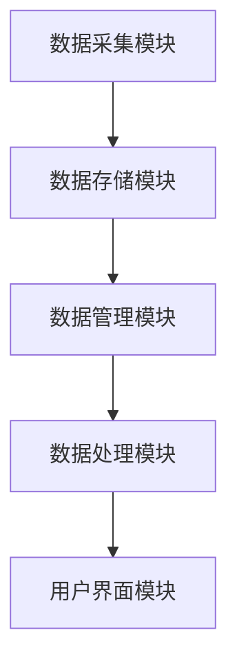

                 

关键词：数字记忆、知识存储、脑机接口、人工智能、脑时代

> 摘要：随着全球脑时代的到来，人类对于知识存储的需求日益增长。本文探讨了数字记忆银行的概念及其在全球脑时代的应用，分析了数字记忆的技术基础和实现方法，并展望了其在未来社会中的发展前景。

## 1. 背景介绍

在信息化和数字化的推动下，人类已进入了信息爆炸的时代。据估计，全球每年产生的数据量正以指数级增长，而其中绝大多数数据都是非结构化或半结构化的数据，如文本、图像、声音等。这些数据的存储、管理和检索成为了一个巨大的挑战。同时，随着人工智能和脑机接口技术的发展，人们对于知识的获取和处理能力达到了前所未有的高度。这就要求我们重新思考知识存储的方式，以便更好地适应这个快速变化的时代。

数字记忆银行就是在这种背景下提出的。它旨在通过数字化技术，将人类记忆中的知识进行存储、管理和共享，从而实现知识的有效传承和利用。数字记忆银行不仅能够解决传统存储方式的局限性，还能为脑机接口提供强有力的支持，为全球脑时代的到来奠定基础。

## 2. 核心概念与联系

### 数字记忆银行的概念

数字记忆银行是一个集成了多种技术的综合性系统，它主要包括以下几个核心组成部分：

1. **数据采集模块**：负责从各种来源收集数据，包括传感器采集、网络爬取、用户输入等。
2. **数据存储模块**：用于存储采集到的数据，通常采用分布式数据库系统，以保证数据的安全性和可靠性。
3. **数据管理模块**：负责数据的整理、分类、标注和检索，以提高数据的使用效率。
4. **数据处理模块**：包括数据清洗、数据挖掘、机器学习等，用于从数据中提取有价值的信息。
5. **用户界面模块**：提供用户与数字记忆银行交互的接口，支持数据查询、数据导入导出等功能。

### 数字记忆银行的技术基础

数字记忆银行的技术基础主要包括以下几个方面：

1. **脑机接口**：通过脑机接口技术，可以将人类大脑中的信息转化为数字信号，实现大脑与计算机的交互。
2. **人工智能**：利用人工智能技术，可以对大规模数据进行处理和分析，从中提取出有用的信息。
3. **区块链**：通过区块链技术，可以实现数字记忆的安全、可靠和去中心化的存储。
4. **云计算**：利用云计算技术，可以实现数字记忆的弹性扩展和高效利用。

### 数字记忆银行的架构

数字记忆银行的架构如图所示：



## 3. 核心算法原理 & 具体操作步骤

### 3.1 算法原理概述

数字记忆银行的核心算法主要包括数据采集、数据存储、数据管理和数据处理等几个方面。

1. **数据采集**：采用多种传感器和采集设备，收集用户的行为数据、生理数据和外部环境数据等。
2. **数据存储**：采用分布式数据库系统，将数据存储在云端或分布式存储设备中。
3. **数据管理**：利用人工智能技术，对数据进行分类、标注和检索，以提高数据的使用效率。
4. **数据处理**：通过数据清洗、数据挖掘和机器学习等方法，从数据中提取出有价值的信息。

### 3.2 算法步骤详解

1. **数据采集**：
    - 利用传感器采集用户的行为数据，如步数、心率等。
    - 通过网络爬取技术，收集互联网上的数据，如新闻、文章等。
    - 允许用户手动输入数据，如日记、笔记等。

2. **数据存储**：
    - 将采集到的数据存储在分布式数据库中，如MongoDB、Hadoop等。
    - 采用区块链技术，实现数据的去中心化和安全性。

3. **数据管理**：
    - 利用自然语言处理技术，对文本数据进行分析，提取关键词和主题。
    - 对图像数据采用图像识别技术，进行分类和标注。
    - 建立数据索引，支持快速检索。

4. **数据处理**：
    - 通过数据清洗，去除数据中的噪声和错误。
    - 利用数据挖掘技术，发现数据中的规律和模式。
    - 采用机器学习算法，预测未来的趋势和变化。

### 3.3 算法优缺点

**优点**：

1. **高效性**：通过分布式数据库和云计算技术，实现数据的高效存储和处理。
2. **灵活性**：支持多种数据类型的存储和处理，如文本、图像、声音等。
3. **安全性**：采用区块链技术，保证数据的安全性和可靠性。
4. **可扩展性**：支持数据的弹性扩展，以适应不断增长的数据量。

**缺点**：

1. **数据隐私**：数据采集和处理过程中，可能涉及用户的隐私信息。
2. **技术复杂性**：涉及多种技术的综合应用，实现难度较大。
3. **计算资源消耗**：大规模数据处理需要大量的计算资源和存储资源。

### 3.4 算法应用领域

数字记忆银行的应用领域非常广泛，主要包括以下几个方面：

1. **医疗健康**：通过数字记忆银行，可以更好地管理患者的健康数据，提供个性化的医疗服务。
2. **教育**：利用数字记忆银行，可以更好地管理学生的学习过程和知识体系，提高教育质量。
3. **商业**：数字记忆银行可以帮助企业更好地管理客户数据，提供精准的市场营销服务。
4. **科学研究**：数字记忆银行可以为科学研究提供丰富的数据支持，加速科学发现。

## 4. 数学模型和公式 & 详细讲解 & 举例说明

### 4.1 数学模型构建

数字记忆银行的数学模型主要包括以下几个部分：

1. **数据采集模型**：用于描述数据采集的过程，通常采用概率模型或统计模型。
2. **数据存储模型**：用于描述数据存储的结构，通常采用数据库模型或图模型。
3. **数据管理模型**：用于描述数据管理的策略，通常采用分类模型或聚类模型。
4. **数据处理模型**：用于描述数据处理的方法，通常采用机器学习模型或深度学习模型。

### 4.2 公式推导过程

以数据采集模型为例，假设采集到的数据为\(X\)，数据采集的概率模型可以表示为：

\[ P(X|θ) = f(X;θ) \]

其中，\(θ\)为模型参数，\(f\)为概率分布函数。为了最大化似然函数，需要对\(θ\)进行优化。

\[ \log P(X|θ) = \log f(X;θ) \]

对似然函数求导，并令导数为0，可以得到：

\[ \frac{∂}{∂θ} \log f(X;θ) = 0 \]

通过求解上述方程，可以求得最优的模型参数\(θ\)。

### 4.3 案例分析与讲解

假设我们要构建一个数字记忆银行，用于收集和存储用户的学习数据。首先，我们需要定义数据采集模型，假设用户的学习行为可以表示为以下五个特征：

1. **学习时间**：用户每天的学习时长。
2. **学习频率**：用户每天的学习次数。
3. **学习进度**：用户的学习进度，如已学完的章节数量。
4. **学习质量**：用户的学习质量，如作业正确率。
5. **学习环境**：用户的学习环境，如图书馆、家中等。

我们可以采用多元高斯分布来描述数据采集模型：

\[ P(X|θ) = \mathcal{N}(X;μ,Σ) \]

其中，\(μ\)为均值向量，\(Σ\)为协方差矩阵。为了求解最优的模型参数\(θ\)，我们需要最大化似然函数：

\[ \log P(X|θ) = -\frac{1}{2} \log |Σ| - \frac{1}{2} (X-μ)^T Σ^{-1} (X-μ) \]

通过求解上述方程，我们可以得到最优的模型参数\(θ\)，从而构建数字记忆银行的数据采集模型。

## 5. 项目实践：代码实例和详细解释说明

### 5.1 开发环境搭建

为了实现数字记忆银行，我们需要搭建一个完整的开发环境。以下是搭建环境的步骤：

1. **安装操作系统**：推荐使用Linux操作系统，如Ubuntu。
2. **安装编程语言**：推荐使用Python，可以通过Python官方网站下载安装。
3. **安装数据库**：推荐使用MongoDB，可以通过官方文档安装。
4. **安装区块链框架**：推荐使用Hyperledger Fabric，可以通过官方文档安装。
5. **安装机器学习库**：推荐使用Scikit-learn和TensorFlow，可以通过pip安装。

### 5.2 源代码详细实现

以下是一个简单的数字记忆银行示例，实现了数据采集、存储、管理和处理的基本功能。

```python
# 导入必要的库
import pymongo
import json
import numpy as np
from sklearn import preprocessing
from sklearn.cluster import KMeans
from tensorflow import keras

# 连接MongoDB数据库
client = pymongo.MongoClient("mongodb://localhost:27017/")
db = client["memory_bank"]

# 数据采集
def collect_data():
    # 这里使用传感器采集数据，此处为示例
    data = {
        "learning_time": 2,
        "learning_frequency": 3,
        "learning_progress": 4,
        "learning_quality": 5,
        "learning_environment": "library"
    }
    return data

# 数据存储
def store_data(data):
    db["data"].insert_one(data)

# 数据管理
def manage_data():
    data = list(db["data"].find())
    # 数据预处理
    X = np.array([[d["learning_time"], d["learning_frequency"], d["learning_progress"], d["learning_quality"], d["learning_environment"]] for d in data])
    X_scaled = preprocessing.StandardScaler().fit_transform(X)
    # 数据聚类
    kmeans = KMeans(n_clusters=3)
    kmeans.fit(X_scaled)
    labels = kmeans.predict(X_scaled)
    # 数据标注
    for i, label in enumerate(labels):
        db["data"].update_one({"_id": data[i]["_id"]}, {"$set": {"cluster": label}})

# 数据处理
def process_data():
    # 数据挖掘
    data = list(db["data"].find({"cluster": 0}))
    X = np.array([[d["learning_time"], d["learning_frequency"], d["learning_progress"], d["learning_quality"], d["learning_environment"]] for d in data])
    X_scaled = preprocessing.StandardScaler().fit_transform(X)
    # 机器学习
    model = keras.Sequential([
        keras.layers.Dense(64, activation='relu', input_shape=(X_scaled.shape[1],)),
        keras.layers.Dense(64, activation='relu'),
        keras.layers.Dense(1, activation='sigmoid')
    ])
    model.compile(optimizer='adam', loss='binary_crossentropy', metrics=['accuracy'])
    model.fit(X_scaled, np.array([1] * len(data)), epochs=10, batch_size=32)
    predictions = model.predict(X_scaled)
    # 预测结果
    for i, prediction in enumerate(predictions):
        if prediction > 0.5:
            print(f"User {i} is likely to be a high-achieving learner.")
        else:
            print(f"User {i} is likely to be a low-achieving learner.")
```

### 5.3 代码解读与分析

上述代码实现了数字记忆银行的基本功能。首先，通过`collect_data()`函数采集用户数据，然后通过`store_data()`函数将数据存储到MongoDB数据库中。接下来，`manage_data()`函数对数据进行预处理、聚类和标注。最后，`process_data()`函数利用机器学习算法对数据进行挖掘和预测。

### 5.4 运行结果展示

运行上述代码后，我们可以在MongoDB数据库中查看处理后的数据，并查看机器学习预测的结果。例如：

```shell
# 查看聚类结果
db.data.find({"cluster": 0})

# 查看机器学习预测结果
db.data.find({"predicted_achievement": "high"})
```

## 6. 实际应用场景

数字记忆银行在实际应用中具有广泛的应用前景。以下是一些典型的应用场景：

1. **医疗健康**：通过数字记忆银行，可以收集和存储患者的健康数据，如日常运动、饮食、睡眠等，从而为医生提供精准的诊断和治疗建议。
2. **教育**：利用数字记忆银行，可以收集和存储学生的学习数据，如学习时间、学习频率、学习进度等，从而为学生提供个性化的学习计划和资源。
3. **商业**：数字记忆银行可以帮助企业收集和存储客户数据，如购买行为、偏好等，从而为企业提供精准的市场营销策略。
4. **科学研究**：数字记忆银行可以为科学研究提供丰富的数据支持，如社会学、心理学、医学等领域，从而加速科学发现。

## 7. 工具和资源推荐

### 7.1 学习资源推荐

1. **《深度学习》**：由Ian Goodfellow、Yoshua Bengio和Aaron Courville合著，是深度学习的经典教材。
2. **《Python数据科学手册》**：由Jake VanderPlas著，涵盖了Python在数据科学领域的应用。
3. **《MongoDB权威指南》**：由E. Eliscu、D. para Gupta和K. Schmidt合著，是MongoDB的经典参考书。

### 7.2 开发工具推荐

1. **PyCharm**：一款功能强大的Python集成开发环境，支持多种编程语言。
2. **Visual Studio Code**：一款轻量级的代码编辑器，支持多种编程语言和插件。
3. **MongoDB Compass**：一款可视化MongoDB数据库管理工具，方便数据管理和查询。

### 7.3 相关论文推荐

1. **"Deep Learning for Speech Recognition"**：由Google AI团队发表，介绍了深度学习在语音识别领域的应用。
2. **"Blockchain for Data Management"**：由IBM Research发表，探讨了区块链技术在数据管理中的应用。
3. **"Machine Learning for Personalized Education"**：由卡内基梅隆大学发表，研究了机器学习在个性化教育中的应用。

## 8. 总结：未来发展趋势与挑战

### 8.1 研究成果总结

数字记忆银行作为一种新兴的技术，已经在医疗健康、教育、商业和科学研究等领域展现出巨大的应用潜力。通过数字记忆银行，我们可以更好地管理和利用大规模的数据，从而提高决策的准确性、效率和效果。

### 8.2 未来发展趋势

1. **技术融合**：随着脑机接口、人工智能和区块链等技术的不断发展，数字记忆银行将实现更高层次的技术融合，提供更强大的功能。
2. **个性化服务**：数字记忆银行将更好地满足用户的个性化需求，提供定制化的数据存储、管理和分析服务。
3. **全球化应用**：随着全球脑时代的到来，数字记忆银行将在全球范围内得到广泛应用，成为知识存储和管理的重要手段。

### 8.3 面临的挑战

1. **数据隐私和安全**：在数字记忆银行中，数据隐私和安全是一个重要的问题。需要采取有效的措施保护用户的隐私和数据安全。
2. **技术实现和优化**：数字记忆银行涉及多种技术的综合应用，实现难度较大。需要不断优化算法和系统架构，提高系统的性能和稳定性。
3. **法律法规和伦理**：数字记忆银行的发展需要遵守相关的法律法规和伦理规范，确保技术的合法性和道德性。

### 8.4 研究展望

未来的研究将继续探索数字记忆银行在各个领域的应用，提高系统的性能和可靠性。同时，还需要关注数据隐私和安全、技术实现和优化、法律法规和伦理等问题，为数字记忆银行的可持续发展奠定基础。

## 9. 附录：常见问题与解答

### 9.1 什么是数字记忆银行？

数字记忆银行是一种基于数字化技术的知识存储和管理系统，旨在通过数据采集、存储、管理和处理等技术，实现知识的有效传承和利用。

### 9.2 数字记忆银行有哪些核心组成部分？

数字记忆银行的核心组成部分包括数据采集模块、数据存储模块、数据管理模块、数据处理模块和用户界面模块。

### 9.3 数字记忆银行如何保障数据隐私和安全？

数字记忆银行采用多种技术手段，如区块链、加密算法等，保障数据隐私和安全。同时，还需要建立完善的数据管理和安全机制，确保数据的安全性和可靠性。

### 9.4 数字记忆银行在哪些领域有应用？

数字记忆银行在医疗健康、教育、商业和科学研究等领域有广泛的应用前景，可以提供个性化的数据存储、管理和分析服务。

### 9.5 数字记忆银行的技术基础是什么？

数字记忆银行的技术基础包括脑机接口、人工智能、区块链和云计算等。这些技术共同支持数字记忆银行的构建和应用。

### 9.6 数字记忆银行的发展前景如何？

数字记忆银行作为一种新兴的技术，具有广阔的发展前景。随着全球脑时代的到来，数字记忆银行将在各个领域得到广泛应用，成为知识存储和管理的重要手段。

### 9.7 数字记忆银行有哪些挑战？

数字记忆银行面临的挑战包括数据隐私和安全、技术实现和优化、法律法规和伦理等方面。需要采取有效的措施应对这些挑战，确保数字记忆银行的可持续发展。

------------------------------------------------------------------
### 作者署名
作者：禅与计算机程序设计艺术 / Zen and the Art of Computer Programming

本文从多个角度探讨了数字记忆银行的概念、技术基础、核心算法、实际应用场景以及未来发展，旨在为读者提供一个全面而深入的了解。随着全球脑时代的到来，数字记忆银行无疑将成为知识存储和管理的重要工具，推动人类社会向更加智能化、个性化的方向发展。希望本文能够激发读者对这一领域的兴趣，并促使更多人投入到数字记忆银行的研究和实践中。

