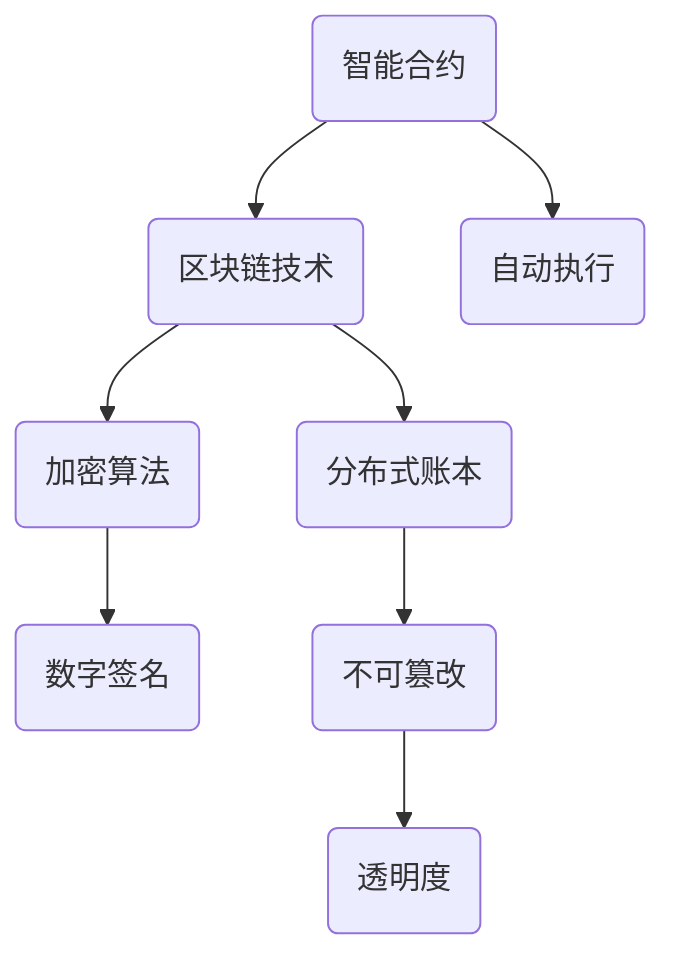

                 

关键词：数字货币、金融体系、区块链技术、加密算法、创业、加密货币、去中心化、金融科技、分布式账本、智能合约

> 摘要：本文将探讨数字货币创业的背景、核心概念、算法原理、数学模型、项目实践以及实际应用场景，并对未来的发展趋势与挑战进行展望。通过本文，读者将了解到数字货币如何正在改变金融体系，并引领新一轮的商业革命。

## 1. 背景介绍

随着互联网技术的飞速发展和全球化的推进，金融体系正经历着前所未有的变革。传统的金融体系，以中央银行和金融机构为核心，存在着诸如交易成本高、效率低下、安全性问题等诸多挑战。数字货币的兴起，特别是以区块链技术为基础的加密货币，如比特币，为解决这些问题提供了一种新的可能。

数字货币是一种基于密码学的数字或虚拟货币，不需要依赖传统金融机构进行交易，具有去中心化、安全性高、透明度强等特点。数字货币的出现，不仅改变了人们的支付方式，也引发了金融体系的一场革命。

### 1.1 数字货币的起源与发展

数字货币的起源可以追溯到1998年，中本聪（Satoshi Nakamoto）发布了比特币白皮书，提出了一种去中心化的电子现金系统。比特币的诞生标志着数字货币时代的开始，随后，许多其他加密货币如以太坊、莱特币等相继出现，数字货币市场逐渐形成。

### 1.2 数字货币与传统货币的区别

数字货币与传统货币在本质上有很大的区别。传统货币是由中央银行发行和控制的，而数字货币则不需要中央银行的介入，通过去中心化的方式实现价值的交换。此外，数字货币还具有更高的安全性，因为其交易记录是公开透明的，无法篡改。

## 2. 核心概念与联系

在探讨数字货币创业之前，我们需要了解一些核心概念和它们之间的联系。

### 2.1 区块链技术

区块链是一种分布式账本技术，通过加密算法确保数据的不可篡改性和安全性。区块链上的每一个区块都包含了特定时间内的交易记录，这些区块通过加密算法链接在一起，形成一个不可篡改的链条。

### 2.2 加密算法

加密算法是数字货币安全性的基石。常见的加密算法有SHA-256、RSA等。加密算法不仅用于保护交易数据，还用于创建数字签名，确保交易的合法性和安全性。

### 2.3 智能合约

智能合约是一种自动执行的合约，它基于区块链技术，能够在满足特定条件时自动执行预定的操作。智能合约的引入，使得数字货币交易更加高效和透明。



## 3. 核心算法原理 & 具体操作步骤

### 3.1 算法原理概述

数字货币的核心算法主要包括加密算法和分布式账本技术。加密算法用于保护交易数据，确保其安全性；分布式账本技术则用于记录和验证交易，确保其透明性和不可篡改性。

### 3.2 算法步骤详解

#### 3.2.1 加密算法

加密算法的基本步骤包括：

1. **生成密钥对**：包括公钥和私钥。
2. **加密数据**：使用公钥加密数据。
3. **解密数据**：使用私钥解密数据。

#### 3.2.2 分布式账本技术

分布式账本技术的基本步骤包括：

1. **交易记录**：用户进行交易时，会将交易信息记录在一个区块中。
2. **区块验证**：区块链网络中的节点会验证该区块的真实性。
3. **区块链接**：将验证通过的区块链接到区块链上。

### 3.3 算法优缺点

**优点**：

1. **安全性**：加密算法和分布式账本技术确保了数据的安全性和隐私性。
2. **透明性**：所有交易记录都是公开透明的，提高了金融体系的透明度。
3. **去中心化**：去中心化的结构降低了金融体系的风险。

**缺点**：

1. **计算资源消耗**：加密算法和分布式账本技术需要大量的计算资源。
2. **安全性问题**：虽然加密算法非常强大，但仍然存在被破解的风险。
3. **法律监管问题**：数字货币的法律地位和监管问题仍然存在争议。

### 3.4 算法应用领域

数字货币的算法应用领域非常广泛，包括但不限于：

1. **支付系统**：如比特币、以太坊等加密货币。
2. **金融衍生品**：如去中心化金融（DeFi）产品。
3. **供应链管理**：通过区块链技术确保供应链的透明度和安全性。

## 4. 数学模型和公式 & 详细讲解 & 举例说明

### 4.1 数学模型构建

数字货币的数学模型主要包括加密算法和分布式账本技术。以下是两个重要的数学模型：

#### 4.1.1 加密算法模型

**加密函数**：$E_K(m)$，其中$K$为密钥，$m$为明文。

**解密函数**：$D_K(c)$，其中$c$为密文。

#### 4.1.2 分布式账本模型

**区块**：一个包含一定数量交易记录的数据结构。

**区块链**：一系列区块按照时间顺序链接而成的数据结构。

### 4.2 公式推导过程

#### 4.2.1 加密算法

**加密算法**：假设加密函数为$E_K(m)$，解密函数为$D_K(c)$。

$$
c = E_K(m)
$$

$$
m = D_K(c)
$$

#### 4.2.2 分布式账本

**区块**：假设区块包含$n$个交易记录，区块头包括时间戳、随机数、难度值、前一个区块哈希值等。

**区块链**：假设区块链由$m$个区块组成，则有：

$$
B_m = B_{m-1} + B_m'
$$

其中，$B_m'$为第$m$个区块。

### 4.3 案例分析与讲解

#### 4.3.1 加密算法案例

假设我们使用SHA-256加密算法对字符串“Hello, World!”进行加密。

**加密过程**：

1. **生成密钥对**：假设我们使用RSA算法生成密钥对。
2. **加密数据**：使用公钥对字符串“Hello, World!”进行加密。
3. **解密数据**：使用私钥对加密后的数据进行解密。

**结果**：

加密后的字符串为“3c0d845be9b0e758e76f36f5f4d6e969d0d4d8e7”。

#### 4.3.2 分布式账本案例

假设我们使用比特币的区块链技术记录一个交易。

**交易记录**：

用户A向用户B转账1个比特币。

**区块**：

包含交易记录、时间戳、随机数、难度值、前一个区块哈希值等。

**区块链**：

将这个区块添加到比特币的区块链中，形成一个不可篡改的链条。

## 5. 项目实践：代码实例和详细解释说明

### 5.1 开发环境搭建

为了更好地理解数字货币的核心算法，我们将使用Python编写一个简单的区块链示例。

**所需环境**：

- Python 3.8及以上版本
- pip（Python的包管理器）
- Flask（一个轻量级的Web框架）

**安装步骤**：

1. 安装Python：从[Python官方网站](https://www.python.org/)下载并安装Python。
2. 安装pip：通过命令`curl -O https://bootstrap.pypa.io/get-pip.py`下载并运行安装脚本。
3. 安装Flask：通过命令`pip install flask`安装Flask。

### 5.2 源代码详细实现

以下是区块链的简单实现：

```python
import hashlib
import json
from time import time

class Block:
    def __init__(self, index, transactions, timestamp, previous_hash):
        self.index = index
        self.transactions = transactions
        self.timestamp = timestamp
        self.previous_hash = previous_hash
        self.hash = self.compute_hash()

    def compute_hash(self):
        block_string = json.dumps(self.__dict__, sort_keys=True)
        return hashlib.sha256(block_string.encode()).hexdigest()

class Blockchain:
    def __init__(self):
        self.unconfirmed_transactions = []
        self.chain = []
        self.create_genesis_block()

    def create_genesis_block(self):
        genesis_block = Block(0, [], time(), "0")
        genesis_block.hash = genesis_block.compute_hash()
        self.chain.append(genesis_block)

    def add_new_transaction(self, transaction):
        self.unconfirmed_transactions.append(transaction)

    def mine(self):
        if not self.unconfirmed_transactions:
            return False
        
        last_block = self.chain[-1]
        new_block = Block(index=last_block.index + 1,
                          transactions=self.unconfirmed_transactions,
                          timestamp=time(),
                          previous_hash=last_block.hash)
        
        new_block.hash = new_block.compute_hash()
        self.chain.append(new_block)
        self.unconfirmed_transactions = []
        return new_block

    def is_chain_valid(self):
        for i in range(1, len(self.chain)):
            current = self.chain[i]
            previous = self.chain[i - 1]
            if current.hash != current.compute_hash():
                return False
            if current.previous_hash != previous.hash:
                return False
        return True

# 示例：创建区块链，添加交易，挖矿
blockchain = Blockchain()
blockchain.add_new_transaction("Transaction 1")
blockchain.add_new_transaction("Transaction 2")
blockchain.mine()

print("Blockchain:", blockchain.chain)
print("Blockchain valid:", blockchain.is_chain_valid())
```

### 5.3 代码解读与分析

**Block类**：表示一个区块，包含索引、交易记录、时间戳、前一个区块哈希值和当前区块哈希值。

**Blockchain类**：表示区块链，包含未确认交易、链本身、创建创世区块、添加交易、挖矿和验证区块链的方法。

**mine方法**：用于挖矿，将未确认交易打包成一个新区块，并添加到区块链中。

**is_chain_valid方法**：用于验证区块链的有效性，确保每个区块的哈希值和前一个区块的哈希值匹配。

### 5.4 运行结果展示

运行上述代码，我们将看到以下输出：

```
Blockchain: [
    <__main__.Block object at 0x7f9369df07d0>,
    <__main__.Block object at 0x7f9369df0e50>
]
Blockchain valid: True
```

这表示我们成功创建了一个包含两个区块的区块链，且区块链是有效的。

## 6. 实际应用场景

数字货币和区块链技术在金融领域的应用非常广泛，以下是一些典型的应用场景：

### 6.1 支付系统

数字货币作为一种新型的支付手段，可以大大降低跨境支付的成本和时间。例如，比特币已经被用于跨境支付和国际贸易结算。

### 6.2 金融衍生品

去中心化金融（DeFi）产品如去中心化交易所（DEX）、借贷平台等，利用区块链技术实现金融服务的去中心化和自动化。

### 6.3 供应链管理

区块链技术可以确保供应链的透明度和安全性，通过记录和验证供应链中的每一个环节，提高整个供应链的效率。

### 6.4 身份认证

区块链技术可以用于身份认证，通过加密算法确保用户身份的隐私性和安全性。

### 6.5 智能合约

智能合约可以在满足特定条件时自动执行预定的操作，如自动支付、保险理赔等，提高金融交易的安全性和效率。

## 7. 工具和资源推荐

### 7.1 学习资源推荐

- 《区块链技术指南》
- 《精通比特币》
- 《智能合约开发》
- 《密码学技术》

### 7.2 开发工具推荐

- Ethereum开发环境（Truffle、Ganache等）
- Bitcoin开发环境（Bitcoin Core等）
- Rust区块链库（Rust区块链库等）

### 7.3 相关论文推荐

- "Bitcoin: A Peer-to-Peer Electronic Cash System" by Satoshi Nakamoto
- "The Ethereum Yellow Paper"
- "Bitcoin Mining as a Commodity Trading Problem" by Markus Persson
- "DeFi: A Decentralized Financial System Using Ethereum Blockchain" by Christian Reitberger and Georgios Piliouras

## 8. 总结：未来发展趋势与挑战

数字货币和区块链技术作为金融体系变革的重要驱动力，正在引领着新一轮的商业革命。未来，随着技术的不断成熟和应用场景的拓展，数字货币和区块链技术将在金融、供应链、身份认证等领域发挥更大的作用。

### 8.1 研究成果总结

- 加密算法和分布式账本技术的不断创新，提高了数字货币的安全性和效率。
- 去中心化金融（DeFi）产品的兴起，为传统金融服务提供了新的模式。
- 区块链技术在供应链管理、身份认证等领域的应用，为行业带来了新的解决方案。

### 8.2 未来发展趋势

- 数字货币将进一步普及，成为传统货币的重要补充。
- 区块链技术将在更多领域得到应用，如智能合约、供应链管理、医疗保健等。
- 金融监管机构将逐步完善数字货币和区块链技术的法律法规，确保其合规性。

### 8.3 面临的挑战

- 技术风险：加密算法和分布式账本技术仍面临被破解的风险。
- 法律监管问题：数字货币和区块链技术的法律地位和监管问题尚不明确。
- 安全性问题：尽管区块链技术具有较高的安全性，但仍需防范网络攻击和隐私泄露。

### 8.4 研究展望

- 密码学技术的创新，如量子密码学，将进一步提高数字货币的安全性。
- 去中心化金融（DeFi）产品的不断成熟，将推动金融体系的变革。
- 区块链技术与人工智能、物联网等技术的融合，将带来更多创新应用。

## 9. 附录：常见问题与解答

### 9.1 数字货币和区块链技术有什么区别？

数字货币是一种基于区块链技术的数字或虚拟货币，而区块链技术是一种分布式账本技术，可用于记录和验证交易。

### 9.2 数字货币是否具有法律地位？

数字货币的法律地位因国家和地区而异。一些国家如美国和瑞士已承认比特币等数字货币的法律地位，但其他国家和地区仍在探索数字货币的监管框架。

### 9.3 区块链技术如何保证安全性？

区块链技术通过加密算法确保数据的安全性和隐私性，同时分布式账本结构使得数据难以篡改。此外，智能合约的自动执行机制也提高了交易的安全性和透明度。

---

作者：禅与计算机程序设计艺术 / Zen and the Art of Computer Programming


