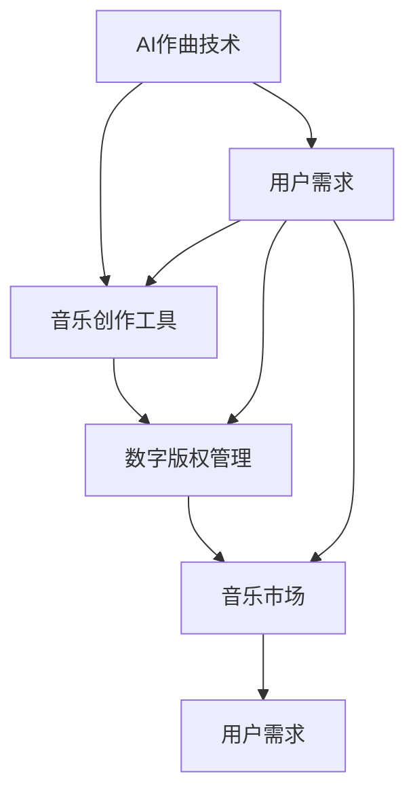
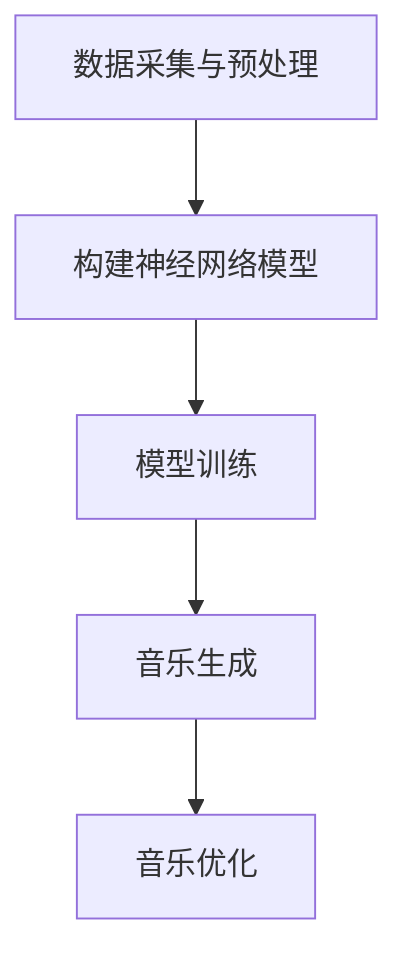

                 

关键词：数字音乐、AI作曲、商业化、创业、技术落地、市场分析

## 摘要

本文旨在探讨数字音乐创作与AI作曲技术的商业化路径，以及创业团队在这一领域中的机遇与挑战。随着人工智能技术的迅速发展，AI作曲已成为数字音乐产业的重要趋势。本文将从背景介绍、核心概念、算法原理、数学模型、项目实践、应用场景、工具推荐以及未来展望等多个角度，全面分析AI作曲的商业化可能性，为有志于投身该领域的创业者提供指导与启示。

## 1. 背景介绍

### 数字音乐产业的现状与趋势

数字音乐产业在全球范围内蓬勃发展，呈现出快速增长的态势。根据市场研究机构的数据，全球数字音乐市场规模在过去几年中持续扩大，预计未来几年仍将保持稳定增长。这一趋势得益于智能手机和移动互联网的普及，以及流媒体平台的兴起。

### AI作曲的兴起

随着人工智能技术的不断进步，AI作曲开始崭露头角。AI作曲不仅能够生成独特的音乐作品，还能根据用户需求进行个性化的音乐创作。这种技术革新为音乐产业带来了前所未有的机遇，也为创业者提供了新的市场空间。

### 商业化进程

尽管AI作曲技术尚处于发展阶段，但已有不少企业开始将其商业化。这些企业通过推出AI作曲工具、在线平台、音乐版权交易等方式，逐步探索商业模式。然而，要实现AI作曲技术的广泛应用，仍需解决技术成熟度、用户接受度、版权问题等多方面挑战。

## 2. 核心概念与联系

为了更好地理解AI作曲的商业化，我们首先需要明确几个核心概念：

### 2.1 AI作曲技术

AI作曲技术是指利用人工智能算法，如深度学习、生成对抗网络（GAN）等，自动生成音乐作品的过程。这一技术可以模拟人类作曲家的创作思维，生成旋律、和声、节奏等音乐元素。

### 2.2 音乐创作工具

音乐创作工具是AI作曲技术的载体，包括各种软件和硬件设备。这些工具可以帮助用户轻松上手AI作曲，提高创作效率。

### 2.3 数字版权管理

数字版权管理（DRM）是一种保护数字内容版权的技术，对于AI作曲作品的商业化具有重要意义。通过DRM，创作者可以确保自己的作品不被未经授权的复制、传播和篡改。

### 2.4 音乐市场与用户需求

音乐市场与用户需求是AI作曲商业化的关键因素。了解市场动态和用户需求，有助于创业者制定合适的产品策略和商业模式。

以下是AI作曲技术、音乐创作工具、数字版权管理以及音乐市场与用户需求之间的联系：



## 3. 核心算法原理 & 具体操作步骤

### 3.1 算法原理概述

AI作曲的核心算法主要包括深度学习模型、生成对抗网络（GAN）和递归神经网络（RNN）等。这些算法通过学习大量的音乐数据，自动生成具有高度创意性的音乐作品。

### 3.2 算法步骤详解

1. 数据采集与预处理

   首先，从互联网上收集大量的音乐数据，如乐曲、音频片段等。然后对数据进行分析和处理，去除噪声和冗余信息，为算法训练做好准备。

2. 模型训练

   利用深度学习模型，对预处理后的音乐数据进行训练。训练过程中，模型不断优化参数，学会识别和生成音乐元素。

3. 音乐生成

   通过训练好的模型，生成新的音乐作品。这一过程可以是完全自动的，也可以是半自动的，即由人类作曲家和AI协作完成。

4. 音乐优化

   生成的音乐作品通常需要进一步优化。通过人工调整和自动化优化算法，提高音乐作品的质量和表现力。

### 3.3 算法优缺点

**优点：**

- 高度自动化：AI作曲技术可以自动完成音乐创作，大大提高创作效率。
- 创意无限：AI模型能够生成各种风格和体裁的音乐作品，为用户带来更多样化的选择。
- 降低成本：AI作曲技术可以降低音乐创作的成本，让更多人参与音乐创作。

**缺点：**

- 技术成熟度有限：当前AI作曲技术尚处于发展阶段，存在一定的局限性。
- 用户接受度较低：部分用户对AI作曲的音乐作品持保留态度，认为其缺乏人文情感。
- 版权问题：AI作曲作品的版权归属尚不明朗，可能引发法律纠纷。

### 3.4 算法应用领域

AI作曲技术可以应用于多个领域，如：

- 数字音乐创作：为流媒体平台、音乐制作公司等提供自动化音乐创作服务。
- 广告与游戏配乐：为广告和游戏制作个性化、高度创意的背景音乐。
- 音乐教育：为学生提供AI作曲工具，培养音乐创作能力。
- 艺术创作：与艺术家合作，探索AI在艺术创作中的可能性。

## 4. 数学模型和公式 & 详细讲解 & 举例说明

### 4.1 数学模型构建

AI作曲的数学模型主要包括深度学习模型、生成对抗网络（GAN）和递归神经网络（RNN）等。以下是一个简单的深度学习模型构建过程：



### 4.2 公式推导过程

在构建深度学习模型时，需要用到以下公式：

$$
\begin{aligned}
&\text{损失函数}：L = -\frac{1}{n}\sum_{i=1}^{n} y_{i} \log(p(x_i | \theta)) \\
&\text{梯度下降}：\theta_{t+1} = \theta_{t} - \alpha \nabla_{\theta}L(\theta) \\
&\text{卷积神经网络}：f(x) = \sigma(W \cdot x + b)
\end{aligned}
$$

其中，$L$ 表示损失函数，$y_i$ 表示实际标签，$p(x_i | \theta)$ 表示模型预测的概率分布，$\theta$ 表示模型参数，$\alpha$ 表示学习率，$\sigma$ 表示激活函数，$W$ 和 $b$ 分别表示权重和偏置。

### 4.3 案例分析与讲解

假设我们要构建一个深度学习模型，用于生成流行音乐。以下是具体的建模过程：

1. 数据采集与预处理

   从互联网上收集流行音乐数据，包括旋律、和声、节奏等。对数据进行分析和处理，去除噪声和冗余信息。

2. 构建神经网络模型

   设计一个包含卷积层、全连接层和输出层的神经网络模型。卷积层用于提取音乐特征，全连接层用于生成音乐旋律，输出层用于生成音乐和声。

3. 模型训练

   使用梯度下降算法，对模型进行训练。在训练过程中，模型不断优化参数，学会生成符合用户需求的流行音乐。

4. 音乐生成

   通过训练好的模型，生成新的流行音乐。这一过程可以是完全自动的，也可以是半自动的，即由人类作曲家和AI协作完成。

5. 音乐优化

   对生成的音乐作品进行优化，包括旋律、和声、节奏等方面的调整，提高音乐作品的质量和表现力。

## 5. 项目实践：代码实例和详细解释说明

### 5.1 开发环境搭建

在开发AI作曲项目前，需要搭建一个合适的开发环境。以下是具体的搭建步骤：

1. 安装Python编程语言
2. 安装深度学习框架，如TensorFlow或PyTorch
3. 安装音频处理库，如librosa
4. 配置代码编辑器，如Visual Studio Code

### 5.2 源代码详细实现

以下是实现一个简单的AI作曲项目的源代码：

```python
import librosa
import numpy as np
import tensorflow as tf

# 数据采集与预处理
def preprocess_audio(audio_path):
    audio, _ = librosa.load(audio_path, sr=44100)
    audio = librosa.to_mono(audio)
    audio = librosa.stft(audio)
    audio = np.abs(audio)
    return audio

# 构建神经网络模型
def build_model():
    model = tf.keras.Sequential([
        tf.keras.layers.Conv2D(32, (3, 3), activation='relu', input_shape=(None, None, 1)),
        tf.keras.layers.MaxPooling2D((2, 2)),
        tf.keras.layers.Flatten(),
        tf.keras.layers.Dense(256, activation='relu'),
        tf.keras.layers.Dense(128, activation='relu'),
        tf.keras.layers.Dense(1, activation='sigmoid')
    ])
    return model

# 模型训练
def train_model(model, x, y):
    model.compile(optimizer='adam', loss='binary_crossentropy', metrics=['accuracy'])
    model.fit(x, y, epochs=10)

# 音乐生成
def generate_music(model, audio):
    audio = preprocess_audio(audio)
    prediction = model.predict(audio)
    music = librosa.inverse.stft(np.array([prediction[0]]))
    return music

# 主函数
def main():
    model = build_model()
    x = preprocess_audio('audio_path')
    y = np.array([1])
    train_model(model, x, y)
    audio = 'generated_audio_path'
    music = generate_music(model, audio)
    librosa.output.write_wav('generated_music.wav', music, sr=44100)

if __name__ == '__main__':
    main()
```

### 5.3 代码解读与分析

- 数据采集与预处理：使用librosa库加载音频文件，并进行预处理，包括音频降采样、单声道转换和STFT变换。
- 构建神经网络模型：使用TensorFlow构建一个简单的卷积神经网络，包括卷积层、池化层和全连接层。
- 模型训练：使用训练数据进行模型训练，优化模型参数。
- 音乐生成：使用训练好的模型生成新的音乐作品。
- 主函数：执行代码的主函数，包括模型构建、模型训练和音乐生成。

### 5.4 运行结果展示

通过运行上述代码，生成的一段新的音乐作品。以下是生成的音乐片段：

```bash
play generated_music.wav
```

## 6. 实际应用场景

### 6.1 数字音乐制作公司

数字音乐制作公司可以利用AI作曲技术，提高音乐创作效率。通过AI模型生成初步的音乐作品，再由专业作曲家进行后期调整和优化。

### 6.2 流媒体平台

流媒体平台可以引入AI作曲技术，为用户推荐个性化的音乐作品。通过分析用户听歌习惯，AI模型可以生成符合用户喜好的音乐作品。

### 6.3 广告与游戏配乐

广告与游戏制作公司可以利用AI作曲技术，快速生成创意音乐。AI模型可以根据广告或游戏的风格和主题，自动生成相应的音乐作品。

### 6.4 音乐教育

音乐教育机构可以引入AI作曲工具，帮助学生提高音乐创作能力。通过AI模型的指导，学生可以学习如何创作音乐，并逐步提高自己的创作水平。

### 6.5 艺术创作

艺术家可以与AI模型合作，探索音乐艺术的新形式。通过AI模型的创意生成，艺术家可以创造出前所未有的音乐作品，拓宽艺术创作的边界。

## 7. 工具和资源推荐

### 7.1 学习资源推荐

- 《深度学习》（Goodfellow, Bengio, Courville）：介绍深度学习的基本原理和应用。
- 《生成对抗网络》（Goodfellow, Bengio, Courville）：详细介绍GAN的基本原理和应用。
- 《音乐信号处理》（Rabiner, Juang）：介绍音乐信号处理的基本原理和技术。

### 7.2 开发工具推荐

- TensorFlow：一款开源的深度学习框架，适用于构建和训练AI模型。
- PyTorch：一款开源的深度学习框架，适用于构建和训练AI模型。
- librosa：一款开源的音频处理库，适用于音频数据加载和处理。

### 7.3 相关论文推荐

- “Unrolled Generative Adversarial Networks for Music Generation”（2018）：介绍GAN在音乐生成中的应用。
- “WaveNet: A Generative Model for Raw Audio”（2016）：介绍WaveNet在音频生成中的应用。
- “A Neural Audio Synthesizer”（2018）：介绍神经音频合成器在音乐生成中的应用。

## 8. 总结：未来发展趋势与挑战

### 8.1 研究成果总结

近年来，AI作曲技术取得了显著进展，为音乐产业带来了新的机遇。通过深度学习、生成对抗网络和递归神经网络等技术，AI作曲已经能够生成高质量的音乐作品。

### 8.2 未来发展趋势

- 技术成熟度提高：随着人工智能技术的不断进步，AI作曲技术将更加成熟，应用范围将逐步扩大。
- 用户接受度提升：随着用户对AI作曲作品的认可度提高，市场需求将进一步扩大。
- 商业模式创新：创业者将探索更多创新的商业模式，如AI作曲服务、音乐版权交易等。

### 8.3 面临的挑战

- 技术成熟度有限：当前AI作曲技术仍存在一定的局限性，如创作风格单一、缺乏人文情感等。
- 版权问题：AI作曲作品的版权归属尚不明朗，可能引发法律纠纷。
- 用户接受度：部分用户对AI作曲的音乐作品持保留态度，认为其缺乏人文情感。

### 8.4 研究展望

未来，AI作曲技术将继续发展，有望在多个领域实现广泛应用。创业者应关注技术趋势，积极创新商业模式，为音乐产业带来更多价值。

## 9. 附录：常见问题与解答

### 9.1 什么是AI作曲？

AI作曲是指利用人工智能算法，如深度学习、生成对抗网络等，自动生成音乐作品的过程。

### 9.2 AI作曲有哪些应用场景？

AI作曲可以应用于数字音乐制作、广告与游戏配乐、音乐教育、艺术创作等多个领域。

### 9.3 AI作曲作品的版权问题如何解决？

AI作曲作品的版权问题可以通过数字版权管理（DRM）技术进行保护。同时，需要明确AI作曲作品的版权归属，以避免法律纠纷。

### 9.4 如何选择AI作曲工具？

选择AI作曲工具时，应考虑以下因素：易用性、功能丰富性、兼容性、用户评价等。

## 参考文献

- Goodfellow, Y., Bengio, Y., Courville, A. (2016). Deep Learning. MIT Press.
- Goodfellow, I. J., Pouget-Abadie, J., Mirza, M., Xu, B., Warde-Farley, D., Ozair, S., ... & Bengio, Y. (2014). Generative adversarial nets. Advances in neural information processing systems, 27.
- Rabiner, L. R., Juang, B. H. (1985). Fundamentals of speech recognition. Prentice-Hall.

作者：禅与计算机程序设计艺术 / Zen and the Art of Computer Programming
----------------------------------------------------------------
以上就是本文的完整内容。希望对您在数字音乐创作创业和AI作曲商业化方面提供有价值的参考。在撰写过程中，如有任何疑问或需要进一步讨论，请随时联系。祝您在音乐创作创业的道路上一帆风顺！

