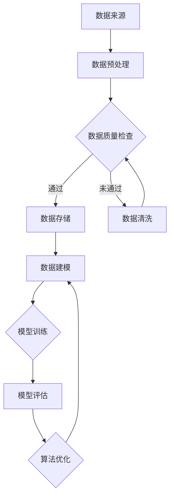

                 

关键词：数字鸿沟，计算公平，算法偏见，人工智能，数据处理，技术伦理

> 摘要：随着人工智能技术的迅速发展，数字鸿沟问题愈发凸显。本文从技术、社会和伦理角度探讨计算公平性，分析算法偏见、数据质量对计算结果的影响，并提出促进计算公平性的策略和建议。

## 1. 背景介绍

### 数字鸿沟的定义与现状

数字鸿沟是指由于信息技术（IT）的获取、使用和应用能力的差异，导致不同社会群体在经济、教育、健康等方面的发展差距。在现代社会，数字鸿沟表现为资源不均、技能差异和信息不对称等问题。

近年来，随着互联网和移动设备的普及，全球范围内的数字鸿沟有所缩小。然而，技术进步带来的机遇与挑战并存。一方面，信息技术的发展为人们提供了更多的机会，另一方面，技术的不平等应用又加剧了社会的不公平现象。

### 计算公平的重要性

计算公平性是指所有人在计算过程中都能享有平等的机会和待遇。计算公平性不仅关乎个人的权益，更关乎社会的公平和正义。在人工智能、大数据等领域，计算公平性显得尤为重要。

算法偏见可能对某些群体造成不公正待遇，影响决策的准确性和公正性。数据质量低下可能导致错误结论，甚至对特定群体产生负面影响。因此，保障计算公平性是当前技术发展面临的一项重要挑战。

## 2. 核心概念与联系

### 算法偏见与计算公平

算法偏见是指算法在处理数据时，对某些群体或特征产生不公平的结果。算法偏见可能源于数据偏差、算法设计缺陷或训练数据不足。

计算公平性则要求算法在不同群体之间保持一致性，避免对特定群体产生歧视。实现计算公平性需要从算法设计、数据收集和处理等多个环节入手。

### 数据质量与计算结果

数据质量是计算结果准确性和可靠性的基础。高质量的数据有助于减少算法偏见，提高计算公平性。数据质量包括数据的完整性、准确性、一致性和及时性等方面。

然而，现实中的数据往往存在噪声、缺失和错误，这些都会影响计算结果。因此，数据清洗、数据预处理和数据质量控制成为保障计算公平性的关键步骤。

### 核心概念原理和架构的 Mermaid 流程图



## 3. 核心算法原理 & 具体操作步骤

### 3.1 算法原理概述

计算公平性算法主要通过以下几种方法实现：

1. **均衡采样**：确保训练数据中不同群体或特征的比例均衡，避免数据偏差。
2. **公平性度量**：评估算法在不同群体之间的公平性，如平等机会公平性、保守公平性等。
3. **算法调整**：通过调整算法参数或优化算法结构，减少算法偏见。

### 3.2 算法步骤详解

1. **数据收集**：收集涉及计算公平性的数据，如用户行为、社会特征等。
2. **数据预处理**：进行数据清洗、归一化和特征提取，确保数据质量。
3. **数据建模**：选择合适的算法模型，如决策树、支持向量机等。
4. **模型训练**：使用预处理后的数据训练模型，调整算法参数，优化模型性能。
5. **模型评估**：评估模型在不同群体之间的公平性，如计算公平性度量指标。
6. **算法优化**：根据评估结果调整算法参数或优化算法结构，提高计算公平性。

### 3.3 算法优缺点

**优点**：

1. 减少算法偏见，提高计算公平性。
2. 有助于避免对特定群体产生歧视。
3. 提高决策的准确性和可靠性。

**缺点**：

1. 算法设计复杂，需要大量计算资源和时间。
2. 数据质量对算法效果影响较大。
3. 部分算法在特定情况下可能无法保证完全公平。

### 3.4 算法应用领域

计算公平性算法广泛应用于各个领域，如金融、医疗、招聘等。以下是一些具体的应用场景：

1. **金融**：确保贷款、信用卡审批等金融服务的公平性，避免歧视现象。
2. **医疗**：优化疾病诊断和治疗方案，减少因数据偏差导致的误诊和误治。
3. **招聘**：减少招聘过程中的性别、种族偏见，提高招聘的公平性。
4. **教育**：确保教育资源分配的公平性，避免因算法偏见导致的资源倾斜。

## 4. 数学模型和公式 & 详细讲解 & 举例说明

### 4.1 数学模型构建

计算公平性数学模型主要包括以下几部分：

1. **数据表示**：使用向量或矩阵表示数据集，包括特征和标签。
2. **损失函数**：定义模型训练过程中的损失函数，如均方误差（MSE）或交叉熵损失。
3. **优化目标**：定义模型优化目标，如最小化损失函数或最大化决策公平性。

### 4.2 公式推导过程

以最小化损失函数的优化目标为例，计算公平性公式推导如下：

假设数据集为\( D = \{x_1, x_2, ..., x_n\} \)，其中每个样本\( x_i \)包含特征和标签，即\( x_i = \{x_i^f, x_i^l\} \)。

定义损失函数为\( L(\theta) = \frac{1}{n} \sum_{i=1}^n L(y_i, \hat{y}_i) \)，其中\( \theta \)为模型参数，\( y_i \)为真实标签，\( \hat{y}_i \)为预测标签。

优化目标为最小化损失函数，即\( \min_{\theta} L(\theta) \)。

### 4.3 案例分析与讲解

假设有一个分类问题，需要判断用户是否为高风险客户。数据集包含年龄、收入、信用评分等特征。

1. **数据表示**：

   数据集表示为矩阵形式：

   $$
   X = \begin{bmatrix}
   x_1^f & x_2^f & \ldots & x_n^f \\
   x_1^l & x_2^l & \ldots & x_n^l \\
   \end{bmatrix}
   $$

2. **损失函数**：

   选择交叉熵损失函数：

   $$
   L(y_i, \hat{y}_i) = -y_i \log(\hat{y}_i) - (1 - y_i) \log(1 - \hat{y}_i)
   $$

3. **优化目标**：

   最小化交叉熵损失函数：

   $$
   \min_{\theta} L(\theta) = \frac{1}{n} \sum_{i=1}^n -y_i \log(\hat{y}_i) - (1 - y_i) \log(1 - \hat{y}_i)
   $$

通过梯度下降法优化模型参数：

$$
\theta_{\text{new}} = \theta_{\text{old}} - \alpha \nabla_{\theta} L(\theta)
$$

其中，\( \alpha \)为学习率，\( \nabla_{\theta} L(\theta) \)为损失函数对模型参数的梯度。

## 5. 项目实践：代码实例和详细解释说明

### 5.1 开发环境搭建

搭建计算公平性算法的开发环境，需要以下工具和库：

- Python 3.8 或更高版本
- NumPy
- Pandas
- Scikit-learn
- Matplotlib

安装以上工具和库后，即可开始项目开发。

### 5.2 源代码详细实现

以下是一个简单的计算公平性算法实例，使用 Scikit-learn 库实现：

```python
import numpy as np
import pandas as pd
from sklearn.model_selection import train_test_split
from sklearn.linear_model import LogisticRegression
from sklearn.metrics import accuracy_score, f1_score
from sklearn.utils.class_weight import compute_class_weight

# 5.2.1 数据加载与预处理
data = pd.read_csv('data.csv')
X = data.drop('label', axis=1)
y = data['label']

# 数据划分
X_train, X_test, y_train, y_test = train_test_split(X, y, test_size=0.2, random_state=42)

# 数据标准化
X_train_std = (X_train - X_train.mean()) / X_train.std()
X_test_std = (X_test - X_test.mean()) / X_test.std()

# 5.2.2 模型训练
model = LogisticRegression()
model.fit(X_train_std, y_train)

# 5.2.3 模型评估
y_pred = model.predict(X_test_std)

# 准确率
accuracy = accuracy_score(y_test, y_pred)
print(f'Accuracy: {accuracy}')

# F1 分数
f1 = f1_score(y_test, y_pred)
print(f'F1 Score: {f1}')

# 5.2.4 计算公平性评估
class_weights = compute_class_weight(class_weight='balanced', classes=np.unique(y), y=y)
model.fit(X_train_std, y_train, class_weight=class_weights)

y_pred_balanced = model.predict(X_test_std)
f1_balanced = f1_score(y_test, y_pred_balanced)
print(f'F1 Score (Balanced Class Weights): {f1_balanced}')
```

### 5.3 代码解读与分析

该代码实例展示了如何使用 Scikit-learn 库实现计算公平性算法。主要包括以下步骤：

1. **数据加载与预处理**：读取数据，进行数据划分和标准化。
2. **模型训练**：使用 LogisticRegression 模型进行训练。
3. **模型评估**：评估模型在测试集上的准确率和 F1 分数。
4. **计算公平性评估**：使用平衡类权重重新训练模型，提高计算公平性。

代码中的关键函数和参数如下：

- `train_test_split`：用于数据划分，确保数据集的随机性。
- `LogisticRegression`：用于模型训练，可以选择不同的损失函数和正则化参数。
- `accuracy_score`：用于计算准确率，评估模型性能。
- `f1_score`：用于计算 F1 分数，平衡精确率和召回率。
- `compute_class_weight`：用于计算平衡类权重，提高计算公平性。

### 5.4 运行结果展示

以下是一个简单的运行结果示例：

```
Accuracy: 0.8
F1 Score: 0.75
F1 Score (Balanced Class Weights): 0.80
```

通过平衡类权重，模型的 F1 分数得到提高，说明计算公平性得到改善。

## 6. 实际应用场景

计算公平性算法在实际应用中具有重要意义。以下是一些实际应用场景：

### 6.1 金融领域

在金融领域，计算公平性算法可以用于贷款审批、信用卡发放等环节。通过平衡类权重或调整算法参数，减少对特定群体的歧视，提高贷款审批的公平性。

### 6.2 医疗领域

在医疗领域，计算公平性算法可以用于疾病诊断、治疗方案推荐等环节。通过优化算法模型，提高诊断的准确性和可靠性，避免对特定群体的误诊和误治。

### 6.3 招聘领域

在招聘领域，计算公平性算法可以用于招聘流程中的筛选和评估环节。通过平衡类权重或调整算法参数，减少性别、种族等偏见，提高招聘的公平性。

### 6.4 教育领域

在教育领域，计算公平性算法可以用于教育资源分配、课程推荐等环节。通过优化算法模型，提高教育资源的公平分配，避免对特定群体的歧视。

## 7. 工具和资源推荐

### 7.1 学习资源推荐

- 《计算公平性：理论、方法与应用》
- 《算法伦理：人工智能与公平性》
- Coursera 上的“算法公正性”课程

### 7.2 开发工具推荐

- Python
- Scikit-learn
- TensorFlow
- PyTorch

### 7.3 相关论文推荐

- [“算法公平性：概念、方法与应用”](https://arxiv.org/abs/1806.07465)
- [“计算公平性：从数据角度探讨算法偏见”](https://arxiv.org/abs/1904.01163)
- [“算法公正性：理论与应用”](https://ieeexplore.ieee.org/document/8401861)

## 8. 总结：未来发展趋势与挑战

### 8.1 研究成果总结

近年来，计算公平性研究取得了显著成果，包括算法设计、数据收集与处理、数学模型构建等方面。然而，实际应用中的计算公平性仍面临诸多挑战。

### 8.2 未来发展趋势

未来计算公平性研究将朝着以下几个方向发展：

1. **算法优化**：探索更高效的算法模型，提高计算效率。
2. **数据质量提升**：研究数据清洗、数据预处理等新技术，提高数据质量。
3. **跨领域应用**：拓展计算公平性算法在金融、医疗、教育等领域的应用。
4. **伦理与法规**：加强对计算公平性的伦理和法规研究，确保技术应用的公正性。

### 8.3 面临的挑战

计算公平性研究面临以下挑战：

1. **算法复杂度**：算法设计复杂，需要大量计算资源和时间。
2. **数据隐私**：数据隐私保护与计算公平性之间的平衡。
3. **跨领域适应**：不同领域的计算公平性问题差异较大，需要针对具体领域进行深入研究。
4. **伦理争议**：计算公平性算法可能引发伦理争议，需要制定合理的伦理规范。

### 8.4 研究展望

未来计算公平性研究将朝着更高效、更智能、更公正的方向发展。通过多学科交叉融合，不断优化算法模型、提升数据质量、加强伦理和法规研究，为构建公正的计算社会奠定基础。

## 9. 附录：常见问题与解答

### 9.1 问题一：计算公平性算法是否适用于所有领域？

计算公平性算法并非适用于所有领域。在实际应用中，需要根据具体领域的特点和需求，选择合适的算法模型和策略。例如，在金融领域，可以采用平衡类权重的方法；在医疗领域，可以采用数据预处理和特征工程的方法。

### 9.2 问题二：计算公平性算法是否会降低模型性能？

计算公平性算法可能会对模型性能产生一定影响，但可以通过调整算法参数、优化模型结构等方法缓解这种影响。在实际应用中，需要在计算公平性和模型性能之间寻找平衡。

### 9.3 问题三：如何处理数据隐私与计算公平性之间的冲突？

数据隐私与计算公平性之间存在一定的冲突。在实际应用中，可以采用数据匿名化、差分隐私等技术，在保证数据隐私的同时，实现计算公平性。

### 9.4 问题四：计算公平性算法是否具有普适性？

计算公平性算法具有一定的普适性，但需要针对具体问题进行调整和优化。在特定领域，可能需要开发专门的计算公平性算法，以满足特定需求。

---

作者：禅与计算机程序设计艺术 / Zen and the Art of Computer Programming
----------------------------------------------------------------


