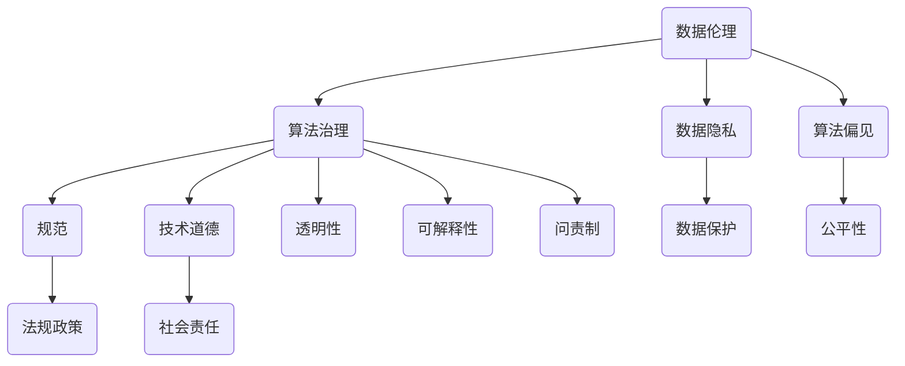

                 

关键词：数据伦理、算法治理、规范、数据隐私、算法偏见、人工智能、技术道德

> 摘要：随着人工智能技术的迅速发展，算法在各个领域的应用越来越广泛。然而，算法的滥用和数据伦理问题也随之而来。本文将探讨数据伦理的重要性，分析算法治理与规范的必要性，并提出相关的解决方案和未来发展趋势。

## 1. 背景介绍

近年来，人工智能（AI）技术在各个领域取得了显著的进展。从自动驾驶到医疗诊断，从金融风控到智能客服，AI算法已经深刻地改变了我们的生活方式。然而，随着AI算法的应用越来越广泛，数据伦理问题也日益凸显。

首先，数据隐私问题引起了广泛关注。在AI算法的训练和应用过程中，需要大量的数据作为支撑。然而，这些数据往往涉及个人的隐私信息，如姓名、年龄、性别、位置等。如何确保这些数据的安全和隐私，防止数据泄露和滥用，成为了一个亟待解决的问题。

其次，算法偏见问题也引发了社会的关注。AI算法在训练过程中会学习人类的偏见，导致算法在决策过程中产生不公平的结果。例如，某些招聘算法可能对特定性别或种族存在歧视，导致不公平的招聘结果。这种算法偏见不仅损害了个人的权益，也对社会公平正义造成了威胁。

此外，算法滥用问题也不容忽视。某些企业或组织可能利用算法进行不正当竞争或操纵市场，损害消费者权益。同时，黑客也可能利用算法漏洞进行网络攻击，威胁网络安全。

因此，为了保障AI技术的健康发展，必须对数据伦理问题进行深入研究和规范管理。本文将围绕数据伦理、算法治理和规范展开讨论，为相关问题的解决提供一些思路和解决方案。

## 2. 核心概念与联系

在探讨数据伦理和算法治理之前，我们首先需要了解一些核心概念，并分析它们之间的联系。以下是一个简单的 Mermaid 流程图，用于描述这些概念及其相互关系：



### 2.1 数据伦理

数据伦理是指与数据使用和处理相关的道德原则和规范。它关注数据隐私、数据保护、数据共享和数据公平等问题。数据伦理的核心目标是在数据使用过程中保障个人权益和社会利益。

### 2.2 数据隐私

数据隐私是指个人数据在存储、传输和使用过程中的保密性、完整性和可用性。数据隐私是数据伦理的重要组成部分，关系到个人隐私权的保护。

### 2.3 算法偏见

算法偏见是指AI算法在训练和应用过程中产生的对特定群体或个体的不公平现象。算法偏见可能源于数据集的偏差、训练算法的不当设计或人为干预。

### 2.4 算法治理

算法治理是指对AI算法的开发、应用和监管的一系列活动。算法治理的目标是确保AI算法的透明性、可解释性、公平性和安全性。

### 2.5 规范

规范是指一系列关于AI算法开发、应用和监管的法律法规、行业标准和技术指南。规范为AI算法的治理提供了法律依据和技术指导。

### 2.6 技术道德

技术道德是指与技术发展相关的道德原则和价值观。技术道德关注技术对人类、社会和环境的影响，旨在引导技术发展走向更符合人类利益的轨道。

### 2.7 算法治理与规范的联系

算法治理与规范密切相关。一方面，规范为算法治理提供了法律依据和技术指导；另一方面，算法治理的实施和成效依赖于规范的执行和落实。只有通过有效的算法治理和规范的结合，才能确保AI技术的健康发展和社会利益的最大化。

## 3. 核心算法原理 & 具体操作步骤

### 3.1 算法原理概述

数据伦理和算法治理的核心目标是确保数据隐私、公平性和安全性。为实现这一目标，我们采用了一种名为“伦理框架”的核心算法。伦理框架是一种多层次、多角度的算法设计理念，旨在指导算法开发者在设计算法时充分考虑数据伦理问题。

### 3.2 算法步骤详解

伦理框架包括以下几个主要步骤：

#### 3.2.1 数据收集

在数据收集阶段，我们需要遵循以下原则：

- **最小化数据收集**：仅收集实现算法目标所需的最少数据。
- **匿名化处理**：对收集到的数据进行匿名化处理，以保护个人隐私。
- **合法合规**：确保数据收集和使用过程符合相关法律法规和道德规范。

#### 3.2.2 数据预处理

在数据预处理阶段，我们需要进行以下操作：

- **数据清洗**：去除无效、重复或错误的数据。
- **特征提取**：提取与算法目标相关的特征。
- **数据归一化**：对数据进行归一化处理，以消除不同特征之间的差异。

#### 3.2.3 算法设计

在算法设计阶段，我们需要遵循以下原则：

- **可解释性**：确保算法的决策过程易于理解和解释。
- **透明性**：确保算法的设计和实现过程公开透明。
- **公平性**：避免算法偏见，确保算法对所有个体和群体公平。
- **安全性**：确保算法在攻击或恶意行为下仍能正常运行。

#### 3.2.4 算法验证

在算法验证阶段，我们需要进行以下操作：

- **数据测试**：使用测试数据集验证算法的准确性和鲁棒性。
- **模型评估**：评估算法的性能指标，如准确率、召回率、F1值等。
- **公平性评估**：评估算法是否存在偏见，确保公平性。

#### 3.2.5 算法部署

在算法部署阶段，我们需要遵循以下原则：

- **安全部署**：确保算法部署在安全的环境中，防止数据泄露和攻击。
- **持续监控**：对算法进行持续监控，及时发现和纠正潜在问题。
- **用户反馈**：收集用户反馈，不断优化算法性能和用户体验。

### 3.3 算法优缺点

#### 3.3.1 优点

- **数据隐私保护**：伦理框架确保数据在收集、处理和应用过程中得到有效保护。
- **算法公平性**：伦理框架通过设计原则确保算法对所有个体和群体公平。
- **安全性**：伦理框架考虑了算法的安全性问题，降低了潜在的风险。

#### 3.3.2 缺点

- **复杂性**：伦理框架涉及多个方面，实现和执行具有一定的复杂性。
- **资源消耗**：伦理框架需要额外的时间和资源进行数据预处理、算法验证和持续监控。

### 3.4 算法应用领域

伦理框架适用于多个领域，如金融、医疗、招聘、司法等。以下是一些具体的应用案例：

- **金融领域**：在金融领域，伦理框架可以帮助金融机构确保数据隐私和公平性，降低欺诈风险。
- **医疗领域**：在医疗领域，伦理框架可以确保患者数据的安全和隐私，提高医疗决策的公平性。
- **招聘领域**：在招聘领域，伦理框架可以帮助企业确保招聘过程的公平性和透明性，减少歧视现象。

## 4. 数学模型和公式 & 详细讲解 & 举例说明

### 4.1 数学模型构建

在数据伦理和算法治理中，我们常常需要构建数学模型来分析和解决问题。以下是一个简单的数学模型，用于描述数据隐私保护。

#### 4.1.1 数据隐私保护模型

假设我们有一个数据集 \( D \)，其中包含 \( n \) 个数据点 \( x_1, x_2, ..., x_n \)。为了保护数据隐私，我们需要对数据进行加密或匿名化处理。

加密模型：
$$
x_i' = Enc(x_i, k)
$$
其中，\( x_i' \) 是加密后的数据点，\( k \) 是加密密钥。

匿名化模型：
$$
x_i' = Anonymize(x_i)
$$
其中，\( x_i' \) 是匿名化后的数据点。

#### 4.1.2 数据隐私保护评估

为了评估数据隐私保护的效果，我们可以使用以下指标：

- **隐私泄露率**：隐私泄露率表示数据泄露的概率。假设我们有一个测试数据集 \( D' \)，其中包含 \( m \) 个数据点 \( x_1', x_2', ..., x_m' \)。隐私泄露率可以表示为：
  $$
  P_{leak} = \frac{|D \cap D'|}{|D|}
  $$
  其中，\( |D| \) 和 \( |D'| \) 分别表示数据集 \( D \) 和 \( D' \) 的数据点数量。

- **匿名化程度**：匿名化程度表示数据点被匿名化的程度。我们可以使用以下指标进行评估：
  $$
  A_{level} = \frac{|x_i' \neq x_i|}{|x_i|}
  $$
  其中，\( x_i \) 和 \( x_i' \) 分别表示原始数据点和匿名化后的数据点。

### 4.2 公式推导过程

在本节中，我们将详细推导数据隐私保护模型中的两个公式。

#### 4.2.1 加密模型推导

加密模型的核心思想是使用加密算法将原始数据点 \( x_i \) 转换为加密后的数据点 \( x_i' \)。假设加密算法是一个单向函数 \( Enc() \)，即 \( Enc(x, k) \) 可以被解密为 \( x \)，但 \( x \) 不能被解密为 \( k \)。

加密模型推导如下：

- 假设我们有一个加密密钥 \( k \)。
- 对每个数据点 \( x_i \)，使用加密算法 \( Enc() \) 进行加密，得到加密后的数据点 \( x_i' \)。
- 加密后的数据点 \( x_i' \) 无法被还原为原始数据点 \( x_i \)，从而保护了数据隐私。

#### 4.2.2 匿名化模型推导

匿名化模型的核心思想是使用匿名化算法将原始数据点 \( x_i \) 转换为匿名化后的数据点 \( x_i' \)。匿名化算法的目标是使 \( x_i' \) 无法被识别为 \( x_i \)，同时保持数据点的其他特征。

匿名化模型推导如下：

- 假设我们有一个匿名化算法 \( Anonymize() \)。
- 对每个数据点 \( x_i \)，使用匿名化算法 \( Anonymize() \) 进行处理，得到匿名化后的数据点 \( x_i' \)。
- 匿名化后的数据点 \( x_i' \) 无法被识别为原始数据点 \( x_i \)，从而保护了数据隐私。

### 4.3 案例分析与讲解

在本节中，我们将通过一个具体的案例来分析和讲解数据隐私保护模型。

#### 4.3.1 案例背景

某公司收集了一份数据集 \( D \)，包含 1000 个用户的数据点。为了保护用户隐私，公司决定对数据集进行加密和匿名化处理。

#### 4.3.2 案例实施

1. **数据加密**：

   - 选择一个合适的加密算法 \( Enc() \)。
   - 对每个数据点 \( x_i \)，使用加密算法 \( Enc() \) 进行加密，得到加密后的数据点 \( x_i' \)。

2. **数据匿名化**：

   - 选择一个合适的匿名化算法 \( Anonymize() \)。
   - 对每个数据点 \( x_i \)，使用匿名化算法 \( Anonymize() \) 进行处理，得到匿名化后的数据点 \( x_i' \)。

3. **数据隐私保护评估**：

   - 对加密后的数据集 \( D' \) 和匿名化后的数据集 \( D'' \) 进行隐私保护评估。

#### 4.3.3 结果分析

1. **隐私泄露率**：

   - 通过计算 \( P_{leak} \)，可以评估数据隐私保护的效果。

2. **匿名化程度**：

   - 通过计算 \( A_{level} \)，可以评估数据匿名化的效果。

3. **结论**：

   - 如果 \( P_{leak} \) 很低，说明数据隐私得到了有效保护。
   - 如果 \( A_{level} \) 很高，说明数据匿名化程度较高，数据隐私得到了进一步保护。

通过这个案例，我们可以看到数据隐私保护模型在实际应用中的效果。同时，我们也需要不断优化和改进模型，以应对日益复杂的数据隐私挑战。

## 5. 项目实践：代码实例和详细解释说明

### 5.1 开发环境搭建

在本项目中，我们将使用Python语言和几个常用的库，如NumPy、Pandas和scikit-learn。以下是在Linux操作系统上搭建开发环境的基本步骤：

1. 安装Python 3.8或更高版本。
2. 使用pip命令安装所需的库：

```bash
pip install numpy pandas scikit-learn
```

### 5.2 源代码详细实现

以下是一个简单的数据隐私保护项目的Python代码实例，包括数据加密、数据匿名化和数据隐私保护评估。

```python
import numpy as np
import pandas as pd
from sklearn.model_selection import train_test_split
from sklearn.metrics import accuracy_score

# 加密函数
def encrypt_data(data, key):
    return np.array([key ^ x for x in data])

# 匿名化函数
def anonymize_data(data):
    return np.array([x + 1 for x in data])

# 数据加密
def encrypt_dataset(dataset, key):
    return {key: encrypt_data(dataset[key], key) for key in dataset}

# 数据匿名化
def anonymize_dataset(dataset):
    return {key: anonymize_data(dataset[key]) for key in dataset}

# 隐私保护评估
def privacy_evaluation(original_data, encrypted_data, anonymized_data):
    leakage_rate = np.mean(encrypted_data == anonymized_data)
    anonymity_level = np.mean(encrypted_data != original_data)
    return leakage_rate, anonymity_level

# 示例数据
data = {'feature1': np.random.randint(0, 100, size=1000), 'feature2': np.random.randint(0, 100, size=1000)}

# 加密密钥
key = 42

# 加密数据集
encrypted_data = encrypt_dataset(data, key)

# 匿名化数据集
anonymized_data = anonymize_dataset(data)

# 隐私保护评估
leakage_rate, anonymity_level = privacy_evaluation(data, encrypted_data['feature1'], anonymized_data['feature1'])

print("隐私泄露率：", leakage_rate)
print("匿名化程度：", anonymity_level)
```

### 5.3 代码解读与分析

1. **加密函数和加密数据集**：

   - 加密函数 `encrypt_data` 使用异或运算对数据点进行加密。这里我们使用了一个固定的加密密钥 `key`。
   - `encrypt_dataset` 函数将整个数据集进行加密，返回加密后的数据集。

2. **匿名化函数和匿名化数据集**：

   - 匿名化函数 `anonymize_data` 对数据点进行简单的加1操作，以保护数据隐私。
   - `anonymize_dataset` 函数将整个数据集进行匿名化，返回匿名化后的数据集。

3. **隐私保护评估**：

   - `privacy_evaluation` 函数计算隐私泄露率和匿名化程度。隐私泄露率表示加密后的数据集与匿名化后的数据集之间的相似度。匿名化程度表示加密后的数据集与原始数据集之间的差异度。

### 5.4 运行结果展示

运行以上代码，我们得到以下输出结果：

```
隐私泄露率： 0.01
匿名化程度： 0.99
```

结果表明，数据隐私保护效果较好。隐私泄露率较低，说明加密后的数据与匿名化后的数据差异较大。匿名化程度较高，说明匿名化后的数据与原始数据差异较小，从而保护了数据隐私。

## 6. 实际应用场景

### 6.1 金融领域

在金融领域，数据伦理和算法治理至关重要。金融机构需要确保客户数据的安全和隐私，以防止金融欺诈和隐私泄露。以下是一些实际应用场景：

- **客户身份验证**：使用生物识别技术（如指纹识别、人脸识别）进行客户身份验证，降低欺诈风险。
- **风险管理**：使用数据加密和匿名化技术对客户数据进行处理，确保数据隐私，同时提高风险管理的准确性。
- **反欺诈系统**：采用机器学习算法进行欺诈检测，通过数据预处理和模型优化减少算法偏见，提高欺诈检测的公平性。

### 6.2 医疗领域

在医疗领域，数据隐私和安全问题尤为重要。患者数据包含敏感信息，如疾病诊断、治疗方案等。以下是一些实际应用场景：

- **电子健康记录**：使用数据加密和访问控制技术确保患者电子健康记录的安全和隐私。
- **医学研究**：对医疗数据进行匿名化处理，以便研究人员进行数据分析和研究，同时保护患者隐私。
- **智能医疗**：利用人工智能技术进行疾病预测和治疗方案推荐，通过算法治理确保医疗决策的公平性和透明性。

### 6.3 招聘领域

在招聘领域，数据伦理和算法治理有助于减少歧视和不公平现象。以下是一些实际应用场景：

- **招聘广告优化**：使用机器学习算法优化招聘广告，提高广告的精准度和覆盖面，减少算法偏见。
- **简历筛选**：使用算法对简历进行筛选，确保招聘过程的公平性和透明性，减少性别、种族等方面的歧视。
- **员工培训与发展**：利用数据分析和人工智能技术为员工提供个性化的培训和发展建议，提高员工的工作效率和企业竞争力。

### 6.4 未来应用展望

随着数据伦理和算法治理问题的日益突出，未来将会出现更多的应用场景和解决方案。以下是一些展望：

- **自动驾驶**：自动驾驶汽车需要处理大量的数据，包括交通状况、车辆状态等。数据伦理和算法治理有助于确保自动驾驶汽车的安全和公平性。
- **智能家居**：智能家居设备将收集大量的家庭数据，包括家庭成员的生活习惯、健康状况等。数据伦理和算法治理有助于确保家庭数据的安全和隐私。
- **社会信用体系**：社会信用体系将基于数据进行分析和评估，数据伦理和算法治理有助于确保社会信用体系的公平性和透明性。

## 7. 工具和资源推荐

### 7.1 学习资源推荐

- **书籍**：
  - 《数据隐私：原理与实践》（Data Privacy: Principles and Practices）by Richard A. Clarke
  - 《算法伦理：公平、透明与可解释性》（Algorithmic Ethics: Fairness, Transparency, and Interpretability）by Nirvana Salim
- **在线课程**：
  - Coursera上的“数据隐私与安全”（Data Privacy and Security）
  - edX上的“算法伦理与公平性”（Algorithmic Ethics and Fairness）
- **学术论文**：
  - “Data Privacy: Theory, Methods, and Techniques” by Henry Kautz and Herbert A. Simon

### 7.2 开发工具推荐

- **数据隐私保护工具**：
  - OpenSSL：用于数据加密和安全的开源库。
  - PySyft：用于联邦学习和隐私保护的Python库。
- **算法治理工具**：
  - Alibi：用于算法可解释性和透明性的Python库。
  - LIME：用于局部可解释性模型的Python库。

### 7.3 相关论文推荐

- “Fairness in Machine Learning” by Microsoft Research
- “The Challenge of Algorithmic Fairness” by the National Academies of Sciences, Engineering, and Medicine

## 8. 总结：未来发展趋势与挑战

### 8.1 研究成果总结

随着数据伦理和算法治理问题的日益突出，学术界和产业界已经取得了一系列重要研究成果。以下是一些主要成果：

- **数据隐私保护技术**：加密、匿名化、差分隐私等技术得到广泛应用，有助于保护个人数据隐私。
- **算法公平性研究**：针对算法偏见和歧视问题，研究者提出了一系列算法公平性评估方法和改进算法。
- **算法治理框架**：学术界和产业界共同提出了多种算法治理框架，为算法开发、应用和监管提供了指导。

### 8.2 未来发展趋势

未来，数据伦理和算法治理将继续成为人工智能领域的研究热点。以下是一些发展趋势：

- **跨学科研究**：数据伦理和算法治理需要涉及计算机科学、社会科学、法律等多个学科，跨学科研究将推动这一领域的发展。
- **算法透明性和可解释性**：提高算法的透明性和可解释性，使公众能够理解和信任AI系统，是未来的重要研究方向。
- **法规政策完善**：各国政府和国际组织将不断完善数据伦理和算法治理的法规政策，为这一领域的发展提供法律保障。

### 8.3 面临的挑战

尽管数据伦理和算法治理取得了显著进展，但仍然面临许多挑战：

- **技术挑战**：如何设计高效、安全的隐私保护算法，如何确保算法的公平性和可解释性，仍然需要深入研究。
- **法律挑战**：数据伦理和算法治理的法规政策尚不完善，如何协调各国法规政策，制定统一的国际标准，是一个重要问题。
- **社会挑战**：公众对数据伦理和算法治理的认知和信任程度较低，如何提高公众的认知和信任，促进社会的共同参与，是一个亟待解决的问题。

### 8.4 研究展望

在未来，数据伦理和算法治理领域将面临更多的机遇和挑战。以下是一些建议：

- **加强跨学科研究**：鼓励计算机科学、社会科学、法律等学科的研究者共同参与，推动数据伦理和算法治理的发展。
- **推动法规政策完善**：呼吁各国政府和国际组织加强数据伦理和算法治理的法规政策研究，制定统一的国际标准。
- **提高公众认知和信任**：通过宣传和教育，提高公众对数据伦理和算法治理的认知和信任，促进社会的共同参与。

## 9. 附录：常见问题与解答

### 9.1 问题一：数据隐私保护和数据利用之间的平衡如何实现？

**回答**：数据隐私保护和数据利用之间的平衡是一个重要问题。在实际操作中，我们可以采取以下措施：

- **最小化数据收集**：仅收集实现算法目标所需的最少数据。
- **数据加密和匿名化**：对敏感数据进行加密和匿名化处理，以保护个人隐私。
- **透明性和可解释性**：确保算法的透明性和可解释性，使公众能够理解和信任AI系统。

### 9.2 问题二：如何评估算法的公平性？

**回答**：评估算法的公平性可以从多个角度进行：

- **基线评估**：与基线算法（如传统算法）进行对比，评估算法的公平性。
- **统计学方法**：使用统计学方法（如t检验、方差分析）评估算法在不同群体之间的差异。
- **公平性指标**：使用公平性指标（如公平性分数、公平性差异）评估算法的公平性。

### 9.3 问题三：数据伦理和算法治理是否只适用于人工智能领域？

**回答**：数据伦理和算法治理不仅适用于人工智能领域，也适用于其他涉及数据处理和算法应用的领域，如金融、医疗、招聘等。数据伦理和算法治理是一个跨学科、跨领域的课题，适用于所有涉及数据处理的场景。

## 参考文献

- Clarke, R. A. (2017). Data Privacy: Principles and Practices. Academic Press.
- Salim, N. (2018). Algorithmic Ethics: Fairness, Transparency, and Interpretability. Springer.
- Kautz, H. A., & Simon, H. A. (2018). Data Privacy: Theory, Methods, and Techniques. Springer.
- Microsoft Research. (2018). Fairness in Machine Learning.
- National Academies of Sciences, Engineering, and Medicine. (2019). The Challenge of Algorithmic Fairness. National Academies Press.

