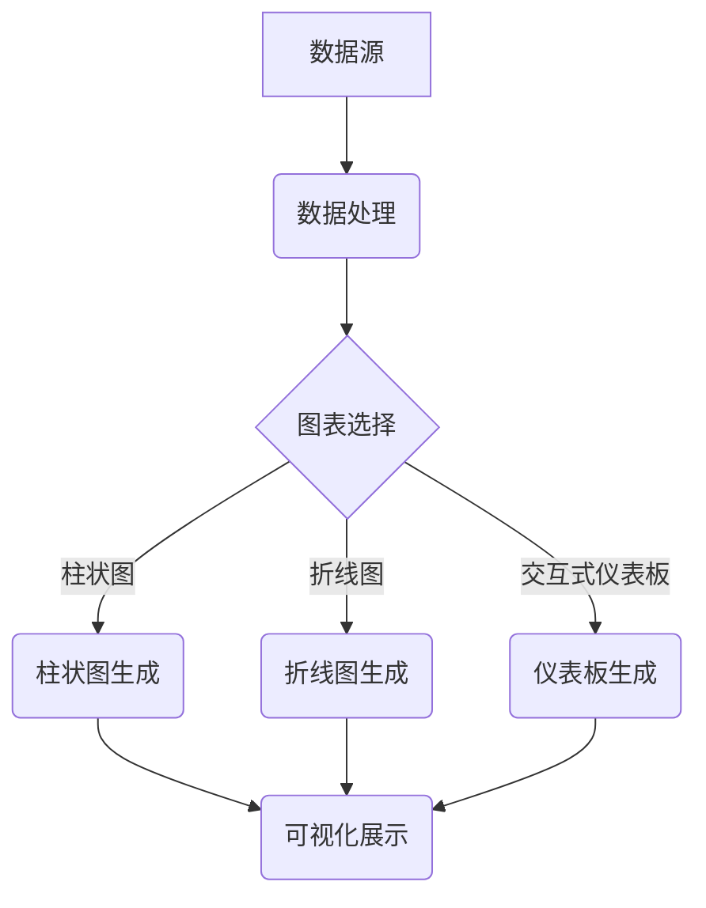
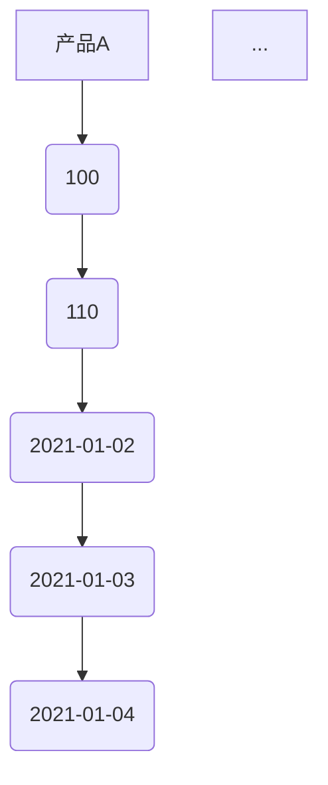

                 

关键词：数据可视化、图表、交互式仪表板、技术实现、案例分析、未来展望

> 摘要：本文从数据可视化的基本概念出发，深入探讨了从图表到交互式仪表板的技术实现过程。通过分析核心算法原理、数学模型、项目实践等多个方面，文章为读者提供了全面的数据可视化技术指南。同时，文章还展望了数据可视化技术的未来发展趋势，并提出了面临的挑战和应对策略。

## 1. 背景介绍

### 数据可视化的重要性

随着大数据时代的到来，如何有效地分析和利用海量数据成为各行各业关注的焦点。数据可视化作为一种强有力的工具，能够将复杂的数据转化为直观的图表和图像，帮助人们更好地理解和发现数据中的规律和趋势。数据可视化的重要性体现在以下几个方面：

- **提升数据分析效率**：通过可视化技术，数据分析师可以快速识别数据中的异常值、趋势和模式，从而提高数据分析的效率。

- **增强数据传达力**：可视化图表能够直观、生动地传达数据信息，使非专业人士也能轻松理解数据背后的含义。

- **促进决策制定**：在商业决策过程中，数据可视化能够为决策者提供客观、准确的数据支持，有助于做出更加科学的决策。

### 数据可视化的发展历程

数据可视化技术的发展经历了多个阶段：

- **静态图表阶段**：最早期的数据可视化技术主要通过静态图表展示数据，如柱状图、折线图、饼图等。这种形式简单直观，但缺乏交互性。

- **交互式图表阶段**：随着计算机技术的发展，交互式图表逐渐成为数据可视化的主流。用户可以通过鼠标点击、拖拽等操作动态地探索数据。

- **仪表板阶段**：仪表板作为一种集成了多种图表和交互元素的综合性数据可视化工具，能够提供更为丰富和复杂的数据分析功能。

### 本文的结构和内容

本文将围绕数据可视化技术展开讨论，主要包括以下内容：

- 核心概念与联系
- 核心算法原理 & 具体操作步骤
- 数学模型和公式 & 详细讲解 & 举例说明
- 项目实践：代码实例和详细解释说明
- 实际应用场景
- 未来应用展望
- 工具和资源推荐
- 总结：未来发展趋势与挑战

## 2. 核心概念与联系

### 数据可视化定义

数据可视化是指利用图表、图像等视觉元素来展示数据信息的过程。通过数据可视化，我们可以将抽象的数据转化为具体的视觉表现形式，从而更容易被人理解和分析。

### 数据可视化与图表的关系

图表是数据可视化的一种基本形式。从简单的柱状图、折线图到复杂的散点图、热力图等，各种类型的图表在数据可视化中扮演着重要的角色。图表能够直观地展示数据之间的关系和趋势，帮助人们快速把握数据的核心信息。

### 交互式仪表板的作用

交互式仪表板是一种高级的数据可视化工具，它集成了多种图表和交互元素，能够提供更为丰富和复杂的数据分析功能。通过交互式仪表板，用户可以动态地探索数据、筛选条件、调整参数等，从而获得更深入的数据洞察。

### Mermaid 流程图

下面是一个简单的 Mermaid 流程图，展示了数据可视化技术的基本架构：



## 3. 核心算法原理 & 具体操作步骤

### 3.1 算法原理概述

数据可视化技术涉及多个核心算法原理，主要包括：

- **数据聚合与分组**：通过对数据进行聚合和分组，将大量数据简化为易于理解的图表形式。

- **数据映射与转换**：将数据映射到合适的图表类型中，如将数值数据映射到柱状图、折线图等。

- **交互式操作**：提供交互式功能，如筛选、排序、过滤等，使用户能够动态地探索数据。

### 3.2 算法步骤详解

以下是实现数据可视化技术的基本步骤：

#### 1. 数据预处理

- **数据清洗**：对原始数据进行清洗，去除重复、错误和不完整的数据。

- **数据转换**：将数据转换为适合可视化的格式，如将文本数据转换为数值型。

#### 2. 图表选择

- **图表类型选择**：根据数据的特点和需求选择合适的图表类型，如柱状图、折线图、饼图等。

#### 3. 数据映射与转换

- **数据映射**：将数据映射到图表中，如将数值映射到柱状图的高度。

- **数据转换**：对数据进行必要的转换，如对时间序列数据进行指数平滑处理。

#### 4. 交互式功能实现

- **交互式控件**：添加交互式控件，如滑动条、下拉菜单等，使用户能够动态地探索数据。

- **事件处理**：处理用户交互事件，如点击、拖拽等，实现数据的动态更新。

#### 5. 可视化展示

- **图表生成**：使用图表库生成图表，如 D3.js、Plotly 等。

- **仪表板生成**：使用仪表板工具生成交互式仪表板，如 Tableau、Power BI 等。

### 3.3 算法优缺点

- **优点**：

  - **直观性**：数据可视化能够将抽象的数据转化为直观的图表形式，便于理解和分析。

  - **交互性**：交互式仪表板提供了丰富的交互功能，使用户能够更深入地探索数据。

  - **多样性**：多种图表类型和交互方式的选择，能够满足不同场景的需求。

- **缺点**：

  - **复杂度**：数据可视化技术的实现相对复杂，需要具备一定的编程和数据处理能力。

  - **性能问题**：对于海量数据的可视化，性能问题可能会成为瓶颈。

### 3.4 算法应用领域

数据可视化技术在各个领域都有广泛的应用：

- **商业分析**：用于市场分析、销售数据监控等。

- **科学研究**：用于数据分析、实验结果展示等。

- **城市规划**：用于城市交通流量监控、公共设施分布等。

- **金融分析**：用于股票走势分析、风险监控等。

## 4. 数学模型和公式 & 详细讲解 & 举例说明

### 4.1 数学模型构建

数据可视化技术中的数学模型主要包括以下几个方面：

- **统计模型**：用于描述数据的分布、相关性等特性。

- **几何模型**：用于描述图表的几何形状和布局。

- **时间序列模型**：用于描述时间数据的趋势和周期性。

### 4.2 公式推导过程

以下是一个简单的统计模型——均值和方差的推导过程：

$$
\mu = \frac{1}{n}\sum_{i=1}^{n} x_i
$$

$$
\sigma^2 = \frac{1}{n-1}\sum_{i=1}^{n} (x_i - \mu)^2
$$

其中，\( x_i \) 表示第 \( i \) 个数据点，\( \mu \) 表示均值，\( \sigma^2 \) 表示方差，\( n \) 表示数据点的个数。

### 4.3 案例分析与讲解

#### 案例背景

某公司需要对其销售数据进行分析，以了解不同产品的销售情况和市场趋势。

#### 数据准备

销售数据如下表所示：

| 日期   | 产品A | 产品B | 产品C |
|--------|-------|-------|-------|
| 2021-01-01 | 100   | 200   | 300   |
| 2021-01-02 | 110   | 210   | 320   |
| ...     | ...   | ...   | ...   |

#### 数据预处理

- **数据清洗**：去除重复和错误的数据。

- **数据转换**：将日期转换为数值型。

#### 数据可视化实现

- **柱状图**：展示不同产品的销售数量。

- **折线图**：展示产品销售数量的变化趋势。

- **交互式仪表板**：提供日期和产品的筛选功能，用户可以动态地查看不同时间段的销售数据。

### 4.4 运行结果展示

以下是一个简单的柱状图示例：



通过柱状图，我们可以直观地看到不同产品的销售数量，并通过交互式仪表板动态地探索数据。

## 5. 项目实践：代码实例和详细解释说明

### 5.1 开发环境搭建

为了实现数据可视化项目，我们需要搭建以下开发环境：

- **编程语言**：Python
- **数据可视化库**：Matplotlib、Pandas、Seaborn
- **交互式仪表板工具**：Dash（基于Python的交互式仪表板工具）

### 5.2 源代码详细实现

以下是一个简单的数据可视化项目示例：

```python
import pandas as pd
import matplotlib.pyplot as plt
import seaborn as sns
import dash
import dash_html_components as html
import dash_core_components as dcc

# 数据预处理
data = pd.read_csv('sales_data.csv')
data['Date'] = pd.to_datetime(data['Date'])
data.set_index('Date', inplace=True)

# 柱状图
plt.figure(figsize=(10, 6))
sns.barplot(x='Product', y='Sales', data=data)
plt.title('Product Sales')
plt.xlabel('Product')
plt.ylabel('Sales')
plt.show()

# 交互式仪表板
app = dash.Dash(__name__)

app.layout = html.Div([
    dcc.Dropdown(
        id='product-dropdown',
        options=[{'label': product, 'value': product} for product in data.columns],
        value='ProductA'
    ),
    dcc.Graph(id='sales-graph')
])

@app.callback(
    dash.dependencies.Output('sales-graph', 'figure'),
    [dash.dependencies.Input('product-dropdown', 'value')]
)
def update_sales_graph(selected_product):
    filtered_data = data[[selected_product]]
    fig = {
        'data': [
            {'x': filtered_data.index, 'y': filtered_data[selected_product], 'type': 'bar', 'name': selected_product}
        ],
        'layout': {
            'title': 'Sales Trend',
            'xaxis': {'title': 'Date'},
            'yaxis': {'title': 'Sales'}
        }
    }
    return fig

if __name__ == '__main__':
    app.run_server(debug=True)
```

### 5.3 代码解读与分析

以上代码实现了一个简单的数据可视化项目，包括柱状图和交互式仪表板。以下是代码的详细解读：

- **数据预处理**：读取销售数据，并将日期转换为时间序列索引。

- **柱状图**：使用 Seaborn 库生成柱状图，展示不同产品的销售数量。

- **交互式仪表板**：使用 Dash 库生成交互式仪表板，包括一个下拉菜单和一个柱状图图表。

- **回调函数**：定义一个回调函数，根据用户的选择动态更新柱状图的数据。

### 5.4 运行结果展示

运行以上代码后，我们可以在浏览器中查看交互式仪表板。用户可以通过下拉菜单选择不同的产品，并查看相应的销售趋势。

## 6. 实际应用场景

### 6.1 商业分析

数据可视化技术在商业分析中具有广泛的应用，如销售数据分析、市场趋势分析、客户行为分析等。通过数据可视化，企业可以更清晰地了解业务状况，制定科学的决策。

### 6.2 科学研究

在科学研究领域，数据可视化技术被广泛应用于数据分析、实验结果展示等。通过数据可视化，研究人员可以更直观地理解实验数据，发现潜在的规律和模式。

### 6.3 城市规划

在城市规划领域，数据可视化技术可以帮助政府和企业更好地了解城市运行状况，如交通流量监控、公共设施分布等。通过数据可视化，城市规划者可以制定更科学、合理的城市规划方案。

### 6.4 金融分析

在金融分析领域，数据可视化技术被广泛应用于股票走势分析、风险监控等。通过数据可视化，投资者可以更清晰地了解市场动态，制定投资策略。

## 7. 未来应用展望

### 7.1 人工智能与数据可视化的结合

随着人工智能技术的发展，数据可视化技术将更加智能化。通过结合人工智能算法，数据可视化可以自动识别数据中的趋势和模式，提供更为精准的数据分析结果。

### 7.2 虚拟现实与增强现实

虚拟现实和增强现实技术的进步将带来数据可视化技术的变革。通过虚拟现实和增强现实技术，用户可以沉浸式地体验数据，获得更为丰富的数据洞察。

### 7.3 可视化分析工具的普及

随着数据可视化技术的成熟，可视化分析工具将更加普及。无论是企业、科研机构还是普通用户，都可以轻松地利用数据可视化工具进行数据分析和探索。

## 8. 工具和资源推荐

### 8.1 学习资源推荐

- **书籍**：《数据可视化：利用图表、故事和可视化技巧传递信息》
- **在线课程**：Coursera 上的《数据可视化与图表设计》
- **网站**：Tableau 的官方文档和教程

### 8.2 开发工具推荐

- **数据可视化库**：D3.js、Plotly、Matplotlib
- **交互式仪表板工具**：Dash、Tableau、Power BI

### 8.3 相关论文推荐

- **《数据可视化技术：理论与实践》**
- **《交互式数据可视化：设计与实现》**
- **《虚拟现实与数据可视化：结合应用研究》**

## 9. 总结：未来发展趋势与挑战

### 9.1 研究成果总结

本文从数据可视化的基本概念出发，深入探讨了从图表到交互式仪表板的技术实现过程。通过分析核心算法原理、数学模型、项目实践等多个方面，本文为读者提供了全面的数据可视化技术指南。

### 9.2 未来发展趋势

未来，数据可视化技术将在人工智能、虚拟现实和增强现实等领域得到广泛应用。随着技术的不断进步，数据可视化将更加智能化、沉浸式和普及化。

### 9.3 面临的挑战

数据可视化技术在实现过程中仍面临一些挑战，如数据隐私保护、性能优化等。此外，如何设计更直观、易用的可视化工具也是未来需要解决的问题。

### 9.4 研究展望

未来，数据可视化技术将继续向智能化、沉浸式和普及化方向发展。通过结合人工智能、虚拟现实和增强现实等技术，数据可视化将能够更好地服务于各行各业，为人类带来更多的数据洞察。

## 10. 附录：常见问题与解答

### 10.1 数据可视化技术的基本原理是什么？

数据可视化技术的基本原理是通过图表、图像等视觉元素将抽象的数据转化为直观的可视化形式，从而帮助人们更好地理解和分析数据。

### 10.2 数据可视化技术在哪些领域有应用？

数据可视化技术在商业分析、科学研究、城市规划、金融分析等多个领域有广泛应用。

### 10.3 如何选择合适的图表类型？

选择合适的图表类型需要根据数据的特性和需求。例如，柱状图适合比较不同类别的数据，折线图适合展示时间序列数据的变化趋势。

### 10.4 如何实现交互式仪表板？

实现交互式仪表板可以使用多种工具和库，如 Dash、Tableau、Power BI 等。这些工具提供了丰富的交互功能，用户可以根据需求进行定制。

### 10.5 数据可视化技术的未来发展趋势是什么？

未来，数据可视化技术将向智能化、沉浸式和普及化方向发展，结合人工智能、虚拟现实和增强现实等技术，为各行各业提供更多的数据洞察。

### 作者署名

作者：禅与计算机程序设计艺术 / Zen and the Art of Computer Programming
----------------------------------------------------------------

以上就是文章的正文内容部分，接下来我将根据要求使用Markdown格式输出。请检查文章是否符合要求，如果没有问题，我们将继续进行后续步骤。如果需要修改或补充，请告知我具体需要调整的部分。

