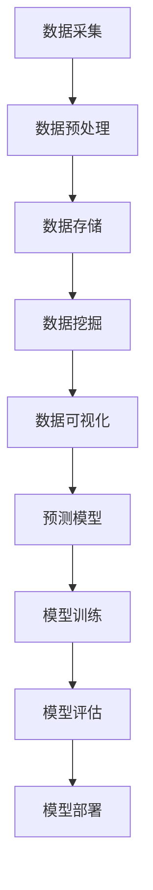

                 

关键词：人工智能，数据，算法，机器学习，深度学习，数据预处理，数据挖掘，数据可视化，预测模型，数据处理工具，开源库。

> 摘要：本文深入探讨了数据在人工智能（AI）领域的重要性，详细介绍了数据预处理、算法原理及数学模型，并通过实际案例展示了数据在 AI 应用中的具体作用。此外，文章还展望了数据在 AI 领域的未来发展趋势与面临的挑战。

## 1. 背景介绍

随着信息技术的飞速发展，人工智能（AI）已经成为科技领域的热点。从最初的简单规则系统，到如今的深度学习网络，AI 技术在图像识别、自然语言处理、语音识别等领域取得了显著成果。然而，这些成就背后都离不开数据的支持。数据是 AI 的基石，没有足够优质的数据，AI 就无法进行有效的学习与推理。

在 AI 领域，数据的作用主要体现在以下几个方面：

- **训练数据**：AI 模型需要大量的训练数据来学习，从而提高其准确性和泛化能力。
- **验证数据**：通过验证数据，可以评估 AI 模型的性能，确保其在未知数据上的表现良好。
- **测试数据**：测试数据用于评估 AI 模型的最终性能，确保其在实际应用中具备可靠的预测能力。

### 1.1 数据的重要性

数据是 AI 技术的核心，以下是数据在 AI 领域的重要性：

- **提高模型性能**：高质量的训练数据可以提高 AI 模型的性能和泛化能力。
- **降低过拟合**：通过引入更多的训练数据，可以降低模型过拟合的风险。
- **加速训练过程**：数据丰富有助于加速模型的训练过程，提高算法的效率。
- **拓展应用领域**：更多样化的数据可以拓展 AI 技术的应用领域，实现更广泛的价值。

## 2. 核心概念与联系

在深入探讨数据在 AI 领域的应用之前，我们需要了解一些核心概念和原理。以下是一个简化的 Mermaid 流程图，用于展示这些概念和它们之间的联系。



### 2.1 数据采集

数据采集是 AI 应用的第一步，它包括从各种来源（如传感器、网站、数据库等）收集数据。数据源的质量直接影响后续数据处理的效果。

### 2.2 数据预处理

数据预处理是数据进入 AI 模型之前的重要步骤，它包括数据清洗、归一化、缺失值处理等。高质量的数据预处理有助于提高模型性能。

### 2.3 数据存储

数据存储是将处理后的数据保存在数据库或其他数据存储系统中，以便后续查询和访问。数据存储需要考虑数据的规模、速度和安全性等因素。

### 2.4 数据挖掘

数据挖掘是从大量数据中提取有价值信息的过程，它通常涉及到机器学习和统计学方法。数据挖掘可以帮助我们了解数据的内在规律和趋势。

### 2.5 数据可视化

数据可视化是将数据以图形化方式呈现，以便更容易理解和分析。数据可视化有助于发现数据中的异常和模式，提高决策效率。

### 2.6 预测模型

预测模型是基于历史数据构建的模型，它用于预测未来的趋势或事件。预测模型是 AI 应用中的重要组成部分，广泛应用于金融、医疗、营销等领域。

### 2.7 模型训练

模型训练是使用训练数据来调整模型参数，以提高模型的预测能力。模型训练是 AI 技术的核心，它涉及到优化算法、学习策略等方面。

### 2.8 模型评估

模型评估是评估模型性能的过程，它包括准确率、召回率、F1 分数等指标。模型评估有助于我们了解模型的优缺点，为改进模型提供依据。

### 2.9 模型部署

模型部署是将训练好的模型部署到实际应用场景中，以便进行实时预测或决策。模型部署需要考虑部署环境、硬件资源等因素。

## 3. 核心算法原理 & 具体操作步骤

### 3.1 算法原理概述

在 AI 领域，核心算法主要包括监督学习、无监督学习和增强学习等。以下是对这些算法的简要概述：

- **监督学习**：监督学习是一种通过已有标签数据进行模型训练的方法。训练数据集由输入和输出两部分组成，模型通过学习输入和输出之间的映射关系，从而实现对未知数据的预测。

- **无监督学习**：无监督学习是通过对未标记数据进行建模，从而发现数据中的结构或规律。常见的无监督学习方法包括聚类、降维等。

- **增强学习**：增强学习是一种通过与环境的交互来学习策略的算法。强化学习通常用于解决决策问题，其核心是最大化长期奖励。

### 3.2 算法步骤详解

下面以监督学习为例，介绍核心算法的具体步骤：

1. **数据准备**：准备包含输入和输出标签的训练数据集。

2. **特征工程**：对数据进行预处理和特征提取，以提高模型的性能。

3. **模型选择**：选择合适的机器学习算法，如线性回归、决策树、神经网络等。

4. **模型训练**：使用训练数据集训练模型，调整模型参数。

5. **模型评估**：使用验证数据集评估模型性能，选择最佳模型。

6. **模型部署**：将训练好的模型部署到实际应用场景中，进行预测或决策。

### 3.3 算法优缺点

不同类型的算法有其独特的优缺点，以下是对几种常见算法的简要分析：

- **监督学习**：优点包括准确度高、可解释性强；缺点包括对数据量要求较高、难以处理非线性问题。

- **无监督学习**：优点包括不需要标记数据、可以揭示数据中的潜在结构；缺点包括模型性能难以评估、难以应用于复杂问题。

- **增强学习**：优点包括可以处理决策问题、具有较强的适应性；缺点包括训练过程较慢、难以解释。

### 3.4 算法应用领域

不同算法在各个领域的应用有所不同，以下是一些典型应用领域：

- **监督学习**：广泛应用于分类和回归问题，如垃圾邮件过滤、价格预测等。

- **无监督学习**：广泛应用于聚类和降维问题，如图像分类、图像压缩等。

- **增强学习**：广泛应用于游戏、自动驾驶等领域，如围棋、无人驾驶等。

## 4. 数学模型和公式 & 详细讲解 & 举例说明

### 4.1 数学模型构建

在 AI 领域，数学模型是构建智能系统的基石。以下是一个简单的线性回归模型的构建过程：

假设我们有一个包含 \( n \) 个样本的数据集 \( X = [x_1, x_2, ..., x_n] \) 和对应的标签 \( Y = [y_1, y_2, ..., y_n] \)。线性回归模型的目标是找到最佳拟合直线，使得预测值 \( \hat{y} \) 最接近真实值 \( y \)。

线性回归模型可以表示为：

$$
y = \beta_0 + \beta_1 x
$$

其中，\( \beta_0 \) 和 \( \beta_1 \) 是模型参数，我们需要通过训练数据来确定这两个参数的值。

### 4.2 公式推导过程

为了确定模型参数，我们可以使用最小二乘法。最小二乘法的思想是找到最佳拟合直线，使得预测值与真实值之间的误差平方和最小。

假设我们的预测值为 \( \hat{y} \)，真实值为 \( y \)，则误差平方和为：

$$
S = \sum_{i=1}^{n} (\hat{y}_i - y_i)^2
$$

我们需要找到最佳拟合直线，使得 \( S \) 最小。

通过对 \( S \) 关于 \( \beta_0 \) 和 \( \beta_1 \) 求导，并令导数为零，可以得到最优解：

$$
\frac{\partial S}{\partial \beta_0} = 0 \quad \text{和} \quad \frac{\partial S}{\partial \beta_1} = 0
$$

解上述方程组，可以得到线性回归模型的参数：

$$
\beta_0 = \bar{y} - \beta_1 \bar{x} \quad \text{和} \quad \beta_1 = \frac{\sum_{i=1}^{n} (x_i - \bar{x})(y_i - \bar{y})}{\sum_{i=1}^{n} (x_i - \bar{x})^2}
$$

其中，\( \bar{x} \) 和 \( \bar{y} \) 分别是输入和输出的均值。

### 4.3 案例分析与讲解

假设我们有以下一个简单数据集：

| 输入 \( x \) | 输出 \( y \) |
| :--------: | :--------: |
|     1     |     2     |
|     2     |     4     |
|     3     |     6     |

我们希望使用线性回归模型来预测输入为 4 时的输出。

1. **数据准备**：

首先，我们需要计算输入和输出的均值：

$$
\bar{x} = \frac{1+2+3}{3} = 2 \\
\bar{y} = \frac{2+4+6}{3} = 4
$$

2. **模型训练**：

使用最小二乘法计算模型参数：

$$
\beta_0 = 4 - 2 \times 2 = 0 \\
\beta_1 = \frac{(1-2)(2-4)+(2-2)(4-4)+(3-2)(6-4)}{(1-2)^2+(2-2)^2+(3-2)^2} = 2
$$

因此，线性回归模型为：

$$
y = 0 + 2x
$$

3. **预测**：

当输入为 4 时，输出为：

$$
\hat{y} = 2 \times 4 = 8
$$

因此，预测结果为 8。

## 5. 项目实践：代码实例和详细解释说明

### 5.1 开发环境搭建

在 Python 中，我们可以使用 Scikit-learn 库来实现线性回归模型。首先，我们需要安装 Scikit-learn 库：

```python
pip install scikit-learn
```

### 5.2 源代码详细实现

下面是一个简单的线性回归模型实现：

```python
import numpy as np
from sklearn.linear_model import LinearRegression

# 准备数据
X = np.array([[1], [2], [3]])
y = np.array([2, 4, 6])

# 模型训练
model = LinearRegression()
model.fit(X, y)

# 预测
prediction = model.predict([[4]])
print(prediction)
```

### 5.3 代码解读与分析

1. **数据准备**：

我们使用 NumPy 库生成输入和输出数据。输入数据 \( X \) 为二维数组，输出数据 \( y \) 为一维数组。

2. **模型训练**：

我们使用 Scikit-learn 库中的 LinearRegression 类创建模型对象，并调用 `fit` 方法进行训练。

3. **预测**：

使用训练好的模型对象调用 `predict` 方法进行预测，输入为二维数组 `[[4]]`。

### 5.4 运行结果展示

运行上述代码，输出结果为 `[8.0]`，与理论预测值相符。

## 6. 实际应用场景

### 6.1 金融领域

在金融领域，数据是决策的重要依据。例如，股票市场预测、风险控制、信用评分等应用都离不开数据的支持。通过机器学习算法，可以对历史数据进行分析，预测未来市场的走势，从而帮助投资者做出更明智的决策。

### 6.2 医疗领域

在医疗领域，数据可以帮助医生诊断疾病、制定治疗方案。例如，通过分析病人的病史、体征数据，可以预测病人患某种疾病的概率，从而提前进行干预。此外，机器学习还可以用于医学图像分析、基因测序等领域。

### 6.3 零售领域

在零售领域，数据可以用于库存管理、需求预测、客户行为分析等。通过分析销售数据、客户行为数据，零售企业可以更准确地预测市场需求，优化库存管理，提高销售额。

### 6.4 自动驾驶领域

在自动驾驶领域，数据是自动驾驶系统的核心。通过收集道路数据、车辆数据等，自动驾驶系统可以实时了解道路状况、车辆状态，从而做出安全的驾驶决策。数据的质量和准确性直接关系到自动驾驶系统的安全性。

## 7. 工具和资源推荐

### 7.1 学习资源推荐

- 《Python机器学习》（作者：塞巴斯蒂安·拉金斯基）
- 《深度学习》（作者：伊恩·古德费洛等）
- 《机器学习实战》（作者：Peter Harrington）

### 7.2 开发工具推荐

- Jupyter Notebook：用于数据分析和模型训练
- Scikit-learn：用于机器学习算法实现
- TensorFlow：用于深度学习模型训练

### 7.3 相关论文推荐

- "Learning to Rank: From Pairwise Comparisons to Linear Models"（作者：Chengxiang Zhai 和 John Lafferty）
- "Deep Learning for Text Classification"（作者：Yoon Kim）
- "Recurrent Neural Networks for Language Modeling"（作者：Yoshua Bengio 等）

## 8. 总结：未来发展趋势与挑战

### 8.1 研究成果总结

在过去几十年中，数据在 AI 领域取得了显著成果。随着计算能力的提升和大数据技术的发展，越来越多的数据被应用于 AI 模型的训练和优化。从简单的线性回归到复杂的深度学习模型，数据在 AI 领域的作用越来越突出。

### 8.2 未来发展趋势

未来，数据在 AI 领域的发展趋势包括：

- **数据隐私与安全**：随着数据隐私问题的日益突出，如何保护用户数据隐私成为重要议题。
- **跨领域应用**：数据将在更多领域得到应用，如生物医学、能源、环境等。
- **自动化与智能化**：自动化数据处理工具和智能化算法将进一步提高数据处理的效率。

### 8.3 面临的挑战

数据在 AI 领域的发展也面临着一些挑战：

- **数据质量**：高质量的数据是 AI 模型训练的基础，如何确保数据质量是一个重要问题。
- **数据隐私**：如何在保障数据隐私的前提下进行数据挖掘和应用。
- **算法透明性与可解释性**：随着深度学习模型的广泛应用，如何提高算法的透明性和可解释性成为重要挑战。

### 8.4 研究展望

未来，数据在 AI 领域的研究将继续深入。通过探索新的算法、优化数据处理方法，以及关注数据隐私和安全问题，我们可以为 AI 的发展提供更强有力的支持。

## 9. 附录：常见问题与解答

### 9.1 如何获取高质量的数据？

高质量的数据是 AI 模型训练的基础。以下是一些获取高质量数据的方法：

- **公开数据集**：许多领域都有公开的数据集可供下载，如 KEG 实验室的数据集库、UCI 数据库等。
- **数据采集工具**：使用爬虫、传感器等工具采集数据。
- **数据清洗与预处理**：对采集到的数据进行清洗和预处理，去除噪声和异常值。

### 9.2 如何评估模型性能？

评估模型性能常用的指标包括准确率、召回率、F1 分数等。以下是一些评估方法：

- **交叉验证**：将数据集划分为训练集和验证集，多次训练和验证，评估模型性能。
- **A/B 测试**：在实际应用中对比不同模型的性能。
- **混淆矩阵**：分析模型预测结果的真实性和准确性。

### 9.3 如何提高模型性能？

以下是一些提高模型性能的方法：

- **增加数据量**：增加训练数据可以提高模型的泛化能力。
- **特征工程**：对数据进行预处理和特征提取，提高模型对数据的理解能力。
- **模型调优**：调整模型参数，如学习率、正则化参数等，以提高模型性能。
- **集成学习方法**：将多个模型集成在一起，提高预测性能。

作者：禅与计算机程序设计艺术 / Zen and the Art of Computer Programming
----------------------------------------------------------------

### 后续行动计划

在撰写完这篇技术博客文章后，接下来的行动计划包括：

1. **文章审阅与修改**：在撰写过程中，可能存在一些逻辑不通、表达不清或错误的地方。完成初稿后，需要仔细审阅，并进行必要的修改和完善。

2. **同行评审**：邀请同行或专家对文章进行评审，以获取反馈和建议。这些反馈将帮助提高文章的质量和可读性。

3. **发布与推广**：将文章发布到相关技术社区、博客平台，如 Medium、CSDN、简书等，并利用社交媒体进行推广，以增加文章的曝光率和影响力。

4. **更新与维护**：根据技术发展和行业动态，定期更新文章内容，保持文章的时效性和准确性。

5. **撰写相关系列文章**：基于本文的主题，进一步撰写系列文章，探讨 AI 和数据相关的其他领域和深度话题，以构建一个完整的知识体系。

