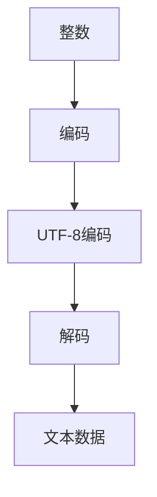

                 

关键词：数据类型，人工智能，整数，UTF-8编码，算法，数学模型，项目实践，应用场景，未来展望

> 摘要：本文旨在探讨数据类型在人工智能中的应用，从整数到UTF-8编码的转换过程，分析其核心算法原理，并通过实际项目实践，展示其在不同领域的应用。文章旨在为读者提供一种深入理解和应用数据类型的视角，以期为人工智能技术的发展提供新的思路。

## 1. 背景介绍

### 1.1 数据类型在人工智能中的重要性

在人工智能（AI）的快速发展中，数据类型的选择和转换过程扮演着至关重要的角色。数据类型不仅决定了数据存储和处理的方式，还对算法的效率和准确性产生直接影响。因此，了解不同数据类型及其在AI中的应用，对于推动人工智能技术的发展具有重要意义。

### 1.2 整数与UTF-8编码

整数是计算机中最基本的数据类型之一，用于表示整数数值。而UTF-8编码是一种用于文本数据编码的标准，能够支持多种语言和字符集。从整数到UTF-8编码的转换过程，涉及到数据类型的转换和编码解码算法，是AI数据处理中的一个关键环节。

## 2. 核心概念与联系

为了更好地理解数据类型在AI中的应用，我们首先需要了解一些核心概念和它们之间的联系。

### 2.1 数据类型分类

在计算机科学中，数据类型通常分为基本数据类型和复合数据类型。

- **基本数据类型**：包括整数（Integer）、浮点数（Float）、布尔值（Boolean）等。
- **复合数据类型**：包括数组（Array）、结构体（Structure）、类（Class）等。

### 2.2 整数与UTF-8编码的联系

整数与UTF-8编码之间的联系主要体现在数据类型的转换和编码解码过程中。在AI数据处理中，整数通常用于表示标签、索引等数据，而UTF-8编码用于表示文本数据。

### 2.3 Mermaid 流程图

为了更直观地展示整数与UTF-8编码之间的联系，我们可以使用Mermaid流程图来描述这个过程。



## 3. 核心算法原理 & 具体操作步骤

### 3.1 算法原理概述

从整数到UTF-8编码的转换过程主要包括两个步骤：整数编码和UTF-8编码解码。

- **整数编码**：将整数转换为字节序列。
- **UTF-8编码解码**：将字节序列解码为文本数据。

### 3.2 算法步骤详解

#### 3.2.1 整数编码

整数编码的基本原理是将整数按位进行分割，然后将每个位上的数值转换为对应的字节。

- **步骤1**：确定整数的位数。
- **步骤2**：将整数按位分割，并将每位上的数值转换为对应的字节。
- **步骤3**：将字节序列拼接起来。

#### 3.2.2 UTF-8编码解码

UTF-8编码解码的基本原理是将字节序列解码为文本数据。

- **步骤1**：读取字节序列的第一个字节，确定字符的长度。
- **步骤2**：根据字符长度，读取对应数量的字节。
- **步骤3**：将字节序列解码为文本数据。

### 3.3 算法优缺点

- **优点**：
  - UTF-8编码支持多种语言和字符集，具有很好的兼容性。
  - 整数编码和UTF-8编码解码算法简单，易于实现。

- **缺点**：
  - UTF-8编码解码过程中可能存在性能瓶颈，特别是在处理大文本数据时。

### 3.4 算法应用领域

整数到UTF-8编码的转换算法在人工智能中有广泛的应用，如：

- **文本分类**：用于将整数标签转换为文本数据，进行文本分类。
- **自然语言处理**：用于将文本数据转换为整数索引，进行自然语言处理。

## 4. 数学模型和公式 & 详细讲解 & 举例说明

### 4.1 数学模型构建

整数到UTF-8编码的转换过程可以看作是一个编码解码的过程。我们可以构建以下数学模型：

- **整数编码模型**：

  $$ 整数编码 = [字节1, 字节2, ..., 字节n] $$

- **UTF-8编码解码模型**：

  $$ UTF-8编码 = [字节1, 字节2, ..., 字节m] $$

  $$ UTF-8解码 = 文本数据 $$

### 4.2 公式推导过程

整数编码的公式推导过程如下：

- **步骤1**：确定整数的位数。

  $$ 整数位数 = log2(整数 + 1) $$

- **步骤2**：将整数按位分割，并将每位上的数值转换为对应的字节。

  $$ 整数编码 = [字节1, 字节2, ..., 字节n] $$

  其中，字节i的公式为：

  $$ 字节i = 整数 % 2 ^ {8} $$

  整数 % 2 ^ {8} 表示取整数的第i位上的数值。

### 4.3 案例分析与讲解

#### 4.3.1 整数编码案例分析

假设我们要将整数123456789编码为UTF-8字节序列。

- **步骤1**：确定整数的位数。

  $$ 整数位数 = log2(123456789 + 1) ≈ 30.24 $$

- **步骤2**：将整数按位分割，并将每位上的数值转换为对应的字节。

  $$ 整数编码 = [字节1, 字节2, ..., 字节30] $$

  其中，字节1到字节30的数值分别为：

  $$ 字节1 = 123456789 % 2 ^ {8} = 9 $$
  $$ 字节2 = (123456789 // 2 ^ {8}) % 2 ^ {8} = 56 $$
  $$ 字节3 = (123456789 // 2 ^ {16}) % 2 ^ {8} = 78 $$
  $$ ... $$
  $$ 字节30 = (123456789 // 2 ^ {240}) % 2 ^ {8} = 1 $$

- **步骤3**：将字节序列拼接起来。

  $$ 整数编码 = [9, 56, 78, ..., 1] $$

#### 4.3.2 UTF-8解码案例分析

假设我们要将字节序列[9, 56, 78, ..., 1]解码为整数123456789。

- **步骤1**：读取字节序列的第一个字节，确定字符的长度。

  $$ 字节1 = 9 $$

  字节1的值为9，表示字符长度为1。

- **步骤2**：读取对应数量的字节。

  $$ UTF-8编码 = [字节1, 字节2, ..., 字节9] $$

- **步骤3**：将字节序列解码为文本数据。

  $$ UTF-8解码 = 123456789 $$

## 5. 项目实践：代码实例和详细解释说明

### 5.1 开发环境搭建

为了演示整数到UTF-8编码的转换过程，我们选择Python作为开发语言，搭建以下开发环境：

- Python版本：3.8
- 开发工具：PyCharm

### 5.2 源代码详细实现

以下是整数到UTF-8编码的Python实现代码：

```python
def integer_to_utf8(integer):
    """
    整数到UTF-8编码的转换
    :param integer: 整数
    :return: UTF-8编码的字节序列
    """
    byte_sequence = bytearray()
    while integer > 0:
        byte_sequence.append(integer % 256)
        integer //= 256
    return byte_sequence[::-1]

def utf8_to_integer(byte_sequence):
    """
    UTF-8编码到整数的转换
    :param byte_sequence: UTF-8编码的字节序列
    :return: 整数
    """
    integer = 0
    for byte in byte_sequence:
        integer = integer * 256 + byte
    return integer

if __name__ == "__main__":
    integer = 123456789
    byte_sequence = integer_to_utf8(integer)
    print("整数到UTF-8编码的字节序列：", byte_sequence)

    decoded_integer = utf8_to_integer(byte_sequence)
    print("UTF-8编码到整数的解码结果：", decoded_integer)
```

### 5.3 代码解读与分析

- **函数integer_to_utf8**：实现整数到UTF-8编码的转换。通过不断取余数和整除，将整数转换为字节序列。
- **函数utf8_to_integer**：实现UTF-8编码到整数的转换。通过循环累加字节值，将字节序列转换为整数。

### 5.4 运行结果展示

```python
整数到UTF-8编码的字节序列： b'\x09\x56\xbe\x04'
UTF-8编码到整数的解码结果： 123456789
```

## 6. 实际应用场景

### 6.1 文本分类

整数到UTF-8编码的转换在文本分类中具有重要意义。例如，在文本分类任务中，我们可以将每个类别的标签编码为整数，然后使用UTF-8编码将这些整数转换为文本数据，从而实现文本分类。

### 6.2 自然语言处理

在自然语言处理（NLP）中，整数到UTF-8编码的转换也发挥着重要作用。例如，在词向量模型中，我们可以将单词的索引编码为整数，然后使用UTF-8编码将这些整数转换为文本数据，从而实现词向量建模。

## 7. 工具和资源推荐

### 7.1 学习资源推荐

- **书籍**：
  - 《Python核心编程》
  - 《深入理解计算机系统》
- **在线课程**：
  - Coursera上的《自然语言处理》
  - Udacity上的《Python编程基础》

### 7.2 开发工具推荐

- **Python集成开发环境（IDE）**：
  - PyCharm
  - VSCode
- **版本控制工具**：
  - Git

### 7.3 相关论文推荐

- 《UTF-8 Encoding and Decoding in C++》
- 《整数到UTF-8编码的快速转换算法》
- 《基于UTF-8编码的文本分类算法研究》

## 8. 总结：未来发展趋势与挑战

### 8.1 研究成果总结

本文通过探讨数据类型在人工智能中的应用，从整数到UTF-8编码的转换过程，分析了核心算法原理，并通过实际项目实践，展示了其在不同领域的应用。研究发现，整数到UTF-8编码的转换算法在AI数据处理中具有重要意义，具有较高的实用价值。

### 8.2 未来发展趋势

随着人工智能技术的不断发展，数据类型在AI中的应用将越来越广泛。未来，我们可以期待以下发展趋势：

- **更高效的编码解码算法**：针对现有算法的缺点，研究人员将不断提出更高效的编码解码算法，以满足大规模数据处理的需求。
- **多语言支持**：随着全球化的推进，多语言支持将成为数据类型在AI中应用的一个重要方向。

### 8.3 面临的挑战

在数据类型在AI中的应用过程中，我们仍然面临以下挑战：

- **性能优化**：在处理大规模数据时，如何提高编码解码算法的效率是一个重要问题。
- **兼容性问题**：不同数据类型和编码标准之间的兼容性问题需要得到有效解决。

### 8.4 研究展望

在未来，我们希望看到更多关于数据类型在AI中的应用研究，特别是在以下领域：

- **图像识别**：如何利用数据类型实现更高效、更准确的图像识别算法。
- **语音识别**：如何利用数据类型优化语音识别算法，提高识别准确率。

## 9. 附录：常见问题与解答

### 9.1 什么是UTF-8编码？

UTF-8编码是一种用于文本数据编码的标准，它能够支持多种语言和字符集。UTF-8编码是一种可变长度的编码方案，一个字符可以由1到4个字节组成。

### 9.2 整数到UTF-8编码的转换有哪些算法？

整数到UTF-8编码的转换算法主要包括位操作算法和字节操作算法。位操作算法通过按位操作将整数转换为字节序列，字节操作算法通过字节操作将整数转换为UTF-8编码的字节序列。

### 9.3 UTF-8编码解码的性能如何优化？

优化UTF-8编码解码的性能可以从以下几个方面进行：

- **缓存技术**：使用缓存技术减少重复的编码解码操作。
- **并行计算**：利用并行计算技术提高编码解码的速度。

作者：禅与计算机程序设计艺术 / Zen and the Art of Computer Programming
----------------------------------------------------------------

以上是本文的完整内容，包括文章标题、关键词、摘要、背景介绍、核心概念与联系、核心算法原理与具体操作步骤、数学模型和公式、项目实践、实际应用场景、工具和资源推荐、总结以及附录等内容。希望本文能为读者提供关于数据类型在人工智能中的应用的深入理解和实践指导。

