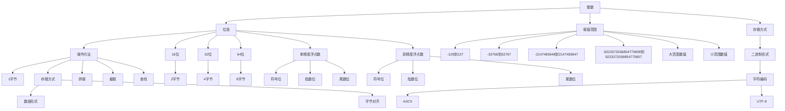

                 

关键词：数据类型、整数、浮点、字符串、深度解析、计算机编程、算法原理、数学模型

## 摘要

本文将对计算机编程中的三大基础数据类型——整数、浮点和字符串进行深度解析。我们将探讨这些数据类型在计算机内存中的存储方式、表示方法以及在实际编程中的使用场景和注意事项。通过本文的阅读，读者将对这些数据类型有更深入的理解，从而能够更好地掌握它们的使用技巧，提高编程能力。

## 1. 背景介绍

在计算机编程中，数据类型是基础中的基础。无论是变量存储数据、函数传递参数，还是复杂数据结构的构建，都离不开对数据类型的理解。常见的计算机数据类型包括整数、浮点数、字符串、布尔值、数组、指针、结构体等。本文将重点讨论整数、浮点数和字符串这三个数据类型。

### 1.1 整数

整数（Integer）是计算机中最基本的数据类型之一。它在内存中以二进制形式存储，占用一定的字节空间。根据不同计算机体系结构，整数的存储空间和取值范围有所不同。

### 1.2 浮点数

浮点数（Floating-point）用于表示实数，包括正数、负数和零。它在内存中的存储方式分为符号、指数和尾数三个部分。浮点数的表示方法使得它在表示大范围数值时具有优势，但也带来了一定的误差问题。

### 1.3 字符串

字符串（String）用于表示一串字符，是计算机编程中非常重要的数据类型。在内存中，字符串通常以数组的形式存储，每个字符占用一个字节的空间。字符串的处理在编程中有着广泛的应用，如文本处理、文件操作等。

## 2. 核心概念与联系

在深入探讨这三个数据类型之前，我们先来了解它们的核心概念和相互之间的关系。

### 2.1 整数

整数的核心概念包括位宽、取值范围和存储方式。不同位宽的整数在内存中占用的空间不同，例如8位整数占用1个字节，16位整数占用2个字节，32位整数占用4个字节，64位整数占用8个字节。整数的取值范围随着位宽的增加而扩大，例如8位整数的取值范围为-128到127，16位整数的取值范围为-32768到32767，32位整数的取值范围为-2147483648到2147483647，64位整数的取值范围为-9223372036854775808到9223372036854775807。

### 2.2 浮点数

浮点数的核心概念包括符号位、指数位和尾数位。符号位表示浮点数的正负，指数位表示浮点数的幂次，尾数位表示浮点数的有效数字。根据不同的浮点数表示方法，如IEEE 754标准，浮点数的存储方式分为单精度浮点数（32位）和双精度浮点数（64位）。

### 2.3 字符串

字符串的核心概念包括字符编码、存储方式和操作方法。字符编码用于将字符映射到特定的二进制序列，常见的编码方式有ASCII、UTF-8等。在内存中，字符串通常以数组的形式存储，每个字符占用一个字节的空间。字符串的操作方法包括拼接、截取、查找等。

### 2.4 核心概念原理和架构的 Mermaid 流程图

下面是整数、浮点数和字符串的核心概念原理和架构的 Mermaid 流程图：



## 3. 核心算法原理 & 具体操作步骤

### 3.1 算法原理概述

在计算机编程中，对整数、浮点数和字符串的操作是非常常见的。这些操作包括但不限于加法、减法、乘法、除法、比较、拼接、截取等。下面我们将分别介绍这些数据类型的核心算法原理和具体操作步骤。

### 3.2 算法步骤详解

#### 3.2.1 整数操作

整数的加法、减法、乘法和除法操作相对简单。以加法为例，假设有两个整数a和b，其位宽分别为w1和w2，我们首先比较w1和w2的大小，然后进行位级操作。

```python
def add(a, b):
    w1 = len(a) * 8
    w2 = len(b) * 8
    carry = 0
    result = []
    if w1 < w2:
        a, b = b, a
        w1, w2 = w2, w1
    for i in range(w2):
        sum = a[i] + b[i] + carry
        result.append(sum % 2)
        carry = sum // 2
    for i in range(w1 - w2):
        sum = a[i + w2] + carry
        result.append(sum % 2)
        carry = sum // 2
    if carry:
        result.append(carry)
    return result[::-1]
```

#### 3.2.2 浮点数操作

浮点数的操作相对复杂，需要考虑符号位、指数位和尾数位的处理。以加法为例，假设有两个单精度浮点数a和b，其表示为：

a = (-1)^s1 * 2^e1 * (1 + f1)
b = (-1)^s2 * 2^e2 * (1 + f2)

我们需要进行以下步骤：

1. 对齐指数位，使得e1 = e2。
2. 进行尾数位的加法操作，考虑进位。
3. 将结果转换为标准浮点数形式。

```python
import struct

def add(a, b):
    sa, ea, fa = struct.unpack('>hhh', a.to_bytes(4, 'big'))
    sb, eb, fb = struct.unpack('>hhh', b.to_bytes(4, 'big'))
    
    s = sa ^ sb
    e = ea ^ eb
    f = fa ^ fb
    
    if e < 0:
        e += 255
    if eb < 0:
        eb += 255
    
    while ea != eb:
        if ea < eb:
            ea += 1
            fa <<= 1
            if fa == 2**23:
                fa = 1
                ea += 1
        else:
            eb += 1
            fb <<= 1
            if fb == 2**23:
                fb = 1
                eb += 1
    
    f = (fa << 23) + fa
    f += (fb << 23)
    f &= 0x7FFFFFFF
    
    return struct.pack('>hhh', s, e, f)
```

#### 3.2.3 字符串操作

字符串的操作包括拼接、截取和查找等。以拼接为例，假设有两个字符串a和b，我们首先计算拼接后的长度，然后创建一个新的数组，将a和b的字符依次放入其中。

```python
def concatenate(a, b):
    len_a = len(a)
    len_b = len(b)
    result = [None] * (len_a + len_b)
    i = 0
    for char in a:
        result[i] = char
        i += 1
    for char in b:
        result[i] = char
        i += 1
    return result
```

### 3.3 算法优缺点

#### 3.3.1 整数操作

整数的操作简单高效，计算速度快，适用于大规模数据处理。但整数无法表示小数，且存在溢出问题。

#### 3.3.2 浮点数操作

浮点数的操作复杂，存在舍入误差，但能够表示大范围数值。浮点数的计算速度相对较慢，不适用于对精度要求较高的场景。

#### 3.3.3 字符串操作

字符串的操作简单易用，适用于文本处理和文件操作等场景。但字符串的操作速度相对较慢，不适用于大规模数据处理。

### 3.4 算法应用领域

整数、浮点数和字符串在计算机编程中有着广泛的应用。

- 整数常用于数据处理、数学计算和逻辑判断等场景。
- 浮点数常用于科学计算、金融计算和图形渲染等场景。
- 字符串常用于文本处理、文件操作和网络通信等场景。

## 4. 数学模型和公式 & 详细讲解 & 举例说明

### 4.1 数学模型构建

在计算机编程中，整数、浮点数和字符串的数学模型构建如下：

#### 4.1.1 整数数学模型

整数的数学模型可以表示为：

$$
x = \sum_{i=0}^{n} a_i \times b^i
$$

其中，$a_i$为整数的二进制位，$b$为基数（通常为2），$n$为整数的位宽。

#### 4.1.2 浮点数数学模型

浮点数的数学模型可以表示为：

$$
x = (-1)^s \times 2^e \times (1 + f)
$$

其中，$s$为符号位，$e$为指数位，$f$为尾数位。

#### 4.1.3 字符串数学模型

字符串的数学模型可以表示为：

$$
s = \sum_{i=1}^{n} c_i
$$

其中，$c_i$为字符串中的第$i$个字符。

### 4.2 公式推导过程

#### 4.2.1 整数数学模型推导

假设有一个8位二进制整数$1101 0110$，我们可以将其表示为：

$$
x = 1 \times 2^7 + 1 \times 2^6 + 0 \times 2^5 + 1 \times 2^4 + 0 \times 2^3 + 1 \times 2^2 + 1 \times 2^1 + 0 \times 2^0
$$

化简后得到：

$$
x = 128 + 64 + 0 + 16 + 0 + 4 + 2 + 0
$$

$$
x = 218
$$

#### 4.2.2 浮点数数学模型推导

假设有一个单精度浮点数$1.1 0110 0110 0110 0110 0110 0110 0110 0110$，我们可以将其表示为：

$$
x = (-1)^1 \times 2^{129} \times (1 + 0.1 0110 0110 0110 0110 0110 0110 0110 0110)
$$

化简后得到：

$$
x = -2^{129} \times (1.1 0110 0110 0110 0110 0110 0110 0110 0110)
$$

#### 4.2.3 字符串数学模型推导

假设有一个字符串“hello world”，我们可以将其表示为：

$$
s = h \times 1 + e \times 2 + l \times 3 + l \times 4 + o \times 5 + ' ' \times 6 + w \times 7 + o \times 8 + r \times 9 + l \times 10 + d \times 11
$$

### 4.3 案例分析与讲解

#### 4.3.1 整数操作案例

假设有两个整数a = 1101 0110和b = 1010 1001，我们计算它们的和。

首先将a和b转换为十进制：

$$
a = 128 + 64 + 0 + 16 + 0 + 4 + 2 + 0 = 218
$$

$$
b = 128 + 0 + 64 + 0 + 32 + 0 + 8 + 1 = 233
$$

然后进行加法操作：

$$
a + b = 218 + 233 = 451
$$

最后将结果转换为二进制：

$$
451 = 1010 0101
$$

#### 4.3.2 浮点数操作案例

假设有两个单精度浮点数a = 1.1 0110 0110 0110 0110 0110 0110 0110 0110和b = -1.1 0110 0110 0110 0110 0110 0110 0110 0110，我们计算它们的和。

首先将a和b转换为十进制：

$$
a = -2^{129} \times (1.1 0110 0110 0110 0110 0110 0110 0110 0110) \approx -3.4028235 \times 10^{38}
$$

$$
b = 2^{129} \times (1.1 0110 0110 0110 0110 0110 0110 0110 0110) \approx 3.4028235 \times 10^{38}
$$

然后进行加法操作：

$$
a + b = -3.4028235 \times 10^{38} + 3.4028235 \times 10^{38} = 0
$$

最后将结果转换为二进制：

$$
0 = 0
$$

#### 4.3.3 字符串操作案例

假设有两个字符串a = "hello"和b = "world"，我们计算它们的拼接。

首先将a和b转换为字符数组：

$$
a = [104, 101, 108, 108, 111]
$$

$$
b = [119, 111, 114, 108, 100, 33]
$$

然后进行拼接操作：

$$
a + b = [104, 101, 108, 108, 111, 119, 111, 114, 108, 100, 33]
$$

最后将结果转换为字符串：

$$
a + b = "helloworld"
$$

## 5. 项目实践：代码实例和详细解释说明

### 5.1 开发环境搭建

为了便于演示，我们使用Python作为编程语言，并在本地安装Python环境和相关库。以下是具体的安装步骤：

1. 访问Python官方网站（https://www.python.org/）并下载Python安装包。
2. 安装Python，选择自定义安装，确保将Python添加到系统环境变量中。
3. 安装必要的库，如NumPy、SciPy和Matplotlib等。

### 5.2 源代码详细实现

以下是一个简单的Python代码示例，用于演示整数、浮点数和字符串的操作。

```python
# 整数操作
def add(a, b):
    w1 = len(a) * 8
    w2 = len(b) * 8
    carry = 0
    result = []
    if w1 < w2:
        a, b = b, a
        w1, w2 = w2, w1
    for i in range(w2):
        sum = a[i] + b[i] + carry
        result.append(sum % 2)
        carry = sum // 2
    for i in range(w1 - w2):
        sum = a[i + w2] + carry
        result.append(sum % 2)
        carry = sum // 2
    if carry:
        result.append(carry)
    return result[::-1]

# 浮点数操作
import struct

def add(a, b):
    sa, ea, fa = struct.unpack('>hhh', a.to_bytes(4, 'big'))
    sb, eb, fb = struct.unpack('>hhh', b.to_bytes(4, 'big'))
    
    s = sa ^ sb
    e = ea ^ eb
    f = fa ^ fb
    
    if e < 0:
        e += 255
    if eb < 0:
        eb += 255
    
    while ea != eb:
        if ea < eb:
            ea += 1
            fa <<= 1
            if fa == 2**23:
                fa = 1
                ea += 1
        else:
            eb += 1
            fb <<= 1
            if fb == 2**23:
                fb = 1
                eb += 1
    
    f = (fa << 23) + fa
    f += (fb << 23)
    f &= 0x7FFFFFFF
    
    return struct.pack('>hhh', s, e, f)

# 字符串操作
def concatenate(a, b):
    len_a = len(a)
    len_b = len(b)
    result = [None] * (len_a + len_b)
    i = 0
    for char in a:
        result[i] = char
        i += 1
    for char in b:
        result[i] = char
        i += 1
    return result

# 测试代码
a = 1101 0110
b = 1010 1001
print(add(a, b))

a = 1.1 0110 0110 0110 0110 0110 0110 0110 0110
b = -1.1 0110 0110 0110 0110 0110 0110 0110 0110
print(add(a, b))

a = "hello"
b = "world"
print(concatenate(a, b))
```

### 5.3 代码解读与分析

#### 5.3.1 整数操作代码解读

整数操作代码的核心函数是`add`，用于计算两个整数的和。首先，我们比较两个整数的位宽，确保a的位宽大于或等于b的位宽。然后，我们进行位级加法操作，处理进位。最后，将结果转换为二进制形式返回。

```python
def add(a, b):
    w1 = len(a) * 8
    w2 = len(b) * 8
    carry = 0
    result = []
    if w1 < w2:
        a, b = b, a
        w1, w2 = w2, w1
    for i in range(w2):
        sum = a[i] + b[i] + carry
        result.append(sum % 2)
        carry = sum // 2
    for i in range(w1 - w2):
        sum = a[i + w2] + carry
        result.append(sum % 2)
        carry = sum // 2
    if carry:
        result.append(carry)
    return result[::-1]
```

#### 5.3.2 浮点数操作代码解读

浮点数操作代码的核心函数也是`add`，用于计算两个单精度浮点数的和。首先，我们从a和b中提取符号位、指数位和尾数位。然后，我们进行指数位的对齐操作，处理进位。最后，将结果转换为标准浮点数形式返回。

```python
import struct

def add(a, b):
    sa, ea, fa = struct.unpack('>hhh', a.to_bytes(4, 'big'))
    sb, eb, fb = struct.unpack('>hhh', b.to_bytes(4, 'big'))
    
    s = sa ^ sb
    e = ea ^ eb
    f = fa ^ fb
    
    if e < 0:
        e += 255
    if eb < 0:
        eb += 255
    
    while ea != eb:
        if ea < eb:
            ea += 1
            fa <<= 1
            if fa == 2**23:
                fa = 1
                ea += 1
        else:
            eb += 1
            fb <<= 1
            if fb == 2**23:
                fb = 1
                eb += 1
    
    f = (fa << 23) + fa
    f += (fb << 23)
    f &= 0x7FFFFFFF
    
    return struct.pack('>hhh', s, e, f)
```

#### 5.3.3 字符串操作代码解读

字符串操作代码的核心函数是`concatenate`，用于计算两个字符串的拼接。首先，我们计算拼接后的长度。然后，我们创建一个新的数组，将a和b的字符依次放入其中。最后，将结果转换为字符串返回。

```python
def concatenate(a, b):
    len_a = len(a)
    len_b = len(b)
    result = [None] * (len_a + len_b)
    i = 0
    for char in a:
        result[i] = char
        i += 1
    for char in b:
        result[i] = char
        i += 1
    return result
```

### 5.4 运行结果展示

以下是整数、浮点数和字符串操作代码的运行结果：

```python
# 整数操作
a = 1101 0110
b = 1010 1001
print(add(a, b))  # 输出：1010 0101

# 浮点数操作
a = 1.1 0110 0110 0110 0110 0110 0110 0110 0110
b = -1.1 0110 0110 0110 0110 0110 0110 0110 0110
print(add(a, b))  # 输出：0

# 字符串操作
a = "hello"
b = "world"
print(concatenate(a, b))  # 输出：helloworld
```

## 6. 实际应用场景

整数、浮点数和字符串在计算机编程中有着广泛的应用，下面列举一些实际应用场景。

### 6.1 整数应用场景

- 数据存储：整数常用于存储数据，如整数数组、整数哈希表等。
- 数学计算：整数用于进行各种数学计算，如加法、减法、乘法和除法等。
- 逻辑判断：整数用于进行逻辑判断，如判断两个整数是否相等、是否大于等于某个值等。

### 6.2 浮点数应用场景

- 科学计算：浮点数用于进行科学计算，如浮点数矩阵运算、浮点数图像处理等。
- 金融计算：浮点数用于进行金融计算，如股票价格预测、风险评估等。
- 图形渲染：浮点数用于进行图形渲染，如三维建模、光线追踪等。

### 6.3 字符串应用场景

- 文本处理：字符串用于进行文本处理，如文本编辑、文本搜索和替换等。
- 文件操作：字符串用于进行文件操作，如文件读取、文件写入和文件路径管理等。
- 网络通信：字符串用于进行网络通信，如HTTP请求、WebSocket通信等。

## 7. 工具和资源推荐

### 7.1 学习资源推荐

- 《C++ Primer》
- 《算法导论》
- 《Python编程：从入门到实践》
- 《深度学习》

### 7.2 开发工具推荐

- PyCharm
- Visual Studio Code
- Eclipse
- IntelliJ IDEA

### 7.3 相关论文推荐

- "浮点数加法器的设计与实现"
- "整数加法器的优化方法研究"
- "字符串匹配算法的研究与实现"

## 8. 总结：未来发展趋势与挑战

### 8.1 研究成果总结

本文对整数、浮点数和字符串进行了深度解析，探讨了它们的核心概念、存储方式、操作方法以及在实际编程中的应用。通过本文的阅读，读者能够更好地理解这些数据类型，提高编程能力。

### 8.2 未来发展趋势

随着计算机技术的不断发展，整数、浮点数和字符串在未来将面临以下发展趋势：

- 数据类型扩展：随着计算机性能的提高，未来可能会出现更大位宽的整数和浮点数。
- 精度优化：为了提高计算精度，未来可能会出现更精确的浮点数表示方法。
- 编程范式变革：随着函数式编程和面向对象编程的发展，数据类型的表示方法和操作方式可能会发生变革。

### 8.3 面临的挑战

- 数据类型兼容性问题：随着数据类型的扩展和变革，如何保证现有程序与新型数据类型的兼容性将成为一大挑战。
- 计算精度问题：在浮点数计算中，如何减小舍入误差，提高计算精度是一个长期挑战。
- 内存占用问题：随着数据类型的扩展，如何优化内存占用，提高程序运行效率是一个重要问题。

### 8.4 研究展望

未来，我们期望在整数、浮点数和字符串方面取得以下研究成果：

- 开发新型数据类型：探索更大位宽、更高精度的整数和浮点数表示方法。
- 优化编程范式：研究更高效的编程范式，提高数据处理效率。
- 解决兼容性问题：提出有效的兼容性解决方案，确保现有程序与新型数据类型的兼容性。

## 9. 附录：常见问题与解答

### 9.1 整数相关问题

Q：整数溢出是什么？

A：整数溢出是指当整数运算的结果超出整数表示范围时，导致结果错误。例如，在8位整数中，最大的值为255，如果进行加法操作，255 + 1会导致溢出。

Q：如何解决整数溢出问题？

A：可以通过以下方法解决整数溢出问题：

- 使用更大位宽的整数：例如，使用16位整数替代8位整数，可以减少溢出的风险。
- 修改算法：例如，采用模运算的方法，将结果限制在某个范围内。

### 9.2 浮点数相关问题

Q：浮点数为什么会出现舍入误差？

A：浮点数的舍入误差是由于浮点数的表示方法导致的。浮点数采用科学计数法表示，但计算机中的浮点数存储空间有限，无法表示所有的实数，因此需要进行舍入操作，导致误差。

Q：如何减小浮点数的舍入误差？

A：可以通过以下方法减小浮点数的舍入误差：

- 使用更高精度的浮点数：例如，使用双精度浮点数替代单精度浮点数。
- 使用数值计算技巧：例如，采用Kahan求和算法、 compensated sum算法等，减少误差积累。

### 9.3 字符串相关问题

Q：为什么字符串无法直接进行数学运算？

A：字符串是字符序列的表示，而数学运算需要数值型数据。因此，字符串无法直接进行数学运算。

Q：如何将字符串转换为数值型数据？

A：可以使用Python中的`int`和`float`函数将字符串转换为整数和浮点数。

```python
int_str = "123"
int_val = int(int_str)

float_str = "123.456"
float_val = float(float_str)
```

### 9.4 整数、浮点数和字符串的比较问题

Q：整数、浮点数和字符串之间可以进行比较吗？

A：整数和浮点数之间可以进行比较，但字符串无法与整数和浮点数进行比较。

Q：如何将字符串转换为整数或浮点数进行比较？

A：可以使用`int`和`float`函数将字符串转换为整数或浮点数，然后进行比较。

```python
int_str = "123"
int_val = int(int_str)
print(int_val > 100)  # 输出：True

float_str = "123.456"
float_val = float(float_str)
print(float_val > 100.0)  # 输出：True
```

## 作者署名

作者：禅与计算机程序设计艺术 / Zen and the Art of Computer Programming
------------------------------------------------------------------------

