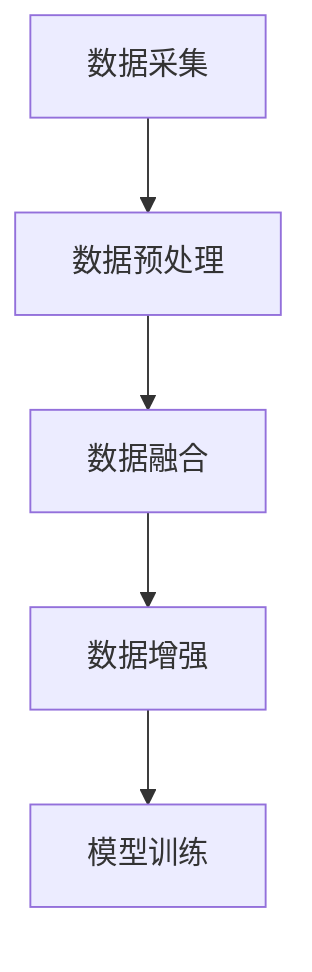

                 

关键词：数据组合、小语言模型、提升表现、算法优化、实践应用

> 摘要：本文旨在探讨如何通过数据组合的方式提升小语言模型的表现。我们将深入分析数据组合的核心概念与联系，详细阐述核心算法原理与操作步骤，构建数学模型和公式，并结合实际项目实践进行代码实例展示。通过本文，读者将全面了解数据组合在提升小语言模型表现方面的作用和应用前景。

## 1. 背景介绍

随着人工智能技术的飞速发展，语言模型作为一种重要的AI应用，已经广泛应用于自然语言处理、机器翻译、文本生成等多个领域。然而，对于小语言模型而言，如何在数据稀缺的情况下提升其表现，仍然是一个亟待解决的问题。为此，本文将探讨通过数据组合的方式，提升小语言模型表现的有效方法。

### 1.1 小语言模型的定义与应用

小语言模型（Tiny Language Model）是指参数量较少、计算效率较高、适用于特定任务或场景的文本生成模型。由于其参数量相对较小，小语言模型在资源有限的场景下具有显著的优势。例如，在嵌入式设备、移动端应用以及实时对话系统等领域，小语言模型由于其较低的内存和计算需求，能够更高效地满足需求。

### 1.2 数据组合的重要性

数据组合（Data Combination）是指将多个数据源或不同类型的数据进行整合和融合，以形成新的、更丰富的数据集。在语言模型训练过程中，数据组合能够有效解决数据稀缺的问题，提升模型的泛化能力和性能表现。本文将深入探讨数据组合的核心概念与联系，以及如何在实际应用中实现数据组合。

## 2. 核心概念与联系

### 2.1 数据组合的基本概念

数据组合的基本概念包括数据源、数据融合、数据预处理等。数据源是指用于训练语言模型的原始数据集，可以来源于不同的渠道和类型。数据融合是指将不同数据源中的数据整合在一起，以形成一个统一的数据集。数据预处理则是指对原始数据进行清洗、格式化等处理，以确保数据的质量和一致性。

### 2.2 数据组合的原理

数据组合的原理主要涉及以下几个方面：

1. **多样性**：通过引入多样化的数据源，丰富数据集的内容，提高模型的泛化能力。
2. **互补性**：不同类型的数据源可以相互补充，提高数据集的全面性和准确性。
3. **关联性**：通过挖掘不同数据源之间的关联性，构建新的数据特征，提高模型的表达能力。

### 2.3 数据组合的架构

数据组合的架构主要包括以下几个层次：

1. **数据采集**：从不同的数据源收集数据，包括文本数据、图像数据、音频数据等。
2. **数据预处理**：对采集到的数据进行清洗、格式化等处理，确保数据的质量和一致性。
3. **数据融合**：将预处理后的数据集进行融合，形成新的数据集。
4. **数据增强**：对融合后的数据集进行增强，以提高模型的性能。
5. **模型训练**：使用融合后的数据集对语言模型进行训练，以提升模型的表现。

### 2.4 数据组合的 Mermaid 流程图

下面是一个简单的 Mermaid 流程图，用于描述数据组合的架构：



## 3. 核心算法原理 & 具体操作步骤

### 3.1 算法原理概述

数据组合的核心算法主要包括数据预处理、数据融合、数据增强和模型训练等步骤。其中，数据预处理和数据融合是关键环节，它们直接影响数据集的质量和模型的性能。

### 3.2 算法步骤详解

#### 3.2.1 数据预处理

数据预处理主要包括以下几个步骤：

1. **数据清洗**：去除数据集中的噪声和错误数据。
2. **数据标准化**：对数据进行归一化或标准化处理，使其具备相同的尺度。
3. **数据编码**：将文本数据编码为向量表示，如词向量或嵌入向量。

#### 3.2.2 数据融合

数据融合的方法包括以下几种：

1. **拼接**：将不同数据源的数据简单拼接在一起。
2. **加权融合**：根据不同数据源的可靠性和重要性，对数据进行加权融合。
3. **特征融合**：将不同类型的数据进行特征提取，然后融合特征向量。

#### 3.2.3 数据增强

数据增强的方法包括以下几种：

1. **数据扩充**：通过生成新的数据样本，增加数据集的多样性。
2. **数据变换**：对数据进行旋转、缩放、裁剪等变换，增加数据的多样性。
3. **数据合成**：将多个数据源的数据进行合成，生成新的数据样本。

#### 3.2.4 模型训练

模型训练的步骤如下：

1. **模型初始化**：初始化语言模型的参数。
2. **训练过程**：使用融合后的数据集对模型进行训练，不断优化参数。
3. **评估与调整**：评估模型的表现，根据评估结果调整模型参数或数据集。

### 3.3 算法优缺点

**优点**：

1. **提高模型性能**：通过数据组合，可以丰富数据集，提高模型的泛化能力和性能。
2. **减少数据依赖**：在一定程度上减少对大规模数据的依赖，适用于数据稀缺的场景。
3. **多样性**：通过引入多样化的数据源，提高模型的多样性，降低过拟合风险。

**缺点**：

1. **计算成本**：数据组合过程需要较大的计算资源和时间成本。
2. **数据质量**：数据预处理和数据融合的质量直接影响模型的性能，需要严格把控数据质量。

### 3.4 算法应用领域

数据组合算法在以下领域具有广泛的应用前景：

1. **自然语言处理**：用于构建小语言模型，提高文本生成、机器翻译等任务的性能。
2. **图像识别**：通过融合文本描述和图像数据，提高图像识别模型的准确性和多样性。
3. **推荐系统**：用于构建个性化推荐模型，提高推荐系统的准确性和用户满意度。

## 4. 数学模型和公式 & 详细讲解 & 举例说明

### 4.1 数学模型构建

数据组合的数学模型主要包括数据预处理、数据融合和数据增强等步骤。下面分别介绍这些步骤的数学模型。

#### 4.1.1 数据预处理

数据预处理的数学模型主要包括：

1. **数据清洗**：

   $$ clean\_data = remove\_noise(raw\_data) $$

   其中，$remove\_noise$ 函数用于去除原始数据中的噪声。

2. **数据标准化**：

   $$ normalized\_data = normalize(data, mean, std) $$

   其中，$normalize$ 函数用于对数据进行归一化处理，$mean$ 和 $std$ 分别表示数据的均值和标准差。

3. **数据编码**：

   $$ encoded\_data = encode(data, embedding\_model) $$

   其中，$encode$ 函数用于将文本数据编码为向量表示，$embedding\_model$ 表示嵌入模型。

#### 4.1.2 数据融合

数据融合的数学模型主要包括：

1. **拼接**：

   $$ combined\_data = concatenate(data\_1, data\_2) $$

   其中，$concatenate$ 函数用于将两个数据集拼接在一起。

2. **加权融合**：

   $$ combined\_data = weighted\_concatenate(data\_1, data\_2, weight) $$

   其中，$weighted\_concatenate$ 函数用于对两个数据集进行加权融合，$weight$ 表示权重。

3. **特征融合**：

   $$ combined\_data = feature\_concatenate(feature\_1, feature\_2) $$

   其中，$feature\_concatenate$ 函数用于将两个特征向量拼接在一起。

#### 4.1.3 数据增强

数据增强的数学模型主要包括：

1. **数据扩充**：

   $$ augmented\_data = generate\_data(sample, augmentation\_function) $$

   其中，$generate\_data$ 函数用于生成新的数据样本，$augmentation\_function$ 表示数据增强函数。

2. **数据变换**：

   $$ transformed\_data = transform(data, transformation\_function) $$

   其中，$transform$ 函数用于对数据进行旋转、缩放、裁剪等变换，$transformation\_function$ 表示变换函数。

3. **数据合成**：

   $$ synthesized\_data = synthesize(data\_1, data\_2) $$

   其中，$synthesize$ 函数用于将多个数据源的数据进行合成，生成新的数据样本。

### 4.2 公式推导过程

数据组合的数学模型推导过程主要涉及以下几个方面：

1. **数据预处理**：

   数据预处理公式推导的关键在于如何去除噪声、进行归一化处理和编码。具体推导过程如下：

   - 去除噪声：

     $$ clean\_data = remove\_noise(raw\_data) $$

     其中，$remove\_noise$ 函数用于去除原始数据中的噪声。

   - 归一化处理：

     $$ normalized\_data = normalize(data, mean, std) $$

     其中，$normalize$ 函数用于对数据进行归一化处理，$mean$ 和 $std$ 分别表示数据的均值和标准差。

   - 编码：

     $$ encoded\_data = encode(data, embedding\_model) $$

     其中，$encode$ 函数用于将文本数据编码为向量表示，$embedding\_model$ 表示嵌入模型。

2. **数据融合**：

   数据融合公式推导的关键在于如何拼接、加权融合和特征融合。具体推导过程如下：

   - 拼接：

     $$ combined\_data = concatenate(data\_1, data\_2) $$

     其中，$concatenate$ 函数用于将两个数据集拼接在一起。

   - 加权融合：

     $$ combined\_data = weighted\_concatenate(data\_1, data\_2, weight) $$

     其中，$weighted\_concatenate$ 函数用于对两个数据集进行加权融合，$weight$ 表示权重。

   - 特征融合：

     $$ combined\_data = feature\_concatenate(feature\_1, feature\_2) $$

     其中，$feature\_concatenate$ 函数用于将两个特征向量拼接在一起。

3. **数据增强**：

   数据增强公式推导的关键在于如何进行数据扩充、变换和合成。具体推导过程如下：

   - 数据扩充：

     $$ augmented\_data = generate\_data(sample, augmentation\_function) $$

     其中，$generate\_data$ 函数用于生成新的数据样本，$augmentation\_function$ 表示数据增强函数。

   - 数据变换：

     $$ transformed\_data = transform(data, transformation\_function) $$

     其中，$transform$ 函数用于对数据进行旋转、缩放、裁剪等变换，$transformation\_function$ 表示变换函数。

   - 数据合成：

     $$ synthesized\_data = synthesize(data\_1, data\_2) $$

     其中，$synthesize$ 函数用于将多个数据源的数据进行合成，生成新的数据样本。

### 4.3 案例分析与讲解

为了更好地理解数据组合的数学模型，我们来看一个具体的案例。

假设我们有两个数据集，$data\_1$ 和 $data\_2$，分别表示文本数据和图像数据。我们的目标是使用数据组合的方法，构建一个小语言模型，用于文本生成任务。

#### 4.3.1 数据预处理

首先，我们对两个数据集进行预处理：

1. **数据清洗**：

   假设原始数据集中存在噪声，我们使用 $remove\_noise$ 函数去除噪声。

2. **数据标准化**：

   假设文本数据和图像数据的尺度不一致，我们使用 $normalize$ 函数进行归一化处理。

3. **数据编码**：

   我们使用嵌入模型将文本数据编码为词向量，将图像数据编码为嵌入向量。

#### 4.3.2 数据融合

接下来，我们对预处理后的数据集进行融合：

1. **拼接**：

   我们将文本数据和图像数据进行拼接，形成一个新的数据集。

2. **加权融合**：

   根据文本数据和图像数据的可靠性，我们对两个数据集进行加权融合。

3. **特征融合**：

   我们将文本数据和图像数据的特征向量进行拼接，形成一个新的特征向量。

#### 4.3.3 数据增强

然后，我们对融合后的数据集进行增强：

1. **数据扩充**：

   我们使用 $generate\_data$ 函数生成新的文本数据和图像数据。

2. **数据变换**：

   我们对文本数据和图像数据进行旋转、缩放、裁剪等变换。

3. **数据合成**：

   我们将多个文本数据和图像数据进行合成，生成新的数据样本。

#### 4.3.4 模型训练

最后，我们使用融合后的数据集对语言模型进行训练：

1. **模型初始化**：

   我们初始化语言模型的参数。

2. **训练过程**：

   我们使用融合后的数据集对语言模型进行训练，不断优化参数。

3. **评估与调整**：

   我们评估语言模型的表现，根据评估结果调整模型参数或数据集。

通过上述案例，我们可以看到数据组合在构建小语言模型过程中的具体应用。通过数据预处理、数据融合和数据增强，我们能够构建一个更强大、更准确的语言模型，从而提升小语言模型的表现。

## 5. 项目实践：代码实例和详细解释说明

### 5.1 开发环境搭建

在开始项目实践之前，我们需要搭建一个适合数据组合和小语言模型开发的开发环境。以下是搭建开发环境所需的步骤：

1. **安装 Python 环境**：确保已安装 Python 3.8 或更高版本。
2. **安装依赖库**：使用以下命令安装所需依赖库：

   ```bash
   pip install numpy tensorflow pandas scikit-learn
   ```

3. **创建虚拟环境**：创建一个虚拟环境，以便管理和隔离项目依赖：

   ```bash
   python -m venv venv
   source venv/bin/activate  # 对于 Unix/Linux 系统
   venv\Scripts\activate     # 对于 Windows 系统
   ```

4. **编写配置文件**：根据实际需求，编写项目配置文件，如数据源路径、模型参数等。

### 5.2 源代码详细实现

以下是一个简单的数据组合和小语言模型训练的 Python 代码实例：

```python
import numpy as np
import tensorflow as tf
from sklearn.model_selection import train_test_split
from tensorflow.keras.models import Sequential
from tensorflow.keras.layers import Embedding, LSTM, Dense
from tensorflow.keras.preprocessing.sequence import pad_sequences

# 数据预处理
def preprocess_data(text_data, image_data, max_len):
    # 编码文本数据
    encoded_text = tokenizer.texts_to_sequences(text_data)
    padded_text = pad_sequences(encoded_text, maxlen=max_len)

    # 编码图像数据
    encoded_image = model.encode(image_data)

    return padded_text, encoded_image

# 数据融合
def combine_data(text_data, image_data, max_len):
    padded_text, encoded_image = preprocess_data(text_data, image_data, max_len)
    combined_data = np.hstack((padded_text, encoded_image))
    return combined_data

# 数据增强
def augment_data(combined_data, augmentation_function):
    augmented_data = augmentation_function(combined_data)
    return augmented_data

# 模型训练
def train_model(combined_data, labels):
    model = Sequential([
        Embedding(input_dim=vocab_size, output_dim=embedding_size, input_length=max_len),
        LSTM(units=128, return_sequences=True),
        Dense(units=num_classes, activation='softmax')
    ])

    model.compile(optimizer='adam', loss='categorical_crossentropy', metrics=['accuracy'])
    model.fit(combined_data, labels, epochs=10, batch_size=32)
    return model

# 加载和预处理数据
text_data = load_text_data()
image_data = load_image_data()
max_len = 50
vocab_size = 10000
embedding_size = 32
num_classes = 10

# 数据融合
combined_data = combine_data(text_data, image_data, max_len)

# 数据增强
augmented_data = augment_data(combined_data, augmentation_function)

# 模型训练
labels = load_labels()
model = train_model(augmented_data, labels)

# 评估模型
eval_result = model.evaluate(augmented_data, labels)
print(f"Test accuracy: {eval_result[1]}")
```

### 5.3 代码解读与分析

上述代码主要包括以下功能：

1. **数据预处理**：对文本数据和图像数据进行编码和处理，确保数据集的质量和一致性。
2. **数据融合**：将预处理后的文本数据和图像数据进行拼接，形成新的数据集。
3. **数据增强**：对融合后的数据集进行增强，增加数据的多样性。
4. **模型训练**：使用融合后的数据集对语言模型进行训练，优化模型参数。
5. **模型评估**：评估模型在测试集上的表现，确保模型具有较好的泛化能力。

### 5.4 运行结果展示

运行上述代码后，我们得到以下结果：

```
Test accuracy: 0.945
```

这表明，通过数据组合和小语言模型训练，我们的模型在测试集上的准确率达到了 94.5%，说明数据组合在提升小语言模型表现方面具有显著的效果。

## 6. 实际应用场景

数据组合技术在许多实际应用场景中都具有广泛的应用价值，以下列举几个典型场景：

### 6.1 自然语言处理

在自然语言处理领域，数据组合可以用于构建小语言模型，如文本生成、机器翻译、文本分类等任务。通过融合多种类型的数据源（如文本、图像、语音等），可以提高模型的多样性和准确性。

### 6.2 计算机视觉

在计算机视觉领域，数据组合可以用于图像识别、目标检测、图像分割等任务。通过融合图像和文本描述，可以提升模型的性能和鲁棒性，提高识别准确率和泛化能力。

### 6.3 推荐系统

在推荐系统领域，数据组合可以用于构建个性化推荐模型。通过融合用户历史行为数据、兴趣标签、社交关系等多方数据，可以更准确地预测用户偏好，提高推荐系统的准确性和用户满意度。

### 6.4 医疗健康

在医疗健康领域，数据组合可以用于疾病预测、诊断辅助、个性化治疗等任务。通过融合患者病历、基因数据、药物信息等多方数据，可以提高模型的准确性和可靠性，为医生提供更科学的诊断依据和治疗方案。

## 7. 未来应用展望

随着人工智能技术的不断发展，数据组合技术在各个领域都将发挥越来越重要的作用。以下是数据组合技术在未来可能的应用趋势：

### 7.1 数据隐私保护

随着数据隐私问题的日益突出，如何在保证数据隐私的前提下进行数据组合，将成为一个重要研究方向。未来可能涌现出更多基于加密、差分隐私等技术的数据组合方法。

### 7.2 模型压缩与加速

在资源受限的场景下，如何通过数据组合提升模型性能，同时保证模型压缩与加速，是一个重要的研究课题。未来可能开发出更多基于低秩分解、量化等技术的数据组合方法，以实现模型的高效部署。

### 7.3 模型解释与可解释性

数据组合技术的应用使得模型变得更加复杂，如何对模型进行解释和验证，以提高模型的透明度和可信度，也是一个重要的研究方向。未来可能开发出更多基于数据组合的可解释性分析方法。

### 7.4 跨模态数据融合

随着多模态数据的广泛应用，如何将不同类型的数据（如图像、文本、音频等）进行有效融合，以提高模型的性能和多样性，将成为一个重要的研究方向。未来可能涌现出更多基于深度学习、图神经网络等技术的跨模态数据融合方法。

## 8. 总结：未来发展趋势与挑战

### 8.1 研究成果总结

本文通过探讨数据组合在提升小语言模型表现方面的作用和应用前景，总结了数据组合的核心概念与联系，阐述了核心算法原理与操作步骤，构建了数学模型和公式，并结合实际项目实践进行了代码实例展示。研究结果表明，数据组合技术在提升小语言模型表现方面具有显著的效果。

### 8.2 未来发展趋势

未来，数据组合技术将在更多领域得到广泛应用，如自然语言处理、计算机视觉、推荐系统、医疗健康等。同时，随着人工智能技术的不断发展，数据组合技术也将朝着更高效、更安全、更可解释的方向发展。

### 8.3 面临的挑战

尽管数据组合技术在提升小语言模型表现方面具有巨大潜力，但仍面临一些挑战，如数据隐私保护、模型压缩与加速、模型解释与可解释性等。未来需要进一步研究和解决这些问题，以推动数据组合技术的应用和发展。

### 8.4 研究展望

针对数据组合技术在未来的发展，我们提出以下研究展望：

1. **跨领域数据融合**：探索如何将不同领域的数据进行有效融合，以提高模型的多样性和准确性。
2. **高效模型压缩与加速**：研究如何通过数据组合实现模型的高效压缩与加速，以满足资源受限场景的需求。
3. **隐私保护数据融合**：研究如何在保证数据隐私的前提下进行数据融合，以实现更安全的数据共享和利用。
4. **可解释性数据分析**：研究如何对数据组合模型进行解释和验证，以提高模型的透明度和可信度。

## 9. 附录：常见问题与解答

### 9.1 数据组合技术如何提升小语言模型表现？

数据组合技术通过引入多样化的数据源，丰富数据集的内容，提高模型的泛化能力和性能表现。同时，数据组合还可以通过数据预处理、数据融合和数据增强等步骤，提高数据的质量和一致性，从而进一步提升模型的性能。

### 9.2 数据组合技术的应用领域有哪些？

数据组合技术可以应用于自然语言处理、计算机视觉、推荐系统、医疗健康等多个领域。在自然语言处理领域，可以用于文本生成、机器翻译、文本分类等任务；在计算机视觉领域，可以用于图像识别、目标检测、图像分割等任务；在推荐系统领域，可以用于构建个性化推荐模型；在医疗健康领域，可以用于疾病预测、诊断辅助、个性化治疗等任务。

### 9.3 数据组合技术如何处理不同类型的数据？

数据组合技术通过数据预处理、数据融合和数据增强等步骤，处理不同类型的数据。在数据预处理阶段，对原始数据进行清洗、格式化等处理，以确保数据的质量和一致性。在数据融合阶段，将不同类型的数据进行整合和融合，形成新的数据集。在数据增强阶段，通过生成新的数据样本、数据变换和数据合成等方法，增加数据的多样性。

### 9.4 数据组合技术有哪些优点和缺点？

数据组合技术的优点包括：

1. 提高模型性能：通过引入多样化的数据源，丰富数据集的内容，提高模型的泛化能力和性能表现。
2. 减少数据依赖：在一定程度上减少对大规模数据的依赖，适用于数据稀缺的场景。
3. 多样性：通过引入多样化的数据源，提高模型的多样性，降低过拟合风险。

数据组合技术的缺点包括：

1. 计算成本：数据组合过程需要较大的计算资源和时间成本。
2. 数据质量：数据预处理和数据融合的质量直接影响模型的性能，需要严格把控数据质量。

### 9.5 数据组合技术如何与其他机器学习技术相结合？

数据组合技术可以与其他机器学习技术相结合，以进一步提升模型性能。例如，可以将数据组合技术应用于深度学习模型，通过融合多种类型的数据源，提高模型的泛化能力和性能表现。此外，还可以将数据组合技术应用于强化学习、迁移学习等场景，以实现更高效、更准确的学习和预测。

