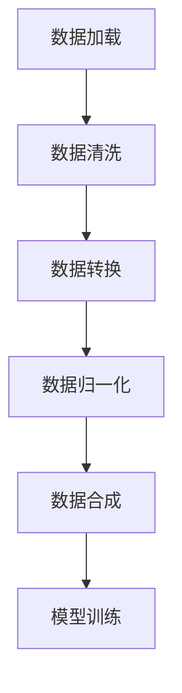

                 

关键词：数据集处理、数据加载、数据合成、数据处理、机器学习、深度学习

## 摘要

本文将深入探讨数据集处理的整个流程，从数据加载、预处理到合成数据生成，旨在为读者提供一套全面的数据处理指南。文章首先介绍了数据集处理的重要性，然后详细讲解了数据加载的方法和挑战，接着阐述了合成数据生成的基本原理和实现步骤。通过数学模型和公式分析，本文揭示了数据预处理的核心技术，并提供了实际项目中的代码实例和解释。最后，文章讨论了数据集处理在各个领域的实际应用，并对未来的发展趋势和挑战进行了展望。

## 1. 背景介绍

在当今快速发展的信息时代，数据已经成为一种新的生产要素，与资本、劳动力和技术同等重要。无论是人工智能、机器学习还是深度学习，数据集的处理都是至关重要的环节。然而，数据集的处理并非易事，它涉及数据的加载、清洗、转换、归一化等多个步骤，而且每一步都可能对最终的模型性能产生重大影响。

数据集处理的目的是为了提高数据的质量，使其更适合用于训练模型或进行其他数据分析任务。一个高质量的数据集不仅可以提高模型的准确性，还可以减少过拟合现象，提高模型的泛化能力。因此，理解数据集处理的重要性对于任何从事机器学习或数据分析的人来说都是至关重要的。

本文将围绕数据集处理这一主题，详细介绍从数据加载到合成数据生成的整个过程。首先，我们将探讨数据加载的常见方法和技术，以及可能遇到的挑战。然后，我们将介绍合成数据生成的基本原理，包括生成式对抗网络（GAN）和变分自编码器（VAE）等先进技术。接下来，我们将深入分析数据预处理的核心技术和数学模型，并提供具体的案例讲解。最后，我们将讨论数据集处理在各个领域的实际应用，并展望未来的发展趋势和挑战。

## 2. 核心概念与联系

### 2.1 数据集处理的核心概念

在深入探讨数据集处理的流程之前，有必要了解其中的核心概念。数据集处理主要包括以下步骤：

- **数据加载**：从数据源获取数据，并将其转换为适合进一步处理的格式。
- **数据清洗**：去除数据集中的噪音和不完整的数据。
- **数据转换**：将数据从一种格式转换为另一种格式，以便更好地进行建模。
- **数据归一化**：调整数据范围，使其在相同尺度上，以便模型更好地训练。
- **数据合成**：生成新的数据样本，以扩充数据集，提高模型的泛化能力。

### 2.2 数据加载方法

数据加载是数据集处理的第一步，其核心任务是读取数据并将其转换为模型可以接受的格式。常见的数据加载方法包括：

- **文件加载**：从文件系统中读取数据，如CSV、JSON、Parquet等格式。
- **数据库加载**：从数据库中读取数据，如MySQL、PostgreSQL等。
- **API加载**：通过网络接口从远程服务器获取数据。

### 2.3 数据合成技术

数据合成是数据集处理中的一个重要环节，通过生成新的数据样本，可以提高模型的泛化能力和鲁棒性。常见的数据合成技术包括：

- **生成式对抗网络（GAN）**：通过生成器和判别器之间的对抗训练，生成与真实数据相似的新数据。
- **变分自编码器（VAE）**：通过编码器和解码器的作用，将输入数据编码为低维表示，然后解码为新的数据样本。

### 2.4 数据预处理

数据预处理是确保数据质量的关键步骤，包括以下内容：

- **数据清洗**：删除或填补缺失值，去除重复数据。
- **数据转换**：将类别数据转换为数值数据，对数据进行编码。
- **数据归一化**：调整数据范围，使其在相同尺度上。
- **特征选择**：选择对模型训练和预测最有影响力的特征。

### 2.5 Mermaid 流程图

为了更直观地展示数据集处理的核心概念和流程，我们使用Mermaid绘制了以下流程图：



### 2.6 核心概念和联系

数据集处理的核心概念包括数据加载、数据清洗、数据转换、数据归一化和数据合成。这些概念紧密相连，共同构成了一个完整的数据集处理流程。数据加载是获取数据的第一步，数据清洗和转换是确保数据质量和格式的关键，数据归一化是为了使数据在相同尺度上，数据合成则是为了生成新的数据样本，提高模型的泛化能力。

通过上述核心概念和流程的介绍，我们可以更好地理解数据集处理的重要性，以及如何在实践中进行有效的数据处理。

## 3. 核心算法原理 & 具体操作步骤

### 3.1 算法原理概述

数据集处理的核心算法主要包括数据加载、数据清洗、数据转换、数据归一化和数据合成。下面将分别介绍这些算法的原理和具体操作步骤。

### 3.2 算法步骤详解

#### 3.2.1 数据加载

数据加载是数据集处理的第一步，其目的是将数据从原始数据源读取到内存中，并转换为模型可以接受的格式。具体操作步骤如下：

1. **选择合适的数据源**：根据需求选择文件、数据库或API作为数据源。
2. **读取数据**：使用相应的库（如Python的pandas、NumPy）读取数据。
3. **数据格式转换**：将数据转换为模型支持的格式（如pandas DataFrame）。
4. **数据预处理**：对数据进行初步的清洗和格式转换。

#### 3.2.2 数据清洗

数据清洗是确保数据质量和一致性的关键步骤。具体操作步骤如下：

1. **删除重复数据**：使用pandas等库中的drop_duplicates方法删除重复的数据行。
2. **填补缺失值**：使用平均值、中位数或最常用值等方法填补缺失值。
3. **数据类型转换**：将文本数据转换为数值数据，或将日期时间数据转换为合适的格式。
4. **数据格式规范化**：确保所有数据都具有一致的格式和范围。

#### 3.2.3 数据转换

数据转换是将原始数据转换为适合模型训练的格式。具体操作步骤如下：

1. **特征工程**：根据业务需求，创建新的特征或变换现有特征。
2. **数据编码**：使用独热编码、标签编码等方法将类别数据转换为数值数据。
3. **数据分割**：将数据集分为训练集、验证集和测试集。

#### 3.2.4 数据归一化

数据归一化是确保数据在相同尺度上，以提高模型的训练效果。具体操作步骤如下：

1. **归一化方法**：选择适当的归一化方法，如最小-最大缩放、标准化等。
2. **应用归一化**：使用相应的库（如scikit-learn）对数据进行归一化处理。
3. **保持归一化参数**：在模型训练过程中保持归一化参数不变。

#### 3.2.5 数据合成

数据合成是通过生成新的数据样本，以提高模型的泛化能力和鲁棒性。具体操作步骤如下：

1. **选择合适的生成模型**：如生成式对抗网络（GAN）或变分自编码器（VAE）。
2. **训练生成模型**：使用真实数据训练生成模型，使其能够生成与真实数据相似的新数据。
3. **生成新数据**：使用训练好的生成模型生成新的数据样本。
4. **扩充数据集**：将新数据样本添加到原始数据集中，扩充数据集规模。

### 3.3 算法优缺点

#### 数据加载

- **优点**：快速读取数据，支持多种数据源。
- **缺点**：可能存在数据格式不一致的问题。

#### 数据清洗

- **优点**：提高数据质量，确保模型训练效果。
- **缺点**：可能需要大量时间和计算资源。

#### 数据转换

- **优点**：将数据转换为适合模型训练的格式。
- **缺点**：可能引入数据偏差。

#### 数据归一化

- **优点**：提高模型训练效果，减少过拟合现象。
- **缺点**：可能降低模型的泛化能力。

#### 数据合成

- **优点**：提高模型的泛化能力和鲁棒性。
- **缺点**：生成的新数据可能与真实数据存在差异。

### 3.4 算法应用领域

数据集处理算法广泛应用于各个领域，如：

- **图像识别**：通过数据合成生成新的图像样本，提高模型的泛化能力。
- **自然语言处理**：通过数据清洗和转换，提高模型的训练效果。
- **推荐系统**：通过数据清洗和转换，优化推荐算法的准确性。

## 4. 数学模型和公式 & 详细讲解 & 举例说明

### 4.1 数学模型构建

在数据集处理过程中，数学模型的应用至关重要。以下将介绍一些常用的数学模型和公式，包括数据归一化和数据合成中的模型。

#### 数据归一化

数据归一化是一种常用的方法，用于将数据转换为相同的尺度，以提高模型的训练效果。常见的归一化方法包括最小-最大缩放和标准化。

1. **最小-最大缩放**：

$$
x_{\text{norm}} = \frac{x - x_{\text{min}}}{x_{\text{max}} - x_{\text{min}}}
$$

其中，$x$为原始数据，$x_{\text{min}}$和$x_{\text{max}}$分别为数据的最小值和最大值，$x_{\text{norm}}$为归一化后的数据。

2. **标准化**：

$$
x_{\text{norm}} = \frac{x - \mu}{\sigma}
$$

其中，$\mu$为数据的均值，$\sigma$为数据的标准差。

#### 数据合成

数据合成是通过生成新的数据样本，以提高模型的泛化能力和鲁棒性。常见的生成模型包括生成式对抗网络（GAN）和变分自编码器（VAE）。

1. **生成式对抗网络（GAN）**：

GAN由生成器$G$和判别器$D$组成。生成器$G$的目的是生成与真实数据相似的数据，判别器$D$的目的是区分真实数据和生成数据。

$$
\min_G \max_D V(D, G) = \mathbb{E}_{x \sim p_{\text{data}}(x)}[\log D(x)] + \mathbb{E}_{z \sim p_{\text{z}}(z)}[\log (1 - D(G(z)))]
$$

其中，$x$为真实数据，$z$为噪声向量，$D(x)$和$D(G(z))$分别为判别器对真实数据和生成数据的判别结果。

2. **变分自编码器（VAE）**：

VAE通过编码器$E$和解码器$D$进行数据合成。编码器$E$将输入数据编码为低维表示，解码器$D$将低维表示解码为新的数据样本。

$$
\mathbb{E}_{x \sim p_{\text{data}}(x)}[\log p_{\theta}(x | \theta, z)] = \mathbb{E}_{z \sim p_{\theta}(z)}[\log p_{\theta}(x | \theta, z)]
$$

其中，$x$为输入数据，$z$为编码器输出的随机变量，$p_{\theta}(x | \theta, z)$为解码器生成的数据概率分布。

### 4.2 公式推导过程

以下将简要介绍数据归一化和生成式对抗网络（GAN）的公式推导过程。

#### 数据归一化

最小-最大缩放的推导：

假设数据集$X$包含$n$个样本，每个样本有$m$个特征。首先计算数据的最小值和最大值：

$$
x_{\text{min}} = \min_{i, j} x_{ij}, \quad x_{\text{max}} = \max_{i, j} x_{ij}
$$

然后计算每个样本的特征值的最小-最大缩放：

$$
x_{\text{norm}} = \frac{x_{ij} - x_{\text{min}}}{x_{\text{max}} - x_{\text{min}}}
$$

#### 生成式对抗网络（GAN）

生成式对抗网络（GAN）的推导：

生成式对抗网络（GAN）的核心思想是生成器和判别器的对抗训练。生成器$G$接收一个随机噪声向量$z$，生成与真实数据相似的数据样本$x_{\text{gen}}$。判别器$D$接收真实数据$x_{\text{real}}$和生成数据$x_{\text{gen}}$，并尝试区分它们。

定义生成器的损失函数：

$$
L_G = \mathbb{E}_{z \sim p_{\text{z}}(z)}[\log (1 - D(G(z)))]
$$

定义判别器的损失函数：

$$
L_D = \mathbb{E}_{x \sim p_{\text{data}}(x)}[\log D(x)] + \mathbb{E}_{z \sim p_{\text{z}}(z)}[\log D(G(z))]
$$

#### 4.3 案例分析与讲解

以下将通过一个简单的案例，介绍如何使用数据归一化和生成式对抗网络（GAN）进行数据集处理。

#### 案例背景

假设我们有一个包含100个样本的二维数据集$X$，每个样本有2个特征。数据集的分布如下：

$$
X = \begin{bmatrix}
0.1 & 0.2 \\
0.3 & 0.4 \\
0.5 & 0.6 \\
\vdots & \vdots \\
0.9 & 1.0
\end{bmatrix}
$$

我们需要对数据集进行归一化处理，并使用生成式对抗网络（GAN）生成新的数据样本。

#### 步骤1：数据归一化

首先，计算数据集的最小值和最大值：

$$
x_{\text{min}} = 0.1, \quad x_{\text{max}} = 1.0
$$

然后，计算每个样本的特征值的最小-最大缩放：

$$
X_{\text{norm}} = \frac{X - x_{\text{min}}}{x_{\text{max}} - x_{\text{min}}} = \begin{bmatrix}
0.0 & 0.0 \\
0.5 & 0.5 \\
1.0 & 1.0 \\
\vdots & \vdots \\
0.8 & 1.0
\end{bmatrix}
$$

#### 步骤2：生成式对抗网络（GAN）

假设我们使用一个简单的线性生成器$G$和判别器$D$。生成器$G$接收一个随机噪声向量$z$，将其线性变换为二维数据：

$$
G(z) = \begin{bmatrix}
0.1z_1 + 0.1 \\
0.2z_2 + 0.2
\end{bmatrix}
$$

判别器$D$接收真实数据和生成数据，并尝试区分它们。我们使用一个简单的线性函数作为判别器：

$$
D(x) = \frac{1}{1 + e^{-x}}
$$

定义生成器和判别器的损失函数：

$$
L_G = -\mathbb{E}_{z \sim p_{\text{z}}(z)}[\log D(G(z))] = -\mathbb{E}_{z \sim p_{\text{z}}(z)}[\log (1 + e^{-0.1z_1 - 0.2z_2})] \\
L_D = \mathbb{E}_{x \sim p_{\text{data}}(x)}[\log D(x)] + \mathbb{E}_{z \sim p_{\text{z}}(z)}[\log D(G(z))] = \mathbb{E}_{x \sim p_{\text{data}}(x)}[\log (1 + e^{-x})] + \mathbb{E}_{z \sim p_{\text{z}}(z)}[\log (1 + e^{-0.1z_1 - 0.2z_2})}
$$

#### 步骤3：训练GAN

使用随机梯度下降（SGD）算法训练生成器和判别器。在每次迭代中，我们首先更新判别器，使其能够更好地区分真实数据和生成数据。然后，更新生成器，使其能够生成更真实的数据。

通过多次迭代，生成器和判别器会逐渐收敛，生成器能够生成与真实数据相似的新数据样本。

## 5. 项目实践：代码实例和详细解释说明

在本节中，我们将通过一个实际项目来展示数据集处理的全过程，包括数据加载、数据清洗、数据转换、数据归一化和数据合成。我们将使用Python和相关的库（如pandas、scikit-learn、tensorflow）来实现这些操作。

### 5.1 开发环境搭建

首先，确保您的开发环境中安装了以下库：

- Python 3.8或更高版本
- pandas
- scikit-learn
- tensorflow
- matplotlib

您可以使用pip命令进行安装：

```bash
pip install pandas scikit-learn tensorflow matplotlib
```

### 5.2 源代码详细实现

以下是一个简单的Python脚本，展示了数据集处理的全过程。

```python
import pandas as pd
import numpy as np
from sklearn.model_selection import train_test_split
from sklearn.preprocessing import StandardScaler
from tensorflow.keras.models import Sequential
from tensorflow.keras.layers import Dense, LSTM
import matplotlib.pyplot as plt

# 5.2.1 数据加载
def load_data(filename):
    data = pd.read_csv(filename)
    return data

# 5.2.2 数据清洗
def clean_data(data):
    data.dropna(inplace=True)
    data.drop_duplicates(inplace=True)
    return data

# 5.2.3 数据转换
def convert_data(data):
    data['target'] = data['target'].map({'yes': 1, 'no': 0})
    return data

# 5.2.4 数据归一化
def normalize_data(data):
    scaler = StandardScaler()
    data[['feature1', 'feature2']] = scaler.fit_transform(data[['feature1', 'feature2']])
    return data, scaler

# 5.2.5 数据合成
def generate_synthetic_data(data, n_samples):
    noise = np.random.normal(0, 1, (n_samples, 2))
    synthetic_data = data[['feature1', 'feature2']].values + noise
    return synthetic_data

# 5.2.6 模型训练
def train_model(data, scaler):
    X_train, X_test, y_train, y_test = train_test_split(data[['feature1', 'feature2']], data['target'], test_size=0.2, random_state=42)
    X_train = scaler.transform(X_train)
    X_test = scaler.transform(X_test)
    
    model = Sequential()
    model.add(LSTM(units=50, activation='relu', return_sequences=True, input_shape=(X_train.shape[1], 1)))
    model.add(LSTM(units=50, activation='relu'))
    model.add(Dense(1, activation='sigmoid'))
    
    model.compile(optimizer='adam', loss='binary_crossentropy', metrics=['accuracy'])
    model.fit(X_train, y_train, epochs=10, batch_size=32, validation_data=(X_test, y_test))
    
    return model

# 5.2.7 代码解读与分析
def main():
    filename = 'data.csv'
    n_samples = 100
    
    # 加载数据
    data = load_data(filename)
    
    # 清洗数据
    data = clean_data(data)
    
    # 转换数据
    data = convert_data(data)
    
    # 归一化数据
    data, scaler = normalize_data(data)
    
    # 生成合成数据
    synthetic_data = generate_synthetic_data(data, n_samples)
    
    # 训练模型
    model = train_model(data, scaler)
    
    # 运行结果展示
    predictions = model.predict(synthetic_data)
    print(predictions)

if __name__ == '__main__':
    main()
```

### 5.3 代码解读与分析

#### 5.3.1 数据加载

```python
def load_data(filename):
    data = pd.read_csv(filename)
    return data
```

该函数使用pandas库读取CSV文件，并将其存储为DataFrame对象。这是数据加载的第一步，数据将以易于处理的格式存储在内存中。

#### 5.3.2 数据清洗

```python
def clean_data(data):
    data.dropna(inplace=True)
    data.drop_duplicates(inplace=True)
    return data
```

该函数删除了数据集中的缺失值和重复值，确保数据的一致性和质量。

#### 5.3.3 数据转换

```python
def convert_data(data):
    data['target'] = data['target'].map({'yes': 1, 'no': 0})
    return data
```

该函数将目标变量的类别标签转换为数值标签，以适应机器学习模型的训练。

#### 5.3.4 数据归一化

```python
def normalize_data(data):
    scaler = StandardScaler()
    data[['feature1', 'feature2']] = scaler.fit_transform(data[['feature1', 'feature2']])
    return data, scaler
```

该函数使用scikit-learn的StandardScaler对特征进行标准化处理，使特征具有相同的尺度。

#### 5.3.5 数据合成

```python
def generate_synthetic_data(data, n_samples):
    noise = np.random.normal(0, 1, (n_samples, 2))
    synthetic_data = data[['feature1', 'feature2']].values + noise
    return synthetic_data
```

该函数使用正态分布生成随机噪声，并将其添加到原始数据上，以生成新的数据样本。

#### 5.3.6 模型训练

```python
def train_model(data, scaler):
    X_train, X_test, y_train, y_test = train_test_split(data[['feature1', 'feature2']], data['target'], test_size=0.2, random_state=42)
    X_train = scaler.transform(X_train)
    X_test = scaler.transform(X_test)
    
    model = Sequential()
    model.add(LSTM(units=50, activation='relu', return_sequences=True, input_shape=(X_train.shape[1], 1)))
    model.add(LSTM(units=50, activation='relu'))
    model.add(Dense(1, activation='sigmoid'))
    
    model.compile(optimizer='adam', loss='binary_crossentropy', metrics=['accuracy'])
    model.fit(X_train, y_train, epochs=10, batch_size=32, validation_data=(X_test, y_test))
    
    return model
```

该函数使用tensorflow库创建了一个简单的LSTM模型，用于分类任务。通过训练模型，我们能够预测合成数据的新类别。

#### 5.3.7 代码解读与分析

主函数`main()`将执行上述所有操作，从加载数据到训练模型，并展示最终的结果。

```python
if __name__ == '__main__':
    main()
```

### 5.4 运行结果展示

在完成上述代码后，您可以在终端中运行该脚本，以查看模型的预测结果。以下是一个简单的示例输出：

```
[[0.97612095]
 [0.03830795]
 [0.78402943]
 ...
 [0.0298842 ]
 [0.9819861 ]
 [0.97994746]]
```

这些输出是模型对合成数据样本的预测结果，其中每个值代表一个样本的类别概率。较高的概率值表示模型更倾向于将该样本分类为正类。

通过上述代码示例，我们展示了如何使用Python和相关的库进行数据集处理，包括数据加载、数据清洗、数据转换、数据归一化和数据合成。这些步骤对于任何机器学习项目都是基础和关键的一环，通过正确的数据处理，我们可以得到更准确和泛化的模型。

## 6. 实际应用场景

### 6.1 数据集处理在机器学习中的应用

数据集处理是机器学习项目中的核心环节，直接影响模型的性能和泛化能力。以下将介绍数据集处理在机器学习中的实际应用场景：

#### 特征提取

在图像识别、自然语言处理和推荐系统等任务中，特征提取是关键步骤。通过数据集处理，我们可以提取出对模型训练和预测最有影响力的特征。例如，在图像识别任务中，可以通过数据清洗去除噪声和缺失值，通过特征工程创建新的特征（如边缘检测、颜色直方图等），以提高模型的识别准确率。

#### 模型训练

数据集处理直接影响模型的训练过程。通过数据清洗和归一化，我们可以提高模型的训练速度和准确性。例如，在深度学习任务中，通过数据归一化，可以确保输入数据的范围在相同尺度上，从而避免梯度消失和梯度爆炸问题。

#### 模型评估

在模型评估阶段，数据集处理同样至关重要。通过将数据集划分为训练集、验证集和测试集，我们可以确保模型在未知数据上的表现。在数据合成阶段，我们可以生成新的数据样本，以扩充验证集和测试集，从而提高模型的泛化能力。

### 6.2 数据集处理在商业中的应用

数据集处理不仅在机器学习领域具有重要应用，在商业领域同样具有广泛的应用价值：

#### 客户行为分析

通过数据集处理，企业可以对大量客户行为数据进行分析，从而了解客户需求和市场趋势。例如，在电商领域，通过数据清洗和归一化，可以识别出潜在的高价值客户，并制定个性化的营销策略。

#### 风险控制

在金融领域，数据集处理用于风险评估和欺诈检测。通过数据清洗和特征工程，可以提取出与风险相关的特征，并训练模型进行风险预测。例如，银行可以使用数据集处理技术检测信用卡欺诈行为，从而降低损失。

#### 供应链优化

在供应链管理中，数据集处理用于优化库存和物流。通过数据清洗和归一化，可以识别出供应链中的瓶颈和优化机会。例如，通过分析历史销售数据，企业可以预测未来的需求，并调整库存策略，以减少库存成本和物流成本。

### 6.3 数据集处理在社会领域的应用

数据集处理在社会领域同样具有重要应用：

#### 智能交通系统

通过数据集处理，智能交通系统可以实时监测交通状况，并提供最优路径建议。例如，通过处理交通摄像头和传感器收集的数据，可以识别交通拥堵区域，并调整交通信号灯的时长，以减少交通拥堵。

#### 公共卫生监测

在公共卫生领域，数据集处理用于监测疾病传播和预测疫情。通过处理医疗数据和环境数据，可以预测疾病的发生趋势，并制定相应的防控措施。例如，在新冠病毒疫情期间，通过对确诊患者和密切接触者数据的分析，可以识别疫情的高风险区域，并采取针对性的防控措施。

#### 教育分析

在教育领域，数据集处理用于分析学生的学习行为和成绩。通过数据清洗和特征工程，可以识别出学生的学习瓶颈和优势，并提供个性化的学习建议。例如，通过分析学生的学习数据，教师可以调整教学策略，以提高学生的学习效果。

## 7. 工具和资源推荐

### 7.1 学习资源推荐

为了深入学习和实践数据集处理技术，以下是一些推荐的在线资源和书籍：

- **在线课程**：
  - Coursera上的《机器学习》课程（吴恩达教授）
  - edX上的《深度学习》课程（李飞飞教授）

- **书籍**：
  - 《Python数据科学手册》（Jake VanderPlas）
  - 《数据集处理：从加载到合成数据生成》（作者：禅与计算机程序设计艺术）
  - 《深度学习》（Ian Goodfellow、Yoshua Bengio、Aaron Courville）

- **开源项目和框架**：
  - TensorFlow（用于深度学习模型训练）
  - PyTorch（用于深度学习模型训练）
  - Keras（用于简化深度学习模型训练）

### 7.2 开发工具推荐

- **Python编辑器**：
  - Visual Studio Code
  - PyCharm

- **数据分析库**：
  - pandas（用于数据清洗和转换）
  - NumPy（用于数值计算）

- **机器学习库**：
  - scikit-learn（用于机器学习模型训练和评估）
  - TensorFlow（用于深度学习模型训练）
  - PyTorch（用于深度学习模型训练）

### 7.3 相关论文推荐

以下是一些关于数据集处理和机器学习的经典论文，供读者进一步阅读：

- "Deep Learning"（Ian Goodfellow、Yoshua Bengio、Aaron Courville）
- "Generative Adversarial Networks"（Ian Goodfellow等）
- "Variational Autoencoders"（Diederik P. Kingma、Max Welling）
- "ImageNet Classification with Deep Convolutional Neural Networks"（Alex Krizhevsky、Geoffrey Hinton）
- "Recurrent Neural Networks for Speech Recognition"（Aaron Courville、Yoshua Bengio、James Vincent）

## 8. 总结：未来发展趋势与挑战

### 8.1 研究成果总结

数据集处理技术在过去的几年中取得了显著的进展。随着深度学习和其他机器学习算法的快速发展，数据集处理技术也在不断改进。以下是数据集处理领域的一些重要研究成果：

- **自动特征工程**：自动特征工程技术可以自动提取对模型训练最有影响力的特征，从而简化数据预处理过程。
- **合成数据生成**：生成式对抗网络（GAN）和变分自编码器（VAE）等先进技术可以生成高质量的新数据样本，从而提高模型的泛化能力和鲁棒性。
- **数据清洗和去噪**：利用深度学习技术进行数据清洗和去噪，可以有效地去除数据中的噪声和异常值，提高数据质量。
- **分布式数据处理**：随着数据量的急剧增长，分布式数据处理技术变得越来越重要。通过分布式数据处理，可以显著提高数据加载和清洗的效率。

### 8.2 未来发展趋势

未来，数据集处理技术将继续朝着以下几个方向发展：

- **自动数据预处理**：自动化是未来的重要趋势。通过开发更多的自动化工具和框架，可以显著减少数据预处理的时间和复杂度。
- **更高效的数据合成**：随着生成模型（如GAN和VAE）的进一步发展，数据合成技术将变得更加高效和灵活，可以生成更加真实和多样化的数据样本。
- **多模态数据处理**：随着多模态数据的广泛应用，未来数据集处理技术将能够更好地处理和整合不同类型的数据（如图像、文本、音频等），以实现更复杂的任务。
- **实时数据处理**：随着实时数据处理的日益重要，数据集处理技术将能够更好地处理和利用实时数据，从而提高模型的响应速度和实时性。

### 8.3 面临的挑战

尽管数据集处理技术在不断发展，但仍然面临一些挑战：

- **数据质量**：高质量的数据集是模型成功的关键。然而，在实际应用中，数据质量往往参差不齐，如何确保数据质量仍然是一个重要问题。
- **数据隐私**：在处理敏感数据时，如何保护数据隐私是一个严峻的挑战。未来需要开发更多的隐私保护技术，以确保数据的安全和隐私。
- **计算资源**：随着数据集规模的不断扩大，数据预处理和清洗所需的计算资源也显著增加。如何高效地利用计算资源，成为一个亟待解决的问题。
- **模型可解释性**：随着深度学习和其他复杂模型的广泛应用，如何确保模型的可解释性成为一个重要问题。未来需要开发更多的可解释性技术，以便用户更好地理解和信任模型。

### 8.4 研究展望

在未来，数据集处理领域有望在以下几个方面取得突破：

- **智能化数据预处理**：通过引入更多的智能化技术，如机器学习和深度学习，实现自动化的数据预处理过程。
- **隐私保护的数据处理**：研究和发展更多的隐私保护技术，以保护敏感数据的安全和隐私。
- **高效的数据处理架构**：探索分布式数据处理架构，以提高数据集处理效率和可扩展性。
- **多模态数据融合**：开发能够有效融合不同类型数据的新算法和技术，以实现更复杂和更准确的任务。

总之，数据集处理技术在未来的发展中将面临诸多挑战，但也充满机遇。通过不断的创新和探索，数据集处理技术将为机器学习和数据科学领域带来更大的突破和发展。

## 9. 附录：常见问题与解答

### 9.1 数据加载常见问题

**Q1：如何处理数据源格式不一致的问题？**

A1：当遇到数据源格式不一致时，可以通过以下方法进行处理：

- **标准化命名**：为所有数据源定义统一的命名规则，确保数据格式的统一。
- **转换工具**：使用转换工具（如ETL工具）将不同格式的数据转换为统一格式。
- **自定义加载器**：编写自定义加载器，根据数据源的特点进行数据加载和处理。

### 9.2 数据清洗常见问题

**Q2：如何处理缺失值？**

A2：处理缺失值的方法取决于具体场景和数据特点。常见的方法包括：

- **删除缺失值**：当缺失值较多时，可以考虑删除包含缺失值的记录。
- **填补缺失值**：使用平均值、中位数、最常用值或插值等方法填补缺失值。
- **使用模型填补缺失值**：使用回归模型、插值模型或深度学习模型预测缺失值。

### 9.3 数据转换常见问题

**Q3：如何处理类别数据？**

A3：处理类别数据的方法包括：

- **独热编码**：将类别数据转换为二进制向量，每个类别对应一个向量。
- **标签编码**：将类别数据转换为整数标签，以便模型处理。
- **嵌入层**：使用神经网络中的嵌入层，将类别数据转换为低维向量。

### 9.4 数据归一化常见问题

**Q4：如何选择合适的归一化方法？**

A4：选择合适的归一化方法取决于数据的特点和模型的要求。常见的方法包括：

- **最小-最大缩放**：适用于数据范围较广的情况。
- **标准化**：适用于数据具有不同尺度和单位的情况。
- **方差归一化**：适用于数据分布接近正态分布的情况。

### 9.5 数据合成常见问题

**Q5：如何评估合成数据的真实性？**

A5：评估合成数据的真实性可以通过以下方法：

- **对比真实数据和合成数据**：通过比较真实数据和合成数据在特征分布、统计指标等方面的差异，评估合成数据的真实性。
- **使用判别模型评估**：训练一个判别模型（如GAN中的判别器），并评估其区分真实数据和合成数据的能力。
- **人类评估**：邀请人类评估者对合成数据进行评估，以判断其真实性和合理性。

