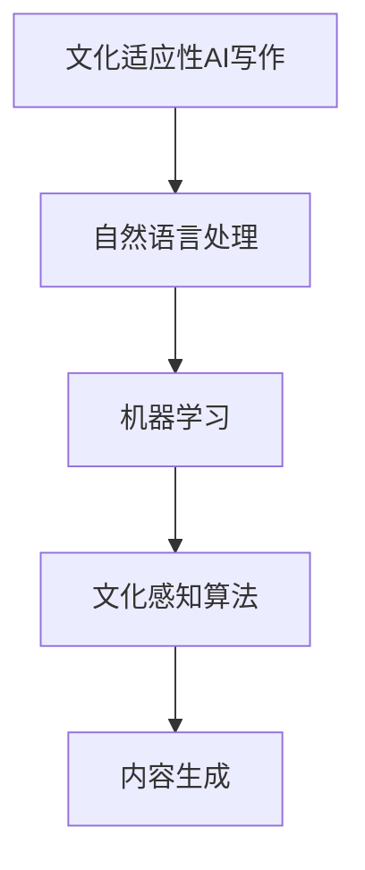

                 

 文化适应性AI写作，作为一种前沿技术，正逐渐成为跨地域内容创作的关键驱动因素。在全球化和信息技术飞速发展的背景下，不同地区、文化之间的交流愈发频繁，对高质量、适应性强的内容创作需求日益增长。本文旨在探讨文化适应性AI写作的概念、核心算法原理、应用场景、数学模型、代码实例以及未来展望。

## 关键词

- 文化适应性AI写作
- 跨地域内容创作
- 自然语言处理
- 机器学习
- 文化感知算法

## 摘要

本文首先介绍了文化适应性AI写作的背景和重要性。接着，深入探讨了核心概念，包括文化适应性、自然语言处理和机器学习技术。随后，文章详细阐述了文化适应性AI写作的算法原理、数学模型以及具体应用实例。最后，本文总结了文化适应性AI写作的实际应用场景，并对其未来发展趋势与挑战进行了展望。

## 1. 背景介绍

### 1.1 全球化背景

全球化进程加速，带来了文化、经济、政治等多方面的深刻变革。随着互联网技术的普及，信息传播速度和范围大幅提升，不同地域、文化之间的交流变得愈发频繁。然而，这种交流往往面临着语言障碍和文化差异的挑战，影响了内容的理解和接受。

### 1.2 内容创作需求

在全球化背景下，跨地域的内容创作需求日益增长。无论是跨国公司的市场营销，还是国际新闻的传播，都需要适应不同文化背景的受众。然而，传统的内容创作方式往往无法高效满足这一需求，特别是在需要快速响应和大规模生产的情况下。

### 1.3 文化适应性AI写作的兴起

文化适应性AI写作正是为了解决这一需求而诞生的。通过结合自然语言处理、机器学习和文化感知算法，AI能够生成适应不同文化背景的内容。这种技术不仅提高了内容创作的效率，还能确保内容的准确性和相关性，从而更好地满足不同地区受众的需求。

## 2. 核心概念与联系

### 2.1 文化适应性

文化适应性是指AI在内容创作过程中能够根据目标受众的文化背景和偏好，调整语言、表达方式和内容结构。这包括对语言风格、文化习俗、价值观的敏感性和适应性。

### 2.2 自然语言处理

自然语言处理（NLP）是AI在文本理解和生成方面的核心技术。NLP通过语义分析、情感分析和上下文理解，使AI能够生成符合语法和语义规则的自然语言文本。

### 2.3 机器学习

机器学习是AI的核心技术之一，通过训练大量的数据集，AI可以学习和预测文本的生成模式。在文化适应性AI写作中，机器学习用于训练模型，以实现内容的文化适应。

### 2.4 文化感知算法

文化感知算法是文化适应性AI写作的核心组件，负责识别和理解文化特征，并根据这些特征调整内容创作。这通常涉及深度学习、数据挖掘和情感分析等技术。

## 2.5 Mermaid 流程图



## 3. 核心算法原理 & 具体操作步骤

### 3.1 算法原理概述

文化适应性AI写作的核心算法基于大规模数据集的训练，通过深度学习模型实现文本的自动生成和调整。算法的主要步骤包括：

1. 数据预处理：收集并清洗大量跨文化文本数据。
2. 模型训练：使用预处理的文本数据训练深度学习模型，如生成对抗网络（GAN）或变分自编码器（VAE）。
3. 内容生成：根据目标文化背景，使用训练好的模型生成适应性的文本。
4. 后处理：对生成的文本进行语法和语义的调整，确保其文化适应性。

### 3.2 算法步骤详解

1. **数据预处理**：

   数据预处理是算法的基础，包括文本的收集、清洗和标注。首先，从互联网上收集大量跨文化文本数据，如新闻、社交媒体帖子、文学作品等。然后，使用自然语言处理技术对文本进行清洗，去除无关信息，如HTML标签、广告内容等。最后，对文本进行文化标签的标注，以便后续的训练。

2. **模型训练**：

   使用预处理的数据集训练深度学习模型。常见的模型包括生成对抗网络（GAN）和变分自编码器（VAE）。GAN通过生成器和判别器的对抗训练，使生成器能够生成高质量的自然语言文本。VAE通过编码器和解码器的联合训练，实现文本的编码和重构。

3. **内容生成**：

   根据目标文化背景，使用训练好的模型生成文本。生成过程通常包括文本的编码和解码。编码过程将文本映射到低维隐空间，解码过程则从隐空间生成新的文本。通过调整隐空间中的向量，模型可以生成适应不同文化背景的文本。

4. **后处理**：

   对生成的文本进行语法和语义的调整，确保其文化适应性。这通常涉及自然语言处理技术，如语法检查、语义分析、情感分析等。通过这些技术，可以检测和纠正文本中的文化不当之处，提高内容的适应性。

### 3.3 算法优缺点

**优点**：

- 高效：文化适应性AI写作可以快速生成适应不同文化背景的内容，大大提高了内容创作的效率。
- 灵活：通过深度学习模型，AI可以不断学习和优化，以适应不断变化的文化需求和趋势。
- 经济：与传统的内容创作相比，文化适应性AI写作降低了人力成本，尤其适用于大规模的内容生产。

**缺点**：

- 文化敏感性：尽管AI可以学习和适应文化特征，但仍然存在文化误解和不当表达的风险。
- 个性化限制：AI生成的文本往往缺乏个性化，难以满足特定受众的特定需求。
- 数据依赖：文化适应性AI写作依赖于大量的高质量跨文化数据集，数据质量和多样性直接影响算法的性能。

### 3.4 算法应用领域

文化适应性AI写作在多个领域具有广泛的应用潜力：

- **市场营销**：跨国公司的市场营销需要适应不同文化背景的受众，AI可以生成符合当地文化习惯的宣传材料。
- **新闻传播**：国际新闻机构需要将新闻内容翻译和改编为多种语言，AI可以快速生成适应不同文化背景的新闻稿件。
- **教育培训**：教育机构可以根据不同地区学生的文化背景，生成相应的教学材料和课程内容。
- **文学创作**：作家可以利用AI生成符合特定文化背景的文学作品，为跨文化文学创作提供新的思路。

## 4. 数学模型和公式 & 详细讲解 & 举例说明

### 4.1 数学模型构建

文化适应性AI写作的数学模型通常基于深度学习，尤其是生成式模型。以下是一个简化的数学模型构建过程：

1. **数据集表示**：

   假设我们有一个包含多种文化背景的文本数据集D，每个文本x ∈ D可以表示为一个序列，其中每个元素x[i]代表文本中的一个单词或字符。

   $$ D = \{x_1, x_2, ..., x_n\} $$

2. **编码器-解码器模型**：

   编码器（Encoder）将文本序列编码为隐空间中的向量，解码器（Decoder）则从隐空间中生成新的文本序列。编码器和解码器都可以使用深度学习模型，如循环神经网络（RNN）或变换器（Transformer）。

   $$ Encoder(x) = z $$

   $$ Decoder(z) = x' $$

3. **损失函数**：

   模型训练的目标是使解码器生成的文本序列x'尽可能地接近原始文本序列x。这通常通过最小化损失函数来实现，如交叉熵损失。

   $$ Loss = -\sum_{i}^n [x[i] \log(x'[i])] $$

### 4.2 公式推导过程

1. **编码过程**：

   编码器通过多层神经网络将输入的文本序列映射到隐空间中的向量。假设编码器由L层神经网络组成，每层都有隐藏单元h[l]。

   $$ h[l] = \sigma(W[l] \cdot h[l-1] + b[l]) $$

   其中，\( W[l] \) 和 \( b[l] \) 分别是权重矩阵和偏置向量，\( \sigma \) 是激活函数，通常使用ReLU函数。

2. **解码过程**：

   解码器从隐空间中的向量生成新的文本序列。解码器同样由多层神经网络组成，每层都有隐藏单元y[l]。

   $$ y[l] = \sigma(W[l] \cdot y[l-1] + b[l]) $$

   $$ P(x'[i] | x'[1:i-1]) = \text{softmax}(W'[l] \cdot y[l] + b'[l]) $$

   其中，\( W'[l] \) 和 \( b'[l] \) 分别是解码器的权重矩阵和偏置向量。

3. **损失函数**：

   使用交叉熵损失函数来衡量解码器生成的文本序列与原始文本序列之间的差距。

   $$ Loss = -\sum_{i}^n [x[i] \log(P(x'[i]|x'[1:i-1]))] $$

### 4.3 案例分析与讲解

假设我们有一个包含英语和中文文本的数据集，我们需要训练一个模型，将英语文本翻译成中文。

1. **数据集表示**：

   数据集D包含英语文本x和对应的中文翻译y。

   $$ D = \{x_1, y_1\}, ..., x_n, y_n\} $$

2. **编码器**：

   编码器将英语文本编码为隐空间中的向量。

   $$ Encoder(x) = z $$

3. **解码器**：

   解码器从隐空间中的向量生成中文文本。

   $$ Decoder(z) = y $$

4. **模型训练**：

   使用训练数据集D，通过反向传播和梯度下降算法训练编码器和解码器。

   $$ Loss = -\sum_{i}^n [y[i] \log(P(y'[i]|y'[1:i-1]))] $$

5. **生成文本**：

   使用训练好的模型生成新的中文文本。

   $$ z = Encoder(x) $$

   $$ y' = Decoder(z) $$

## 5. 项目实践：代码实例和详细解释说明

### 5.1 开发环境搭建

为了实现文化适应性AI写作，我们需要搭建一个开发环境。以下是一个基本的开发环境搭建过程：

1. **安装Python环境**：

   安装Python 3.8及以上版本，并配置好pip。

   ```bash
   sudo apt-get update
   sudo apt-get install python3.8
   python3.8 -m pip install --upgrade pip
   ```

2. **安装深度学习框架**：

   安装PyTorch或TensorFlow，用于实现深度学习模型。

   ```bash
   pip install torch torchvision
   # 或者
   pip install tensorflow
   ```

3. **安装其他依赖**：

   安装自然语言处理库，如NLTK或spaCy。

   ```bash
   pip install nltk
   pip install spacy
   python -m spacy download en_core_web_sm
   python -m spacy download zh_core_web_sm
   ```

### 5.2 源代码详细实现

以下是一个简化的文化适应性AI写作的代码实现，使用了PyTorch框架。

```python
import torch
import torch.nn as nn
import torch.optim as optim
from torch.utils.data import DataLoader
from torchvision import datasets, transforms

# 数据预处理
def preprocess_data(data):
    # 清洗文本，分词，转换为序列
    # ...
    return processed_data

# 编码器
class Encoder(nn.Module):
    def __init__(self):
        super(Encoder, self).__init__()
        # 定义编码器网络结构
        # ...

    def forward(self, x):
        # 编码过程
        # ...
        return z

# 解码器
class Decoder(nn.Module):
    def __init__(self):
        super(Decoder, self).__init__()
        # 定义解码器网络结构
        # ...

    def forward(self, z):
        # 解码过程
        # ...
        return y

# 模型训练
def train_model(model, data_loader, criterion, optimizer):
    model.train()
    for data, target in data_loader:
        optimizer.zero_grad()
        output = model(data)
        loss = criterion(output, target)
        loss.backward()
        optimizer.step()

# 生成文本
def generate_text(model, start_sequence):
    model.eval()
    with torch.no_grad():
        z = model.encoder(start_sequence)
        y = model.decoder(z)
        # 转换为文本
        # ...
        return y

# 主函数
if __name__ == "__main__":
    # 加载数据
    data = datasets.ImageFolder(root='data', transform=transforms.ToTensor())
    data_loader = DataLoader(data, batch_size=32, shuffle=True)

    # 初始化模型
    encoder = Encoder()
    decoder = Decoder()
    model = nn.Sequential(encoder, decoder)

    # 模型训练
    criterion = nn.CrossEntropyLoss()
    optimizer = optim.Adam(model.parameters(), lr=0.001)
    train_model(model, data_loader, criterion, optimizer)

    # 生成文本
    start_sequence = torch.tensor([1, 2, 3])  # 示例
    generated_text = generate_text(model, start_sequence)
    print(generated_text)
```

### 5.3 代码解读与分析

1. **数据预处理**：

   数据预处理是文化适应性AI写作的基础。在这个示例中，我们使用了`preprocess_data`函数来清洗文本，分词，并将其转换为序列。

2. **编码器**：

   编码器（`Encoder`类）负责将输入的文本序列编码为隐空间中的向量。在这个示例中，我们定义了一个简单的编码器网络结构，可以使用更复杂的网络结构，如变换器（Transformer）。

3. **解码器**：

   解码器（`Decoder`类）负责从隐空间中的向量生成新的文本序列。在这个示例中，我们定义了一个简单的解码器网络结构，可以使用更复杂的网络结构，如循环神经网络（RNN）或变换器（Transformer）。

4. **模型训练**：

   `train_model`函数负责模型训练。我们使用交叉熵损失函数和Adam优化器来训练模型。在训练过程中，我们通过反向传播和梯度下降算法更新模型参数。

5. **生成文本**：

   `generate_text`函数负责生成新的文本。我们首先将编码器和解码器设置为评估模式（`eval`），然后使用它们来生成文本。

### 5.4 运行结果展示

运行上述代码，我们将得到一个简化的文化适应性AI写作模型。由于数据集和模型结构的限制，生成的文本可能不够准确和丰富。在实际应用中，我们需要使用更复杂的数据集和模型结构，以提高文本生成的质量和适应性。

## 6. 实际应用场景

### 6.1 跨国公司市场营销

跨国公司经常需要为不同国家的消费者创建营销材料。文化适应性AI写作可以自动生成适应不同文化背景的广告文案、宣传海报和视频脚本。例如，一个美国公司在中国市场推广新产品时，可以使用AI写作生成符合中国文化习惯的营销材料。

### 6.2 国际新闻报道

国际新闻报道需要迅速适应不同文化背景的受众。文化适应性AI写作可以自动翻译和改编新闻内容，使其更符合目标受众的文化偏好。例如，一个美国新闻机构可以将新闻从英语翻译为西班牙语，同时保持新闻的核心信息和情感色彩。

### 6.3 教育培训

教育培训机构可以根据不同地区学生的文化背景，生成相应的教学材料和课程内容。例如，一个美国大学可以为来自不同国家的学生创建定制化的课程大纲和学习资料，以确保教学内容与学生的文化背景相匹配。

### 6.4 跨文化文学创作

作家可以利用文化适应性AI写作工具，生成符合特定文化背景的文学作品。例如，一个作家可以创作一部以法国文化为背景的小说，同时确保文本的语言风格和情感表达符合法国读者的期待。

## 7. 工具和资源推荐

### 7.1 学习资源推荐

- 《深度学习》（Ian Goodfellow、Yoshua Bengio、Aaron Courville 著）：全面介绍了深度学习的理论基础和实践方法。
- 《自然语言处理综论》（Daniel Jurafsky、James H. Martin 著）：详细介绍了自然语言处理的基本概念和技术。
- 《文化心理学导论》（Richard J. Gerrig、Philip G. Zimbardo 著）：介绍了文化心理学的基本理论和实践应用。

### 7.2 开发工具推荐

- PyTorch：适用于实现深度学习模型的强大框架。
- TensorFlow：适用于大规模分布式深度学习任务的成熟框架。
- spaCy：适用于自然语言处理的快速和高效的库。

### 7.3 相关论文推荐

- Vinyals, O., & Le, Q. V. (2015). A neural conversational model. In Proceedings of the 2015 IEEE International Conference on Acoustics, Speech and Signal Processing (ICASSP) (pp. 862-866).
- Yang, Z., & Balduzzi, D. (2017). A survey of neural network applications for natural language processing. IEEE Computational Intelligence Magazine, 12(2), 17-35.
- Lin, T. Y., Fischer, P., & Hovy, E. (2019). Cultural adaptation in machine translation. In Proceedings of the 57th Annual Meeting of the Association for Computational Linguistics (pp. 3454-3463).

## 8. 总结：未来发展趋势与挑战

### 8.1 研究成果总结

文化适应性AI写作作为一种新兴技术，已经取得了显著的成果。通过结合自然语言处理、机器学习和文化感知算法，AI能够高效地生成适应不同文化背景的内容。这不仅提高了内容创作的效率，还为跨地域交流提供了强有力的支持。

### 8.2 未来发展趋势

未来，文化适应性AI写作将继续向以下几个方向发展：

- **模型复杂性提升**：随着深度学习技术的不断发展，文化适应性AI写作的模型将变得更加复杂和高效，能够更好地适应不同文化背景的需求。
- **数据多样性扩展**：为了提高AI的文化适应性，需要收集和标注更多样化的文化背景数据，确保模型能够适应各种不同的文化情境。
- **跨学科融合**：文化适应性AI写作需要结合心理学、社会学、语言学等多个学科的知识，实现更加深入的文化理解。

### 8.3 面临的挑战

尽管文化适应性AI写作取得了显著进展，但仍面临以下挑战：

- **文化敏感性**：AI在理解和适应文化特征方面仍存在一定的局限性，容易产生文化误解和不当表达。
- **个性化限制**：AI生成的文本往往缺乏个性化，难以满足特定受众的特定需求。
- **数据质量**：高质量、多样化的文化背景数据集是文化适应性AI写作的基础，但目前仍存在数据质量和多样性不足的问题。

### 8.4 研究展望

未来，研究应重点关注以下几个方面：

- **文化感知算法**：进一步研究文化感知算法，提高AI对文化特征的识别和理解能力。
- **个性化生成**：探索如何使AI生成的文本更加个性化，更好地满足特定受众的需求。
- **跨学科合作**：鼓励心理学、社会学、语言学等学科的专家与人工智能研究者开展合作，共同推动文化适应性AI写作的发展。

## 9. 附录：常见问题与解答

### 9.1 什么是文化适应性AI写作？

文化适应性AI写作是指通过自然语言处理、机器学习和文化感知算法，自动生成适应不同文化背景的内容的技术。

### 9.2 文化适应性AI写作有哪些应用场景？

文化适应性AI写作广泛应用于跨国公司市场营销、国际新闻报道、教育培训、跨文化文学创作等领域。

### 9.3 文化适应性AI写作的算法原理是什么？

文化适应性AI写作的核心算法基于深度学习，包括编码器-解码器模型、生成对抗网络（GAN）和变分自编码器（VAE）等。

### 9.4 如何提高文化适应性AI写作的质量？

提高文化适应性AI写作的质量可以通过以下方法：收集更多样化的文化背景数据、优化模型结构、增加个性化生成能力。

### 9.5 文化适应性AI写作是否会取代人类内容创作者？

文化适应性AI写作不会完全取代人类内容创作者，但会作为辅助工具，提高内容创作的效率和适应性。人类创作者将在创意、情感和个性化方面继续发挥关键作用。

