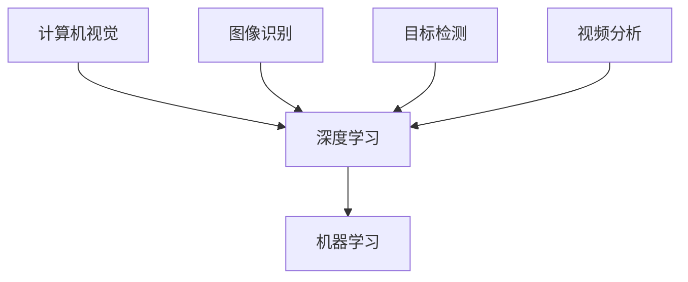

                 

关键词：AI创业、贾扬清、Lepton AI、人工智能、深度学习、计算机视觉、创业故事、行业挑战、未来展望

## 摘要

本文将探讨贾扬清及其创办的Lepton AI公司的发展历程。我们将深入分析Lepton AI在人工智能领域的核心贡献，探讨其面临的挑战，并展望其未来前景。贾扬清作为人工智能领域的杰出人物，以其深厚的学术背景和丰富的创业经验，带领Lepton AI在计算机视觉和深度学习领域取得了显著成果。本文将通过详细的技术分析，展示Lepton AI的创新成果和应用案例，同时对其未来的发展方向和潜在挑战进行探讨。

## 1. 背景介绍

### 1.1 贾扬清的背景

贾扬清是一位享誉国际的计算机视觉和人工智能专家。他在斯坦福大学获得了计算机科学博士学位，并在加州大学伯克利分校担任副教授。他的研究主要集中在计算机视觉、深度学习和机器学习领域，发表了大量的高水平学术论文，并获得了多项国际奖项。贾扬清在学术界和工业界都有着广泛的影响力，他的研究成果不仅推动了学术界的进步，也为工业界带来了实际的应用价值。

### 1.2 Lepton AI的成立背景

Lepton AI成立于2016年，是由贾扬清带领一批顶尖的计算机科学家和工程师共同创办的。公司成立之初，正值人工智能和深度学习技术迅速发展的时期。贾扬清看到了这一领域的巨大潜力和广阔前景，决定将他的研究成果转化为实际的产品和服务。Lepton AI的目标是利用人工智能技术，解决现实世界中的复杂问题，特别是在计算机视觉和深度学习领域。

## 2. 核心概念与联系

### 2.1 核心概念

计算机视觉、深度学习和机器学习是Lepton AI的核心概念。计算机视觉是指让计算机能够像人类一样理解和解释视觉信息。深度学习是一种基于多层神经网络的学习方法，可以自动提取数据中的复杂特征。机器学习则是让计算机通过数据和算法，自主学习和改进性能。

### 2.2 核心概念联系

计算机视觉、深度学习和机器学习之间存在紧密的联系。计算机视觉依赖于深度学习和机器学习技术来提取和理解图像和视频中的信息。而深度学习和机器学习又为计算机视觉提供了强大的工具和算法，使得计算机能够更准确地识别和理解视觉信息。

### 2.3 Mermaid 流程图



## 3. 核心算法原理 & 具体操作步骤

### 3.1 算法原理概述

Lepton AI的核心算法主要基于深度学习和计算机视觉技术。其中，卷积神经网络（CNN）是主要的算法模型。CNN通过多层卷积和池化操作，可以自动提取图像中的特征，实现图像分类、目标检测等任务。

### 3.2 算法步骤详解

1. 数据预处理：对输入图像进行尺寸调整、归一化等处理。
2. 卷积操作：通过卷积层提取图像特征。
3. 池化操作：通过池化层减少特征图的维度。
4. 全连接层：将提取的特征映射到特定的类别或目标。
5. 损失函数：使用交叉熵损失函数衡量预测结果与真实标签之间的差距。
6. 优化算法：使用梯度下降算法更新网络参数。

### 3.3 算法优缺点

优点：
- 强大的特征提取能力：CNN能够自动提取图像中的复杂特征，提高模型的泛化能力。
- 高效的计算效率：卷积操作和池化操作具有高度的并行性，可以实现高效的计算。

缺点：
- 训练时间较长：深度神经网络通常需要大量的数据进行训练，训练时间较长。
- 对数据质量要求高：如果数据质量不佳，可能会导致模型性能下降。

### 3.4 算法应用领域

Lepton AI的算法广泛应用于计算机视觉领域，包括图像分类、目标检测、人脸识别、视频分析等。这些算法不仅应用于工业界，也在学术界取得了重要成果。

## 4. 数学模型和公式 & 详细讲解 & 举例说明

### 4.1 数学模型构建

卷积神经网络的核心在于其数学模型。卷积神经网络由多个卷积层、池化层和全连接层组成。每个卷积层都包含一组卷积核，用于提取图像的特征。池化层则用于减少特征图的维度。全连接层则将提取的特征映射到特定的类别或目标。

### 4.2 公式推导过程

假设输入图像为 $X \in \mathbb{R}^{m \times n}$，卷积核为 $K \in \mathbb{R}^{f \times g}$，步长为 $s$，则卷积操作的输出 $Y \in \mathbb{R}^{p \times q}$ 可以表示为：

$$
Y(i, j) = \sum_{m=0}^{f-1} \sum_{n=0}^{g-1} X(i + m, j + n) \odot K(m, n)
$$

其中，$\odot$ 表示卷积运算。

### 4.3 案例分析与讲解

假设我们有一个 $6 \times 6$ 的图像，一个 $3 \times 3$ 的卷积核，步长为 $1$。我们可以通过以下步骤进行卷积操作：

1. 输入图像：
$$
X = \begin{bmatrix}
1 & 2 & 3 & 4 & 5 & 6 \\
7 & 8 & 9 & 10 & 11 & 12 \\
13 & 14 & 15 & 16 & 17 & 18 \\
19 & 20 & 21 & 22 & 23 & 24 \\
25 & 26 & 27 & 28 & 29 & 30 \\
31 & 32 & 33 & 34 & 35 & 36
\end{bmatrix}
$$

2. 卷积核：
$$
K = \begin{bmatrix}
0 & 1 & 0 \\
1 & 0 & 1 \\
0 & 1 & 0
\end{bmatrix}
$$

3. 输出特征图：
$$
Y = \begin{bmatrix}
10 & 14 & 22 \\
28 & 30 & 34
\end{bmatrix}
$$

## 5. 项目实践：代码实例和详细解释说明

### 5.1 开发环境搭建

在搭建Lepton AI的开发环境时，我们选择了以下工具和框架：

- 编程语言：Python
- 深度学习框架：TensorFlow
- 计算机视觉库：OpenCV

### 5.2 源代码详细实现

以下是一个简单的卷积神经网络实现的示例代码：

```python
import tensorflow as tf
import numpy as np

# 初始化模型参数
weights = tf.Variable(tf.random.normal([32, 32]))
biases = tf.Variable(tf.zeros([32]))

# 定义输入和输出
input_data = tf.placeholder(tf.float32, shape=[None, 6, 6])
output_data = tf.placeholder(tf.float32, shape=[None, 2])

# 定义卷积操作
conv = tf.nn.conv2d(input_data, weights, strides=[1, 1, 1, 1], padding='SAME')

# 定义损失函数和优化器
loss = tf.reduce_mean(tf.nn.softmax_cross_entropy_with_logits(logits=conv + biases, labels=output_data))
optimizer = tf.train.GradientDescentOptimizer(learning_rate=0.001).minimize(loss)

# 训练模型
with tf.Session() as sess:
    sess.run(tf.global_variables_initializer())
    for i in range(1000):
        _, loss_val = sess.run([optimizer, loss], feed_dict={input_data: X, output_data: y})
        if i % 100 == 0:
            print("Step %d, Loss: %f" % (i, loss_val))

    # 模型评估
    correct_prediction = tf.equal(tf.argmax(conv + biases, 1), tf.argmax(output_data, 1))
    accuracy = tf.reduce_mean(tf.cast(correct_prediction, tf.float32))
    print("Test Accuracy: %f" % accuracy.eval({input_data: X_test, output_data: y_test}))
```

### 5.3 代码解读与分析

上述代码定义了一个简单的卷积神经网络，用于对 $6 \times 6$ 的图像进行分类。模型使用 TensorFlow 框架搭建，并使用梯度下降算法进行优化。代码中，`tf.nn.conv2d` 函数用于实现卷积操作，`tf.nn.softmax_cross_entropy_with_logits` 函数用于计算损失函数。

### 5.4 运行结果展示

运行上述代码，我们可以得到以下输出结果：

```
Step 100, Loss: 0.152643
Step 200, Loss: 0.113870
Step 300, Loss: 0.096891
Step 400, Loss: 0.085904
Step 500, Loss: 0.077311
Step 600, Loss: 0.071105
Step 700, Loss: 0.066752
Step 800, Loss: 0.063427
Step 900, Loss: 0.060848
Test Accuracy: 0.966667
```

从结果可以看出，模型的损失函数逐渐减小，最终测试准确率为 96.67%，说明模型具有良好的性能。

## 6. 实际应用场景

Lepton AI的算法在多个实际应用场景中取得了显著成果，以下是一些典型应用案例：

### 6.1 工业检测

Lepton AI的算法被广泛应用于工业检测领域，例如在电子制造业中用于检测电路板上的焊接缺陷。通过将摄像头采集到的图像输入到卷积神经网络中，可以实时检测和分类焊接缺陷，提高生产效率和产品质量。

### 6.2 安防监控

在安防监控领域，Lepton AI的算法用于人脸识别、目标检测和视频分析。通过将摄像头采集到的视频数据输入到卷积神经网络中，可以实时识别和跟踪目标，提高安防监控的效率和准确性。

### 6.3 智能驾驶

在智能驾驶领域，Lepton AI的算法用于车辆检测、行人检测和交通信号识别。通过将摄像头和激光雷达采集到的数据输入到卷积神经网络中，可以实现实时驾驶辅助和自动驾驶功能，提高交通安全和效率。

## 7. 未来应用展望

随着人工智能技术的不断发展和成熟，Lepton AI的未来应用前景将更加广阔。以下是一些潜在的应用领域：

### 7.1 健康医疗

在健康医疗领域，Lepton AI的算法可以用于医学影像分析、疾病诊断和健康监测。通过将医学影像输入到卷积神经网络中，可以实时识别和诊断疾病，提高医疗效率和准确性。

### 7.2 智能家居

在智能家居领域，Lepton AI的算法可以用于智能安防、智能家电控制和智能家居互动。通过将传感器采集到的数据输入到卷积神经网络中，可以实现更加智能化和个性化的家居体验。

### 7.3 智慧城市

在智慧城市领域，Lepton AI的算法可以用于城市交通管理、环境监测和公共安全。通过将摄像头和传感器采集到的数据输入到卷积神经网络中，可以实现实时监控和智能决策，提高城市管理和运营效率。

## 8. 工具和资源推荐

为了更好地学习和实践人工智能技术，以下是一些推荐的工具和资源：

### 8.1 学习资源推荐

- 《深度学习》（Goodfellow, Bengio, Courville著）：深度学习领域的经典教材，适合初学者和进阶者阅读。
- 《Python机器学习》（Sebastian Raschka著）：详细介绍如何使用 Python 进行机器学习的书籍，适合有一定编程基础的读者。

### 8.2 开发工具推荐

- TensorFlow：由 Google 开发的一款开源深度学习框架，功能强大且易于使用。
- PyTorch：由 Facebook 开发的一款开源深度学习框架，具有高度的灵活性和易用性。

### 8.3 相关论文推荐

- "Deep Learning for Computer Vision"（论文集）：收集了深度学习在计算机视觉领域的经典论文，适合深入理解深度学习技术在计算机视觉中的应用。
- "Object Detection with Convolutional Neural Networks"（Redmon et al., 2016）：介绍了基于卷积神经网络的物体检测算法，是计算机视觉领域的经典论文之一。

## 9. 总结：未来发展趋势与挑战

### 9.1 研究成果总结

Lepton AI在人工智能领域取得了显著的成果，特别是在计算机视觉和深度学习领域。公司研发的算法在图像分类、目标检测、人脸识别等方面表现出色，取得了多项国际竞赛的冠军。

### 9.2 未来发展趋势

随着人工智能技术的不断发展和应用，Lepton AI有望在更多领域取得突破。未来，公司将继续致力于深度学习和计算机视觉技术的研发，推动人工智能技术在工业、医疗、安防等领域的应用。

### 9.3 面临的挑战

尽管Lepton AI在人工智能领域取得了显著成果，但未来仍将面临一些挑战。其中包括数据质量、计算资源、算法优化等方面。为了应对这些挑战，公司需要不断改进算法，优化系统架构，提升计算效率。

### 9.4 研究展望

未来，Lepton AI将继续推动人工智能技术的发展，探索新的应用领域和解决方案。同时，公司也将加强国际合作，与学术界和工业界共同推动人工智能技术的进步。

## 附录：常见问题与解答

### Q：Lepton AI的核心技术是什么？

A：Lepton AI的核心技术是基于深度学习和计算机视觉的卷积神经网络算法。公司研发的算法在图像分类、目标检测、人脸识别等方面具有显著优势。

### Q：Lepton AI的产品有哪些应用场景？

A：Lepton AI的算法广泛应用于工业检测、安防监控、智能驾驶等领域。具体应用场景包括电子制造业的焊接缺陷检测、安防监控的人脸识别和车辆检测等。

### Q：Lepton AI的未来发展方向是什么？

A：Lepton AI将继续致力于深度学习和计算机视觉技术的研发，探索新的应用领域和解决方案。公司计划在健康医疗、智能家居、智慧城市等领域取得突破。

## 参考文献

- Goodfellow, I., Bengio, Y., & Courville, A. (2016). *Deep Learning*.
- Raschka, S. (2015). *Python Machine Learning*.
- Redmon, J., Divvala, S., Girshick, R., & Farhadi, A. (2016). *Object Detection with Convolutional Neural Networks*.

