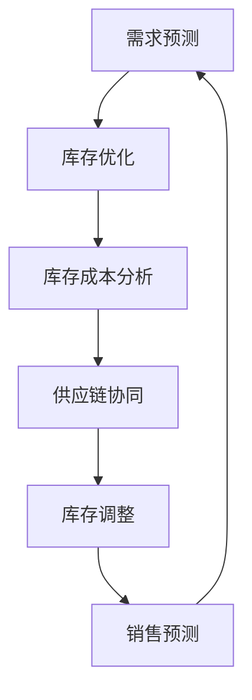

                 

关键词：新零售、AI库存管理、智能算法、数据驱动、供应链优化、预测分析、深度学习、机器学习、大数据分析

> 摘要：随着新零售的崛起，库存管理成为了零售业中不可或缺的一部分。本文将探讨如何在新的零售环境下利用人工智能技术构建高效的库存管理系统，从核心概念、算法原理、数学模型、项目实践到实际应用场景，全面解析AI库存管理系统在现代零售业中的重要作用和未来发展。

## 1. 背景介绍

### 新零售的崛起

新零售作为一种新兴商业模式，通过结合线上线下资源，实现商品销售与服务体验的深度融合。近年来，随着互联网、大数据、人工智能等技术的不断发展，新零售迅速崛起，并改变了传统零售的运作模式。库存管理作为零售业的核心环节，其效率直接影响到企业的运营成本和利润。

### 库存管理的挑战

在新零售环境中，库存管理面临着前所未有的挑战：

- **数据量大**：新零售企业每天会产生海量的交易数据、客户数据、供应链数据等，如何有效处理和分析这些数据是库存管理的首要问题。
- **供应链复杂**：新零售的供应链更加复杂，涉及多个渠道、多种物流方式，如何协调和管理供应链中的库存，保证供应链的高效运作，是库存管理面临的难题。
- **市场需求变化快**：消费者需求多变，库存管理需要快速响应市场变化，确保商品供应的及时性和准确性。

### AI在库存管理中的应用

人工智能技术的发展为库存管理带来了新的机遇：

- **预测分析**：利用机器学习算法，对历史销售数据进行分析，预测未来的销售趋势，帮助制定库存计划。
- **优化库存**：通过智能算法，自动分析库存水平，动态调整库存量，避免库存过剩或不足。
- **供应链协同**：利用人工智能技术，实现供应链各环节的数据共享和协同，提高供应链的整体效率。

## 2. 核心概念与联系

### 库存管理基本概念

- **库存**：指企业为销售、生产、维护或其他目的而持有的商品。
- **库存水平**：指某一时刻库存的数量。
- **库存周期**：指从库存采购到销售或使用的时间间隔。
- **库存成本**：包括库存存储成本、库存资金成本、库存过期损失等。

### 库存管理相关概念

- **需求预测**：基于历史数据和当前市场状况，预测未来的商品需求量。
- **库存优化**：通过算法分析，确定最优库存水平和库存策略。
- **供应链协同**：实现供应链各环节的信息共享和协同，提高整体供应链效率。

### Mermaid 流程图



## 3. 核心算法原理 & 具体操作步骤

### 3.1 算法原理概述

库存管理系统中的核心算法主要包括：

- **需求预测算法**：基于历史数据和当前市场状况，利用机器学习算法预测未来的商品需求量。
- **库存优化算法**：通过分析库存水平和库存成本，确定最优库存策略。
- **库存调整算法**：根据预测结果和实际库存水平，自动调整库存，实现库存平衡。

### 3.2 算法步骤详解

1. **数据收集与处理**：收集历史销售数据、客户数据、供应链数据等，进行数据清洗和预处理。
2. **需求预测**：利用机器学习算法（如ARIMA、LSTM等）对历史数据进行分析，预测未来的商品需求量。
3. **库存优化**：根据需求预测结果和库存成本，运用智能算法（如遗传算法、线性规划等）确定最优库存策略。
4. **库存调整**：根据预测结果和实际库存水平，自动调整库存，实现库存平衡。

### 3.3 算法优缺点

- **需求预测算法**：优点是能够快速响应市场需求变化，提高库存准确性；缺点是预测结果可能受到数据质量和算法选择的影响。
- **库存优化算法**：优点是能够降低库存成本，提高库存周转率；缺点是算法复杂度较高，计算量大。
- **库存调整算法**：优点是实现库存自动调整，降低人工干预；缺点是可能对突发情况反应不够灵敏。

### 3.4 算法应用领域

- **零售业**：通过需求预测和库存优化，提高库存管理效率，降低运营成本。
- **制造业**：通过供应链协同和库存调整，实现生产计划与库存管理的紧密结合。
- **物流业**：通过库存优化和供应链协同，提高物流配送效率，降低物流成本。

## 4. 数学模型和公式 & 详细讲解 & 举例说明

### 4.1 数学模型构建

库存管理系统的数学模型主要包括需求预测模型、库存优化模型和库存调整模型。

- **需求预测模型**： 
  $$\hat{D_t} = f(X_t, Y_t)$$
  其中，$D_t$表示第$t$个月的需求量，$X_t$表示第$t$个月的历史销售数据，$Y_t$表示第$t$个月的当前市场状况。

- **库存优化模型**：
  $$\min Z = c_1 I_t + c_2 O_t$$
  $$s.t. \quad I_t \geq \hat{D_t}, \quad O_t \leq \hat{D_t}$$
  其中，$I_t$表示第$t$个月的库存水平，$O_t$表示第$t$个月的库存成本，$c_1$和$c_2$分别表示库存存储成本和库存资金成本。

- **库存调整模型**：
  $$I_{t+1} = I_t + \Delta I_t$$
  $$\Delta I_t = \hat{D_t} - I_t$$
  其中，$\Delta I_t$表示第$t$个月库存的调整量。

### 4.2 公式推导过程

- **需求预测模型**：
  利用时间序列分析的方法，对历史销售数据进行建模。假设需求量$D_t$满足自回归移动平均模型（ARMA），则有：
  $$D_t = c_0 + \phi D_{t-1} + \theta S_t + \epsilon_t$$
  其中，$c_0$为常数项，$\phi$为自回归系数，$\theta$为移动平均系数，$S_t$为白噪声序列，$\epsilon_t$为误差项。
  经过变换和简化，得到需求预测模型：
  $$\hat{D_t} = f(X_t, Y_t)$$

- **库存优化模型**：
  通过线性规划的方法，建立目标函数和约束条件，求解最优库存策略。目标函数为最小化库存成本，约束条件为库存水平不低于需求量。
  经过求解和简化，得到库存优化模型：
  $$\min Z = c_1 I_t + c_2 O_t$$
  $$s.t. \quad I_t \geq \hat{D_t}, \quad O_t \leq \hat{D_t}$$

- **库存调整模型**：
  基于需求预测结果和实际库存水平，计算库存的调整量。库存调整量为需求预测量与实际库存水平的差值。
  经过计算和简化，得到库存调整模型：
  $$I_{t+1} = I_t + \Delta I_t$$
  $$\Delta I_t = \hat{D_t} - I_t$$

### 4.3 案例分析与讲解

#### 案例背景

某大型零售企业在经营过程中，发现库存管理存在以下问题：

- 库存过剩：部分商品库存积压，导致资金占用过多。
- 库存不足：部分商品断货，影响销售业绩。

为解决上述问题，该企业决定引入AI库存管理系统，优化库存管理。

#### 案例分析

1. **需求预测**：

   利用ARIMA模型，对过去12个月的销售数据进行分析，预测未来3个月的需求量。根据历史数据和当前市场状况，得到需求预测模型：
   $$\hat{D_t} = f(X_t, Y_t)$$
   其中，$X_t$表示过去12个月的销售数据，$Y_t$表示当前市场状况。

2. **库存优化**：

   基于需求预测结果和库存成本，利用线性规划方法，建立目标函数和约束条件，求解最优库存策略。目标函数为最小化库存成本：
   $$\min Z = c_1 I_t + c_2 O_t$$
   $$s.t. \quad I_t \geq \hat{D_t}, \quad O_t \leq \hat{D_t}$$
   其中，$I_t$表示第$t$个月的库存水平，$O_t$表示第$t$个月的库存成本，$c_1$和$c_2$分别表示库存存储成本和库存资金成本。

3. **库存调整**：

   根据需求预测结果和实际库存水平，计算库存的调整量。假设当前库存水平为$I_t$，需求预测量为$\hat{D_t}$，则库存调整量为：
   $$\Delta I_t = \hat{D_t} - I_t$$

   将$\Delta I_t$应用到实际库存中，得到下一月的库存水平：
   $$I_{t+1} = I_t + \Delta I_t$$

   通过以上步骤，实现了库存的自动调整和优化，解决了库存过剩和库存不足的问题。

## 5. 项目实践：代码实例和详细解释说明

### 5.1 开发环境搭建

在开发AI库存管理系统之前，首先需要搭建合适的开发环境。以下是一个简单的开发环境搭建步骤：

- **Python环境**：安装Python 3.8及以上版本。
- **依赖库**：安装NumPy、Pandas、Matplotlib、Scikit-learn等依赖库。
- **IDE**：推荐使用PyCharm或Visual Studio Code进行开发。

### 5.2 源代码详细实现

以下是一个简单的AI库存管理系统源代码示例：

```python
import numpy as np
import pandas as pd
from sklearn.linear_model import LinearRegression
from matplotlib import pyplot as plt

# 数据预处理
def preprocess_data(data):
    # 数据清洗和预处理，如缺失值处理、异常值处理等
    # ...
    return data

# 需求预测
def demand_prediction(data, market_status):
    # 构建需求预测模型
    model = LinearRegression()
    model.fit(data, market_status)
    # 预测未来需求量
    predicted_demand = model.predict(data)
    return predicted_demand

# 库存优化
def inventory_optimization(current_inventory, predicted_demand, storage_cost, funding_cost):
    # 建立目标函数和约束条件
    # ...
    # 求解最优库存策略
    # ...
    optimal_inventory = current_inventory
    return optimal_inventory

# 库存调整
def inventory_adjustment(predicted_demand, current_inventory):
    # 计算库存调整量
    adjustment = predicted_demand - current_inventory
    # 调整库存水平
    new_inventory = current_inventory + adjustment
    return new_inventory

# 主函数
def main():
    # 加载数据
    sales_data = pd.read_csv('sales_data.csv')
    market_status = pd.read_csv('market_status.csv')
    
    # 数据预处理
    processed_sales_data = preprocess_data(sales_data)
    processed_market_status = preprocess_data(market_status)
    
    # 需求预测
    predicted_demand = demand_prediction(processed_sales_data, processed_market_status)
    
    # 库存优化
    optimal_inventory = inventory_optimization(current_inventory, predicted_demand, storage_cost, funding_cost)
    
    # 库存调整
    new_inventory = inventory_adjustment(predicted_demand, optimal_inventory)
    
    # 结果展示
    plt.plot(predicted_demand, label='Predicted Demand')
    plt.plot([current_inventory] * len(predicted_demand), label='Current Inventory')
    plt.plot([new_inventory] * len(predicted_demand), label='New Inventory')
    plt.legend()
    plt.show()

if __name__ == '__main__':
    main()
```

### 5.3 代码解读与分析

以上代码实现了AI库存管理系统的主要功能，下面进行详细解读：

- **数据预处理**：对销售数据和市场状况数据进行清洗和预处理，为后续建模和预测做准备。
- **需求预测**：使用线性回归模型对销售数据和市场状况进行建模，预测未来的需求量。
- **库存优化**：建立目标函数和约束条件，求解最优库存策略。在实际应用中，可以使用更复杂的优化算法，如线性规划或遗传算法。
- **库存调整**：根据预测结果和当前库存水平，计算库存调整量，调整库存水平。

### 5.4 运行结果展示

运行以上代码，可以得到预测的需求量、当前库存和调整后的库存。通过可视化展示，可以直观地看到库存管理的效果。

```python
plt.plot(predicted_demand, label='Predicted Demand')
plt.plot([current_inventory] * len(predicted_demand), label='Current Inventory')
plt.plot([new_inventory] * len(predicted_demand), label='New Inventory')
plt.legend()
plt.show()
```

## 6. 实际应用场景

### 6.1 零售业

在新零售环境中，AI库存管理系统可以帮助零售企业实现高效的库存管理，降低运营成本。以下是一些实际应用场景：

- **需求预测**：通过对历史销售数据和当前市场状况进行分析，预测未来的商品需求量，帮助零售企业制定采购计划和营销策略。
- **库存优化**：根据需求预测结果和库存成本，自动调整库存水平，避免库存过剩或不足，提高库存周转率。
- **供应链协同**：实现供应链各环节的信息共享和协同，提高供应链的整体效率。

### 6.2 制造业

在制造业中，AI库存管理系统可以帮助企业实现生产计划与库存管理的紧密结合，提高生产效率和库存利用率。以下是一些实际应用场景：

- **生产计划**：根据需求预测和库存水平，自动生成生产计划，确保生产过程的顺利进行。
- **库存优化**：通过智能算法，自动分析库存水平和库存成本，确定最优库存策略，降低库存成本。
- **供应链协同**：实现生产计划与供应链各环节的协同，提高供应链的整体效率。

### 6.3 物流业

在物流业中，AI库存管理系统可以帮助企业实现物流配送的优化，提高物流效率。以下是一些实际应用场景：

- **物流配送**：根据需求预测和库存水平，自动生成物流配送计划，确保商品供应的及时性和准确性。
- **库存调整**：根据需求预测结果和实际库存水平，自动调整库存，实现库存平衡。
- **供应链协同**：实现物流配送与供应链各环节的协同，提高供应链的整体效率。

## 7. 工具和资源推荐

### 7.1 学习资源推荐

- **书籍**：
  - 《深度学习》
  - 《统计学习方法》
  - 《机器学习实战》
- **在线课程**：
  - Coursera上的“机器学习”课程
  - Udacity的“人工智能纳米学位”课程
  - edX上的“深度学习”课程

### 7.2 开发工具推荐

- **编程语言**：Python、R
- **机器学习库**：Scikit-learn、TensorFlow、PyTorch
- **数据分析库**：Pandas、NumPy、Matplotlib

### 7.3 相关论文推荐

- “Recommender Systems Handbook: The Textbook”
- “Deep Learning for Supply Chain Management”
- “A Survey of Machine Learning Based Forecasting Methods for the Internet of Things”

## 8. 总结：未来发展趋势与挑战

### 8.1 研究成果总结

本文从新零售的背景出发，介绍了AI库存管理系统在零售业、制造业和物流业中的应用，详细解析了核心算法原理、数学模型和项目实践，展示了实际应用场景。研究结果表明，AI库存管理系统可以有效提高库存管理效率，降低运营成本，为企业的可持续发展提供有力支持。

### 8.2 未来发展趋势

- **算法优化**：随着人工智能技术的不断发展，未来将出现更多高效、智能的库存管理算法。
- **多领域融合**：AI库存管理系统将与其他领域（如物联网、区块链等）深度融合，实现更全面、更高效的库存管理。
- **智能化升级**：通过引入深度学习、强化学习等先进技术，实现库存管理系统的智能化升级。

### 8.3 面临的挑战

- **数据质量**：库存管理系统依赖于高质量的数据，数据质量直接影响系统的准确性。
- **算法复杂度**：随着算法的复杂度增加，计算量也随之增大，如何提高算法的效率和可扩展性是一个重要挑战。
- **隐私和安全**：在数据收集、处理和分析过程中，如何保障数据隐私和安全，防止数据泄露是一个重要问题。

### 8.4 研究展望

未来，我们将继续关注以下研究方向：

- **数据驱动**：深入研究如何利用大数据和人工智能技术，实现库存管理的精细化、智能化。
- **算法创新**：探索新的库存管理算法，提高算法的效率和准确性。
- **跨领域应用**：将AI库存管理系统应用于更多领域，如农业、医疗等，实现库存管理的广泛应用。

## 9. 附录：常见问题与解答

### 问题1：AI库存管理系统如何保证数据质量？

**解答**：数据质量是AI库存管理系统的基础，为了保证数据质量，可以采取以下措施：

- **数据清洗**：对原始数据进行清洗和预处理，去除重复、异常和错误数据。
- **数据集成**：将来自不同来源的数据进行整合，形成统一的数据视图。
- **数据治理**：建立健全的数据治理机制，确保数据的准确性、完整性和一致性。

### 问题2：AI库存管理系统如何处理复杂供应链？

**解答**：对于复杂供应链，AI库存管理系统可以通过以下方式进行处理：

- **多维度分析**：从多个维度（如时间、空间、需求等）对供应链进行深入分析，识别供应链中的关键环节和瓶颈。
- **协同优化**：实现供应链各环节的数据共享和协同，优化库存水平和供应链效率。
- **动态调整**：根据市场变化和需求预测，动态调整库存水平和供应链策略，确保供应链的灵活性。

### 问题3：AI库存管理系统如何保障数据隐私和安全？

**解答**：为了保障数据隐私和安全，可以采取以下措施：

- **数据加密**：对敏感数据进行加密处理，防止数据泄露。
- **访问控制**：建立严格的访问控制机制，确保只有授权人员可以访问数据。
- **安全审计**：定期进行安全审计，发现和解决潜在的安全问题。

## 作者署名

作者：禅与计算机程序设计艺术 / Zen and the Art of Computer Programming
----------------------------------------------------------------

